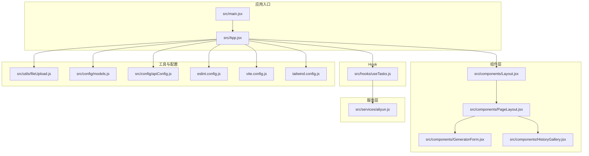
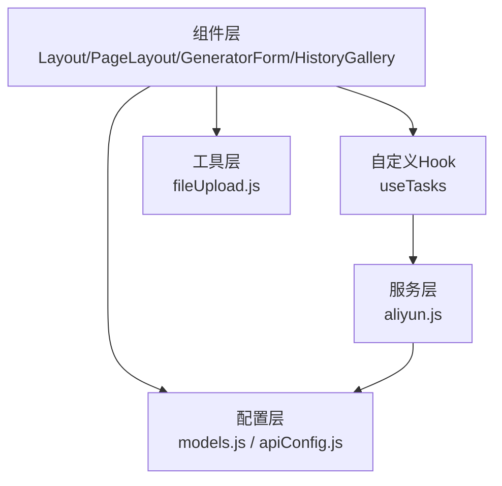
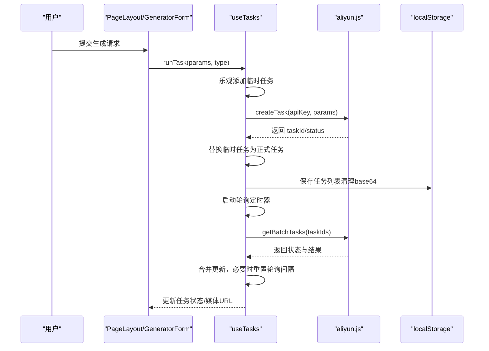
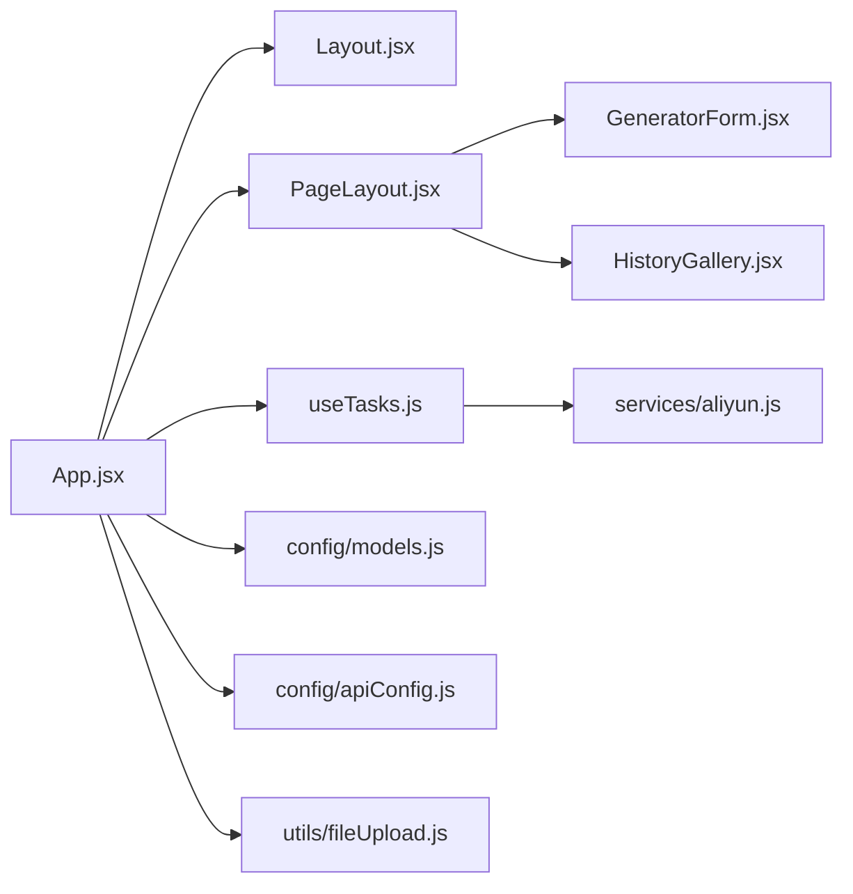

# 代码规范

<cite>
**本文引用的文件**   
- [eslint.config.js](file://eslint.config.js)
- [package.json](file://package.json)
- [src/App.jsx](file://src/App.jsx)
- [src/main.jsx](file://src/main.jsx)
- [src/hooks/useTasks.js](file://src/hooks/useTasks.js)
- [src/components/Layout.jsx](file://src/components/Layout.jsx)
- [src/components/PageLayout.jsx](file://src/components/PageLayout.jsx)
- [src/components/GeneratorForm.jsx](file://src/components/GeneratorForm.jsx)
- [src/components/HistoryGallery.jsx](file://src/components/HistoryGallery.jsx)
- [src/services/aliyun.js](file://src/services/aliyun.js)
- [src/utils/fileUpload.js](file://src/utils/fileUpload.js)
- [src/config/models.js](file://src/config/models.js)
- [src/config/apiConfig.js](file://src/config/apiConfig.js)
- [vite.config.js](file://vite.config.js)
- [tailwind.config.js](file://tailwind.config.js)
</cite>

## 目录
1. [引言](#引言)
2. [项目结构](#项目结构)
3. [核心组件](#核心组件)
4. [架构总览](#架构总览)
5. [详细组件分析](#详细组件分析)
6. [依赖分析](#依赖分析)
7. [性能考虑](#性能考虑)
8. [故障排查指南](#故障排查指南)
9. [结论](#结论)
10. [附录](#附录)

## 引言
本文件面向通义万相前端应用，提供系统化的代码规范与最佳实践，覆盖 ESLint 规则、JavaScript/JSX 语法、变量命名、函数定义、组件编写、React Hooks 使用、注释标准、文件组织、全局变量与模块导入、一致性与可读性维护等方面。文档同时给出流程图与时序图，帮助读者从整体到细节理解并落地规范。

## 项目结构
项目采用按功能域分层的目录组织方式：
- src/components：可复用 UI 组件与页面布局
- src/hooks：自定义 Hook
- src/services：与后端交互的业务封装
- src/utils：通用工具函数
- src/config：配置常量与模型注册
- 根级配置：Vite、Tailwind、ESLint、包管理脚本

图表来源
- [src/main.jsx](file://src/main.jsx#L1-L11)
- [src/App.jsx](file://src/App.jsx#L1-L377)
- [src/components/Layout.jsx](file://src/components/Layout.jsx#L1-L94)
- [src/components/PageLayout.jsx](file://src/components/PageLayout.jsx#L1-L76)
- [src/components/GeneratorForm.jsx](file://src/components/GeneratorForm.jsx#L1-L208)
- [src/components/HistoryGallery.jsx](file://src/components/HistoryGallery.jsx#L1-L68)
- [src/hooks/useTasks.js](file://src/hooks/useTasks.js#L1-L333)
- [src/services/aliyun.js](file://src/services/aliyun.js#L1-L215)
- [src/utils/fileUpload.js](file://src/utils/fileUpload.js#L1-L182)
- [src/config/models.js](file://src/config/models.js#L1-L1012)
- [src/config/apiConfig.js](file://src/config/apiConfig.js#L1-L35)
- [eslint.config.js](file://eslint.config.js#L1-L30)
- [vite.config.js](file://vite.config.js#L1-L23)
- [tailwind.config.js](file://tailwind.config.js#L1-L12)

章节来源
- [src/main.jsx](file://src/main.jsx#L1-L11)
- [src/App.jsx](file://src/App.jsx#L1-L377)
- [eslint.config.js](file://eslint.config.js#L1-L30)
- [vite.config.js](file://vite.config.js#L1-L23)
- [tailwind.config.js](file://tailwind.config.js#L1-L12)

## 核心组件
- 应用根组件负责路由式内容渲染与全局状态管理，统一调度各功能页。
- 页面布局组件提供标题、描述、生成表单与历史记录区，支持折叠与缓存过滤结果。
- 生成表单组件集中管理提示词、模型与分辨率选择，提交时构建标准化参数。
- 历史画廊组件展示任务列表，支持全屏查看与前后切换。
- 自定义 Hook 封装任务生命周期、轮询策略、本地存储与重试逻辑。
- 服务层统一封装创建任务、轮询状态与批量查询，含超时与重试机制。
- 工具层提供文件上传、压缩、校验与类型处理，适配多源输入。
- 配置层提供模型清单、协议、分辨率标签、超时与轮询策略等常量。

章节来源
- [src/App.jsx](file://src/App.jsx#L1-L377)
- [src/components/PageLayout.jsx](file://src/components/PageLayout.jsx#L1-L76)
- [src/components/GeneratorForm.jsx](file://src/components/GeneratorForm.jsx#L1-L208)
- [src/components/HistoryGallery.jsx](file://src/components/HistoryGallery.jsx#L1-L68)
- [src/hooks/useTasks.js](file://src/hooks/useTasks.js#L1-L333)
- [src/services/aliyun.js](file://src/services/aliyun.js#L1-L215)
- [src/utils/fileUpload.js](file://src/utils/fileUpload.js#L1-L182)
- [src/config/models.js](file://src/config/models.js#L1-L1012)
- [src/config/apiConfig.js](file://src/config/apiConfig.js#L1-L35)

## 架构总览
应用采用“组件-服务-Hook-配置-工具”的分层架构，组件负责视图与交互；Hook 抽象状态与副作用；服务层封装网络与轮询；配置与工具提供常量与通用能力。

图表来源
- [src/components/Layout.jsx](file://src/components/Layout.jsx#L1-L94)
- [src/components/PageLayout.jsx](file://src/components/PageLayout.jsx#L1-L76)
- [src/components/GeneratorForm.jsx](file://src/components/GeneratorForm.jsx#L1-L208)
- [src/components/HistoryGallery.jsx](file://src/components/HistoryGallery.jsx#L1-L68)
- [src/hooks/useTasks.js](file://src/hooks/useTasks.js#L1-L333)
- [src/services/aliyun.js](file://src/services/aliyun.js#L1-L215)
- [src/config/models.js](file://src/config/models.js#L1-L1012)
- [src/config/apiConfig.js](file://src/config/apiConfig.js#L1-L35)
- [src/utils/fileUpload.js](file://src/utils/fileUpload.js#L1-L182)

## 详细组件分析

### ESLint 配置与规则
- 继承官方推荐规则集，启用 React Hooks 与 React Refresh 插件，统一语言特性与模块解析。
- 全局禁用 dist 目录，避免误 lint 构建产物。
- 语言选项启用最新 ECMAScript 与 JSX 支持，浏览器全局可用。
- 规则示例：允许忽略大写下划线命名的未使用变量（常用于常量或占位符），便于在特定场景下减少噪音。

章节来源
- [eslint.config.js](file://eslint.config.js#L1-L30)
- [package.json](file://package.json#L1-L33)

### JavaScript/JSX 语法规范
- 文件头部统一声明模块化与严格模式，避免隐式全局变量。
- 组件导出统一使用默认导出，便于按需引入与 Tree-shaking。
- JSX 中属性值使用双引号，布尔值与空值显式写出，避免缩写歧义。
- 事件处理器与回调函数使用箭头函数或 useCallback 包裹，避免重复创建导致的重渲染。
- 条件渲染与三元表达式保持简洁，复杂逻辑抽取为变量或辅助函数。

章节来源
- [src/App.jsx](file://src/App.jsx#L1-L377)
- [src/main.jsx](file://src/main.jsx#L1-L11)
- [src/components/Layout.jsx](file://src/components/Layout.jsx#L1-L94)
- [src/components/PageLayout.jsx](file://src/components/PageLayout.jsx#L1-L76)
- [src/components/GeneratorForm.jsx](file://src/components/GeneratorForm.jsx#L1-L208)
- [src/components/HistoryGallery.jsx](file://src/components/HistoryGallery.jsx#L1-L68)

### 变量命名约定
- 常量使用全大写下划线分隔（如 API 常量、配置键），体现不可变性。
- 函数与组件名使用帕斯卡命名（如 GeneratorForm、useTasks），组件首字母大写。
- 私有变量与内部状态使用驼峰命名，避免与全局变量冲突。
- 临时变量与循环索引可使用单字母（如 i、j），在复杂作用域内使用更具描述性的名称。

章节来源
- [src/config/apiConfig.js](file://src/config/apiConfig.js#L1-L35)
- [src/hooks/useTasks.js](file://src/hooks/useTasks.js#L1-L333)

### 函数定义标准
- 导出函数优先使用具名函数，便于调试与堆栈追踪。
- 异步函数统一使用 async/await，错误通过 try/catch 或 Promise.catch 处理。
- 参数对象解构时提供默认值，避免 undefined 访问。
- 纯函数优先，副作用集中在 Hook 或服务层，保持组件渲染逻辑纯净。

章节来源
- [src/services/aliyun.js](file://src/services/aliyun.js#L1-L215)
- [src/utils/fileUpload.js](file://src/utils/fileUpload.js#L1-L182)
- [src/hooks/useTasks.js](file://src/hooks/useTasks.js#L1-L333)

### 组件编写规范
- 组件职责单一，通过 props 传递数据与回调，避免跨层级共享状态。
- 使用 memo 包装纯展示组件，减少不必要重渲染（如 HistoryGallery）。
- 表单组件集中管理状态，提交时统一构建参数对象，保证一致性。
- 使用 useMemo 缓存昂贵计算（如过滤任务列表），降低渲染成本。

章节来源
- [src/components/HistoryGallery.jsx](file://src/components/HistoryGallery.jsx#L1-L68)
- [src/components/PageLayout.jsx](file://src/components/PageLayout.jsx#L1-L76)
- [src/components/GeneratorForm.jsx](file://src/components/GeneratorForm.jsx#L1-L208)

### React Hooks 使用规范
- useState 用于本地 UI 状态，useEffect 用于副作用，useMemo/useCallback 用于性能优化。
- 自定义 Hook 返回稳定接口（如 runTask/retryTask/updateTask/deleteTask），便于复用与测试。
- 在 Hook 内部使用 useRef 存储定时器与轮询计数，避免闭包陷阱。
- 轮询策略根据任务年龄与轮询次数动态调整，避免过度请求。

图表来源
- [src/hooks/useTasks.js](file://src/hooks/useTasks.js#L1-L333)
- [src/services/aliyun.js](file://src/services/aliyun.js#L1-L215)
- [src/components/PageLayout.jsx](file://src/components/PageLayout.jsx#L1-L76)
- [src/components/GeneratorForm.jsx](file://src/components/GeneratorForm.jsx#L1-L208)

章节来源
- [src/hooks/useTasks.js](file://src/hooks/useTasks.js#L1-L333)
- [src/services/aliyun.js](file://src/services/aliyun.js#L1-L215)

### 代码注释标准
- 公共函数与组件提供 JSDoc 风格注释，说明入参、返回值与异常。
- 复杂逻辑分段注释，解释关键分支与边界条件。
- 开发环境专用日志仅在开发模式输出，避免生产污染。

章节来源
- [src/services/aliyun.js](file://src/services/aliyun.js#L1-L215)
- [src/hooks/useTasks.js](file://src/hooks/useTasks.js#L1-L333)

### 文件组织结构
- 组件按功能域划分，公共布局与页面布局分离，生成器与历史区独立。
- Hook 与服务层分离，避免组件耦合业务逻辑。
- 配置集中管理，常量与模型注册分离，便于维护与扩展。
- 工具函数单一职责，避免跨模块依赖。

章节来源
- [src/components/Layout.jsx](file://src/components/Layout.jsx#L1-L94)
- [src/components/PageLayout.jsx](file://src/components/PageLayout.jsx#L1-L76)
- [src/hooks/useTasks.js](file://src/hooks/useTasks.js#L1-L333)
- [src/config/models.js](file://src/config/models.js#L1-L1012)
- [src/config/apiConfig.js](file://src/config/apiConfig.js#L1-L35)

### 全局变量与模块导入最佳实践
- 全局变量尽量通过 props 或 Context 注入，避免直接访问 window/global。
- 模块导入遵循“分层依赖”原则：组件只依赖 Hook/工具；Hook 依赖服务；服务依赖配置。
- 第三方库与工具函数集中引入，避免重复导入与命名冲突。
- 代理与环境变量在 Vite/Tailwind 中统一配置，避免硬编码。

章节来源
- [vite.config.js](file://vite.config.js#L1-L23)
- [tailwind.config.js](file://tailwind.config.js#L1-L12)
- [src/services/aliyun.js](file://src/services/aliyun.js#L1-L215)

### 维护一致性与可读性
- 统一 ESLint 规则与格式化策略，结合 CI 强制执行。
- 组件与 Hook 的命名与职责保持一致，避免“上帝组件”。
- 事件处理与状态更新路径清晰，避免深层嵌套与重复逻辑。

章节来源
- [eslint.config.js](file://eslint.config.js#L1-L30)
- [src/App.jsx](file://src/App.jsx#L1-L377)

## 依赖分析
- 依赖关系清晰：组件依赖 Hook/工具；Hook 依赖服务；服务依赖配置。
- 无循环依赖迹象，模块边界明确。
- 第三方依赖集中在 package.json，开发与运行时分离。

图表来源
- [src/App.jsx](file://src/App.jsx#L1-L377)
- [src/components/Layout.jsx](file://src/components/Layout.jsx#L1-L94)
- [src/components/PageLayout.jsx](file://src/components/PageLayout.jsx#L1-L76)
- [src/components/GeneratorForm.jsx](file://src/components/GeneratorForm.jsx#L1-L208)
- [src/components/HistoryGallery.jsx](file://src/components/HistoryGallery.jsx#L1-L68)
- [src/hooks/useTasks.js](file://src/hooks/useTasks.js#L1-L333)
- [src/services/aliyun.js](file://src/services/aliyun.js#L1-L215)
- [src/utils/fileUpload.js](file://src/utils/fileUpload.js#L1-L182)
- [src/config/models.js](file://src/config/models.js#L1-L1012)
- [src/config/apiConfig.js](file://src/config/apiConfig.js#L1-L35)

章节来源
- [package.json](file://package.json#L1-L33)

## 性能考虑
- 使用 useMemo 缓存过滤后的任务列表，避免每次渲染都重新计算。
- 使用 useCallback 包裹轮询回调，减少子组件重渲染。
- 本地存储任务时清理 base64 数据，限制容量并定期裁剪。
- 轮询策略自适应：新任务高频轮询，长时间任务降低频率，平衡实时性与资源消耗。

章节来源
- [src/hooks/useTasks.js](file://src/hooks/useTasks.js#L1-L333)
- [src/components/PageLayout.jsx](file://src/components/PageLayout.jsx#L1-L76)

## 故障排查指南
- 任务状态异常：检查轮询返回结构与状态机转换，确认媒体 URL 是否存在再标记成功。
- 超时与网络错误：区分请求超时与轮询超时，分别处理并提示用户。
- 本地存储溢出：捕获配额异常，回退至最近 N 条记录。
- 文件上传失败：检查类型、大小与压缩逻辑，提供明确错误信息。

章节来源
- [src/services/aliyun.js](file://src/services/aliyun.js#L1-L215)
- [src/hooks/useTasks.js](file://src/hooks/useTasks.js#L1-L333)
- [src/utils/fileUpload.js](file://src/utils/fileUpload.js#L1-L182)

## 结论
本规范以 ESLint 为基础，结合组件、Hook、服务与配置的分层设计，形成从语法到架构的完整约束。建议团队在开发中严格遵循命名、注释与文件组织规范，配合性能优化与错误处理策略，持续提升代码一致性与可维护性。

## 附录

### 代码示例（路径指引）
- 正确写法：组件结构与状态管理
  - [src/components/PageLayout.jsx](file://src/components/PageLayout.jsx#L1-L76)
  - [src/components/GeneratorForm.jsx](file://src/components/GeneratorForm.jsx#L1-L208)
- 正确写法：Hook 使用与轮询策略
  - [src/hooks/useTasks.js](file://src/hooks/useTasks.js#L1-L333)
- 正确写法：服务层封装与超时/重试
  - [src/services/aliyun.js](file://src/services/aliyun.js#L1-L215)
- 正确写法：工具函数与文件处理
  - [src/utils/fileUpload.js](file://src/utils/fileUpload.js#L1-L182)
- 正确写法：配置常量与模型注册
  - [src/config/apiConfig.js](file://src/config/apiConfig.js#L1-L35)
  - [src/config/models.js](file://src/config/models.js#L1-L1012)