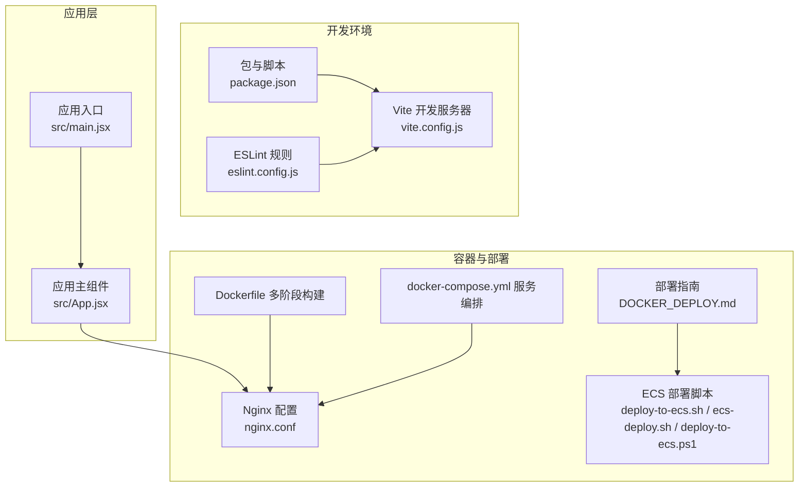
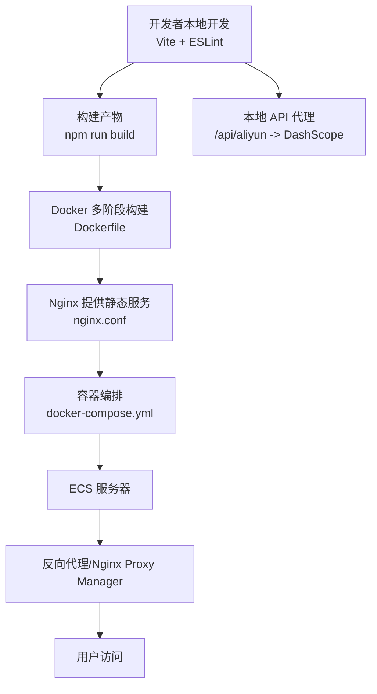
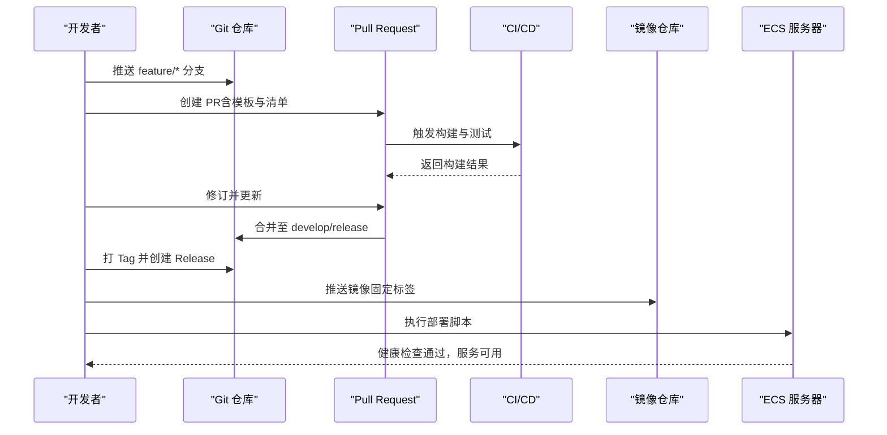
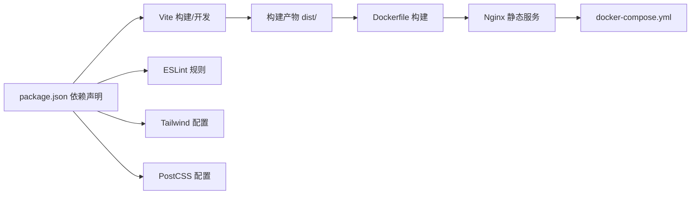

# 团队协作

<cite>
**本文引用的文件**
- [README.md](file://README.md)
- [package.json](file://package.json)
- [eslint.config.js](file://eslint.config.js)
- [vite.config.js](file://vite.config.js)
- [Dockerfile](file://Dockerfile)
- [docker-compose.yml](file://docker-compose.yml)
- [nginx.conf](file://nginx.conf)
- [tailwind.config.js](file://tailwind.config.js)
- [postcss.config.js](file://postcss.config.js)
- [DOCKER_DEPLOY.md](file://DOCKER_DEPLOY.md)
- [deploy-to-ecs.sh](file://deploy-to-ecs.sh)
- [ecs-deploy.sh](file://ecs-deploy.sh)
- [deploy-to-ecs.ps1](file://deploy-to-ecs.ps1)
- [src/App.jsx](file://src/App.jsx)
- [src/main.jsx](file://src/main.jsx)
</cite>

## 目录
1. [引言](#引言)
2. [项目结构](#项目结构)
3. [核心组件](#核心组件)
4. [架构总览](#架构总览)
5. [详细组件分析](#详细组件分析)
6. [依赖分析](#依赖分析)
7. [性能考虑](#性能考虑)
8. [故障排查指南](#故障排查指南)
9. [结论](#结论)
10. [附录](#附录)

## 引言
本文件面向通义万相前端团队，旨在建立统一的协作规范，覆盖 Git 工作流与分支管理、代码审查流程、版本发布与部署策略、文档与知识管理以及远程协作工具的使用。当前仓库以 React + Vite 为基础，采用多阶段 Docker 构建与 Nginx 提供静态服务，结合本地开发代理与 ECS 远程部署脚本，形成从开发到生产的完整流水线。

## 项目结构
- 顶层配置与构建
  - 包管理与脚本：通过 package.json 统一管理依赖与脚本（开发、构建、预览、ESLint 检查）。
  - Lint 规则：eslint.config.js 集成推荐规则与 React Hooks、React Refresh 插件。
  - 构建工具：vite.config.js 提供 React 插件与本地开发服务器配置，含 /api/aliyun 代理。
  - 样式框架：tailwind.config.js 与 postcss.config.js 配合 PostCSS 与 Tailwind。
- 应用入口与页面组织
  - src/main.jsx 作为应用入口，渲染根组件。
  - src/App.jsx 负责路由式页面内容切换与任务统一调度，配合 PageLayout 与各功能组件。
- 容器化与部署
  - Dockerfile 多阶段构建，Nginx 提供静态服务与 API 代理。
  - docker-compose.yml 定义服务、端口映射、健康检查与环境变量。
  - nginx.conf 提供 API 代理、CORS、缓存策略与 SPA 回退。
  - DOCKER_DEPLOY.md 提供 Docker 部署的完整操作指南与故障排查。
  - 部署脚本：deploy-to-ecs.sh、ecs-deploy.sh、deploy-to-ecs.ps1 支持本地到 ECS 的自动化部署。

**图表来源**
- [vite.config.js](file://vite.config.js#L1-L23)
- [eslint.config.js](file://eslint.config.js#L1-L30)
- [package.json](file://package.json#L1-L33)
- [src/main.jsx](file://src/main.jsx#L1-L11)
- [src/App.jsx](file://src/App.jsx#L1-L377)
- [Dockerfile](file://Dockerfile#L1-L36)
- [docker-compose.yml](file://docker-compose.yml#L1-L23)
- [nginx.conf](file://nginx.conf#L1-L80)
- [DOCKER_DEPLOY.md](file://DOCKER_DEPLOY.md#L1-L303)
- [deploy-to-ecs.sh](file://deploy-to-ecs.sh#L1-L103)
- [ecs-deploy.sh](file://ecs-deploy.sh#L1-L75)
- [deploy-to-ecs.ps1](file://deploy-to-ecs.ps1#L1-L70)

**章节来源**
- [README.md](file://README.md#L1-L17)
- [package.json](file://package.json#L1-L33)
- [eslint.config.js](file://eslint.config.js#L1-L30)
- [vite.config.js](file://vite.config.js#L1-L23)
- [tailwind.config.js](file://tailwind.config.js#L1-L12)
- [postcss.config.js](file://postcss.config.js#L1-L7)
- [src/main.jsx](file://src/main.jsx#L1-L11)
- [src/App.jsx](file://src/App.jsx#L1-L377)
- [Dockerfile](file://Dockerfile#L1-L36)
- [docker-compose.yml](file://docker-compose.yml#L1-L23)
- [nginx.conf](file://nginx.conf#L1-L80)
- [DOCKER_DEPLOY.md](file://DOCKER_DEPLOY.md#L1-L303)
- [deploy-to-ecs.sh](file://deploy-to-ecs.sh#L1-L103)
- [ecs-deploy.sh](file://ecs-deploy.sh#L1-L75)
- [deploy-to-ecs.ps1](file://deploy-to-ecs.ps1#L1-L70)

## 核心组件
- 应用入口与渲染
  - src/main.jsx 负责创建根节点并渲染 App。
- 应用主组件与页面路由
  - src/App.jsx 通过状态管理切换不同功能页面（文生视频、图生视频、图像编辑等），统一调度任务与错误提示。
- 开发与代理
  - vite.config.js 提供本地开发服务器与 /api/aliyun 代理，便于联调后端接口。
- 容器与静态服务
  - Dockerfile 多阶段构建，Nginx 提供静态资源服务与 API 代理；docker-compose.yml 定义服务与健康检查。
- 部署与运维
  - DOCKER_DEPLOY.md 提供部署步骤、端口映射、HTTPS、日志与健康检查等生产建议；ECS 脚本支持自动化部署与反向代理配置。

**章节来源**
- [src/main.jsx](file://src/main.jsx#L1-L11)
- [src/App.jsx](file://src/App.jsx#L1-L377)
- [vite.config.js](file://vite.config.js#L1-L23)
- [Dockerfile](file://Dockerfile#L1-L36)
- [docker-compose.yml](file://docker-compose.yml#L1-L23)
- [nginx.conf](file://nginx.conf#L1-L80)
- [DOCKER_DEPLOY.md](file://DOCKER_DEPLOY.md#L1-L303)
- [deploy-to-ecs.sh](file://deploy-to-ecs.sh#L1-L103)
- [ecs-deploy.sh](file://ecs-deploy.sh#L1-L75)
- [deploy-to-ecs.ps1](file://deploy-to-ecs.ps1#L1-L70)

## 架构总览
下图展示从前端开发到生产部署的关键路径：本地开发（Vite）→ 本地代理 → 构建产物 → Docker 多阶段构建 → Nginx 静态服务 → ECS 部署与反向代理。

**图表来源**
- [vite.config.js](file://vite.config.js#L1-L23)
- [Dockerfile](file://Dockerfile#L1-L36)
- [nginx.conf](file://nginx.conf#L1-L80)
- [docker-compose.yml](file://docker-compose.yml#L1-L23)
- [DOCKER_DEPLOY.md](file://DOCKER_DEPLOY.md#L1-L303)
- [deploy-to-ecs.sh](file://deploy-to-ecs.sh#L1-L103)
- [ecs-deploy.sh](file://ecs-deploy.sh#L1-L75)
- [deploy-to-ecs.ps1](file://deploy-to-ecs.ps1#L1-L70)

## 详细组件分析

### Git 工作流与分支管理策略
- 分支命名与职责
  - feature/*：用于新功能开发，命名示例：feature/video-generation。
  - develop：集成分支，合并 feature/* 后进入集成测试。
  - release/*：发布分支，准备版本号、变更日志与最终验证。
  - hotfix/*：紧急修复分支，从 master 切出，修复后同时合并回 master 与 develop。
- 合并与保护
  - develop 与 master 建议启用分支保护规则（禁止直接推送、强制 PR 合并、要求 CI 通过）。
  - feature/* 合并前必须通过 ESLint、构建与端到端测试。
- 提交信息规范
  - 类型：feat、fix、docs、style、refactor、perf、test、build、ci、chore、revert。
  - 示例：feat(video): 新增文生视频生成能力；fix(eslint): 修复规则冲突。
- 版本与标签
  - 使用语义化版本（MAJOR.MINOR.PATCH），发布时打 Tag 并创建 Release Notes。

[本节为通用规范说明，无需特定文件引用]

### 代码审查流程与标准
- Pull Request 模板
  - 标题：类型/模块: 简要描述（遵循提交规范）。
  - 摘要：变更动机、影响范围、风险评估。
  - 测试：新增/修改的测试用例与验证结果。
  - 截图/演示：UI 变更提供截图或 GIF。
  - 关联 Issue：关联 GitHub Issues 编号。
- 审查清单
  - 代码质量：是否通过 ESLint、无未使用变量、函数命名清晰。
  - 功能正确性：逻辑是否完整、边界条件处理、错误提示友好。
  - 性能与安全：避免阻塞主线程、内存泄漏、敏感信息硬编码。
  - 文档与注释：新增功能补充 README 或注释。
  - 兼容性：对现有功能无破坏性变更。
- 反馈处理
  - 审查意见需逐条回复并修订，修订后重新触发 CI。
  - 大改动建议拆分 PR，降低审查成本。

[本节为通用规范说明，无需特定文件引用]

### 版本发布流程与部署策略
- 语义化版本控制
  - MAJOR：破坏性变更；MINOR：新增功能但兼容；PATCH：修复缺陷。
  - 发布前更新版本号与 CHANGELOG，打 Tag 并推送。
- 变更日志维护
  - 按版本分段，记录 feat、fix、breaking changes、deprecated 等。
  - 与 PR 对齐，便于回溯与审计。
- 回滚机制
  - Docker 镜像使用固定标签，回滚时切换镜像版本或容器重启。
  - ECS 部署脚本支持一键停止、删除旧容器并启动新容器。
- 部署策略
  - 本地开发：npm run dev；构建：npm run build；预览：npm run preview。
  - 容器化部署：docker-compose up -d 或 docker run；健康检查与日志监控。
  - ECS 自动化：deploy-to-ecs.sh/ecs-deploy.sh 一键构建与启动；配合 Nginx 反向代理。

**图表来源**
- [DOCKER_DEPLOY.md](file://DOCKER_DEPLOY.md#L264-L278)
- [deploy-to-ecs.sh](file://deploy-to-ecs.sh#L1-L103)
- [ecs-deploy.sh](file://ecs-deploy.sh#L1-L75)
- [docker-compose.yml](file://docker-compose.yml#L1-L23)

**章节来源**
- [DOCKER_DEPLOY.md](file://DOCKER_DEPLOY.md#L1-L303)
- [deploy-to-ecs.sh](file://deploy-to-ecs.sh#L1-L103)
- [ecs-deploy.sh](file://ecs-deploy.sh#L1-L75)
- [docker-compose.yml](file://docker-compose.yml#L1-L23)

### 文档编写与知识管理规范
- API 文档
  - 本地代理：/api/aliyun 代理 DashScope，需在 nginx.conf 中维护代理头与 CORS。
  - 变更时同步更新代理规则与错误处理。
- 架构决策记录（ADR）
  - 记录技术选型（如 Vite、Tailwind、Docker 多阶段构建）与权衡。
  - 问题、方案、后果与后续演进。
- 最佳实践分享
  - ESLint 规则与 React Hooks/Refresh 插件组合，提升代码一致性。
  - 组件按功能拆分（Generator、Editor、Layout 等），减少耦合。
  - 使用 localStorage 管理 API Key，避免硬编码与泄露。

**章节来源**
- [nginx.conf](file://nginx.conf#L1-L80)
- [eslint.config.js](file://eslint.config.js#L1-L30)
- [src/App.jsx](file://src/App.jsx#L1-L377)

### 远程协作工具使用指南
- Slack
  - 用于日常沟通、进度同步与问题讨论；建议设置开发、测试、运维频道。
- GitHub Issues
  - Bug、需求、技术债均以 Issue 管理；与 PR 关联，便于追踪。
- Confluence（或企业知识库）
  - 存放架构文档、ADR、部署手册与常见问题；与仓库 README/DOCKER_DEPLOY.md 协同维护。

[本节为通用规范说明，无需特定文件引用]

## 依赖分析
- 开发依赖
  - Vite、React 插件、ESLint、TailwindCSS、PostCSS 等，共同支撑开发体验与样式体系。
- 运行时依赖
  - React、ReactDOM、lucide-react，提供 UI 与交互基础。
- 构建与部署
  - Docker 多阶段构建减少镜像体积；Nginx 提供静态服务与代理；docker-compose 管理服务生命周期。

**图表来源**
- [package.json](file://package.json#L1-L33)
- [vite.config.js](file://vite.config.js#L1-L23)
- [eslint.config.js](file://eslint.config.js#L1-L30)
- [tailwind.config.js](file://tailwind.config.js#L1-L12)
- [postcss.config.js](file://postcss.config.js#L1-L7)
- [Dockerfile](file://Dockerfile#L1-L36)
- [docker-compose.yml](file://docker-compose.yml#L1-L23)

**章节来源**
- [package.json](file://package.json#L1-L33)
- [vite.config.js](file://vite.config.js#L1-L23)
- [eslint.config.js](file://eslint.config.js#L1-L30)
- [tailwind.config.js](file://tailwind.config.js#L1-L12)
- [postcss.config.js](file://postcss.config.js#L1-L7)
- [Dockerfile](file://Dockerfile#L1-L36)
- [docker-compose.yml](file://docker-compose.yml#L1-L23)

## 性能考虑
- 构建与缓存
  - 多阶段构建减少镜像体积；合理利用 Nginx 缓存策略（短期 JS/CSS、长期静态资源）。
- 代理与网络
  - 本地开发代理减少跨域与证书问题；生产环境代理头与超时配置需稳定可靠。
- 容器健康与可观测
  - docker-compose 健康检查与日志驱动配置，便于快速定位问题。

[本节为通用指导，无需特定文件引用]

## 故障排查指南
- 构建失败
  - 清理缓存后重建：docker-compose build --no-cache。
- 容器启动失败
  - 检查端口占用并调整映射；确认 docker-compose.yml 环境变量与健康检查。
- API 代理异常
  - 检查 Nginx 配置与代理头；查看容器内 Nginx 错误日志；测试外部连通性。
- 静态资源加载失败
  - 确认 dist 目录生成；查看 Nginx 访问日志；必要时重新构建。
- ECS 部署问题
  - 使用 deploy-to-ecs.sh/ecs-deploy.sh 检查容器状态与日志；确认反向代理配置。

**章节来源**
- [DOCKER_DEPLOY.md](file://DOCKER_DEPLOY.md#L122-L303)
- [deploy-to-ecs.sh](file://deploy-to-ecs.sh#L1-L103)
- [ecs-deploy.sh](file://ecs-deploy.sh#L1-L75)
- [nginx.conf](file://nginx.conf#L1-L80)

## 结论
本规范以现有仓库配置为基础，结合容器化与自动化部署脚本，形成从开发、构建、测试到上线的闭环协作流程。建议团队在实际执行中持续完善 PR 模板与审查清单，严格执行语义化版本与变更日志管理，并通过 Slack/GitHub Issues/Confluence 形成高效的知识共享与问题跟踪机制。

## 附录
- 快速命令参考
  - 开发：npm run dev
  - 构建：npm run build
  - 预览：npm run preview
  - ESLint：npm run lint
  - 容器：docker-compose up -d / down
  - ECS：./deploy-to-ecs.sh 或 ./ecs-deploy.sh

[本节为通用附录，无需特定文件引用]