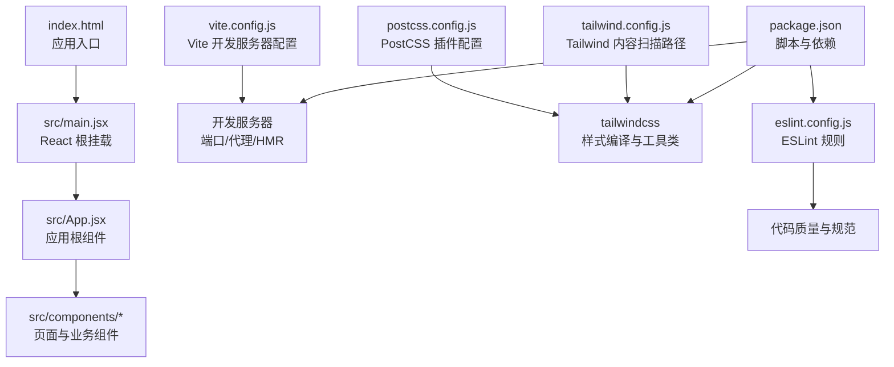
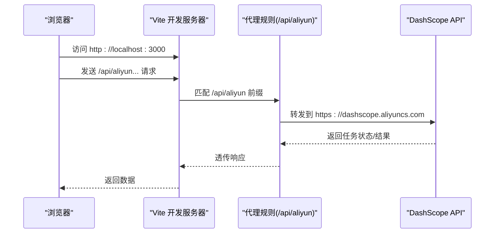
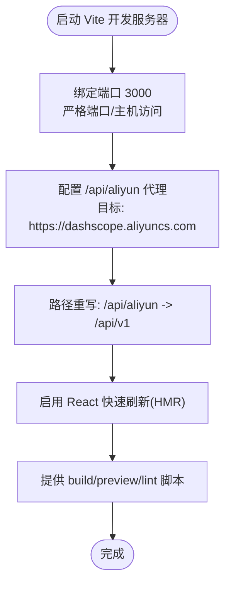
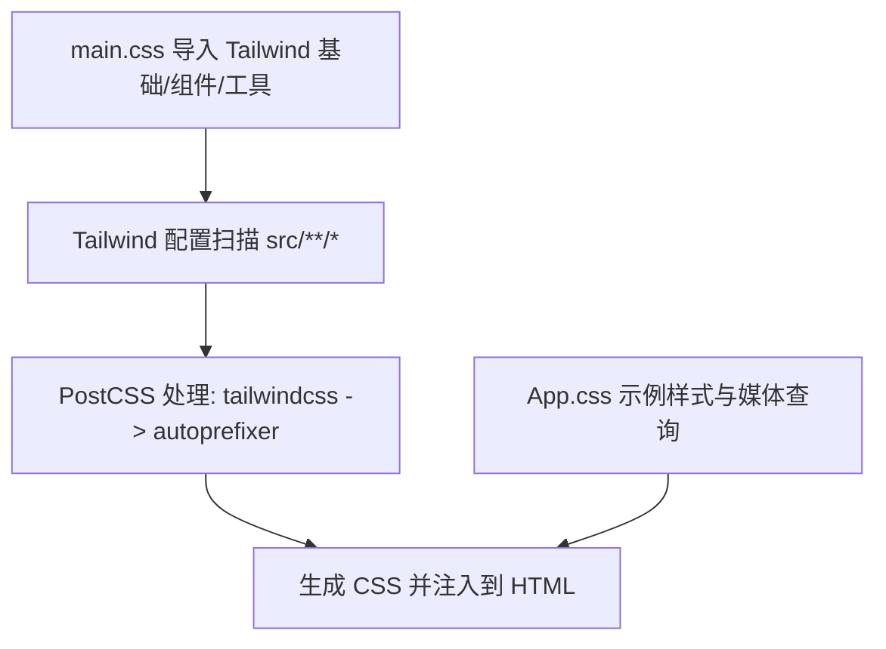
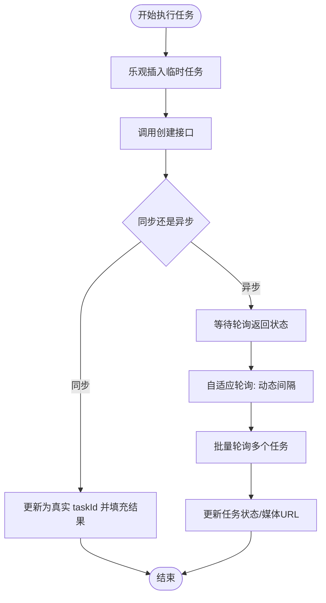
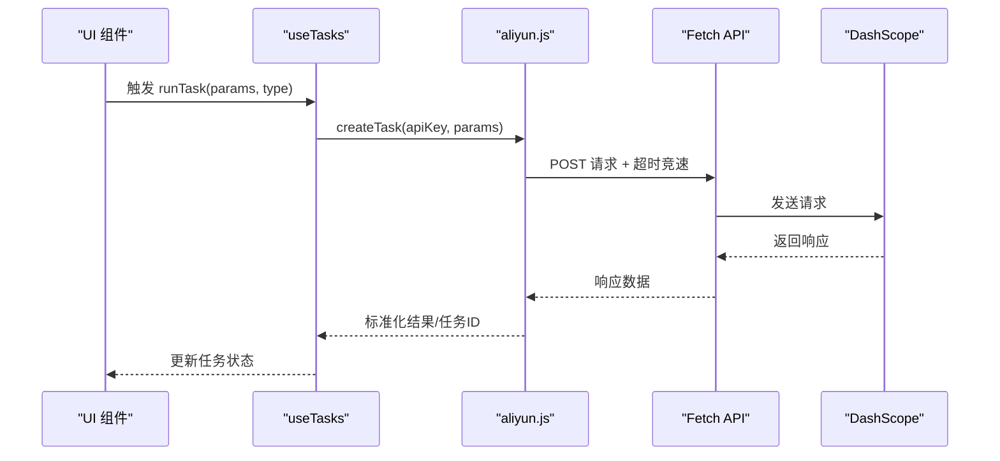
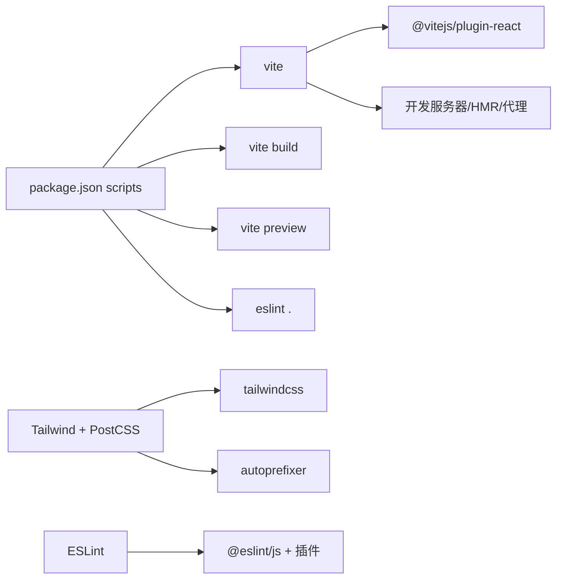

# 开发工具

<cite>
**本文引用的文件**
- [vite.config.js](file://vite.config.js)
- [package.json](file://package.json)
- [postcss.config.js](file://postcss.config.js)
- [tailwind.config.js](file://tailwind.config.js)
- [eslint.config.js](file://eslint.config.js)
- [index.html](file://index.html)
- [src/main.jsx](file://src/main.jsx)
- [src/App.jsx](file://src/App.jsx)
- [src/main.css](file://src/main.css)
- [src/App.css](file://src/App.css)
- [src/hooks/useTasks.js](file://src/hooks/useTasks.js)
- [src/services/aliyun.js](file://src/services/aliyun.js)
- [src/config/apiConfig.js](file://src/config/apiConfig.js)
- [README.md](file://README.md)
</cite>

## 目录
1. [简介](#简介)
2. [项目结构](#项目结构)
3. [核心组件](#核心组件)
4. [架构总览](#架构总览)
5. [详细组件分析](#详细组件分析)
6. [依赖关系分析](#依赖关系分析)
7. [性能注意事项](#性能注意事项)
8. [故障排查指南](#故障排查指南)
9. [结论](#结论)
10. [附录](#附录)

## 简介
本指南面向通义万相前端应用的开发团队，系统性介绍开发工具链的配置与使用，重点覆盖以下方面：
- Vite 开发服务器配置与使用：端口、严格端口、主机绑定、代理规则与热重载机制
- 构建优化与脚本命令
- PostCSS 与 Tailwind CSS 的集成：样式编译、自动前缀与响应式设计支持
- 开发环境安装与配置：Node.js 版本要求、依赖安装、环境变量与本地代理
- 调试工具：浏览器开发者工具、React DevTools、网络请求监控与日志定位

## 项目结构
该前端项目采用 React + Vite 技术栈，配合 Tailwind CSS 实现样式体系，ESLint 提供代码质量保障。核心入口为 HTML 页面与 React 根组件，样式通过 Tailwind CSS 的基础层与工具类组织。

图表来源
- [index.html](file://index.html#L1-L14)
- [src/main.jsx](file://src/main.jsx#L1-L11)
- [src/App.jsx](file://src/App.jsx#L1-L377)
- [vite.config.js](file://vite.config.js#L1-L23)
- [postcss.config.js](file://postcss.config.js#L1-L7)
- [tailwind.config.js](file://tailwind.config.js#L1-L12)
- [eslint.config.js](file://eslint.config.js#L1-L30)
- [package.json](file://package.json#L1-L33)

章节来源
- [index.html](file://index.html#L1-L14)
- [src/main.jsx](file://src/main.jsx#L1-L11)
- [src/App.jsx](file://src/App.jsx#L1-L377)
- [vite.config.js](file://vite.config.js#L1-L23)
- [postcss.config.js](file://postcss.config.js#L1-L7)
- [tailwind.config.js](file://tailwind.config.js#L1-L12)
- [eslint.config.js](file://eslint.config.js#L1-L30)
- [package.json](file://package.json#L1-L33)

## 核心组件
- Vite 开发服务器：提供热重载、严格端口绑定、代理 Aliyun DashScope API
- PostCSS/Tailwind：启用 Tailwind CSS 与 Autoprefixer，支持响应式与工具类
- ESLint：推荐使用 TypeScript 与类型感知规则（模板已给出指引）
- React 组件：App.jsx 作为路由与页面内容渲染中心，配合 hooks/useTasks.js 管理任务状态与轮询

章节来源
- [vite.config.js](file://vite.config.js#L1-L23)
- [postcss.config.js](file://postcss.config.js#L1-L7)
- [tailwind.config.js](file://tailwind.config.js#L1-L12)
- [eslint.config.js](file://eslint.config.js#L1-L30)
- [src/App.jsx](file://src/App.jsx#L1-L377)
- [src/hooks/useTasks.js](file://src/hooks/useTasks.js#L1-L333)

## 架构总览
下图展示从浏览器到后端 API 的请求链路，以及开发服务器如何通过代理转发请求。

图表来源
- [vite.config.js](file://vite.config.js#L13-L20)
- [src/config/apiConfig.js](file://src/config/apiConfig.js#L6-L6)

## 详细组件分析

### Vite 开发服务器配置与使用
- 端口与主机
  - 默认监听端口 3000，严格端口绑定，允许外网访问主机名
- 代理配置
  - 将以 /api/aliyun 开头的请求代理至 DashScope API，并重写路径前缀
  - 允许非安全证书（secure: false）以适配本地开发常见问题
- 热重载机制
  - 使用 @vitejs/plugin-react 提供 React 快速刷新能力
  - 项目模板建议：若启用 React Compiler 可能影响开发与构建性能，模板默认未启用
- 构建与预览
  - 提供 dev/build/preview/lint 脚本，便于本地开发、打包与本地预览

图表来源
- [vite.config.js](file://vite.config.js#L7-L22)
- [README.md](file://README.md#L1-L17)

章节来源
- [vite.config.js](file://vite.config.js#L1-L23)
- [README.md](file://README.md#L1-L17)
- [package.json](file://package.json#L6-L11)

### PostCSS 与 Tailwind CSS 集成
- PostCSS 插件
  - 启用 tailwindcss 与 autoprefixer 插件，实现样式编译与自动前缀
- Tailwind 配置
  - content 扫描范围包含 index.html 与 src 下所有 JS/JSX/TS/TSX 文件
  - 主题与插件保持默认空配置，便于通过工具类扩展
- 样式入口
  - main.css 导入 Tailwind 基础层、组件层与工具层，并引入字体与自定义滚动条动画
  - App.css 提供示例级样式与媒体查询，遵循 prefers-reduced-motion

图表来源
- [src/main.css](file://src/main.css#L1-L54)
- [src/App.css](file://src/App.css#L1-L43)
- [tailwind.config.js](file://tailwind.config.js#L3-L6)
- [postcss.config.js](file://postcss.config.js#L1-L7)

章节来源
- [postcss.config.js](file://postcss.config.js#L1-L7)
- [tailwind.config.js](file://tailwind.config.js#L1-L12)
- [src/main.css](file://src/main.css#L1-L54)
- [src/App.css](file://src/App.css#L1-L43)

### 任务管理与轮询逻辑（调试与性能要点）
- 乐观提交与最终更新：先插入临时任务，再以真实 taskId 替换并补充结果
- 自适应轮询：根据任务创建时间与轮询次数动态调整轮询间隔，减少无效请求
- 批量轮询：并发查询多个任务状态，提升整体吞吐
- 本地存储清理：移除 base64 数据以节省空间，超出配额时仅保留最近若干条

图表来源
- [src/hooks/useTasks.js](file://src/hooks/useTasks.js#L256-L312)
- [src/hooks/useTasks.js](file://src/hooks/useTasks.js#L87-L104)
- [src/hooks/useTasks.js](file://src/hooks/useTasks.js#L164-L246)

章节来源
- [src/hooks/useTasks.js](file://src/hooks/useTasks.js#L1-L333)

### API 服务与错误处理（网络与超时）
- 请求头：统一设置 Authorization 与异步任务头 X-DashScope-Async
- 超时控制：请求与轮询分别设置超时阈值，避免长时间阻塞
- 重试策略：对网络错误与超时进行有限次指数回退重试
- 错误分类：区分模型未知、请求格式错误与网络/超时错误，分别处理

图表来源
- [src/hooks/useTasks.js](file://src/hooks/useTasks.js#L256-L312)
- [src/services/aliyun.js](file://src/services/aliyun.js#L50-L160)
- [src/config/apiConfig.js](file://src/config/apiConfig.js#L9-L19)

章节来源
- [src/services/aliyun.js](file://src/services/aliyun.js#L1-L215)
- [src/config/apiConfig.js](file://src/config/apiConfig.js#L1-L35)

## 依赖关系分析
- 脚本与命令
  - dev/build/preview/lint 分别对应开发、构建、预览与代码检查
- 依赖与插件
  - @vitejs/plugin-react 提供 React 快速刷新
  - tailwindcss、autoprefixer、postcss 提供样式管线
  - eslint 及相关插件提供规则与推荐配置

图表来源
- [package.json](file://package.json#L6-L11)
- [package.json](file://package.json#L17-L31)
- [vite.config.js](file://vite.config.js#L8-L8)
- [postcss.config.js](file://postcss.config.js#L1-L7)
- [eslint.config.js](file://eslint.config.js#L1-L30)

章节来源
- [package.json](file://package.json#L1-L33)
- [eslint.config.js](file://eslint.config.js#L1-L30)

## 性能注意事项
- 自适应轮询：根据任务生命周期动态调整轮询频率，降低无效请求与资源消耗
- 批量轮询：并发查询多个任务状态，缩短整体等待时间
- 本地存储优化：清理 base64 数据与配额保护，避免存储膨胀导致性能下降
- 构建与预览：使用 vite build 与 vite preview 进行生产级验证，确保样式与脚本正确打包

章节来源
- [src/hooks/useTasks.js](file://src/hooks/useTasks.js#L87-L104)
- [src/hooks/useTasks.js](file://src/hooks/useTasks.js#L164-L246)
- [src/hooks/useTasks.js](file://src/hooks/useTasks.js#L31-L84)
- [package.json](file://package.json#L6-L11)

## 故障排查指南
- 端口占用
  - Vite 使用严格端口 3000，若被占用需释放端口或调整配置
- 代理失败
  - 确认 /api/aliyun 代理规则与目标地址匹配；secure: false 用于本地证书问题
- 跨域与证书
  - 若出现 HTTPS 证书校验问题，可在代理中允许 insecure（仅开发环境）
- 网络请求监控
  - 在浏览器开发者工具 Network 面板观察 /api/aliyun 请求与响应
  - 关注超时与重试行为，必要时调整 TIMEOUT 与 RETRY 配置
- 日志定位
  - 开发环境下 aliyn.js 会输出请求与错误日志，便于定位模型未知、格式错误或网络异常
- 任务状态异常
  - 若任务状态长时间不变，检查轮询间隔与批量轮询逻辑；确认任务是否进入完成状态集合

章节来源
- [vite.config.js](file://vite.config.js#L9-L20)
- [src/services/aliyun.js](file://src/services/aliyun.js#L74-L159)
- [src/config/apiConfig.js](file://src/config/apiConfig.js#L9-L27)
- [src/hooks/useTasks.js](file://src/hooks/useTasks.js#L164-L246)

## 结论
本指南围绕 Vite 开发服务器、PostCSS/Tailwind 集成、任务轮询与网络请求处理等方面，提供了从安装到调试的完整实践路径。建议在开发中充分利用代理与自适应轮询机制，结合浏览器与 ESLint 工具链，持续提升开发效率与应用稳定性。

## 附录

### 开发环境安装与配置步骤
- Node.js 版本要求
  - 请使用稳定 LTS 版本的 Node.js（建议 18.x 或 20.x），以确保 Vite、React 与 Tailwind 生态兼容
- 依赖安装
  - 使用包管理器安装依赖后，即可运行开发脚本
- 环境变量
  - 项目通过 /api/aliyun 代理访问 DashScope API，无需额外前端环境变量
- 本地代理与跨域
  - 代理已内置，确保开发环境可直连 DashScope；如遇证书问题，代理已允许 insecure

章节来源
- [package.json](file://package.json#L12-L16)
- [vite.config.js](file://vite.config.js#L13-L20)
- [src/config/apiConfig.js](file://src/config/apiConfig.js#L6-L6)

### 调试工具使用方法
- 浏览器开发者工具
  - Elements：检查 Tailwind 工具类与样式生效情况
  - Network：监控 /api/aliyun 请求、状态码与响应体
  - Console：查看 aliyn.js 输出的日志与错误信息
- React DevTools
  - 安装 React DevTools 浏览器扩展，检查组件树与状态变更
- 网络请求监控
  - 结合代理与超时/重试逻辑，定位慢请求与失败请求
  - 关注任务轮询频率与批量查询行为，避免过度请求

章节来源
- [src/services/aliyun.js](file://src/services/aliyun.js#L74-L159)
- [src/hooks/useTasks.js](file://src/hooks/useTasks.js#L164-L246)