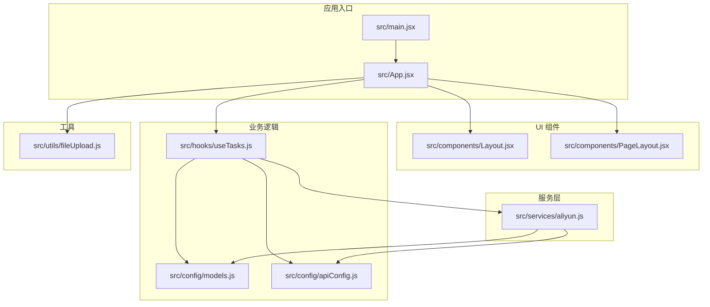
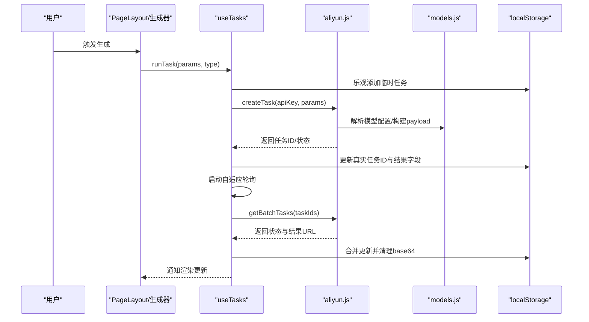
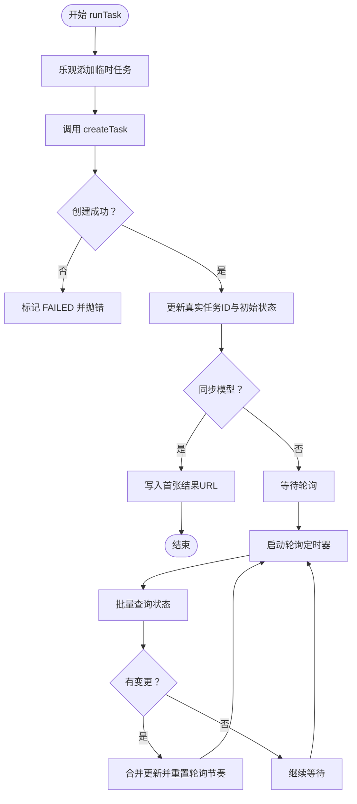
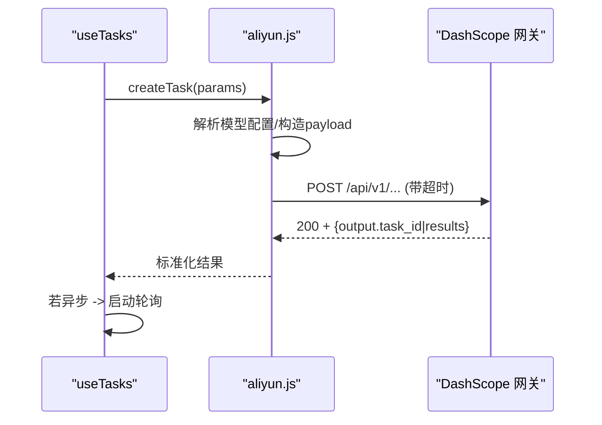
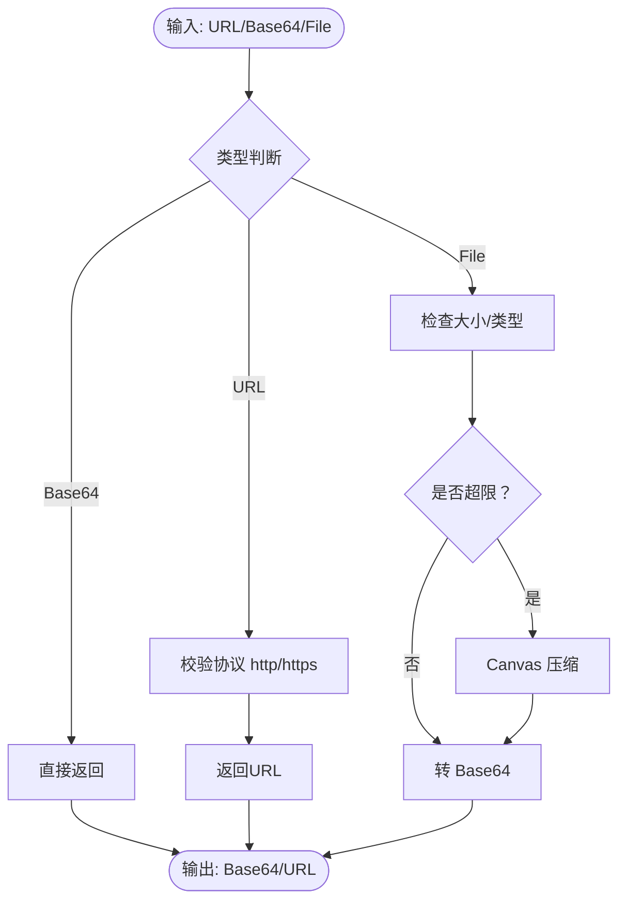
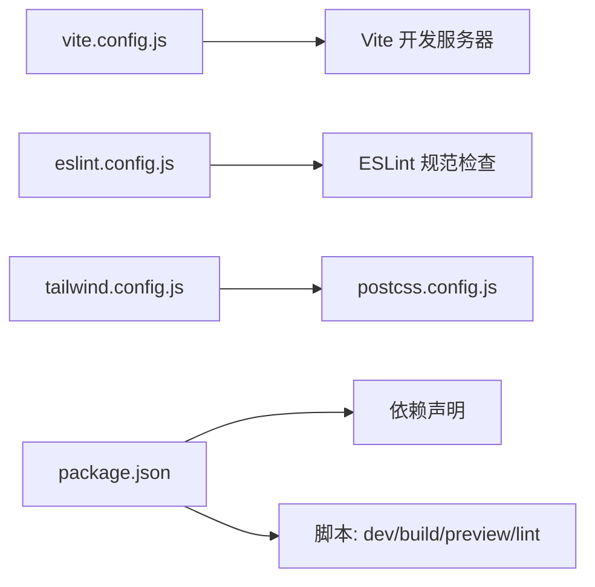

# 开发指南

<cite>
**本文引用的文件**
- [package.json](file://package.json)
- [vite.config.js](file://vite.config.js)
- [eslint.config.js](file://eslint.config.js)
- [tailwind.config.js](file://tailwind.config.js)
- [postcss.config.js](file://postcss.config.js)
- [README.md](file://README.md)
- [src/main.jsx](file://src/main.jsx)
- [src/App.jsx](file://src/App.jsx)
- [src/components/Layout.jsx](file://src/components/Layout.jsx)
- [src/components/PageLayout.jsx](file://src/components/PageLayout.jsx)
- [src/hooks/useTasks.js](file://src/hooks/useTasks.js)
- [src/services/aliyun.js](file://src/services/aliyun.js)
- [src/utils/fileUpload.js](file://src/utils/fileUpload.js)
- [src/config/apiConfig.js](file://src/config/apiConfig.js)
- [src/config/models.js](file://src/config/models.js)
</cite>

## 目录
1. [简介](#简介)
2. [项目结构](#项目结构)
3. [核心组件](#核心组件)
4. [架构总览](#架构总览)
5. [详细组件分析](#详细组件分析)
6. [依赖关系分析](#依赖关系分析)
7. [性能考虑](#性能考虑)
8. [故障排查指南](#故障排查指南)
9. [结论](#结论)
10. [附录](#附录)

## 简介
本指南面向通义万相前端应用的开发者，提供从代码规范、开发工具、性能优化、测试与质量保障、团队协作到新成员快速上手的完整实践手册。项目采用 React 19、Vite 7、TailwindCSS 以及 ESLint，围绕“任务驱动 + 模型配置 + 本地存储”的架构组织，支持多模态生成任务的创建、轮询与历史管理。

## 项目结构
项目采用按功能域分层的组织方式：
- src/components：页面级与业务组件（布局、表单、历史等）
- src/hooks：可复用逻辑（任务状态管理）
- src/services：与后端/网关交互的统一服务层
- src/utils：通用工具（文件上传、校验等）
- src/config：常量与模型配置
- 构建与规范：package.json、vite.config.js、eslint.config.js、tailwind/postcss 配置

图表来源
- [src/main.jsx](file://src/main.jsx#L1-L11)
- [src/App.jsx](file://src/App.jsx#L1-L377)
- [src/components/Layout.jsx](file://src/components/Layout.jsx#L1-L94)
- [src/components/PageLayout.jsx](file://src/components/PageLayout.jsx#L1-L76)
- [src/hooks/useTasks.js](file://src/hooks/useTasks.js#L1-L333)
- [src/services/aliyun.js](file://src/services/aliyun.js#L1-L215)
- [src/config/models.js](file://src/config/models.js#L1-L1012)
- [src/config/apiConfig.js](file://src/config/apiConfig.js#L1-L35)
- [src/utils/fileUpload.js](file://src/utils/fileUpload.js#L1-L182)

章节来源
- [package.json](file://package.json#L1-L33)
- [vite.config.js](file://vite.config.js#L1-L23)
- [tailwind.config.js](file://tailwind.config.js#L1-L12)
- [postcss.config.js](file://postcss.config.js#L1-L7)
- [README.md](file://README.md#L1-L17)

## 核心组件
- 应用入口与根组件：负责挂载 React 根节点与渲染根组件
- 布局与页面容器：提供桌面/移动端适配、侧边栏导航、顶部操作区与内容滚动区域
- 任务钩子：封装任务创建、轮询、重试、删除与本地持久化
- 服务层：统一封装创建任务、轮询状态、批量查询与错误处理
- 工具集：文件上传、Base64/URL 处理、尺寸压缩与校验
- 配置中心：API 基础地址、超时/重试/轮询策略、模型协议与能力映射

章节来源
- [src/main.jsx](file://src/main.jsx#L1-L11)
- [src/App.jsx](file://src/App.jsx#L1-L377)
- [src/components/Layout.jsx](file://src/components/Layout.jsx#L1-L94)
- [src/components/PageLayout.jsx](file://src/components/PageLayout.jsx#L1-L76)
- [src/hooks/useTasks.js](file://src/hooks/useTasks.js#L1-L333)
- [src/services/aliyun.js](file://src/services/aliyun.js#L1-L215)
- [src/utils/fileUpload.js](file://src/utils/fileUpload.js#L1-L182)
- [src/config/apiConfig.js](file://src/config/apiConfig.js#L1-L35)
- [src/config/models.js](file://src/config/models.js#L1-L1012)

## 架构总览
系统采用“配置驱动 + 服务抽象 + 本地状态”的架构：
- 配置驱动：通过模型配置文件集中管理协议、端点、请求格式与能力开关
- 服务抽象：统一创建任务、轮询与批量查询，屏蔽异步/同步差异
- 本地状态：任务列表与参数清洗持久化，轮询策略自适应，乐观更新提升体验

图表来源
- [src/hooks/useTasks.js](file://src/hooks/useTasks.js#L256-L312)
- [src/services/aliyun.js](file://src/services/aliyun.js#L50-L160)
- [src/config/models.js](file://src/config/models.js#L1-L1012)
- [src/config/apiConfig.js](file://src/config/apiConfig.js#L21-L27)

## 详细组件分析

### 任务状态管理（useTasks）
- 乐观添加：生成前插入临时任务，提升即时反馈
- 本地持久化：清洗 base64 并限制存储容量，迁移旧键名
- 自适应轮询：根据任务年龄与轮询次数动态调整间隔，降低无效请求
- 批量轮询：并发查询多个任务状态，合并更新
- 重试机制：基于原始参数重建任务，保证幂等性

图表来源
- [src/hooks/useTasks.js](file://src/hooks/useTasks.js#L256-L332)
- [src/config/apiConfig.js](file://src/config/apiConfig.js#L21-L27)

章节来源
- [src/hooks/useTasks.js](file://src/hooks/useTasks.js#L1-L333)

### 服务层（aliyun.js）
- 统一创建：根据模型配置选择端点与请求格式，构建 payload
- 超时控制：请求与轮询分别设置超时，避免长时间阻塞
- 重试策略：对网络/超时错误指数退避重试，避免无效重试
- 结果标准化：异步返回 task_id，同步返回首张结果 URL
- 错误分类：区分模型未知、请求格式错误、网络/超时等错误类型

图表来源
- [src/services/aliyun.js](file://src/services/aliyun.js#L50-L160)
- [src/config/models.js](file://src/config/models.js#L1-L1012)
- [src/config/apiConfig.js](file://src/config/apiConfig.js#L8-L19)

章节来源
- [src/services/aliyun.js](file://src/services/aliyun.js#L1-L215)

### 文件上传与处理（fileUpload）
- 输入兼容：支持 URL、Base64、File 对象，自动校验与转换
- 压缩策略：大图自动压缩至安全阈值，Canvas 控制尺寸与质量
- 校验规则：类型匹配、大小限制、URL 协议校验
- 上传流程：File → Base64；URL/Base64 直接透传

图表来源
- [src/utils/fileUpload.js](file://src/utils/fileUpload.js#L6-L144)

章节来源
- [src/utils/fileUpload.js](file://src/utils/fileUpload.js#L1-L182)

### 布局与页面容器（Layout/PageLayout）
- 响应式设计：桌面端固定侧边栏，移动端抽屉菜单
- 固定生成区：页面顶部固定生成表单，滚动不影响历史
- 历史折叠：支持折叠/展开历史面板，减少空间占用
- 顶部状态：显示 API Key 配置状态与快捷设置入口

章节来源
- [src/components/Layout.jsx](file://src/components/Layout.jsx#L1-L94)
- [src/components/PageLayout.jsx](file://src/components/PageLayout.jsx#L1-L76)

### 模型配置与路由（App/models）
- 路由到页面：根据侧边栏 ID 分发到对应 PageLayout + 生成器
- 模型注册：集中定义协议、端点、请求格式、输出类型与能力
- 产物类型：统一处理图片/视频两类输出，兼容多格式返回

章节来源
- [src/App.jsx](file://src/App.jsx#L71-L355)
- [src/config/models.js](file://src/config/models.js#L1-L1012)

## 依赖关系分析
- 构建与开发：Vite 提供开发服务器、代理与构建；React 插件启用快速刷新
- 样式管线：PostCSS + TailwindCSS，内容扫描覆盖 src 与 index.html
- 规范与质量：ESLint Flat Config 推荐规则 + Hooks/Refresh 插件
- 运行时依赖：React 19、lucide-react 图标库
- 开发依赖：Vite、React 插件、Tailwind、PostCSS、ESLint 及相关插件

图表来源
- [vite.config.js](file://vite.config.js#L1-L23)
- [eslint.config.js](file://eslint.config.js#L1-L30)
- [tailwind.config.js](file://tailwind.config.js#L1-L12)
- [postcss.config.js](file://postcss.config.js#L1-L7)
- [package.json](file://package.json#L1-L33)

章节来源
- [package.json](file://package.json#L1-L33)
- [vite.config.js](file://vite.config.js#L1-L23)
- [eslint.config.js](file://eslint.config.js#L1-L30)
- [tailwind.config.js](file://tailwind.config.js#L1-L12)
- [postcss.config.js](file://postcss.config.js#L1-L7)
- [README.md](file://README.md#L1-L17)

## 性能考虑
- 代码分割与懒加载
  - 将各生成器组件按需引入，减少首屏体积
  - 在路由切换时再加载对应页面组件
- 资源压缩与缓存
  - 生产构建默认启用压缩；确保静态资源缓存策略合理
  - 图片上传前压缩，降低传输与内存压力
- 轮询与并发
  - 自适应轮询间隔，避免对后端造成压力
  - 批量轮询合并请求，减少网络开销
- 本地存储优化
  - 仅持久化必要字段，清洗 base64 数据，防止存储溢出
  - 限制历史条目数量，及时清理过期任务

## 故障排查指南
- API 调用失败
  - 检查 API Key 是否配置；确认代理路径与目标地址一致
  - 查看请求/轮询超时设置，适当增大或检查网络状况
- 任务状态异常
  - 确认模型 ID 与请求格式正确；查看服务层错误分类
  - 关注“SUCCEEDED 但无媒体 URL”场景，等待轮询补充结果
- 文件上传问题
  - 大图未压缩导致 Base64 超限；确认压缩阈值与 Canvas 输出
  - URL 格式错误或协议不合法，检查协议与域名
- 本地存储异常
  - 存储配额不足时会回退保留最近条目；定期清理历史

章节来源
- [src/services/aliyun.js](file://src/services/aliyun.js#L146-L160)
- [src/hooks/useTasks.js](file://src/hooks/useTasks.js#L30-L84)
- [src/utils/fileUpload.js](file://src/utils/fileUpload.js#L6-L18)
- [src/config/apiConfig.js](file://src/config/apiConfig.js#L8-L19)

## 结论
本指南提供了从开发环境搭建、代码规范、性能优化到质量保障与团队协作的全流程实践建议。建议团队在日常开发中坚持配置驱动、服务抽象与本地状态治理，持续完善测试与监控，确保系统稳定与可维护性。

## 附录

### 代码规范与最佳实践
- ESLint 配置
  - 使用 Flat Config，推荐规则 + Hooks/Refresh 插件
  - 语言选项启用 JSX，全局浏览器环境
- 代码风格
  - 统一使用函数组件与 Hooks；避免深层嵌套
  - 常量与配置集中管理，遵循单一职责
- Git 提交规范
  - 类型前缀：feat/fix/docs/style/refactor/test/chore
  - 标题简洁，正文说明动机与影响，引用 Issue

章节来源
- [eslint.config.js](file://eslint.config.js#L1-L30)
- [README.md](file://README.md#L14-L17)

### 开发工具配置与使用
- Vite
  - 开发服务器：端口 3000，严格端口占用；host 允许外联
  - 代理：/api/aliyun → DashScope 网关，路径重写与跨域
  - 快速刷新：React 插件启用
- 调试工具
  - 开发环境下打印请求/错误日志，便于定位问题
  - 使用浏览器 DevTools 的 Network/Console 定位接口与错误

章节来源
- [vite.config.js](file://vite.config.js#L7-L22)
- [src/services/aliyun.js](file://src/services/aliyun.js#L74-L116)

### 性能优化策略
- 代码分割：按路由/页面拆分包，延迟加载重型组件
- 懒加载：图片/视频预览采用懒加载，减少初始渲染压力
- 资源压缩：生产构建启用压缩；上传前图片压缩
- 轮询节流：自适应轮询，批量查询，避免频繁请求

章节来源
- [src/hooks/useTasks.js](file://src/hooks/useTasks.js#L86-L104)
- [src/utils/fileUpload.js](file://src/utils/fileUpload.js#L40-L87)

### 测试策略与质量保障
- 单元测试
  - 对纯函数与工具方法（如文件处理、校验）编写用例
  - 使用最小化依赖与模拟数据，覆盖边界条件
- 集成测试
  - 模拟服务层调用，验证任务创建与轮询流程
  - 覆盖错误场景：超时、网络失败、未知模型
- 代码覆盖率
  - 建议函数/行/分支/闭合率不低于 80%，关键路径 100%

### 团队协作规范
- 分支管理
  - 主干保护：master/main 仅允许合并 Pull Request
  - 功能分支：feature/xxx；修复分支：fix/xxx
- 代码审查
  - PR 必须包含需求说明、变更清单与测试用例
  - 至少一名 reviewer 通过后方可合并
- 版本发布
  - 语义化版本：主版本/次版本/补丁
  - 发布前执行 lint/build/测试，更新变更日志

### 新成员快速上手
- 环境准备
  - 安装 Node.js 与包管理器；安装依赖后运行 dev
- 关键文件
  - 入口：src/main.jsx、src/App.jsx
  - 任务流：src/hooks/useTasks.js、src/services/aliyun.js
  - 配置：src/config/apiConfig.js、src/config/models.js
  - 工具：src/utils/fileUpload.js
- 常见任务
  - 新增生成器：在 App.jsx 中注册路由，创建 PageLayout + 组件
  - 新增模型：在 models.js 中新增配置，选择合适请求格式
  - 优化性能：拆分组件、懒加载、压缩图片、调整轮询策略