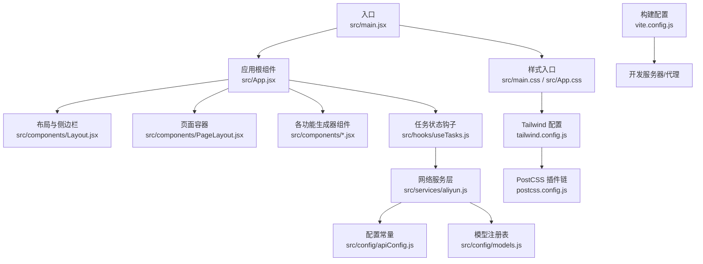
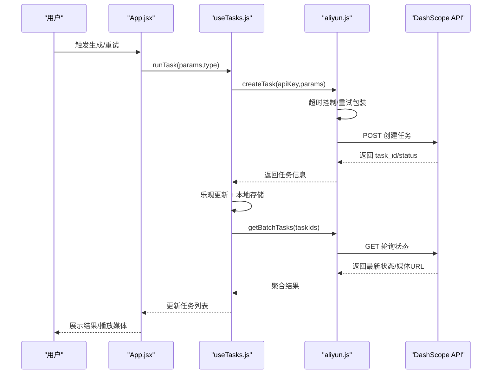
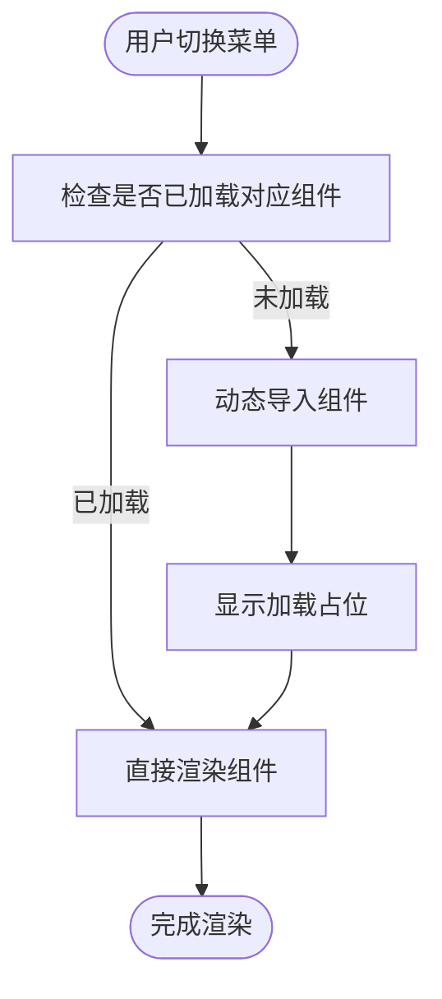
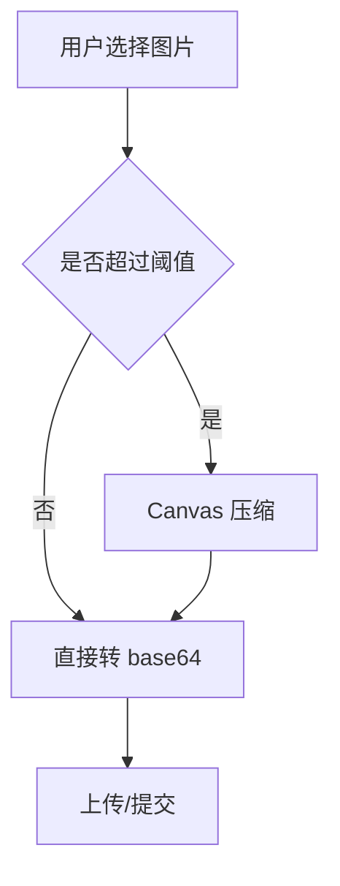
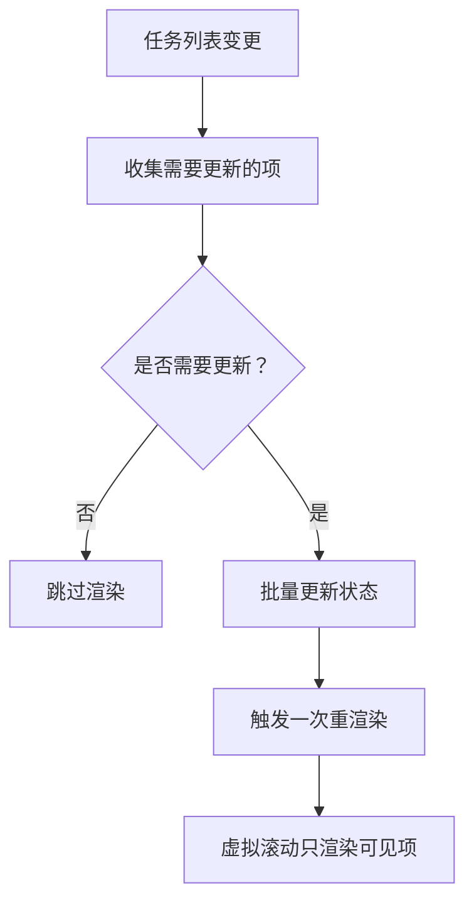
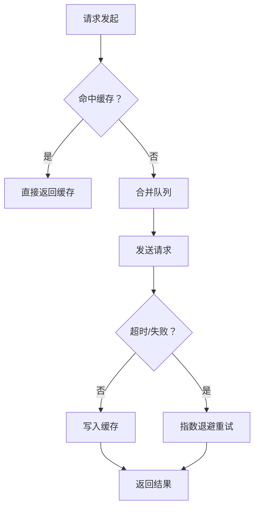
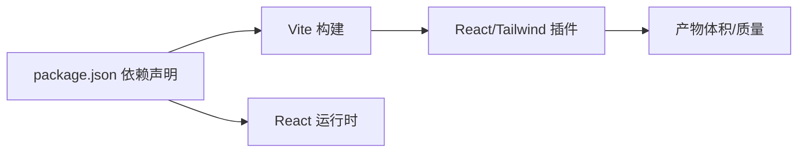

# 性能优化

<cite>
**本文引用的文件**
- [package.json](file://package.json)
- [vite.config.js](file://vite.config.js)
- [postcss.config.js](file://postcss.config.js)
- [tailwind.config.js](file://tailwind.config.js)
- [src/main.jsx](file://src/main.jsx)
- [src/App.jsx](file://src/App.jsx)
- [src/main.css](file://src/main.css)
- [src/App.css](file://src/App.css)
- [src/hooks/useTasks.js](file://src/hooks/useTasks.js)
- [src/services/aliyun.js](file://src/services/aliyun.js)
- [src/utils/fileUpload.js](file://src/utils/fileUpload.js)
- [src/config/apiConfig.js](file://src/config/apiConfig.js)
- [src/config/models.js](file://src/config/models.js)
</cite>

## 目录
1. [简介](#简介)
2. [项目结构](#项目结构)
3. [核心组件](#核心组件)
4. [架构总览](#架构总览)
5. [详细组件分析](#详细组件分析)
6. [依赖分析](#依赖分析)
7. [性能考虑](#性能考虑)
8. [故障排查指南](#故障排查指南)
9. [结论](#结论)
10. [附录](#附录)

## 简介
本指南面向通义万相前端应用，聚焦于性能优化策略与落地实践，涵盖代码分割与懒加载、资源压缩与打包优化、内存与渲染性能、网络请求优化、以及性能监控与分析工具的使用方法。目标是在保证功能完整性的同时，显著降低首屏加载时间、提升交互流畅度、减少内存占用并稳定网络请求。

## 项目结构
项目采用 Vite + React + TailwindCSS 技术栈，组件按功能模块拆分，配置集中在根目录的构建与样式配置文件中。整体结构清晰，便于实施按需加载与资源优化。

图表来源
- [src/main.jsx](file://src/main.jsx#L1-L11)
- [src/App.jsx](file://src/App.jsx#L1-L377)
- [src/hooks/useTasks.js](file://src/hooks/useTasks.js#L1-L333)
- [src/services/aliyun.js](file://src/services/aliyun.js#L1-L215)
- [src/config/apiConfig.js](file://src/config/apiConfig.js#L1-L35)
- [src/config/models.js](file://src/config/models.js#L1-L1012)
- [src/main.css](file://src/main.css#L1-L54)
- [src/App.css](file://src/App.css#L1-L43)
- [tailwind.config.js](file://tailwind.config.js#L1-L12)
- [postcss.config.js](file://postcss.config.js#L1-L7)
- [vite.config.js](file://vite.config.js#L1-L23)

章节来源
- [package.json](file://package.json#L1-L33)
- [vite.config.js](file://vite.config.js#L1-L23)
- [tailwind.config.js](file://tailwind.config.js#L1-L12)
- [postcss.config.js](file://postcss.config.js#L1-L7)

## 核心组件
- 应用根组件负责路由级内容切换与全局状态管理，适合实施按需加载策略。
- 任务状态钩子集中处理轮询、乐观更新与本地存储，是性能优化的关键切入点。
- 网络服务层封装了超时、重试与批量轮询，具备良好的可优化空间。
- 文件上传工具提供图片压缩与 base64 处理，直接影响首屏与传输体积。

章节来源
- [src/App.jsx](file://src/App.jsx#L42-L377)
- [src/hooks/useTasks.js](file://src/hooks/useTasks.js#L1-L333)
- [src/services/aliyun.js](file://src/services/aliyun.js#L1-L215)
- [src/utils/fileUpload.js](file://src/utils/fileUpload.js#L1-L182)

## 架构总览
下图展示从用户操作到结果呈现的端到端流程，包括网络请求与轮询路径，为后续的性能优化提供定位依据。

图表来源
- [src/App.jsx](file://src/App.jsx#L55-L101)
- [src/hooks/useTasks.js](file://src/hooks/useTasks.js#L256-L332)
- [src/services/aliyun.js](file://src/services/aliyun.js#L50-L215)
- [src/config/apiConfig.js](file://src/config/apiConfig.js#L8-L27)

## 详细组件分析

### 代码分割与懒加载策略
现状与问题
- 当前 App.jsx 中通过静态导入引入所有功能组件，导致主包体积增大，影响首屏加载。
- 页面切换基于状态渲染，未利用路由级代码分割。

优化建议
- 将各功能生成器组件改为动态导入，按需加载，显著降低初始包体积。
- 在路由层级（如 PageLayout 或 App 的菜单切换处）实施动态 import，结合 Suspense 提供加载占位。
- 对于历史记录等重型组件，同样采用懒加载。

图表来源
- [src/App.jsx](file://src/App.jsx#L71-L355)

章节来源
- [src/App.jsx](file://src/App.jsx#L1-L377)

### 资源压缩与打包优化
现状与问题
- TailwindCSS 已启用，但未开启 Purge/Tree Shaking；PostCSS 插件链简单。
- 图片在前端转为 base64 会显著增大体积，尤其大图。

优化建议
- 开启 Tailwind 的内容扫描与产物清理，配合 PostCSS 自动前缀与压缩。
- 对图片在前端进行压缩后再转 base64，限制最大体积，避免超大 base64。
- CSS 分离与最小化，确保生产环境产物体积最小化。

图表来源
- [src/utils/fileUpload.js](file://src/utils/fileUpload.js#L6-L18)

章节来源
- [src/utils/fileUpload.js](file://src/utils/fileUpload.js#L1-L182)
- [postcss.config.js](file://postcss.config.js#L1-L7)
- [tailwind.config.js](file://tailwind.config.js#L1-L12)
- [src/main.css](file://src/main.css#L1-L54)

### 内存管理与渲染性能优化
现状与问题
- 任务列表在 localStorage 中持久化，且移除了 base64 数据，但仍可能累积过多条目。
- 轮询策略存在自适应间隔，但未做批量更新的防抖与去重。

优化建议
- 使用 useMemo/useCallback 缓存昂贵计算与回调，减少重渲染。
- 对任务列表的渲染采用虚拟滚动（如 react-window），仅渲染可视区域。
- 事件委托：在列表项上使用事件委托，避免为每个子元素绑定监听。
- 本地存储写入前做去重与上限控制，防止内存膨胀。

图表来源
- [src/hooks/useTasks.js](file://src/hooks/useTasks.js#L164-L246)

章节来源
- [src/hooks/useTasks.js](file://src/hooks/useTasks.js#L1-L333)

### 网络请求优化
现状与问题
- 请求与轮询均设置了超时，但未实现请求合并与缓存复用。
- 批量轮询使用 Promise.allSettled，逻辑正确但可进一步优化。

优化建议
- 请求合并：在短时间内多次触发的同类请求合并为一次，使用队列或去抖。
- 缓存复用：对相同输入的生成结果进行缓存（如同 prompt+参数组合），避免重复请求。
- CDN：将静态资源与媒体资源托管至 CDN，缩短访问延迟。
- 重试退避：现有指数退避合理，可结合网络状态动态调整。

图表来源
- [src/services/aliyun.js](file://src/services/aliyun.js#L20-L36)
- [src/config/apiConfig.js](file://src/config/apiConfig.js#L8-L19)

章节来源
- [src/services/aliyun.js](file://src/services/aliyun.js#L1-L215)
- [src/config/apiConfig.js](file://src/config/apiConfig.js#L1-L35)

### 性能监控与分析工具
- Lighthouse：定期在 CI 中执行，关注首次内容绘制、最大内容绘制、累积布局偏移等指标。
- Web Vitals：集成到应用中，上报CLS、FCP、LCP、INP等实时指标。
- Chrome DevTools Performance 面板：录制交互过程，分析主线程耗时、重排重绘、长任务与内存峰值。

章节来源
- [src/main.jsx](file://src/main.jsx#L1-L11)
- [src/App.jsx](file://src/App.jsx#L1-L377)

## 依赖分析
- 构建工具：Vite 提供快速冷启动与热更新；插件体系支持 React 与 CSS 预处理。
- 样式框架：TailwindCSS + PostCSS，需配合内容扫描与产物清理。
- 运行时依赖：React 19、lucide-react，组件库体量较小，主要性能点在业务逻辑与网络层。

图表来源
- [package.json](file://package.json#L12-L31)
- [vite.config.js](file://vite.config.js#L7-L8)
- [postcss.config.js](file://postcss.config.js#L1-L7)
- [tailwind.config.js](file://tailwind.config.js#L3-L6)

章节来源
- [package.json](file://package.json#L1-L33)
- [vite.config.js](file://vite.config.js#L1-L23)
- [postcss.config.js](file://postcss.config.js#L1-L7)
- [tailwind.config.js](file://tailwind.config.js#L1-L12)

## 性能考虑
- 首屏加载：通过动态 import 与资源压缩，优先加载当前页面所需脚本与样式。
- 交互流畅：使用虚拟滚动、事件委托与 useMemo/useCallback，降低重渲染成本。
- 网络效率：请求合并、缓存复用与 CDN 加速，配合指数退避与超时控制。
- 内存健康：限制本地存储容量、清理无用任务、避免大对象驻留。

## 故障排查指南
- 任务长时间无结果：检查轮询间隔与状态判定逻辑，确认媒体 URL 是否到达。
- 生成失败或超时：查看网络层超时与重试策略，必要时提高超时阈值或减少并发。
- 图片过大导致内存溢出：启用前端压缩与体积限制，避免超过阈值。
- 样式未生效或体积过大：检查 Tailwind 内容扫描路径与 PostCSS 插件链。

章节来源
- [src/hooks/useTasks.js](file://src/hooks/useTasks.js#L106-L161)
- [src/services/aliyun.js](file://src/services/aliyun.js#L83-L160)
- [src/utils/fileUpload.js](file://src/utils/fileUpload.js#L6-L18)
- [tailwind.config.js](file://tailwind.config.js#L3-L6)

## 结论
通过对代码分割、资源优化、内存与渲染性能、网络请求与监控工具的系统性优化，通义万相前端应用可在保证功能完整性的同时，显著提升用户体验与稳定性。建议优先实施动态 import 与资源压缩，再逐步完善缓存与监控体系。

## 附录
- 构建与开发：使用 Vite 快速迭代，结合代理配置访问 DashScope API。
- 样式与主题：Tailwind 配置需与内容扫描范围一致，避免无用样式残留。

章节来源
- [vite.config.js](file://vite.config.js#L1-L23)
- [tailwind.config.js](file://tailwind.config.js#L1-L12)