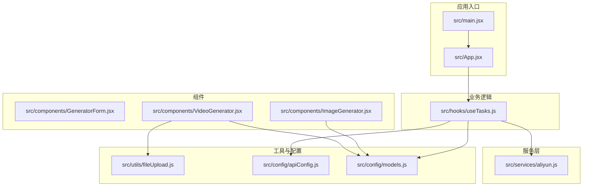
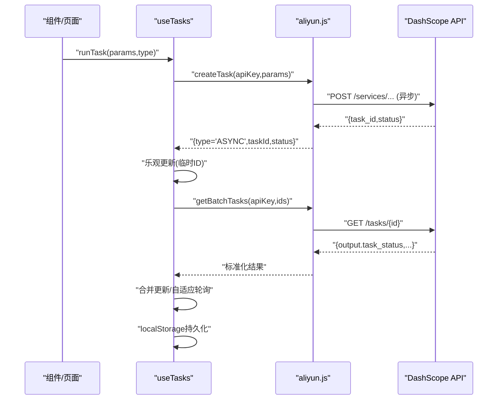
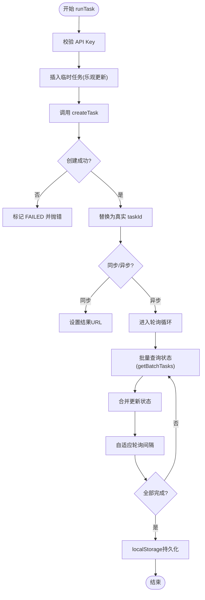
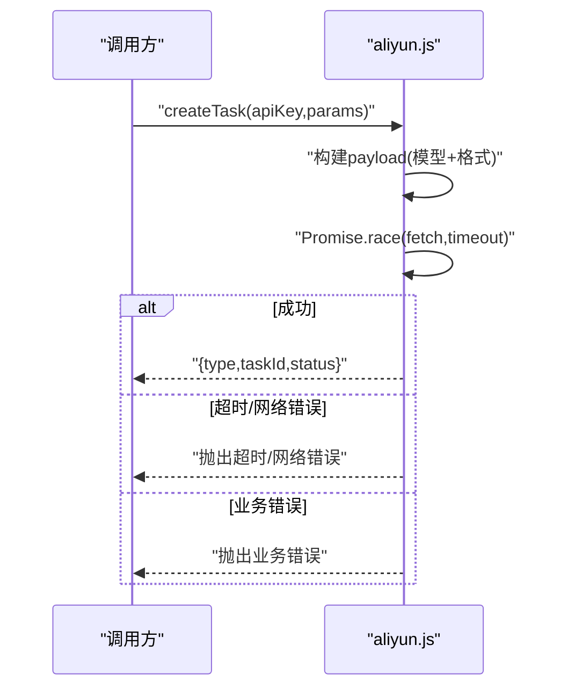
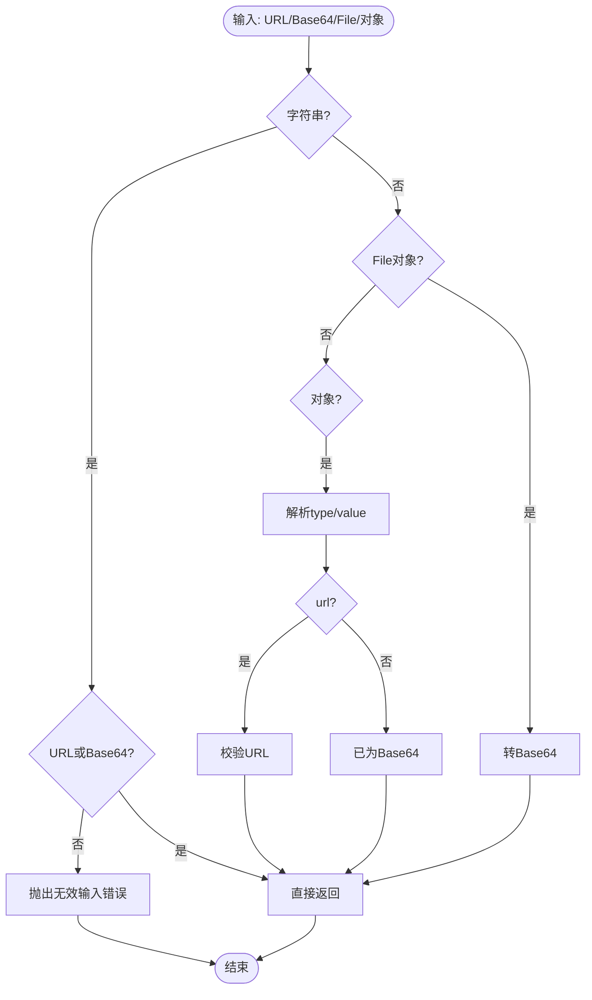
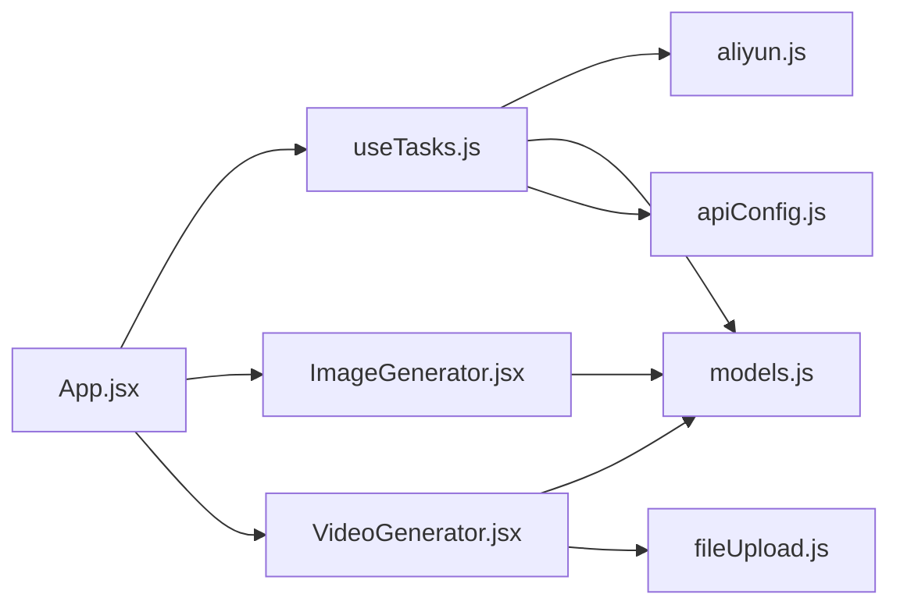

# 测试策略

<cite>
**本文引用的文件**
- [package.json](file://package.json)
- [vite.config.js](file://vite.config.js)
- [eslint.config.js](file://eslint.config.js)
- [src/main.jsx](file://src/main.jsx)
- [src/App.jsx](file://src/App.jsx)
- [src/hooks/useTasks.js](file://src/hooks/useTasks.js)
- [src/services/aliyun.js](file://src/services/aliyun.js)
- [src/utils/fileUpload.js](file://src/utils/fileUpload.js)
- [src/config/apiConfig.js](file://src/config/apiConfig.js)
- [src/config/models.js](file://src/config/models.js)
- [src/components/GeneratorForm.jsx](file://src/components/GeneratorForm.jsx)
- [src/components/ImageGenerator.jsx](file://src/components/ImageGenerator.jsx)
- [src/components/VideoGenerator.jsx](file://src/components/VideoGenerator.jsx)
</cite>

## 目录
1. [引言](#引言)
2. [项目结构](#项目结构)
3. [核心组件](#核心组件)
4. [架构总览](#架构总览)
5. [详细组件分析](#详细组件分析)
6. [依赖分析](#依赖分析)
7. [性能考虑](#性能考虑)
8. [故障排查指南](#故障排查指南)
9. [结论](#结论)
10. [附录](#附录)

## 引言
本测试策略面向通义万相前端应用，目标是建立覆盖单元测试、组件测试、集成测试与端到端测试的完整测试体系，保障 AI 生成类功能的正确性、稳定性与可维护性。策略涵盖以下要点：
- 测试框架选型与配置（Jest/Vitest），组件测试最佳实践（React Testing Library），异步与副作用处理。
- 集成测试与端到端测试方案（Cypress/Playwright），代理与跨域配置，测试用例设计。
- 代码覆盖率要求、报告生成与 CI/CD 集成。
- 测试数据管理与 Mock 策略，AI 生成内容的测试挑战与应对。

## 项目结构
前端采用 Vite + React 架构，核心入口为根组件与页面布局，业务逻辑集中在自定义 Hook 与服务层，组件层负责表单与交互。关键目录与文件如下：
- 应用入口与主组件：src/main.jsx、src/App.jsx
- 业务逻辑：src/hooks/useTasks.js（任务编排、轮询、本地存储）
- 服务层：src/services/aliyun.js（任务创建、轮询、错误与超时处理）
- 工具与配置：src/utils/fileUpload.js（文件处理）、src/config/*.js（API、模型、轮询与存储常量）
- 组件：src/components/*（各生成器与页面布局）

图表来源
- [src/main.jsx](file://src/main.jsx#L1-L11)
- [src/App.jsx](file://src/App.jsx#L1-L377)
- [src/hooks/useTasks.js](file://src/hooks/useTasks.js#L1-L333)
- [src/services/aliyun.js](file://src/services/aliyun.js#L1-L215)
- [src/utils/fileUpload.js](file://src/utils/fileUpload.js#L1-L182)
- [src/config/apiConfig.js](file://src/config/apiConfig.js#L1-L35)
- [src/config/models.js](file://src/config/models.js#L1-L800)
- [src/components/GeneratorForm.jsx](file://src/components/GeneratorForm.jsx#L1-L208)
- [src/components/ImageGenerator.jsx](file://src/components/ImageGenerator.jsx#L1-L249)
- [src/components/VideoGenerator.jsx](file://src/components/VideoGenerator.jsx#L1-L354)

章节来源
- [src/main.jsx](file://src/main.jsx#L1-L11)
- [src/App.jsx](file://src/App.jsx#L1-L377)
- [vite.config.js](file://vite.config.js#L1-L23)

## 核心组件
- 应用入口与路由渲染：应用通过主入口挂载根组件，根组件负责菜单切换与页面内容渲染。
- 任务编排与轮询：自定义 Hook 负责任务创建、乐观更新、批量轮询、状态持久化与自适应轮询策略。
- 服务层封装：统一封装任务创建、轮询与错误处理，支持超时、重试与异步/同步响应适配。
- 文件处理工具：统一处理 URL、Base64 与 File 输入，支持图片压缩与校验。
- 配置中心：集中管理 API 基础地址、超时、重试、轮询间隔与本地存储键名。
- 生成器组件：提供图像与视频生成的表单控件，支持模型选择、分辨率、参数开关与文件输入。

章节来源
- [src/App.jsx](file://src/App.jsx#L42-L374)
- [src/hooks/useTasks.js](file://src/hooks/useTasks.js#L9-L332)
- [src/services/aliyun.js](file://src/services/aliyun.js#L50-L214)
- [src/utils/fileUpload.js](file://src/utils/fileUpload.js#L6-L181)
- [src/config/apiConfig.js](file://src/config/apiConfig.js#L6-L34)
- [src/config/models.js](file://src/config/models.js#L1-L800)
- [src/components/ImageGenerator.jsx](file://src/components/ImageGenerator.jsx#L8-L248)
- [src/components/VideoGenerator.jsx](file://src/components/VideoGenerator.jsx#L6-L353)

## 架构总览
下图展示从前端组件到服务层再到远端 API 的调用链路，以及轮询与本地存储的关键节点。

图表来源
- [src/hooks/useTasks.js](file://src/hooks/useTasks.js#L256-L312)
- [src/services/aliyun.js](file://src/services/aliyun.js#L50-L160)
- [src/services/aliyun.js](file://src/services/aliyun.js#L211-L214)

## 详细组件分析

### 组件 A：任务编排与轮询（useTasks）
- 职责：任务创建、乐观更新、批量轮询、状态持久化、自适应轮询间隔、错误处理与重试。
- 关键点：
  - 乐观更新：创建任务时插入临时 ID，成功后替换为真实 ID 并填充结果字段。
  - 批量轮询：并发查询多个任务状态，合并更新，减少 UI 重渲染。
  - 自适应轮询：根据任务年龄与状态变化动态调整轮询间隔，降低资源消耗。
  - 本地存储：清理 Base64 数据，限制存储大小，兼容历史键名。
  - 错误处理：区分网络错误、超时与业务错误，避免无意义重试。

图表来源
- [src/hooks/useTasks.js](file://src/hooks/useTasks.js#L256-L312)
- [src/hooks/useTasks.js](file://src/hooks/useTasks.js#L164-L246)
- [src/hooks/useTasks.js](file://src/hooks/useTasks.js#L31-L84)

章节来源
- [src/hooks/useTasks.js](file://src/hooks/useTasks.js#L9-L332)

### 组件 B：服务层封装（aliyun.js）
- 职责：统一任务创建、轮询与错误处理；超时控制；异步/同步响应标准化；重试策略。
- 关键点：
  - 超时控制：请求与轮询分别设置超时，避免长时间阻塞。
  - 错误分类：网络错误与超时可重试，模型未知与请求格式错误不可重试。
  - 响应标准化：异步返回 task_id/status，同步返回结果数组或多媒体消息结构。

图表来源
- [src/services/aliyun.js](file://src/services/aliyun.js#L50-L160)

章节来源
- [src/services/aliyun.js](file://src/services/aliyun.js#L1-L215)

### 组件 C：文件处理工具（fileUpload）
- 职责：文件转 Base64、图片压缩、URL/文件/对象输入处理、类型与大小校验。
- 关键点：
  - 大文件压缩：超过阈值时压缩后再转 Base64，降低传输体积。
  - 输入规范化：统一处理字符串 URL/Base64 与 File 对象，便于组件传参。
  - 校验与告警：类型与大小校验，错误时弹窗提示。

图表来源
- [src/utils/fileUpload.js](file://src/utils/fileUpload.js#L114-L144)

章节来源
- [src/utils/fileUpload.js](file://src/utils/fileUpload.js#L1-L182)

### 组件 D：生成器组件（ImageGenerator/VideoGenerator/GeneratorForm）
- 职责：表单收集用户输入，组装参数，调用父级 onGenerate 回调。
- 关键点：
  - 参数联动：模型变更时自动调整分辨率/时长/能力开关。
  - 高级参数：负向提示词、随机种子、水印、镜头类型、音频输入等。
  - 文件处理：视频组件通过工具处理音频输入，统一为 URL/Base64。

章节来源
- [src/components/ImageGenerator.jsx](file://src/components/ImageGenerator.jsx#L8-L248)
- [src/components/VideoGenerator.jsx](file://src/components/VideoGenerator.jsx#L6-L353)
- [src/components/GeneratorForm.jsx](file://src/components/GeneratorForm.jsx#L4-L207)

## 依赖分析
- 组件间依赖：组件依赖配置中心与工具函数；根组件依赖页面布局与生成器组件；Hook 依赖服务层与配置。
- 外部依赖：Vite 提供开发服务器与代理；React 生态组件库与图标库；TailwindCSS 样式。
- 代理与跨域：Vite 代理将 /api/aliyun 重写并转发至 DashScope，解决前端直连跨域问题。

图表来源
- [src/components/ImageGenerator.jsx](file://src/components/ImageGenerator.jsx#L1-L249)
- [src/components/VideoGenerator.jsx](file://src/components/VideoGenerator.jsx#L1-L354)
- [src/hooks/useTasks.js](file://src/hooks/useTasks.js#L1-L333)
- [src/services/aliyun.js](file://src/services/aliyun.js#L1-L215)
- [src/config/models.js](file://src/config/models.js#L1-L800)
- [src/config/apiConfig.js](file://src/config/apiConfig.js#L1-L35)
- [src/utils/fileUpload.js](file://src/utils/fileUpload.js#L1-L182)
- [src/App.jsx](file://src/App.jsx#L1-L377)

章节来源
- [vite.config.js](file://vite.config.js#L13-L20)
- [src/App.jsx](file://src/App.jsx#L1-L377)

## 性能考虑
- 轮询优化：useTasks 中采用自适应轮询与批量查询，减少不必要的网络请求与 UI 更新。
- 存储优化：本地存储前清理 Base64 数据，超出容量时截断保留最近任务。
- 文件处理：大图压缩后再转 Base64，降低传输与内存占用。
- 超时与重试：服务层对网络错误与超时进行指数退避重试，避免雪崩效应。

章节来源
- [src/hooks/useTasks.js](file://src/hooks/useTasks.js#L87-L104)
- [src/hooks/useTasks.js](file://src/hooks/useTasks.js#L31-L84)
- [src/services/aliyun.js](file://src/services/aliyun.js#L20-L36)
- [src/utils/fileUpload.js](file://src/utils/fileUpload.js#L7-L18)

## 故障排查指南
- 任务状态异常：
  - 确认 API Key 是否为空，确认任务是否进入 RUNNING。
  - 检查轮询是否生效，关注批量轮询与状态合并逻辑。
- 轮询超时与网络错误：
  - 查看服务层超时配置与错误分类，确认是否触发重试。
- 本地存储异常：
  - 检查存储键名与容量限制，确认是否被截断。
- 文件处理失败：
  - 校验文件类型与大小，确认压缩与 Base64 转换流程。

章节来源
- [src/hooks/useTasks.js](file://src/hooks/useTasks.js#L164-L246)
- [src/services/aliyun.js](file://src/services/aliyun.js#L170-L202)
- [src/utils/fileUpload.js](file://src/utils/fileUpload.js#L149-L181)

## 结论
本测试策略围绕“组件-服务-配置”三层结构，结合 AI 生成业务的异步特性与文件处理复杂度，提出从单元到端到端的测试金字塔。通过合理的 Mock 与代理配置、完善的轮询与错误处理验证、以及覆盖率与 CI 集成，可有效保障系统稳定性与交付质量。

## 附录

### 测试框架选型与配置
- 框架选择：Jest 或 Vitest 均可。推荐 Vitest，与 Vite 更契合，启动更快。
- 配置要点：
  - 测试环境：DOM 环境（JSDOM），ESM 支持。
  - 资源处理：对图片/样式使用空实现或 mock。
  - 路径别名：映射 src 目录，便于导入。
  - 代理与跨域：在测试环境中通过代理或 Mock 服务端接口。
- 示例脚本（概念性，非仓库现有）：
  - dev/test：启动 Vitest 或 Jest
  - coverage：生成覆盖率报告
  - ci：在 CI 中执行测试并上传覆盖率

章节来源
- [package.json](file://package.json#L6-L10)
- [vite.config.js](file://vite.config.js#L1-L23)

### 单元测试与组件测试
- 单元测试：
  - 服务层：aliyun.js 的 createTask/getTask/getBatchTasks，覆盖超时、网络错误、业务错误分支。
  - 工具函数：fileUpload 的 processFileInput/compressImage/validateFile。
  - 配置：apiConfig 与 models 的导出值校验。
- 组件测试（React Testing Library）：
  - 表单组件：ImageGenerator/VideoGenerator/GeneratorForm 的输入校验、参数联动、按钮禁用状态。
  - 交互行为：点击事件、切换开关、文件上传、表单提交。
  - Mock 外部依赖：服务层与配置通过 jest.mock 或 vitest.mock 替换。
- 异步操作：
  - 使用 async/await 与 waitFor 断言状态更新。
  - 对轮询逻辑进行时间推进（advanceTimers）或 Mock 定时器。

章节来源
- [src/services/aliyun.js](file://src/services/aliyun.js#L50-L160)
- [src/utils/fileUpload.js](file://src/utils/fileUpload.js#L114-L144)
- [src/config/apiConfig.js](file://src/config/apiConfig.js#L9-L27)
- [src/config/models.js](file://src/config/models.js#L1-L800)
- [src/components/ImageGenerator.jsx](file://src/components/ImageGenerator.jsx#L32-L48)
- [src/components/VideoGenerator.jsx](file://src/components/VideoGenerator.jsx#L74-L115)
- [src/components/GeneratorForm.jsx](file://src/components/GeneratorForm.jsx#L66-L80)

### 集成测试与端到端测试
- 集成测试（Cypress/Playwright）：
  - 场景：登录/设置 API Key、选择模型、填写表单、发起生成、轮询状态、查看结果。
  - Mock：使用代理将 /api/aliyun 重写并返回固定响应，或使用 Mock 服务端。
  - 跨域：利用 Vite 代理配置，保证测试环境与开发一致。
- 端到端测试：
  - 页面导航：侧边栏切换、页面渲染、历史记录展示。
  - 文件上传：拖拽/选择文件、预览、提交。
  - 错误路径：网络错误、超时、无效输入、权限不足。

章节来源
- [vite.config.js](file://vite.config.js#L13-L20)
- [src/App.jsx](file://src/App.jsx#L42-L374)

### 代码覆盖率与 CI/CD 集成
- 覆盖率要求（建议）：
  - 行覆盖率：≥80%
  - 分支覆盖率：≥70%
  - 函数覆盖率：≥85%
  - 语句覆盖率：≥80%
- 报告生成：在 CI 中生成 HTML/Cobertura 报告并上传。
- CI 集成：在流水线中执行测试与覆盖率统计，失败时阻止合并。

章节来源
- [package.json](file://package.json#L6-L10)

### 测试数据管理与 Mock 策略
- Mock 数据：
  - 服务层：固定返回任务状态、结果 URL、错误信息。
  - 配置层：模拟 models.js 的不同模型能力与端点。
  - 文件处理：Mock FileReader 与 Canvas，返回 Base64 或 Blob。
- 测试数据：
  - 小图/短音频：便于快速测试与回放。
  - 多分辨率/多模型：覆盖不同配置组合。
- AI 生成内容挑战：
  - 无法复现相同结果：通过固定 seed 与 promptExtend 控制一致性。
  - 大文件与超时：使用 Mock 与超时控制，避免真实调用。
  - 多模态响应：模拟 choices/results 结构，覆盖不同输出格式。

章节来源
- [src/services/aliyun.js](file://src/services/aliyun.js#L120-L145)
- [src/utils/fileUpload.js](file://src/utils/fileUpload.js#L23-L30)
- [src/config/models.js](file://src/config/models.js#L264-L421)