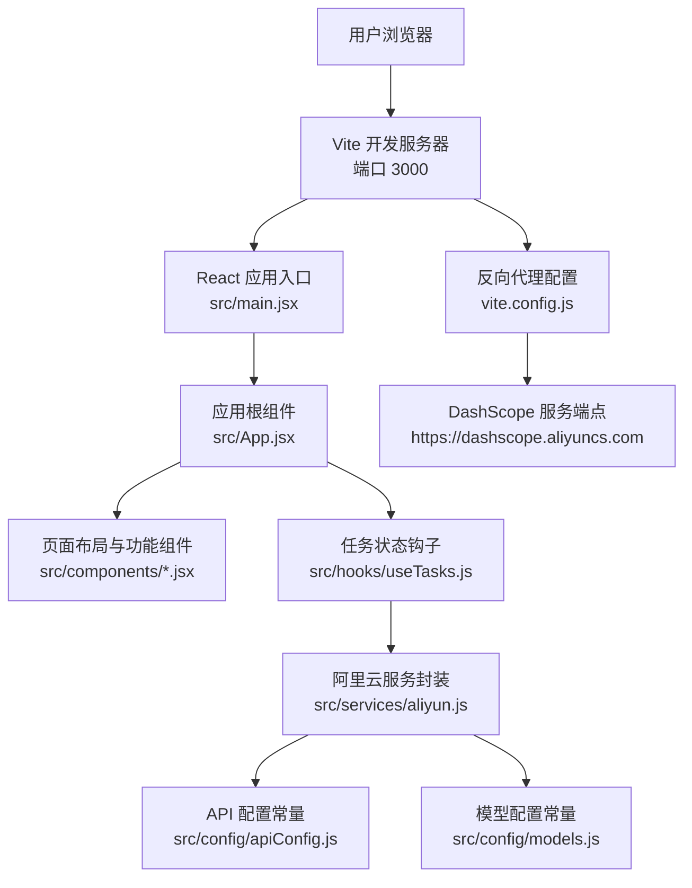
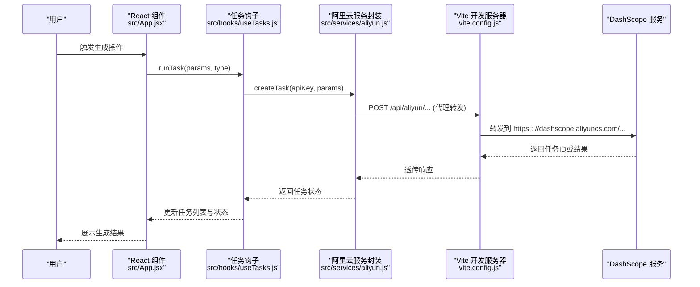
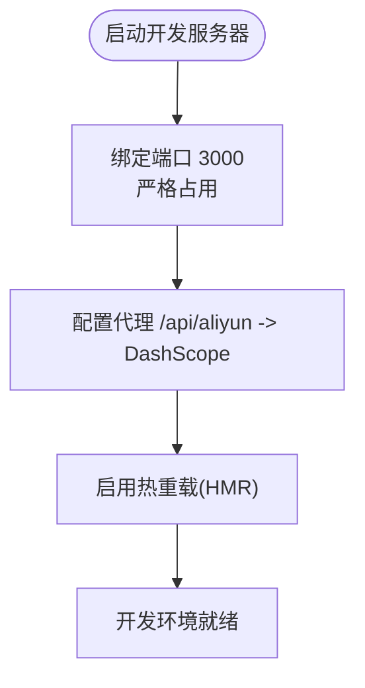
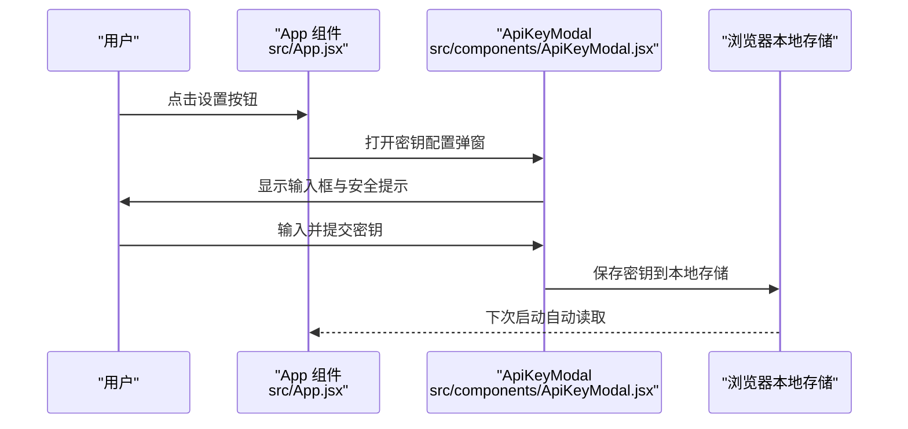
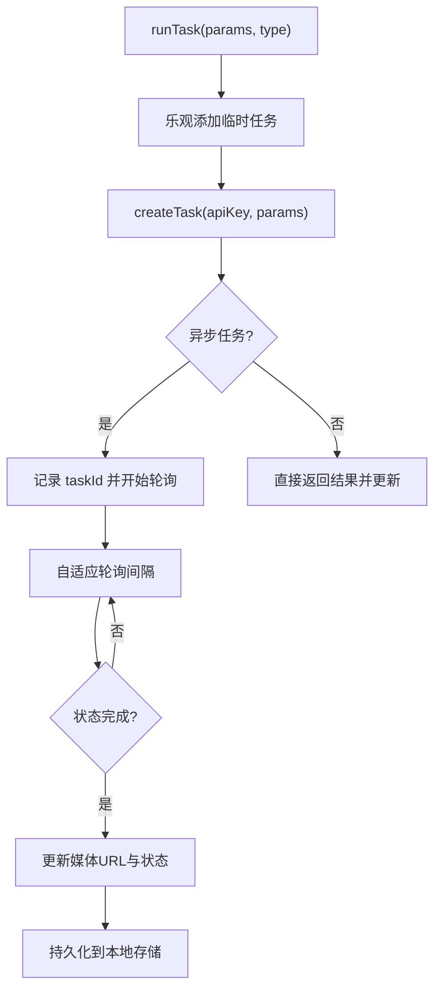
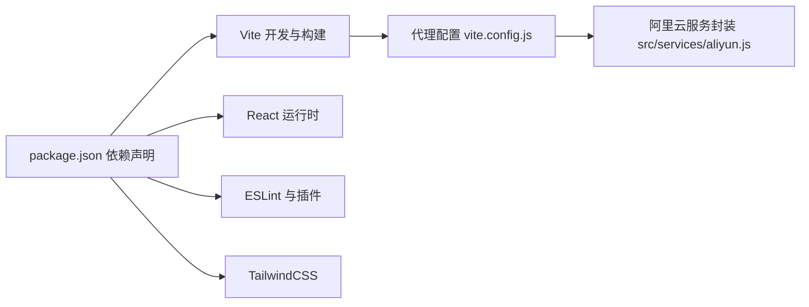

# 快速开始

<cite>
**本文引用的文件**
- [package.json](file://package.json)
- [README.md](file://README.md)
- [vite.config.js](file://vite.config.js)
- [src/main.jsx](file://src/main.jsx)
- [src/App.jsx](file://src/App.jsx)
- [src/config/apiConfig.js](file://src/config/apiConfig.js)
- [src/config/models.js](file://src/config/models.js)
- [src/services/aliyun.js](file://src/services/aliyun.js)
- [src/hooks/useTasks.js](file://src/hooks/useTasks.js)
- [src/components/ApiKeyModal.jsx](file://src/components/ApiKeyModal.jsx)
- [tailwind.config.js](file://tailwind.config.js)
- [eslint.config.js](file://eslint.config.js)
- [postcss.config.js](file://postcss.config.js)
- [Dockerfile](file://Dockerfile)
- [docker-compose.yml](file://docker-compose.yml)
</cite>

## 目录
1. [简介](#简介)
2. [项目结构](#项目结构)
3. [核心组件](#核心组件)
4. [架构总览](#架构总览)
5. [详细组件分析](#详细组件分析)
6. [依赖关系分析](#依赖关系分析)
7. [性能注意事项](#性能注意事项)
8. [故障排查指南](#故障排查指南)
9. [结论](#结论)
10. [附录](#附录)

## 简介
本指南面向初学者与开发者，帮助你在最短时间内完成通义万相前端应用的环境准备、项目启动与基本使用。你将学会：
- 环境要求与前置条件（Node.js、包管理器、系统依赖）
- 项目克隆、依赖安装与本地开发服务器启动
- 热重载机制与代理配置的工作原理
- API 密钥配置与本地存储策略
- 常见开发问题排查与解决方案
- 生产部署（Docker）与容器编排（docker-compose）

## 项目结构
该仓库采用 React + Vite 的现代前端工程结构，配合 TailwindCSS 与 ESLint 规范化开发流程。核心入口为 React 应用，通过 Vite 提供开发服务器与热重载；与后端的通信通过反向代理转发至阿里云 DashScope 平台。

图表来源
- [src/main.jsx](file://src/main.jsx#L1-L11)
- [src/App.jsx](file://src/App.jsx#L1-L377)
- [src/hooks/useTasks.js](file://src/hooks/useTasks.js#L1-L333)
- [src/services/aliyun.js](file://src/services/aliyun.js#L1-L215)
- [src/config/apiConfig.js](file://src/config/apiConfig.js#L1-L35)
- [src/config/models.js](file://src/config/models.js#L1-L800)
- [vite.config.js](file://vite.config.js#L1-L23)

章节来源
- [package.json](file://package.json#L1-L33)
- [README.md](file://README.md#L1-L17)
- [vite.config.js](file://vite.config.js#L1-L23)
- [src/main.jsx](file://src/main.jsx#L1-L11)
- [src/App.jsx](file://src/App.jsx#L1-L377)

## 核心组件
- 应用入口与渲染：负责挂载 React 根节点，渲染应用主组件。
- 主应用组件：集中管理侧边栏菜单、API 密钥弹窗、任务执行与重试逻辑。
- 任务状态钩子：封装任务创建、轮询、持久化与重试能力。
- 阿里云服务封装：统一封装创建任务、轮询任务、批量查询与错误处理。
- API 配置常量：统一管理 API 基础路径、超时、重试、轮询策略与本地存储键名。
- 模型配置常量：统一管理各模型协议、端点、输出类型与能力开关。
- 反向代理配置：将 /api/aliyun 前缀请求转发至 DashScope 服务端点。

章节来源
- [src/main.jsx](file://src/main.jsx#L1-L11)
- [src/App.jsx](file://src/App.jsx#L1-L377)
- [src/hooks/useTasks.js](file://src/hooks/useTasks.js#L1-L333)
- [src/services/aliyun.js](file://src/services/aliyun.js#L1-L215)
- [src/config/apiConfig.js](file://src/config/apiConfig.js#L1-L35)
- [src/config/models.js](file://src/config/models.js#L1-L800)
- [vite.config.js](file://vite.config.js#L1-L23)

## 架构总览
下图展示了从用户操作到服务端请求的端到端流程，以及本地开发服务器的代理与热重载机制。

图表来源
- [src/App.jsx](file://src/App.jsx#L50-L70)
- [src/hooks/useTasks.js](file://src/hooks/useTasks.js#L256-L312)
- [src/services/aliyun.js](file://src/services/aliyun.js#L50-L160)
- [vite.config.js](file://vite.config.js#L13-L20)

## 详细组件分析

### 开发服务器与热重载
- 端口与主机：开发服务器默认监听 0.0.0.0:3000，严格占用端口，避免冲突。
- 热重载：Vite 基于 ES 模块与浏览器缓存策略，实现模块级热替换，无需整页刷新。
- 代理配置：将 /api/aliyun 前缀请求转发至 DashScope 服务端点，同时启用跨域与路径重写。

图表来源
- [vite.config.js](file://vite.config.js#L9-L21)

章节来源
- [vite.config.js](file://vite.config.js#L1-L23)

### API 密钥配置与本地存储
- 密钥来源：首次使用需要在设置弹窗中输入阿里云访问密钥（API Key），密钥仅保存在浏览器本地存储中。
- 存储键名：使用统一的本地存储键名保存密钥，便于后续自动加载。
- 安全提示：密钥不会上传到任何服务器，仅在本地使用。

图表来源
- [src/App.jsx](file://src/App.jsx#L42-L53)
- [src/components/ApiKeyModal.jsx](file://src/components/ApiKeyModal.jsx#L15-L19)
- [src/config/apiConfig.js](file://src/config/apiConfig.js#L30-L34)

章节来源
- [src/App.jsx](file://src/App.jsx#L42-L53)
- [src/components/ApiKeyModal.jsx](file://src/components/ApiKeyModal.jsx#L1-L111)
- [src/config/apiConfig.js](file://src/config/apiConfig.js#L1-L35)

### 任务生命周期与轮询策略
- 乐观添加：创建任务前先插入临时任务，提升交互体验。
- 任务创建：调用统一服务封装创建任务，异步任务返回任务ID，同步任务直接返回结果。
- 轮询策略：根据任务年龄与轮询次数动态调整轮询间隔，减少资源消耗并提高响应性。
- 批量轮询：并发查询多个任务状态，提升吞吐。
- 状态更新：仅在媒体URL或状态发生变化时更新，避免无效渲染。

图表来源
- [src/hooks/useTasks.js](file://src/hooks/useTasks.js#L256-L312)
- [src/hooks/useTasks.js](file://src/hooks/useTasks.js#L106-L161)
- [src/hooks/useTasks.js](file://src/hooks/useTasks.js#L164-L246)
- [src/services/aliyun.js](file://src/services/aliyun.js#L50-L160)
- [src/config/apiConfig.js](file://src/config/apiConfig.js#L21-L27)

章节来源
- [src/hooks/useTasks.js](file://src/hooks/useTasks.js#L1-L333)
- [src/services/aliyun.js](file://src/services/aliyun.js#L1-L215)
- [src/config/apiConfig.js](file://src/config/apiConfig.js#L1-L35)

### 模型与端点配置
- 协议与端点：不同模型使用不同的协议与端点，统一由模型配置常量维护。
- 输出类型：区分图像与视频输出，用于正确更新任务状态与展示。
- 能力开关：根据模型能力决定 UI 表单项与参数校验。

章节来源
- [src/config/models.js](file://src/config/models.js#L1-L800)

## 依赖关系分析
- 构建与开发：Vite 提供开发服务器与打包工具；React 与 React DOM 作为运行时；ESLint 与相关插件保证代码质量。
- 样式与工具链：TailwindCSS 与 PostCSS/Autoprefixer 提供样式与兼容性处理。
- 代理与网络：Vite 代理将 /api/aliyun 请求转发至 DashScope；服务封装统一处理超时、重试与错误。

图表来源
- [package.json](file://package.json#L12-L31)
- [vite.config.js](file://vite.config.js#L1-L23)
- [src/services/aliyun.js](file://src/services/aliyun.js#L1-L215)

章节来源
- [package.json](file://package.json#L1-L33)
- [vite.config.js](file://vite.config.js#L1-L23)
- [eslint.config.js](file://eslint.config.js#L1-L30)
- [postcss.config.js](file://postcss.config.js#L1-L7)
- [tailwind.config.js](file://tailwind.config.js#L1-L12)

## 性能注意事项
- 轮询优化：根据任务年龄与轮询次数动态调整轮询间隔，减少对服务端的压力。
- 批量轮询：并发查询多个任务状态，提升吞吐。
- 本地存储清理：移除大字段（如 base64）后再持久化，避免 LocalStorage 溢出。
- 代理与超时：合理设置请求与轮询超时，避免长时间占用连接。

## 故障排查指南
- 端口被占用
  - 现象：启动时报端口冲突。
  - 解决：修改 Vite 配置中的端口或关闭占用进程。
  - 参考：[vite.config.js](file://vite.config.js#L10-L12)
- 代理无法访问 DashScope
  - 现象：浏览器控制台出现跨域或代理失败。
  - 解决：确认代理规则与目标地址正确，必要时允许不安全连接。
  - 参考：[vite.config.js](file://vite.config.js#L13-L20)
- API 密钥无效或未配置
  - 现象：任务创建失败或弹出设置窗口。
  - 解决：在设置弹窗中输入有效密钥并保存，确认本地存储中已保存。
  - 参考：[src/App.jsx](file://src/App.jsx#L42-L53)、[src/components/ApiKeyModal.jsx](file://src/components/ApiKeyModal.jsx#L15-L19)
- 任务长时间处于 RUNNING
  - 现象：轮询无进展。
  - 解决：检查网络连通性、代理配置与超时设置；查看浏览器控制台日志。
  - 参考：[src/hooks/useTasks.js](file://src/hooks/useTasks.js#L106-L161)、[src/services/aliyun.js](file://src/services/aliyun.js#L170-L202)
- 本地存储溢出
  - 现象：保存历史任务失败。
  - 解决：系统会自动清理最近 20 条任务，避免存储溢出。
  - 参考：[src/hooks/useTasks.js](file://src/hooks/useTasks.js#L74-L84)

章节来源
- [vite.config.js](file://vite.config.js#L1-L23)
- [src/App.jsx](file://src/App.jsx#L42-L53)
- [src/components/ApiKeyModal.jsx](file://src/components/ApiKeyModal.jsx#L1-L111)
- [src/hooks/useTasks.js](file://src/hooks/useTasks.js#L74-L84)
- [src/services/aliyun.js](file://src/services/aliyun.js#L170-L202)

## 结论
通过本指南，你可以快速完成环境准备、项目启动与基本使用。建议在开发过程中：
- 优先配置好 API 密钥与代理；
- 熟悉热重载与代理机制，提升开发效率；
- 关注轮询策略与本地存储优化，保障用户体验；
- 遇到问题时，结合日志与配置文件定位原因。

## 附录

### 环境要求与前置条件
- Node.js 版本：推荐使用 Node.js 20（镜像中已固定使用 node:20-alpine）。
- 包管理器：使用 npm（package.json 中已声明）。
- 系统依赖：Docker 与 docker-compose（用于生产部署）。

章节来源
- [Dockerfile](file://Dockerfile#L2-L2)
- [docker-compose.yml](file://docker-compose.yml#L1-L23)

### 安装与启动步骤
- 克隆仓库后，进入项目根目录。
- 安装依赖：使用 npm install。
- 启动开发服务器：npm run dev。
- 在浏览器打开 http://localhost:3000。
- 首次使用需在设置弹窗中输入阿里云 API Key。

章节来源
- [package.json](file://package.json#L6-L10)
- [vite.config.js](file://vite.config.js#L7-L7)
- [src/App.jsx](file://src/App.jsx#L42-L53)

### 生产部署（Docker 与 docker-compose）
- 构建镜像：Dockerfile 已配置多阶段构建，先安装依赖并构建，再使用 Nginx 提供静态服务。
- 启动容器：docker-compose up -d。
- 访问地址：http://localhost（容器映射 80 端口）。

章节来源
- [Dockerfile](file://Dockerfile#L1-L36)
- [docker-compose.yml](file://docker-compose.yml#L1-L23)