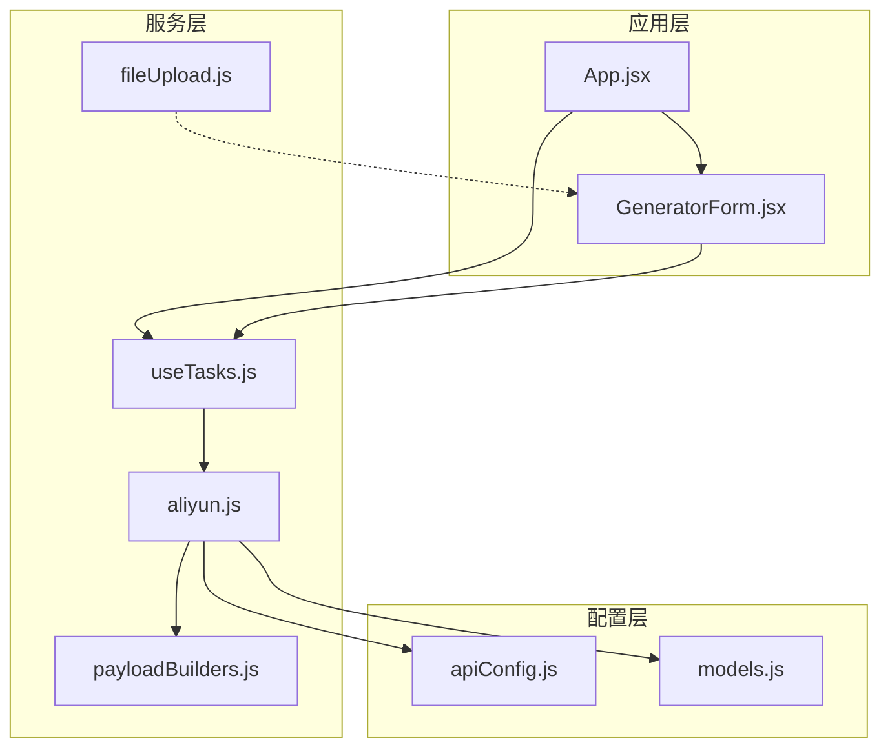
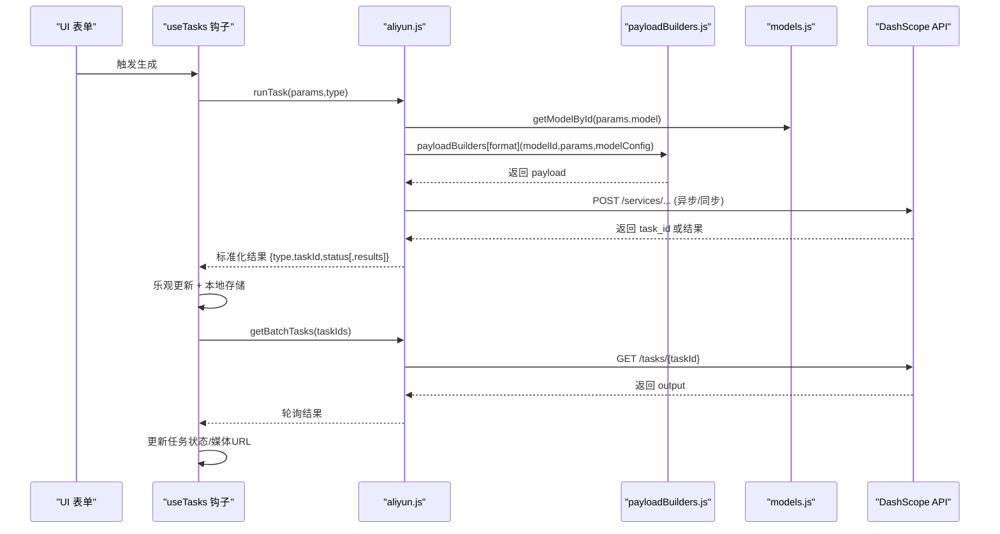
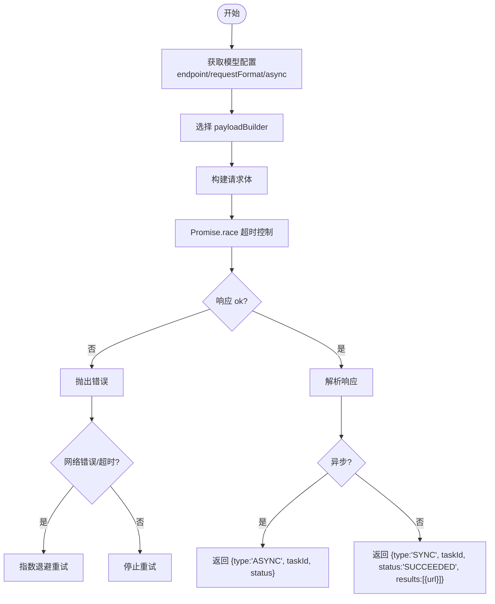
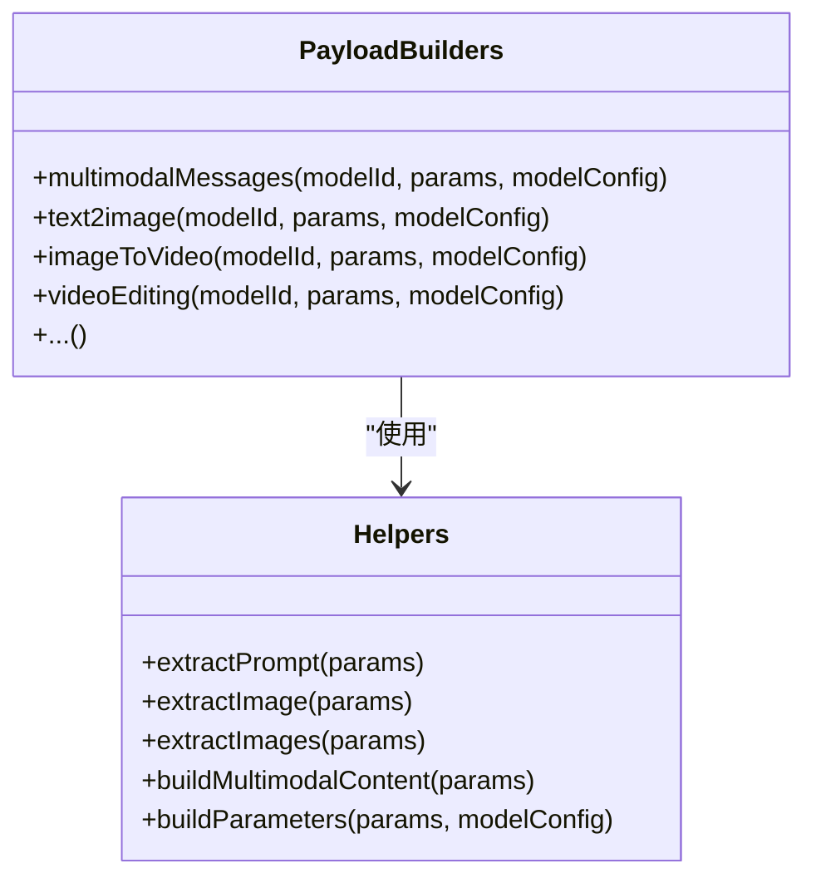
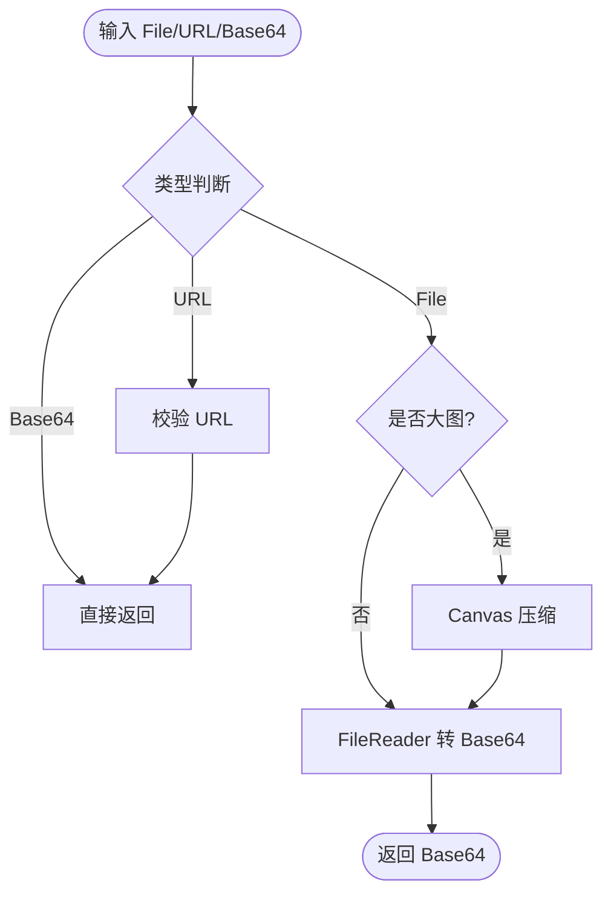
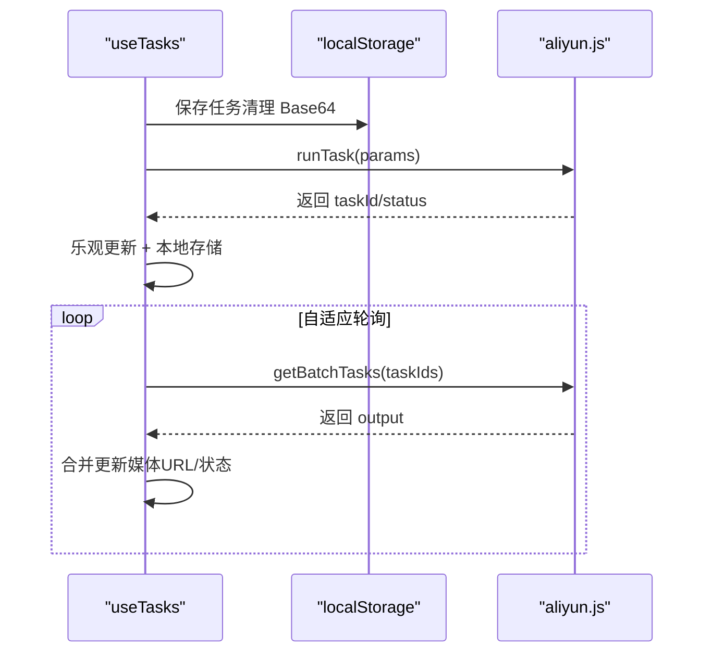
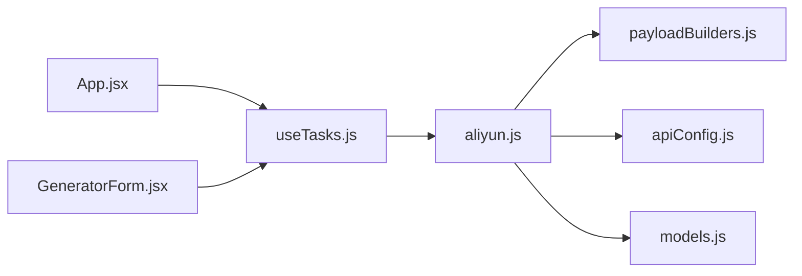
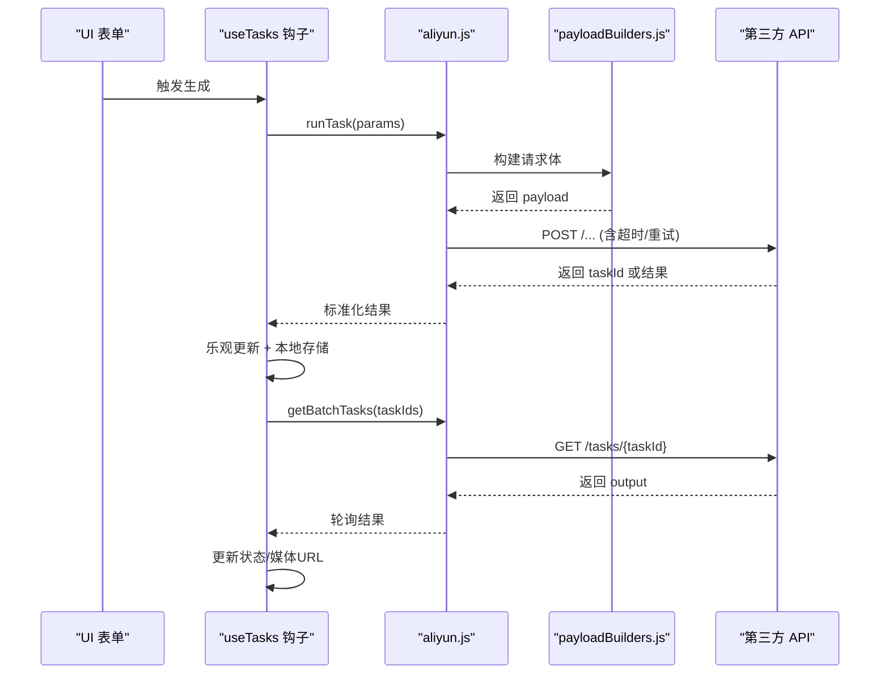

# 服务层

<cite>
**本文引用的文件列表**
- [aliyun.js](file://src/services/aliyun.js)
- [payloadBuilders.js](file://src/services/payloadBuilders.js)
- [fileUpload.js](file://src/utils/fileUpload.js)
- [useTasks.js](file://src/hooks/useTasks.js)
- [apiConfig.js](file://src/config/apiConfig.js)
- [models.js](file://src/config/models.js)
- [App.jsx](file://src/App.jsx)
- [GeneratorForm.jsx](file://src/components/GeneratorForm.jsx)
</cite>

## 目录
1. [简介](#简介)
2. [项目结构](#项目结构)
3. [核心组件](#核心组件)
4. [架构总览](#架构总览)
5. [详细组件分析](#详细组件分析)
6. [依赖关系分析](#依赖关系分析)
7. [性能考量](#性能考量)
8. [故障排查指南](#故障排查指南)
9. [结论](#结论)
10. [附录](#附录)

## 简介
本文件面向通义万相前端应用的服务层，系统性梳理与阿里云 DashScope API 的集成实现，涵盖任务创建、状态轮询、错误处理与重试机制；同时解析文件上传服务（多媒体文件处理、Base64 编码转换与上传进度跟踪）；总结服务层的抽象设计（统一不同 API 的调用接口与响应格式），并提供扩展指南（如何接入其他 AI 服务提供商与自定义 API 适配器）、错误处理策略、性能优化与监控建议。

## 项目结构
服务层主要由以下模块构成：
- 服务层入口与适配器：aliyun.js
- 请求体构造器：payloadBuilders.js
- 文件上传工具：fileUpload.js
- 任务状态钩子：useTasks.js
- 配置常量：apiConfig.js、models.js
- 应用入口与表单组件：App.jsx、GeneratorForm.jsx

图表来源
- [App.jsx](file://src/App.jsx#L42-L70)
- [GeneratorForm.jsx](file://src/components/GeneratorForm.jsx#L66-L80)
- [aliyun.js](file://src/services/aliyun.js#L1-L215)
- [payloadBuilders.js](file://src/services/payloadBuilders.js#L1-L800)
- [fileUpload.js](file://src/utils/fileUpload.js#L1-L182)
- [useTasks.js](file://src/hooks/useTasks.js#L1-L333)
- [apiConfig.js](file://src/config/apiConfig.js#L1-L35)
- [models.js](file://src/config/models.js#L1-L1012)

章节来源
- [App.jsx](file://src/App.jsx#L42-L70)
- [GeneratorForm.jsx](file://src/components/GeneratorForm.jsx#L66-L80)
- [aliyun.js](file://src/services/aliyun.js#L1-L215)
- [payloadBuilders.js](file://src/services/payloadBuilders.js#L1-L800)
- [fileUpload.js](file://src/utils/fileUpload.js#L1-L182)
- [useTasks.js](file://src/hooks/useTasks.js#L1-L333)
- [apiConfig.js](file://src/config/apiConfig.js#L1-L35)
- [models.js](file://src/config/models.js#L1-L1012)

## 核心组件
- 任务创建与轮询适配器：aliyun.js
  - 统一创建任务、查询任务状态、批量轮询
  - 集成超时控制、重试机制、异步/同步响应标准化
- 请求体构造器：payloadBuilders.js
  - 基于模型能力与请求格式策略化构建请求体
  - 支持多模态消息、文生图、图生视频、视频编辑等格式
- 文件上传工具：fileUpload.js
  - 多媒体文件处理、Base64 转换、压缩与校验
  - 支持 URL、Base64、File 对象输入
- 任务状态钩子：useTasks.js
  - 乐观提交、本地存储、自适应轮询、批量轮询、重试与清理
- 配置常量：apiConfig.js、models.js
  - API 基础地址、超时、重试、轮询策略
  - 模型协议、端点、请求格式、能力开关、输出类型

章节来源
- [aliyun.js](file://src/services/aliyun.js#L48-L160)
- [payloadBuilders.js](file://src/services/payloadBuilders.js#L125-L150)
- [fileUpload.js](file://src/utils/fileUpload.js#L6-L18)
- [useTasks.js](file://src/hooks/useTasks.js#L256-L312)
- [apiConfig.js](file://src/config/apiConfig.js#L5-L35)
- [models.js](file://src/config/models.js#L1-L1012)

## 架构总览
服务层采用“配置驱动 + 策略模式”的设计：
- 配置层（models.js、apiConfig.js）定义模型协议、端点、请求格式与能力
- 适配层（aliyun.js）负责与 DashScope API 交互，封装超时、重试、异步/同步响应标准化
- 构造层（payloadBuilders.js）依据模型能力与请求格式策略化生成请求体
- 工具层（fileUpload.js）处理多媒体文件与 Base64 转换
- 钩子层（useTasks.js）协调任务生命周期与轮询策略

图表来源
- [useTasks.js](file://src/hooks/useTasks.js#L256-L312)
- [aliyun.js](file://src/services/aliyun.js#L50-L160)
- [payloadBuilders.js](file://src/services/payloadBuilders.js#L125-L150)
- [models.js](file://src/config/models.js#L1-L1012)

## 详细组件分析

### 任务创建与轮询适配器（aliyun.js）
- 统一创建任务
  - 通过模型注册表获取端点与请求格式
  - 通过 payloadBuilders 构建请求体
  - 设置异步/同步头（X-DashScope-Async）
  - 超时控制：Promise.race 控制请求超时
  - 响应标准化：异步返回 task_id/status；同步返回 results.url
- 通用轮询
  - 单任务轮询与批量轮询
  - 超时控制与错误分类（网络错误、超时、API 错误）
- 重试机制
  - retryRequest：指数退避重试，过滤验证类错误（未知模型/未知请求格式）
  - 针对网络错误与超时进行有限次数重试

图表来源
- [aliyun.js](file://src/services/aliyun.js#L50-L160)
- [aliyun.js](file://src/services/aliyun.js#L20-L36)

章节来源
- [aliyun.js](file://src/services/aliyun.js#L50-L160)
- [aliyun.js](file://src/services/aliyun.js#L170-L202)
- [aliyun.js](file://src/services/aliyun.js#L20-L36)

### 请求体构造器（payloadBuilders.js）
- 设计模式
  - 策略模式：每种请求格式对应一个 builder，新增模型只需配置与新增 builder
- 关键能力
  - 文本抽取、图片抽取、多模态内容拼装
  - 参数构建：尺寸、数量、负向提示词、水印、种子、时长等
  - 模型能力开关：根据 capabilities 动态启用参数
- 典型格式
  - 多模态消息（支持 enable_interleave、多图）
  - 文生图（支持样式、负向提示词）
  - 图生视频（模板模式与普通模式）
  - 视频编辑（VACE Plus 多功能）
  - 数字人类（检测与语音转视频）

图表来源
- [payloadBuilders.js](file://src/services/payloadBuilders.js#L11-L119)
- [payloadBuilders.js](file://src/services/payloadBuilders.js#L125-L150)
- [payloadBuilders.js](file://src/services/payloadBuilders.js#L515-L571)
- [payloadBuilders.js](file://src/services/payloadBuilders.js#L577-L643)
- [payloadBuilders.js](file://src/services/payloadBuilders.js#L671-L709)

章节来源
- [payloadBuilders.js](file://src/services/payloadBuilders.js#L11-L119)
- [payloadBuilders.js](file://src/services/payloadBuilders.js#L125-L150)
- [payloadBuilders.js](file://src/services/payloadBuilders.js#L515-L571)
- [payloadBuilders.js](file://src/services/payloadBuilders.js#L577-L643)
- [payloadBuilders.js](file://src/services/payloadBuilders.js#L671-L709)

### 文件上传服务（fileUpload.js）
- 功能概览
  - 将文件转换为 Base64 字符串，用于前端直传场景
  - 大图压缩：Canvas 压缩 + Blob 转 File，降低 Base64 长度
  - 输入处理：支持 URL、Base64、File 对象
  - 校验：URL 格式、Base64 前缀、文件类型与大小
- 上传进度
  - 当前实现为一次性转换，未内置 XHR/XMLHttpRequest 进度回调
  - 若需进度展示，可在上层组件中使用 XHR 并监听上传进度

图表来源
- [fileUpload.js](file://src/utils/fileUpload.js#L6-L18)
- [fileUpload.js](file://src/utils/fileUpload.js#L40-L87)
- [fileUpload.js](file://src/utils/fileUpload.js#L114-L144)

章节来源
- [fileUpload.js](file://src/utils/fileUpload.js#L6-L18)
- [fileUpload.js](file://src/utils/fileUpload.js#L40-L87)
- [fileUpload.js](file://src/utils/fileUpload.js#L114-L144)

### 任务状态钩子（useTasks.js）
- 乐观提交：先插入临时 taskId，再替换为真实 taskId
- 本地存储：持久化任务历史，清理 Base64 数据以节省空间
- 自适应轮询：根据任务年龄与轮询次数动态调整轮询间隔
- 批量轮询：并发查询多个任务状态，合并更新
- 重试机制：保存 originalParams，支持一键重试
- 状态更新策略：仅在媒体 URL 变化或状态从 RUNNING 变为 SUCCEEDED 且具备媒体 URL 时才更新状态

图表来源
- [useTasks.js](file://src/hooks/useTasks.js#L30-L84)
- [useTasks.js](file://src/hooks/useTasks.js#L86-L104)
- [useTasks.js](file://src/hooks/useTasks.js#L164-L246)
- [useTasks.js](file://src/hooks/useTasks.js#L256-L312)

章节来源
- [useTasks.js](file://src/hooks/useTasks.js#L30-L84)
- [useTasks.js](file://src/hooks/useTasks.js#L86-L104)
- [useTasks.js](file://src/hooks/useTasks.js#L164-L246)
- [useTasks.js](file://src/hooks/useTasks.js#L256-L312)

### 配置与模型（apiConfig.js、models.js）
- apiConfig.js
  - API_BASE_URL：统一代理路径
  - TIMEOUT：请求与轮询超时
  - RETRY：最大重试次数、初始延迟、退避因子
  - POLLING：轮询间隔、最大间隔、完成状态集合
  - STORAGE：任务与密钥存储键名
- models.js
  - PROTOCOLS：同步/异步协议枚举
  - OUTPUT_TYPES：图像/视频输出类型
  - 模型配置：端点、请求格式、能力开关、默认分辨率、输出类型
  - 分类与标签：便于 UI 过滤与展示

章节来源
- [apiConfig.js](file://src/config/apiConfig.js#L5-L35)
- [models.js](file://src/config/models.js#L1-L1012)

## 依赖关系分析
- 组件耦合
  - App.jsx 与 GeneratorForm.jsx 通过 useTasks 钩子与服务层解耦
  - useTasks 依赖 aliyun.js 与 models.js
  - aliyun.js 依赖 payloadBuilders.js 与 apiConfig.js、models.js
- 外部依赖
  - fetch 作为网络请求抽象
  - localStorage 作为轻量持久化
- 潜在风险
  - 本地存储 Base64 数据可能占用空间，已通过清理策略缓解
  - 轮询频率与并发数需平衡用户体验与 API 限流

图表来源
- [App.jsx](file://src/App.jsx#L42-L70)
- [GeneratorForm.jsx](file://src/components/GeneratorForm.jsx#L66-L80)
- [useTasks.js](file://src/hooks/useTasks.js#L1-L333)
- [aliyun.js](file://src/services/aliyun.js#L1-L215)
- [payloadBuilders.js](file://src/services/payloadBuilders.js#L1-L800)
- [apiConfig.js](file://src/config/apiConfig.js#L1-L35)
- [models.js](file://src/config/models.js#L1-L1012)

章节来源
- [App.jsx](file://src/App.jsx#L42-L70)
- [GeneratorForm.jsx](file://src/components/GeneratorForm.jsx#L66-L80)
- [useTasks.js](file://src/hooks/useTasks.js#L1-L333)
- [aliyun.js](file://src/services/aliyun.js#L1-L215)
- [payloadBuilders.js](file://src/services/payloadBuilders.js#L1-L800)
- [apiConfig.js](file://src/config/apiConfig.js#L1-L35)
- [models.js](file://src/config/models.js#L1-L1012)

## 性能考量
- 轮询策略
  - 新任务快速轮询（1 秒），稳定后逐步延长至最大间隔（5 秒），减少无效请求
  - 批量轮询 Promise.allSettled，避免阻塞
- 超时控制
  - 请求超时与轮询超时分别设置，防止长时间占用
- 重试策略
  - 仅在网络错误与超时场景重试，避免对验证类错误重复尝试
  - 指数退避，降低对上游的压力
- 存储优化
  - 本地存储前清理 Base64，避免内存与存储压力
- 前端上传优化
  - 大图 Canvas 压缩，降低 Base64 长度
  - 若需进度，建议在上层组件使用 XHR 监听上传进度

[本节为通用性能建议，无需特定文件引用]

## 故障排查指南
- 常见错误与定位
  - 未知模型/未知请求格式：直接抛出，检查模型 ID 与请求格式是否匹配
  - 网络错误：检查网络连通性与代理配置
  - 轮询超时：适当增大 POLLING 超时或减少并发
  - 同步响应异常：确认模型 async=false 且返回 choices/results 结构
- 重试与恢复
  - retryRequest 对网络错误与超时自动重试，验证类错误不重试
  - useTasks 提供重试任务能力，保存 originalParams
- 本地存储问题
  - 本地存储配额不足时自动截断最近任务
- 调试建议
  - 开发环境开启调试日志（请求体、错误响应）
  - 在轮询阶段关注 output 结构与媒体 URL 变化

章节来源
- [aliyun.js](file://src/services/aliyun.js#L20-L36)
- [aliyun.js](file://src/services/aliyun.js#L146-L159)
- [useTasks.js](file://src/hooks/useTasks.js#L74-L84)
- [useTasks.js](file://src/hooks/useTasks.js#L314-L322)

## 结论
服务层通过“配置驱动 + 策略模式”实现了对阿里云 DashScope API 的统一抽象，既保证了灵活性（新增模型只需配置与新增 builder），又提供了完善的错误处理、重试与轮询策略。文件上传工具为前端直传场景提供了便捷的多媒体处理能力。整体设计易于扩展，可作为接入其他 AI 服务提供商的参考模板。

[本节为总结性内容，无需特定文件引用]

## 附录

### 服务层扩展指南（接入其他 AI 服务提供商）
- 适配器层扩展（aliyun.js）
  - 新增 createTask/getTask/getBatchTasks 的适配器函数
  - 统一超时、重试、错误分类与响应标准化
- 构造器层扩展（payloadBuilders.js）
  - 为新服务新增请求格式 builder，遵循现有 helpers 与参数构建逻辑
- 配置层扩展（models.js）
  - 注册新模型的端点、请求格式、能力开关与输出类型
- 钩子层扩展（useTasks.js）
  - 如需差异化行为，可在钩子中注入新适配器与策略

章节来源
- [aliyun.js](file://src/services/aliyun.js#L50-L160)
- [payloadBuilders.js](file://src/services/payloadBuilders.js#L125-L150)
- [models.js](file://src/config/models.js#L1-L1012)
- [useTasks.js](file://src/hooks/useTasks.js#L256-L312)

### API 调用流程（序列图）

图表来源
- [useTasks.js](file://src/hooks/useTasks.js#L256-L312)
- [aliyun.js](file://src/services/aliyun.js#L50-L160)
- [payloadBuilders.js](file://src/services/payloadBuilders.js#L125-L150)