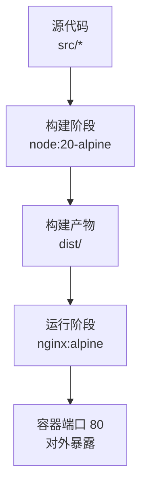
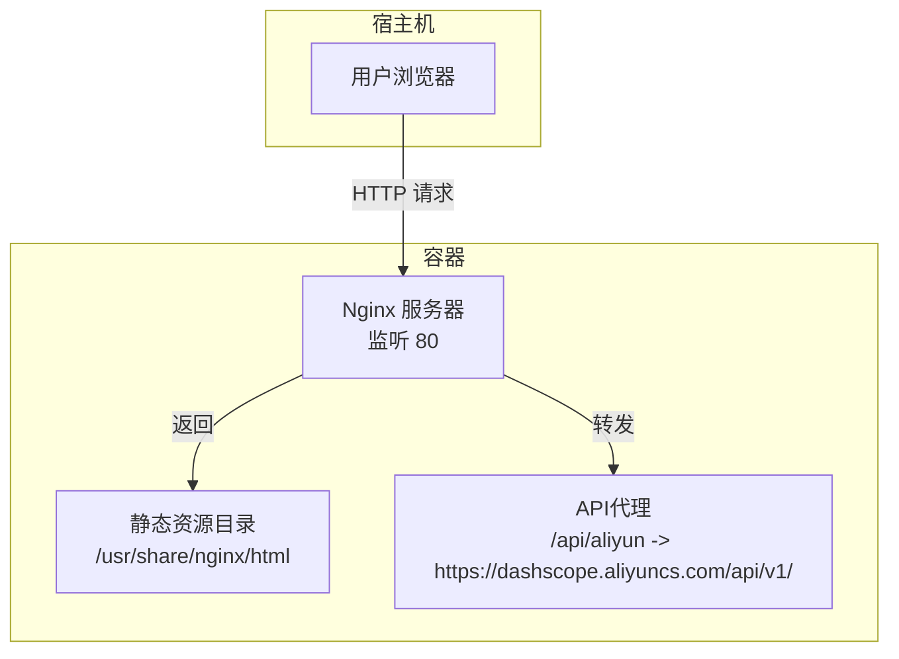
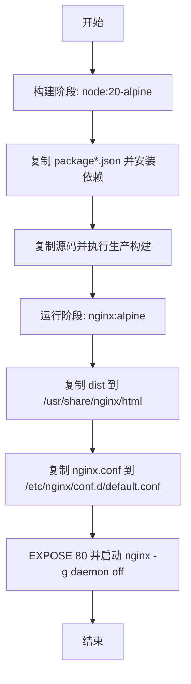
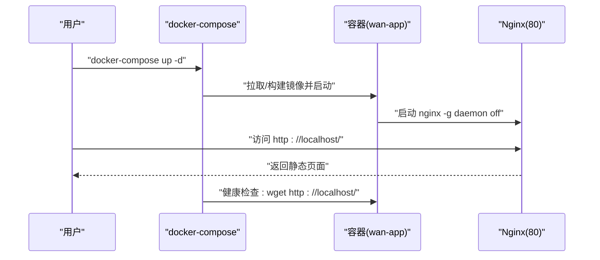
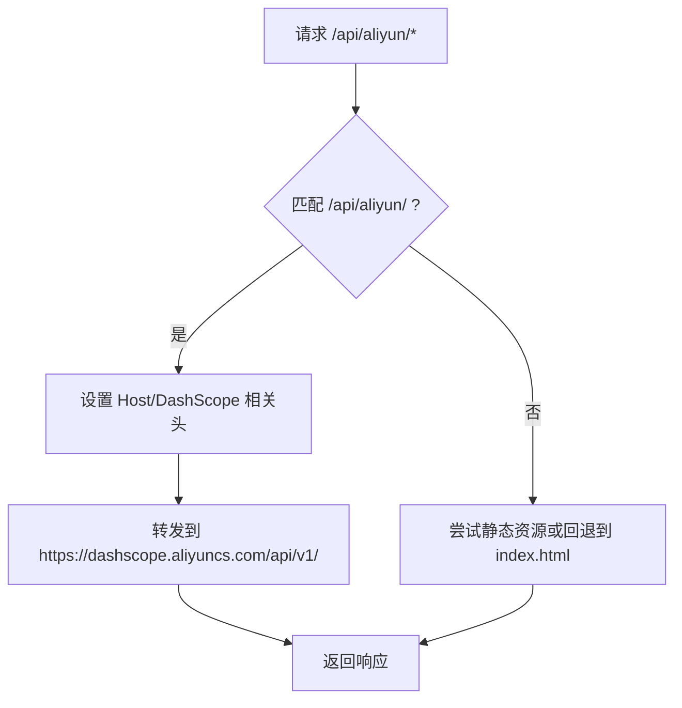
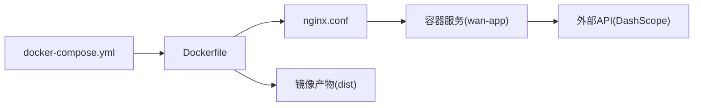

# Docker容器化

<cite>
**本文引用的文件**
- [Dockerfile](file://Dockerfile)
- [docker-compose.yml](file://docker-compose.yml)
- [.dockerignore](file://.dockerignore)
- [nginx.conf](file://nginx.conf)
- [package.json](file://package.json)
- [vite.config.js](file://vite.config.js)
- [DOCKER_DEPLOY.md](file://DOCKER_DEPLOY.md)
- [README.md](file://README.md)
- [deploy-to-ecs.sh](file://deploy-to-ecs.sh)
- [ecs-deploy.sh](file://ecs-deploy.sh)
</cite>

## 目录
1. [简介](#简介)
2. [项目结构](#项目结构)
3. [核心组件](#核心组件)
4. [架构总览](#架构总览)
5. [详细组件分析](#详细组件分析)
6. [依赖关系分析](#依赖关系分析)
7. [性能考量](#性能考量)
8. [故障排查指南](#故障排查指南)
9. [结论](#结论)
10. [附录](#附录)

## 简介
本文件面向运维与开发团队，系统性阐述通义万相前端应用的Docker容器化部署方案。内容涵盖：
- Dockerfile多阶段构建策略与优化点
- docker-compose服务编排与网络/卷配置
- 容器运行最佳实践（环境变量、端口映射、健康检查）
- 镜像构建、推送与版本管理流程
- 运维故障排查与性能监控建议

## 项目结构
该前端应用采用React + Vite技术栈，通过Nginx提供静态资源服务与API代理，Dockerfile实现两阶段构建：Node构建产物，Nginx提供最终运行时。

图表来源
- [Dockerfile](file://Dockerfile#L1-L36)
- [nginx.conf](file://nginx.conf#L1-L80)
- [package.json](file://package.json#L1-L33)

章节来源
- [Dockerfile](file://Dockerfile#L1-L36)
- [docker-compose.yml](file://docker-compose.yml#L1-L23)
- [nginx.conf](file://nginx.conf#L1-L80)
- [package.json](file://package.json#L1-L33)

## 核心组件
- 多阶段Dockerfile：构建阶段使用Node镜像安装依赖并打包；运行阶段使用轻量Nginx镜像提供静态服务与API代理。
- Nginx配置：设置客户端上传大小限制、Gzip压缩、SPA回退、静态资源缓存策略，并对特定路径进行API代理。
- docker-compose：定义单容器服务，暴露端口、设置健康检查、环境变量与元标签。
- 构建工具链：Vite用于开发与生产构建，Tailwind用于样式，ESLint用于代码质量。

章节来源
- [Dockerfile](file://Dockerfile#L1-L36)
- [nginx.conf](file://nginx.conf#L1-L80)
- [docker-compose.yml](file://docker-compose.yml#L1-L23)
- [vite.config.js](file://vite.config.js#L1-L23)
- [package.json](file://package.json#L1-L33)

## 架构总览
容器内的运行时由Nginx承载，负责：
- 提供静态资源（HTML/CSS/JS/媒体文件）
- 对外提供统一入口（监听80端口）
- 将特定API前缀转发至后端服务（阿里云DashScope）

图表来源
- [nginx.conf](file://nginx.conf#L1-L80)
- [Dockerfile](file://Dockerfile#L19-L36)

## 详细组件分析

### Dockerfile 多阶段构建
- 基础镜像选择
  - 构建阶段：基于node:20-alpine，体积小且具备Node与npm能力。
  - 运行阶段：基于nginx:alpine，内置CA证书以减少SSL握手问题。
- 关键步骤
  - 复制并安装依赖后复制源码，执行生产构建。
  - 将构建产物dist复制到Nginx默认站点目录。
  - 应用自定义Nginx配置文件，暴露80端口并以前台方式启动Nginx。
- 优化点
  - 多阶段构建显著减小最终镜像体积。
  - .dockerignore排除node_modules、dist、日志与IDE文件，避免不必要的层变化与缓存污染。

图表来源
- [Dockerfile](file://Dockerfile#L1-L36)

章节来源
- [Dockerfile](file://Dockerfile#L1-L36)
- [.dockerignore](file://.dockerignore#L1-L56)

### docker-compose 服务编排
- 单服务模型：定义名为wan-app的服务，使用当前目录的Dockerfile构建。
- 端口映射：将容器80端口映射到宿主80端口。
- 重启策略：unless-stopped，保证异常退出后自动恢复。
- 环境变量：NODE_ENV=production。
- 健康检查：通过HTTP GET探测根路径，周期30秒，超时10秒，重试3次，初始等待40秒。
- 标签：描述与版本信息，便于运维识别。

图表来源
- [docker-compose.yml](file://docker-compose.yml#L1-L23)

章节来源
- [docker-compose.yml](file://docker-compose.yml#L1-L23)

### Nginx 配置与API代理
- 客户端上传限制：client_max_body_size设置为20M，满足大文件上传场景。
- Gzip压缩：开启并限定类型，提升传输效率。
- SPA路由回退：location / 使用try_files将未命中资源回退到index.html，适配前端路由。
- 静态资源缓存：JS/CSS短期缓存，图片/字体长期缓存，结合Vite内容哈希文件名。
- API代理：location /api/aliyun/转发到https://dashscope.aliyuncs.com/api/v1/，设置必要的头部与CORS头，处理预检请求。
- 错误页：404与5xx错误返回index.html或对应错误页，保持SPA体验。

图表来源
- [nginx.conf](file://nginx.conf#L20-L52)
- [nginx.conf](file://nginx.conf#L54-L58)
- [nginx.conf](file://nginx.conf#L60-L71)

章节来源
- [nginx.conf](file://nginx.conf#L1-L80)

### 构建与运行脚本
- 本地快速启动：通过docker-compose一键构建并以后台模式运行。
- ECS远程部署：提供两套脚本，分别用于从本地推送代码到ECS并构建镜像，以及在ECS侧接收压缩包自动解压、构建、重启容器。
- 开发代理：Vite开发服务器配置了本地代理，将/api/aliyun重写并转发到DashScope，便于本地联调。

章节来源
- [DOCKER_DEPLOY.md](file://DOCKER_DEPLOY.md#L22-L58)
- [deploy-to-ecs.sh](file://deploy-to-ecs.sh#L1-L103)
- [ecs-deploy.sh](file://ecs-deploy.sh#L1-L75)
- [vite.config.js](file://vite.config.js#L13-L20)

## 依赖关系分析
- 组件耦合
  - Dockerfile与Nginx配置强关联：构建产物必须进入/usr/share/nginx/html，否则容器内无法提供静态资源。
  - docker-compose与Dockerfile强关联：服务定义使用当前目录Dockerfile构建。
  - Nginx配置与API代理：/api/aliyun路径直接依赖DashScope域名可达性。
- 外部依赖
  - DashScope域名解析：Nginx配置中使用resolver，确保动态域名解析可用。
  - Node与Nginx基础镜像版本：影响安全补丁与兼容性。

图表来源
- [Dockerfile](file://Dockerfile#L19-L36)
- [nginx.conf](file://nginx.conf#L1-L80)
- [docker-compose.yml](file://docker-compose.yml#L1-L23)

章节来源
- [Dockerfile](file://Dockerfile#L1-L36)
- [docker-compose.yml](file://docker-compose.yml#L1-L23)
- [nginx.conf](file://nginx.conf#L1-L80)

## 性能考量
- 镜像体积与启动速度
  - 多阶段构建显著降低最终镜像体积，有利于快速拉取与启动。
  - Nginx alpine镜像轻量，适合静态资源服务。
- 静态资源优化
  - Gzip压缩与长缓存策略减少带宽消耗，提升首屏加载速度。
  - SPA回退避免重复刷新，改善用户体验。
- API代理性能
  - 合理的超时设置与CORS头，减少跨域与重试开销。
- 运行时资源
  - 建议在生产环境中为容器设置CPU/内存限制，避免资源争用。

章节来源
- [Dockerfile](file://Dockerfile#L19-L36)
- [nginx.conf](file://nginx.conf#L14-L18)
- [nginx.conf](file://nginx.conf#L60-L71)
- [DOCKER_DEPLOY.md](file://DOCKER_DEPLOY.md#L208-L222)

## 故障排查指南
- 构建失败
  - 现象：npm install失败或构建中断。
  - 处理：使用--no-cache重建，清理缓存后重试。
- 容器启动失败
  - 现象：端口被占用导致容器无法启动。
  - 处理：检查宿主机端口占用情况，修改映射端口或释放占用进程。
- API代理不工作
  - 现象：/api/aliyun访问异常。
  - 处理：检查Nginx配置是否生效、查看Nginx错误日志、测试外部连通性。
- 静态资源加载失败
  - 现象：页面白屏或资源404。
  - 处理：确认dist目录存在且已复制到/usr/share/nginx/html，查看访问日志并重新构建。
- 健康检查失败
  - 现象：容器健康状态异常。
  - 处理：调整健康检查参数或修复Nginx服务。

章节来源
- [DOCKER_DEPLOY.md](file://DOCKER_DEPLOY.md#L122-L169)
- [docker-compose.yml](file://docker-compose.yml#L14-L19)

## 结论
本方案通过多阶段Dockerfile与Nginx代理，实现了轻量、稳定、可扩展的前端容器化部署。配合docker-compose的健康检查与标签，便于在生产环境进行自动化运维与监控。建议在生产中启用HTTPS、资源限制与日志轮转，并结合CI/CD流水线实现镜像版本化与灰度发布。

## 附录

### 环境变量与端口映射
- 环境变量：NODE_ENV=production（可在compose中扩展更多变量）。
- 端口映射：默认将容器80映射到宿主80，如冲突可修改映射端口。
- 健康检查：定期探测根路径，确保Nginx正常提供服务。

章节来源
- [docker-compose.yml](file://docker-compose.yml#L12-L19)
- [DOCKER_DEPLOY.md](file://DOCKER_DEPLOY.md#L62-L76)

### 镜像构建、推送与版本管理
- 固定版本标签：建议使用语义化版本标签，如wan-app:1.0.0，并保留latest作为最新快照。
- 推送流程：登录仓库后打标签并推送，支持Docker Hub与私有仓库。
- 更新部署：拉取最新代码后重新构建镜像并重启容器，或一步完成构建与重启。

章节来源
- [DOCKER_DEPLOY.md](file://DOCKER_DEPLOY.md#L171-L179)
- [DOCKER_DEPLOY.md](file://DOCKER_DEPLOY.md#L239-L262)
- [DOCKER_DEPLOY.md](file://DOCKER_DEPLOY.md#L264-L278)

### ECS部署与自动化
- 本地推送ECS：脚本将项目文件上传至ECS，远程构建镜像并启动容器，随后输出状态与日志。
- 服务器端自动更新：接收压缩包后自动解压、构建、停止旧容器并启动新容器，最后清理旧镜像。

章节来源
- [deploy-to-ecs.sh](file://deploy-to-ecs.sh#L1-L103)
- [ecs-deploy.sh](file://ecs-deploy.sh#L1-L75)