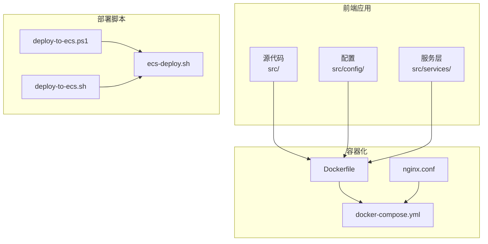
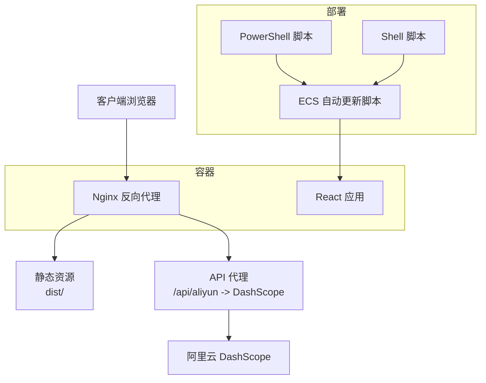
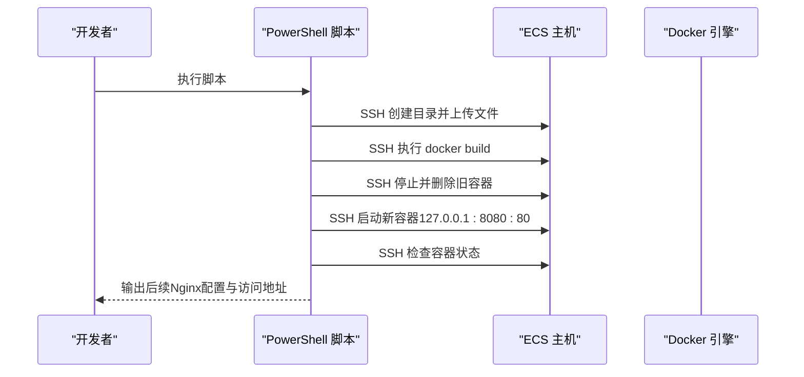
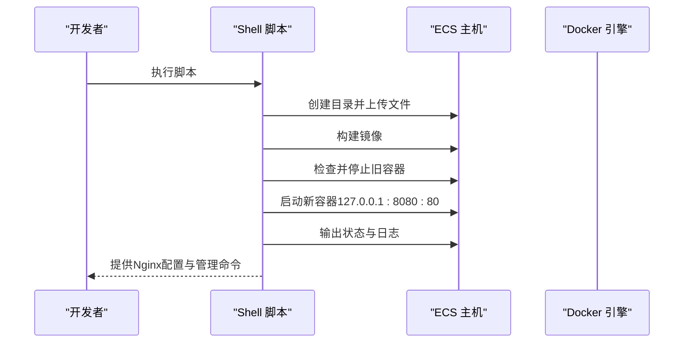
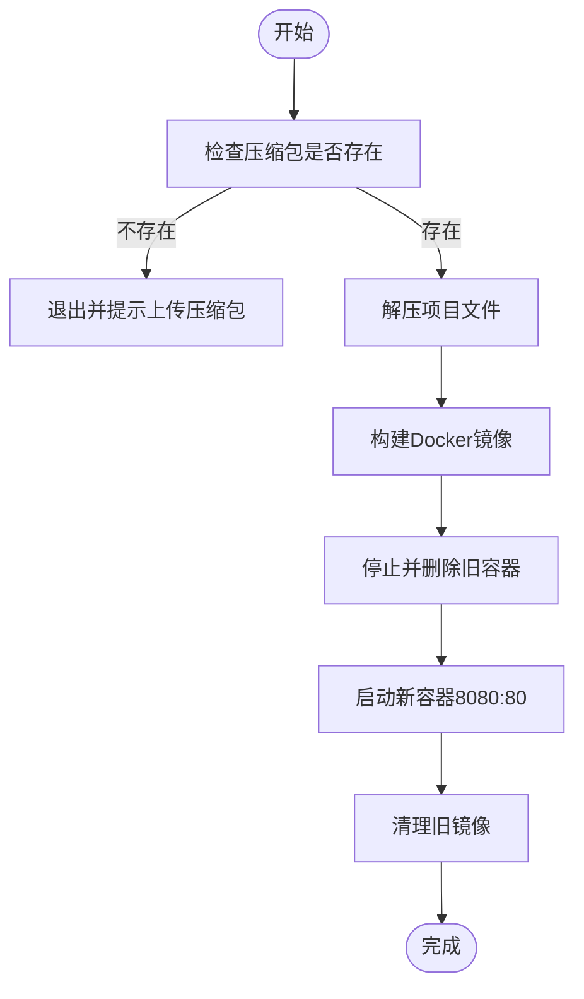
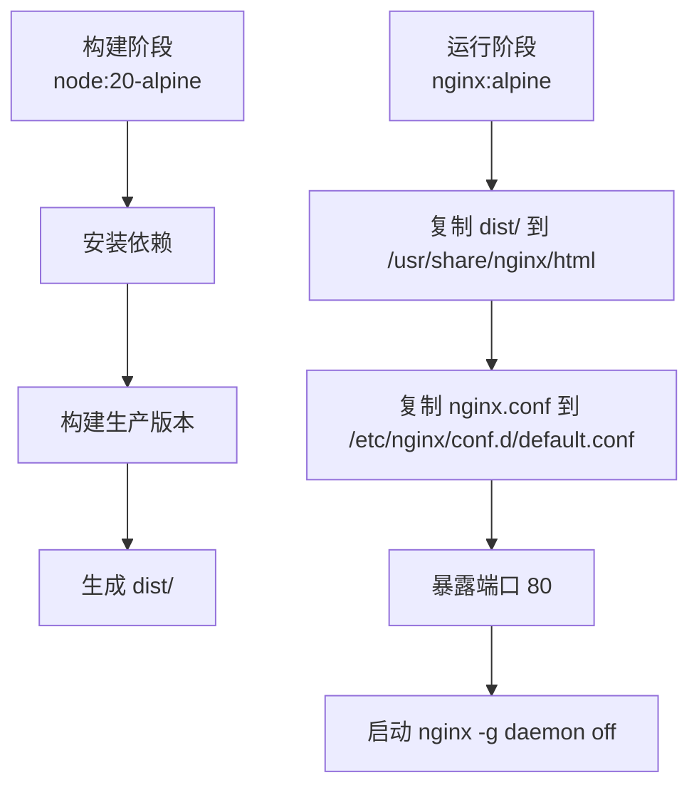
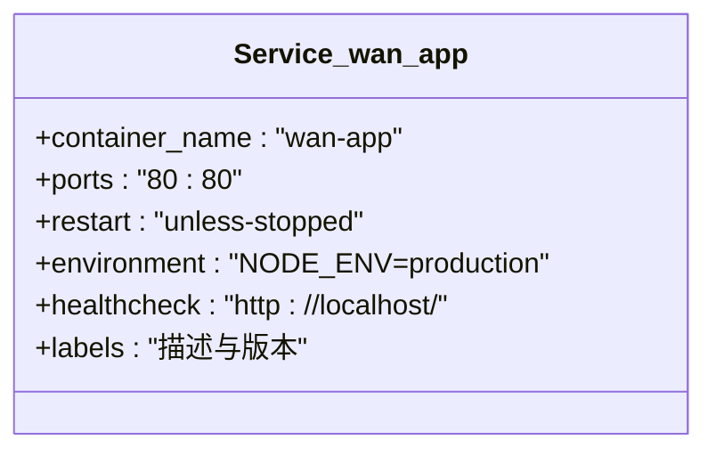
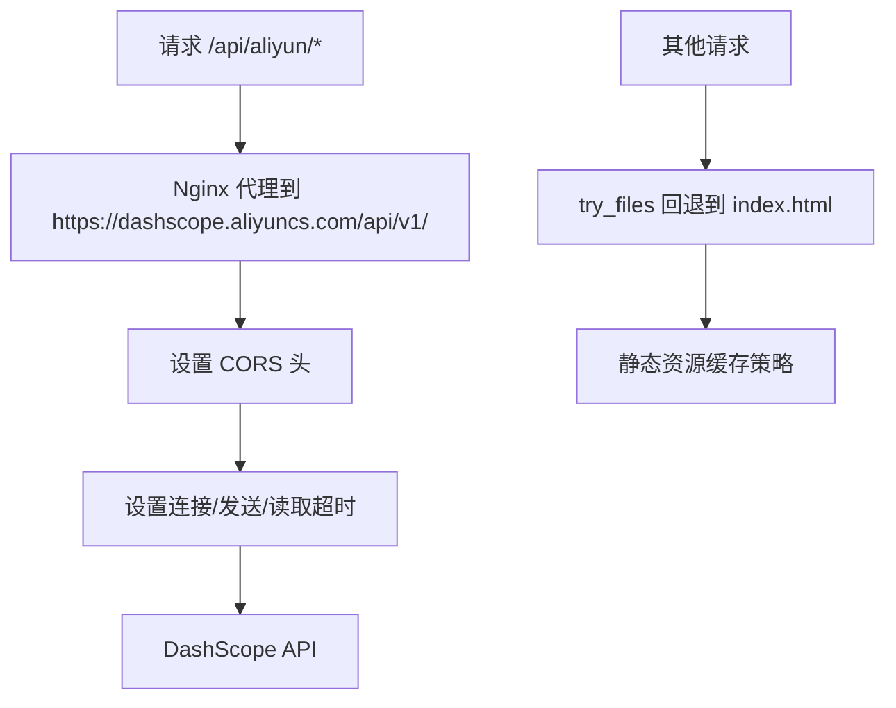
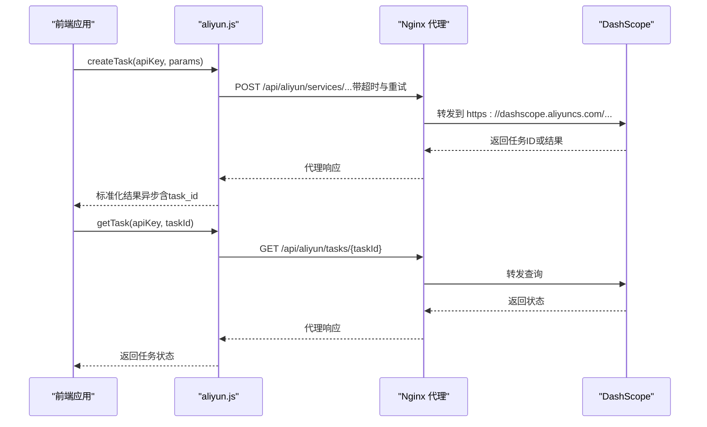
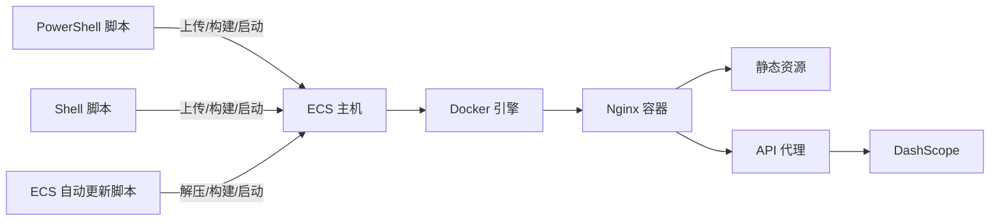

# ECS部署脚本

<cite>
**本文引用的文件**
- [deploy-to-ecs.ps1](file://deploy-to-ecs.ps1)
- [deploy-to-ecs.sh](file://deploy-to-ecs.sh)
- [ecs-deploy.sh](file://ecs-deploy.sh)
- [Dockerfile](file://Dockerfile)
- [docker-compose.yml](file://docker-compose.yml)
- [nginx.conf](file://nginx.conf)
- [DOCKER_DEPLOY.md](file://DOCKER_DEPLOY.md)
- [apiConfig.js](file://src/config/apiConfig.js)
- [aliyun.js](file://src/services/aliyun.js)
- [models.js](file://src/config/models.js)
- [payloadBuilders.js](file://src/services/payloadBuilders.js)
</cite>

## 目录
1. [简介](#简介)
2. [项目结构](#项目结构)
3. [核心组件](#核心组件)
4. [架构概览](#架构概览)
5. [详细组件分析](#详细组件分析)
6. [依赖关系分析](#依赖关系分析)
7. [性能考虑](#性能考虑)
8. [故障排查指南](#故障排查指南)
9. [结论](#结论)
10. [附录](#附录)

## 简介
本文件面向DevOps团队，提供通义万相前端应用在阿里云ECS上的完整ECS云部署文档。内容涵盖部署脚本功能与执行流程、环境准备、镜像构建与容器部署、ECS配置要求、安全组与负载均衡设置、自动扩缩容策略、部署前后验证与监控配置，以及CI/CD集成与回滚策略。

## 项目结构
该前端应用采用React + Vite技术栈，通过Nginx提供静态资源服务，并通过反向代理将阿里云DashScope API请求转发至后端服务。项目包含以下与部署密切相关的文件：
- 部署脚本：PowerShell与Shell两套远程部署脚本，以及ECS服务器端自动更新脚本
- 容器化：Dockerfile多阶段构建与docker-compose编排
- 反向代理：Nginx配置文件，负责静态资源、缓存策略与API代理
- 前端配置：API基础URL、超时与重试策略、存储键值等

图表来源
- [Dockerfile](file://Dockerfile#L1-L36)
- [docker-compose.yml](file://docker-compose.yml#L1-L23)
- [nginx.conf](file://nginx.conf#L1-L80)
- [deploy-to-ecs.ps1](file://deploy-to-ecs.ps1#L1-L70)
- [deploy-to-ecs.sh](file://deploy-to-ecs.sh#L1-L103)
- [ecs-deploy.sh](file://ecs-deploy.sh#L1-L75)

章节来源
- [Dockerfile](file://Dockerfile#L1-L36)
- [docker-compose.yml](file://docker-compose.yml#L1-L23)
- [nginx.conf](file://nginx.conf#L1-L80)
- [deploy-to-ecs.ps1](file://deploy-to-ecs.ps1#L1-L70)
- [deploy-to-ecs.sh](file://deploy-to-ecs.sh#L1-L103)
- [ecs-deploy.sh](file://ecs-deploy.sh#L1-L75)

## 核心组件
- 部署脚本（PowerShell/Shell）：负责将项目文件上传至ECS、在ECS上构建镜像、停止旧容器、启动新容器并检查状态
- ECS服务器端自动更新脚本：接收压缩包，解压、构建镜像、停止旧容器、启动新容器并清理旧镜像
- Dockerfile：多阶段构建，前端构建产物复制至Nginx镜像，暴露80端口
- docker-compose：定义服务、端口映射、健康检查、重启策略与环境变量
- Nginx配置：静态资源缓存、Gzip压缩、API代理到DashScope、SPA路由回退
- 前端API配置与服务：统一的API基础URL、超时与重试策略、任务轮询、模型与请求体构造

章节来源
- [deploy-to-ecs.ps1](file://deploy-to-ecs.ps1#L1-L70)
- [deploy-to-ecs.sh](file://deploy-to-ecs.sh#L1-L103)
- [ecs-deploy.sh](file://ecs-deploy.sh#L1-L75)
- [Dockerfile](file://Dockerfile#L1-L36)
- [docker-compose.yml](file://docker-compose.yml#L1-L23)
- [nginx.conf](file://nginx.conf#L1-L80)
- [apiConfig.js](file://src/config/apiConfig.js#L1-L35)
- [aliyun.js](file://src/services/aliyun.js#L1-L215)
- [models.js](file://src/config/models.js#L1-L800)
- [payloadBuilders.js](file://src/services/payloadBuilders.js#L1-L800)

## 架构概览
前端应用通过Nginx提供静态资源与API代理，容器化部署于ECS，支持反向代理与健康检查。部署脚本负责远程构建与容器生命周期管理。

图表来源
- [nginx.conf](file://nginx.conf#L20-L52)
- [Dockerfile](file://Dockerfile#L19-L35)
- [deploy-to-ecs.ps1](file://deploy-to-ecs.ps1#L15-L34)
- [deploy-to-ecs.sh](file://deploy-to-ecs.sh#L19-L66)
- [ecs-deploy.sh](file://ecs-deploy.sh#L22-L51)

## 详细组件分析

### 部署脚本（PowerShell）
- 功能概述：在Windows环境下通过SSH/SFTP将项目文件上传至ECS，构建镜像，停止并删除旧容器，启动新容器，检查状态
- 关键步骤：
  - 上传项目文件到/opt/wan-app
  - 在ECS上执行docker build
  - 停止并删除旧容器（兼容不存在的情况）
  - 以只监听本地回环的方式启动容器，映射8080端口至容器80端口
  - 检查容器状态
  - 输出后续Nginx配置建议与访问地址

图表来源
- [deploy-to-ecs.ps1](file://deploy-to-ecs.ps1#L15-L34)

章节来源
- [deploy-to-ecs.ps1](file://deploy-to-ecs.ps1#L1-L70)

### 部署脚本（Shell）
- 功能概述：Linux/macOS环境下执行相同流程，使用ssh/scp进行文件传输，支持条件判断与更详细的日志输出
- 关键步骤：
  - 上传项目文件到/opt/wan-app
  - 在ECS上构建镜像
  - 条件判断是否存在旧容器，存在则停止并删除
  - 启动新容器，映射8080端口至容器80端口
  - 输出容器状态与最近日志
  - 提供Nginx配置示例与管理命令

图表来源
- [deploy-to-ecs.sh](file://deploy-to-ecs.sh#L19-L66)

章节来源
- [deploy-to-ecs.sh](file://deploy-to-ecs.sh#L1-L103)

### ECS服务器端自动更新脚本
- 功能概述：接收压缩包，解压、构建镜像、停止旧容器、启动新容器并清理旧镜像
- 关键步骤：
  - 检查压缩包是否存在
  - 解压项目文件到/usr/wan
  - 构建Docker镜像
  - 停止并删除旧容器
  - 启动新容器，映射8080端口至容器80端口
  - 清理旧镜像
  - 输出容器状态与最新日志

图表来源
- [ecs-deploy.sh](file://ecs-deploy.sh#L15-L55)

章节来源
- [ecs-deploy.sh](file://ecs-deploy.sh#L1-L75)

### Dockerfile（多阶段构建）
- 构建阶段：基于node:20-alpine，安装依赖并构建生产版本
- 运行阶段：基于nginx:alpine，复制构建产物与Nginx配置，暴露80端口
- 作用：将React构建产物作为静态站点提供服务

图表来源
- [Dockerfile](file://Dockerfile#L1-L36)

章节来源
- [Dockerfile](file://Dockerfile#L1-L36)

### docker-compose（服务编排）
- 服务名称：wan-app
- 端口映射：主机80:容器80
- 重启策略：unless-stopped
- 健康检查：对本地根路径进行HTTP探测
- 环境变量：NODE_ENV=production
- 标签：应用描述与版本信息

图表来源
- [docker-compose.yml](file://docker-compose.yml#L3-L23)

章节来源
- [docker-compose.yml](file://docker-compose.yml#L1-L23)

### Nginx配置（静态资源与API代理）
- 静态资源：root指向dist，SPA回退到index.html，Gzip压缩与缓存策略
- API代理：将/api/aliyun/前缀转发至DashScope API，设置CORS头与超时
- 错误页：404与常见错误页指向HTML

图表来源
- [nginx.conf](file://nginx.conf#L20-L52)
- [nginx.conf](file://nginx.conf#L54-L58)
- [nginx.conf](file://nginx.conf#L60-L71)

章节来源
- [nginx.conf](file://nginx.conf#L1-L80)

### 前端API配置与服务
- API基础URL：/api/aliyun，统一代理入口
- 超时与重试：请求超时与轮询超时，指数退避重试
- 任务管理：创建任务（同步/异步）、轮询任务状态、批量轮询
- 模型与请求体：通过模型注册表与payload构建器动态生成请求体

图表来源
- [apiConfig.js](file://src/config/apiConfig.js#L5-L12)
- [aliyun.js](file://src/services/aliyun.js#L50-L160)
- [aliyun.js](file://src/services/aliyun.js#L170-L202)
- [nginx.conf](file://nginx.conf#L20-L52)

章节来源
- [apiConfig.js](file://src/config/apiConfig.js#L1-L35)
- [aliyun.js](file://src/services/aliyun.js#L1-L215)
- [models.js](file://src/config/models.js#L1-L800)
- [payloadBuilders.js](file://src/services/payloadBuilders.js#L1-L800)

## 依赖关系分析
- 部署脚本依赖：ECS主机可达性、Docker环境、SSH密钥认证
- 容器依赖：Nginx镜像、构建产物（dist/）、Nginx配置
- 前端依赖：API基础URL与DashScope代理、模型配置与payload构建器

图表来源
- [deploy-to-ecs.ps1](file://deploy-to-ecs.ps1#L15-L34)
- [deploy-to-ecs.sh](file://deploy-to-ecs.sh#L19-L66)
- [ecs-deploy.sh](file://ecs-deploy.sh#L22-L51)
- [Dockerfile](file://Dockerfile#L19-L35)
- [nginx.conf](file://nginx.conf#L20-L52)

章节来源
- [deploy-to-ecs.ps1](file://deploy-to-ecs.ps1#L1-L70)
- [deploy-to-ecs.sh](file://deploy-to-ecs.sh#L1-L103)
- [ecs-deploy.sh](file://ecs-deploy.sh#L1-L75)
- [Dockerfile](file://Dockerfile#L1-L36)
- [nginx.conf](file://nginx.conf#L1-L80)

## 性能考虑
- 静态资源缓存：JS/CSS短期缓存、图片/字体长期缓存，减少带宽与提高首屏速度
- Gzip压缩：降低传输体积
- 健康检查：容器定期探测，保障可用性
- 资源限制：建议在生产环境中为容器设置CPU与内存限制，避免资源争用
- HTTPS：建议启用TLS终止于Nginx，提升安全性与SEO

## 故障排查指南
- 构建失败：检查npm依赖安装与构建命令；必要时清理缓存后重建
- 容器启动失败：检查端口占用（80/8080），修改映射或释放端口
- API代理不工作：检查Nginx配置、DashScope连通性与CORS头
- 静态资源加载失败：确认dist目录存在、Nginx访问/错误日志、重新构建
- 容器健康状态：通过docker inspect查看健康检查结果

章节来源
- [DOCKER_DEPLOY.md](file://DOCKER_DEPLOY.md#L122-L169)
- [DOCKER_DEPLOY.md](file://DOCKER_DEPLOY.md#L171-L237)

## 结论
本文档提供了从脚本执行到容器部署、从Nginx代理到API转发的全链路部署指南。结合健康检查与缓存策略，可在ECS上稳定运行通义万相前端应用。建议在生产中进一步完善安全组、负载均衡与自动扩缩容策略，并建立CI/CD流水线与回滚机制。

## 附录

### 部署前准备清单
- ECS实例规格与系统镜像（建议安装Docker与必要工具）
- 安全组规则：开放80/443端口（与负载均衡配合）、允许来自CI/CD与运维网段的SSH访问
- 负载均衡：配置监听器（HTTP 80/HTTPS 443）、后端服务器组、健康检查
- 自动扩缩容：基于CPU/内存/请求速率触发扩缩容策略
- 存储：为日志与静态资源预留磁盘空间，必要时挂载独立卷
- AK配置：在前端或代理层安全地管理DashScope API密钥（不建议硬编码在镜像中）

### 部署步骤（ECS）
- 选择部署方式：
  - 远程部署：在本地执行PowerShell或Shell脚本，自动完成上传、构建、启动与检查
  - 自动更新：将压缩包上传至ECS指定目录，执行服务器端脚本完成解压、构建与启动
- 配置Nginx：根据脚本输出或附录中的示例配置反向代理与缓存策略
- 验证：访问域名或公网IP，检查页面渲染、静态资源加载与API代理
- 监控：启用容器健康检查、日志聚合与告警

### CI/CD集成与回滚策略
- CI/CD建议：
  - 触发条件：代码推送至主分支或打标签
  - 步骤：构建镜像、推送至镜像仓库、触发ECS部署（远程脚本或自动更新脚本）
  - 回滚：保留镜像版本标签，回滚时切换到上一个稳定版本
- 回滚策略：
  - 快速回滚：通过容器编排工具切换镜像版本
  - 灰度发布：逐步替换部分实例，观察指标后再全量
  - 健康检查：结合容器健康检查与外部探活，失败自动回滚