# Nginx配置

<cite>
**本文档引用的文件**
- [nginx.conf](file://nginx.conf)
- [Dockerfile](file://Dockerfile)
- [docker-compose.yml](file://docker-compose.yml)
- [vite.config.js](file://vite.config.js)
- [apiConfig.js](file://src/config/apiConfig.js)
- [aliyun.js](file://src/services/aliyun.js)
- [index.html](file://index.html)
- [dist/index.html](file://dist/index.html)
</cite>

## 目录
1. [简介](#简介)
2. [项目结构](#项目结构)
3. [核心组件](#核心组件)
4. [架构概览](#架构概览)
5. [详细组件分析](#详细组件分析)
6. [依赖关系分析](#依赖关系分析)
7. [性能考虑](#性能考虑)
8. [故障排除指南](#故障排除指南)
9. [结论](#结论)

## 简介

本文档为通义万相前端应用提供全面的Nginx配置指南。该应用是一个基于React和Vite的单页应用程序(SPA)，通过Nginx提供静态文件服务，并配置了反向代理以访问阿里云DashScope API。文档深入解释了Nginx配置文件的各项设置，包括虚拟主机配置、静态文件服务、反向代理设置、SSL证书配置、缓存策略、压缩设置、跨域配置和安全头部设置。

## 项目结构

通义万相前端应用采用现代化的开发和部署架构：

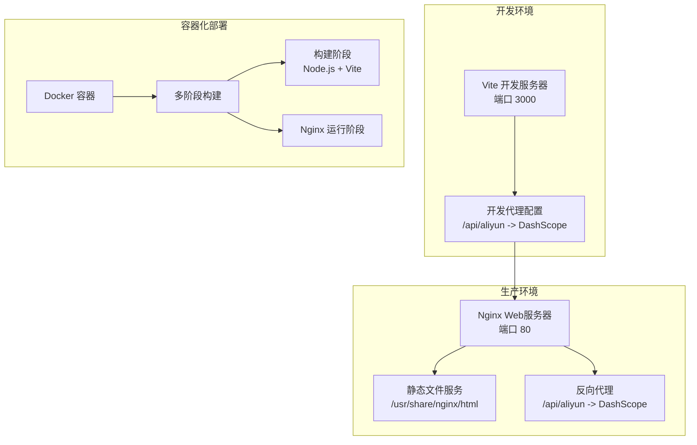

**图表来源**
- [Dockerfile](file://Dockerfile#L1-L36)
- [docker-compose.yml](file://docker-compose.yml#L1-L23)
- [vite.config.js](file://vite.config.js#L1-L23)

**章节来源**
- [Dockerfile](file://Dockerfile#L1-L36)
- [docker-compose.yml](file://docker-compose.yml#L1-L23)
- [vite.config.js](file://vite.config.js#L1-L23)

## 核心组件

### Nginx虚拟主机配置

应用使用标准的Nginx虚拟主机配置，监听80端口并提供静态文件服务：

- **监听端口**: 80
- **服务器名称**: localhost
- **根目录**: /usr/share/nginx/html
- **默认索引文件**: index.html

### 反向代理配置

核心的反向代理配置用于访问阿里云DashScope API：

- **代理路径**: /api/aliyun/
- **目标地址**: https://dashscope.aliyuncs.com/api/v1/
- **HTTP版本**: 1.1
- **SSL验证**: 关闭(开发环境)
- **服务器名称验证**: 启用

### 缓存策略

应用实现了智能的缓存策略，针对不同类型的静态资源采用不同的缓存策略：

- **短期缓存**: JavaScript和CSS文件(7天)
- **长期缓存**: 图片、字体等静态资源(1年)
- **SPA缓存**: HTML文件(禁用缓存)

**章节来源**
- [nginx.conf](file://nginx.conf#L5-L80)

## 架构概览

通义万相应用的完整架构如下：

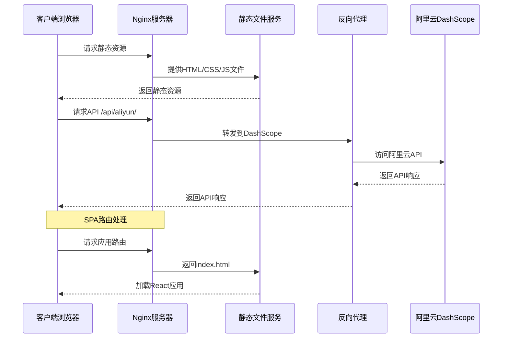

**图表来源**
- [nginx.conf](file://nginx.conf#L20-L52)
- [apiConfig.js](file://src/config/apiConfig.js#L6)

## 详细组件分析

### Nginx配置文件详解

#### 基础配置部分

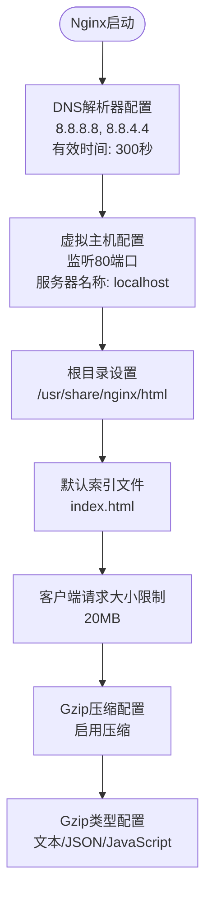

**图表来源**
- [nginx.conf](file://nginx.conf#L1-L19)

#### 反向代理配置分析

反向代理配置是整个应用的核心组件：

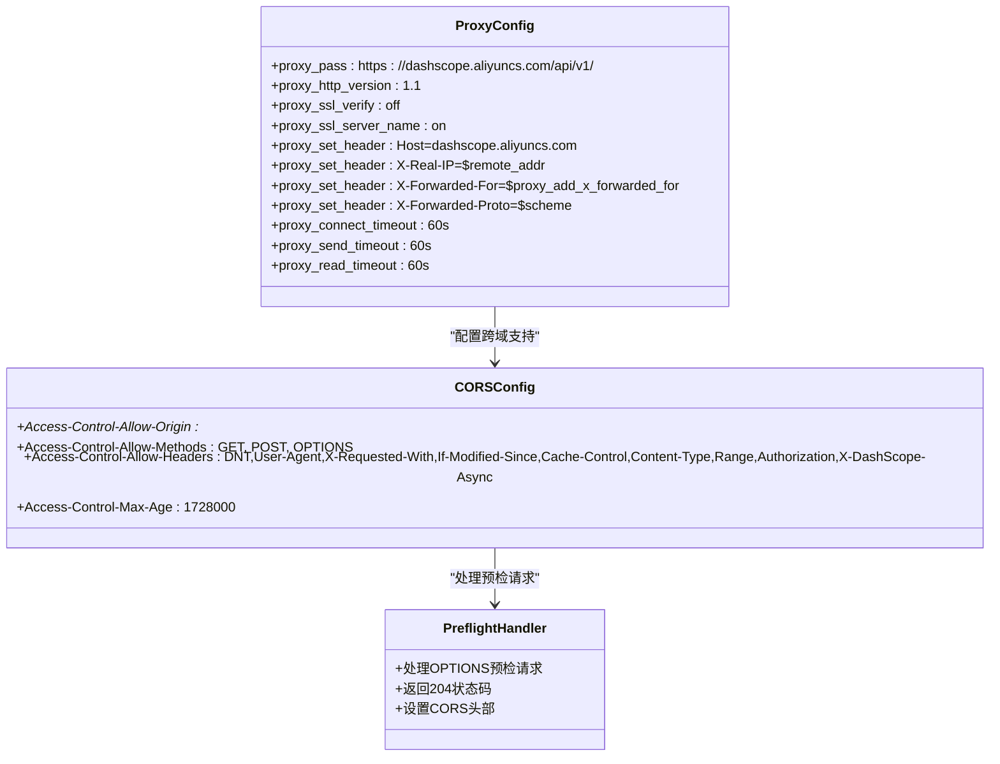

**图表来源**
- [nginx.conf](file://nginx.conf#L20-L52)

#### 缓存策略配置

应用实现了分层缓存策略：

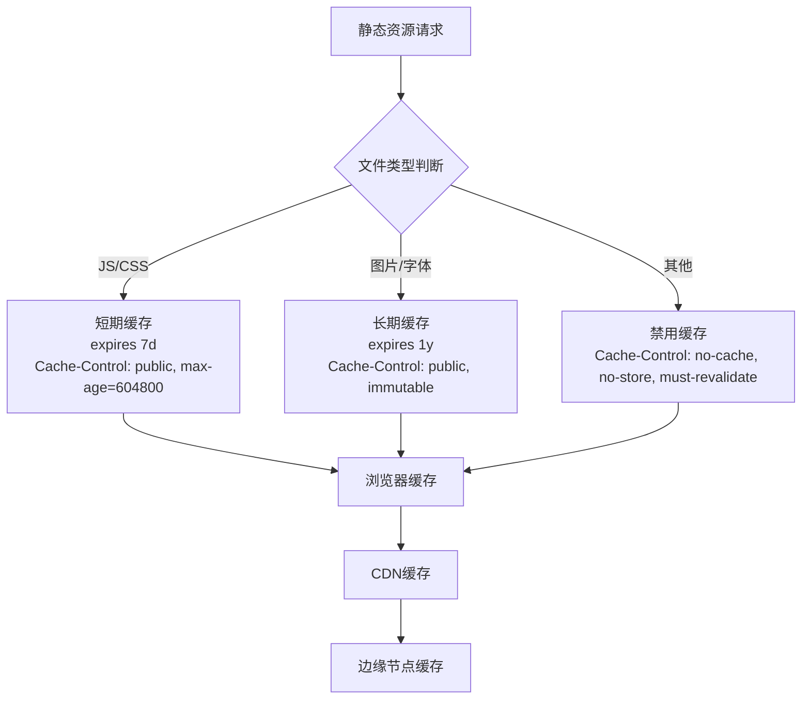

**图表来源**
- [nginx.conf](file://nginx.conf#L60-L71)

#### SPA路由处理

单页应用的路由处理机制：

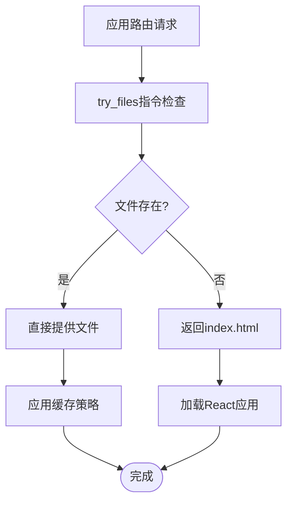

**图表来源**
- [nginx.conf](file://nginx.conf#L54-L58)

**章节来源**
- [nginx.conf](file://nginx.conf#L1-L80)

### 容器化部署配置

#### 多阶段构建流程

```mermaid
flowchart TD
BuildStart[开始构建] --> Stage1[第一阶段: 构建阶段]
Stage1 --> NodeBase[使用node:20-alpine镜像]
NodeBase --> InstallDeps[安装npm依赖]
InstallDeps --> CopySrc[复制源代码]
CopySrc --> BuildApp[运行npm run build]
BuildApp --> Stage2[第二阶段: 运行阶段]
Stage2 --> NginxBase[使用nginx:alpine镜像]
NginxBase --> InstallCA[安装CA证书]
InstallCA --> CopyDist[复制构建产物到/usr/share/nginx/html]
CopyDist --> CopyConf[复制nginx.conf到/etc/nginx/conf.d/default.conf]
CopyConf --> ExposePort[暴露80端口]
ExposePort --> StartNginx[启动nginx -g "daemon off;"]
StartNginx --> End([构建完成])
```

**图表来源**
- [Dockerfile](file://Dockerfile#L1-L36)

#### Docker Compose配置

Docker Compose提供了简化的部署方式：

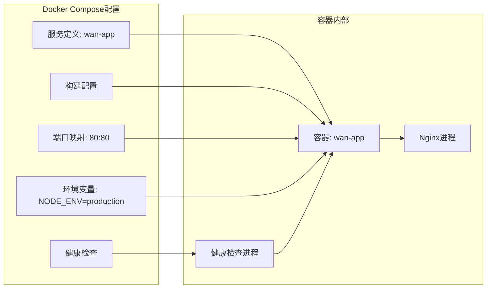

**图表来源**
- [docker-compose.yml](file://docker-compose.yml#L1-L23)

**章节来源**
- [Dockerfile](file://Dockerfile#L1-L36)
- [docker-compose.yml](file://docker-compose.yml#L1-L23)

### 前端集成配置

#### API配置分析

前端应用通过统一的API配置与后端交互：

```mermaid
classDiagram
class APIConfig {
+API_BASE_URL : "/api/aliyun"
+TIMEOUT : {
REQUEST : 120000,
POLLING : 30000
}
+RETRY : {
MAX_ATTEMPTS : 2,
INITIAL_DELAY : 1000,
BACKOFF_FACTOR : 1.5
}
+POLLING : {
INTERVAL : 2000,
INITIAL_INTERVAL : 1000,
MAX_INTERVAL : 5000,
STATUS_DONE : ['SUCCEEDED', 'FAILED', 'CANCELED', 'UNKNOWN']
}
+STORAGE : {
TASKS : 'wan_app_tasks_v2',
API_KEY : 'aliyun_api_key',
LEGACY_TASKS : 'wan_video_history'
}
}
class AliyunService {
+createTask(apiKey, params)
+getTask(apiKey, taskId)
+getBatchTasks(apiKey, taskIds)
-retryRequest(fn, retries, delay)
-getHeaders(apiKey, isAsync)
}
APIConfig --> AliyunService : "提供配置常量"
AliyunService --> APIConfig : "使用配置参数"
```

**图表来源**
- [apiConfig.js](file://src/config/apiConfig.js#L1-L35)
- [aliyun.js](file://src/services/aliyun.js#L1-L215)

#### 开发代理配置

Vite开发服务器的代理配置与生产环境保持一致：

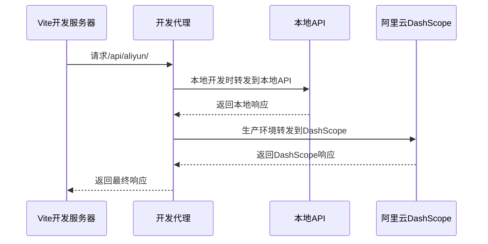

**图表来源**
- [vite.config.js](file://vite.config.js#L13-L20)

**章节来源**
- [apiConfig.js](file://src/config/apiConfig.js#L1-L35)
- [aliyun.js](file://src/services/aliyun.js#L1-L215)
- [vite.config.js](file://vite.config.js#L1-L23)

## 依赖关系分析

### 组件依赖图

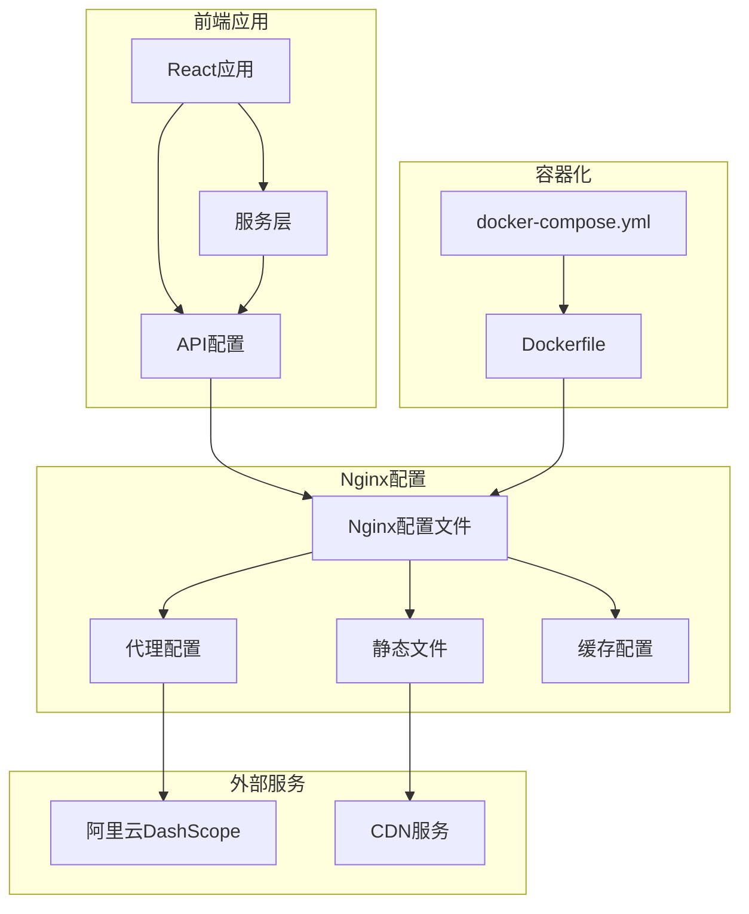

**图表来源**
- [nginx.conf](file://nginx.conf#L1-L80)
- [Dockerfile](file://Dockerfile#L1-L36)
- [docker-compose.yml](file://docker-compose.yml#L1-L23)

### 数据流分析

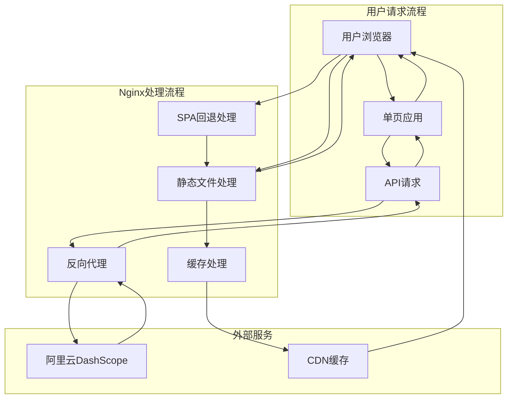

**图表来源**
- [nginx.conf](file://nginx.conf#L54-L58)
- [nginx.conf](file://nginx.conf#L20-L52)

**章节来源**
- [nginx.conf](file://nginx.conf#L1-L80)

## 性能考虑

### 缓存优化策略

应用采用了多层次的缓存策略来提升性能：

1. **浏览器缓存**: 通过适当的Cache-Control头实现
2. **CDN缓存**: 长期缓存的静态资源可被CDN缓存
3. **边缘缓存**: 通过expires指令实现边缘节点缓存

### 压缩配置

Gzip压缩配置优化了传输性能：

- **启用压缩**: gzip on
- **压缩类型**: 文本/HTML/CSS/JavaScript/JSON
- **最小长度**: 1024字节
- **Vary头**: gzip_vary on

### 连接池和超时配置

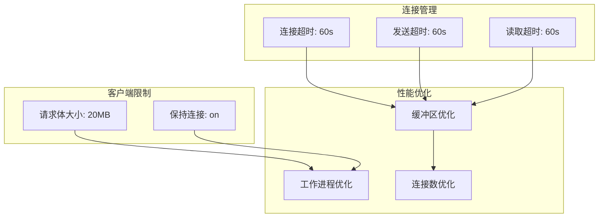

**图表来源**
- [nginx.conf](file://nginx.conf#L12)
- [nginx.conf](file://nginx.conf#L48-L51)

### 建议的性能优化

1. **SSL证书配置**: 建议添加SSL配置以支持HTTPS
2. **负载均衡**: 在高流量场景下考虑添加负载均衡
3. **监控指标**: 添加访问日志和性能监控
4. **安全增强**: 添加安全头部和访问控制

**章节来源**
- [nginx.conf](file://nginx.conf#L14-L18)
- [nginx.conf](file://nginx.conf#L48-L51)

## 故障排除指南

### 常见问题诊断

#### 代理配置问题

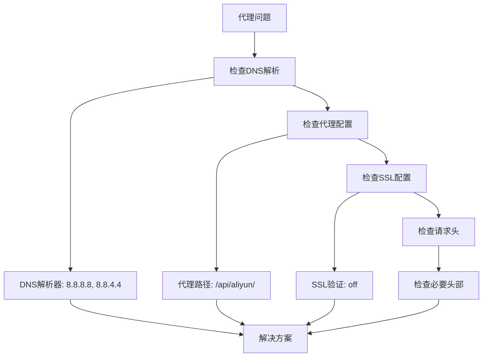

#### 缓存问题诊断

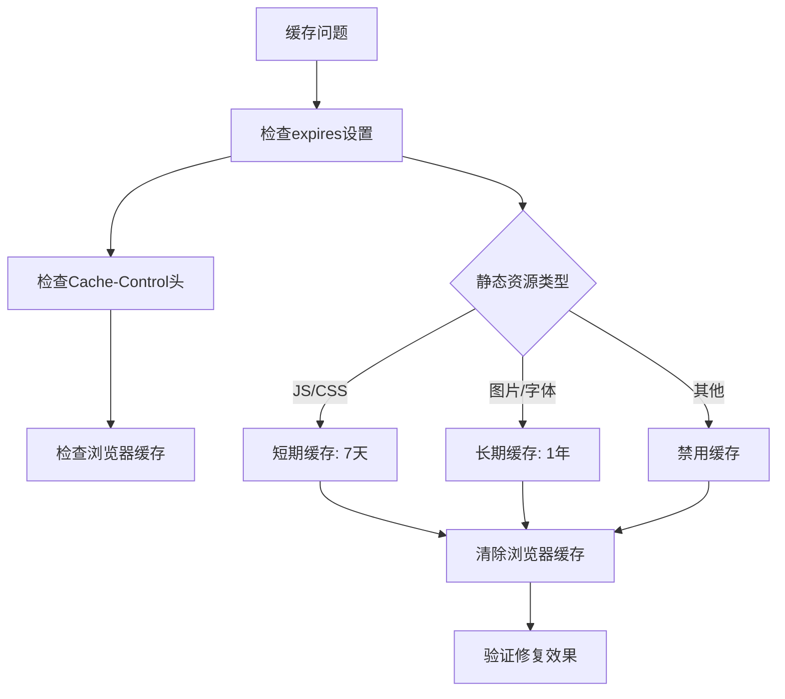

#### SPA路由问题

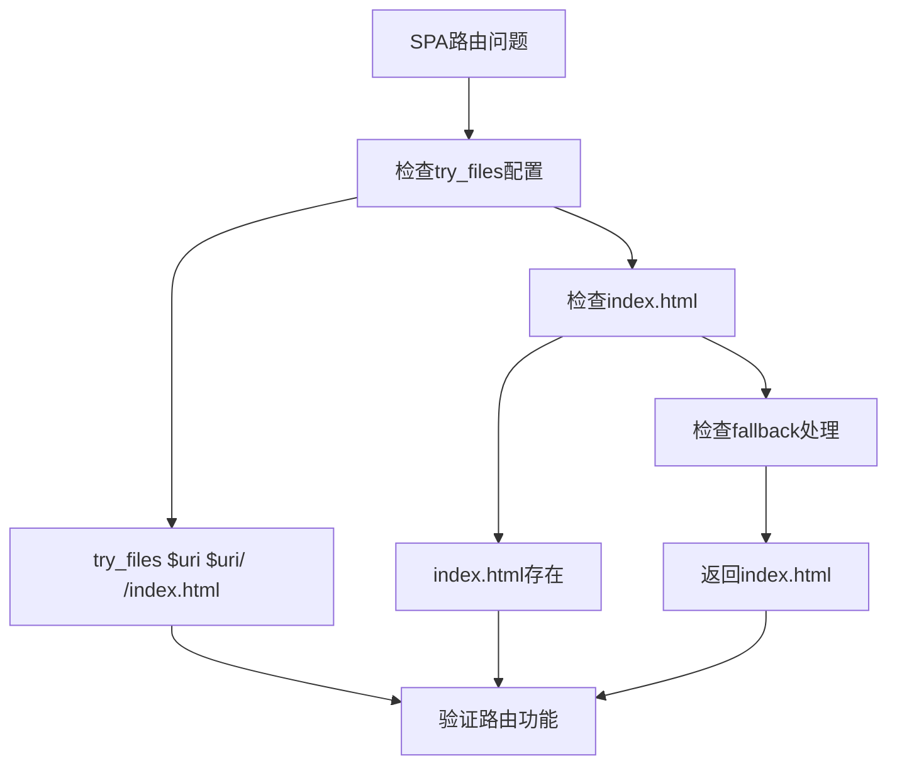

### 日志配置建议

为了更好地监控和调试，建议添加以下日志配置：

```nginx
# 访问日志配置
access_log /var/log/nginx/access.log combined;

# 错误日志配置
error_log /var/log/nginx/error.log warn;

# 自定义日志格式
log_format app_log '$remote_addr - $remote_user [$time_local] "$request" '
                  '$status $body_bytes_sent "$http_referer" '
                  '"$http_user_agent" "$http_x_forwarded_for"';

# 应用特定日志
access_log /var/log/nginx/app_access.log app_log;
```

### 监控指标

建议监控以下关键指标：

1. **请求量**: 每分钟请求数
2. **响应时间**: 平均响应时间和95百分位
3. **错误率**: 4xx/5xx错误比例
4. **带宽使用**: 出站带宽统计
5. **缓存命中率**: CDN和浏览器缓存效率

**章节来源**
- [nginx.conf](file://nginx.conf#L54-L58)
- [nginx.conf](file://nginx.conf#L60-L71)

## 结论

通义万相前端应用的Nginx配置展现了现代Web应用的最佳实践：

1. **清晰的架构设计**: 通过反向代理实现前后端分离
2. **智能缓存策略**: 针对不同类型资源采用差异化缓存
3. **SPA友好配置**: 支持HTML5历史记录API
4. **容器化部署**: 多阶段构建确保生产环境一致性

### 主要优势

- **开发与生产一致性**: 开发代理配置与生产代理配置保持一致
- **性能优化**: 智能缓存和压缩配置提升用户体验
- **可维护性**: 清晰的配置结构便于维护和扩展
- **安全性**: CORS配置和请求头处理确保API安全

### 改进建议

1. **SSL配置**: 添加HTTPS支持以提升安全性
2. **监控完善**: 添加详细的日志和监控配置
3. **安全增强**: 添加安全头部和访问控制策略
4. **性能调优**: 根据实际流量调整连接池和缓存参数

该配置为通义万相应用提供了稳定、高效的前端服务基础，能够满足生产环境的需求并具备良好的扩展性。