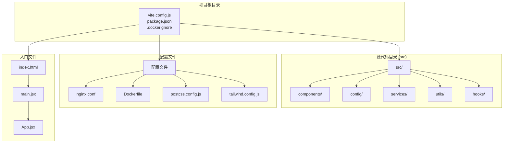
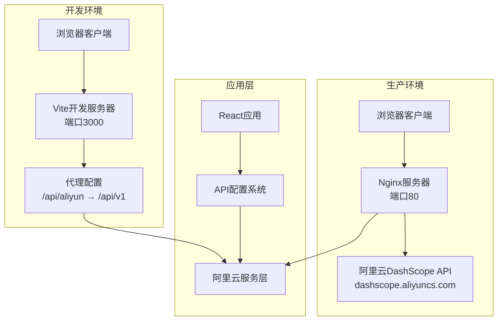
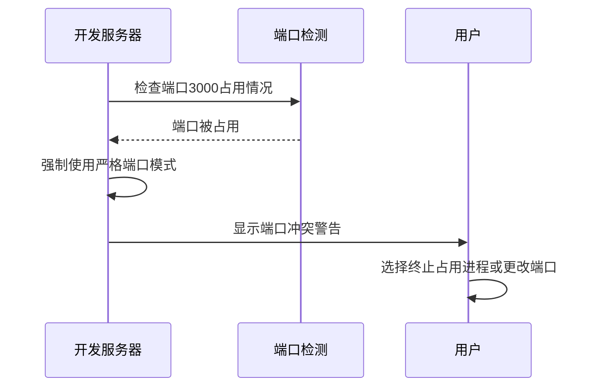
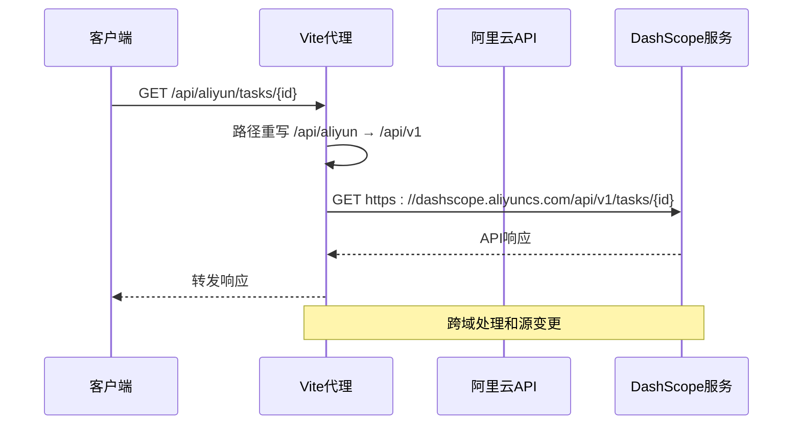
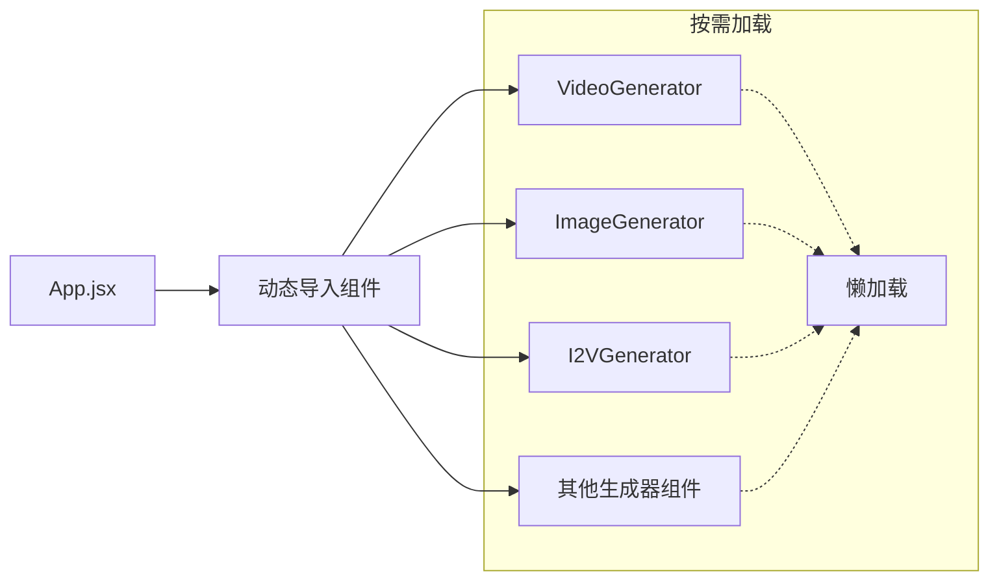
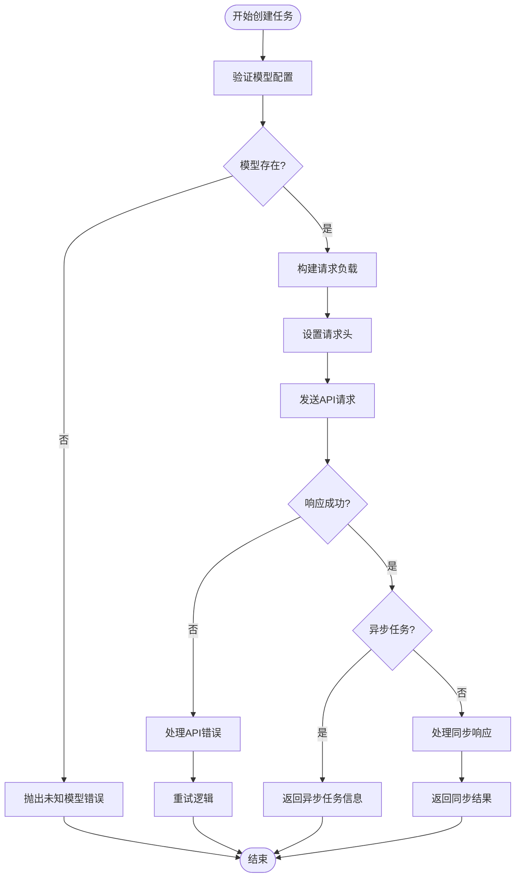
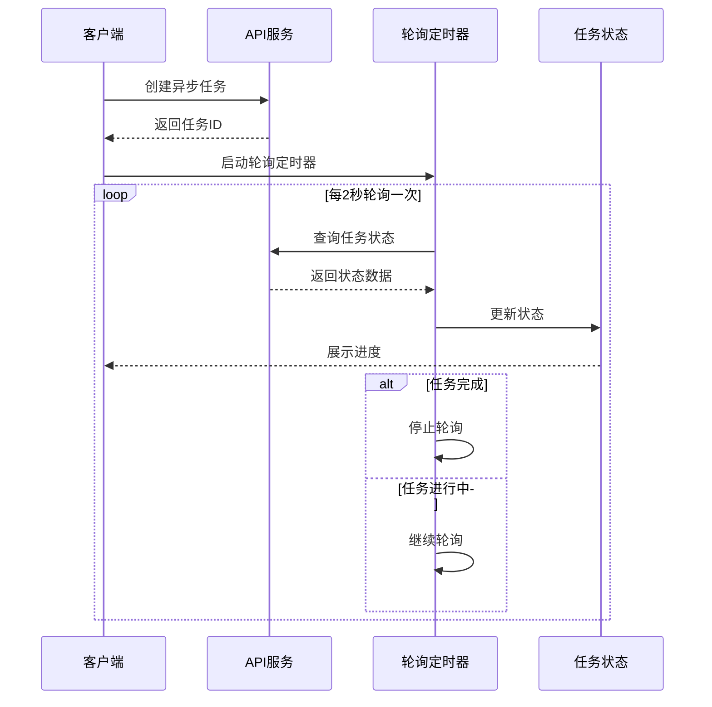

# Vite构建配置

<cite>
**本文档引用的文件**
- [vite.config.js](file://vite.config.js)
- [package.json](file://package.json)
- [src/config/apiConfig.js](file://src/config/apiConfig.js)
- [src/services/aliyun.js](file://src/services/aliyun.js)
- [nginx.conf](file://nginx.conf)
- [Dockerfile](file://Dockerfile)
- [eslint.config.js](file://eslint.config.js)
- [postcss.config.js](file://postcss.config.js)
- [tailwind.config.js](file://tailwind.config.js)
- [index.html](file://index.html)
- [src/App.jsx](file://src/App.jsx)
- [src/main.jsx](file://src/main.jsx)
</cite>

## 目录
1. [简介](#简介)
2. [项目结构](#项目结构)
3. [核心组件](#核心组件)
4. [架构概览](#架构概览)
5. [详细组件分析](#详细组件分析)
6. [依赖关系分析](#依赖关系分析)
7. [性能考虑](#性能考虑)
8. [故障排除指南](#故障排除指南)
9. [结论](#结论)

## 简介

本文档为通义万相前端应用提供详细的Vite构建配置文档。该应用是一个基于React 19的AI图像生成工具，支持多种AI模型的图像生成和编辑功能。项目采用现代化的前端技术栈，包括Vite 7.2.4作为构建工具、React 19.2.0作为UI框架、TailwindCSS 3.4.19作为样式框架。

## 项目结构

通义万相项目采用标准的React + Vite项目结构，主要包含以下关键目录和文件：



**图表来源**
- [vite.config.js](file://vite.config.js#L1-L23)
- [package.json](file://package.json#L1-L33)
- [index.html](file://index.html#L1-L14)

**章节来源**
- [vite.config.js](file://vite.config.js#L1-L23)
- [package.json](file://package.json#L1-L33)
- [index.html](file://index.html#L1-L14)

## 核心组件

### Vite构建配置核心设置

项目的核心构建配置集中在vite.config.js文件中，主要包含以下关键设置：

#### React插件配置
- 使用[@vitejs/plugin-react](file://vite.config.js#L2)插件提供React开发体验
- 支持Fast Refresh和现代React特性
- 集成Babel或SWC进行代码转换

#### 开发服务器配置
- **端口设置**: 默认监听3000端口，使用`strictPort: true`确保端口占用检测
- **主机配置**: `host: true`允许局域网访问开发服务器
- **热重载**: 自动文件变更检测和页面刷新

#### 代理配置
- **目标API**: https://dashscope.aliyuncs.com
- **路径重写**: 将`/api/aliyun`重写为`/api/v1`
- **跨域处理**: `changeOrigin: true`启用源变更
- **安全设置**: `secure: false`便于本地开发调试

**章节来源**
- [vite.config.js](file://vite.config.js#L7-L22)

### API配置系统

项目采用集中式的API配置管理，主要包含以下配置项：

#### 基础URL配置
- API_BASE_URL: '/api/aliyun' - 统一的API基础路径
- 通过代理配置实现本地开发和生产环境的API路由

#### 超时和重试机制
- **请求超时**: 120秒（120000ms）用于长时间任务处理
- **轮询超时**: 30秒（30000ms）用于任务状态查询
- **重试策略**: 最大2次重试，初始延迟1秒，指数退避系数1.5

#### 存储配置
- 任务历史存储键: 'wan_app_tasks_v2'
- API密钥存储键: 'aliyun_api_key'
- 兼容性存储键: 'wan_video_history'

**章节来源**
- [src/config/apiConfig.js](file://src/config/apiConfig.js#L1-L35)

## 架构概览

通义万相应用采用前后端分离架构，通过Vite开发服务器提供本地开发体验，通过Nginx提供生产环境的静态文件服务和API代理。



**图表来源**
- [vite.config.js](file://vite.config.js#L9-L21)
- [nginx.conf](file://nginx.conf#L20-L36)
- [src/config/apiConfig.js](file://src/config/apiConfig.js#L6)

## 详细组件分析

### 开发服务器配置分析

Vite开发服务器提供了完整的开发体验，包括热重载、错误处理和API代理功能。

#### 端口管理和冲突处理



**图表来源**
- [vite.config.js](file://vite.config.js#L10-L12)

#### 代理配置工作原理

代理系统通过Vite的内置代理功能实现，将本地请求转发到阿里云DashScope API。



**图表来源**
- [vite.config.js](file://vite.config.js#L13-L20)
- [src/services/aliyun.js](file://src/services/aliyun.js#L170-L202)

**章节来源**
- [vite.config.js](file://vite.config.js#L9-L21)

### React插件配置和优化策略

#### 热重载机制
- **文件监控**: 自动检测JSX、JS、CSS文件变更
- **增量更新**: 仅更新受影响的模块
- **状态保持**: 在热重载过程中保持应用状态

#### 代码分割策略
项目通过动态导入实现代码分割，优化首屏加载性能：



**图表来源**
- [src/App.jsx](file://src/App.jsx#L5-L24)

#### Tree Shaking优化
- **ES6模块**: 使用import/export语法支持静态分析
- **无副作用模块**: 标记纯函数和无副作用代码
- **最小化打包**: 移除未使用的代码和注释

**章节来源**
- [src/App.jsx](file://src/App.jsx#L1-L377)

### API服务层架构

#### 统一任务创建流程



**图表来源**
- [src/services/aliyun.js](file://src/services/aliyun.js#L50-L160)

#### 轮询状态管理



**图表来源**
- [src/services/aliyun.js](file://src/services/aliyun.js#L170-L202)

**章节来源**
- [src/services/aliyun.js](file://src/services/aliyun.js#L1-L215)

### 构建优化建议

#### 资源压缩策略
- **代码分割**: 按路由和功能模块进行代码分割
- **图片优化**: 使用WebP格式和适当的尺寸
- **字体优化**: 使用子集化和预加载策略
- **CSS优化**: TailwindCSS自动移除未使用样式

#### 缓存策略
- **静态资源缓存**: 长期缓存的静态资源
- **API响应缓存**: 合理的缓存头设置
- **浏览器缓存**: 适当的Cache-Control头

#### 性能调优
- **Bundle分析**: 使用webpack-bundle-analyzer分析包大小
- **懒加载**: 对大型组件使用动态导入
- **预加载**: 关键资源使用rel="modulepreload"

**章节来源**
- [postcss.config.js](file://postcss.config.js#L1-L7)
- [tailwind.config.js](file://tailwind.config.js#L1-L12)

## 依赖关系分析

项目依赖关系清晰明确，主要依赖包括：

```mermaid
graph TB
subgraph "运行时依赖"
React[react: ^19.2.0]
ReactDOM[react-dom: ^19.2.0]
Lucide[lucide-react: ^0.563.0]
end
subgraph "开发依赖"
Vite[vite: ^7.2.4]
ReactPlugin[@vitejs/plugin-react: ^5.1.1]
Tailwind[tailwindcss: ^3.4.19]
PostCSS[postcss: ^8.5.6]
ESLint[eslint: ^9.39.1]
end
subgraph "脚本命令"
Dev[dev: vite]
Build[build: vite build]
Preview[preview: vite preview]
Lint[lint: eslint .]
end
React --> ReactDOM
Vite --> ReactPlugin
Tailwind --> PostCSS
Dev --> Vite
Build --> Vite
Preview --> Vite
```

**图表来源**
- [package.json](file://package.json#L12-L31)

**章节来源**
- [package.json](file://package.json#L1-L33)

## 性能考虑

### 开发环境性能优化

#### 端口冲突处理
- 使用`strictPort: true`确保端口一致性
- 自动检测3000端口占用情况
- 提供清晰的端口冲突提示信息

#### 热重载优化
- 文件变更监听采用高效的文件系统事件
- 增量编译减少全量重建时间
- 智能模块依赖图优化编译顺序

### 生产环境性能优化

#### Nginx配置优化
- **Gzip压缩**: 启用gzip压缩提升传输效率
- **缓存策略**: 静态资源长期缓存
- **代理配置**: 正确的HTTP头传递和CORS处理

#### Docker多阶段构建
- **构建阶段**: 使用Node.js Alpine镜像进行构建
- **运行阶段**: 使用轻量级Nginx镜像提供服务
- **镜像优化**: 减少最终镜像大小

**章节来源**
- [nginx.conf](file://nginx.conf#L14-L36)
- [Dockerfile](file://Dockerfile#L1-L35)

## 故障排除指南

### 常见开发问题

#### 端口占用问题
**症状**: Vite启动时报端口3000被占用
**解决方案**: 
1. 查找占用3000端口的进程
2. 终止占用进程或更改Vite端口
3. 使用`strictPort: true`确保端口一致性

#### 代理配置问题
**症状**: API请求失败或CORS错误
**解决方案**:
1. 检查代理目标URL配置
2. 验证路径重写规则
3. 确认changeOrigin设置正确

#### 环境变量问题
**症状**: API密钥无法读取或存储失败
**解决方案**:
1. 检查localStorage权限
2. 验证API密钥格式
3. 确认浏览器隐私设置

### 生产环境部署问题

#### Docker构建失败
**症状**: Docker构建过程中依赖安装失败
**解决方案**:
1. 检查网络连接和镜像仓库可达性
2. 清理npm缓存
3. 使用离线构建或代理

#### Nginx代理问题
**症状**: API请求无法到达阿里云服务
**解决方案**:
1. 检查Nginx配置语法
2. 验证SSL证书配置
3. 确认防火墙规则

**章节来源**
- [vite.config.js](file://vite.config.js#L10-L12)
- [nginx.conf](file://nginx.conf#L20-L36)

## 结论

通义万相前端应用的Vite构建配置展现了现代化前端开发的最佳实践。通过合理的开发服务器配置、智能的API代理设置、优化的React插件配置，以及完善的生产环境部署方案，该项目为AI图像生成应用提供了优秀的开发和用户体验。

关键优势包括：
- **开发体验**: 快速热重载、智能错误处理、直观的代理配置
- **性能优化**: 代码分割、Tree Shaking、资源压缩
- **部署友好**: Docker多阶段构建、Nginx优化配置
- **可维护性**: 清晰的配置分离、模块化的API服务层

这些配置为类似AI应用的前端开发提供了良好的参考模板，特别是在API代理、任务管理和性能优化方面具有重要的借鉴价值。