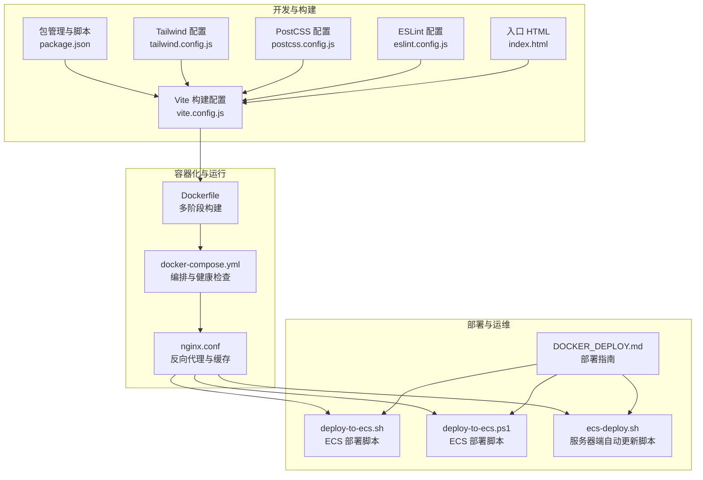
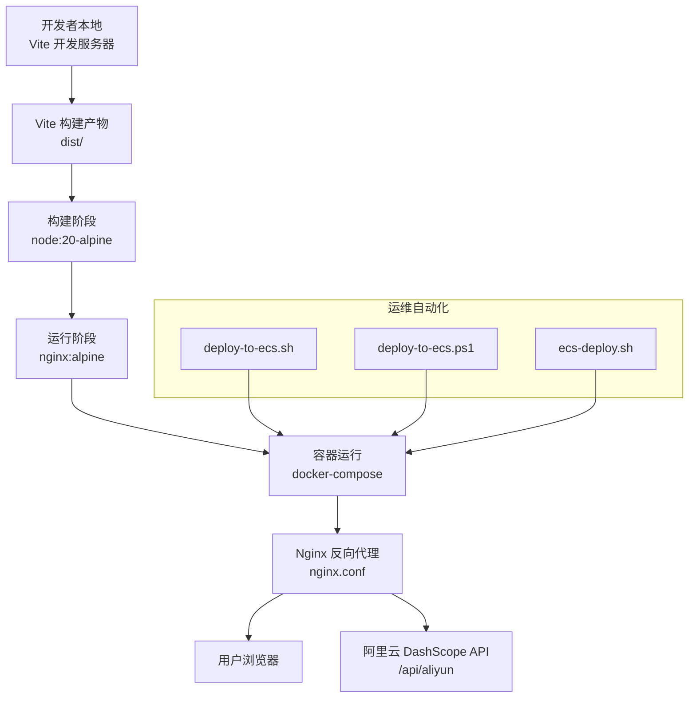
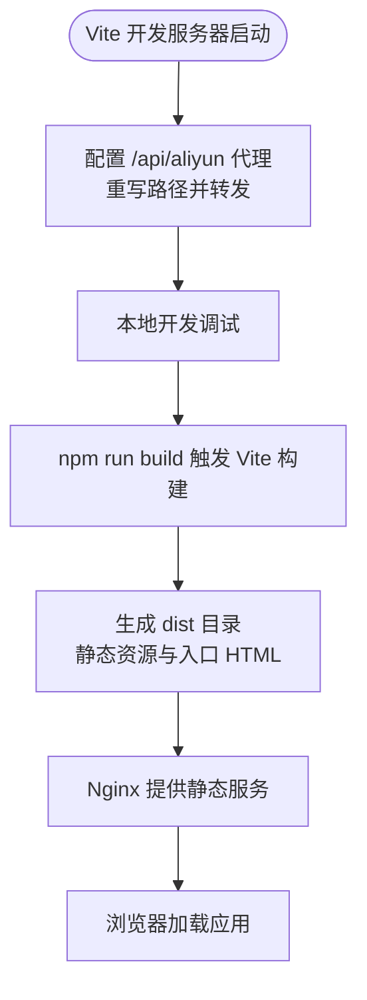
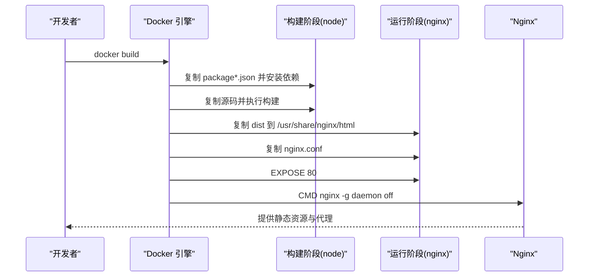
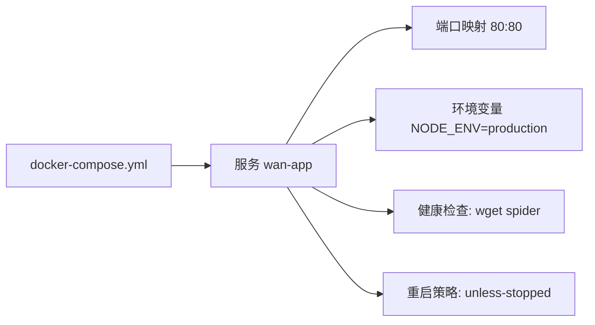
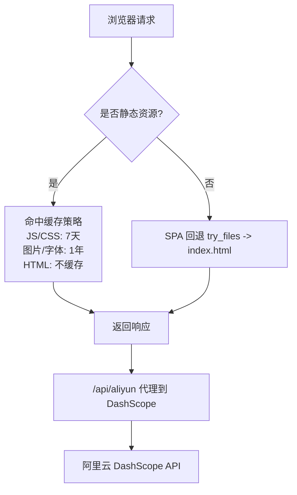
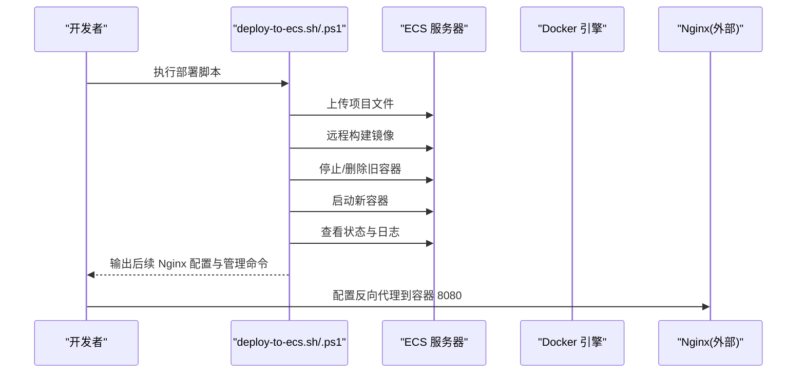
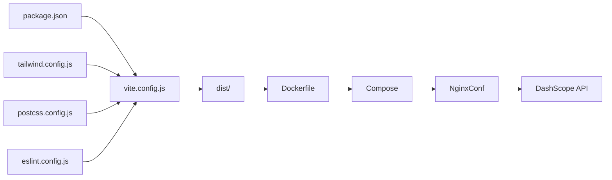

# 构建与部署

<cite>
**本文引用的文件**
- [vite.config.js](file://vite.config.js)
- [Dockerfile](file://Dockerfile)
- [docker-compose.yml](file://docker-compose.yml)
- [nginx.conf](file://nginx.conf)
- [package.json](file://package.json)
- [deploy-to-ecs.sh](file://deploy-to-ecs.sh)
- [deploy-to-ecs.ps1](file://deploy-to-ecs.ps1)
- [ecs-deploy.sh](file://ecs-deploy.sh)
- [DOCKER_DEPLOY.md](file://DOCKER_DEPLOY.md)
- [tailwind.config.js](file://tailwind.config.js)
- [postcss.config.js](file://postcss.config.js)
- [eslint.config.js](file://eslint.config.js)
- [index.html](file://index.html)
- [README.md](file://README.md)
</cite>

## 目录
1. [简介](#简介)
2. [项目结构](#项目结构)
3. [核心组件](#核心组件)
4. [架构总览](#架构总览)
5. [详细组件分析](#详细组件分析)
6. [依赖关系分析](#依赖关系分析)
7. [性能考虑](#性能考虑)
8. [故障排查指南](#故障排查指南)
9. [结论](#结论)
10. [附录](#附录)

## 简介
本文件面向运维与开发团队，系统性阐述通义万相前端应用的构建与部署方案，覆盖 Vite 构建配置优化、Docker 多阶段容器化、部署脚本与 ECS 自动化流程、Nginx 反向代理与缓存策略，以及 CI/CD 集成、环境变量管理与生产优化建议，并提供故障排查与性能监控指导。

## 项目结构
该前端工程采用 React + Vite 技术栈，结合 TailwindCSS 与 PostCSS 进行样式处理；通过 Nginx 提供静态资源服务与 API 代理；使用 Docker 多阶段构建打包为轻量镜像；提供 Docker Compose 一键编排与 ECS 自动化部署脚本。

图表来源
- [vite.config.js](file://vite.config.js#L1-L23)
- [package.json](file://package.json#L1-L33)
- [tailwind.config.js](file://tailwind.config.js#L1-L12)
- [postcss.config.js](file://postcss.config.js#L1-L7)
- [eslint.config.js](file://eslint.config.js#L1-L30)
- [index.html](file://index.html#L1-L14)
- [Dockerfile](file://Dockerfile#L1-L36)
- [docker-compose.yml](file://docker-compose.yml#L1-L23)
- [nginx.conf](file://nginx.conf#L1-L80)
- [deploy-to-ecs.sh](file://deploy-to-ecs.sh#L1-L103)
- [deploy-to-ecs.ps1](file://deploy-to-ecs.ps1#L1-L70)
- [ecs-deploy.sh](file://ecs-deploy.sh#L1-L75)
- [DOCKER_DEPLOY.md](file://DOCKER_DEPLOY.md#L1-L303)

章节来源
- [README.md](file://README.md#L1-L17)
- [package.json](file://package.json#L1-L33)

## 核心组件
- Vite 构建配置：开发服务器、端口与代理规则，便于联调阿里云 DashScope API。
- Dockerfile 多阶段构建：以 node:20-alpine 构建，nginx:alpine 提供静态服务，镜像体积小、启动快。
- docker-compose 编排：端口映射、健康检查、环境变量注入与标签标注。
- Nginx 反向代理：API 代理、CORS 放行、SPA 回退、静态资源缓存策略与错误页。
- 部署脚本：ECS 本地推送与远程构建、服务器端自动更新脚本，支持日志查看与状态检查。
- 开发工具链：Tailwind、PostCSS、ESLint 配置，保障样式与代码质量。

章节来源
- [vite.config.js](file://vite.config.js#L1-L23)
- [Dockerfile](file://Dockerfile#L1-L36)
- [docker-compose.yml](file://docker-compose.yml#L1-L23)
- [nginx.conf](file://nginx.conf#L1-L80)
- [package.json](file://package.json#L1-L33)
- [tailwind.config.js](file://tailwind.config.js#L1-L12)
- [postcss.config.js](file://postcss.config.js#L1-L7)
- [eslint.config.js](file://eslint.config.js#L1-L30)
- [index.html](file://index.html#L1-L14)
- [deploy-to-ecs.sh](file://deploy-to-ecs.sh#L1-L103)
- [deploy-to-ecs.ps1](file://deploy-to-ecs.ps1#L1-L70)
- [ecs-deploy.sh](file://ecs-deploy.sh#L1-L75)
- [DOCKER_DEPLOY.md](file://DOCKER_DEPLOY.md#L1-L303)

## 架构总览
下图展示从构建到上线的关键路径：本地开发通过 Vite 启动，生产环境经 Docker 多阶段构建产出镜像，Nginx 提供静态资源与 API 代理，ECS 上通过部署脚本完成镜像构建、容器启停与状态检查。

图表来源
- [vite.config.js](file://vite.config.js#L1-L23)
- [Dockerfile](file://Dockerfile#L1-L36)
- [docker-compose.yml](file://docker-compose.yml#L1-L23)
- [nginx.conf](file://nginx.conf#L1-L80)
- [deploy-to-ecs.sh](file://deploy-to-ecs.sh#L1-L103)
- [deploy-to-ecs.ps1](file://deploy-to-ecs.ps1#L1-L70)
- [ecs-deploy.sh](file://ecs-deploy.sh#L1-L75)

## 详细组件分析

### Vite 构建配置与优化
- 开发服务器与代理
  - 监听端口与严格端口策略，便于本地联调。
  - 通过代理将 /api/aliyun 请求重写并转发至阿里云 DashScope API，简化跨域与密钥管理。
- 代码组织与入口
  - 入口 HTML 引入根节点与模块脚本，配合 React 应用启动。
- 构建脚本
  - 通过 package.json 的 build 脚本触发 Vite 生产构建，输出静态资源至 dist 目录，供 Nginx 使用。

图表来源
- [vite.config.js](file://vite.config.js#L1-L23)
- [package.json](file://package.json#L1-L33)
- [index.html](file://index.html#L1-L14)

章节来源
- [vite.config.js](file://vite.config.js#L1-L23)
- [package.json](file://package.json#L1-L33)
- [index.html](file://index.html#L1-L14)

### Docker 多阶段构建与镜像优化
- 多阶段构建
  - 构建阶段：基于 node:20-alpine，安装依赖、复制源码并执行构建，生成 dist。
  - 运行阶段：基于 nginx:alpine，安装 CA 证书，复制 dist 至 /usr/share/nginx/html，加载自定义 nginx.conf。
- 镜像体积与安全
  - 使用 alpine 基础镜像，减少体积与攻击面。
  - 安装 CA 证书以避免 SSL 握手问题。
- 端口与启动
  - 暴露 80 端口，前台启动 nginx，适合容器编排与反向代理。

图表来源
- [Dockerfile](file://Dockerfile#L1-L36)

章节来源
- [Dockerfile](file://Dockerfile#L1-L36)

### docker-compose 编排与健康检查
- 端口映射与重启策略
  - 默认将容器 80 端口映射到主机 80，使用 unless-stopped 策略保证服务可用。
- 健康检查
  - 通过轮询 http://localhost/ 判断服务可用性，具备间隔、超时与重试参数。
- 环境变量与标签
  - 注入 NODE_ENV=production，设置容器描述与版本标签，便于识别与管理。

图表来源
- [docker-compose.yml](file://docker-compose.yml#L1-L23)

章节来源
- [docker-compose.yml](file://docker-compose.yml#L1-L23)

### Nginx 反向代理与缓存策略
- API 代理
  - 将 /api/aliyun/ 请求转发至 https://dashscope.aliyuncs.com/api/v1/，设置 Host、X-Real-IP、X-Forwarded-* 等头，关闭代理 SSL 校验以适配本地开发。
- CORS 放行
  - 对预检请求与常规请求统一放行 GET/POST/OPTIONS，设置允许的头部与最大缓存时间。
- SPA 回退
  - try_files $uri $uri/ /index.html，支持前端路由刷新。
- 缓存策略
  - JS/CSS 短期缓存（7 天），图片/字体长期缓存（1 年），HTML 不缓存，提升首屏与二次打开性能。
- 错误页
  - 404 映射到 index.html，500/502/503/504 返回 50x.html，提升用户体验。

图表来源
- [nginx.conf](file://nginx.conf#L1-L80)

章节来源
- [nginx.conf](file://nginx.conf#L1-L80)

### 部署脚本与自动化流程
- 本地到 ECS 的部署脚本（Bash）
  - 上传项目文件至 /opt/wan-app，远程构建镜像，停止并删除旧容器，启动新容器，打印状态与日志，提示后续 Nginx 反向代理配置。
- 本地到 ECS 的部署脚本（PowerShell）
  - 功能与 Bash 版本一致，提供 Windows 环境下的部署体验，包含 Nginx 配置示例与命令提示。
- 服务器端自动更新脚本
  - 从 /usr/wan/wan-app-deploy.tar.gz 解压，构建镜像，停止并删除旧容器，启动新容器，清理旧镜像，输出状态与日志。

图表来源
- [deploy-to-ecs.sh](file://deploy-to-ecs.sh#L1-L103)
- [deploy-to-ecs.ps1](file://deploy-to-ecs.ps1#L1-L70)
- [ecs-deploy.sh](file://ecs-deploy.sh#L1-L75)

章节来源
- [deploy-to-ecs.sh](file://deploy-to-ecs.sh#L1-L103)
- [deploy-to-ecs.ps1](file://deploy-to-ecs.ps1#L1-L70)
- [ecs-deploy.sh](file://ecs-deploy.sh#L1-L75)

### 开发工具链与代码质量
- TailwindCSS
  - content 覆盖入口与 src 下所有模板文件，按需生成样式。
- PostCSS
  - 集成 Tailwind 与 Autoprefixer，自动补全前缀与精简输出。
- ESLint
  - 基于 Flat 配置，启用 React Hooks 与 React Refresh 规则，忽略 dist 目录，规范变量命名。

章节来源
- [tailwind.config.js](file://tailwind.config.js#L1-L12)
- [postcss.config.js](file://postcss.config.js#L1-L7)
- [eslint.config.js](file://eslint.config.js#L1-L30)

## 依赖关系分析
- 组件耦合
  - Vite 构建产物直接进入 Nginx 静态目录，耦合度低，便于替换运行时。
  - Nginx 代理与 ECS 反向代理解耦，可通过外部 Nginx 实现统一入口。
- 外部依赖
  - 阿里云 DashScope API 通过 Nginx 代理访问，密钥在前端存储于浏览器，避免泄露到镜像。
- 配置契约
  - Vite 代理路径与 Nginx 代理路径保持一致，确保开发与生产的连贯性。

图表来源
- [vite.config.js](file://vite.config.js#L1-L23)
- [package.json](file://package.json#L1-L33)
- [tailwind.config.js](file://tailwind.config.js#L1-L12)
- [postcss.config.js](file://postcss.config.js#L1-L7)
- [eslint.config.js](file://eslint.config.js#L1-L30)
- [Dockerfile](file://Dockerfile#L1-L36)
- [docker-compose.yml](file://docker-compose.yml#L1-L23)
- [nginx.conf](file://nginx.conf#L1-L80)

章节来源
- [vite.config.js](file://vite.config.js#L1-L23)
- [package.json](file://package.json#L1-L33)
- [tailwind.config.js](file://tailwind.config.js#L1-L12)
- [postcss.config.js](file://postcss.config.js#L1-L7)
- [eslint.config.js](file://eslint.config.js#L1-L30)
- [Dockerfile](file://Dockerfile#L1-L36)
- [docker-compose.yml](file://docker-compose.yml#L1-L23)
- [nginx.conf](file://nginx.conf#L1-L80)

## 性能考虑
- 构建优化
  - 使用 Vite 的快速冷启动与热更新，生产构建输出带内容哈希的文件名，利于长期缓存。
- 镜像优化
  - 多阶段构建仅保留运行时所需文件，基础镜像为 alpine，显著降低镜像体积与启动时间。
- 静态资源缓存
  - JS/CSS 短期缓存、图片/字体长期缓存、HTML 不缓存，平衡更新频率与加载性能。
- 代理与网络
  - 关闭代理 SSL 校验用于本地开发，生产环境建议开启并使用 HTTPS。
- 资源限制与健康检查
  - docker-compose 中可配置 CPU/内存限制与健康检查，提升稳定性与可观测性。

章节来源
- [DOCKER_DEPLOY.md](file://DOCKER_DEPLOY.md#L171-L238)
- [nginx.conf](file://nginx.conf#L60-L71)
- [docker-compose.yml](file://docker-compose.yml#L14-L19)

## 故障排查指南
- 构建失败
  - 现象：npm install 失败。
  - 处理：使用无缓存重建镜像。
- 容器启动失败
  - 现象：端口被占用。
  - 处理：检查宿主端口占用并修改映射或释放端口。
- API 代理异常
  - 现象：/api/aliyun 无法访问。
  - 处理：检查 Nginx 配置、查看错误日志、测试代理连通性。
- 静态资源加载失败
  - 现象：页面白屏或资源 404。
  - 处理：确认 dist 目录存在、查看访问日志、重新构建。
- 健康检查与日志
  - 使用健康检查判断服务状态，查看容器日志定位问题。

章节来源
- [DOCKER_DEPLOY.md](file://DOCKER_DEPLOY.md#L122-L169)
- [docker-compose.yml](file://docker-compose.yml#L14-L19)

## 结论
本方案以 Vite 快速构建、Docker 多阶段容器化与 Nginx 反向代理为核心，辅以 ECS 自动化部署脚本与健康检查，形成从开发到生产的完整流水线。通过合理的缓存策略与资源限制，兼顾性能与稳定性；通过统一的部署指南与故障排查清单，降低运维成本与风险。

## 附录

### CI/CD 集成建议
- 触发条件
  - 主分支合并或发布标签推送触发构建。
- 步骤建议
  - 代码检出 → 依赖安装 → Lint 与测试 → Vite 构建 → Docker 多阶段构建 → 推送镜像 → 编排部署 → 健康检查。
- 环境变量管理
  - 通过 docker-compose 或 CI 密钥管理服务注入 API Key 与服务地址，避免硬编码。
- 安全加固
  - 使用只读挂载、最小权限账户、HTTPS 与证书校验、CORS 白名单。

章节来源
- [DOCKER_DEPLOY.md](file://DOCKER_DEPLOY.md#L239-L262)
- [docker-compose.yml](file://docker-compose.yml#L12-L13)

### 生产环境优化清单
- 固定镜像版本标签，便于回滚与审计。
- 启用 HTTPS，强制跳转与 HSTS。
- 配置资源限制与健康检查，结合日志驱动与轮转。
- 使用 CDN 加速静态资源，结合缓存头策略。
- 代理层增加限流与 WAF，保护上游 API。

章节来源
- [DOCKER_DEPLOY.md](file://DOCKER_DEPLOY.md#L171-L238)
- [nginx.conf](file://nginx.conf#L182-L200)