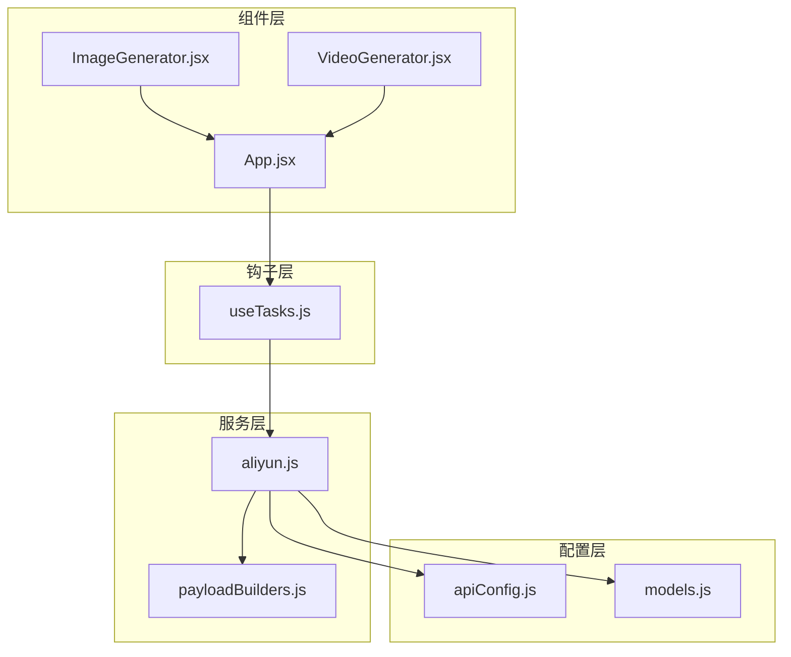
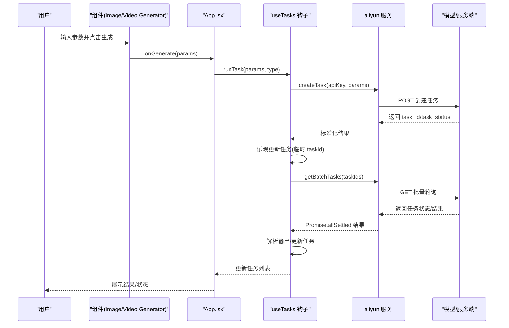
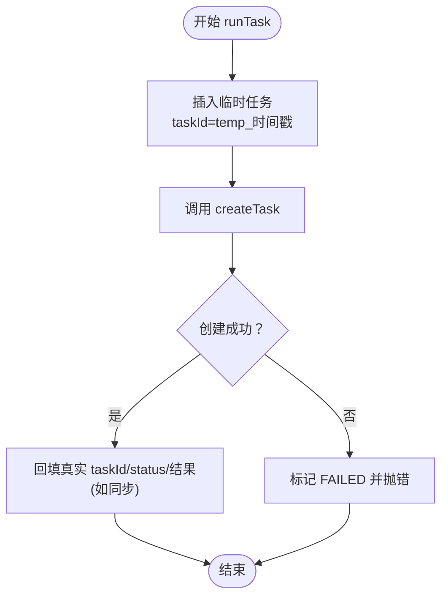
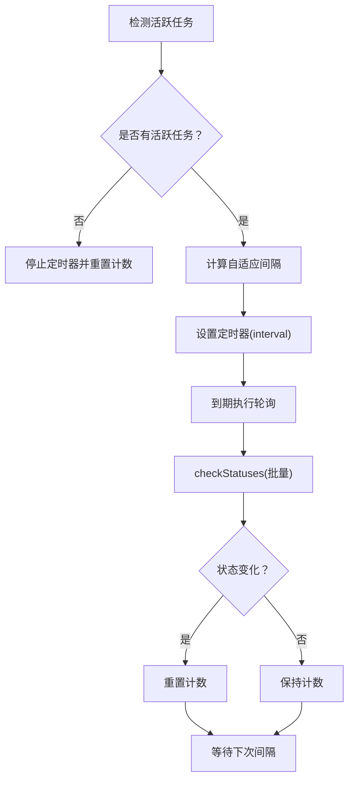
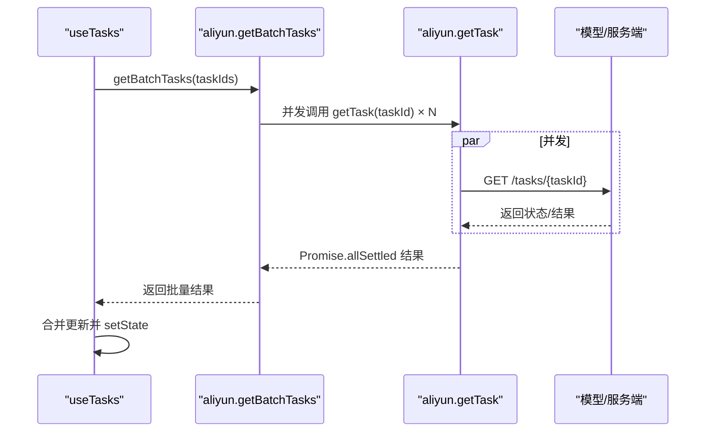
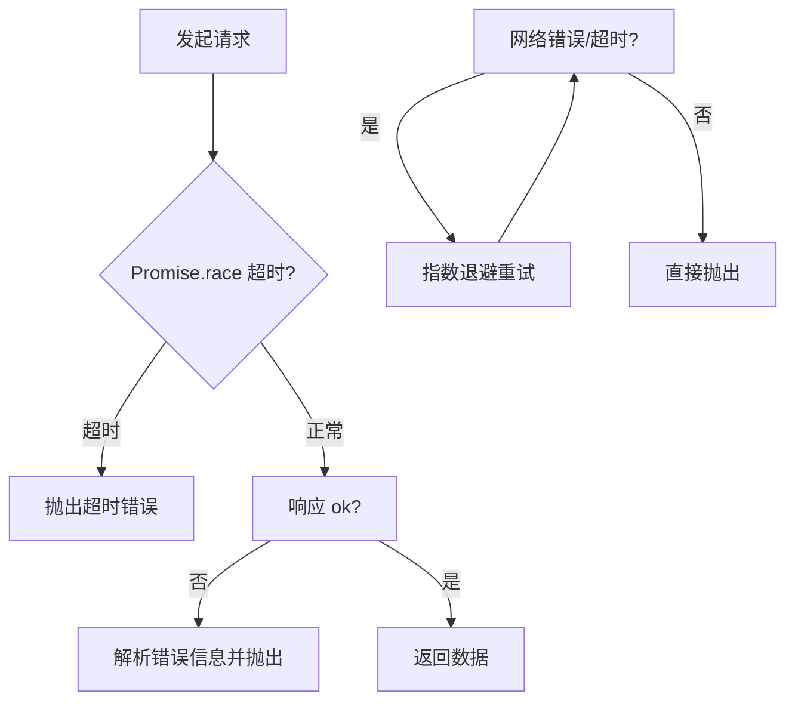
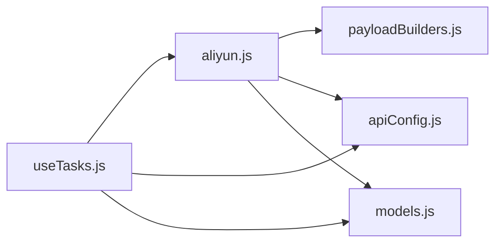

# 异步处理流程

<cite>
**本文引用的文件列表**
- [useTasks.js](file://src/hooks/useTasks.js)
- [aliyun.js](file://src/services/aliyun.js)
- [apiConfig.js](file://src/config/apiConfig.js)
- [models.js](file://src/config/models.js)
- [payloadBuilders.js](file://src/services/payloadBuilders.js)
- [App.jsx](file://src/App.jsx)
- [ImageGenerator.jsx](file://src/components/ImageGenerator.jsx)
- [VideoGenerator.jsx](file://src/components/VideoGenerator.jsx)
</cite>

## 目录
1. [简介](#简介)
2. [项目结构](#项目结构)
3. [核心组件](#核心组件)
4. [架构总览](#架构总览)
5. [详细组件分析](#详细组件分析)
6. [依赖关系分析](#依赖关系分析)
7. [性能考量](#性能考量)
8. [故障排查指南](#故障排查指南)
9. [结论](#结论)

## 简介
本文件面向通义万相前端应用，系统性梳理异步任务处理流程，覆盖从用户发起任务到获取最终结果的完整生命周期，重点解析：
- 任务创建、状态轮询与结果获取的端到端流程
- 自适应轮询策略的实现原理与性能优化
- 批量任务处理机制与并发控制
- 错误处理与重试机制
- 调试方法与性能监控技巧

## 项目结构
前端采用 React + Vite 架构，围绕“任务钩子 + 服务层 + 配置层”的分层组织：
- 钩子层：集中管理任务状态、轮询与本地持久化
- 服务层：封装 API 调用、超时控制、重试策略与批量轮询
- 配置层：模型能力、请求格式、轮询与超时参数
- 组件层：各生成器负责收集参数并触发任务

图表来源
- [App.jsx](file://src/App.jsx#L42-L70)
- [useTasks.js](file://src/hooks/useTasks.js#L9-L332)
- [aliyun.js](file://src/services/aliyun.js#L1-L215)
- [payloadBuilders.js](file://src/services/payloadBuilders.js#L1-L829)
- [apiConfig.js](file://src/config/apiConfig.js#L1-L35)
- [models.js](file://src/config/models.js#L1-L1012)

章节来源
- [App.jsx](file://src/App.jsx#L42-L70)
- [useTasks.js](file://src/hooks/useTasks.js#L9-L332)
- [aliyun.js](file://src/services/aliyun.js#L1-L215)
- [payloadBuilders.js](file://src/services/payloadBuilders.js#L1-L829)
- [apiConfig.js](file://src/config/apiConfig.js#L1-L35)
- [models.js](file://src/config/models.js#L1-L1012)

## 核心组件
- 任务钩子 useTasks：负责任务状态管理、乐观提交、自适应轮询、批量轮询、本地存储与重试
- 服务层 aliyun：封装 createTask、getTask、getBatchTasks，内置超时与重试逻辑
- 配置层：apiConfig 定义超时与轮询参数；models 定义模型能力与请求格式；payloadBuilders 将参数标准化为不同模型的请求体
- 组件层：ImageGenerator/VideoGenerator 等负责参数收集与触发 runTask

章节来源
- [useTasks.js](file://src/hooks/useTasks.js#L9-L332)
- [aliyun.js](file://src/services/aliyun.js#L1-L215)
- [apiConfig.js](file://src/config/apiConfig.js#L1-L35)
- [models.js](file://src/config/models.js#L1-L1012)
- [payloadBuilders.js](file://src/services/payloadBuilders.js#L1-L829)
- [ImageGenerator.jsx](file://src/components/ImageGenerator.jsx#L1-L249)
- [VideoGenerator.jsx](file://src/components/VideoGenerator.jsx#L1-L354)

## 架构总览
异步流程由“组件 -> 钩子 -> 服务层 -> 阿里云”构成，关键特性：
- 乐观提交：先插入临时任务，再回填真实 taskId 与结果
- 自适应轮询：根据任务年龄与状态变化动态调整轮询间隔
- 批量轮询：并发查询多个任务状态，减少网络往返
- 超时与重试：请求与轮询均设置超时，网络错误自动重试
- 结果归一化：兼容多模型输出结构，统一提取结果 URL 并更新任务状态

图表来源
- [App.jsx](file://src/App.jsx#L55-L61)
- [useTasks.js](file://src/hooks/useTasks.js#L256-L312)
- [aliyun.js](file://src/services/aliyun.js#L50-L160)
- [aliyun.js](file://src/services/aliyun.js#L211-L214)

## 详细组件分析

### 任务创建与乐观提交
- 乐观提交：runTask 中先以临时 taskId 插入任务，随后等待 createTask 成功后回填真实 taskId 与初始状态
- 同步/异步处理：若模型为同步（如某些图像编辑），直接在创建阶段拿到结果 URL 并填充到任务
- 参数构建：通过 payloadBuilders 将参数映射为具体模型请求体，确保字段与能力一致

图表来源
- [useTasks.js](file://src/hooks/useTasks.js#L256-L312)
- [aliyun.js](file://src/services/aliyun.js#L50-L160)
- [payloadBuilders.js](file://src/services/payloadBuilders.js#L1-L829)
- [models.js](file://src/config/models.js#L1-L1012)

章节来源
- [useTasks.js](file://src/hooks/useTasks.js#L256-L312)
- [aliyun.js](file://src/services/aliyun.js#L50-L160)
- [payloadBuilders.js](file://src/services/payloadBuilders.js#L1-L829)
- [models.js](file://src/config/models.js#L1-L1012)

### 自适应轮询策略
- 触发条件：存在未完成且非临时的任务时启动轮询定时器
- 间隔策略：
  - 存在新任务（创建时间小于阈值）：使用初始短间隔
  - 前若干次轮询：使用常规间隔
  - 长期运行任务：使用最大间隔
- 计数与重置：每次轮询后递增计数；检测到状态变化时重置计数，以更快捕捉状态推进
- 优化点：仅对活跃任务轮询，避免无效请求；使用最新任务快照执行轮询，防止闭包陷阱

图表来源
- [useTasks.js](file://src/hooks/useTasks.js#L86-L161)
- [useTasks.js](file://src/hooks/useTasks.js#L164-L246)
- [apiConfig.js](file://src/config/apiConfig.js#L21-L27)

章节来源
- [useTasks.js](file://src/hooks/useTasks.js#L86-L161)
- [useTasks.js](file://src/hooks/useTasks.js#L164-L246)
- [apiConfig.js](file://src/config/apiConfig.js#L21-L27)

### 批量任务处理与并发控制
- 批量轮询：getBatchTasks 对一组任务 ID 并发发起轮询，使用 Promise.allSettled 收集结果
- 结果解析：遍历批量结果，分别处理 fulfilled 与 rejected，仅在有实际更新时触发状态变更
- 并发控制：默认并发即为活跃任务数量；可通过调整轮询间隔与批量大小平衡吞吐与资源占用
- 状态更新：仅在媒体 URL 或状态发生实质性变化时才更新，避免无意义的重渲染

图表来源
- [useTasks.js](file://src/hooks/useTasks.js#L164-L246)
- [aliyun.js](file://src/services/aliyun.js#L211-L214)
- [aliyun.js](file://src/services/aliyun.js#L170-L202)

章节来源
- [useTasks.js](file://src/hooks/useTasks.js#L164-L246)
- [aliyun.js](file://src/services/aliyun.js#L211-L214)
- [aliyun.js](file://src/services/aliyun.js#L170-L202)

### 错误处理与重试机制
- 请求重试：retryRequest 对网络错误与超时进行有限次数指数退避重试，忽略特定校验错误
- 超时控制：请求与轮询分别设置超时，超时错误直接抛出
- 轮询容错：批量轮询中单个任务失败不影响其他任务，rejected 的结果单独记录
- 失败兜底：runTask 创建失败时标记 FAILED；轮询失败时保留当前状态，等待后续重试

图表来源
- [aliyun.js](file://src/services/aliyun.js#L20-L36)
- [aliyun.js](file://src/services/aliyun.js#L83-L160)
- [aliyun.js](file://src/services/aliyun.js#L170-L202)
- [apiConfig.js](file://src/config/apiConfig.js#L8-L19)

章节来源
- [aliyun.js](file://src/services/aliyun.js#L20-L36)
- [aliyun.js](file://src/services/aliyun.js#L83-L160)
- [aliyun.js](file://src/services/aliyun.js#L170-L202)
- [apiConfig.js](file://src/config/apiConfig.js#L8-L19)

### 结果解析与状态更新
- 多格式兼容：支持标准 results[0].url 与多模态 choices[0].message.content 的图片提取
- 状态判定：仅当状态为 SUCCEEDED 且存在媒体 URL（现有或新增）时才更新状态，避免空结果
- 本地存储：任务持久化前清理 base64 数据，必要时截断以避免超出配额

章节来源
- [useTasks.js](file://src/hooks/useTasks.js#L164-L246)
- [useTasks.js](file://src/hooks/useTasks.js#L30-L84)

## 依赖关系分析
- useTasks 依赖：
  - 服务层：createTask/getTask/getBatchTasks
  - 配置层：POLLING/TIMEOUT/STORAGE 常量
  - 模型配置：getModelById 用于同步/异步判断与输出类型
- 服务层依赖：
  - payloadBuilders：按模型协议构造请求体
  - models：模型能力与端点信息
  - apiConfig：超时与重试参数

图表来源
- [useTasks.js](file://src/hooks/useTasks.js#L1-L4)
- [aliyun.js](file://src/services/aliyun.js#L1-L3)
- [payloadBuilders.js](file://src/services/payloadBuilders.js#L1-L3)
- [models.js](file://src/config/models.js#L1-L3)
- [apiConfig.js](file://src/config/apiConfig.js#L1-L3)

章节来源
- [useTasks.js](file://src/hooks/useTasks.js#L1-L4)
- [aliyun.js](file://src/services/aliyun.js#L1-L3)
- [payloadBuilders.js](file://src/services/payloadBuilders.js#L1-L3)
- [models.js](file://src/config/models.js#L1-L3)
- [apiConfig.js](file://src/config/apiConfig.js#L1-L3)

## 性能考量
- 轮询节流：通过自适应间隔与状态变化重置，降低无效轮询频率
- 批量并发：getBatchTasks 并发查询，显著减少 RTT；可根据任务规模调整轮询间隔
- 资源限制：本地存储清理 base64，必要时截断历史任务，避免内存与存储压力
- 超时与重试：合理设置请求与轮询超时，避免长时间挂起；网络错误自动退避重试

章节来源
- [useTasks.js](file://src/hooks/useTasks.js#L86-L161)
- [useTasks.js](file://src/hooks/useTasks.js#L30-L84)
- [aliyun.js](file://src/services/aliyun.js#L20-L36)
- [apiConfig.js](file://src/config/apiConfig.js#L8-L19)

## 故障排查指南
- API Key 缺失：App.jsx 在未设置时弹出设置面板；请确认已保存有效密钥
- 创建失败：检查模型 ID 是否存在于 models；确认 payloadBuilders 能正确构造请求体
- 轮询无响应：确认轮询定时器是否被清理（无活跃任务时会清理）；检查网络与超时设置
- 结果为空：SUCCEEDED 状态需伴随媒体 URL；若尚未返回 URL，等待下一次轮询
- 重试机制：runTask 会使用 originalParams 重新创建任务；确保参数完整

章节来源
- [App.jsx](file://src/App.jsx#L55-L69)
- [useTasks.js](file://src/hooks/useTasks.js#L314-L322)
- [aliyun.js](file://src/services/aliyun.js#L50-L160)
- [models.js](file://src/config/models.js#L1-L1012)
- [payloadBuilders.js](file://src/services/payloadBuilders.js#L1-L829)

## 结论
该异步处理体系通过“乐观提交 + 自适应轮询 + 批量并发 + 超时与重试”的组合，实现了稳定高效的异步任务管理。其关键优势在于：
- 用户体验：快速反馈与渐进式结果展示
- 系统鲁棒性：完善的错误处理与重试策略
- 可扩展性：配置驱动的模型与请求格式，便于新增模型与协议