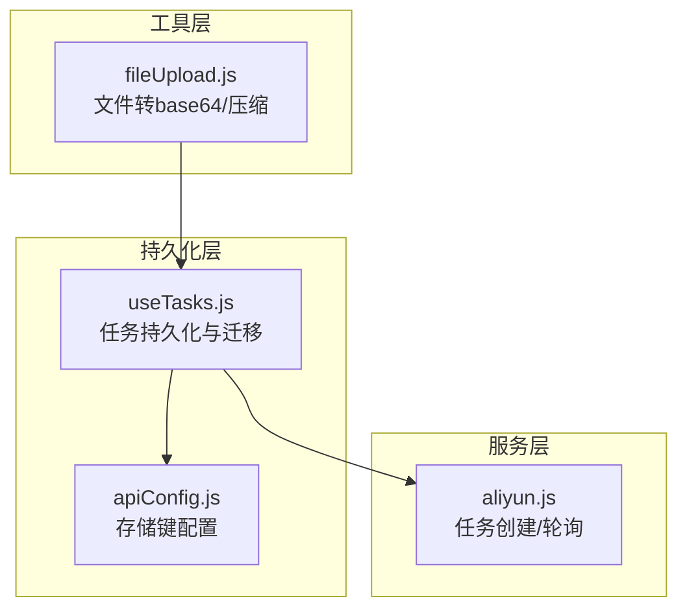
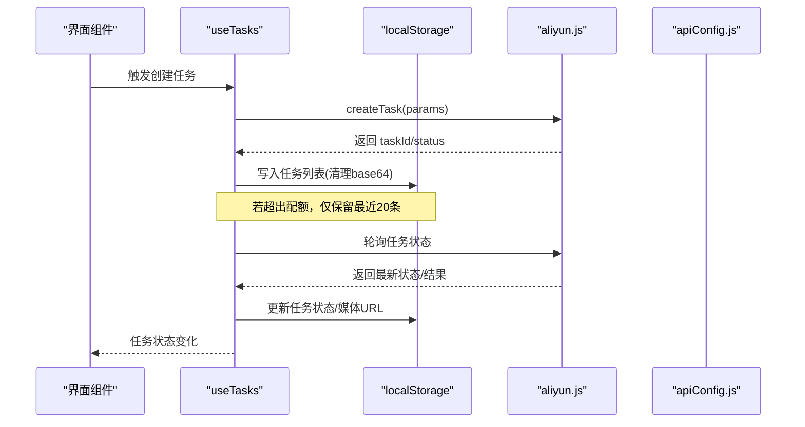
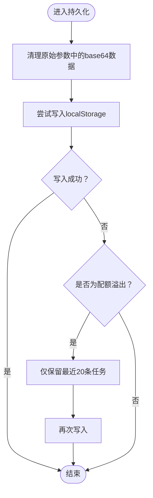
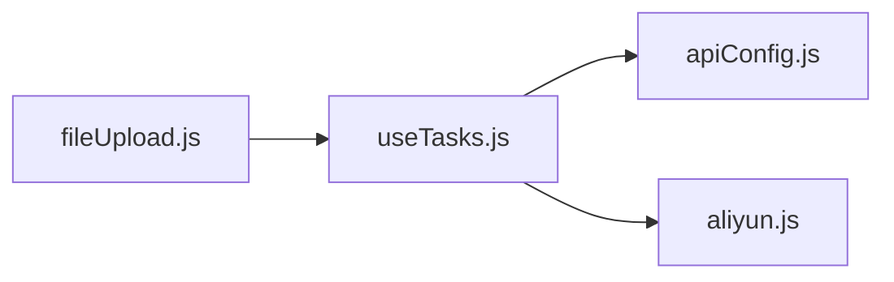

# 数据持久化

<cite>
**本文引用的文件**
- [useTasks.js](file://src/hooks/useTasks.js)
- [apiConfig.js](file://src/config/apiConfig.js)
- [fileUpload.js](file://src/utils/fileUpload.js)
- [aliyun.js](file://src/services/aliyun.js)
</cite>

## 目录
1. [简介](#简介)
2. [项目结构与职责划分](#项目结构与职责划分)
3. [核心组件与职责](#核心组件与职责)
4. [架构总览](#架构总览)
5. [详细组件分析](#详细组件分析)
6. [依赖关系分析](#依赖关系分析)
7. [性能与容量优化](#性能与容量优化)
8. [故障排查与恢复](#故障排查与恢复)
9. [结论](#结论)

## 简介
本文件面向通义万相前端应用的数据持久化方案，聚焦于任务数据的本地存储策略与实现细节。内容涵盖：
- 本地存储策略：localStorage 的使用、数据清理与存储限制处理
- 序列化与反序列化：Base64 数据的过滤与压缩
- 数据迁移机制：从旧版本存储格式的升级处理
- 完整性保障：存储失败的回退策略与数据恢复机制
- 性能优化建议与最佳实践

## 项目结构与职责划分
- 任务状态与持久化：通过自定义 Hook 将任务列表写入 localStorage，并在初始化时进行历史数据迁移
- 存储配置：集中定义存储键名与兼容的历史键名
- 文件上传与压缩：对大尺寸图片进行压缩，降低 base64 字符串体积
- API 交互：封装创建任务、轮询状态等网络请求，配合持久化实现完整工作流

图表来源
- [useTasks.js](file://src/hooks/useTasks.js#L1-L333)
- [apiConfig.js](file://src/config/apiConfig.js#L1-L35)
- [fileUpload.js](file://src/utils/fileUpload.js#L1-L182)
- [aliyun.js](file://src/services/aliyun.js#L1-L215)

章节来源
- [useTasks.js](file://src/hooks/useTasks.js#L1-L333)
- [apiConfig.js](file://src/config/apiConfig.js#L1-L35)

## 核心组件与职责
- useTasks：负责任务状态的本地持久化、Base64 数据清理、存储配额溢出回退、历史数据迁移、任务轮询与状态更新
- apiConfig：集中管理存储键名（含历史键名），便于跨模块复用
- fileUpload：提供文件转 base64 与图片压缩能力，降低存储体积
- aliyun：封装任务创建与轮询接口，为持久化提供数据来源与状态变更

章节来源
- [useTasks.js](file://src/hooks/useTasks.js#L1-L333)
- [apiConfig.js](file://src/config/apiConfig.js#L29-L34)
- [fileUpload.js](file://src/utils/fileUpload.js#L1-L182)
- [aliyun.js](file://src/services/aliyun.js#L50-L215)

## 架构总览
下图展示了任务从创建到持久化的端到端流程，以及持久化层如何与配置、工具和服务层协作。

图表来源
- [useTasks.js](file://src/hooks/useTasks.js#L256-L312)
- [aliyun.js](file://src/services/aliyun.js#L50-L160)
- [apiConfig.js](file://src/config/apiConfig.js#L29-L34)

## 详细组件分析

### 本地存储策略与数据清理
- 初始化加载：优先从新版存储键读取；若不存在，则尝试从历史键迁移
- 写入策略：每次任务变更都会触发持久化，写入前对原始参数中的 base64 数据进行清理，避免占用过多空间
- 存储配额溢出处理：捕获配额溢出错误，自动保留最近20条任务，确保可用性

图表来源
- [useTasks.js](file://src/hooks/useTasks.js#L31-L84)

章节来源
- [useTasks.js](file://src/hooks/useTasks.js#L10-L25)
- [useTasks.js](file://src/hooks/useTasks.js#L31-L84)

### 序列化与反序列化（含 Base64 过滤）
- 反序列化：应用启动时从 localStorage 读取并解析为任务数组
- 序列化：写入前对原始参数进行深拷贝与清洗，移除所有以 data: 开头的 base64 字段，替换为占位符，减少存储体积
- 多场景覆盖：支持消息内容中的图片字段、直接的图片 URL 字段等

章节来源
- [useTasks.js](file://src/hooks/useTasks.js#L33-L72)

### 数据迁移机制（旧版本存储格式升级）
- 兼容历史键：若新版存储键不存在，尝试从历史键读取
- 类型智能推断：对历史数据进行类型判断，为无明确类型的记录补充类型字段
- 单次迁移：迁移逻辑仅在初始化阶段执行一次，避免重复迁移

章节来源
- [useTasks.js](file://src/hooks/useTasks.js#L14-L23)
- [apiConfig.js](file://src/config/apiConfig.js#L33-L33)

### 存储完整性保障与回退策略
- 回退策略：当写入失败且为配额溢出时，自动截断为最近20条任务并重试写入
- 数据恢复：重启应用时自动从 localStorage 恢复任务列表；如需，可基于历史键进行迁移
- 状态一致性：轮询过程中仅在状态或媒体 URL 真正变化时才更新，避免无效写入

章节来源
- [useTasks.js](file://src/hooks/useTasks.js#L74-L84)
- [useTasks.js](file://src/hooks/useTasks.js#L164-L246)

### 文件上传与压缩（降低 base64 体积）
- 压缩阈值：当文件为图片且超过指定大小时，先压缩再转 base64
- 压缩参数：限定最大宽高与质量，兼顾清晰度与体积
- 转换流程：统一通过 FileReader 读取，返回 dataURL 形式的 base64 字符串

章节来源
- [fileUpload.js](file://src/utils/fileUpload.js#L6-L18)
- [fileUpload.js](file://src/utils/fileUpload.js#L40-L87)
- [fileUpload.js](file://src/utils/fileUpload.js#L23-L29)

## 依赖关系分析
- useTasks 依赖 apiConfig 的存储键配置，确保键名一致
- useTasks 依赖 aliyun 的任务创建与轮询接口，驱动任务状态变更
- fileUpload 与 useTasks 解耦，通过调用链间接参与持久化（先压缩再转 base64，最终由 useTasks 清理并持久化）

图表来源
- [useTasks.js](file://src/hooks/useTasks.js#L1-L333)
- [apiConfig.js](file://src/config/apiConfig.js#L1-L35)
- [fileUpload.js](file://src/utils/fileUpload.js#L1-L182)
- [aliyun.js](file://src/services/aliyun.js#L1-L215)

章节来源
- [useTasks.js](file://src/hooks/useTasks.js#L1-L333)
- [apiConfig.js](file://src/config/apiConfig.js#L1-L35)
- [fileUpload.js](file://src/utils/fileUpload.js#L1-L182)
- [aliyun.js](file://src/services/aliyun.js#L1-L215)

## 性能与容量优化
- base64 过滤：写入前清理所有 base64 数据，显著降低存储体积
- 压缩策略：对大图片进行压缩，减少后续 base64 字符串长度
- 自适应轮询：根据任务年龄与状态变化动态调整轮询间隔，降低网络与 CPU 开销
- 配额溢出回退：在存储不足时自动保留最近任务，避免整体不可用
- 批量轮询：使用批量查询减少网络往返次数

章节来源
- [useTasks.js](file://src/hooks/useTasks.js#L31-L84)
- [useTasks.js](file://src/hooks/useTasks.js#L86-L104)
- [useTasks.js](file://src/hooks/useTasks.js#L107-L161)
- [useTasks.js](file://src/hooks/useTasks.js#L211-L246)
- [fileUpload.js](file://src/utils/fileUpload.js#L6-L18)

## 故障排查与恢复
- 常见问题
  - 存储配额溢出：系统会自动保留最近20条任务并提示
  - 任务状态异常：检查轮询逻辑与状态更新条件，确认媒体 URL 是否已返回
  - 历史数据迁移：确认历史键是否存在，类型推断是否合理
- 排查步骤
  - 查看持久化写入日志与错误信息
  - 检查原始参数中是否仍残留 base64 数据
  - 验证网络请求与轮询超时设置
  - 如需手动恢复，可临时清空存储键以触发迁移逻辑

章节来源
- [useTasks.js](file://src/hooks/useTasks.js#L74-L84)
- [useTasks.js](file://src/hooks/useTasks.js#L164-L246)
- [apiConfig.js](file://src/config/apiConfig.js#L29-L34)

## 结论
该数据持久化方案通过以下关键点实现了稳定与高效：
- 明确的存储键策略与历史迁移逻辑，确保版本演进的平滑过渡
- 在写入前对 base64 数据进行系统性清理，有效控制存储体积
- 面向配额溢出的回退策略，保障应用可用性
- 压缩与自适应轮询等性能优化手段，提升用户体验
- 通过批量轮询与状态变更去抖，减少无效写入与网络开销