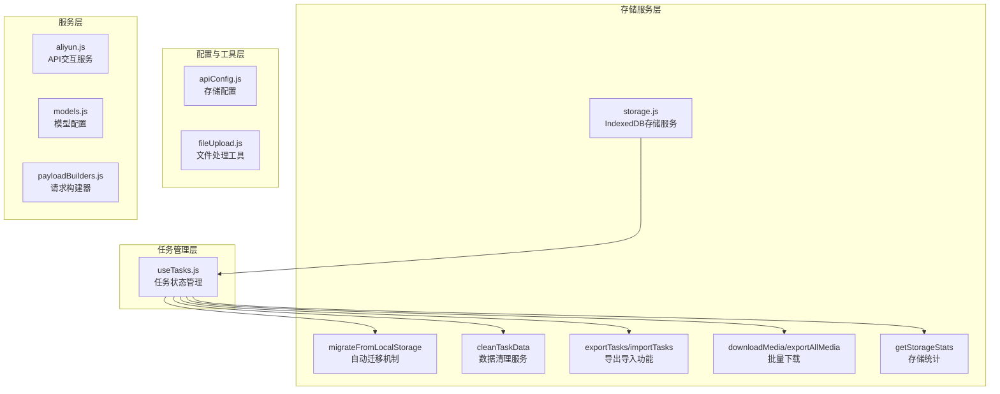
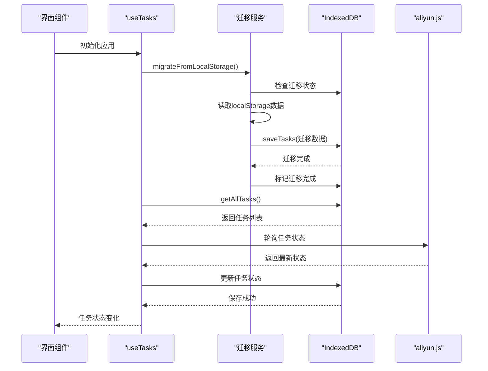
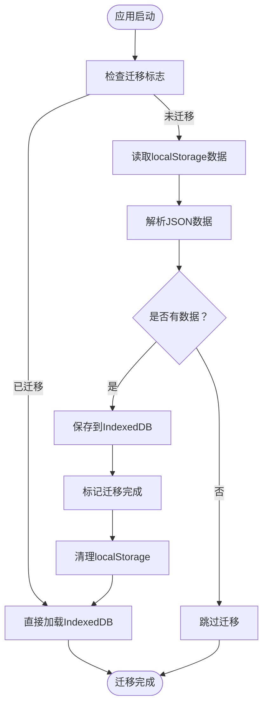
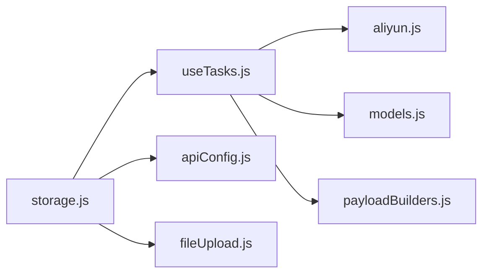

# 数据持久化

<cite>
**本文引用的文件**
- [storage.js](file://src/utils/storage.js)
- [useTasks.js](file://src/hooks/useTasks.js)
- [apiConfig.js](file://src/config/apiConfig.js)
- [fileUpload.js](file://src/utils/fileUpload.js)
- [aliyun.js](file://src/services/aliyun.js)
- [models.js](file://src/config/models.js)
- [payloadBuilders.js](file://src/services/payloadBuilders.js)
</cite>

## 更新摘要
**变更内容**
- 从localStorage完全迁移到IndexedDB作为主要存储引擎
- 新增自动数据迁移机制，支持从旧版本localStorage格式升级
- 增强base64数据清理功能，支持更全面的媒体数据过滤
- 新增任务配置导出/导入功能，支持JSON格式备份
- 新增批量媒体文件下载能力，支持视频和图片的批量导出
- 优化存储统计功能，提供容量监控和格式化显示
- 改进任务状态轮询策略，支持自适应轮询间隔

## 目录
1. [简介](#简介)
2. [项目结构与职责划分](#项目结构与职责划分)
3. [核心组件与职责](#核心组件与职责)
4. [架构总览](#架构总览)
5. [详细组件分析](#详细组件分析)
6. [依赖关系分析](#依赖关系分析)
7. [性能与容量优化](#性能与容量优化)
8. [故障排查与恢复](#故障排查与恢复)
9. [结论](#结论)

## 简介
本文件面向通义万相前端应用的数据持久化方案，聚焦于任务数据的本地存储策略与实现细节。经过重大升级，系统已从传统的localStorage迁移到现代的IndexedDB存储引擎，提供更强大的数据管理和迁移能力。

内容涵盖：
- **存储引擎升级**：从localStorage迁移到IndexedDB，支持更大容量和更复杂的查询
- **自动迁移机制**：无缝从旧版本存储格式升级，确保数据安全过渡
- **增强的数据清理**：全面的base64数据过滤和媒体文件管理
- **导出导入功能**：支持任务配置的JSON格式备份和恢复
- **批量媒体下载**：支持视频和图片的批量导出功能
- **存储统计监控**：实时监控存储使用情况和容量估算
- **性能优化策略**：自适应轮询和防抖保存机制

## 项目结构与职责划分
- **存储服务层**：通过IndexedDB提供大容量本地存储，替代传统localStorage
- **任务状态管理**：通过自定义Hook管理任务生命周期，集成存储迁移和轮询
- **数据清理服务**：专门处理base64数据过滤和媒体文件清理
- **导出导入功能**：提供任务配置的备份和恢复能力
- **批量下载服务**：支持媒体文件的批量导出和下载
- **存储统计监控**：实时监控存储使用情况和容量

**图表来源**
- [storage.js](file://src/utils/storage.js#L1-L440)
- [useTasks.js](file://src/hooks/useTasks.js#L1-L365)
- [apiConfig.js](file://src/config/apiConfig.js#L1-L35)
- [fileUpload.js](file://src/utils/fileUpload.js#L1-L304)
- [aliyun.js](file://src/services/aliyun.js#L1-L241)
- [models.js](file://src/config/models.js#L1-L1162)
- [payloadBuilders.js](file://src/services/payloadBuilders.js#L1-L953)

**章节来源**
- [storage.js](file://src/utils/storage.js#L1-L440)
- [useTasks.js](file://src/hooks/useTasks.js#L1-L365)
- [apiConfig.js](file://src/config/apiConfig.js#L1-L35)

## 核心组件与职责
- **storage.js**：提供完整的IndexedDB存储服务，包括任务CRUD操作、数据清理、迁移、导出导入和批量下载
- **useTasks**：负责任务状态的本地持久化、自动迁移、自适应轮询和状态更新
- **apiConfig**：集中管理存储键名和API配置常量
- **fileUpload**：提供文件转base64与图片压缩能力，为存储清理提供支持
- **aliyun**：封装任务创建与轮询接口，为持久化提供数据来源

**章节来源**
- [storage.js](file://src/utils/storage.js#L1-L440)
- [useTasks.js](file://src/hooks/useTasks.js#L1-L365)
- [apiConfig.js](file://src/config/apiConfig.js#L29-L34)
- [fileUpload.js](file://src/utils/fileUpload.js#L1-L304)
- [aliyun.js](file://src/services/aliyun.js#L50-L241)

## 架构总览
下图展示了从localStorage到IndexedDB的完整迁移流程，以及各组件间的协作关系。

**图表来源**
- [useTasks.js](file://src/hooks/useTasks.js#L22-L54)
- [storage.js](file://src/utils/storage.js#L215-L266)
- [aliyun.js](file://src/services/aliyun.js#L196-L241)

## 详细组件分析

### IndexedDB存储引擎与自动迁移机制

**存储引擎升级**：系统已完全从localStorage迁移到IndexedDB，提供更大的存储容量和更好的性能。IndexedDB支持事务性操作、索引查询和异步操作，更适合复杂的应用数据管理需求。

**自动迁移机制**：
- **迁移检测**：通过`wan_idb_migrated`标志检查是否已完成迁移
- **多格式兼容**：支持从新格式`wan_app_tasks_v2`和旧格式`wan_tasks`读取数据
- **安全迁移**：迁移完成后自动清理localStorage中的旧数据
- **错误处理**：完善的异常处理机制，确保迁移过程的可靠性

**图表来源**
- [storage.js](file://src/utils/storage.js#L215-L266)

**章节来源**
- [storage.js](file://src/utils/storage.js#L6-L46)
- [storage.js](file://src/utils/storage.js#L215-L266)
- [useTasks.js](file://src/hooks/useTasks.js#L22-L54)

### 增强的数据清理与base64过滤

**全面的数据清理**：系统实现了智能的base64数据清理机制，有效控制存储空间使用。

**清理策略**：
- **消息内容清理**：处理`messages`数组中的base64数据
- **直接字段清理**：清理多个图像相关字段的base64数据
- **占位符替换**：将base64数据替换为`[base64 removed]`占位符
- **深度复制保护**：使用深拷贝避免修改原始数据

**支持的字段类型**：
- `image_url`、`base_image_url`、`mask_image_url`、`ref_image_url`
- `style_ref_url`、`img_url`、`first_frame_url`、`video_url`、`audio_url`
- 消息内容中的`image`和`image_url`字段

**章节来源**
- [storage.js](file://src/utils/storage.js#L178-L210)

### 导出导入功能与任务备份

**导出功能**：
- **完整配置导出**：导出所有任务配置和元数据
- **JSON格式**：标准化的JSON格式，便于备份和传输
- **版本控制**：包含导出版本信息和时间戳
- **统计信息**：记录导出的任务数量和时间

**导入功能**：
- **格式验证**：验证导入文件的JSON格式和结构
- **数据校验**：检查任务数据的完整性和有效性
- **批量导入**：支持大量任务的快速导入
- **错误处理**：完善的异常处理和用户反馈

**章节来源**
- [storage.js](file://src/utils/storage.js#L271-L292)
- [storage.js](file://src/utils/storage.js#L387-L411)

### 批量媒体下载与存储统计

**批量媒体下载**：
- **媒体发现**：自动扫描所有可导出的媒体文件
- **进度跟踪**：提供详细的下载进度回调
- **并发控制**：合理的并发下载策略，避免浏览器限制
- **错误恢复**：单个文件下载失败不影响整体进度

**存储统计监控**：
- **容量估算**：实时计算存储数据的实际大小
- **格式化显示**：友好的字节大小格式化显示
- **任务计数**：统计当前存储的任务数量
- **容量预警**：为后续的容量管理提供数据支持

**章节来源**
- [storage.js](file://src/utils/storage.js#L297-L324)
- [storage.js](file://src/utils/storage.js#L356-L382)
- [storage.js](file://src/utils/storage.js#L416-L431)

### 任务状态管理与自适应轮询

**状态管理改进**：
- **即时状态查询**：页面加载时立即查询未完成任务的真实状态
- **自适应轮询**：根据任务活跃度和年龄动态调整轮询间隔
- **防抖保存**：使用防抖机制减少不必要的存储写入
- **批量状态更新**：支持多个任务的状态批量查询和更新

**轮询策略**：
- **智能间隔**：新创建的任务使用更短的轮询间隔
- **指数退避**：长时间运行的任务使用更长的轮询间隔
- **状态过滤**：只对未完成的任务进行轮询
- **错误处理**：完善的轮询错误处理和重试机制

**章节来源**
- [useTasks.js](file://src/hooks/useTasks.js#L84-L147)
- [useTasks.js](file://src/hooks/useTasks.js#L150-L204)
- [useTasks.js](file://src/hooks/useTasks.js#L206-L274)

## 依赖关系分析
- **storage.js** 作为核心存储服务，被所有组件依赖
- **useTasks** 依赖 storage.js 的所有功能，包括迁移、清理、导出导入
- **apiConfig** 提供存储键配置，确保数据格式一致性
- **fileUpload** 与 storage.js 协作，为数据清理提供文件处理支持
- **aliyun** 与 useTasks 紧密集成，驱动任务状态的实时更新

**图表来源**
- [storage.js](file://src/utils/storage.js#L1-L440)
- [useTasks.js](file://src/hooks/useTasks.js#L1-L365)
- [apiConfig.js](file://src/config/apiConfig.js#L1-L35)
- [fileUpload.js](file://src/utils/fileUpload.js#L1-L304)
- [aliyun.js](file://src/services/aliyun.js#L1-L241)
- [models.js](file://src/config/models.js#L1-L1162)
- [payloadBuilders.js](file://src/services/payloadBuilders.js#L1-L953)

**章节来源**
- [storage.js](file://src/utils/storage.js#L1-L440)
- [useTasks.js](file://src/hooks/useTasks.js#L1-L365)
- [apiConfig.js](file://src/config/apiConfig.js#L1-L35)
- [fileUpload.js](file://src/utils/fileUpload.js#L1-L304)
- [aliyun.js](file://src/services/aliyun.js#L1-L241)
- [models.js](file://src/config/models.js#L1-L1162)
- [payloadBuilders.js](file://src/services/payloadBuilders.js#L1-L953)

## 性能与容量优化

**存储性能优化**：
- **IndexedDB优势**：相比localStorage，支持更大的存储容量和更好的性能
- **智能清理**：自动过滤base64数据，显著减少存储空间占用
- **批量操作**：支持批量保存和批量下载，提高操作效率
- **防抖机制**：减少频繁的存储写入操作

**网络性能优化**：
- **自适应轮询**：根据任务状态动态调整轮询频率
- **批量查询**：使用批量API减少网络往返次数
- **超时控制**：合理的请求超时和重试机制
- **并发控制**：避免过度的并发请求影响用户体验

**容量管理策略**：
- **容量监控**：实时监控存储使用情况
- **数据清理**：定期清理过期和无效数据
- **迁移优化**：高效的迁移机制，最小化迁移时间
- **错误恢复**：完善的错误处理和数据恢复机制

**章节来源**
- [storage.js](file://src/utils/storage.js#L178-L210)
- [storage.js](file://src/utils/storage.js#L105-L127)
- [useTasks.js](file://src/hooks/useTasks.js#L84-L147)
- [useTasks.js](file://src/hooks/useTasks.js#L206-L274)

## 故障排查与恢复

**常见问题诊断**：
- **迁移失败**：检查`wan_idb_migrated`标志和localStorage数据格式
- **存储访问失败**：验证IndexedDB权限和浏览器兼容性
- **数据清理异常**：检查base64数据格式和清理逻辑
- **批量下载失败**：验证媒体URL的有效性和网络连接

**恢复策略**：
- **手动迁移**：如果自动迁移失败，可手动执行迁移逻辑
- **数据修复**：使用导出导入功能进行数据修复
- **缓存清理**：清理浏览器缓存和存储数据
- **版本回退**：在必要时回退到之前的版本

**监控与日志**：
- **详细日志**：每个操作都有详细的错误日志记录
- **状态监控**：实时监控存储状态和操作结果
- **性能指标**：收集性能相关的统计数据
- **用户反馈**：提供友好的错误提示和解决方案

**章节来源**
- [storage.js](file://src/utils/storage.js#L215-L266)
- [storage.js](file://src/utils/storage.js#L416-L431)
- [useTasks.js](file://src/hooks/useTasks.js#L46-L54)

## 结论
经过重大升级，通义万相的数据持久化方案实现了从localStorage到IndexedDB的完全迁移，带来了以下关键改进：

**技术升级**：
- **存储引擎现代化**：从localStorage迁移到IndexedDB，提供更大的存储容量和更好的性能
- **自动化迁移**：无缝的数据迁移机制，确保用户数据的安全过渡
- **智能清理**：全面的base64数据过滤，有效控制存储空间使用

**功能增强**：
- **备份恢复**：完整的任务配置导出导入功能，支持数据备份和恢复
- **批量操作**：支持媒体文件的批量下载和任务的批量管理
- **实时监控**：存储使用情况的实时监控和容量估算

**性能优化**：
- **自适应策略**：智能的轮询间隔和防抖保存机制
- **批量处理**：优化的批量操作和并发控制
- **错误处理**：完善的异常处理和数据恢复机制

**用户体验提升**：
- **无缝迁移**：用户无需手动干预即可完成数据迁移
- **数据安全**：多重备份和恢复机制确保数据安全
- **性能稳定**：优化的存储和网络策略提供稳定的用户体验

这一升级为通义万相应用奠定了坚实的数据持久化基础，支持未来更多的功能扩展和性能优化需求。