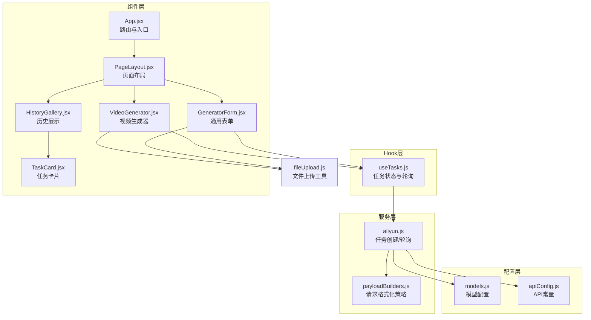
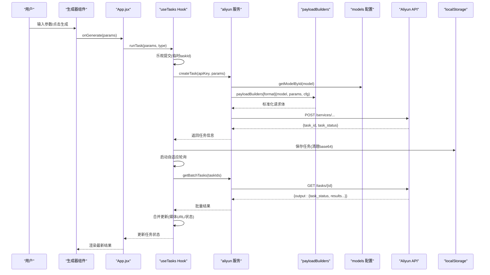
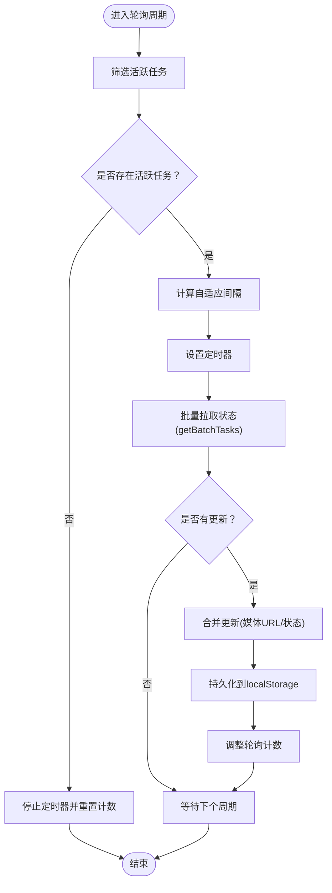
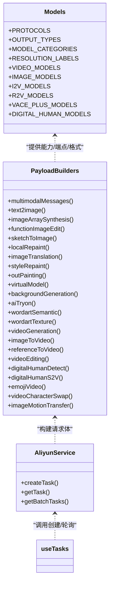
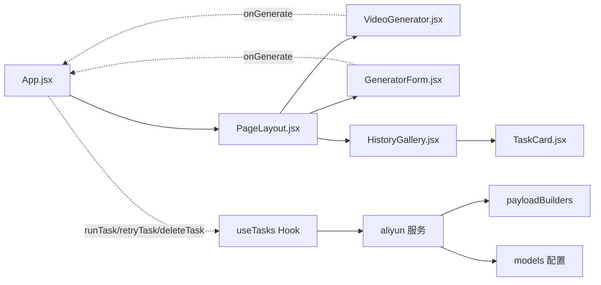
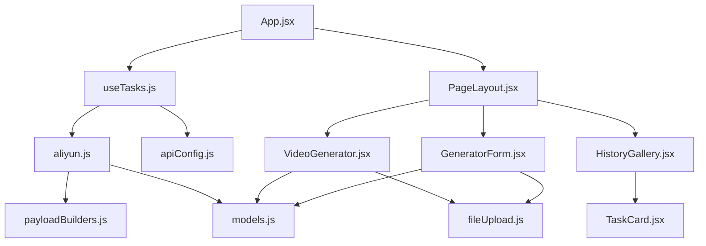
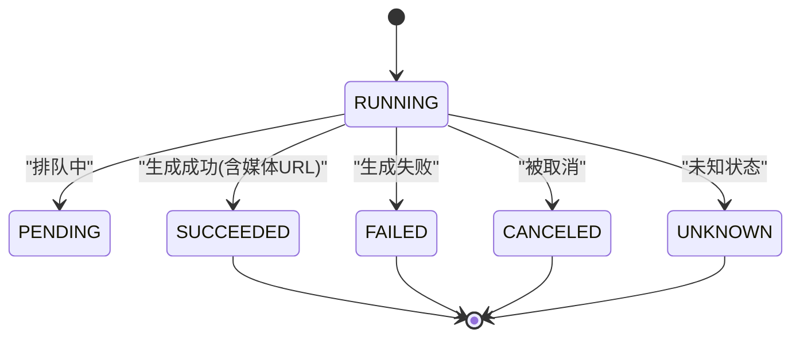

# 数据流设计

<cite>
**本文引用的文件列表**
- [useTasks.js](file://src/hooks/useTasks.js)
- [models.js](file://src/config/models.js)
- [apiConfig.js](file://src/config/apiConfig.js)
- [payloadBuilders.js](file://src/services/payloadBuilders.js)
- [aliyun.js](file://src/services/aliyun.js)
- [App.jsx](file://src/App.jsx)
- [PageLayout.jsx](file://src/components/PageLayout.jsx)
- [GeneratorForm.jsx](file://src/components/GeneratorForm.jsx)
- [VideoGenerator.jsx](file://src/components/VideoGenerator.jsx)
- [HistoryGallery.jsx](file://src/components/HistoryGallery.jsx)
- [TaskCard.jsx](file://src/components/TaskCard.jsx)
- [fileUpload.js](file://src/utils/fileUpload.js)
</cite>

## 目录
1. [引言](#引言)
2. [项目结构](#项目结构)
3. [核心组件](#核心组件)
4. [架构总览](#架构总览)
5. [详细组件分析](#详细组件分析)
6. [依赖关系分析](#依赖关系分析)
7. [性能考量](#性能考量)
8. [故障排查指南](#故障排查指南)
9. [结论](#结论)
10. [附录](#附录)

## 引言
本设计文档聚焦于通义万相前端应用的数据流设计，系统性阐述从用户输入到API调用再到状态更新的完整链路；深入解析任务状态管理（useTasks Hook）的设计与实现；说明组件间数据传递机制（父子、兄弟、跨层级）；解释配置驱动的数据处理方式（模型配置、参数构建、请求格式化）；并提供数据流图与状态转换图，帮助开发者快速理解复杂的数据处理逻辑。

## 项目结构
应用采用“配置驱动 + 策略模式”的组织方式：
- 配置层：模型与API常量集中管理，便于扩展与维护
- 服务层：统一任务创建、轮询与批量查询
- 工具层：文件上传与输入处理工具
- 组件层：页面布局、生成器、历史展示与任务卡片
- Hook层：任务状态与轮询逻辑封装

图表来源
- [models.js](file://src/config/models.js#L1-L1012)
- [apiConfig.js](file://src/config/apiConfig.js#L1-L35)
- [payloadBuilders.js](file://src/services/payloadBuilders.js#L1-L829)
- [aliyun.js](file://src/services/aliyun.js#L1-L215)
- [useTasks.js](file://src/hooks/useTasks.js#L1-L333)
- [App.jsx](file://src/App.jsx#L1-L377)
- [PageLayout.jsx](file://src/components/PageLayout.jsx#L1-L76)
- [VideoGenerator.jsx](file://src/components/VideoGenerator.jsx#L1-L354)
- [GeneratorForm.jsx](file://src/components/GeneratorForm.jsx#L1-L208)
- [HistoryGallery.jsx](file://src/components/HistoryGallery.jsx#L1-L68)
- [TaskCard.jsx](file://src/components/TaskCard.jsx#L1-L182)
- [fileUpload.js](file://src/utils/fileUpload.js#L1-L182)

章节来源
- [App.jsx](file://src/App.jsx#L42-L377)
- [PageLayout.jsx](file://src/components/PageLayout.jsx#L9-L76)

## 核心组件
- useTasks Hook：负责任务状态持久化、乐观提交、异步轮询、批量状态拉取、重试与删除
- aliyun 服务：封装任务创建、轮询与批量查询，统一错误处理与超时控制
- payloadBuilders 策略：按模型能力与请求格式构建标准化请求体
- models 配置：集中定义模型协议、输出类型、分类、分辨率标签与能力开关
- apiConfig 常量：统一API基础路径、超时、重试与轮询策略
- 文件上传工具：统一处理URL、Base64与File对象，支持压缩与校验

章节来源
- [useTasks.js](file://src/hooks/useTasks.js#L9-L333)
- [aliyun.js](file://src/services/aliyun.js#L50-L215)
- [payloadBuilders.js](file://src/services/payloadBuilders.js#L125-L829)
- [models.js](file://src/config/models.js#L1-L1012)
- [apiConfig.js](file://src/config/apiConfig.js#L1-L35)
- [fileUpload.js](file://src/utils/fileUpload.js#L6-L182)

## 架构总览
整体数据流遵循“配置驱动 + 事件驱动”：
- 用户在生成器组件中输入参数，组件将参数标准化后交由App层的统一处理函数
- App层调用useTasks.runTask，执行乐观提交（本地临时任务）与真实创建
- 服务层根据模型配置选择对应的payloadBuilder，构造请求体并调用API
- 异步任务创建后，useTasks启动自适应轮询，批量拉取任务状态并更新UI
- 本地存储持久化任务历史，支持迁移与空间保护

图表来源
- [App.jsx](file://src/App.jsx#L55-L70)
- [useTasks.js](file://src/hooks/useTasks.js#L256-L312)
- [aliyun.js](file://src/services/aliyun.js#L50-L160)
- [payloadBuilders.js](file://src/services/payloadBuilders.js#L125-L150)
- [models.js](file://src/config/models.js#L1-L1012)
- [apiConfig.js](file://src/config/apiConfig.js#L21-L27)

## 详细组件分析

### useTasks Hook：任务状态管理与轮询
- 任务持久化：首次加载从localStorage恢复；兼容旧键并做类型推断；保存时清理大体积base64以节省空间
- 乐观提交：生成前插入临时任务，立即渲染，随后以真实taskId替换
- 自适应轮询：根据任务年龄与轮询次数动态调整轮询间隔，减少无效请求
- 批量轮询：并发拉取多个活跃任务状态，合并更新，避免重复渲染
- 状态更新策略：仅在媒体URL或状态发生实质性变化时才触发更新，保证UI稳定
- 错误处理：捕获API错误、超时与网络异常，必要时降级为FAILED状态

图表来源
- [useTasks.js](file://src/hooks/useTasks.js#L107-L161)
- [useTasks.js](file://src/hooks/useTasks.js#L164-L246)
- [useTasks.js](file://src/hooks/useTasks.js#L31-L84)

章节来源
- [useTasks.js](file://src/hooks/useTasks.js#L9-L333)

### 配置驱动的数据处理：模型配置与请求格式化
- 模型配置：集中定义协议、输出类型、分类、分辨率标签与能力开关，便于UI筛选与参数构建
- 请求格式化：策略模式按模型能力选择builder，自动注入参数、校验必填项并规范化字段名
- 能力开关：根据模型capabilities决定是否启用negative_prompt、seed、audio、shot_type等

图表来源
- [models.js](file://src/config/models.js#L1-L1012)
- [payloadBuilders.js](file://src/services/payloadBuilders.js#L125-L829)
- [aliyun.js](file://src/services/aliyun.js#L50-L160)
- [useTasks.js](file://src/hooks/useTasks.js#L256-L312)

章节来源
- [models.js](file://src/config/models.js#L1-L1012)
- [payloadBuilders.js](file://src/services/payloadBuilders.js#L125-L829)
- [aliyun.js](file://src/services/aliyun.js#L50-L160)

### 组件间数据传递机制
- 父子组件通信：App.jsx作为统一入口，向下传递任务列表、生成回调、删除与重试回调
- 兄弟组件协作：PageLayout.jsx将生成表单与历史展示分离，通过props传递回调，降低耦合
- 跨层级数据共享：useTasks集中管理状态，App.jsx与各生成器共享同一实例，避免重复请求与状态漂移
- 事件驱动：生成器组件收集用户输入，标准化后通过onGenerate回调交由App层统一处理

图表来源
- [App.jsx](file://src/App.jsx#L71-L103)
- [PageLayout.jsx](file://src/components/PageLayout.jsx#L36-L71)
- [VideoGenerator.jsx](file://src/components/VideoGenerator.jsx#L74-L115)
- [GeneratorForm.jsx](file://src/components/GeneratorForm.jsx#L66-L80)
- [HistoryGallery.jsx](file://src/components/HistoryGallery.jsx#L40-L64)
- [TaskCard.jsx](file://src/components/TaskCard.jsx#L9-L35)
- [useTasks.js](file://src/hooks/useTasks.js#L256-L312)
- [aliyun.js](file://src/services/aliyun.js#L50-L160)
- [payloadBuilders.js](file://src/services/payloadBuilders.js#L125-L150)
- [models.js](file://src/config/models.js#L1-L1012)

章节来源
- [App.jsx](file://src/App.jsx#L42-L377)
- [PageLayout.jsx](file://src/components/PageLayout.jsx#L9-L76)
- [VideoGenerator.jsx](file://src/components/VideoGenerator.jsx#L1-L354)
- [GeneratorForm.jsx](file://src/components/GeneratorForm.jsx#L1-L208)
- [HistoryGallery.jsx](file://src/components/HistoryGallery.jsx#L1-L68)
- [TaskCard.jsx](file://src/components/TaskCard.jsx#L1-L182)

### 生成器组件：参数构建与文件处理
- VideoGenerator.jsx：根据所选模型动态调整可用分辨率与时长，支持音频输入（URL或文件），并调用文件上传工具进行处理
- GeneratorForm.jsx：通用表单组件，负责基础参数收集与提交
- 文件上传工具：统一处理URL、Base64与File对象，支持压缩与校验，避免超大体积导致的内存问题

章节来源
- [VideoGenerator.jsx](file://src/components/VideoGenerator.jsx#L74-L115)
- [GeneratorForm.jsx](file://src/components/GeneratorForm.jsx#L66-L80)
- [fileUpload.js](file://src/utils/fileUpload.js#L114-L144)

### 历史展示与任务卡片：状态可视化与交互
- HistoryGallery.jsx：展示任务网格，支持全屏预览与前后切换
- TaskCard.jsx：根据任务状态渲染不同UI，提供重试、下载与删除操作；对失败任务与成功任务的重试条件分别处理

章节来源
- [HistoryGallery.jsx](file://src/components/HistoryGallery.jsx#L40-L64)
- [TaskCard.jsx](file://src/components/TaskCard.jsx#L9-L35)

## 依赖关系分析
- useTasks 依赖 aliyun 服务进行任务创建与轮询，依赖 models 与 apiConfig 进行配置与常量读取
- aliyun 服务依赖 payloadBuilders 与 models，统一请求头与超时控制
- 生成器组件依赖 models 与 fileUpload 工具，负责参数构建与输入处理
- 组件层通过 App.jsx 的统一回调与状态共享，降低耦合度

图表来源
- [useTasks.js](file://src/hooks/useTasks.js#L1-L8)
- [aliyun.js](file://src/services/aliyun.js#L1-L3)
- [payloadBuilders.js](file://src/services/payloadBuilders.js#L1-L6)
- [models.js](file://src/config/models.js#L1-L10)
- [apiConfig.js](file://src/config/apiConfig.js#L1-L6)
- [VideoGenerator.jsx](file://src/components/VideoGenerator.jsx#L1-L5)
- [GeneratorForm.jsx](file://src/components/GeneratorForm.jsx#L1-L2)
- [fileUpload.js](file://src/utils/fileUpload.js#L1-L5)
- [App.jsx](file://src/App.jsx#L1-L24)
- [PageLayout.jsx](file://src/components/PageLayout.jsx#L1-L4)
- [HistoryGallery.jsx](file://src/components/HistoryGallery.jsx#L1-L4)
- [TaskCard.jsx](file://src/components/TaskCard.jsx#L1-L3)

章节来源
- [useTasks.js](file://src/hooks/useTasks.js#L1-L8)
- [aliyun.js](file://src/services/aliyun.js#L1-L3)
- [payloadBuilders.js](file://src/services/payloadBuilders.js#L1-L6)
- [models.js](file://src/config/models.js#L1-L10)
- [apiConfig.js](file://src/config/apiConfig.js#L1-L6)
- [App.jsx](file://src/App.jsx#L1-L24)

## 性能考量
- 自适应轮询：根据任务年龄与轮询次数动态调整间隔，减少无效请求与资源消耗
- 批量轮询：使用 Promise.allSettled 并发拉取多个任务状态，提升吞吐
- 乐观提交：立即渲染临时任务，改善用户体验，随后以真实任务ID替换
- 本地存储优化：保存时清理base64，避免LocalStorage溢出；容量不足时截断最近20条
- 请求超时与重试：统一超时控制与指数退避，提升网络异常场景的鲁棒性
- 组件缓存：PageLayout 使用 useMemo 缓存过滤后的任务列表，避免重复计算

章节来源
- [useTasks.js](file://src/hooks/useTasks.js#L87-L104)
- [useTasks.js](file://src/hooks/useTasks.js#L129-L152)
- [useTasks.js](file://src/hooks/useTasks.js#L164-L246)
- [useTasks.js](file://src/hooks/useTasks.js#L31-L84)
- [aliyun.js](file://src/services/aliyun.js#L20-L36)
- [PageLayout.jsx](file://src/components/PageLayout.jsx#L22-L26)

## 故障排查指南
- API Key缺失：App.jsx 在调用生成前检查 apiKey，若为空弹出设置面板
- 未知模型/格式：aliyun 服务在创建任务时校验模型与请求格式，抛出明确错误
- 网络错误/超时：aliyun 服务对网络错误与超时进行捕获与提示，必要时重试
- 本地存储溢出：useTasks 在保存任务时检测配额异常，自动保留最近20条
- 任务状态异常：轮询时仅在媒体URL或状态实质性变化时更新，避免抖动

章节来源
- [App.jsx](file://src/App.jsx#L50-L61)
- [aliyun.js](file://src/services/aliyun.js#L54-L68)
- [aliyun.js](file://src/services/aliyun.js#L146-L159)
- [useTasks.js](file://src/hooks/useTasks.js#L74-L83)
- [useTasks.js](file://src/hooks/useTasks.js#L210-L225)

## 结论
本应用通过“配置驱动 + 策略模式 + Hook封装”的架构，实现了高度可扩展的数据流设计。useTasks Hook将任务状态、轮询与持久化整合，配合payloadBuilders与models配置，确保了不同模型与请求格式的一致性与可维护性。组件间通过统一回调与状态共享实现低耦合协作，文件上传工具保障了输入处理的健壮性。整体方案在性能、可维护性与用户体验之间取得良好平衡。

## 附录

### 任务状态转换图

图表来源
- [apiConfig.js](file://src/config/apiConfig.js#L26-L27)
- [useTasks.js](file://src/hooks/useTasks.js#L210-L225)