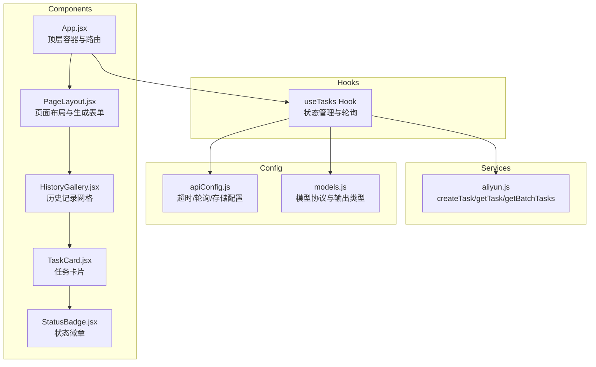
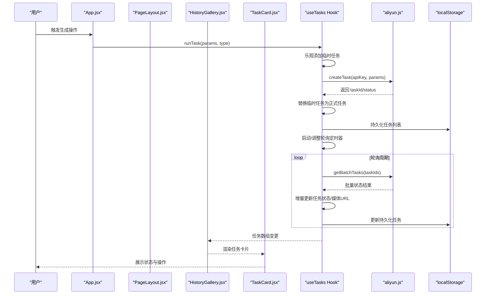
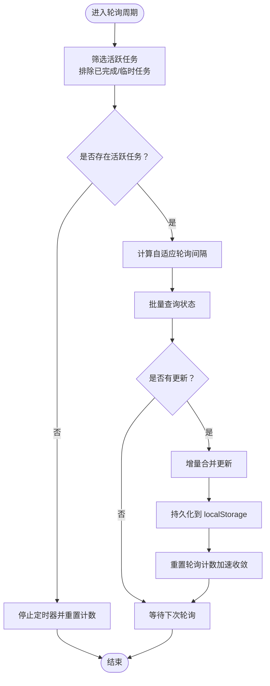
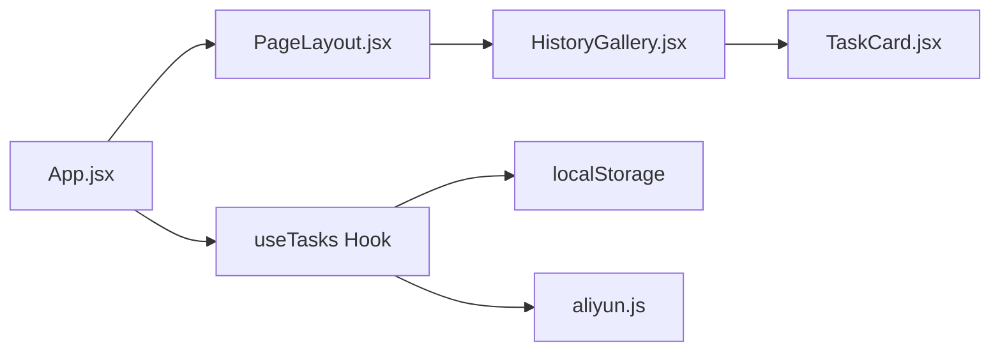
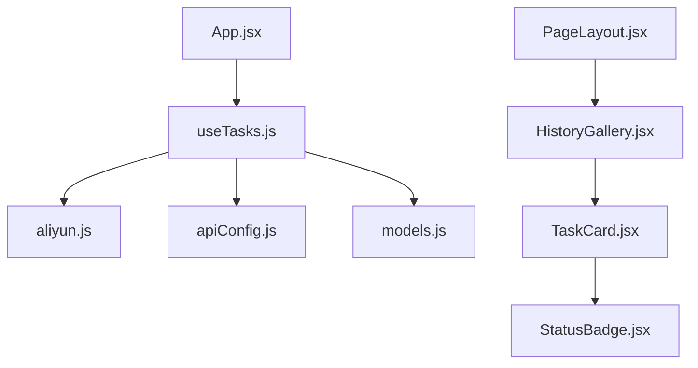

# 状态管理机制

<cite>
**本文引用的文件列表**
- [useTasks.js](file://src/hooks/useTasks.js)
- [App.jsx](file://src/App.jsx)
- [PageLayout.jsx](file://src/components/PageLayout.jsx)
- [HistoryGallery.jsx](file://src/components/HistoryGallery.jsx)
- [TaskCard.jsx](file://src/components/TaskCard.jsx)
- [StatusBadge.jsx](file://src/components/StatusBadge.jsx)
- [aliyun.js](file://src/services/aliyun.js)
- [apiConfig.js](file://src/config/apiConfig.js)
- [models.js](file://src/config/models.js)
</cite>

## 目录
1. [简介](#简介)
2. [项目结构](#项目结构)
3. [核心组件](#核心组件)
4. [架构概览](#架构概览)
5. [详细组件分析](#详细组件分析)
6. [依赖关系分析](#依赖关系分析)
7. [性能考量](#性能考量)
8. [故障排查指南](#故障排查指南)
9. [结论](#结论)

## 简介
本文件系统性阐述通义万相前端应用的状态管理机制，重点围绕 useTasks Hook 的状态生命周期、乐观更新策略、本地存储同步、组件间传递与共享、任务状态转换规则以及轮询更新策略。文档旨在帮助开发者理解从任务提交到状态轮询、再到 UI 展示的完整链路，并提供最佳实践与性能优化建议。

## 项目结构
本应用采用“Hook + 服务层 + 配置”的分层组织：
- Hooks 层：集中管理业务状态与副作用（useTasks）
- Services 层：封装 API 调用与重试/超时控制（aliyun.js）
- Config 层：统一配置常量（apiConfig.js、models.js）
- Components 层：UI 组件负责展示与交互（PageLayout、HistoryGallery、TaskCard、StatusBadge）

图表来源
- [useTasks.js](file://src/hooks/useTasks.js#L1-L333)
- [aliyun.js](file://src/services/aliyun.js#L1-L215)
- [apiConfig.js](file://src/config/apiConfig.js#L1-L35)
- [models.js](file://src/config/models.js#L1-L1012)
- [App.jsx](file://src/App.jsx#L1-L377)
- [PageLayout.jsx](file://src/components/PageLayout.jsx#L1-L76)
- [HistoryGallery.jsx](file://src/components/HistoryGallery.jsx#L1-L68)
- [TaskCard.jsx](file://src/components/TaskCard.jsx#L1-L182)
- [StatusBadge.jsx](file://src/components/StatusBadge.jsx#L1-L58)

章节来源
- [useTasks.js](file://src/hooks/useTasks.js#L1-L333)
- [App.jsx](file://src/App.jsx#L1-L377)

## 核心组件
本节聚焦 useTasks Hook 的职责与实现要点：
- 初始化与本地存储恢复：从本地存储加载任务列表，兼容旧键名并进行智能类型推断
- 乐观更新：提交任务时立即插入临时任务，随后以最终结果替换
- 轮询策略：自适应轮询间隔，区分新任务与长期任务，减少无效请求
- 批量状态检查：并发查询多个任务状态，增量合并更新
- 本地存储同步：持久化任务列表，清理敏感字段，处理配额不足
- 失败处理与重试：捕获错误并标记失败；支持基于原始参数的重试

章节来源
- [useTasks.js](file://src/hooks/useTasks.js#L9-L333)

## 架构概览
下图展示了从用户操作到状态更新与 UI 渲染的关键流程：

图表来源
- [App.jsx](file://src/App.jsx#L48-L70)
- [useTasks.js](file://src/hooks/useTasks.js#L256-L312)
- [aliyun.js](file://src/services/aliyun.js#L50-L160)
- [HistoryGallery.jsx](file://src/components/HistoryGallery.jsx#L42-L52)
- [TaskCard.jsx](file://src/components/TaskCard.jsx#L9-L182)

## 详细组件分析

### useTasks Hook 状态管理
- 状态初始化与本地存储恢复
  - 从本地存储读取任务列表，若不存在则回退到旧键名并进行智能类型推断
  - 仅保存必要字段，移除 base64 数据以节省空间
- 乐观更新策略
  - 提交任务前插入临时 taskId，状态为 RUNNING
  - 成功后以真实 taskId 与最终状态替换，同时写入媒体 URL（若存在）
- 轮询机制与自适应间隔
  - 新建任务（10 秒内）使用 1 秒间隔高频轮询
  - 前 10 次轮询使用 2 秒间隔
  - 长期任务使用最大 5 秒间隔
  - 检测到状态变化时，重置轮询计数以加速收敛
- 批量状态检查与增量更新
  - 并发查询活跃任务状态，收集需要更新的字段映射
  - 仅在有实际变化时触发状态更新，避免不必要的重渲染
- 本地存储同步与配额保护
  - 持久化任务列表，遇到配额不足时仅保留最近 20 条
- 失败处理与重试
  - 创建失败时标记为 FAILED
  - 支持基于 originalParams 的重试，复用原始参数重新创建任务

图表来源
- [useTasks.js](file://src/hooks/useTasks.js#L107-L161)
- [useTasks.js](file://src/hooks/useTasks.js#L164-L246)
- [useTasks.js](file://src/hooks/useTasks.js#L31-L84)

章节来源
- [useTasks.js](file://src/hooks/useTasks.js#L9-L333)

### 任务状态转换规则
- 状态集合与完成条件
  - 完成状态集合包含：SUCCEEDED、FAILED、CANCELED、UNKNOWN
- 状态转换路径
  - 提交任务后初始状态为 RUNNING
  - 轮询过程中可能经历 PENDING（排队）、RUNNING（生成中）
  - 成功条件：状态变为 SUCCEEDED 且具备媒体 URL（现有或新增）
  - 失败条件：状态变为 FAILED 或轮询异常
- 状态展示
  - StatusBadge 统一渲染各状态的图标与标签，便于 UI 一致性

章节来源
- [apiConfig.js](file://src/config/apiConfig.js#L22-L27)
- [StatusBadge.jsx](file://src/components/StatusBadge.jsx#L8-L55)
- [useTasks.js](file://src/hooks/useTasks.js#L211-L225)

### 组件间传递机制与状态共享
- 父子组件通信
  - App.jsx 作为顶层容器，通过 props 将 tasks、isGenerating、runTask、retryTask、deleteTask 传递给 PageLayout
  - PageLayout 将 tasks 过滤为当前页面类型，再传递给 HistoryGallery
  - HistoryGallery 将单个任务传递给 TaskCard，并提供删除与重试回调
- 状态提升与共享
  - useTasks 的状态由 App.jsx 提供，形成单一事实来源
  - 子组件仅消费状态并触发回调，避免重复状态管理
- 性能优化
  - PageLayout 使用 useMemo 缓存过滤后的任务列表，避免每次渲染都重新计算
  - HistoryGallery 与 TaskCard 使用 memo 包装，减少不必要的重渲染

图表来源
- [App.jsx](file://src/App.jsx#L48-L70)
- [PageLayout.jsx](file://src/components/PageLayout.jsx#L22-L26)
- [HistoryGallery.jsx](file://src/components/HistoryGallery.jsx#L42-L52)
- [TaskCard.jsx](file://src/components/TaskCard.jsx#L9-L182)
- [useTasks.js](file://src/hooks/useTasks.js#L324-L331)

章节来源
- [App.jsx](file://src/App.jsx#L48-L70)
- [PageLayout.jsx](file://src/components/PageLayout.jsx#L9-L76)
- [HistoryGallery.jsx](file://src/components/HistoryGallery.jsx#L6-L68)
- [TaskCard.jsx](file://src/components/TaskCard.jsx#L1-L182)

### 服务层与配置
- API 调用与超时控制
  - createTask：根据模型配置构建请求体，支持同步/异步模式，统一返回 taskId 与状态
  - getTask/getBatchTasks：提供单任务与批量轮询接口，内部实现超时控制
- 配置常量
  - 超时设置：请求超时、轮询超时
  - 重试策略：最大尝试次数、初始延迟、指数退避因子
  - 轮询间隔：初始、常规、最大间隔，完成状态集合
  - 存储键：任务列表、API Key、旧键名

章节来源
- [aliyun.js](file://src/services/aliyun.js#L50-L160)
- [aliyun.js](file://src/services/aliyun.js#L170-L215)
- [apiConfig.js](file://src/config/apiConfig.js#L8-L35)

## 依赖关系分析
- useTasks 依赖
  - services/aliyun.js：创建任务、轮询状态、批量查询
  - config/apiConfig.js：轮询间隔、完成状态集合、存储键
  - config/models.js：模型输出类型，决定媒体 URL 字段
- 组件依赖
  - App.jsx 依赖 useTasks Hook
  - PageLayout.jsx 依赖 HistoryGallery
  - HistoryGallery.jsx 依赖 TaskCard
  - TaskCard.jsx 依赖 StatusBadge

图表来源
- [useTasks.js](file://src/hooks/useTasks.js#L1-L5)
- [aliyun.js](file://src/services/aliyun.js#L1-L3)
- [apiConfig.js](file://src/config/apiConfig.js#L1-L35)
- [models.js](file://src/config/models.js#L1-L1012)
- [App.jsx](file://src/App.jsx#L24-L48)
- [PageLayout.jsx](file://src/components/PageLayout.jsx#L1-L76)
- [HistoryGallery.jsx](file://src/components/HistoryGallery.jsx#L1-L68)
- [TaskCard.jsx](file://src/components/TaskCard.jsx#L1-L182)
- [StatusBadge.jsx](file://src/components/StatusBadge.jsx#L1-L58)

章节来源
- [useTasks.js](file://src/hooks/useTasks.js#L1-L5)
- [App.jsx](file://src/App.jsx#L24-L48)

## 性能考量
- 轮询优化
  - 自适应间隔：新任务高频轮询，长期任务降低频率，显著减少 API 压力
  - 批量查询：并发处理多个任务，缩短整体轮询耗时
  - 增量更新：仅在有变化时更新状态，避免不必要的重渲染
- 渲染优化
  - useMemo 缓存过滤后的任务列表，减少子组件重渲染
  - memo 包装子组件，避免浅比较导致的重复渲染
- 存储优化
  - 移除 base64 数据，仅保存必要字段，降低存储体积
  - 配额不足时仅保留最近 20 条，保障可用性
- 网络与超时
  - 请求与轮询均设置超时，防止长时间挂起
  - 重试策略配合指数退避，提高网络波动下的稳定性

章节来源
- [useTasks.js](file://src/hooks/useTasks.js#L86-L104)
- [useTasks.js](file://src/hooks/useTasks.js#L164-L246)
- [PageLayout.jsx](file://src/components/PageLayout.jsx#L22-L26)
- [TaskCard.jsx](file://src/components/TaskCard.jsx#L1-L182)
- [aliyun.js](file://src/services/aliyun.js#L83-L160)
- [apiConfig.js](file://src/config/apiConfig.js#L8-L19)

## 故障排查指南
- 任务状态卡在 RUNNING
  - 检查轮询间隔与完成状态集合是否正确
  - 确认媒体 URL 是否在 SUCCEEDED 时到达，否则保持 RUNNING
- 本地存储异常
  - 若出现配额不足，系统会自动保留最近 20 条任务
  - 检查是否包含大量 base64 数据导致体积过大
- API 调用失败
  - 确认 API Key 是否有效
  - 查看请求/轮询超时与重试策略配置
  - 检查模型配置与请求格式是否匹配
- 重试失败
  - 确保任务包含 originalParams 字段
  - 检查模型是否仍可用

章节来源
- [useTasks.js](file://src/hooks/useTasks.js#L74-L84)
- [useTasks.js](file://src/hooks/useTasks.js#L211-L225)
- [aliyun.js](file://src/services/aliyun.js#L146-L159)
- [apiConfig.js](file://src/config/apiConfig.js#L8-L19)

## 结论
本应用通过 useTasks Hook 将任务状态、轮询策略与本地存储整合为统一的状态管理方案。其核心优势在于：
- 乐观更新提升用户体验
- 自适应轮询平衡性能与实时性
- 批量状态检查与增量更新减少冗余
- 组件间清晰的单向数据流与缓存策略

建议在后续迭代中持续关注以下方面：
- 更细粒度的状态细分（如 CANCELED、UNKNOWN）与 UI 表达
- 轮询失败的降级策略与用户提示
- 本地存储的版本迁移与兼容性
- 大规模任务场景下的内存与渲染优化