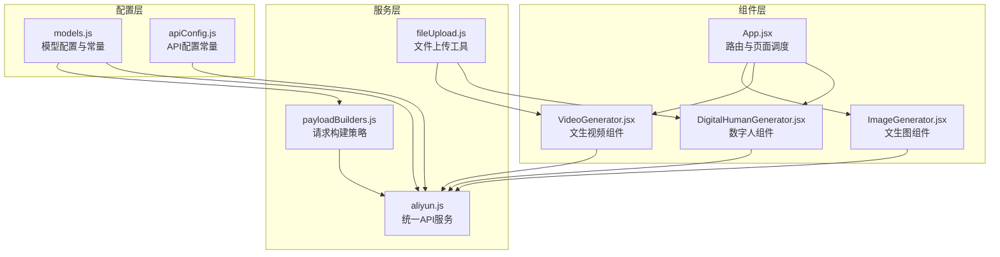
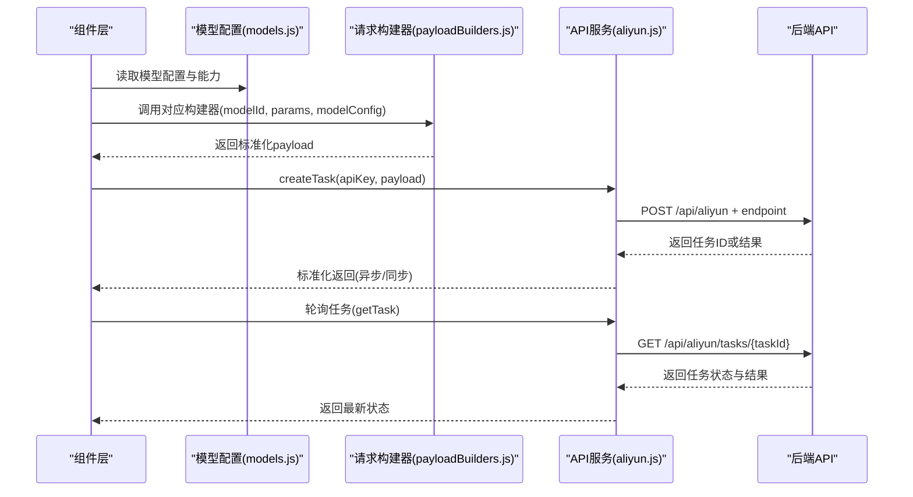
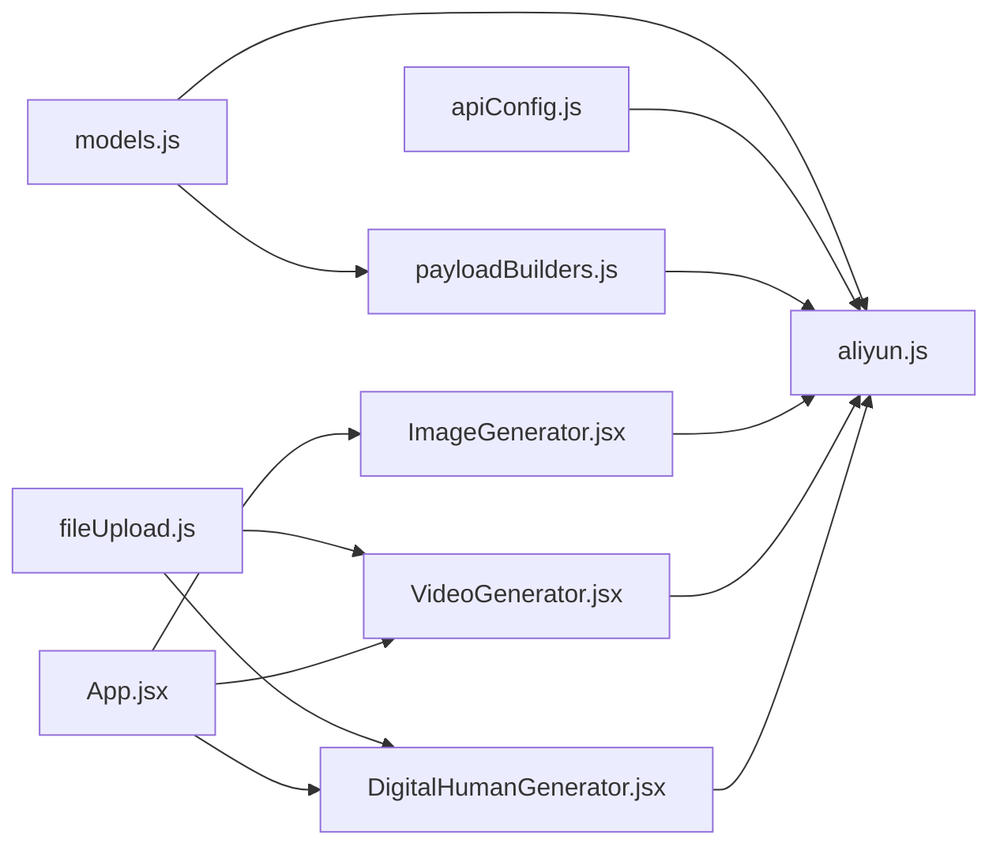

# 模型配置管理

<cite>
**本文档引用的文件**
- [models.js](file://src/config/models.js)
- [apiConfig.js](file://src/config/apiConfig.js)
- [payloadBuilders.js](file://src/services/payloadBuilders.js)
- [aliyun.js](file://src/services/aliyun.js)
- [ImageGenerator.jsx](file://src/components/ImageGenerator.jsx)
- [VideoGenerator.jsx](file://src/components/VideoGenerator.jsx)
- [DigitalHumanGenerator.jsx](file://src/components/DigitalHumanGenerator.jsx)
- [fileUpload.js](file://src/utils/fileUpload.js)
- [App.jsx](file://src/App.jsx)
</cite>

## 目录
1. [简介](#简介)
2. [项目结构](#项目结构)
3. [核心组件](#核心组件)
4. [架构总览](#架构总览)
5. [详细组件分析](#详细组件分析)
6. [依赖关系分析](#依赖关系分析)
7. [性能考虑](#性能考虑)
8. [故障排查指南](#故障排查指南)
9. [结论](#结论)
10. [附录](#附录)

## 简介
本文件面向通义万相前端应用的模型配置管理，系统性阐述模型配置体系的整体架构与实现细节，包括协议定义(PROTOCOLS)、输出类型(OUTPUT_TYPES)、模型分类(MODEL_CATEGORIES)、分辨率标签(RESOLUTION_LABELS)，以及各类AI模型配置结构(视频模型、图像到视频模型、参考到视频模型、视频编辑统一模型、图像模型、数字人模型)。文档还解释了关键字段含义、能力(capabilities)配置方式与扩展机制，并提供最佳实践与扩展方法，帮助开发者高效维护与扩展模型配置。

## 项目结构
模型配置管理采用“配置驱动 + 策略构建”的架构：
- 配置层：集中定义协议、输出类型、分类、分辨率标签与各模型配置
- 服务层：封装API调用、请求构建策略、重试与轮询
- 组件层：UI表单组件根据模型配置动态渲染参数控件
- 工具层：文件上传与校验工具

图表来源
- [models.js](file://src/config/models.js#L1-L1012)
- [apiConfig.js](file://src/config/apiConfig.js#L1-L35)
- [payloadBuilders.js](file://src/services/payloadBuilders.js#L1-L829)
- [aliyun.js](file://src/services/aliyun.js#L1-L215)
- [ImageGenerator.jsx](file://src/components/ImageGenerator.jsx#L1-L249)
- [VideoGenerator.jsx](file://src/components/VideoGenerator.jsx#L1-L354)
- [DigitalHumanGenerator.jsx](file://src/components/DigitalHumanGenerator.jsx#L1-L313)
- [App.jsx](file://src/App.jsx#L1-L377)

章节来源
- [models.js](file://src/config/models.js#L1-L1012)
- [apiConfig.js](file://src/config/apiConfig.js#L1-L35)
- [payloadBuilders.js](file://src/services/payloadBuilders.js#L1-L829)
- [aliyun.js](file://src/services/aliyun.js#L1-L215)
- [ImageGenerator.jsx](file://src/components/ImageGenerator.jsx#L1-L249)
- [VideoGenerator.jsx](file://src/components/VideoGenerator.jsx#L1-L354)
- [DigitalHumanGenerator.jsx](file://src/components/DigitalHumanGenerator.jsx#L1-L313)
- [App.jsx](file://src/App.jsx#L1-L377)

## 核心组件
- 协议定义(PROTOCOLS)：统一抽象不同模型的通信协议，涵盖同步多模态、异步文生图、异步视频、异步图生视频、异步参考生视频、异步视频编辑统一模型、异步语音驱动视频等
- 输出类型(OUTPUT_TYPES)：区分图像与视频两类输出
- 模型分类(MODEL_CATEGORIES)：用于UI筛选与功能归类，包括文生图、图像编辑、图像合成、特效类、创意类
- 分辨率标签(RESOLUTION_LABELS)：提供人类可读的分辨率名称映射
- 模型配置数组：VIDEO_MODELS、I2V_MODELS、R2V_MODELS、VACE_PLUS_MODELS、IMAGE_MODELS、DIGITAL_HUMAN_MODELS、IMAGE_TRANSLATION_MODELS
- 能力(capabilities)：通过布尔位或枚举列表表达模型支持的功能集合
- 请求构建器(payloadBuilders)：根据模型配置与请求格式动态构造API请求体
- API服务(aliyun.js)：统一创建任务、轮询状态、错误处理与重试
- 文件上传工具(fileUpload.js)：支持URL、Base64与File对象的输入处理与校验

章节来源
- [models.js](file://src/config/models.js#L1-L1012)
- [payloadBuilders.js](file://src/services/payloadBuilders.js#L1-L829)
- [aliyun.js](file://src/services/aliyun.js#L1-L215)
- [fileUpload.js](file://src/utils/fileUpload.js#L1-L182)

## 架构总览
模型配置管理遵循“配置驱动 + 策略模式”：
- 配置驱动：所有模型行为由配置决定，新增模型只需在配置中注册
- 策略模式：请求构建器按请求格式分发，避免在业务代码中重复判断
- 统一服务：API服务负责协议头、超时、重试、轮询与结果标准化

图表来源
- [models.js](file://src/config/models.js#L1-L1012)
- [payloadBuilders.js](file://src/services/payloadBuilders.js#L1-L829)
- [aliyun.js](file://src/services/aliyun.js#L50-L160)

## 详细组件分析

### 协议定义(PROTOCOLS)与输出类型(OUTPUT_TYPES)
- PROTOCOLS：定义了同步多模态、异步文生图、异步视频、异步图生视频、异步参考生视频、异步视频编辑统一模型、异步语音驱动视频等协议标识，用于区分不同模型的通信方式与头部设置
- OUTPUT_TYPES：统一图像与视频两类输出类型，便于UI与服务层处理结果

章节来源
- [models.js](file://src/config/models.js#L2-L16)

### 模型分类(MODEL_CATEGORIES)与分辨率标签(RESOLUTION_LABELS)
- MODEL_CATEGORIES：用于UI侧按功能类别筛选模型，如文生图、图像编辑、图像合成、特效类、创意类
- RESOLUTION_LABELS：提供常见分辨率的人类可读名称映射，便于UI展示与用户选择

章节来源
- [models.js](file://src/config/models.js#L19-L37)

### 视频模型(VIDEO_MODELS)配置
- 关键字段
  - protocol：协议标识，决定是否异步与请求头设置
  - endpoint：API端点路径
  - requestFormat：请求格式，决定使用哪个payload构建器
  - outputType：输出类型(视频)
  - defaultRes：默认分辨率
  - resolutions：可用分辨率列表
  - capabilities：能力集合，如prompt_extend、shot_type、audio、negative_prompt、seed、frame_selection等
- 能力扩展机制
  - 通过capabilities中的布尔位或枚举列表表达功能支持
  - UI根据capabilities动态显示/隐藏参数控件
  - payload构建器根据capabilities决定是否注入参数

章节来源
- [models.js](file://src/config/models.js#L40-L135)
- [payloadBuilders.js](file://src/services/payloadBuilders.js#L515-L571)

### 图像到视频模型(I2V_MODELS)配置
- 与视频模型类似，但针对图生视频场景，支持模板模式与关键帧输入
- 关键字段与能力与视频模型一致，但会根据模板模式调整输入字段

章节来源
- [models.js](file://src/config/models.js#L138-L216)
- [payloadBuilders.js](file://src/services/payloadBuilders.js#L577-L643)

### 参考到视频模型(R2V_MODELS)配置
- 支持参考视频输入，生成保持角色形象与音色的视频
- capabilities包含shot_type、negative_prompt、seed、multi_character、watermark等

章节来源
- [models.js](file://src/config/models.js#L219-L239)
- [payloadBuilders.js](file://src/services/payloadBuilders.js#L649-L665)

### 视频编辑统一模型(VACE_PLUS_MODELS)配置
- 支持多图参考、视频重绘、局部编辑、视频延展和画面扩展等函数
- capabilities.functions列出支持的具体函数

章节来源
- [models.js](file://src/config/models.js#L242-L262)
- [payloadBuilders.js](file://src/services/payloadBuilders.js#L671-L709)

### 图像模型(IMAGE_MODELS)配置
- 包含Qwen图像编辑系列、万相通用图像编辑、文生图、草图生图、局部重绘、风格重绘、扩图、鞋模、背景生成、AI试衣、创意文字等
- 关键字段：category(分类)、protocol、endpoint、requestFormat、outputType、defaultRes、resolutions、capabilities
- capabilities示例：negative_prompt、prompt_extend、watermark、seed、n、functions、style、ref_img、ref_strength、ref_mode等

章节来源
- [models.js](file://src/config/models.js#L265-L788)
- [payloadBuilders.js](file://src/services/payloadBuilders.js#L125-L150)
- [payloadBuilders.js](file://src/services/payloadBuilders.js#L156-L168)
- [payloadBuilders.js](file://src/services/payloadBuilders.js#L174-L190)
- [payloadBuilders.js](file://src/services/payloadBuilders.js#L196-L220)
- [payloadBuilders.js](file://src/services/payloadBuilders.js#L226-L249)
- [payloadBuilders.js](file://src/services/payloadBuilders.js#L255-L277)
- [payloadBuilders.js](file://src/services/payloadBuilders.js#L300-L319)
- [payloadBuilders.js](file://src/services/payloadBuilders.js#L325-L345)
- [payloadBuilders.js](file://src/services/payloadBuilders.js#L351-L363)
- [payloadBuilders.js](file://src/services/payloadBuilders.js#L369-L398)
- [payloadBuilders.js](file://src/services/payloadBuilders.js#L404-L425)
- [payloadBuilders.js](file://src/services/payloadBuilders.js#L431-L454)
- [payloadBuilders.js](file://src/services/payloadBuilders.js#L460-L509)

### 数字人模型(DIGITAL_HUMAN_MODELS)配置
- 包括图像检测与语音驱动视频两大类
- 图像检测：验证输入图片是否符合语音驱动视频模型的输入规范
- 语音驱动视频：支持基于单张图片和音频生成说话、唱歌或表演视频，支持多种动作类型与分辨率

章节来源
- [models.js](file://src/config/models.js#L791-L904)
- [payloadBuilders.js](file://src/services/payloadBuilders.js#L715-L723)
- [payloadBuilders.js](file://src/services/payloadBuilders.js#L729-L742)

### 请求构建器(Payload Builders)与能力(capabilities)配置
- 策略模式：每个请求格式对应一个构建器，统一入口为payloadBuilders[requestFormat]
- 能力驱动：构建器根据modelConfig.capabilities决定是否注入参数，如n、prompt_extend、negative_prompt、watermark、seed、functions等
- 参数标准化：构建器负责参数合并、默认值设置与字段规范化

章节来源
- [payloadBuilders.js](file://src/services/payloadBuilders.js#L77-L119)
- [payloadBuilders.js](file://src/services/payloadBuilders.js#L125-L150)
- [payloadBuilders.js](file://src/services/payloadBuilders.js#L515-L571)

### API服务(aliyun.js)与超时/重试/轮询
- createTask：根据模型配置与请求格式构建payload，发送请求，处理异步/同步返回
- getTask/getBatchTasks：统一轮询接口，支持超时控制与错误处理
- 重试机制：对网络错误与超时进行指数退避重试，避免无效重试未知模型/格式错误

章节来源
- [aliyun.js](file://src/services/aliyun.js#L50-L160)
- [aliyun.js](file://src/services/aliyun.js#L170-L215)
- [apiConfig.js](file://src/config/apiConfig.js#L9-L27)

### 组件层与模型配置的交互
- ImageGenerator：根据当前模型capabilities动态渲染高级参数控件，如反向提示词、随机种子、艺术风格等
- VideoGenerator：根据模型capabilities渲染镜头类型、音频输入、水印等选项；根据模型ID限制可用时长
- DigitalHumanGenerator：根据模型类型渲染动作类型与分辨率选择；对检测模型与语音驱动模型分别处理

章节来源
- [ImageGenerator.jsx](file://src/components/ImageGenerator.jsx#L1-L249)
- [VideoGenerator.jsx](file://src/components/VideoGenerator.jsx#L1-L354)
- [DigitalHumanGenerator.jsx](file://src/components/DigitalHumanGenerator.jsx#L1-L313)

### 文件上传与校验(fileUpload.js)
- 支持URL、Base64与File对象输入
- 提供URL格式校验、Base64识别、文件类型与大小校验
- 图像压缩：对大图进行压缩以降低Base64体积，避免超出限制

章节来源
- [fileUpload.js](file://src/utils/fileUpload.js#L1-L182)

## 依赖关系分析

图表来源
- [models.js](file://src/config/models.js#L931-L1012)
- [payloadBuilders.js](file://src/services/payloadBuilders.js#L1-L829)
- [aliyun.js](file://src/services/aliyun.js#L1-L215)
- [apiConfig.js](file://src/config/apiConfig.js#L1-L35)
- [fileUpload.js](file://src/utils/fileUpload.js#L1-L182)
- [ImageGenerator.jsx](file://src/components/ImageGenerator.jsx#L1-L249)
- [VideoGenerator.jsx](file://src/components/VideoGenerator.jsx#L1-L354)
- [DigitalHumanGenerator.jsx](file://src/components/DigitalHumanGenerator.jsx#L1-L313)
- [App.jsx](file://src/App.jsx#L1-L377)

章节来源
- [models.js](file://src/config/models.js#L931-L1012)
- [payloadBuilders.js](file://src/services/payloadBuilders.js#L1-L829)
- [aliyun.js](file://src/services/aliyun.js#L1-L215)
- [apiConfig.js](file://src/config/apiConfig.js#L1-L35)
- [fileUpload.js](file://src/utils/fileUpload.js#L1-L182)
- [ImageGenerator.jsx](file://src/components/ImageGenerator.jsx#L1-L249)
- [VideoGenerator.jsx](file://src/components/VideoGenerator.jsx#L1-L354)
- [DigitalHumanGenerator.jsx](file://src/components/DigitalHumanGenerator.jsx#L1-L313)
- [App.jsx](file://src/App.jsx#L1-L377)

## 性能考虑
- 异步任务：视频与图像生成通常为异步，需合理设置轮询间隔与最大等待时间，避免阻塞UI
- 超时控制：请求与轮询均设置超时，防止长时间挂起
- 重试策略：对网络错误与超时进行有限次数的指数退避重试，避免雪崩
- 文件压缩：对大图进行压缩，减少Base64体积，提高传输效率
- 能力驱动渲染：仅渲染模型支持的能力参数，减少不必要的DOM节点与计算

## 故障排查指南
- 未知模型/请求格式：API服务会在创建任务时校验模型与请求格式，若不存在会抛出错误，需检查模型ID与requestFormat是否匹配
- 网络错误/超时：API服务对网络错误与超时进行捕获与重试，必要时检查网络连接与代理设置
- 同步响应异常：同步多模态响应需包含特定结构，若不符合会抛出异常，需检查模型是否支持同步调用
- 文件输入错误：URL格式不正确或文件类型不支持会导致处理失败，需使用fileUpload.js提供的校验与转换函数
- 能力参数缺失：某些模型需要特定输入(如图生视频需要图片)，构建器会抛出错误提示，需确保必填项已提供

章节来源
- [aliyun.js](file://src/services/aliyun.js#L50-L160)
- [payloadBuilders.js](file://src/services/payloadBuilders.js#L136-L138)
- [payloadBuilders.js](file://src/services/payloadBuilders.js#L178-L180)
- [payloadBuilders.js](file://src/services/payloadBuilders.js#L200-L202)
- [payloadBuilders.js](file://src/services/payloadBuilders.js#L259-L261)
- [payloadBuilders.js](file://src/services/payloadBuilders.js#L406-L425)
- [fileUpload.js](file://src/utils/fileUpload.js#L92-L144)

## 结论
通义万相前端应用的模型配置管理通过“配置驱动 + 策略模式”实现了高度可扩展与可维护的架构。配置层集中定义协议、输出类型、分类、分辨率标签与各模型配置；服务层统一处理API调用、请求构建、重试与轮询；组件层根据模型能力动态渲染参数控件。该架构使得新增模型仅需在配置中注册，即可自动获得完整的请求构建、参数渲染与结果处理能力，显著降低了开发与维护成本。

## 附录

### 最佳实践与扩展方法
- 新增模型步骤
  - 在对应模型数组中添加配置项，设置protocol、endpoint、requestFormat、outputType、defaultRes、resolutions、capabilities
  - 如需新的请求格式，新增对应的payload构建器函数
  - 在组件层根据需求渲染相应参数控件
  - 若涉及新的UI分类，更新MODEL_CATEGORIES并在组件中使用
- 能力扩展
  - 通过capabilities的布尔位或枚举列表表达新功能，构建器与组件据此动态处理
  - 对于复杂能力(如functions数组)，在构建器中增加条件分支与参数注入
- 参数标准化
  - 在payload构建器中统一处理默认值、字段规范化与必填项校验
  - 对于UI输入，使用fileUpload.js进行URL/Base64/File对象的统一处理
- 错误处理
  - 在API服务中区分未知模型/格式与网络错误，避免对无效错误进行重试
  - 在组件层对用户输入进行前置校验，减少无效请求

章节来源
- [models.js](file://src/config/models.js#L1-L1012)
- [payloadBuilders.js](file://src/services/payloadBuilders.js#L1-L829)
- [aliyun.js](file://src/services/aliyun.js#L1-L215)
- [fileUpload.js](file://src/utils/fileUpload.js#L1-L182)
- [ImageGenerator.jsx](file://src/components/ImageGenerator.jsx#L1-L249)
- [VideoGenerator.jsx](file://src/components/VideoGenerator.jsx#L1-L354)
- [DigitalHumanGenerator.jsx](file://src/components/DigitalHumanGenerator.jsx#L1-L313)