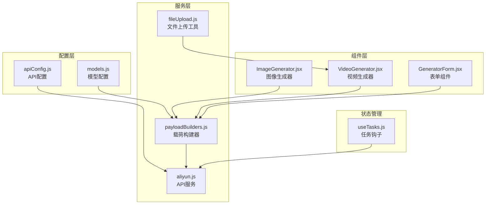
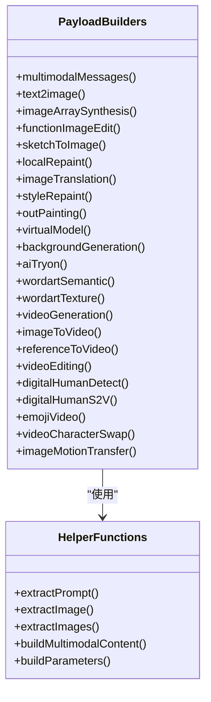
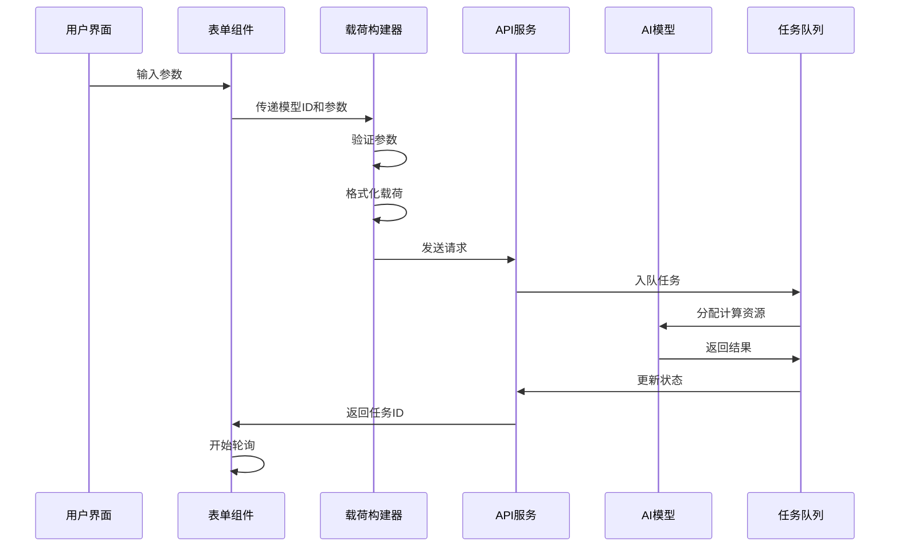
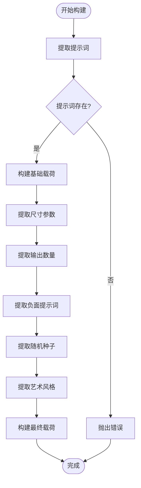
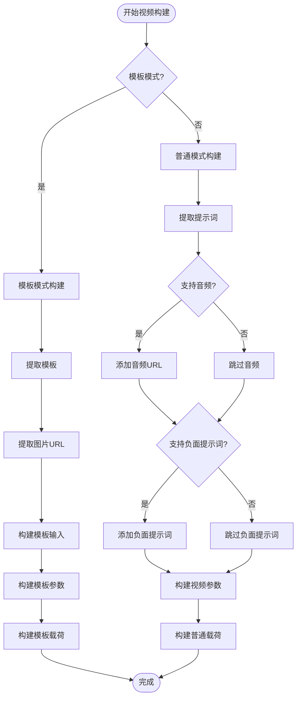
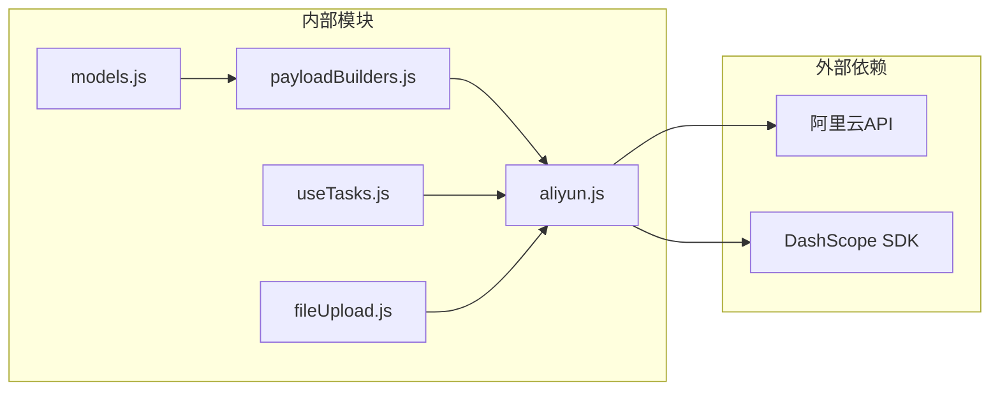
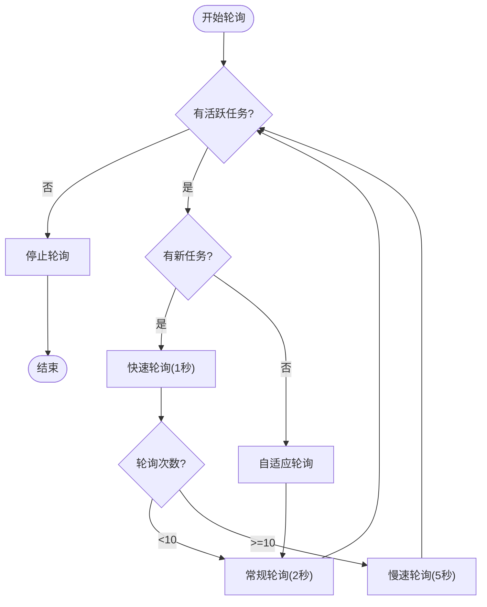
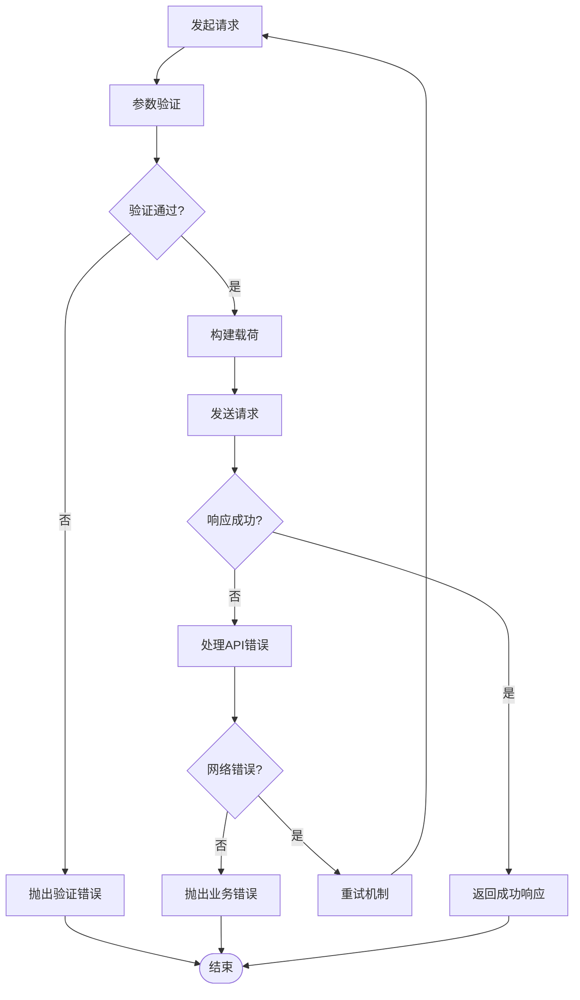

# 请求载荷构建器

<cite>
**本文档引用的文件**
- [payloadBuilders.js](file://src/services/payloadBuilders.js)
- [models.js](file://src/config/models.js)
- [apiConfig.js](file://src/config/apiConfig.js)
- [aliyun.js](file://src/services/aliyun.js)
- [useTasks.js](file://src/hooks/useTasks.js)
- [ImageGenerator.jsx](file://src/components/ImageGenerator.jsx)
- [VideoGenerator.jsx](file://src/components/VideoGenerator.jsx)
- [GeneratorForm.jsx](file://src/components/GeneratorForm.jsx)
- [fileUpload.js](file://src/utils/fileUpload.js)
</cite>

## 目录
1. [简介](#简介)
2. [项目结构](#项目结构)
3. [核心组件](#核心组件)
4. [架构概览](#架构概览)
5. [详细组件分析](#详细组件分析)
6. [依赖关系分析](#依赖关系分析)
7. [性能考虑](#性能考虑)
8. [故障排除指南](#故障排除指南)
9. [结论](#结论)

## 简介

通义万相前端应用的请求载荷构建器是一个基于策略模式的模块化系统，负责将用户输入参数动态转换为不同AI模型所需的请求格式。该系统支持20多种不同的AI模型，包括文生图、图生视频、图像编辑、AI试衣等多个功能领域。

该构建器采用配置驱动的设计理念，通过模型配置文件定义每个模型的特性和支持的功能，然后使用对应的构建器函数生成标准化的请求载荷。这种设计使得添加新模型变得极其简单，只需在配置文件中添加模型定义即可。

## 项目结构

**图表来源**
- [models.js](file://src/config/models.js#L1-L1012)
- [payloadBuilders.js](file://src/services/payloadBuilders.js#L1-L829)
- [aliyun.js](file://src/services/aliyun.js#L1-L215)

**章节来源**
- [models.js](file://src/config/models.js#L1-L1012)
- [payloadBuilders.js](file://src/services/payloadBuilders.js#L1-L829)
- [apiConfig.js](file://src/config/apiConfig.js#L1-L35)

## 核心组件

### 载荷构建器注册表

载荷构建器系统采用注册表模式，将不同的请求格式映射到对应的构建器函数：

**图表来源**
- [payloadBuilders.js](file://src/services/payloadBuilders.js#L804-L828)

### 模型配置系统

每个AI模型都有详细的配置信息，包括：
- 模型ID和名称
- 协议类型（同步/异步）
- API端点
- 请求格式类型
- 输出类型（图像/视频）
- 支持的分辨率
- 功能能力（capabilities）

**章节来源**
- [models.js](file://src/config/models.js#L1-L1012)

## 架构概览

**图表来源**
- [useTasks.js](file://src/hooks/useTasks.js#L256-L312)
- [aliyun.js](file://src/services/aliyun.js#L50-L160)

## 详细组件分析

### 文本到图像构建器

文本到图像构建器处理标准的文生图请求，支持多种参数配置：

**图表来源**
- [payloadBuilders.js](file://src/services/payloadBuilders.js#L156-L168)

**章节来源**
- [payloadBuilders.js](file://src/services/payloadBuilders.js#L156-L168)

### 视频生成构建器

视频生成构建器支持多种视频生成模式，包括文本到视频、图生视频和参考视频生成：

**图表来源**
- [payloadBuilders.js](file://src/services/payloadBuilders.js#L515-L571)

**章节来源**
- [payloadBuilders.js](file://src/services/payloadBuilders.js#L515-L571)

### 图像编辑构建器

图像编辑构建器支持多种编辑模式，包括功能图像编辑和草图到图像：

**章节来源**
- [payloadBuilders.js](file://src/services/payloadBuilders.js#L196-L220)
- [payloadBuilders.js](file://src/services/payloadBuilders.js#L226-L249)

### 多模态消息构建器

多模态消息构建器处理包含文本和图像的消息格式：

**章节来源**
- [payloadBuilders.js](file://src/services/payloadBuilders.js#L125-L150)

## 依赖关系分析

**图表来源**
- [aliyun.js](file://src/services/aliyun.js#L1-L215)
- [models.js](file://src/config/models.js#L1-L1012)

### 组件耦合度分析

载荷构建器系统具有以下特点：

1. **低耦合**: 每个构建器函数独立工作，只依赖于公共的帮助函数
2. **高内聚**: 相关的构建器函数组织在一起，便于维护
3. **可扩展性**: 新增模型只需添加配置和对应的构建器函数
4. **可测试性**: 每个构建器函数都可以独立测试

**章节来源**
- [payloadBuilders.js](file://src/services/payloadBuilders.js#L1-L829)
- [models.js](file://src/config/models.js#L1-L1012)

## 性能考虑

### 轮询策略优化

系统实现了智能轮询策略，根据任务状态动态调整轮询间隔：

**图表来源**
- [useTasks.js](file://src/hooks/useTasks.js#L87-L104)

### 文件上传优化

对于大文件，系统实现了智能压缩和分块上传策略：

**章节来源**
- [fileUpload.js](file://src/utils/fileUpload.js#L1-L39)

## 故障排除指南

### 常见错误类型

1. **模型配置错误**: 当模型ID不存在时抛出"未知模型"错误
2. **请求格式错误**: 当请求格式标识符无效时抛出"未知请求格式"错误
3. **参数验证失败**: 当必需参数缺失时抛出相应的验证错误
4. **网络超时**: 当请求超过指定时间限制时抛出超时错误

### 错误处理机制

**图表来源**
- [aliyun.js](file://src/services/aliyun.js#L146-L160)

**章节来源**
- [aliyun.js](file://src/services/aliyun.js#L14-L36)
- [useTasks.js](file://src/hooks/useTasks.js#L305-L311)

## 结论

通义万相前端应用的请求载荷构建器是一个高度模块化和可扩展的系统。通过采用策略模式和配置驱动的设计，该系统能够轻松支持20多种不同的AI模型，同时保持代码的简洁性和可维护性。

### 主要优势

1. **配置驱动**: 通过模型配置文件定义所有模型特性，无需修改核心逻辑
2. **策略模式**: 每个请求格式都有专门的构建器函数，职责单一
3. **智能验证**: 自动验证必需参数和参数类型
4. **错误处理**: 完善的错误处理和重试机制
5. **性能优化**: 智能轮询和文件处理优化

### 最佳实践建议

1. **扩展新模型**: 在models.js中添加模型配置，然后在payloadBuilders.js中添加对应的构建器函数
2. **参数验证**: 在构建器函数中添加必要的参数验证逻辑
3. **错误处理**: 为每个构建器函数提供清晰的错误消息
4. **性能监控**: 监控构建器函数的执行时间和内存使用情况
5. **测试覆盖**: 为每个构建器函数编写单元测试

该系统为通义万相应用提供了强大的请求载荷构建能力，支持从简单的文生图到复杂的视频生成等各种AI模型，为用户提供了丰富的创作工具。