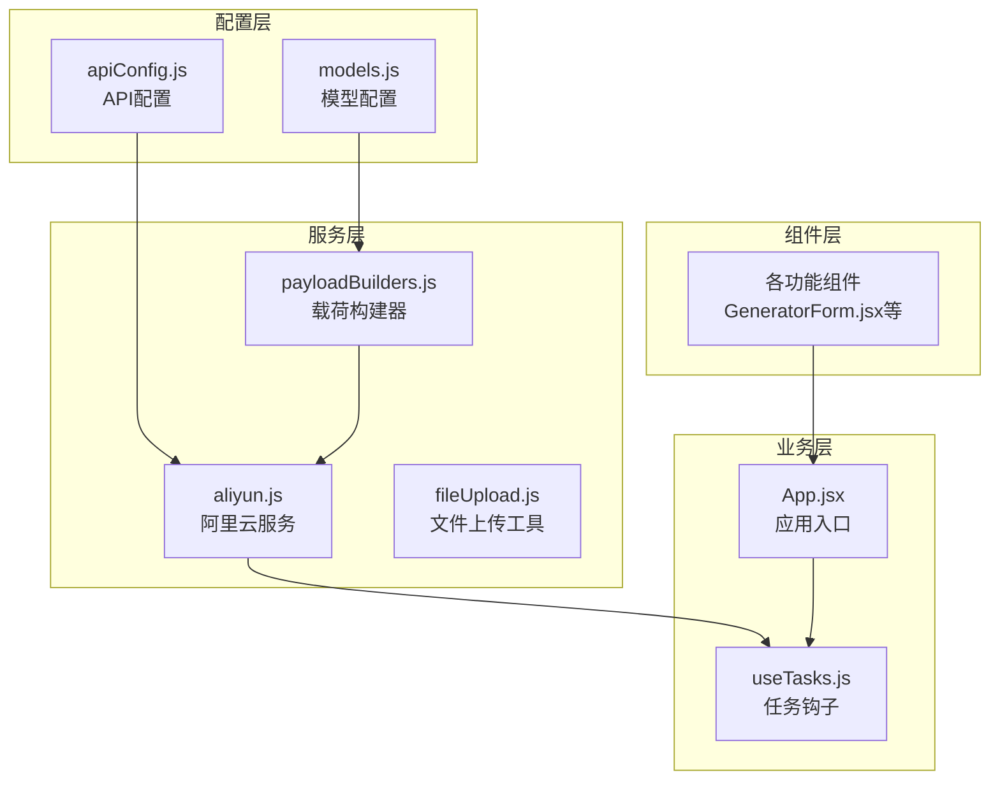
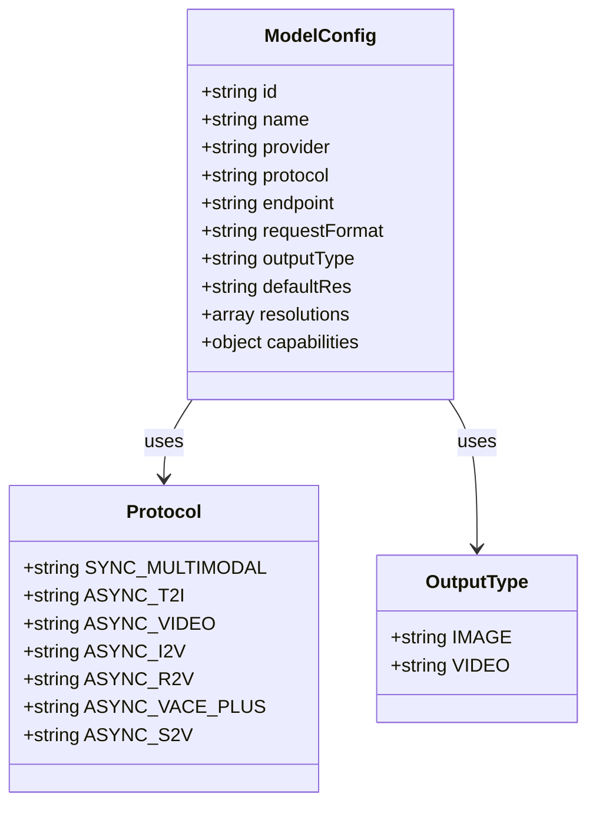
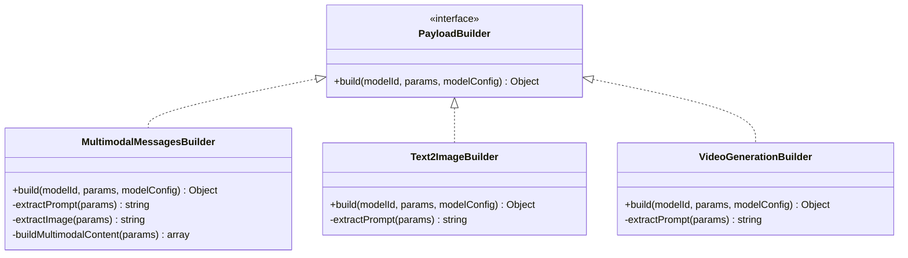
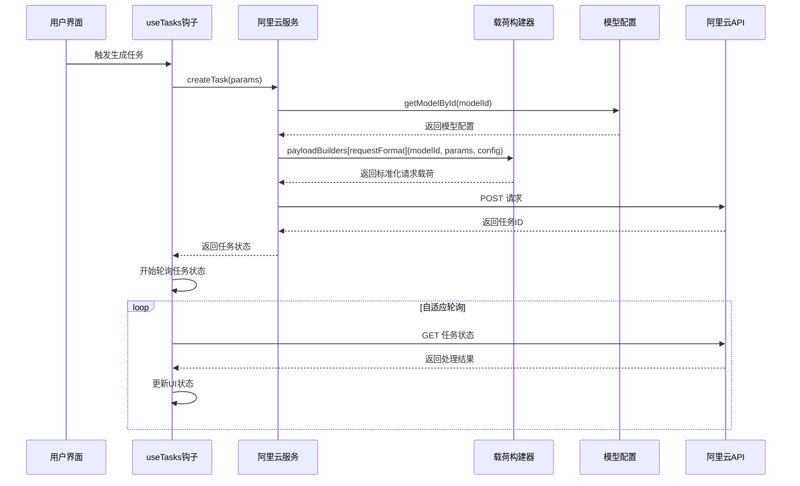
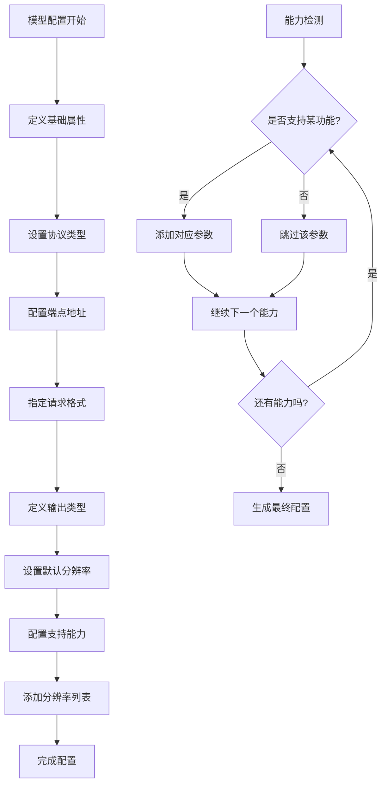
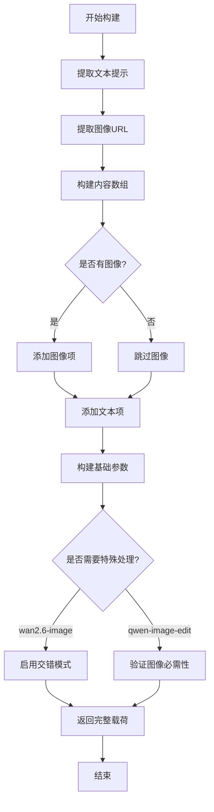
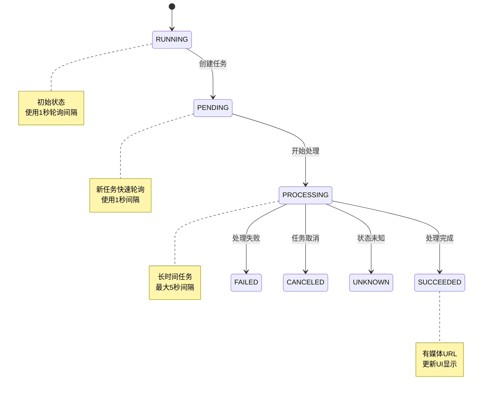
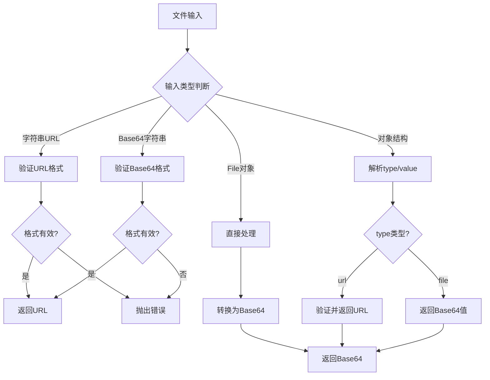
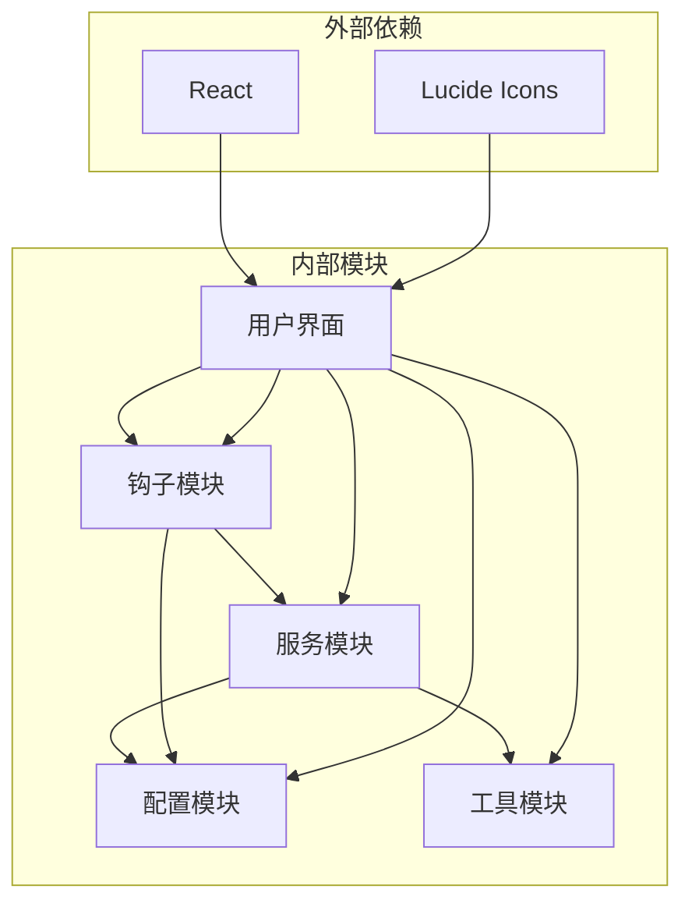

# 配置驱动的数据处理

<cite>
**本文档引用的文件**
- [models.js](file://src/config/models.js)
- [apiConfig.js](file://src/config/apiConfig.js)
- [payloadBuilders.js](file://src/services/payloadBuilders.js)
- [aliyun.js](file://src/services/aliyun.js)
- [useTasks.js](file://src/hooks/useTasks.js)
- [fileUpload.js](file://src/utils/fileUpload.js)
- [App.jsx](file://src/App.jsx)
</cite>

## 目录
1. [简介](#简介)
2. [项目结构](#项目结构)
3. [核心组件](#核心组件)
4. [架构概览](#架构概览)
5. [详细组件分析](#详细组件分析)
6. [依赖关系分析](#依赖关系分析)
7. [性能考虑](#性能考虑)
8. [故障排除指南](#故障排除指南)
9. [结论](#结论)
10. [附录](#附录)

## 简介

通义万相前端应用采用配置驱动的数据处理架构，通过统一的模型配置管理和参数构建标准化流程，实现了对多种AI模型的灵活适配和高效管理。该架构的核心理念是将模型配置、请求载荷构建和任务执行分离，通过配置文件驱动整个数据处理流程，确保系统的可扩展性和维护性。

本系统支持多种AI模型类型，包括文生图、图生视频、视频编辑、数字人生成等，每种模型都有其特定的参数配置和适配策略。通过配置驱动的方式，新增模型或修改现有模型的参数变得简单而安全，无需修改核心业务逻辑。

## 项目结构

项目采用模块化的组织方式，主要分为以下几个层次：

**图表来源**
- [models.js](file://src/config/models.js#L1-L1012)
- [payloadBuilders.js](file://src/services/payloadBuilders.js#L1-L829)
- [aliyun.js](file://src/services/aliyun.js#L1-L215)
- [useTasks.js](file://src/hooks/useTasks.js#L1-L333)

**章节来源**
- [models.js](file://src/config/models.js#L1-L1012)
- [apiConfig.js](file://src/config/apiConfig.js#L1-L35)

## 核心组件

### 模型配置管理

系统通过统一的模型配置文件管理所有AI模型的信息，包括模型标识、名称、提供商、协议类型、端点地址、请求格式、输出类型等关键信息。

**图表来源**
- [models.js](file://src/config/models.js#L2-L16)

### 载荷构建器

载荷构建器采用策略模式，为不同的请求格式提供专门的构建函数，确保每个AI模型都能按照其特定的参数要求生成标准的请求载荷。

**图表来源**
- [payloadBuilders.js](file://src/services/payloadBuilders.js#L125-L150)
- [payloadBuilders.js](file://src/services/payloadBuilders.js#L156-L168)
- [payloadBuilders.js](file://src/services/payloadBuilders.js#L515-L571)

### 任务管理系统

任务管理系统负责协调整个生成流程，包括任务创建、状态轮询、结果处理等功能，通过自适应轮询策略优化资源使用效率。

**章节来源**
- [models.js](file://src/config/models.js#L265-L788)
- [payloadBuilders.js](file://src/services/payloadBuilders.js#L1-L829)
- [aliyun.js](file://src/services/aliyun.js#L50-L160)
- [useTasks.js](file://src/hooks/useTasks.js#L9-L333)

## 架构概览

系统采用分层架构设计，通过配置驱动实现高度解耦的数据处理流程：

**图表来源**
- [aliyun.js](file://src/services/aliyun.js#L50-L160)
- [useTasks.js](file://src/hooks/useTasks.js#L164-L246)

## 详细组件分析

### 模型配置系统

系统通过分类化的模型配置管理不同类型的AI模型，每类模型都有其特定的能力集和参数要求。

#### 文生图模型配置

文生图模型配置展示了如何通过统一的配置结构管理不同版本和能力的模型：

**图表来源**
- [models.js](file://src/config/models.js#L265-L421)

#### 视频生成模型配置

视频生成模型配置体现了复杂参数的处理策略：

**章节来源**
- [models.js](file://src/config/models.js#L39-L135)
- [models.js](file://src/config/models.js#L137-L216)

### 载荷构建器工作原理

载荷构建器采用策略模式，为每种请求格式提供专门的构建逻辑：

#### 多模态消息构建器

多模态消息构建器处理图文混合输入，支持多种消息格式：

**图表来源**
- [payloadBuilders.js](file://src/services/payloadBuilders.js#L125-L150)

#### 视频生成构建器

视频生成构建器处理复杂的视频参数配置：

**章节来源**
- [payloadBuilders.js](file://src/services/payloadBuilders.js#L515-L643)

### 任务管理系统

任务管理系统通过自适应轮询策略优化资源使用：

**图表来源**
- [useTasks.js](file://src/hooks/useTasks.js#L87-L104)
- [useTasks.js](file://src/hooks/useTasks.js#L164-L246)

**章节来源**
- [useTasks.js](file://src/hooks/useTasks.js#L9-L333)

### 文件上传处理

文件上传系统支持多种输入格式，包括URL、Base64和文件对象：

**图表来源**
- [fileUpload.js](file://src/utils/fileUpload.js#L114-L144)

**章节来源**
- [fileUpload.js](file://src/utils/fileUpload.js#L1-L182)

## 依赖关系分析

系统采用松耦合的设计，通过依赖注入实现模块间的解耦：

**图表来源**
- [App.jsx](file://src/App.jsx#L1-L377)
- [useTasks.js](file://src/hooks/useTasks.js#L1-L333)
- [aliyun.js](file://src/services/aliyun.js#L1-L215)

**章节来源**
- [App.jsx](file://src/App.jsx#L1-L377)
- [aliyun.js](file://src/services/aliyun.js#L1-L215)

## 性能考虑

系统在多个层面进行了性能优化：

### 轮询策略优化

自适应轮询策略根据任务状态动态调整轮询间隔，减少不必要的网络请求：

- 新创建任务：1秒间隔，快速响应状态变化
- 活跃任务：2秒间隔，平衡响应速度和资源消耗
- 长时间运行任务：最大5秒间隔，降低服务器压力

### 资源管理

- 本地存储优化：移除Base64数据，只保存必要信息
- 存储配额监控：超过配额时自动清理历史任务
- 批量轮询：使用Promise.allSettled并发检查多个任务状态

### 网络请求优化

- 超时控制：请求超时120秒，轮询超时30秒
- 重试机制：网络错误自动重试，最多2次
- 超时竞速：使用Promise.race确保及时响应

## 故障排除指南

### 常见问题及解决方案

#### 模型配置错误

**问题**：未知模型或未知请求格式
**原因**：模型ID不在配置列表中或请求格式不存在
**解决**：检查模型ID拼写，确认模型配置正确

#### 参数构建错误

**问题**：某些模型需要特定参数但未提供
**原因**：编辑类模型需要基准图片，草图生图需要草图图片
**解决**：根据模型能力检查必填参数，提供正确的输入

#### API调用失败

**问题**：网络错误或超时
**原因**：网络连接问题或服务器响应慢
**解决**：检查网络连接，稍后重试，查看API状态

#### 任务状态异常

**问题**：任务状态长时间停留在RUNNING
**原因**：服务器处理时间过长或轮询间隔过大
**解决**：等待任务完成，检查服务器状态

**章节来源**
- [aliyun.js](file://src/services/aliyun.js#L20-L36)
- [payloadBuilders.js](file://src/services/payloadBuilders.js#L136-L138)

## 结论

通义万相前端应用的配置驱动数据处理架构通过以下关键特性实现了高效的AI模型管理：

1. **统一配置管理**：通过集中式的模型配置文件，实现了对多种AI模型的统一管理
2. **标准化参数构建**：采用策略模式的载荷构建器，确保不同模型的参数构建标准化
3. **灵活的任务调度**：通过自适应轮询策略，优化了资源使用效率
4. **强大的扩展性**：新增模型只需添加配置，无需修改核心逻辑

该架构不仅提高了开发效率，还增强了系统的稳定性和可维护性，为后续的功能扩展和技术升级奠定了坚实的基础。

## 附录

### 配置扩展最佳实践

#### 添加新模型的步骤

1. 在对应的模型数组中添加新模型配置
2. 确认请求格式在载荷构建器中已有对应实现
3. 测试模型配置的正确性
4. 更新UI组件以支持新模型

#### 参数适配策略

- 对于支持n参数的模型，提供输出数量控制
- 对于需要基准图片的编辑模型，添加图片验证逻辑
- 对于视频模型，合理设置默认分辨率和时长
- 对于特殊功能，如水印、种子等，提供可选参数

#### 性能优化建议

- 合理设置轮询间隔，避免过度轮询
- 优化本地存储策略，定期清理历史任务
- 实现批量操作，减少重复请求
- 添加缓存机制，避免重复计算