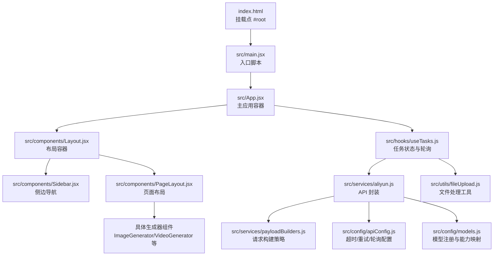
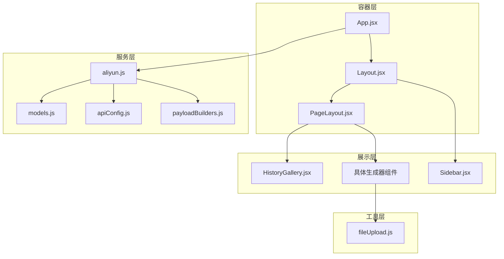
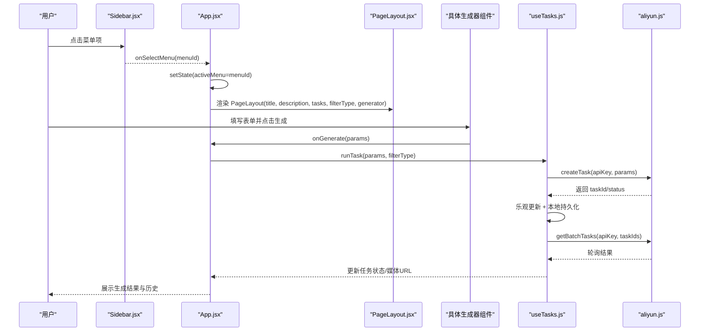
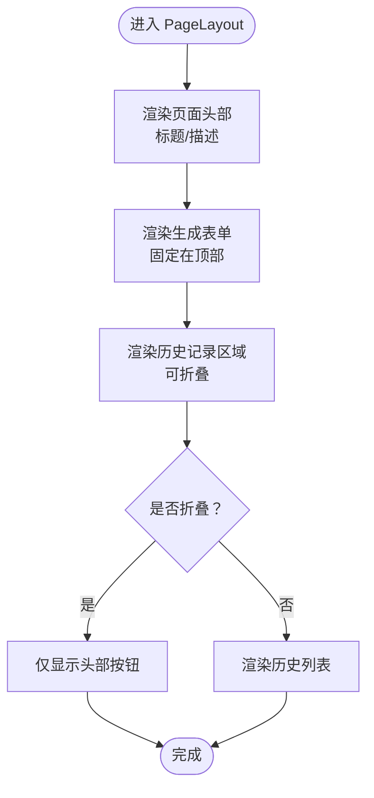
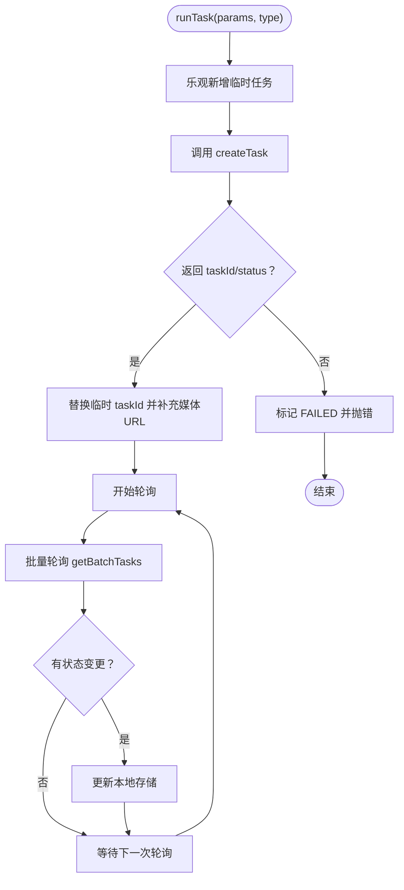
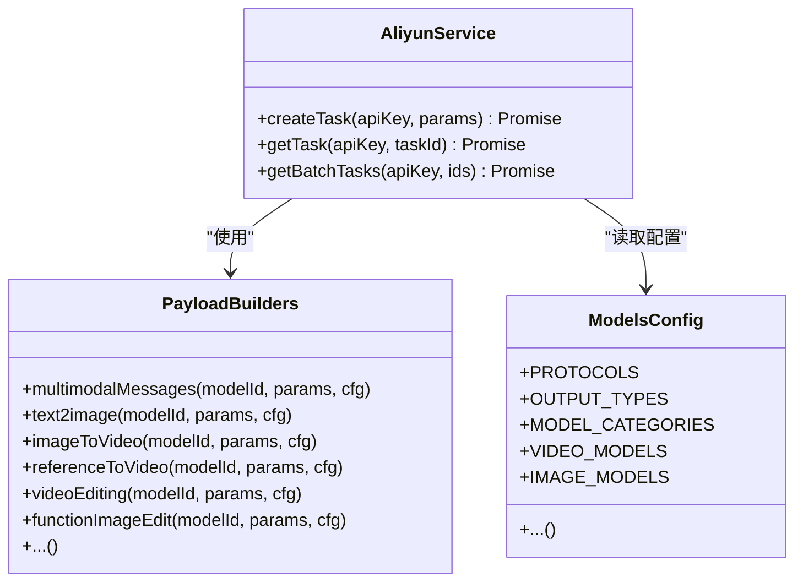
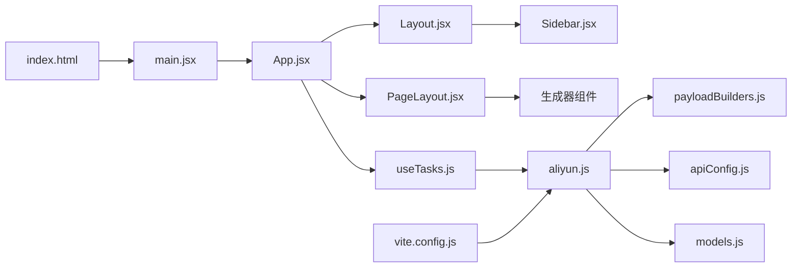

# 整体架构

<cite>
**本文档引用的文件**
- [src/App.jsx](file://src/App.jsx)
- [src/main.jsx](file://src/main.jsx)
- [src/components/Layout.jsx](file://src/components/Layout.jsx)
- [src/components/PageLayout.jsx](file://src/components/PageLayout.jsx)
- [src/components/Sidebar.jsx](file://src/components/Sidebar.jsx)
- [src/hooks/useTasks.js](file://src/hooks/useTasks.js)
- [src/services/aliyun.js](file://src/services/aliyun.js)
- [src/services/payloadBuilders.js](file://src/services/payloadBuilders.js)
- [src/config/models.js](file://src/config/models.js)
- [src/config/apiConfig.js](file://src/config/apiConfig.js)
- [src/utils/fileUpload.js](file://src/utils/fileUpload.js)
- [index.html](file://index.html)
- [vite.config.js](file://vite.config.js)
- [package.json](file://package.json)
</cite>

## 目录
1. [引言](#引言)
2. [项目结构](#项目结构)
3. [核心组件](#核心组件)
4. [架构总览](#架构总览)
5. [详细组件分析](#详细组件分析)
6. [依赖关系分析](#依赖关系分析)
7. [性能考量](#性能考量)
8. [故障排查指南](#故障排查指南)
9. [结论](#结论)

## 引言
本架构文档面向通义万相前端应用，系统性阐述基于 React 的组件化架构设计。应用采用分层结构与模块化组织，围绕“布局-页面-业务组件-服务层”的层次划分，实现从入口点到状态管理、从路由切换到任务编排的完整闭环。重点解析主应用组件 App.jsx 的设计理念、布局系统 Layout.jsx 与 PageLayout.jsx 的职责分工、启动流程与初始化过程，以及可扩展的插件式模型与请求构建体系。

## 项目结构
应用采用典型的 React 单页应用结构，主要目录与职责如下：
- src/main.jsx：应用入口，挂载根组件
- src/App.jsx：主应用容器，负责路由切换、状态管理与内容渲染
- src/components/*：UI 组件库，含布局、导航、页面布局、具体生成器与工具组件
- src/hooks/*：自定义 Hook，封装跨组件共享的状态与副作用
- src/services/*：服务层，封装 API 调用、请求构建与轮询逻辑
- src/config/*：配置常量与模型注册表
- src/utils/*：通用工具函数（文件上传、校验等）
- vite.config.js：开发服务器与代理配置
- index.html：HTML 模板，包含挂载点

**图表来源**
- [index.html](file://index.html#L9-L12)
- [src/main.jsx](file://src/main.jsx#L1-L11)
- [src/App.jsx](file://src/App.jsx#L1-L377)
- [src/components/Layout.jsx](file://src/components/Layout.jsx#L1-L94)
- [src/components/Sidebar.jsx](file://src/components/Sidebar.jsx#L1-L149)
- [src/components/PageLayout.jsx](file://src/components/PageLayout.jsx#L1-L76)
- [src/hooks/useTasks.js](file://src/hooks/useTasks.js#L1-L333)
- [src/services/aliyun.js](file://src/services/aliyun.js#L1-L215)
- [src/services/payloadBuilders.js](file://src/services/payloadBuilders.js#L1-L829)
- [src/config/models.js](file://src/config/models.js#L1-L1012)
- [src/config/apiConfig.js](file://src/config/apiConfig.js#L1-L35)
- [src/utils/fileUpload.js](file://src/utils/fileUpload.js#L1-L182)

**章节来源**
- [index.html](file://index.html#L1-L14)
- [src/main.jsx](file://src/main.jsx#L1-L11)
- [package.json](file://package.json#L1-L33)

## 核心组件
- 主应用容器 App.jsx：集中管理 API Key、活动菜单、任务状态与生成动作；通过条件渲染将不同业务组件注入 PageLayout，形成统一的页面布局与历史记录管理。
- 布局容器 Layout.jsx：负责桌面端/移动端导航、顶部栏与内容区的组织，承载子组件树。
- 页面布局 PageLayout.jsx：固定生成表单在顶部，历史记录可折叠，支持按类型过滤任务。
- 导航 Sidebar.jsx：按功能域分组的导航菜单，自动展开当前分组，支持移动端抽屉。
- 任务 Hook useTasks.js：封装任务生命周期、乐观更新、本地持久化、批量轮询与自适应轮询策略。
- 服务层 aliyun.js：统一创建任务、轮询状态、错误处理与超时控制；配合 payloadBuilders 构建请求体。
- 配置 models.js：模型注册表，定义协议、输出类型、能力集与端点映射。
- 工具 fileUpload.js：文件转 base64、压缩与输入规范化。

**章节来源**
- [src/App.jsx](file://src/App.jsx#L42-L377)
- [src/components/Layout.jsx](file://src/components/Layout.jsx#L5-L94)
- [src/components/PageLayout.jsx](file://src/components/PageLayout.jsx#L9-L76)
- [src/components/Sidebar.jsx](file://src/components/Sidebar.jsx#L10-L149)
- [src/hooks/useTasks.js](file://src/hooks/useTasks.js#L9-L333)
- [src/services/aliyun.js](file://src/services/aliyun.js#L50-L215)
- [src/services/payloadBuilders.js](file://src/services/payloadBuilders.js#L125-L829)
- [src/config/models.js](file://src/config/models.js#L1-L1012)
- [src/utils/fileUpload.js](file://src/utils/fileUpload.js#L6-L182)

## 架构总览
应用采用“容器-展示”分层与“策略模式”解耦：
- 容器层：App.jsx、Layout.jsx、PageLayout.jsx 负责状态聚合、路由与布局
- 展示层：各生成器组件（ImageGenerator、VideoGenerator 等）负责表单与交互
- 服务层：aliyun.js 统一封装 API 调用与轮询；payloadBuilders.js 以策略模式适配不同模型的请求格式
- 配置层：models.js 与 apiConfig.js 提供模型能力与运行时参数
- 工具层：fileUpload.js 处理文件输入与兼容

**图表来源**
- [src/App.jsx](file://src/App.jsx#L1-L377)
- [src/components/Layout.jsx](file://src/components/Layout.jsx#L1-L94)
- [src/components/PageLayout.jsx](file://src/components/PageLayout.jsx#L1-L76)
- [src/components/Sidebar.jsx](file://src/components/Sidebar.jsx#L1-L149)
- [src/services/aliyun.js](file://src/services/aliyun.js#L1-L215)
- [src/services/payloadBuilders.js](file://src/services/payloadBuilders.js#L1-L829)
- [src/config/apiConfig.js](file://src/config/apiConfig.js#L1-L35)
- [src/config/models.js](file://src/config/models.js#L1-L1012)
- [src/utils/fileUpload.js](file://src/utils/fileUpload.js#L1-L182)

## 详细组件分析

### 主应用组件 App.jsx 设计理念
- 状态管理
  - 本地状态：API Key（localStorage 持久化）、设置面板开关、当前活动菜单
  - 全局任务状态：通过 useTasks Hook 管理任务列表、生成中状态与轮询
- 路由切换机制
  - 基于 activeMenu 的 switch 分发，将不同业务组件注入 PageLayout，实现“菜单 ID → 页面内容”的映射
- 组件渲染逻辑
  - renderContent 根据菜单 ID 返回对应 PageLayout 包裹的具体生成器组件
  - 未实现模块统一使用 ComingSoon 占位
- 交互与安全
  - 未配置 API Key 时弹出设置面板，防止空密钥调用
  - 生成动作统一走 runTask/retryTask，保证一致的乐观更新与错误处理

**图表来源**
- [src/App.jsx](file://src/App.jsx#L42-L377)
- [src/components/Sidebar.jsx](file://src/components/Sidebar.jsx#L114-L124)
- [src/components/PageLayout.jsx](file://src/components/PageLayout.jsx#L38-L42)
- [src/hooks/useTasks.js](file://src/hooks/useTasks.js#L256-L332)
- [src/services/aliyun.js](file://src/services/aliyun.js#L50-L160)

**章节来源**
- [src/App.jsx](file://src/App.jsx#L42-L377)

### 布局系统：Layout.jsx 与 PageLayout.jsx
- Layout.jsx 职责
  - 桌面端固定侧边栏，移动端抽屉菜单
  - 顶部栏包含面包屑占位、API Key 状态徽标与设置按钮
  - 内容区滚动容器，承载子组件树
- PageLayout.jsx 职责
  - 页面标题与描述
  - 固定在顶部的生成表单区域（GeneratorComponent）
  - 历史记录区域，支持折叠/展开，按 filterType 过滤任务
  - 使用 useMemo 缓存过滤结果，减少重复计算

**图表来源**
- [src/components/PageLayout.jsx](file://src/components/PageLayout.jsx#L28-L72)

**章节来源**
- [src/components/Layout.jsx](file://src/components/Layout.jsx#L5-L94)
- [src/components/PageLayout.jsx](file://src/components/PageLayout.jsx#L9-L76)

### 任务系统与状态管理：useTasks.js
- 乐观更新：创建任务时插入临时 taskId，立即渲染，随后以真实 taskId 替换并补充媒体 URL
- 本地持久化：任务列表保存至 localStorage，清理 base64 数据以节省空间；容量不足时截断最近 20 条
- 轮询策略：自适应间隔（新任务 1s，前 10 次 2s，之后 5s），批量轮询，仅在状态变化时重置计数
- 状态处理：兼容标准与多模态响应格式，仅在有媒体 URL 时将状态置为成功，避免空结果
- 重试机制：基于 originalParams 重建任务，保持一致性

**图表来源**
- [src/hooks/useTasks.js](file://src/hooks/useTasks.js#L256-L332)
- [src/services/aliyun.js](file://src/services/aliyun.js#L50-L160)

**章节来源**
- [src/hooks/useTasks.js](file://src/hooks/useTasks.js#L9-L333)

### 服务层与请求构建：aliyun.js 与 payloadBuilders.js
- aliyun.js
  - 统一创建任务与轮询接口，内置超时控制与重试策略
  - 根据模型配置决定异步/同步模式，标准化返回结构
  - 对网络错误、超时与未知模型进行分类处理
- payloadBuilders.js
  - 策略模式：按模型协议构造请求体，支持多模态消息、文本/图像输入、函数式编辑、视频生成等
  - 输入规范化：统一提取 prompt、图片 URL、多图数组，构建 content 数组
  - 能力开关：依据模型能力映射（n、watermark、seed、prompt_extend 等）生成 parameters

**图表来源**
- [src/services/aliyun.js](file://src/services/aliyun.js#L50-L215)
- [src/services/payloadBuilders.js](file://src/services/payloadBuilders.js#L125-L829)
- [src/config/models.js](file://src/config/models.js#L1-L1012)

**章节来源**
- [src/services/aliyun.js](file://src/services/aliyun.js#L1-L215)
- [src/services/payloadBuilders.js](file://src/services/payloadBuilders.js#L1-L829)
- [src/config/models.js](file://src/config/models.js#L1-L1012)

### 文件处理工具：fileUpload.js
- 支持 URL、base64、File 三种输入形式，统一归一化
- 图片压缩：超过阈值自动压缩，降低 base64 字符串大小
- 校验与错误提示：类型、大小、URL 格式校验

**章节来源**
- [src/utils/fileUpload.js](file://src/utils/fileUpload.js#L6-L182)

## 依赖关系分析
- 组件依赖
  - App.jsx 依赖 Layout、PageLayout、各生成器组件与 useTasks Hook
  - Layout.jsx 依赖 Sidebar 与 PageLayout
  - PageLayout.jsx 依赖 HistoryGallery 与具体生成器组件
- 服务依赖
  - useTasks.js 依赖 aliyun.js、models.js、apiConfig.js
  - aliyun.js 依赖 payloadBuilders.js 与 models.js
- 开发依赖
  - Vite 代理到 DashScope API，端口 3000，路径重写

**图表来源**
- [src/App.jsx](file://src/App.jsx#L1-L377)
- [src/components/Layout.jsx](file://src/components/Layout.jsx#L1-L94)
- [src/components/PageLayout.jsx](file://src/components/PageLayout.jsx#L1-L76)
- [src/hooks/useTasks.js](file://src/hooks/useTasks.js#L1-L333)
- [src/services/aliyun.js](file://src/services/aliyun.js#L1-L215)
- [src/services/payloadBuilders.js](file://src/services/payloadBuilders.js#L1-L829)
- [src/config/apiConfig.js](file://src/config/apiConfig.js#L1-L35)
- [src/config/models.js](file://src/config/models.js#L1-L1012)
- [src/main.jsx](file://src/main.jsx#L1-L11)
- [index.html](file://index.html#L9-L12)
- [vite.config.js](file://vite.config.js#L13-L20)

**章节来源**
- [vite.config.js](file://vite.config.js#L1-L23)
- [package.json](file://package.json#L12-L31)

## 性能考量
- 渲染优化
  - PageLayout 使用 useMemo 过滤任务，避免每次渲染都重新计算
  - 生成器组件固定在顶部，减少滚动抖动
- 状态与存储
  - 本地持久化时移除 base64 数据，降低存储占用；容量不足时截断
  - 乐观更新减少等待时间，提升用户体验
- 轮询策略
  - 自适应间隔：新任务高频轮询，稳定任务低频轮询，平衡实时性与资源消耗
  - 批量轮询：并发查询多个任务，减少等待时间
- 网络与超时
  - 请求与轮询均设置超时，避免长时间阻塞
  - 重试策略针对网络错误与超时进行指数退避

[本节为通用指导，无需特定文件来源]

## 故障排查指南
- API Key 未配置
  - 现象：顶部 Key 徽标闪烁，点击设置弹窗
  - 处理：在设置面板保存有效 API Key，刷新页面
- 任务长时间 RUNNING
  - 现象：历史记录状态未更新
  - 处理：检查网络连通性；确认模型支持异步；查看浏览器控制台轮询日志
- 轮询超时或网络错误
  - 现象：API 错误提示
  - 处理：检查代理配置与 DashScope 可达性；确认请求格式与模型能力匹配
- 生成结果为空
  - 现象：状态变更为成功但无媒体 URL
  - 处理：等待媒体生成完成；确认模型输出类型与参数正确

**章节来源**
- [src/services/aliyun.js](file://src/services/aliyun.js#L146-L201)
- [src/hooks/useTasks.js](file://src/hooks/useTasks.js#L164-L246)

## 结论
该架构以 App.jsx 为核心容器，通过 Layout.jsx 与 PageLayout.jsx 提供一致的布局与历史管理体验；useTasks.js 将任务生命周期抽象为可复用的 Hook，配合 aliyun.js 与 payloadBuilders.js 实现对多模型、多协议的统一接入。整体设计具备良好的可扩展性：新增模型只需在 models.js 中注册并在 payloadBuilders.js 中扩展相应构建器；新增页面仅需在 App.jsx 的菜单与路由分支中添加映射。建议后续进一步拆分生成器组件为更细粒度的功能模块，以提升可维护性与测试覆盖。