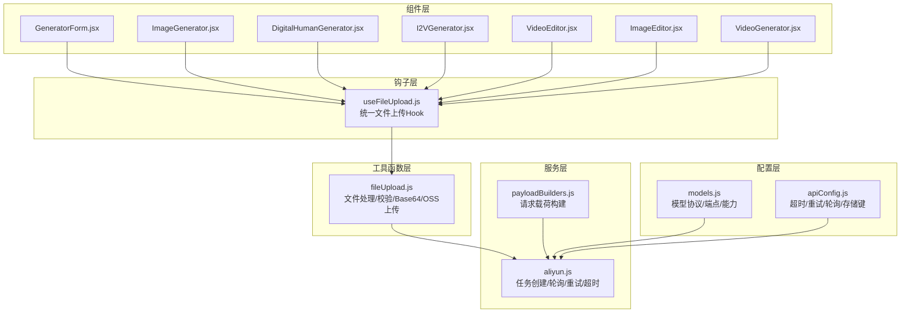
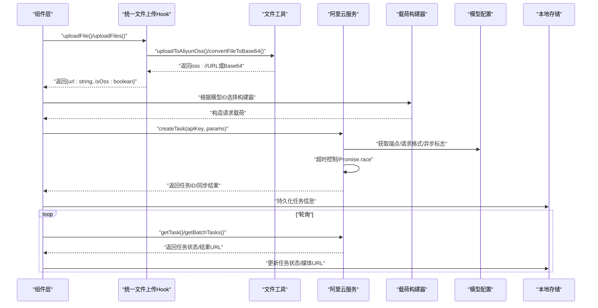
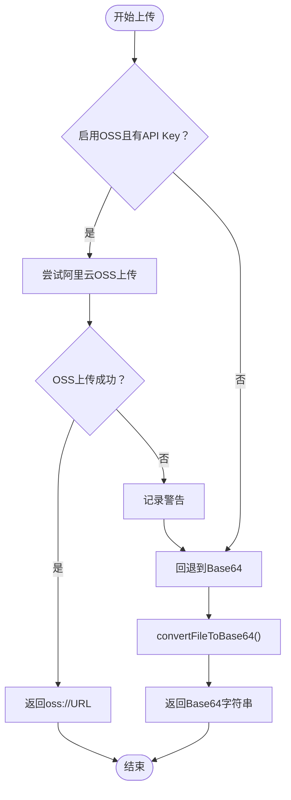
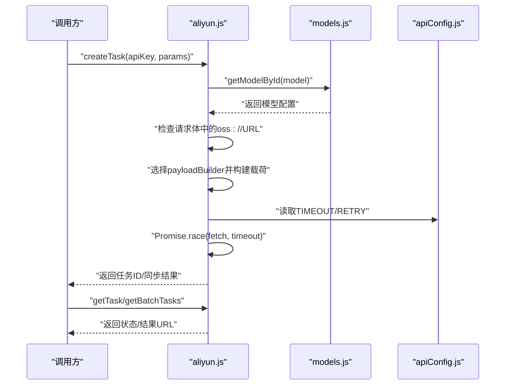
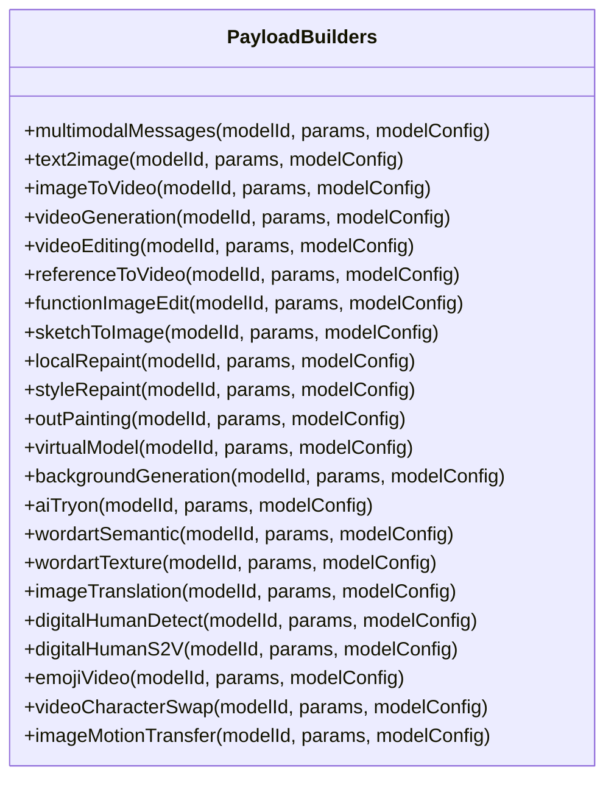
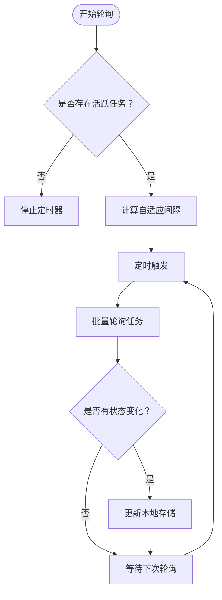
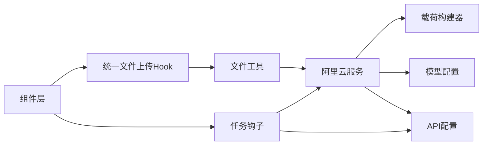

# 工具函数服务

<cite>
**本文档引用的文件**
- [src/utils/fileUpload.js](file://src/utils/fileUpload.js)
- [src/hooks/useFileUpload.js](file://src/hooks/useFileUpload.js)
- [src/services/aliyun.js](file://src/services/aliyun.js)
- [src/services/payloadBuilders.js](file://src/services/payloadBuilders.js)
- [src/config/apiConfig.js](file://src/config/apiConfig.js)
- [src/config/models.js](file://src/config/models.js)
- [src/hooks/useTasks.js](file://src/hooks/useTasks.js)
- [src/components/GeneratorForm.jsx](file://src/components/GeneratorForm.jsx)
- [src/components/ImageGenerator.jsx](file://src/components/ImageGenerator.jsx)
- [src/components/DigitalHumanGenerator.jsx](file://src/components/DigitalHumanGenerator.jsx)
- [src/components/I2VGenerator.jsx](file://src/components/I2VGenerator.jsx)
- [src/components/VideoEditor.jsx](file://src/components/VideoEditor.jsx)
- [src/components/ImageEditor.jsx](file://src/components/ImageEditor.jsx)
- [src/components/VideoGenerator.jsx](file://src/components/VideoGenerator.jsx)
</cite>

## 目录
1. [简介](#简介)
2. [项目结构](#项目结构)
3. [核心组件](#核心组件)
4. [架构概览](#架构概览)
5. [详细组件分析](#详细组件分析)
6. [依赖关系分析](#依赖关系分析)
7. [性能考量](#性能考量)
8. [故障排查指南](#故障排查指南)
9. [结论](#结论)
10. [附录](#附录)

## 简介
本文件面向"工具函数服务"，聚焦于文件上传工具的实现与集成，涵盖多媒体文件处理、Base64 编码转换、上传进度监控、文件类型检测、大小限制与格式验证机制，并解释与阿里云 API 的集成方式（包括任务创建、轮询状态、错误恢复策略）。同时提供最佳实践指南（性能优化、用户体验改进、安全考虑），并分析工具函数的可扩展性设计与未来扩展点。

**更新** 新增了标准化的文件上传基础设施，包括 useFileUpload 钩子和 fileUpload 工具函数，支持阿里云 OSS 临时存储和回退机制。

## 项目结构
该工程采用前端单页应用架构，围绕"生成器组件 + 工具函数 + 服务层 + 配置层"的分层组织：
- 工具函数层：负责文件上传、Base64 处理、类型与大小校验等
- 钩子层：提供统一的文件上传 Hook，支持 OSS 优先和回退机制
- 服务层：封装阿里云 API 调用、任务创建与轮询、重试与超时控制
- 配置层：统一管理 API 基础地址、超时、重试、轮询策略与模型配置
- 组件层：各生成器组件负责收集用户输入并调用工具函数与服务层



**图表来源**
- [src/hooks/useFileUpload.js](file://src/hooks/useFileUpload.js#L1-L125)
- [src/utils/fileUpload.js](file://src/utils/fileUpload.js#L1-L304)
- [src/components/VideoGenerator.jsx](file://src/components/VideoGenerator.jsx#L1-L200)

**章节来源**
- [src/utils/fileUpload.js](file://src/utils/fileUpload.js#L1-L304)
- [src/hooks/useFileUpload.js](file://src/hooks/useFileUpload.js#L1-L125)
- [src/services/aliyun.js](file://src/services/aliyun.js#L1-L241)
- [src/services/payloadBuilders.js](file://src/services/payloadBuilders.js#L1-L200)
- [src/config/apiConfig.js](file://src/config/apiConfig.js#L1-L35)
- [src/config/models.js](file://src/config/models.js#L1-L200)

## 核心组件
- 文件上传工具：提供统一的文件处理入口，支持 URL、Base64、File 对象三种输入；内置类型与大小校验；对大图片进行压缩后再转 Base64；提供通用的文件上传处理流程。
- **统一文件上传 Hook**：提供标准化的文件上传接口，优先使用阿里云 OSS 临时存储，失败时自动回退到 Base64 编码；支持批量上传和错误状态管理。
- 阿里云服务：封装任务创建、轮询、批量轮询、重试与超时控制；根据模型配置动态选择请求格式与端点；标准化异步/同步任务结果。
- 载荷构建器：采用策略模式，针对不同模型协议构建请求载荷，支持多模态消息、文生图、图生视频、视频编辑等格式。
- 配置中心：集中管理 API 基础地址、超时、重试、轮询间隔与本地存储键名。
- 任务钩子：提供任务生命周期管理（创建、轮询、更新、删除、重试），并持久化到本地存储，支持自适应轮询策略。

**章节来源**
- [src/utils/fileUpload.js](file://src/utils/fileUpload.js#L6-L304)
- [src/hooks/useFileUpload.js](file://src/hooks/useFileUpload.js#L4-L125)
- [src/services/aliyun.js](file://src/services/aliyun.js#L50-L241)
- [src/services/payloadBuilders.js](file://src/services/payloadBuilders.js#L125-L200)
- [src/config/apiConfig.js](file://src/config/apiConfig.js#L6-L35)
- [src/hooks/useTasks.js](file://src/hooks/useTasks.js#L9-L333)

## 架构概览
整体流程从组件层收集用户输入，经由钩子层进行统一文件上传处理，再通过工具函数层进行 OSS 或 Base64 上传，最终通过服务层调用阿里云 API，最后由任务钩子进行状态轮询与持久化。



**图表来源**
- [src/hooks/useFileUpload.js](file://src/hooks/useFileUpload.js#L25-L87)
- [src/utils/fileUpload.js](file://src/utils/fileUpload.js#L280-L294)
- [src/services/payloadBuilders.js](file://src/services/payloadBuilders.js#L125-L150)
- [src/services/aliyun.js](file://src/services/aliyun.js#L50-L160)
- [src/config/models.js](file://src/config/models.js#L1-L100)
- [src/hooks/useTasks.js](file://src/hooks/useTasks.js#L164-L246)

## 详细组件分析

### 统一文件上传 Hook（useFileUpload.js）
- 功能要点
  - **OSS 优先策略**：优先使用阿里云 OSS 临时存储，支持大文件上传和更好的性能
  - **自动回退机制**：OSS 上传失败时自动回退到 Base64 编码，确保上传可靠性
  - **批量上传支持**：提供 uploadFiles 方法支持多文件并发上传
  - **状态管理**：内置 uploading 和 error 状态，提供 clearError 方法
  - **灵活配置**：支持覆盖默认的 apiKey、modelName 和 useOss 参数
- 数据流与复杂度
  - OSS 上传涉及网络请求和错误处理，时间复杂度主要取决于文件大小和网络状况
  - Base64 转换为 O(n)，n 为文件大小
- 错误处理
  - OSS 上传失败时记录警告并自动回退
  - 支持 requireUrl 选项，强制返回 URL 格式而不回退
  - 提供详细的错误信息和状态管理



**图表来源**
- [src/hooks/useFileUpload.js](file://src/hooks/useFileUpload.js#L25-L56)

**章节来源**
- [src/hooks/useFileUpload.js](file://src/hooks/useFileUpload.js#L1-L125)

### 文件上传工具（fileUpload.js）
- 功能要点
  - 统一输入处理：支持字符串（URL/Base64）、File 对象、组件传入的 {type, value} 结构
  - 类型与大小校验：按接受类型列表与最大大小进行验证
  - Base64 转换：使用 FileReader 将文件转为 data URL
  - 图片压缩：对超过阈值的大图进行缩放与压缩，降低 Base64 字符串长度
  - URL/格式校验：URL 协议校验、Base64 前缀判断
  - **阿里云 OSS 上传**：获取上传凭证、检查文件大小限制、上传到 OSS 并返回 oss:// URL
- 数据流与复杂度
  - 压缩算法涉及 Canvas 绘制与 Blob 转换，时间复杂度与图像尺寸近似线性；空间复杂度受压缩质量与尺寸影响
  - 校验与转换均为 O(n)，n 为文件大小
  - OSS 上传涉及网络请求，时间复杂度取决于文件大小和网络状况
- 错误处理
  - 文件读取失败、图片加载失败、Canvas 转换失败、URL 格式非法等均抛出明确错误
  - OSS 上传失败时抛出详细错误信息
- 与组件集成
  - 组件通过 uploadFileSimple 简化函数或 useFileUpload Hook 进行文件上传

```mermaid
flowchart TD
Start(["开始"]) --> InputType{"输入类型？"}
InputType --> |字符串| CheckStr["校验URL/Base64格式"]
CheckStr --> |有效| ReturnStr["返回原值"]
CheckStr --> |无效| ThrowErr["抛出格式错误"]
InputType --> |File对象| Convert["FileReader转Base64"]
Convert --> ConvertOK{"转换成功？"}
ConvertOK --> |是| ReturnB64["返回Base64"]
ConvertOK --> |否| ThrowErr
InputType --> |对象{type,value}| ObjType{"type=url/file?"}
ObjType --> |url| UrlTrim["去除空白并校验URL"]
UrlTrim --> |有效| ReturnUrl["返回URL"]
UrlTrim --> |无效| ThrowErr
ObjType --> |file| ReturnB64
ReturnStr --> End(["结束"])
ReturnB64 --> End
ReturnUrl --> End
ThrowErr --> End
```

**图表来源**
- [src/utils/fileUpload.js](file://src/utils/fileUpload.js#L138-L168)

**章节来源**
- [src/utils/fileUpload.js](file://src/utils/fileUpload.js#L1-L304)

### 阿里云服务（aliyun.js）
- 功能要点
  - 任务创建：根据模型配置选择端点与请求格式，构建载荷并通过 fetch 发送请求；支持超时控制与错误标准化
  - 轮询与批量轮询：提供 getTask 与 getBatchTasks，支持异步/同步任务结果解析
  - 重试策略：对网络错误与超时进行指数退避重试，对特定业务错误不重试
  - 头部与异步标志：根据模型配置设置异步头，区分同步/异步输出结构
  - **OSS URL 处理**：自动检测请求体中的 oss:// URL 并设置 X-DashScope-OssResourceResolve 头
- 错误处理
  - 超时、网络错误、未知模型、请求格式错误等均有明确分支处理
  - 同步任务需满足 choices/results 结构，否则抛错
- 与配置层协作
  - 通过 models.js 获取端点、请求格式、异步标志与输出类型
  - 通过 apiConfig.js 获取超时、重试与轮询参数



**图表来源**
- [src/services/aliyun.js](file://src/services/aliyun.js#L70-L186)
- [src/config/models.js](file://src/config/models.js#L1-L100)
- [src/config/apiConfig.js](file://src/config/apiConfig.js#L9-L27)

**章节来源**
- [src/services/aliyun.js](file://src/services/aliyun.js#L1-L241)
- [src/config/models.js](file://src/config/models.js#L1-L200)
- [src/config/apiConfig.js](file://src/config/apiConfig.js#L1-L35)

### 载荷构建器（payloadBuilders.js）
- 设计模式
  - 策略模式：每种请求格式对应一个构建器，新增模型只需在配置中声明，无需改动核心逻辑
- 关键能力
  - 文本抽取、图像抽取、多模态内容组装、参数构建（尺寸、数量、负向提示词、水印、种子、时长等）
  - 针对不同模型族（如 qwen-image-edit、wan2.6-image、videoGeneration 等）定制化处理
- 可扩展性
  - 通过模型配置中的 requestFormat 字段与 payloadBuilders 映射，轻松扩展新格式



**图表来源**
- [src/services/payloadBuilders.js](file://src/services/payloadBuilders.js#L125-L800)

**章节来源**
- [src/services/payloadBuilders.js](file://src/services/payloadBuilders.js#L1-L829)

### 任务钩子（useTasks.js）
- 功能要点
  - 乐观创建临时任务，随后用真实任务ID替换；支持同步/异步结果回填
  - 自适应轮询：根据任务年龄与轮询次数动态调整轮询间隔，兼顾实时性与资源消耗
  - 批量轮询：并发查询多个任务状态，减少等待时间
  - 本地持久化：清理 Base64 数据以节省存储空间，处理配额超限
  - 重试机制：保留原始参数，支持一键重试
- 用户体验
  - 通过状态变化与媒体 URL 回填，及时反馈生成进度与结果
  - 对 SUCCEEDED 状态进行二次校验，确保媒体 URL 存在后再标记完成



**图表来源**
- [src/hooks/useTasks.js](file://src/hooks/useTasks.js#L107-L161)
- [src/hooks/useTasks.js](file://src/hooks/useTasks.js#L164-L246)

**章节来源**
- [src/hooks/useTasks.js](file://src/hooks/useTasks.js#L1-L333)

### 组件层集成示例
- 生成器表单（GeneratorForm.jsx）：负责收集提示词、模型与分辨率等参数，提交给服务层
- 图像生成器（ImageGenerator.jsx）：支持多模型、多参数（尺寸、数量、负向提示词、种子、风格等）
- 数字人生成器（DigitalHumanGenerator.jsx）：支持图片与音频输入，统一走 processFileInput 流程
- I2V 生成器（I2VGenerator.jsx）：处理图片与可选音频，转 Base64 后提交
- **视频生成器（VideoGenerator.jsx）**：使用 uploadFileSimple 函数处理音频文件上传，强制返回 URL 格式
- 视频编辑（VideoEditor.jsx）与图像编辑（ImageEditor.jsx）：提供文件选择与预览，统一转 Base64

**章节来源**
- [src/components/GeneratorForm.jsx](file://src/components/GeneratorForm.jsx#L1-L200)
- [src/components/ImageGenerator.jsx](file://src/components/ImageGenerator.jsx#L1-L249)
- [src/components/DigitalHumanGenerator.jsx](file://src/components/DigitalHumanGenerator.jsx#L1-L100)
- [src/components/I2VGenerator.jsx](file://src/components/I2VGenerator.jsx#L1-L150)
- [src/components/VideoEditor.jsx](file://src/components/VideoEditor.jsx#L1-L100)
- [src/components/ImageEditor.jsx](file://src/components/ImageEditor.jsx#L300-L350)
- [src/components/VideoGenerator.jsx](file://src/components/VideoGenerator.jsx#L1-L200)

## 依赖关系分析
- 组件层依赖钩子层（useFileUpload），通过 Hook 进行统一文件上传
- 钩子层依赖工具函数层（uploadToAliyunOss/convertFileToBase64）
- 工具函数层依赖配置层（apiConfig.js）
- 服务层依赖配置层（models.js 与 apiConfig.js）
- 服务层内部依赖载荷构建器（payloadBuilders.js）
- 任务钩子依赖服务层与配置层，负责状态管理与持久化



**图表来源**
- [src/hooks/useFileUpload.js](file://src/hooks/useFileUpload.js#L1-L125)
- [src/utils/fileUpload.js](file://src/utils/fileUpload.js#L1-L304)
- [src/services/aliyun.js](file://src/services/aliyun.js#L1-L241)
- [src/services/payloadBuilders.js](file://src/services/payloadBuilders.js#L1-L200)
- [src/config/models.js](file://src/config/models.js#L1-L200)
- [src/config/apiConfig.js](file://src/config/apiConfig.js#L1-L35)
- [src/hooks/useTasks.js](file://src/hooks/useTasks.js#L1-L333)

**章节来源**
- [src/hooks/useFileUpload.js](file://src/hooks/useFileUpload.js#L1-L125)
- [src/utils/fileUpload.js](file://src/utils/fileUpload.js#L1-L304)
- [src/services/aliyun.js](file://src/services/aliyun.js#L1-L241)
- [src/services/payloadBuilders.js](file://src/services/payloadBuilders.js#L1-L200)
- [src/config/models.js](file://src/config/models.js#L1-L200)
- [src/config/apiConfig.js](file://src/config/apiConfig.js#L1-L35)
- [src/hooks/useTasks.js](file://src/hooks/useTasks.js#L1-L333)

## 性能考量
- 文件处理
  - 大图压缩：在转 Base64 前进行缩放与压缩，显著降低传输体积与内存占用
  - Base64 体积控制：通过阈值与缓冲区预留，避免超出浏览器限制
  - **OSS 上传优势**：优先使用阿里云 OSS 临时存储，支持大文件上传和更好的网络性能
- 网络与轮询
  - 超时控制：请求与轮询分别设置超时，防止长时间挂起
  - 自适应轮询：新任务与前几次轮询采用更短间隔，提高响应速度；长时间任务逐步延长间隔，降低资源消耗
  - 批量轮询：并发查询多个任务，缩短等待时间
- 存储优化
  - 本地持久化时移除 Base64 数据，仅保留必要字段；配额不足时截断最近任务
- 可扩展性
  - 载荷构建器采用策略模式，新增模型仅需扩展配置与构建器，不侵入核心逻辑
  - **统一上传接口**：useFileUpload Hook 提供标准化的上传流程，便于维护和扩展

## 故障排查指南
- 常见错误与定位
  - 未知模型/请求格式：检查模型配置与 requestFormat 是否匹配
  - URL/格式非法：确认 URL 协议与 Base64 前缀
  - 文件过大：触发压缩流程；若仍超限，建议用户选择更小分辨率或更少输出数量
  - **OSS 上传失败**：检查 API Key、模型名称和文件大小限制；查看控制台警告信息
  - 网络错误/超时：查看重试日志与超时设置；检查代理与跨域配置
  - 同步任务响应异常：确认 choices/results 结构是否满足预期
- 日志与调试
  - 开发环境会输出请求与错误详情，便于定位问题
  - 轮询返回数据包含完整 output 结构，可用于诊断
  - **OSS 上传日志**：控制台会显示 OSS 上传成功或回退到 Base64 的详细信息
- 用户提示
  - 组件层对格式错误与类型不符给出明确提示，提升可用性

**章节来源**
- [src/services/aliyun.js](file://src/services/aliyun.js#L146-L159)
- [src/utils/fileUpload.js](file://src/utils/fileUpload.js#L114-L144)
- [src/hooks/useTasks.js](file://src/hooks/useTasks.js#L179-L233)
- [src/hooks/useFileUpload.js](file://src/hooks/useFileUpload.js#L35-L56)

## 结论
该工具函数服务通过"统一文件上传 Hook + 文件工具 + 阿里云服务 + 载荷构建器 + 配置中心 + 任务钩子"的分层设计，实现了从文件处理到任务执行与状态管理的完整闭环。新增的 useFileUpload Hook 标准化了文件上传流程，优先使用阿里云 OSS 临时存储并提供自动回退机制，显著提升了系统的可靠性和性能表现。其策略化的载荷构建器与自适应轮询机制具备良好的可扩展性与性能表现；同时通过严格的类型与大小校验、超时与重试控制，提升了系统的鲁棒性与用户体验。

## 附录

### 最佳实践指南
- 性能优化
  - 优先使用 OSS 上传，特别是对于大文件和视频文件
  - 优先压缩大图，合理设置分辨率与输出数量
  - 使用自适应轮询，避免频繁轮询造成资源浪费
  - 批量轮询多个任务，减少等待时间
- 用户体验
  - 在组件层提供直观的上传状态反馈和错误提示
  - 对同步任务进行媒体 URL 校验后再标记完成，避免空结果
  - 本地持久化时清理敏感数据，保护隐私
  - **上传进度监控**：考虑在 future 版本中实现上传进度跟踪功能
- 安全考虑
  - 严格校验 URL 与 Base64 格式，避免恶意输入
  - 控制文件大小与类型，防止资源滥用
  - 对 API Key 进行最小权限管理与安全存储
  - **OSS 上传限制**：注意文件有效期（48小时）和限流（100 QPS）

### 可扩展性设计与未来扩展点
- 模型扩展
  - 新增模型仅需在配置中声明端点、请求格式与能力集，配合相应构建器即可
- 功能扩展
  - **上传进度监控**：基于 XMLHttpRequest 的 progress 事件实现上传进度跟踪
  - 支持更多文件类型（如 PDF、3D 模型）与格式转换
  - 增加分块上传与断点续传（当前实现为一次性 Base64 传输）
  - **多阶段上传**：实现分块上传并在 OSS 上合并
- 集成增强
  - 与 CDN/对象存储对接，减少直传 Base64 的带宽压力
  - 增加缓存策略与离线模式，提升弱网场景体验
  - **CDN 集成**：在 OSS 成功后自动将文件复制到 CDN 加速节点