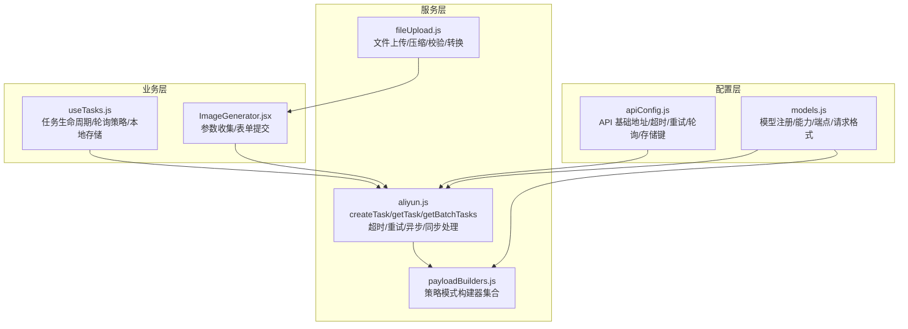
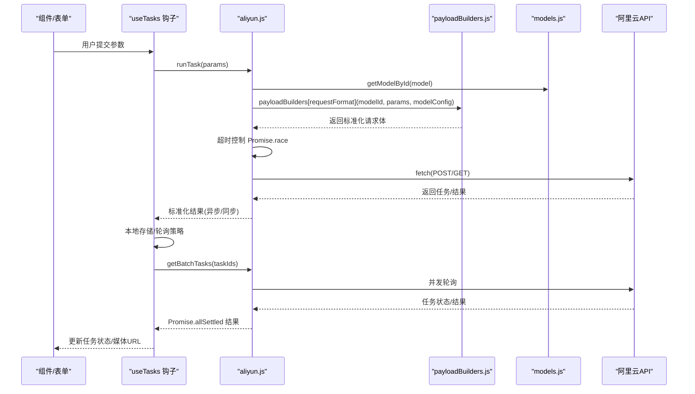
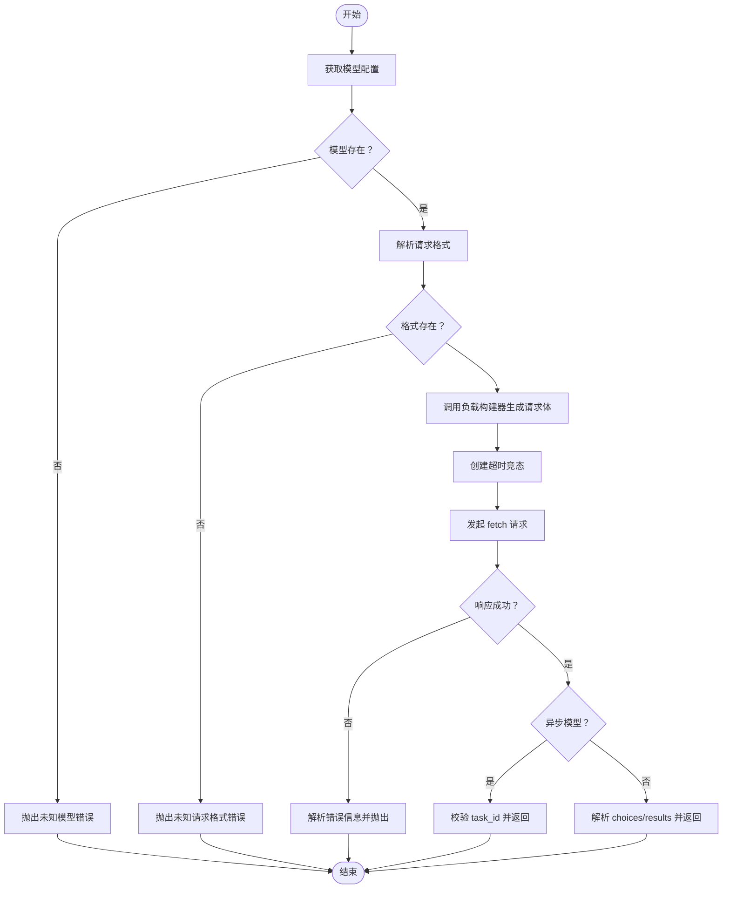
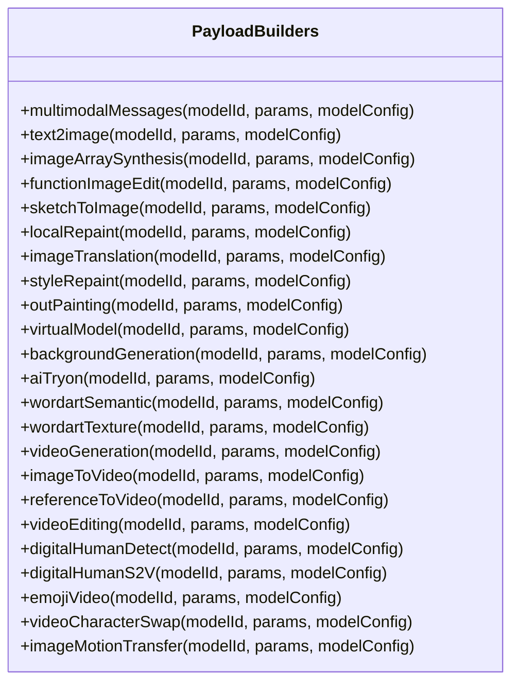
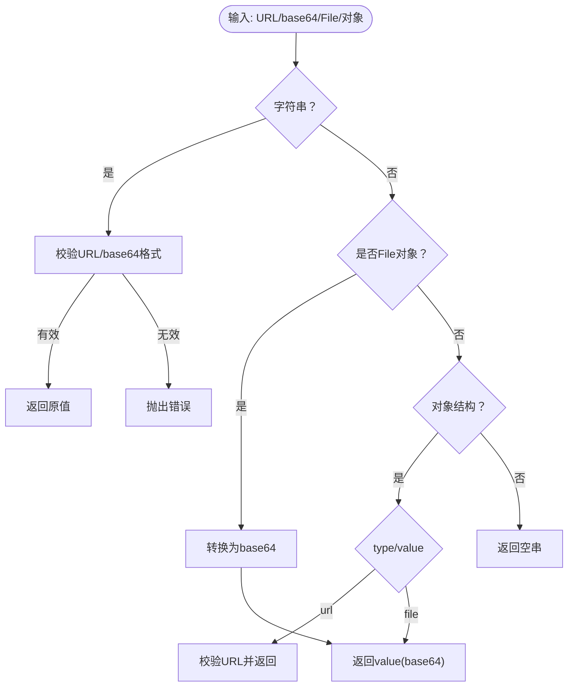
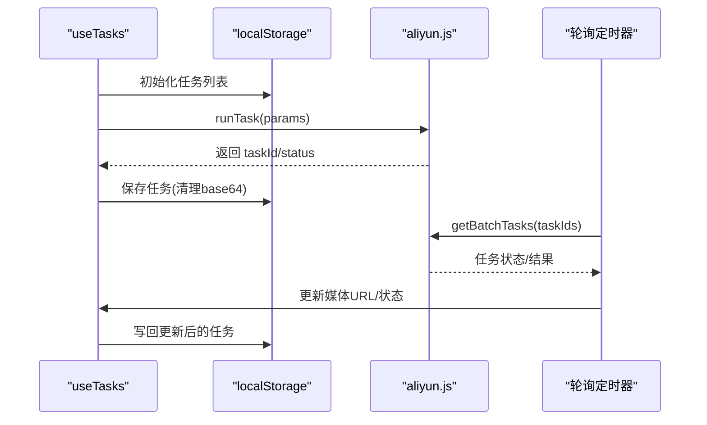
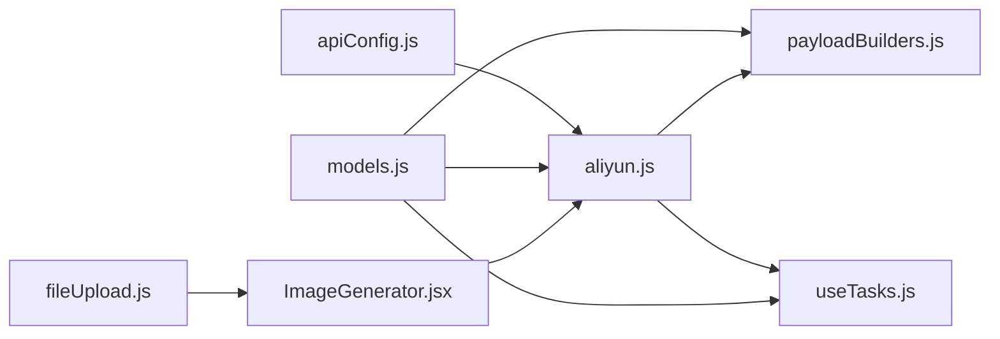

# 服务层架构

<cite>
**本文档引用的文件**
- [src/services/aliyun.js](file://src/services/aliyun.js)
- [src/services/payloadBuilders.js](file://src/services/payloadBuilders.js)
- [src/utils/fileUpload.js](file://src/utils/fileUpload.js)
- [src/config/apiConfig.js](file://src/config/apiConfig.js)
- [src/config/models.js](file://src/config/models.js)
- [src/hooks/useTasks.js](file://src/hooks/useTasks.js)
- [src/components/ImageGenerator.jsx](file://src/components/ImageGenerator.jsx)
</cite>

## 目录
1. [简介](#简介)
2. [项目结构](#项目结构)
3. [核心组件](#核心组件)
4. [架构总览](#架构总览)
5. [详细组件分析](#详细组件分析)
6. [依赖关系分析](#依赖关系分析)
7. [性能考虑](#性能考虑)
8. [故障排查指南](#故障排查指南)
9. [结论](#结论)

## 简介
本文件面向通义万相前端应用的服务层，系统性阐述服务层的设计原则与抽象机制，覆盖以下方面：
- API 调用封装、请求格式化与响应处理
- 阿里云服务集成：认证机制、超时控制、重试策略
- 负载构建器架构：模型类型参数适配与请求标准化
- 工具函数服务化：文件上传、数据转换与通用功能封装
- 服务层依赖关系与调用流程：服务间协作与扩展机制

## 项目结构
服务层主要由以下模块构成：
- 配置层：API 基础地址、超时与重试、轮询策略、存储键名
- 模型注册层：模型能力、协议、端点、请求格式映射
- 服务层：统一任务创建、状态轮询、批量轮询与重试
- 负载构建器：策略模式的请求体构造器集合
- 工具层：文件上传、数据校验与转换
- 业务钩子：任务生命周期管理与轮询策略

图表来源
- [src/config/apiConfig.js](file://src/config/apiConfig.js#L1-L35)
- [src/config/models.js](file://src/config/models.js#L1-L120)
- [src/services/aliyun.js](file://src/services/aliyun.js#L1-L215)
- [src/services/payloadBuilders.js](file://src/services/payloadBuilders.js#L1-L120)
- [src/utils/fileUpload.js](file://src/utils/fileUpload.js#L1-L182)
- [src/hooks/useTasks.js](file://src/hooks/useTasks.js#L1-L333)
- [src/components/ImageGenerator.jsx](file://src/components/ImageGenerator.jsx#L1-L249)

章节来源
- [src/config/apiConfig.js](file://src/config/apiConfig.js#L1-L35)
- [src/config/models.js](file://src/config/models.js#L1-L120)
- [src/services/aliyun.js](file://src/services/aliyun.js#L1-L215)
- [src/services/payloadBuilders.js](file://src/services/payloadBuilders.js#L1-L120)
- [src/utils/fileUpload.js](file://src/utils/fileUpload.js#L1-L182)
- [src/hooks/useTasks.js](file://src/hooks/useTasks.js#L1-L333)
- [src/components/ImageGenerator.jsx](file://src/components/ImageGenerator.jsx#L1-L249)

## 核心组件
- 统一任务创建与轮询：封装阿里云 API 的创建、轮询与批量轮询，统一异步/同步响应格式
- 负载构建器：策略模式按模型类型构造请求体，屏蔽不同模型的差异
- 文件工具：前端直传临时服务器的文件处理、压缩与校验
- 配置中心：API 基础地址、超时、重试、轮询策略与存储键
- 模型注册：模型能力、协议、端点与请求格式映射

章节来源
- [src/services/aliyun.js](file://src/services/aliyun.js#L50-L215)
- [src/services/payloadBuilders.js](file://src/services/payloadBuilders.js#L1-L829)
- [src/utils/fileUpload.js](file://src/utils/fileUpload.js#L1-L182)
- [src/config/apiConfig.js](file://src/config/apiConfig.js#L1-L35)
- [src/config/models.js](file://src/config/models.js#L1-L120)

## 架构总览
服务层采用“配置驱动 + 策略模式”的设计，通过模型注册与负载构建器实现“新增模型无需改动核心逻辑”，并通过统一的 API 封装与轮询策略实现稳定的用户体验。

图表来源
- [src/hooks/useTasks.js](file://src/hooks/useTasks.js#L256-L332)
- [src/services/aliyun.js](file://src/services/aliyun.js#L50-L215)
- [src/services/payloadBuilders.js](file://src/services/payloadBuilders.js#L1-L829)
- [src/config/models.js](file://src/config/models.js#L1011-L1012)

## 详细组件分析

### 组件A：阿里云服务封装（aliyun.js）
职责与特性：
- 认证：统一在请求头注入 Bearer Token
- 异步/同步：根据模型配置决定是否启用异步与同步响应标准化
- 超时控制：请求与轮询分别设置超时，竞态 Promise 控制
- 重试策略：指数退避重试，过滤特定错误类型
- 错误处理：区分网络错误、超时、API 错误与模型/格式未知错误

图表来源
- [src/services/aliyun.js](file://src/services/aliyun.js#L50-L160)

章节来源
- [src/services/aliyun.js](file://src/services/aliyun.js#L1-L215)

### 组件B：负载构建器（payloadBuilders.js）
设计原则：
- 策略模式：每个模型类型对应一个构建器，集中处理参数适配与请求标准化
- 参数适配：根据模型能力（capabilities）动态拼装参数，避免无效字段
- 输入兼容：支持多种输入形式（URL、base64、消息数组），统一抽取提示词与图片
- 模型特例：针对特定模型（如 wan2.6-image 文本-only 模式）做特殊处理

图表来源
- [src/services/payloadBuilders.js](file://src/services/payloadBuilders.js#L1-L829)

章节来源
- [src/services/payloadBuilders.js](file://src/services/payloadBuilders.js#L1-L829)

### 组件C：文件上传与数据转换（fileUpload.js）
功能要点：
- 前端直传临时服务器：将文件转换为 base64，必要时先压缩
- 输入处理：支持 URL、base64、File 对象与组件输入结构
- 校验：URL 格式、base64 格式、文件类型与大小
- 上传钩子：表单事件处理与验证

图表来源
- [src/utils/fileUpload.js](file://src/utils/fileUpload.js#L114-L144)

章节来源
- [src/utils/fileUpload.js](file://src/utils/fileUpload.js#L1-L182)

### 组件D：任务生命周期与轮询策略（useTasks.js）
职责与特性：
- 乐观添加：创建任务前插入临时 taskId，提升交互体验
- 本地存储：持久化任务列表，清理 base64 数据以节省空间
- 自适应轮询：根据任务年龄与轮询次数动态调整轮询间隔
- 批量轮询：并发查询多个任务状态，使用 Promise.allSettled 处理部分失败
- 状态更新：仅在媒体 URL 或状态发生实质性变化时更新

图表来源
- [src/hooks/useTasks.js](file://src/hooks/useTasks.js#L1-L333)
- [src/services/aliyun.js](file://src/services/aliyun.js#L170-L215)

章节来源
- [src/hooks/useTasks.js](file://src/hooks/useTasks.js#L1-L333)

### 组件E：配置中心（apiConfig.js 与 models.js）
- apiConfig.js：统一管理 API 基础地址、请求/轮询超时、重试参数、轮询间隔与存储键
- models.js：集中定义模型能力、协议、端点、请求格式映射与分辨率标签

章节来源
- [src/config/apiConfig.js](file://src/config/apiConfig.js#L1-L35)
- [src/config/models.js](file://src/config/models.js#L1-L120)

## 依赖关系分析
服务层内部依赖关系如下：
- aliyun.js 依赖 models.js（模型配置）、payloadBuilders.js（请求体构造）、apiConfig.js（超时/重试/轮询）
- payloadBuilders.js 依赖 models.js（模型能力）与自身内部辅助函数
- useTasks.js 依赖 aliyun.js（任务创建/轮询）、models.js（模型输出类型）、apiConfig.js（轮询策略）
- fileUpload.js 独立于服务层，供组件层复用

图表来源
- [src/config/apiConfig.js](file://src/config/apiConfig.js#L1-L35)
- [src/config/models.js](file://src/config/models.js#L1-L120)
- [src/services/aliyun.js](file://src/services/aliyun.js#L1-L215)
- [src/services/payloadBuilders.js](file://src/services/payloadBuilders.js#L1-L120)
- [src/hooks/useTasks.js](file://src/hooks/useTasks.js#L1-L333)
- [src/utils/fileUpload.js](file://src/utils/fileUpload.js#L1-L182)
- [src/components/ImageGenerator.jsx](file://src/components/ImageGenerator.jsx#L1-L249)

章节来源
- [src/services/aliyun.js](file://src/services/aliyun.js#L1-L215)
- [src/services/payloadBuilders.js](file://src/services/payloadBuilders.js#L1-L120)
- [src/utils/fileUpload.js](file://src/utils/fileUpload.js#L1-L182)
- [src/config/apiConfig.js](file://src/config/apiConfig.js#L1-L35)
- [src/config/models.js](file://src/config/models.js#L1-L120)
- [src/hooks/useTasks.js](file://src/hooks/useTasks.js#L1-L333)
- [src/components/ImageGenerator.jsx](file://src/components/ImageGenerator.jsx#L1-L249)

## 性能考虑
- 超时控制：请求与轮询分别设置超时，避免长时间阻塞
- 重试策略：指数退避重试，降低瞬时网络波动影响
- 轮询优化：自适应轮询间隔，新任务快速轮询，稳定任务降低频率
- 并发轮询：批量轮询使用 Promise.allSettled，避免单点失败导致整体阻塞
- 存储优化：本地存储前清理 base64 数据，防止容量溢出

## 故障排查指南
常见问题与定位方法：
- 未知模型/未知请求格式：检查模型 ID 是否存在于模型注册表，请求格式是否正确映射
- 网络错误/超时：确认网络连通性与超时阈值；观察重试是否生效
- 同步任务响应异常：检查模型是否声明为同步，响应结构是否符合 choices/results 规范
- 轮询无结果：确认 taskId 正确、轮询间隔合理、媒体 URL 是否延迟到达
- 文件上传失败：检查文件大小、类型与 base64/URL 格式；必要时先压缩再上传

章节来源
- [src/services/aliyun.js](file://src/services/aliyun.js#L146-L159)
- [src/hooks/useTasks.js](file://src/hooks/useTasks.js#L164-L246)

## 结论
该服务层通过“配置驱动 + 策略模式 + 统一封装 + 自适应轮询”的组合，实现了：
- 易扩展：新增模型只需完善配置与构建器，无需改动核心逻辑
- 稳定性：完善的超时、重试与轮询策略保障用户体验
- 可维护性：清晰的模块边界与职责划分，便于调试与演进