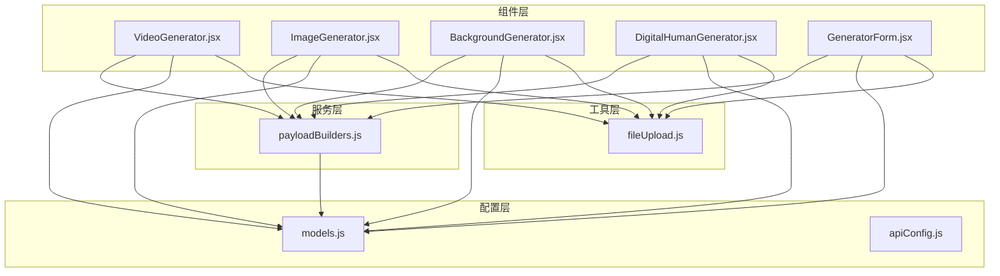
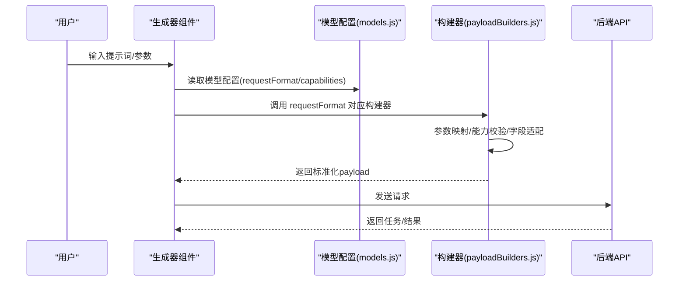
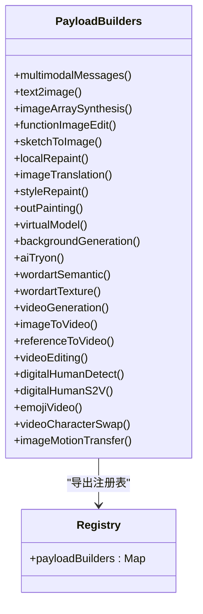
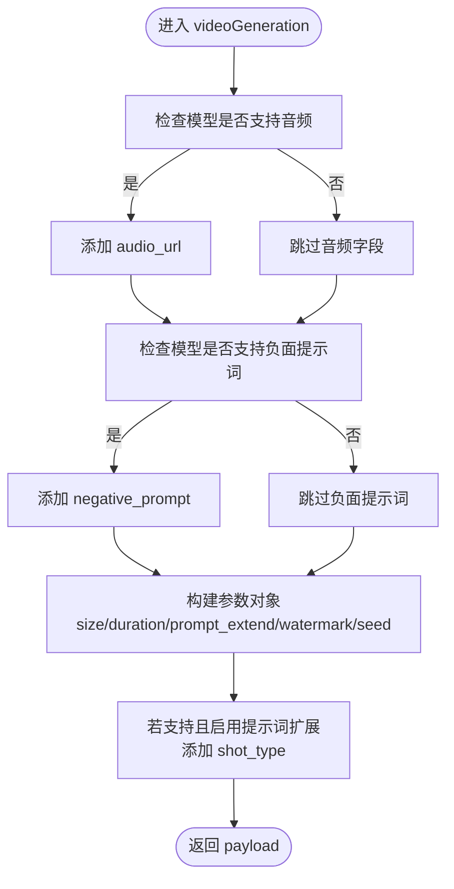
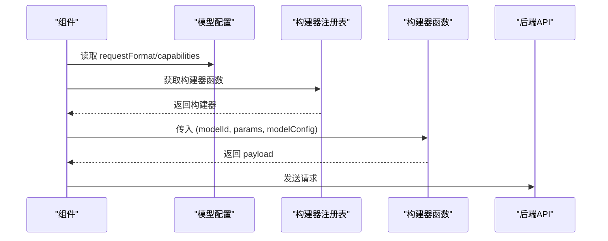
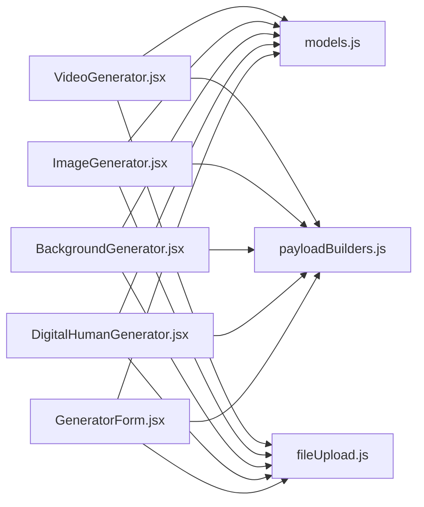

# 负载构建器

<cite>
**本文引用的文件**
- [payloadBuilders.js](file://src/services/payloadBuilders.js)
- [models.js](file://src/config/models.js)
- [apiConfig.js](file://src/config/apiConfig.js)
- [VideoGenerator.jsx](file://src/components/VideoGenerator.jsx)
- [ImageGenerator.jsx](file://src/components/ImageGenerator.jsx)
- [BackgroundGenerator.jsx](file://src/components/BackgroundGenerator.jsx)
- [DigitalHumanGenerator.jsx](file://src/components/DigitalHumanGenerator.jsx)
- [GeneratorForm.jsx](file://src/components/GeneratorForm.jsx)
- [fileUpload.js](file://src/utils/fileUpload.js)
</cite>

## 目录
1. [简介](#简介)
2. [项目结构](#项目结构)
3. [核心组件](#核心组件)
4. [架构总览](#架构总览)
5. [详细组件分析](#详细组件分析)
6. [依赖关系分析](#依赖关系分析)
7. [性能考量](#性能考量)
8. [故障排查指南](#故障排查指南)
9. [结论](#结论)
10. [附录](#附录)

## 简介
本文件面向“负载构建器系统”，聚焦于如何为不同AI模型类型构建请求载荷（payload），涵盖：
- 参数映射与数据格式转换
- 模型特定字段适配
- 配置驱动的构建器注册机制（requestFormat枚举与builder函数调用流程）
- 各类生成器（视频、图像、风格迁移等）的请求格式差异
- 自定义构建器的扩展指南与最佳实践

该系统采用“配置驱动 + 构建器策略”的设计，通过模型配置中的 requestFormat 字段，动态选择对应的 payloadBuilder 函数，从而实现对新模型的零侵入扩展。

## 项目结构
围绕负载构建器的关键目录与文件如下：
- 服务层：payloadBuilders.js 提供所有构建器函数与注册表
- 配置层：models.js 定义模型能力、协议、端点、requestFormat 等
- 组件层：各生成器组件负责收集用户输入，组装 params，调用构建器
- 工具层：fileUpload.js 提供文件/URL/base64 的统一处理

图表来源
- [payloadBuilders.js](file://src/services/payloadBuilders.js#L804-L828)
- [models.js](file://src/config/models.js#L1-L1012)
- [VideoGenerator.jsx](file://src/components/VideoGenerator.jsx#L1-L354)
- [ImageGenerator.jsx](file://src/components/ImageGenerator.jsx#L1-L249)
- [BackgroundGenerator.jsx](file://src/components/BackgroundGenerator.jsx#L1-L420)
- [DigitalHumanGenerator.jsx](file://src/components/DigitalHumanGenerator.jsx#L1-L313)
- [GeneratorForm.jsx](file://src/components/GeneratorForm.jsx#L1-L208)
- [fileUpload.js](file://src/utils/fileUpload.js#L1-L182)

章节来源
- [payloadBuilders.js](file://src/services/payloadBuilders.js#L1-L829)
- [models.js](file://src/config/models.js#L1-L1012)

## 核心组件
- 构建器注册表：将 requestFormat 名称映射到具体构建器函数
- 模型配置：包含 requestFormat、capabilities、默认分辨率、协议等
- 生成器组件：收集用户输入，组装 params，调用构建器
- 文件处理工具：统一处理 URL、base64、File 输入

章节来源
- [payloadBuilders.js](file://src/services/payloadBuilders.js#L804-L828)
- [models.js](file://src/config/models.js#L1-L1012)
- [fileUpload.js](file://src/utils/fileUpload.js#L114-L144)

## 架构总览
整体流程：
1) 用户在组件中填写参数
2) 组件根据当前模型配置组装 params
3) 调用 payloadBuilders 中对应 requestFormat 的构建器
4) 构建器依据模型 capabilities 进行字段映射与校验
5) 返回标准化的 payload，供后续 API 调用

图表来源
- [payloadBuilders.js](file://src/services/payloadBuilders.js#L804-L828)
- [models.js](file://src/config/models.js#L1-L1012)
- [VideoGenerator.jsx](file://src/components/VideoGenerator.jsx#L74-L115)
- [ImageGenerator.jsx](file://src/components/ImageGenerator.jsx#L32-L48)

## 详细组件分析

### 构建器注册与策略模式
- 注册表：payloadBuilders 将 requestFormat 名称映射到具体构建器函数
- 策略模式：每个构建器负责特定模型族的请求格式，遵循统一接口
- 可扩展性：新增模型只需在配置中指定 requestFormat，并实现对应构建器

图表来源
- [payloadBuilders.js](file://src/services/payloadBuilders.js#L804-L828)

章节来源
- [payloadBuilders.js](file://src/services/payloadBuilders.js#L804-L828)

### 请求格式与构建器映射
- requestFormat 在模型配置中定义，决定使用哪个构建器
- 构建器内部通过 modelConfig.capabilities 控制字段存在性与默认值
- 常见 requestFormat 包括：multimodalMessages、text2image、imageToVideo、videoGeneration 等

章节来源
- [models.js](file://src/config/models.js#L1-L1012)

### 视频生成构建器（videoGeneration）
- 输入：prompt、audio_url（可选）、negative_prompt（可选）
- 参数：size（支持标签映射到宽高）、duration、prompt_extend、watermark、seed（可选）
- 能力开关：audio、negative_prompt、seed、shot_type（部分模型）

图表来源
- [payloadBuilders.js](file://src/services/payloadBuilders.js#L515-L571)

章节来源
- [payloadBuilders.js](file://src/services/payloadBuilders.js#L515-L571)

### 图像到视频（imageToVideo）
- 模板模式：当 params.input.template 存在时走模板路径
- 正常模式：复用 videoGeneration 并补充 img_url、first_frame_image、last_frame_image 等字段
- 关键差异：支持从图片驱动视频，增加帧级控制字段

章节来源
- [payloadBuilders.js](file://src/services/payloadBuilders.js#L577-L643)

### 文本到图像（text2image）
- 输入：prompt、negative_prompt（可选）
- 参数：size、n、prompt_extend、style（可选）
- 能力开关：negative_prompt、prompt_extend、watermark、seed

章节来源
- [payloadBuilders.js](file://src/services/payloadBuilders.js#L156-L168)

### 多模态消息（multimodalMessages）
- 输入：messages 数组，支持 image 与 text 混排
- 特殊处理：wan2.6-image 在无图片时启用 interleave 模式
- 校验：qwen-image-edit 系列必须至少有一张图片

章节来源
- [payloadBuilders.js](file://src/services/payloadBuilders.js#L125-L150)

### 图像数组合成（imageArraySynthesis）
- 输入：prompt + images 数组
- 校验：至少需要一张图片

章节来源
- [payloadBuilders.js](file://src/services/payloadBuilders.js#L174-L190)

### 函数式图像编辑（functionImageEdit）
- 输入：function（默认 description_edit）、prompt、base_image_url、mask_image_url（可选）
- 校验：必须提供基准图片

章节来源
- [payloadBuilders.js](file://src/services/payloadBuilders.js#L196-L220)

### 草图到图像（sketchToImage）
- 输入：sketch_image_url、prompt
- 参数：size、n、style、sketch_weight、sketch_extraction、sketch_color

章节来源
- [payloadBuilders.js](file://src/services/payloadBuilders.js#L226-L249)

### 局部重绘（localRepaint）
- 输入：base_image_url、mask_image_url、prompt
- 校验：至少需要两张图片（基图 + 掩码）
- 参数：size、n、style、mask_color

章节来源
- [payloadBuilders.js](file://src/services/payloadBuilders.js#L255-L277)

### 图像翻译（imageTranslation）
- 输入：image_url、source_lang、target_lang、ext（可选）
- 参数：透传

章节来源
- [payloadBuilders.js](file://src/services/payloadBuilders.js#L283-L294)

### 风格重绘（styleRepaint）
- 输入：image_url、style_index（可选）、style_ref_url（可选）
- 参数：size、n

章节来源
- [payloadBuilders.js](file://src/services/payloadBuilders.js#L300-L319)

### 背景生成（backgroundGeneration）
- 输入：base_image_url（必填）
- 可选：ref_image_url、ref_prompt、ref_prompt_weight、noise_level
- 参数：n、model_version

章节来源
- [payloadBuilders.js](file://src/services/payloadBuilders.js#L369-L398)

### AI试衣（aiTryon）
- 输入：person_image_url（必填）、top_garment_url、bottom_garment_url（可选）
- 参数：resolution、restore_face

章节来源
- [payloadBuilders.js](file://src/services/payloadBuilders.js#L404-L425)

### 文字艺术（wordart）
- 语义变形（wordartSemantic）：text/prompt 互换，steps、n、output_image_ratio
- 纹理风格（wordartTexture）：支持图片输入与文本输入两种模式，texture_style、alpha_channel、image_short_size

章节来源
- [payloadBuilders.js](file://src/services/payloadBuilders.js#L431-L509)

### 数字人检测与S2V
- 检测（digitalHumanDetect）：仅需 image_url
- 语音驱动视频（digitalHumanS2V）：image_url、audio_url、style_type、size

章节来源
- [payloadBuilders.js](file://src/services/payloadBuilders.js#L715-L742)

### 组件到构建器的调用链
- 组件收集用户输入，组装 params（model、input、parameters）
- 读取模型配置（requestFormat、capabilities、defaultRes、resolutions）
- 调用 payloadBuilders[requestFormat]，返回标准化 payload
- 组件将 payload 交给服务层发起 API 请求

图表来源
- [payloadBuilders.js](file://src/services/payloadBuilders.js#L804-L828)
- [models.js](file://src/config/models.js#L1-L1012)
- [VideoGenerator.jsx](file://src/components/VideoGenerator.jsx#L74-L115)
- [ImageGenerator.jsx](file://src/components/ImageGenerator.jsx#L32-L48)

章节来源
- [VideoGenerator.jsx](file://src/components/VideoGenerator.jsx#L74-L115)
- [ImageGenerator.jsx](file://src/components/ImageGenerator.jsx#L32-L48)
- [BackgroundGenerator.jsx](file://src/components/BackgroundGenerator.jsx#L91-L149)
- [DigitalHumanGenerator.jsx](file://src/components/DigitalHumanGenerator.jsx#L73-L130)

## 依赖关系分析
- 组件依赖模型配置：通过 requestFormat 决定构建器
- 构建器依赖模型配置：通过 capabilities 控制字段存在性
- 文件处理工具被多个组件复用：统一处理 URL/base64/File

图表来源
- [payloadBuilders.js](file://src/services/payloadBuilders.js#L804-L828)
- [models.js](file://src/config/models.js#L1-L1012)
- [VideoGenerator.jsx](file://src/components/VideoGenerator.jsx#L1-L354)
- [ImageGenerator.jsx](file://src/components/ImageGenerator.jsx#L1-L249)
- [BackgroundGenerator.jsx](file://src/components/BackgroundGenerator.jsx#L1-L420)
- [DigitalHumanGenerator.jsx](file://src/components/DigitalHumanGenerator.jsx#L1-L313)
- [GeneratorForm.jsx](file://src/components/GeneratorForm.jsx#L1-L208)
- [fileUpload.js](file://src/utils/fileUpload.js#L1-L182)

章节来源
- [models.js](file://src/config/models.js#L1-L1012)
- [payloadBuilders.js](file://src/services/payloadBuilders.js#L804-L828)
- [fileUpload.js](file://src/utils/fileUpload.js#L114-L144)

## 性能考量
- 构建器复杂度：多数为 O(1)，按需拼装字段；少数涉及数组遍历（如多模态内容构建）
- 能力开关：通过 capabilities 控制字段存在性，避免冗余参数
- 文件处理：大图压缩与 base64 限制，减少传输体积
- 轮询与超时：配置层提供请求与轮询超时、重试策略，保障异步任务稳定性

章节来源
- [apiConfig.js](file://src/config/apiConfig.js#L8-L27)
- [fileUpload.js](file://src/utils/fileUpload.js#L6-L18)

## 故障排查指南
- 构建器校验错误
  - 编辑类模型缺少必要输入：如 qwen-image-edit 系列必须至少一张图片
  - I2V/局部重绘等需要多张图片时未提供
  - 解决：在组件层提前校验并提示用户
- 字段缺失或类型不符
  - 通过 capabilities 控制字段存在性，确保只传递模型支持的参数
- 文件输入问题
  - URL 格式校验失败：使用工具函数验证 URL
  - 文件类型/大小校验：使用 validateFile
  - 大文件压缩：uploadFileToTempServer 自动压缩
- 异步任务状态
  - 轮询状态：STATUS_DONE 包含成功/失败/取消/未知
  - 超时与重试：根据配置调整

章节来源
- [payloadBuilders.js](file://src/services/payloadBuilders.js#L136-L138)
- [payloadBuilders.js](file://src/services/payloadBuilders.js#L178-L180)
- [payloadBuilders.js](file://src/services/payloadBuilders.js#L199-L202)
- [payloadBuilders.js](file://src/services/payloadBuilders.js#L258-L261)
- [fileUpload.js](file://src/utils/fileUpload.js#L92-L99)
- [fileUpload.js](file://src/utils/fileUpload.js#L149-L167)
- [apiConfig.js](file://src/config/apiConfig.js#L22-L27)

## 结论
该负载构建器系统通过“配置驱动 + 策略模式”实现了高度可扩展的请求载荷构造能力：
- requestFormat 映射到构建器，构建器依据 capabilities 进行字段适配
- 组件层仅负责参数收集与调用，降低耦合
- 工具层统一处理文件输入，保证兼容性
- 新增模型只需在配置中声明 requestFormat，并实现对应构建器即可

## 附录

### 自定义构建器扩展指南
- 步骤
  1) 在 models.js 中为新模型配置 requestFormat 与 capabilities
  2) 在 payloadBuilders.js 中实现新的构建器函数
  3) 在组件层调用时，确保传入正确的 modelId 与 params
  4) 如需特殊校验，可在构建器中抛出明确错误信息
- 最佳实践
  - 使用 capabilities 控制字段存在性，避免冗余参数
  - 对必填字段进行显式校验并在组件层给出友好提示
  - 保持构建器纯函数特性，便于测试与维护
  - 对多模态输入统一使用 buildMultimodalContent 辅助函数
  - 对文件输入统一使用 processFileInput 与 uploadFileToTempServer

章节来源
- [models.js](file://src/config/models.js#L1-L1012)
- [payloadBuilders.js](file://src/services/payloadBuilders.js#L1-L829)
- [fileUpload.js](file://src/utils/fileUpload.js#L114-L144)