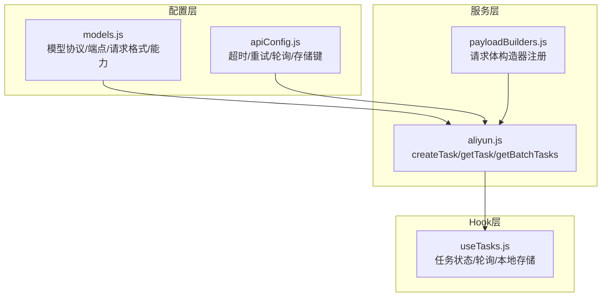
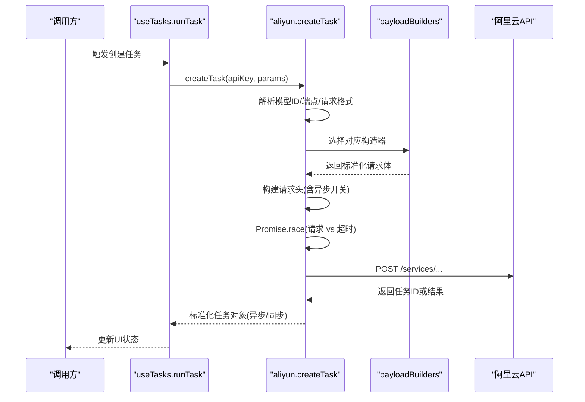
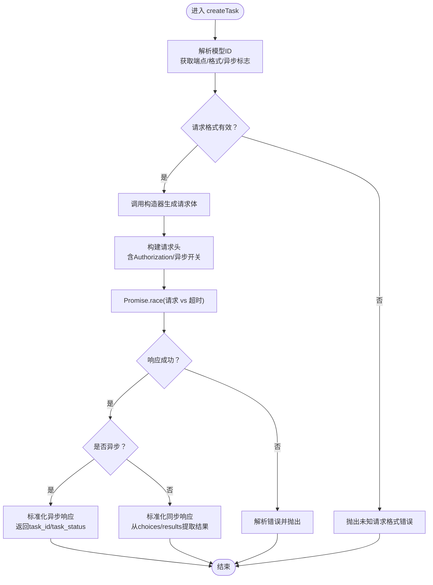
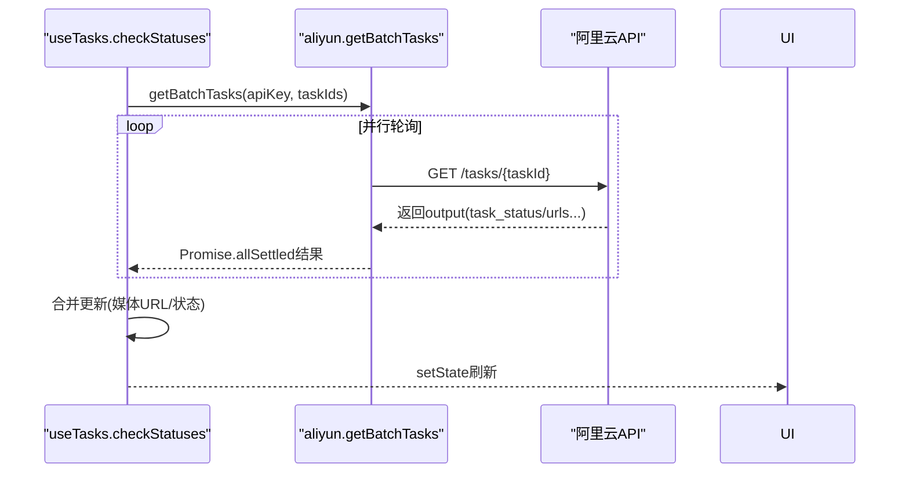
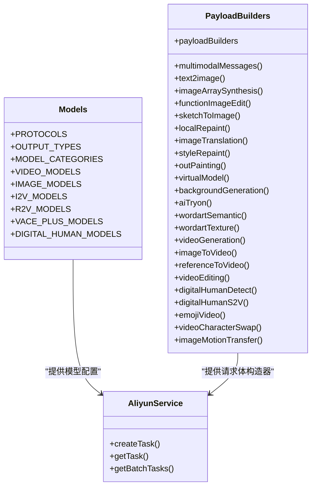
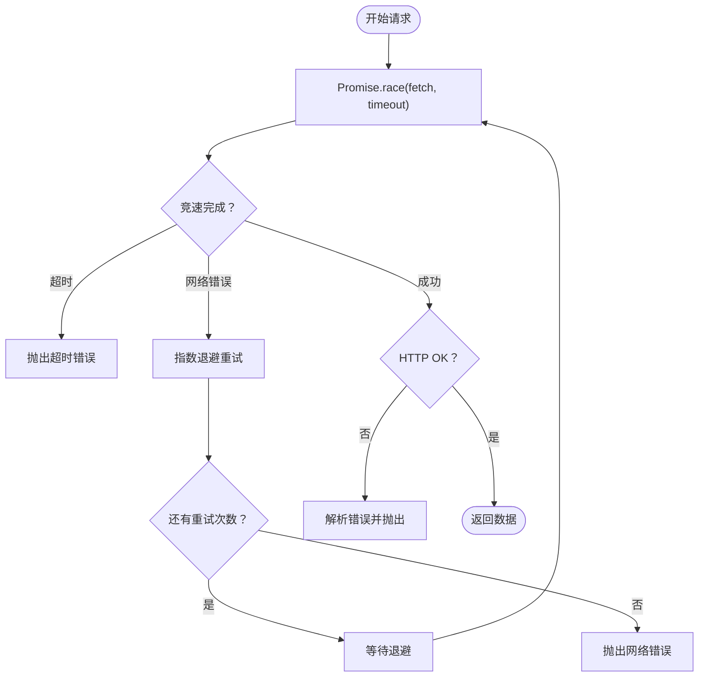
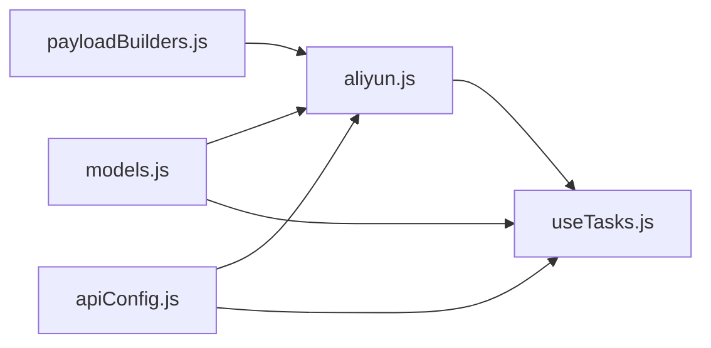

# 阿里云API服务

<cite>
**本文引用的文件列表**
- [aliyun.js](file://src/services/aliyun.js)
- [useTasks.js](file://src/hooks/useTasks.js)
- [apiConfig.js](file://src/config/apiConfig.js)
- [models.js](file://src/config/models.js)
- [payloadBuilders.js](file://src/services/payloadBuilders.js)
</cite>

## 目录
1. [简介](#简介)
2. [项目结构](#项目结构)
3. [核心组件](#核心组件)
4. [架构总览](#架构总览)
5. [详细组件分析](#详细组件分析)
6. [依赖关系分析](#依赖关系分析)
7. [性能考量](#性能考量)
8. [故障排查指南](#故障排查指南)
9. [结论](#结论)
10. [附录](#附录)

## 简介
本技术文档围绕阿里云API服务在前端侧的实现，重点解析以下能力：
- 异步任务创建与同步任务处理
- 请求头构建与认证机制
- 超时控制机制（Promise.race模式）
- 重试策略与错误处理
- 配置驱动的架构设计（模型ID解析、端点路由、请求格式选择）
- Promise.race在超时控制中的应用
- 异步/同步任务的不同响应处理
- 完整的API调用示例与错误场景处理方案

该系统采用“配置驱动 + 策略模式”的设计，通过模型配置表与请求体构造器，实现对多协议、多模型的统一接入与扩展。

## 项目结构
前端采用React + Vite，核心模块分布如下：
- 服务层：封装阿里云API调用与任务轮询
- 配置层：模型协议、端点、请求格式与默认参数
- Hook层：任务生命周期管理、本地存储、轮询策略
- 工具层：请求体构造器（策略模式）

图表来源
- [aliyun.js](file://src/services/aliyun.js#L1-L215)
- [useTasks.js](file://src/hooks/useTasks.js#L1-L333)
- [apiConfig.js](file://src/config/apiConfig.js#L1-L35)
- [models.js](file://src/config/models.js#L1-L800)
- [payloadBuilders.js](file://src/services/payloadBuilders.js#L1-L829)

章节来源
- [aliyun.js](file://src/services/aliyun.js#L1-L215)
- [useTasks.js](file://src/hooks/useTasks.js#L1-L333)
- [apiConfig.js](file://src/config/apiConfig.js#L1-L35)
- [models.js](file://src/config/models.js#L1-L800)
- [payloadBuilders.js](file://src/services/payloadBuilders.js#L1-L829)

## 核心组件
- createTask：统一入口，负责模型解析、端点路由、请求格式选择、超时控制、异步/同步响应标准化
- getTask / getBatchTasks：轮询任务状态，批量轮询并收集结果
- useTasks：任务生命周期管理、乐观更新、自适应轮询、本地持久化
- 配置与策略：apiConfig（超时/重试/轮询）、models（模型协议/端点/请求格式）、payloadBuilders（请求体构造器注册）

章节来源
- [aliyun.js](file://src/services/aliyun.js#L48-L160)
- [aliyun.js](file://src/services/aliyun.js#L162-L202)
- [aliyun.js](file://src/services/aliyun.js#L204-L215)
- [useTasks.js](file://src/hooks/useTasks.js#L9-L332)
- [apiConfig.js](file://src/config/apiConfig.js#L8-L27)
- [models.js](file://src/config/models.js#L1-L800)
- [payloadBuilders.js](file://src/services/payloadBuilders.js#L800-L829)

## 架构总览
系统通过配置驱动实现“模型即插即用”，请求体由策略模式的构造器按格式生成，超时控制统一采用Promise.race模式，轮询策略根据任务活跃度动态调整。

图表来源
- [aliyun.js](file://src/services/aliyun.js#L50-L160)
- [payloadBuilders.js](file://src/services/payloadBuilders.js#L125-L150)
- [useTasks.js](file://src/hooks/useTasks.js#L256-L312)

## 详细组件分析

### 组件一：createTask（异步/同步任务创建）
职责与流程：
- 模型解析：根据modelId从模型配置表中获取endpoint、requestFormat、async标志
- 请求格式选择：通过payloadBuilders映射到具体构造器
- 请求体构建：调用构造器生成标准请求体
- 请求头构建：统一Content-Type与Authorization；异步任务附加X-DashScope-Async头
- 超时控制：Promise.race竞速请求与超时Promise
- 响应标准化：异步返回task_id/task_status；同步返回results数组（兼容多模态choices结构）

图表来源
- [aliyun.js](file://src/services/aliyun.js#L50-L160)
- [payloadBuilders.js](file://src/services/payloadBuilders.js#L800-L829)

章节来源
- [aliyun.js](file://src/services/aliyun.js#L50-L160)
- [payloadBuilders.js](file://src/services/payloadBuilders.js#L125-L150)

### 组件二：getTask / getBatchTasks（任务轮询）
职责与流程：
- getTask：对单个任务ID发起GET请求，使用Promise.race实现轮询超时
- getBatchTasks：批量轮询，使用Promise.allSettled聚合结果
- useTasks：集中管理轮询定时器、自适应轮询间隔、乐观更新、本地存储

图表来源
- [aliyun.js](file://src/services/aliyun.js#L162-L202)
- [aliyun.js](file://src/services/aliyun.js#L204-L215)
- [useTasks.js](file://src/hooks/useTasks.js#L164-L246)

章节来源
- [aliyun.js](file://src/services/aliyun.js#L162-L202)
- [aliyun.js](file://src/services/aliyun.js#L204-L215)
- [useTasks.js](file://src/hooks/useTasks.js#L164-L246)

### 组件三：配置驱动与请求体构造器（策略模式）
- 配置层：models.js定义模型协议、端点、请求格式、异步标志、输出类型与能力集
- 策略层：payloadBuilders.js按请求格式提供构造器，统一输入参数与能力开关
- 注册层：payloadBuilders.js导出payloadBuilders映射，供createTask选择

图表来源
- [models.js](file://src/config/models.js#L1-L800)
- [payloadBuilders.js](file://src/services/payloadBuilders.js#L1-L829)
- [aliyun.js](file://src/services/aliyun.js#L1-L215)

章节来源
- [models.js](file://src/config/models.js#L1-L800)
- [payloadBuilders.js](file://src/services/payloadBuilders.js#L1-L829)
- [aliyun.js](file://src/services/aliyun.js#L1-L215)

### 组件四：超时控制与重试策略
- 超时控制：在请求前创建超时Promise，使用Promise.race竞速，任一先决条件达成即返回
- 重试策略：retryRequest对网络错误/超时进行指数退避重试，对验证错误（未知模型/未知请求格式）不重试
- 错误处理：捕获TypeError（网络错误）与超时错误，统一转换为用户可读错误消息

图表来源
- [aliyun.js](file://src/services/aliyun.js#L83-L97)
- [aliyun.js](file://src/services/aliyun.js#L20-L36)
- [aliyun.js](file://src/services/aliyun.js#L146-L159)

章节来源
- [aliyun.js](file://src/services/aliyun.js#L83-L97)
- [aliyun.js](file://src/services/aliyun.js#L20-L36)
- [aliyun.js](file://src/services/aliyun.js#L146-L159)

### 组件五：异步/同步任务响应处理
- 异步任务：createTask返回标准化对象，包含type=ASYNC、taskId、status；随后由useTasks轮询更新
- 同步任务：createTask在响应中解析output.choices或output.results，提取首张图片URL作为结果
- 多模态兼容：支持enable_interleave文本-only生成与标准图文混合生成

章节来源
- [aliyun.js](file://src/services/aliyun.js#L121-L145)
- [payloadBuilders.js](file://src/services/payloadBuilders.js#L125-L150)

## 依赖关系分析
- aliyn.js依赖：
  - models.js：模型ID解析与端点/格式/异步标志
  - payloadBuilders.js：请求体构造器映射
  - apiConfig.js：超时/重试/轮询常量
- useTasks.js依赖：
  - aliyun.js：createTask/getTask/getBatchTasks
  - models.js：输出类型判断（image/video）
  - apiConfig.js：轮询间隔/状态完成集合/存储键

图表来源
- [aliyun.js](file://src/services/aliyun.js#L1-L215)
- [useTasks.js](file://src/hooks/useTasks.js#L1-L333)
- [models.js](file://src/config/models.js#L1-L800)
- [payloadBuilders.js](file://src/services/payloadBuilders.js#L800-L829)
- [apiConfig.js](file://src/config/apiConfig.js#L1-L35)

章节来源
- [aliyun.js](file://src/services/aliyun.js#L1-L215)
- [useTasks.js](file://src/hooks/useTasks.js#L1-L333)
- [models.js](file://src/config/models.js#L1-L800)
- [payloadBuilders.js](file://src/services/payloadBuilders.js#L800-L829)
- [apiConfig.js](file://src/config/apiConfig.js#L1-L35)

## 性能考量
- 轮询自适应：根据任务活跃度与轮询次数动态调整轮询间隔，减少无效请求
- 批量轮询：getBatchTasks使用Promise.allSettled并行轮询，降低总等待时间
- 本地存储：任务历史持久化，避免重复请求与页面刷新丢失状态
- 乐观更新：创建任务时立即插入临时任务，提升交互体验

章节来源
- [useTasks.js](file://src/hooks/useTasks.js#L86-L104)
- [useTasks.js](file://src/hooks/useTasks.js#L164-L246)
- [useTasks.js](file://src/hooks/useTasks.js#L30-L84)

## 故障排查指南
常见错误与处理建议：
- 未知模型/未知请求格式：抛出明确错误，需检查模型ID与请求格式是否匹配
- 网络错误：检查网络连通性与代理设置，必要时启用重试
- 请求超时：适当增大TIMEOUT.REQUEST或优化上游服务性能
- 轮询超时：检查任务状态是否卡住，确认API端点可用
- 同步任务响应异常：确认模型是否支持同步返回，或切换为异步模式

章节来源
- [aliyun.js](file://src/services/aliyun.js#L24-L35)
- [aliyun.js](file://src/services/aliyun.js#L111-L116)
- [aliyun.js](file://src/services/aliyun.js#L148-L155)
- [apiConfig.js](file://src/config/apiConfig.js#L8-L12)

## 结论
该系统通过配置驱动与策略模式实现了对多模型、多协议的统一接入，配合Promise.race超时控制与指数退避重试，提供了稳定可靠的异步/同步任务处理能力。useTasks进一步增强了用户体验，通过乐观更新与自适应轮询实现高效的任务生命周期管理。

## 附录

### API调用示例（路径指引）
- 异步任务创建
  - 调用入口：[aliyun.createTask](file://src/services/aliyun.js#L50-L160)
  - 请求体构造：[payloadBuilders.multimodalMessages](file://src/services/payloadBuilders.js#L125-L150) 或 [payloadBuilders.text2image](file://src/services/payloadBuilders.js#L156-L168)
  - 超时控制：[Promise.race](file://src/services/aliyun.js#L83-L97)
- 同步任务创建
  - 响应标准化：[aliyun.createTask 同步分支](file://src/services/aliyun.js#L130-L145)
  - 多模态兼容：[payloadBuilders.multimodalMessages enable_interleave](file://src/services/payloadBuilders.js#L130-L133)
- 任务轮询
  - 单任务轮询：[aliyun.getTask](file://src/services/aliyun.js#L170-L202)
  - 批量轮询：[aliyun.getBatchTasks](file://src/services/aliyun.js#L211-L215)
  - 自适应轮询：[useTasks.getAdaptiveInterval](file://src/hooks/useTasks.js#L87-L104)
- 配置与模型
  - 超时/重试/轮询：[apiConfig](file://src/config/apiConfig.js#L8-L27)
  - 模型协议/端点/格式：[models](file://src/config/models.js#L1-L800)
  - 请求体构造器注册：[payloadBuilders.payloadBuilders](file://src/services/payloadBuilders.js#L804-L828)