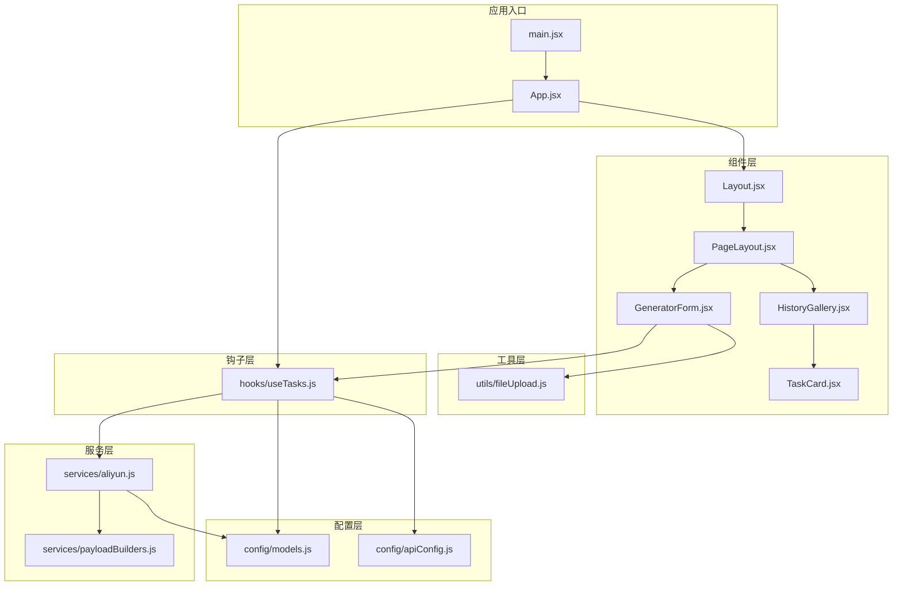
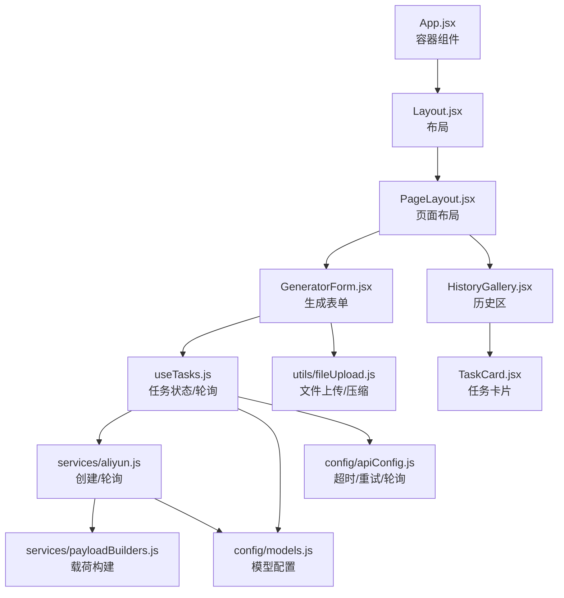
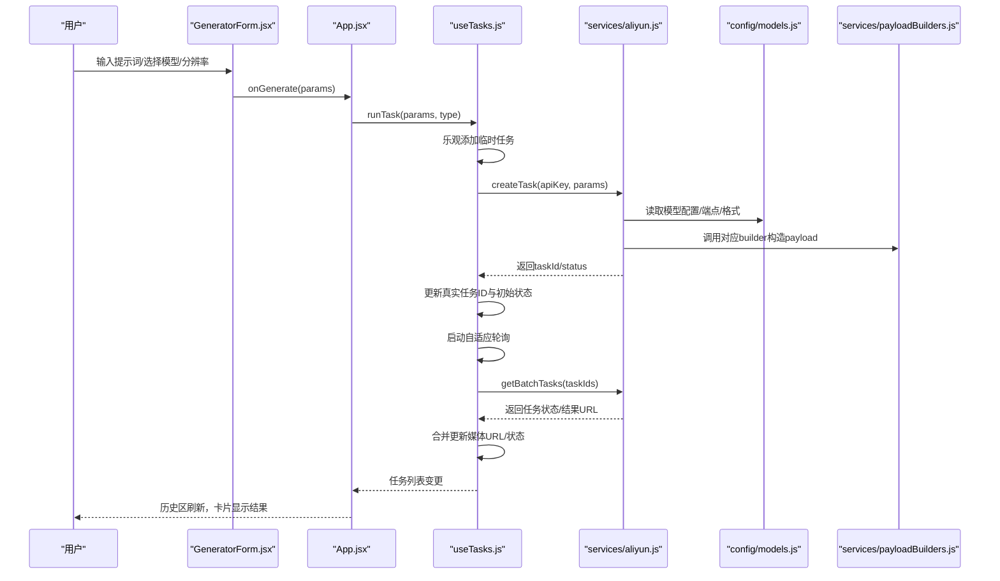
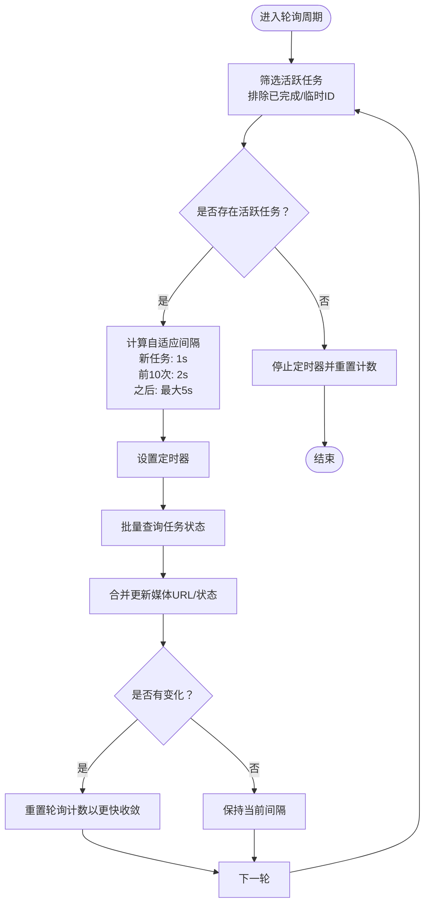
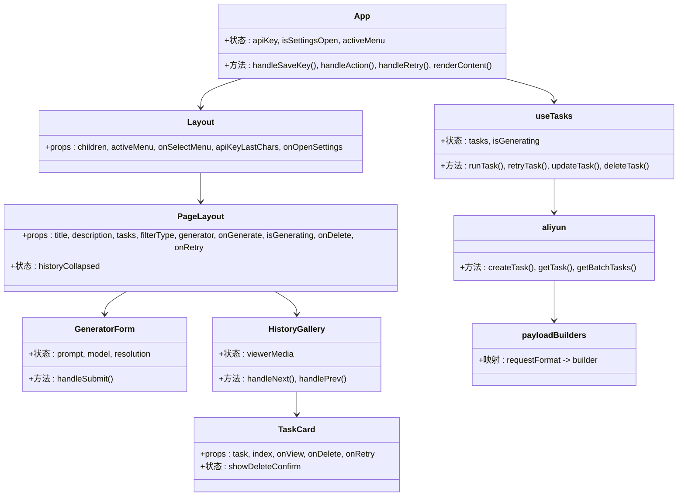
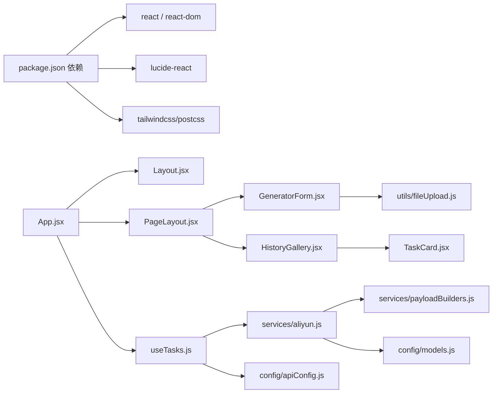

# 架构设计

<cite>
**本文引用的文件**
- [src/App.jsx](file://src/App.jsx)
- [src/main.jsx](file://src/main.jsx)
- [src/components/Layout.jsx](file://src/components/Layout.jsx)
- [src/components/PageLayout.jsx](file://src/components/PageLayout.jsx)
- [src/components/GeneratorForm.jsx](file://src/components/GeneratorForm.jsx)
- [src/components/HistoryGallery.jsx](file://src/components/HistoryGallery.jsx)
- [src/components/TaskCard.jsx](file://src/components/TaskCard.jsx)
- [src/hooks/useTasks.js](file://src/hooks/useTasks.js)
- [src/services/aliyun.js](file://src/services/aliyun.js)
- [src/services/payloadBuilders.js](file://src/services/payloadBuilders.js)
- [src/utils/fileUpload.js](file://src/utils/fileUpload.js)
- [src/config/models.js](file://src/config/models.js)
- [src/config/apiConfig.js](file://src/config/apiConfig.js)
- [package.json](file://package.json)
- [README.md](file://README.md)
</cite>

## 目录
1. [引言](#引言)
2. [项目结构](#项目结构)
3. [核心组件](#核心组件)
4. [架构总览](#架构总览)
5. [详细组件分析](#详细组件分析)
6. [依赖分析](#依赖分析)
7. [性能考虑](#性能考虑)
8. [故障排查指南](#故障排查指南)
9. [结论](#结论)
10. [附录](#附录)

## 引言
本架构设计文档面向通义万相前端应用，系统性阐述其组件化架构、配置驱动开发与服务层抽象等核心设计原则；详细说明从用户输入到API调用再到状态更新的完整数据流；解释组件间通信机制、状态管理模式与生命周期管理；并分析系统的可扩展性设计与新功能模块的集成方式。

## 项目结构
项目采用以功能域划分的目录组织方式，核心层次如下：
- 应用入口与根组件：main.jsx、App.jsx
- 组件层：components/*（布局、页面、表单、历史、卡片等）
- 配置层：config/*（模型配置、API常量）
- 服务层：services/*（阿里云API封装、请求载荷构建器）
- 工具层：utils/*（文件上传与处理）
- 钩子层：hooks/*（任务状态与轮询逻辑）
- 根级配置：package.json、README.md

**图表来源**
- [src/main.jsx](file://src/main.jsx#L1-L11)
- [src/App.jsx](file://src/App.jsx#L1-L377)
- [src/components/Layout.jsx](file://src/components/Layout.jsx#L1-L94)
- [src/components/PageLayout.jsx](file://src/components/PageLayout.jsx#L1-L76)
- [src/components/GeneratorForm.jsx](file://src/components/GeneratorForm.jsx#L1-L208)
- [src/components/HistoryGallery.jsx](file://src/components/HistoryGallery.jsx#L1-L68)
- [src/components/TaskCard.jsx](file://src/components/TaskCard.jsx#L1-L182)
- [src/hooks/useTasks.js](file://src/hooks/useTasks.js#L1-L333)
- [src/services/aliyun.js](file://src/services/aliyun.js#L1-L215)
- [src/services/payloadBuilders.js](file://src/services/payloadBuilders.js#L1-L829)
- [src/utils/fileUpload.js](file://src/utils/fileUpload.js#L1-L182)
- [src/config/models.js](file://src/config/models.js#L1-L1012)
- [src/config/apiConfig.js](file://src/config/apiConfig.js#L1-L35)

**章节来源**
- [src/main.jsx](file://src/main.jsx#L1-L11)
- [src/App.jsx](file://src/App.jsx#L1-L377)
- [package.json](file://package.json#L1-L33)

## 核心组件
- 应用根组件 App.jsx：集中管理API Key、侧边栏菜单切换、任务执行与重试、以及页面内容渲染（路由式PageLayout + 具体生成器组件）。
- 布局组件 Layout.jsx：提供桌面/移动端导航、顶部状态条与主内容区。
- 页面布局 PageLayout.jsx：统一页头、固定生成表单、可折叠历史记录区。
- 生成器表单 GeneratorForm.jsx：负责收集用户输入（提示词、模型、分辨率），并触发任务创建。
- 历史组件 HistoryGallery.jsx 与卡片 TaskCard.jsx：展示历史任务列表与单条任务卡片，支持预览、下载、删除、重试。
- 钩子 useTasks.js：封装任务创建、乐观更新、批量轮询、本地持久化与重试逻辑。
- 服务层 aliyun.js：统一创建任务、轮询状态、错误处理与超时控制。
- 载荷构建器 payloadBuilders.js：策略模式构建不同模型的请求载荷。
- 配置 models.js 与 apiConfig.js：模型能力、端点、协议与API超时/重试/轮询策略。
- 工具 fileUpload.js：文件上传、压缩与校验。

**章节来源**
- [src/App.jsx](file://src/App.jsx#L42-L377)
- [src/components/Layout.jsx](file://src/components/Layout.jsx#L1-L94)
- [src/components/PageLayout.jsx](file://src/components/PageLayout.jsx#L1-L76)
- [src/components/GeneratorForm.jsx](file://src/components/GeneratorForm.jsx#L1-L208)
- [src/components/HistoryGallery.jsx](file://src/components/HistoryGallery.jsx#L1-L68)
- [src/components/TaskCard.jsx](file://src/components/TaskCard.jsx#L1-L182)
- [src/hooks/useTasks.js](file://src/hooks/useTasks.js#L1-L333)
- [src/services/aliyun.js](file://src/services/aliyun.js#L1-L215)
- [src/services/payloadBuilders.js](file://src/services/payloadBuilders.js#L1-L829)
- [src/config/models.js](file://src/config/models.js#L1-L1012)
- [src/config/apiConfig.js](file://src/config/apiConfig.js#L1-L35)
- [src/utils/fileUpload.js](file://src/utils/fileUpload.js#L1-L182)

## 架构总览
系统采用“配置驱动 + 服务层抽象”的架构模式：
- 配置驱动：通过 models.js 定义模型协议、端点、请求格式与能力集；apiConfig.js 定义超时、重试与轮询策略。
- 服务层抽象：aliyun.js 封装创建任务、轮询与错误处理；payloadBuilders.js 以策略模式适配不同请求格式。
- 组件化架构：App.jsx 作为容器组件，按菜单路由渲染不同的 PageLayout + 生成器组件；PageLayout 统一布局与历史区；GeneratorForm 负责输入与触发；HistoryGallery/TaskCard 负责结果展示与交互。
- 状态管理：useTasks.js 负责任务状态、乐观更新、本地存储与轮询；App.jsx 仅持有少量UI状态（API Key、菜单、设置弹窗）。

**图表来源**
- [src/App.jsx](file://src/App.jsx#L42-L377)
- [src/components/Layout.jsx](file://src/components/Layout.jsx#L1-L94)
- [src/components/PageLayout.jsx](file://src/components/PageLayout.jsx#L1-L76)
- [src/components/GeneratorForm.jsx](file://src/components/GeneratorForm.jsx#L1-L208)
- [src/components/HistoryGallery.jsx](file://src/components/HistoryGallery.jsx#L1-L68)
- [src/components/TaskCard.jsx](file://src/components/TaskCard.jsx#L1-L182)
- [src/hooks/useTasks.js](file://src/hooks/useTasks.js#L1-L333)
- [src/services/aliyun.js](file://src/services/aliyun.js#L1-L215)
- [src/services/payloadBuilders.js](file://src/services/payloadBuilders.js#L1-L829)
- [src/utils/fileUpload.js](file://src/utils/fileUpload.js#L1-L182)
- [src/config/models.js](file://src/config/models.js#L1-L1012)
- [src/config/apiConfig.js](file://src/config/apiConfig.js#L1-L35)

## 详细组件分析

### 数据流与处理逻辑（从用户输入到状态更新）

**图表来源**
- [src/components/GeneratorForm.jsx](file://src/components/GeneratorForm.jsx#L66-L80)
- [src/App.jsx](file://src/App.jsx#L55-L61)
- [src/hooks/useTasks.js](file://src/hooks/useTasks.js#L256-L312)
- [src/services/aliyun.js](file://src/services/aliyun.js#L50-L160)
- [src/services/payloadBuilders.js](file://src/services/payloadBuilders.js#L125-L150)
- [src/config/models.js](file://src/config/models.js#L1-L1012)

**章节来源**
- [src/components/GeneratorForm.jsx](file://src/components/GeneratorForm.jsx#L1-L208)
- [src/App.jsx](file://src/App.jsx#L55-L61)
- [src/hooks/useTasks.js](file://src/hooks/useTasks.js#L256-L312)
- [src/services/aliyun.js](file://src/services/aliyun.js#L50-L160)
- [src/services/payloadBuilders.js](file://src/services/payloadBuilders.js#L125-L150)
- [src/config/models.js](file://src/config/models.js#L1-L1012)

### 组件间通信机制
- App.jsx 与 PageLayout.jsx：通过 props 传递标题、描述、任务列表、过滤类型、生成器组件、回调函数（onGenerate/isGenerating/onDelete/onRetry）。
- PageLayout.jsx 与 GeneratorForm.jsx：通过 onGenerate 回调传递参数；通过 isGenerating 控制按钮禁用。
- PageLayout.jsx 与 HistoryGallery.jsx：通过 tasks 与 onDelete/onRetry 交互。
- HistoryGallery.jsx 与 TaskCard.jsx：通过 onView 打开全屏预览；通过 onDelete/onRetry 与父级交互。
- App.jsx 与 Layout.jsx：通过 activeMenu/onSelectMenu 控制侧边栏；通过 onOpenSettings 打开设置弹窗。

**章节来源**
- [src/App.jsx](file://src/App.jsx#L71-L377)
- [src/components/PageLayout.jsx](file://src/components/PageLayout.jsx#L9-L76)
- [src/components/HistoryGallery.jsx](file://src/components/HistoryGallery.jsx#L1-L68)
- [src/components/TaskCard.jsx](file://src/components/TaskCard.jsx#L1-L182)
- [src/components/Layout.jsx](file://src/components/Layout.jsx#L1-L94)

### 状态管理模式与生命周期
- App.jsx：持有 API Key、侧边栏激活项、设置弹窗开关；通过 useTasks 提供统一任务状态与操作。
- useTasks.js：初始化从 localStorage 恢复任务；乐观添加临时任务；批量轮询活跃任务；自适应轮询间隔；本地持久化（清理 base64 以节省空间）；提供 retry/delete/update。
- services/aliyun.js：封装 createTask/getTask/getBatchTasks，统一超时与错误处理。
- services/payloadBuilders.js：策略模式按模型格式构建请求体，新增模型无需改动核心逻辑。
- utils/fileUpload.js：文件上传、压缩与校验，支持 URL/base64/File 三种输入。

**章节来源**
- [src/hooks/useTasks.js](file://src/hooks/useTasks.js#L1-L333)
- [src/services/aliyun.js](file://src/services/aliyun.js#L1-L215)
- [src/services/payloadBuilders.js](file://src/services/payloadBuilders.js#L1-L829)
- [src/utils/fileUpload.js](file://src/utils/fileUpload.js#L1-L182)

### 复杂逻辑组件（轮询与自适应策略）

**图表来源**
- [src/hooks/useTasks.js](file://src/hooks/useTasks.js#L86-L161)
- [src/hooks/useTasks.js](file://src/hooks/useTasks.js#L164-L246)

**章节来源**
- [src/hooks/useTasks.js](file://src/hooks/useTasks.js#L86-L161)
- [src/hooks/useTasks.js](file://src/hooks/useTasks.js#L164-L246)

### 类关系图（代码级）

**图表来源**
- [src/App.jsx](file://src/App.jsx#L42-L377)
- [src/components/Layout.jsx](file://src/components/Layout.jsx#L1-L94)
- [src/components/PageLayout.jsx](file://src/components/PageLayout.jsx#L1-L76)
- [src/components/GeneratorForm.jsx](file://src/components/GeneratorForm.jsx#L1-L208)
- [src/components/HistoryGallery.jsx](file://src/components/HistoryGallery.jsx#L1-L68)
- [src/components/TaskCard.jsx](file://src/components/TaskCard.jsx#L1-L182)
- [src/hooks/useTasks.js](file://src/hooks/useTasks.js#L1-L333)
- [src/services/aliyun.js](file://src/services/aliyun.js#L1-L215)
- [src/services/payloadBuilders.js](file://src/services/payloadBuilders.js#L804-L829)

## 依赖分析
- 外部依赖：React 19、lucide-react、TailwindCSS 生态。
- 内部耦合：
  - App.jsx 与 PageLayout.jsx、useTasks.js 高内聚；
  - 生成器组件（如 GeneratorForm）与 useTasks.js 通过回调解耦；
  - services/aliyun.js 与 services/payloadBuilders.js 通过模型配置解耦；
  - 配置层（models.js、apiConfig.js）被 useTasks.js 与 aliyun.js 广泛依赖。

**图表来源**
- [package.json](file://package.json#L12-L31)
- [src/App.jsx](file://src/App.jsx#L1-L377)
- [src/components/PageLayout.jsx](file://src/components/PageLayout.jsx#L1-L76)
- [src/hooks/useTasks.js](file://src/hooks/useTasks.js#L1-L333)
- [src/services/aliyun.js](file://src/services/aliyun.js#L1-L215)
- [src/services/payloadBuilders.js](file://src/services/payloadBuilders.js#L1-L829)
- [src/config/models.js](file://src/config/models.js#L1-L1012)
- [src/config/apiConfig.js](file://src/config/apiConfig.js#L1-L35)
- [src/utils/fileUpload.js](file://src/utils/fileUpload.js#L1-L182)

**章节来源**
- [package.json](file://package.json#L12-L31)
- [src/App.jsx](file://src/App.jsx#L1-L377)
- [src/hooks/useTasks.js](file://src/hooks/useTasks.js#L1-L333)
- [src/services/aliyun.js](file://src/services/aliyun.js#L1-L215)
- [src/services/payloadBuilders.js](file://src/services/payloadBuilders.js#L1-L829)
- [src/config/models.js](file://src/config/models.js#L1-L1012)
- [src/config/apiConfig.js](file://src/config/apiConfig.js#L1-L35)
- [src/utils/fileUpload.js](file://src/utils/fileUpload.js#L1-L182)

## 性能考虑
- 轮询自适应：根据任务年龄与状态变化动态调整轮询间隔，减少无效请求与资源消耗。
- 乐观更新：提交任务立即显示临时任务，提升感知性能；真实ID与结果回填时再合并更新。
- 本地持久化：任务列表保存至 localStorage，清理 base64 以降低存储压力；容量不足时截断最近20条。
- 载荷构建：策略模式按模型能力组装参数，避免重复判断与分支。
- 文件上传：对大图进行压缩与base64转换，控制请求体大小，减少传输成本。

[本节为通用指导，无需具体文件分析]

## 故障排查指南
- API Key 未配置：App.jsx 在需要时打开设置弹窗；建议检查本地存储键值与保存流程。
- 任务状态异常：useTasks.js 的轮询会等待媒体URL出现后再标记成功；若长时间无结果，检查模型输出类型与轮询返回结构。
- 超时与重试：aliyun.js 对请求与轮询分别设置超时；网络错误与超时会抛出明确错误；可检查 RETRY 配置。
- 载荷构建错误：payloadBuilders.js 对必填字段进行校验并抛错；检查模型能力与输入字段是否匹配。
- 文件上传问题：utils/fileUpload.js 对URL/base64/File进行校验；过大文件会触发压缩；注意浏览器兼容性与内存限制。

**章节来源**
- [src/App.jsx](file://src/App.jsx#L50-L69)
- [src/hooks/useTasks.js](file://src/hooks/useTasks.js#L164-L246)
- [src/services/aliyun.js](file://src/services/aliyun.js#L146-L160)
- [src/services/payloadBuilders.js](file://src/services/payloadBuilders.js#L136-L138)
- [src/utils/fileUpload.js](file://src/utils/fileUpload.js#L114-L144)
- [src/config/apiConfig.js](file://src/config/apiConfig.js#L8-L27)

## 结论
该前端应用通过“配置驱动 + 服务层抽象 + 组件化架构”实现了高内聚、低耦合与强扩展性。配置层集中管理模型能力与端点，服务层统一处理API交互与错误，组件层专注UI与交互，钩子层负责状态与生命周期。自适应轮询、乐观更新与本地持久化提升了用户体验与性能。新增模型或功能模块时，只需在配置与载荷构建器中扩展，即可最小化侵入地集成。

[本节为总结，无需具体文件分析]

## 附录

### 可扩展性设计与新功能集成
- 新增模型：在 models.js 中添加模型配置（协议、端点、请求格式、能力集），在 payloadBuilders.js 中新增对应 builder；无需修改 aliyun.js 与 useTasks.js。
- 新增功能模块：在 App.jsx 的菜单路由中新增 case 分支，渲染对应的 PageLayout + 生成器组件；通过统一的 onGenerate 回调接入任务系统。
- 新增请求格式：在 payloadBuilders.js 中新增 builder 并加入映射；在 models.js 中指定 requestFormat；服务层自动适配。
- 新增轮询策略：可在 apiConfig.js 中调整轮询间隔与最大状态集合；useTasks.js 的自适应逻辑会自动生效。

**章节来源**
- [src/config/models.js](file://src/config/models.js#L1-L1012)
- [src/services/payloadBuilders.js](file://src/services/payloadBuilders.js#L804-L829)
- [src/App.jsx](file://src/App.jsx#L71-L355)
- [src/config/apiConfig.js](file://src/config/apiConfig.js#L21-L27)