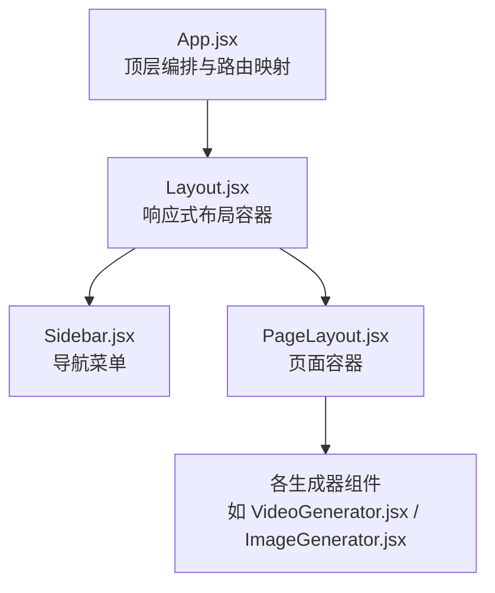
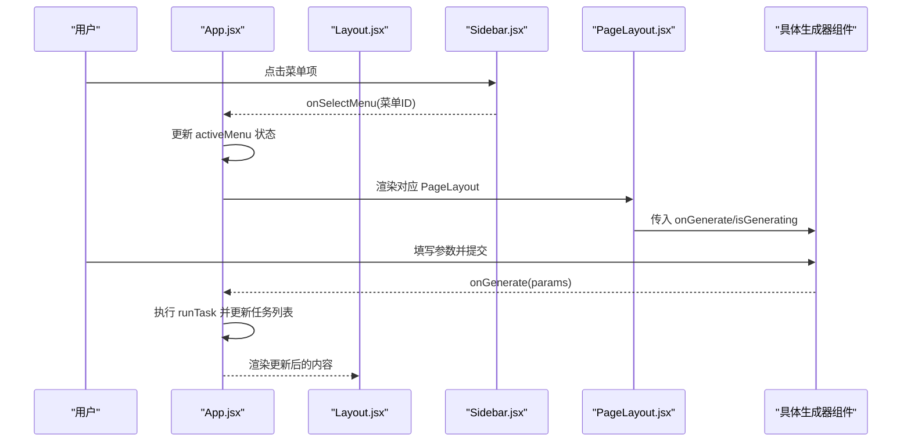
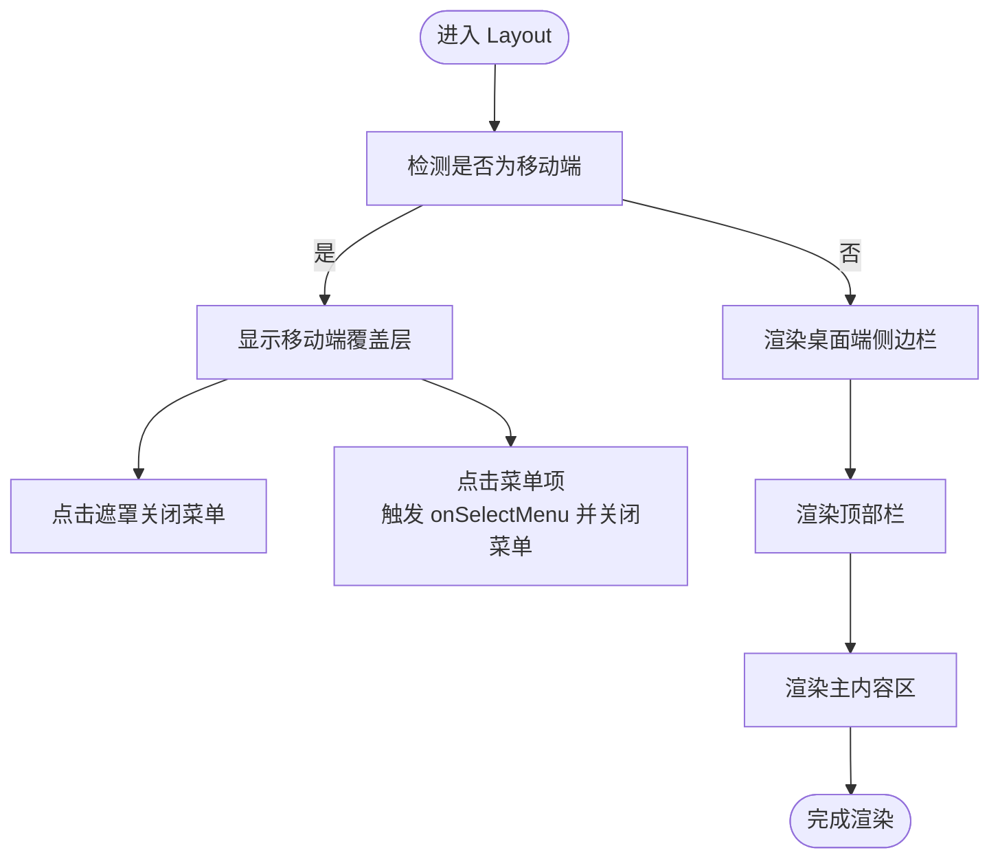
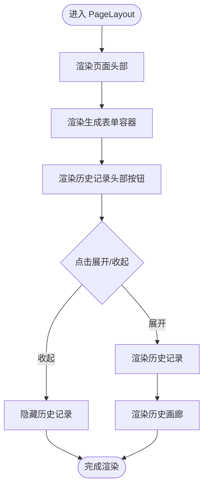
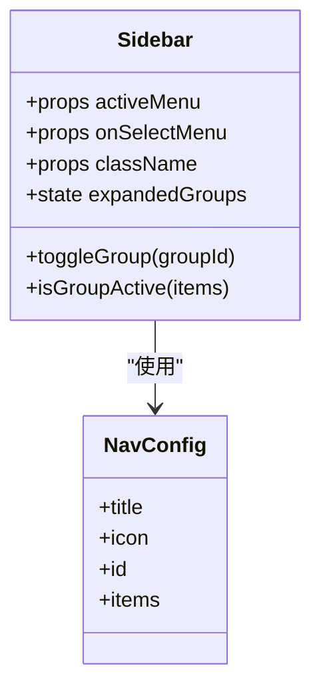
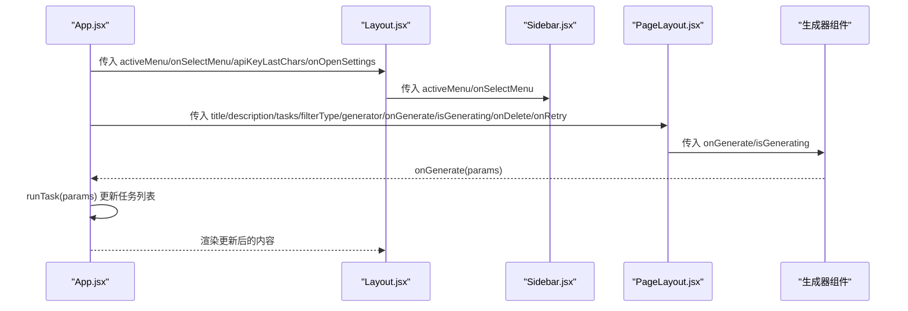
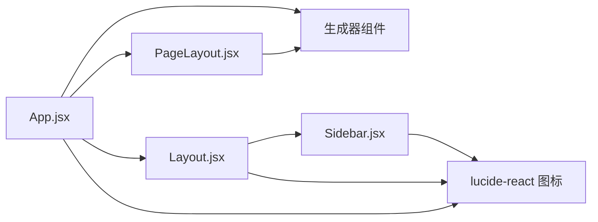

# 布局组件

<cite>
**本文引用的文件列表**
- [Layout.jsx](file://src/components/Layout.jsx)
- [PageLayout.jsx](file://src/components/PageLayout.jsx)
- [Sidebar.jsx](file://src/components/Sidebar.jsx)
- [App.jsx](file://src/App.jsx)
- [VideoGenerator.jsx](file://src/components/VideoGenerator.jsx)
- [ImageGenerator.jsx](file://src/components/ImageGenerator.jsx)
- [tailwind.config.js](file://tailwind.config.js)
- [main.css](file://src/main.css)
</cite>

## 目录
1. [简介](#简介)
2. [项目结构](#项目结构)
3. [核心组件](#核心组件)
4. [架构总览](#架构总览)
5. [组件详解](#组件详解)
6. [依赖关系分析](#依赖关系分析)
7. [性能考量](#性能考量)
8. [故障排查指南](#故障排查指南)
9. [结论](#结论)
10. [附录](#附录)

## 简介
本文件面向通义万相前端应用的布局组件，系统性解析以下三个关键组件：
- Layout.jsx：负责整体响应式布局（桌面端与移动端），包含侧边导航、顶部栏与主内容区。
- PageLayout.jsx：页面容器组件，统一承载标题、描述、生成表单与历史记录区域，并支持历史记录折叠。
- Sidebar.jsx：导航菜单系统，包含分组展开/收起、当前激活项高亮、路由切换机制。

文档将从架构、数据流、处理逻辑、集成点、错误处理与性能等方面进行深入分析，并提供使用示例与最佳实践，帮助开发者快速理解与扩展布局体系。

## 项目结构
布局相关的核心文件位于 src/components 目录，配合 App.jsx 进行顶层编排，Tailwind CSS 提供基础样式与响应式断点，main.css 提供自定义滚动条与动画等补充样式。

图表来源
- [App.jsx](file://src/App.jsx#L42-L377)
- [Layout.jsx](file://src/components/Layout.jsx#L1-L94)
- [Sidebar.jsx](file://src/components/Sidebar.jsx#L1-L149)
- [PageLayout.jsx](file://src/components/PageLayout.jsx#L1-L76)
- [VideoGenerator.jsx](file://src/components/VideoGenerator.jsx#L1-L200)
- [ImageGenerator.jsx](file://src/components/ImageGenerator.jsx#L1-L200)

章节来源
- [App.jsx](file://src/App.jsx#L42-L377)
- [tailwind.config.js](file://tailwind.config.js#L1-L12)
- [main.css](file://src/main.css#L1-L54)

## 核心组件
- Layout.jsx
  - 负责桌面端与移动端的差异化布局：桌面端显示固定侧边栏；移动端通过覆盖层弹出菜单。
  - 顶部栏包含移动端菜单开关、面包屑占位、API Key 状态按钮与设置入口。
  - 主内容区采用滚动容器，支持不同屏幕尺寸下的内边距与滚动条样式。
- PageLayout.jsx
  - 统一页面头部（标题/描述）与生成表单区域（固定在顶部优先位置）。
  - 历史记录区域支持折叠/展开，内部使用 useMemo 对任务过滤进行缓存，减少重复渲染。
- Sidebar.jsx
  - 导航配置集中管理，按分组展示子菜单项。
  - 自动展开包含当前激活项的分组；点击分组标题切换展开状态；点击子项触发 onSelectMenu 回调。

章节来源
- [Layout.jsx](file://src/components/Layout.jsx#L1-L94)
- [PageLayout.jsx](file://src/components/PageLayout.jsx#L1-L76)
- [Sidebar.jsx](file://src/components/Sidebar.jsx#L1-L149)

## 架构总览
下图展示了顶层 App 如何将布局组件串联起来，并根据当前激活菜单选择对应的页面容器与生成器组件。

图表来源
- [App.jsx](file://src/App.jsx#L42-L377)
- [Layout.jsx](file://src/components/Layout.jsx#L1-L94)
- [Sidebar.jsx](file://src/components/Sidebar.jsx#L1-L149)
- [PageLayout.jsx](file://src/components/PageLayout.jsx#L1-L76)
- [VideoGenerator.jsx](file://src/components/VideoGenerator.jsx#L1-L200)
- [ImageGenerator.jsx](file://src/components/ImageGenerator.jsx#L1-L200)

## 组件详解

### Layout.jsx 响应式布局与交互
- 桌面端与移动端差异化
  - 桌面端：固定宽度侧边栏，常驻显示。
  - 移动端：通过 isMobileMenuOpen 控制覆盖层弹出菜单，点击遮罩或菜单项后自动关闭。
- 顶部栏
  - 移动端菜单开关按钮仅在小屏显示。
  - API Key 状态按钮根据是否存在有效密钥动态切换样式与文案，并触发设置弹窗。
  - 设置按钮用于打开设置面板。
- 主内容区
  - 顶部留白与阴影营造层次感；内容区使用滚动容器，支持不同断点下的内边距。
  - 滚动条样式由 Tailwind 与自定义 CSS 共同控制。

图表来源
- [Layout.jsx](file://src/components/Layout.jsx#L1-L94)

章节来源
- [Layout.jsx](file://src/components/Layout.jsx#L1-L94)

### PageLayout.jsx 页面容器与内容管理
- 统一页面头部：标题与描述，便于各功能页复用。
- 生成表单区域固定在顶部优先位置，确保用户操作优先级。
- 历史记录区域支持折叠/展开，内部使用 useMemo 对任务过滤结果进行缓存，避免每次渲染都重新计算。
- 通过 props 将 onGenerate、isGenerating、onDelete、onRetry 传递给具体生成器组件，形成清晰的数据流与事件回调链路。

图表来源
- [PageLayout.jsx](file://src/components/PageLayout.jsx#L1-L76)

章节来源
- [PageLayout.jsx](file://src/components/PageLayout.jsx#L1-L76)

### Sidebar.jsx 导航菜单系统
- 导航配置
  - 采用集中配置数组，包含分组标题、图标、子项列表与唯一 ID。
  - 自动展开包含当前激活项的分组；初始默认展开第一个分组。
- 交互行为
  - 点击分组标题切换展开/收起状态。
  - 点击子项触发 onSelectMenu 回调，实现路由切换。
  - 子项高亮显示当前激活项，分组标题在包含激活项时呈现强调样式。
- 个性化区域
  - 顶部品牌标识与标题；底部用户信息展示。

图表来源
- [Sidebar.jsx](file://src/components/Sidebar.jsx#L1-L149)

章节来源
- [Sidebar.jsx](file://src/components/Sidebar.jsx#L1-L149)

### 组件间 props 传递与状态同步
- App.jsx
  - 维护 activeMenu 状态，作为当前激活菜单 ID。
  - 将 activeMenu 与 onSelectMenu 传递给 Layout；同时将 apiKey 的最后四位与 onOpenSettings 传递给 Layout。
  - 根据 activeMenu 在 renderContent 中选择对应的 PageLayout 与生成器组件。
- Layout.jsx
  - 将 activeMenu 与 onSelectMenu 传递给 Sidebar。
  - 将 apiKeyLastChars 与 onOpenSettings 传递给顶部栏的 API Key 状态按钮与设置按钮。
  - 通过 children 传递 PageLayout 的内容。
- PageLayout.jsx
  - 接收 title/description/tasks/filterType/generator/onGenerate/isGenerating/onDelete/onRetry 等 props。
  - 将 onGenerate/isGenerating 透传给具体生成器组件。
- 生成器组件（如 VideoGenerator.jsx、ImageGenerator.jsx）
  - 接收 onGenerate/isGenerating，提交参数时调用 onGenerate(params)。
  - App.jsx 在收到回调后执行 runTask 并更新任务列表，从而驱动历史记录刷新。

图表来源
- [App.jsx](file://src/App.jsx#L42-L377)
- [Layout.jsx](file://src/components/Layout.jsx#L1-L94)
- [Sidebar.jsx](file://src/components/Sidebar.jsx#L1-L149)
- [PageLayout.jsx](file://src/components/PageLayout.jsx#L1-L76)
- [VideoGenerator.jsx](file://src/components/VideoGenerator.jsx#L1-L200)
- [ImageGenerator.jsx](file://src/components/ImageGenerator.jsx#L1-L200)

章节来源
- [App.jsx](file://src/App.jsx#L42-L377)
- [Layout.jsx](file://src/components/Layout.jsx#L1-L94)
- [Sidebar.jsx](file://src/components/Sidebar.jsx#L1-L149)
- [PageLayout.jsx](file://src/components/PageLayout.jsx#L1-L76)
- [VideoGenerator.jsx](file://src/components/VideoGenerator.jsx#L1-L200)
- [ImageGenerator.jsx](file://src/components/ImageGenerator.jsx#L1-L200)

## 依赖关系分析
- 外部依赖
  - lucide-react 图标库：用于菜单图标与界面元素。
  - Tailwind CSS：提供响应式断点与通用样式类，断点包括 lg（桌面端）等。
- 内部依赖
  - App.jsx 依赖 Layout、PageLayout、各生成器组件与任务钩子。
  - Layout.jsx 依赖 Sidebar 与顶部栏交互。
  - PageLayout.jsx 依赖 HistoryGallery 与生成器组件。
  - Sidebar.jsx 依赖图标集合与本地状态管理。

图表来源
- [App.jsx](file://src/App.jsx#L1-L377)
- [Layout.jsx](file://src/components/Layout.jsx#L1-L94)
- [Sidebar.jsx](file://src/components/Sidebar.jsx#L1-L149)
- [PageLayout.jsx](file://src/components/PageLayout.jsx#L1-L76)

章节来源
- [tailwind.config.js](file://tailwind.config.js#L1-L12)
- [main.css](file://src/main.css#L1-L54)

## 性能考量
- 渲染优化
  - PageLayout 使用 useMemo 对任务过滤结果进行缓存，避免每次渲染都重新计算，降低不必要的子组件重渲染成本。
- 交互性能
  - 移动端菜单通过覆盖层实现，避免复杂 DOM 结构变更；点击遮罩关闭菜单，减少额外事件绑定。
- 样式性能
  - Tailwind 与自定义滚动条样式在 main.css 中集中管理，避免重复样式计算。
- 断点与响应式
  - 使用 Tailwind 断点（如 lg）区分桌面端与移动端布局，减少条件判断开销。

章节来源
- [PageLayout.jsx](file://src/components/PageLayout.jsx#L22-L26)
- [Layout.jsx](file://src/components/Layout.jsx#L1-L94)
- [main.css](file://src/main.css#L1-L54)

## 故障排查指南
- 激活菜单未正确高亮
  - 检查 App.jsx 中 activeMenu 是否与 Sidebar.jsx 的菜单项 ID 匹配。
  - 确认 Sidebar.jsx 的 isGroupActive 与 expandedGroups 初始化逻辑。
- 移动端菜单无法关闭
  - 确认 Layout.jsx 中覆盖层遮罩的点击事件是否正确触发关闭逻辑。
- 历史记录不更新
  - 确认 App.jsx 中 onGenerate 回调是否正确调用 runTask 并更新任务列表。
  - 检查 PageLayout.jsx 的 filteredTasks 计算是否依赖正确的 filterType。
- API Key 状态异常
  - 确认 App.jsx 中 apiKey 的存储与传递路径，以及 Layout.jsx 顶部栏按钮的点击事件是否正确打开设置面板。

章节来源
- [App.jsx](file://src/App.jsx#L42-L377)
- [Layout.jsx](file://src/components/Layout.jsx#L1-L94)
- [Sidebar.jsx](file://src/components/Sidebar.jsx#L1-L149)
- [PageLayout.jsx](file://src/components/PageLayout.jsx#L1-L76)

## 结论
本布局体系通过清晰的职责划分与稳定的 props 传递模式，实现了桌面端与移动端的差异化体验。Sidebar 提供直观的导航与路由切换，Layout 负责整体布局与交互，PageLayout 统一页面容器与历史记录管理。配合 useMemo 的渲染优化与 Tailwind 的响应式断点，整体具备良好的可维护性与扩展性。

## 附录

### 使用示例与最佳实践
- 响应式断点设置
  - 桌面端：使用 lg 分组显示侧边栏；移动端使用覆盖层弹出菜单。
  - 内容区使用滚动容器与断点内边距，保证在不同设备上的阅读与操作体验。
- 移动端适配方案
  - 顶部栏仅在移动端显示菜单开关；点击遮罩关闭菜单，提升交互效率。
  - 侧边栏在移动端采用绝对定位与背景遮罩，避免影响主内容区布局。
- 状态同步策略
  - 通过 App.jsx 维护 activeMenu 与任务状态，向下传递至 Layout 与 PageLayout，确保全局一致。
  - 生成器组件仅关注自身表单逻辑，通过 onGenerate 回调与 App.jsx 协作，避免跨组件耦合。
- 性能优化建议
  - 对于频繁过滤的任务列表，继续沿用 useMemo 缓存策略。
  - 合理拆分组件，避免单一组件承担过多职责，降低重渲染范围。

章节来源
- [Layout.jsx](file://src/components/Layout.jsx#L1-L94)
- [PageLayout.jsx](file://src/components/PageLayout.jsx#L1-L76)
- [Sidebar.jsx](file://src/components/Sidebar.jsx#L1-L149)
- [App.jsx](file://src/App.jsx#L42-L377)