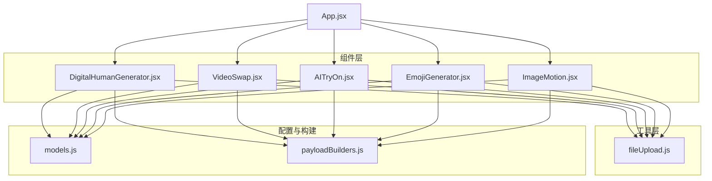
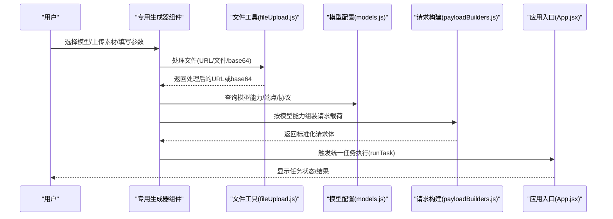
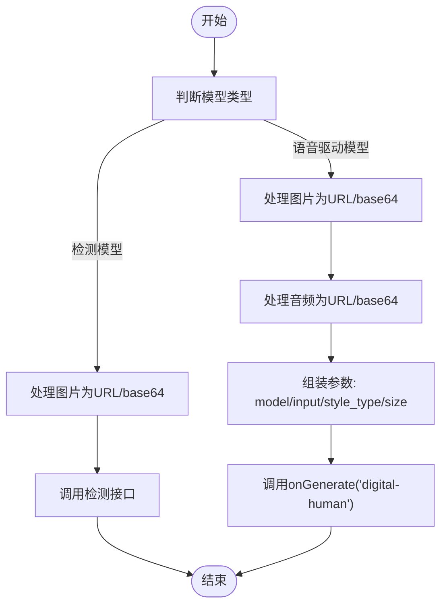
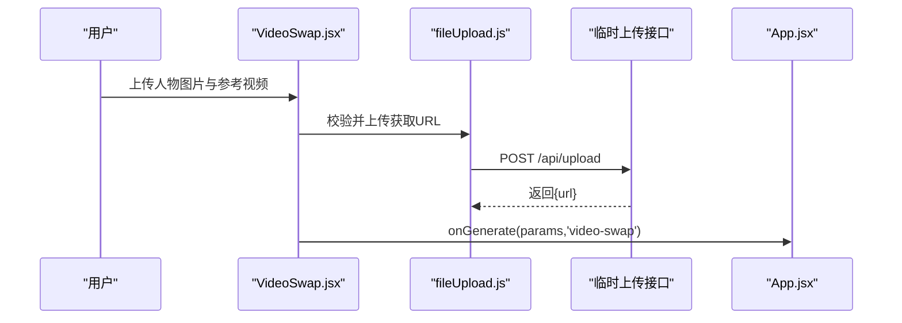
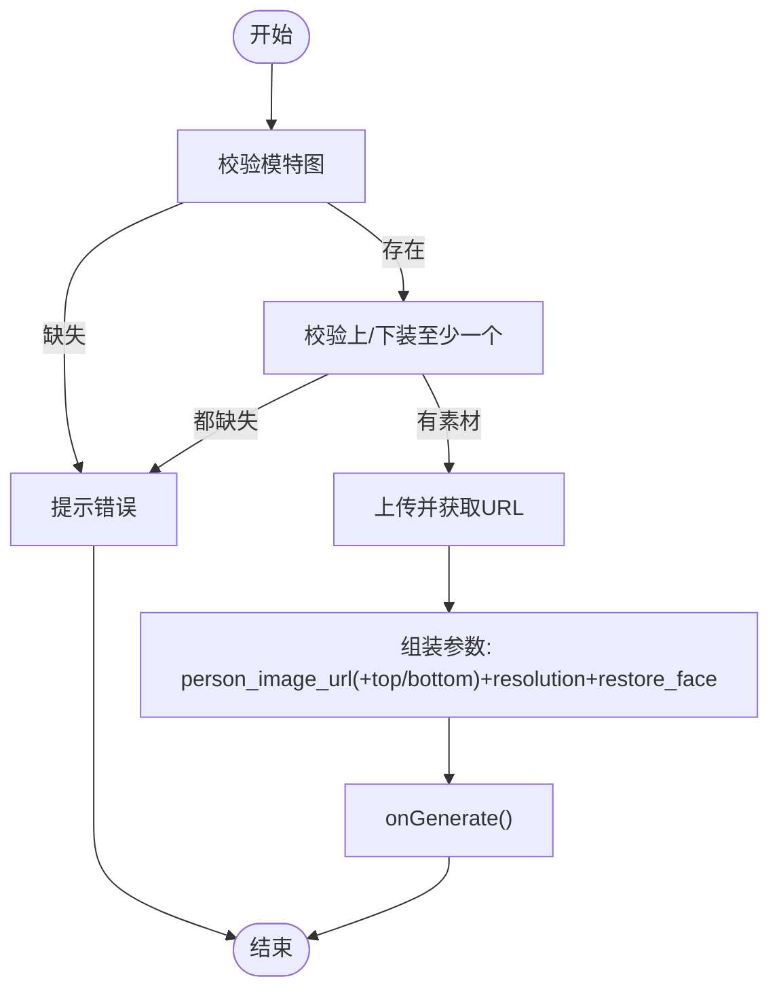
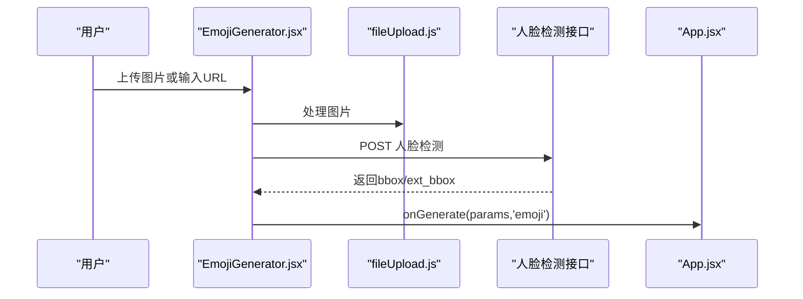
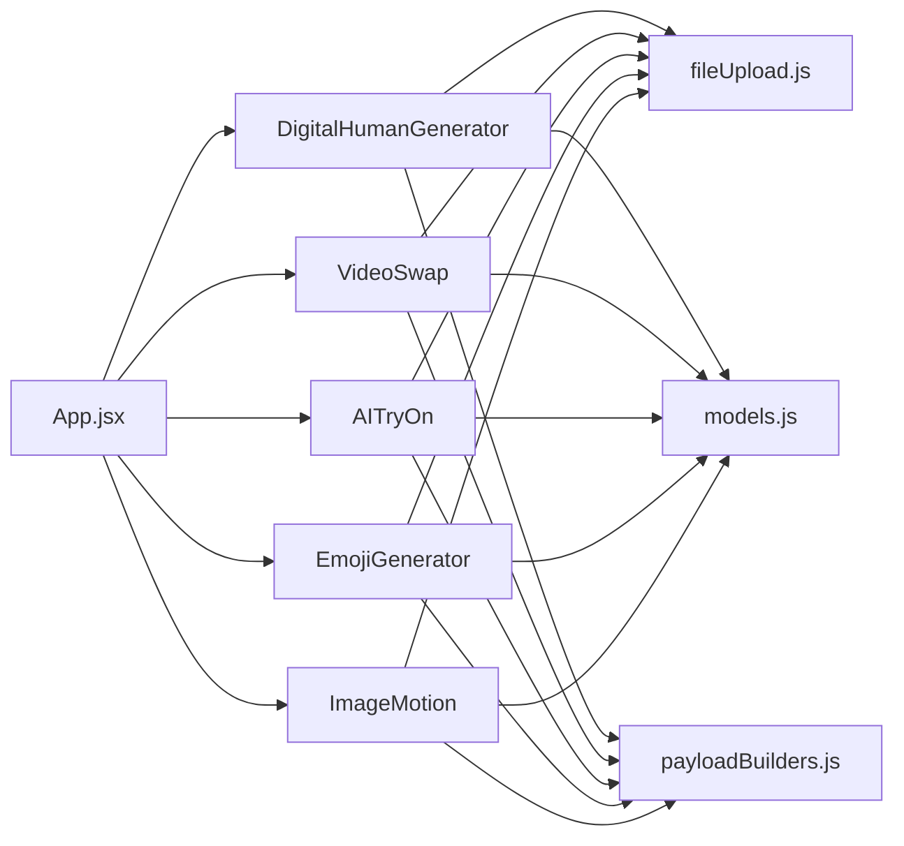

# 专用生成器

<cite>
**本文引用的文件**
- [src/components/DigitalHumanGenerator.jsx](file://src/components/DigitalHumanGenerator.jsx)
- [src/components/VideoSwap.jsx](file://src/components/VideoSwap.jsx)
- [src/components/AITryOn.jsx](file://src/components/AITryOn.jsx)
- [src/components/EmojiGenerator.jsx](file://src/components/EmojiGenerator.jsx)
- [src/components/ImageMotion.jsx](file://src/components/ImageMotion.jsx)
- [src/utils/fileUpload.js](file://src/utils/fileUpload.js)
- [src/config/models.js](file://src/config/models.js)
- [src/services/payloadBuilders.js](file://src/services/payloadBuilders.js)
- [src/App.jsx](file://src/App.jsx)
</cite>

## 目录
1. [简介](#简介)
2. [项目结构](#项目结构)
3. [核心组件](#核心组件)
4. [架构总览](#架构总览)
5. [详细组件分析](#详细组件分析)
6. [依赖关系分析](#依赖关系分析)
7. [性能考量](#性能考量)
8. [故障排查指南](#故障排查指南)
9. [结论](#结论)
10. [附录](#附录)

## 简介
本文件面向“专用生成器”组件，系统性梳理数字人生成(DigitalHumanGenerator)、视频换人(VideoSwap)、AI试衣(AITryOn)、表情包视频生成(EmojiGenerator)与图生动作(ImageMotion)五大专业AI生成器。文档从架构、数据流、处理逻辑、参数配置策略、与通用生成器的差异与优势、性能优化与最佳实践等方面进行深入解析，帮助开发者与产品人员高效理解与落地应用。

## 项目结构
专用生成器位于前端组件层，围绕“专用生成器组件 + 工具函数 + 配置与请求构建器”的协作模式组织：
- 组件层：各专用生成器负责UI交互、输入校验、参数组装与触发任务
- 工具层：文件上传与压缩、URL/文件/base64处理、通用校验
- 配置层：模型能力、协议、端点、分辨率映射等
- 请求构建层：按模型能力策略化构造请求载荷
- 应用入口：App.jsx路由到各专用生成器页面

图表来源
- [src/App.jsx](file://src/App.jsx#L270-L344)
- [src/components/DigitalHumanGenerator.jsx](file://src/components/DigitalHumanGenerator.jsx#L1-L313)
- [src/components/VideoSwap.jsx](file://src/components/VideoSwap.jsx#L1-L212)
- [src/components/AITryOn.jsx](file://src/components/AITryOn.jsx#L1-L251)
- [src/components/EmojiGenerator.jsx](file://src/components/EmojiGenerator.jsx#L1-L273)
- [src/components/ImageMotion.jsx](file://src/components/ImageMotion.jsx#L1-L212)
- [src/utils/fileUpload.js](file://src/utils/fileUpload.js#L1-L182)
- [src/config/models.js](file://src/config/models.js#L790-L904)
- [src/services/payloadBuilders.js](file://src/services/payloadBuilders.js#L715-L798)

章节来源
- [src/App.jsx](file://src/App.jsx#L270-L344)

## 核心组件
- 数字人生成(DigitalHumanGenerator)：支持语音驱动视频与图像检测；输入图片+音频，输出说话/唱歌/表演风格的视频；支持分辨率与动作类型选择。
- 视频换人(VideoSwap)：以人物图片与参考视频为基础，将视频中的角色替换为目标人物，支持标准/专业模式与分辨率选择。
- AI试衣(AITryOn)：以模特图与上/下装图为基础，生成虚拟试穿图像；支持模型版本、分辨率与人脸处理策略。
- 表情包视频生成(EmojiGenerator)：基于人脸检测坐标与模板ID，将静态肖像转换为带表情的视频；支持模板选择与分辨率。
- 图生动作(ImageMotion)：将参考视频的动作/表情迁移到人物图片上，生成动态视频；支持标准/专业模式与分辨率。

章节来源
- [src/components/DigitalHumanGenerator.jsx](file://src/components/DigitalHumanGenerator.jsx#L1-L313)
- [src/components/VideoSwap.jsx](file://src/components/VideoSwap.jsx#L1-L212)
- [src/components/AITryOn.jsx](file://src/components/AITryOn.jsx#L1-L251)
- [src/components/EmojiGenerator.jsx](file://src/components/EmojiGenerator.jsx#L1-L273)
- [src/components/ImageMotion.jsx](file://src/components/ImageMotion.jsx#L1-L212)

## 架构总览
专用生成器遵循“组件-工具-配置-构建器-应用入口”的分层协作：
- 组件负责收集用户输入、调用工具函数进行文件处理、按模型能力组装参数、调用统一任务执行器
- 工具函数提供文件上传、压缩、URL/文件/base64互转、校验
- 配置文件提供模型能力、端点、协议、分辨率映射
- 构建器按模型能力策略化生成请求载荷
- 应用入口负责路由到各专用生成器页面

图表来源
- [src/components/DigitalHumanGenerator.jsx](file://src/components/DigitalHumanGenerator.jsx#L73-L130)
- [src/components/VideoSwap.jsx](file://src/components/VideoSwap.jsx#L20-L47)
- [src/components/AITryOn.jsx](file://src/components/AITryOn.jsx#L15-L50)
- [src/components/EmojiGenerator.jsx](file://src/components/EmojiGenerator.jsx#L100-L137)
- [src/components/ImageMotion.jsx](file://src/components/ImageMotion.jsx#L20-L47)
- [src/utils/fileUpload.js](file://src/utils/fileUpload.js#L114-L144)
- [src/config/models.js](file://src/config/models.js#L790-L904)
- [src/services/payloadBuilders.js](file://src/services/payloadBuilders.js#L715-L798)
- [src/App.jsx](file://src/App.jsx#L55-L61)

## 详细组件分析

### 数字人生成(DigitalHumanGenerator)
- 输入与处理
  - 支持图片与音频的URL或文件上传；图片与音频分别处理为base64或URL
  - 图像检测模型(wan2.2-s2v-detect)仅需图片；语音驱动模型(wan2.2-s2v)需图片+音频
- 参数与策略
  - 模型选择：语音驱动视频/图像检测
  - 动作类型：说话、唱歌、表演
  - 分辨率：480P/720P
  - 面向语音驱动视频时，附加size参数
- 关键流程
  - 图片处理成功后，若为检测模型则仅传入图片；否则还需音频处理
  - 统一调用onGenerate(params, 'digital-human')

图表来源
- [src/components/DigitalHumanGenerator.jsx](file://src/components/DigitalHumanGenerator.jsx#L73-L130)
- [src/utils/fileUpload.js](file://src/utils/fileUpload.js#L114-L144)

章节来源
- [src/components/DigitalHumanGenerator.jsx](file://src/components/DigitalHumanGenerator.jsx#L1-L313)
- [src/utils/fileUpload.js](file://src/utils/fileUpload.js#L1-L182)
- [src/config/models.js](file://src/config/models.js#L790-L830)
- [src/services/payloadBuilders.js](file://src/services/payloadBuilders.js#L715-L742)

### 视频换人(VideoSwap)
- 输入与处理
  - 人物图片与参考视频上传，限制大小与类型
  - 通过临时上传接口获取远端URL
- 参数与策略
  - 模型：wan2.2-animate-mix
  - 模式：标准/专业
  - 分辨率：480P/720P
  - check_image: true
- 关键流程
  - 校验图片与视频均存在
  - 上传至临时服务器获取URL
  - 组装参数并调用onGenerate('video-swap')

图表来源
- [src/components/VideoSwap.jsx](file://src/components/VideoSwap.jsx#L20-L64)
- [src/utils/fileUpload.js](file://src/utils/fileUpload.js#L49-L64)
- [src/App.jsx](file://src/App.jsx#L331-L344)

章节来源
- [src/components/VideoSwap.jsx](file://src/components/VideoSwap.jsx#L1-L212)
- [src/utils/fileUpload.js](file://src/utils/fileUpload.js#L1-L182)
- [src/config/models.js](file://src/config/models.js#L831-L853)
- [src/services/payloadBuilders.js](file://src/services/payloadBuilders.js#L767-L780)

### AI试衣(AITryOn)
- 输入与处理
  - 模特图必填；上/下装图任选其一
  - 上传获取URL并本地预览
- 参数与策略
  - 模型：aitryon/aitryon-plus
  - 分辨率：同原图/576x1024/720x1280
  - 人脸处理：保留原脸/随机生成新脸
- 关键流程
  - 校验模特图存在
  - 可选地上传上/下装图
  - 组装参数并调用onGenerate

图表来源
- [src/components/AITryOn.jsx](file://src/components/AITryOn.jsx#L15-L50)
- [src/utils/fileUpload.js](file://src/utils/fileUpload.js#L6-L18)

章节来源
- [src/components/AITryOn.jsx](file://src/components/AITryOn.jsx#L1-L251)
- [src/utils/fileUpload.js](file://src/utils/fileUpload.js#L1-L182)
- [src/config/models.js](file://src/config/models.js#L690-L735)
- [src/services/payloadBuilders.js](file://src/services/payloadBuilders.js#L403-L425)

### 表情包视频生成(EmojiGenerator)
- 输入与处理
  - 支持URL或文件上传；先进行人脸检测，获取bbox与ext_bbox
- 参数与策略
  - 模型：emoji-v1
  - 模板：内置多套模板分类
  - 分辨率：480P/720P
- 关键流程
  - 处理图片为URL/base64
  - 调用人脸检测接口获取bbox
  - 组装参数(driven_id/face_bbox/ext_bbox)并调用onGenerate('emoji')

图表来源
- [src/components/EmojiGenerator.jsx](file://src/components/EmojiGenerator.jsx#L67-L98)
- [src/components/EmojiGenerator.jsx](file://src/components/EmojiGenerator.jsx#L100-L137)
- [src/utils/fileUpload.js](file://src/utils/fileUpload.js#L114-L144)

章节来源
- [src/components/EmojiGenerator.jsx](file://src/components/EmojiGenerator.jsx#L1-L273)
- [src/utils/fileUpload.js](file://src/utils/fileUpload.js#L1-L182)
- [src/config/models.js](file://src/config/models.js#L876-L903)
- [src/services/payloadBuilders.js](file://src/services/payloadBuilders.js#L747-L762)

### 图生动作(ImageMotion)
- 输入与处理
  - 人物图片与参考视频上传，限制大小与类型
  - 通过临时上传接口获取远端URL
- 参数与策略
  - 模型：wan2.2-animate-move
  - 模式：标准/专业
  - 分辨率：480P/720P
  - check_image: true
- 关键流程
  - 校验图片与视频均存在
  - 上传至临时服务器获取URL
  - 组装参数并调用onGenerate('image-motion')

图表来源
- [src/components/ImageMotion.jsx](file://src/components/ImageMotion.jsx#L20-L64)
- [src/utils/fileUpload.js](file://src/utils/fileUpload.js#L49-L64)
- [src/App.jsx](file://src/App.jsx#L301-L314)

章节来源
- [src/components/ImageMotion.jsx](file://src/components/ImageMotion.jsx#L1-L212)
- [src/utils/fileUpload.js](file://src/utils/fileUpload.js#L1-L182)
- [src/config/models.js](file://src/config/models.js#L854-L875)
- [src/services/payloadBuilders.js](file://src/services/payloadBuilders.js#L785-L798)

## 依赖关系分析
- 组件与工具函数
  - 各组件均依赖文件处理工具(fileUpload.js)，用于base64转换、压缩、URL校验、文件校验与上传
- 组件与配置
  - 各组件读取模型配置(models.js)，了解端点、协议、能力与默认分辨率
- 组件与构建器
  - 各组件最终通过payloadBuilders.js按模型能力构造请求体
- 应用入口
  - App.jsx统一调度任务执行，各组件通过onGenerate触发

图表来源
- [src/components/DigitalHumanGenerator.jsx](file://src/components/DigitalHumanGenerator.jsx#L1-L12)
- [src/components/VideoSwap.jsx](file://src/components/VideoSwap.jsx#L1-L4)
- [src/components/AITryOn.jsx](file://src/components/AITryOn.jsx#L1-L3)
- [src/components/EmojiGenerator.jsx](file://src/components/EmojiGenerator.jsx#L1-L4)
- [src/components/ImageMotion.jsx](file://src/components/ImageMotion.jsx#L1-L4)
- [src/utils/fileUpload.js](file://src/utils/fileUpload.js#L1-L182)
- [src/config/models.js](file://src/config/models.js#L790-L904)
- [src/services/payloadBuilders.js](file://src/services/payloadBuilders.js#L715-L798)
- [src/App.jsx](file://src/App.jsx#L270-L344)

章节来源
- [src/utils/fileUpload.js](file://src/utils/fileUpload.js#L1-L182)
- [src/config/models.js](file://src/config/models.js#L790-L904)
- [src/services/payloadBuilders.js](file://src/services/payloadBuilders.js#L715-L798)
- [src/App.jsx](file://src/App.jsx#L270-L344)

## 性能考量
- 文件体积与压缩
  - 当图片超过8MB时，自动压缩以降低base64体积，避免传输与API限制
- 上传策略
  - 视频换人与图生动作采用临时上传接口获取URL，减少前端内存压力
- 分辨率与模式
  - 480P/720P选择影响生成时长与资源消耗；专业模式在相同分辨率下通常更耗时但质量更优
- 人脸检测前置
  - 表情包视频生成先做检测，确保bbox有效，避免无效请求导致的失败重试
- 并发与节流
  - 建议在组件层面增加防抖与并发控制，避免短时间内多次触发任务

章节来源
- [src/utils/fileUpload.js](file://src/utils/fileUpload.js#L6-L18)
- [src/components/VideoSwap.jsx](file://src/components/VideoSwap.jsx#L49-L64)
- [src/components/ImageMotion.jsx](file://src/components/ImageMotion.jsx#L49-L64)
- [src/components/EmojiGenerator.jsx](file://src/components/EmojiGenerator.jsx#L67-L98)

## 故障排查指南
- 常见错误与提示
  - 图片/音频/视频为空：组件会弹出提示并阻止提交
  - URL格式不合法：使用URL输入时会校验协议
  - 文件类型/大小不合规：上传前进行类型与大小校验
  - 生成失败：捕获异常并提示错误信息
- 人脸检测失败
  - 表情包视频生成在检测阶段抛错或返回空结果时，会中断后续流程
- 临时上传失败
  - 上传接口响应非2xx时抛出错误，需检查网络与后端服务

章节来源
- [src/components/DigitalHumanGenerator.jsx](file://src/components/DigitalHumanGenerator.jsx#L23-L50)
- [src/components/VideoSwap.jsx](file://src/components/VideoSwap.jsx#L12-L18)
- [src/components/AITryOn.jsx](file://src/components/AITryOn.jsx#L52-L104)
- [src/components/EmojiGenerator.jsx](file://src/components/EmojiGenerator.jsx#L56-L65)
- [src/components/ImageMotion.jsx](file://src/components/ImageMotion.jsx#L12-L18)
- [src/utils/fileUpload.js](file://src/utils/fileUpload.js#L92-L99)
- [src/utils/fileUpload.js](file://src/utils/fileUpload.js#L149-L167)

## 结论
专用生成器通过“组件-工具-配置-构建器-应用入口”的分层设计，实现了数字人、视频换人、AI试衣、表情包视频与图生动作等专业场景的标准化接入。其优势在于：
- 参数与能力由配置驱动，便于扩展新模型
- 请求构建器按能力策略化生成，降低重复逻辑
- 统一的任务执行入口简化了业务集成
- 针对不同场景的输入约束与前置检测提升了成功率与用户体验

## 附录

### 专用生成器与通用生成器的差异与优势
- 差异
  - 专用生成器针对特定任务域，输入约束更严格、参数更聚焦；通用生成器覆盖更广但参数复杂度更高
- 优势
  - 专用生成器界面简洁、参数少、易用性强；在特定任务上具备更高的成功率与一致性

### 参数配置策略与最佳实践
- 输入素材要求
  - 数字人：图片清晰、单人正面；音频与图片配合
  - 视频换人/图生动作：图片与视频均需清晰稳定
  - AI试衣：模特图全身正面、光照均匀；服装图平铺背景干净
  - 表情包：单人正面、无遮挡、头部姿态端正
- 风格控制
  - 数字人：动作类型(说话/唱歌/表演)与分辨率
  - AI试衣：模型版本(基础/Plus)、分辨率、人脸处理策略
  - 表情包：模板选择与分辨率
- 输出质量优化
  - 优先使用720P以平衡质量与时长
  - 专业模式在对质量敏感场景优先考虑
  - AI试衣Plus版在纹理与Logo还原方面更优

### 业务场景与用户需求
- 数字人：短视频口播、虚拟主播、教学视频
- 视频换人：影视后期、短视频特效、角色替换
- AI试衣：电商试衣、品牌营销、虚拟展示
- 表情包：社交娱乐、表情包工厂、短视频配乐
- 图生动作：动画制作、角色演示、动作迁移