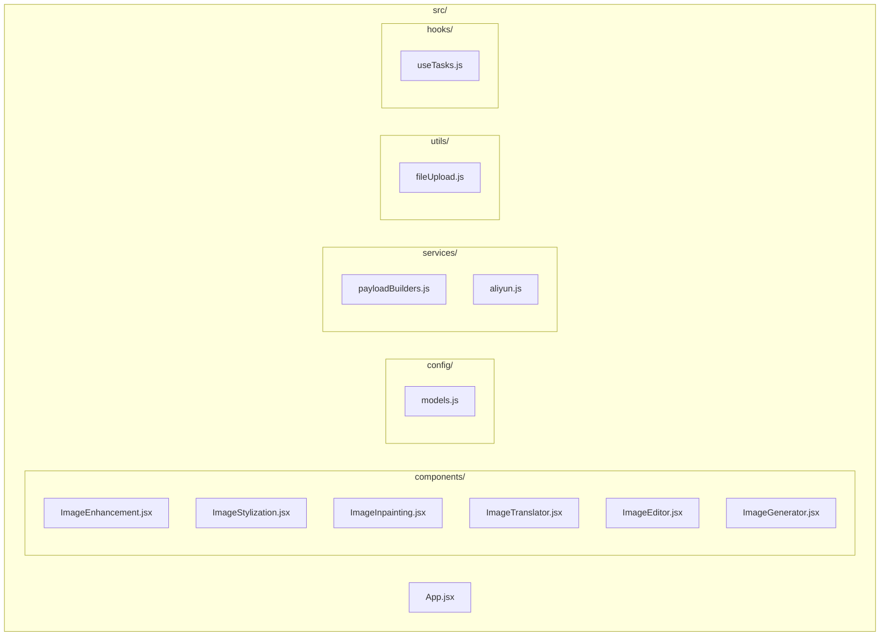
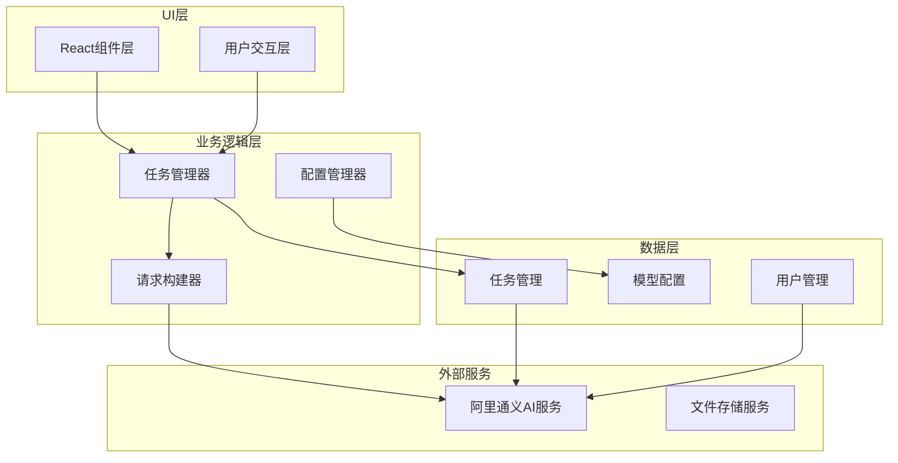
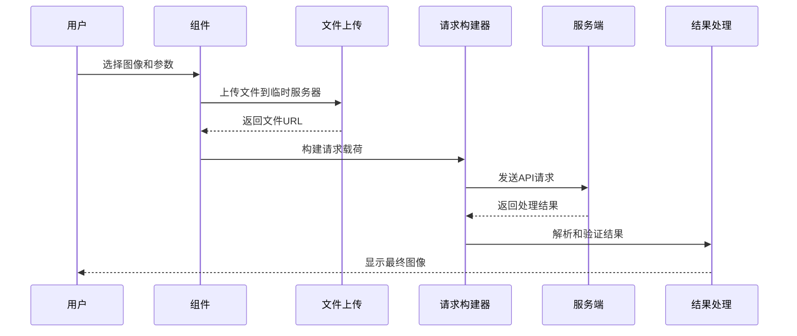
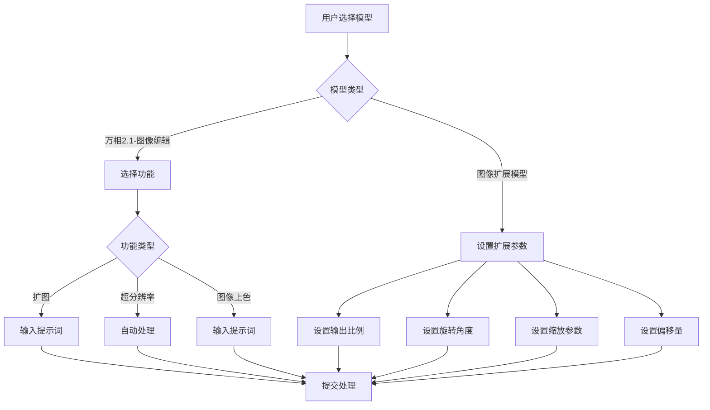
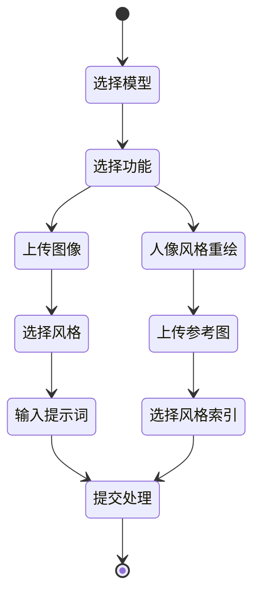
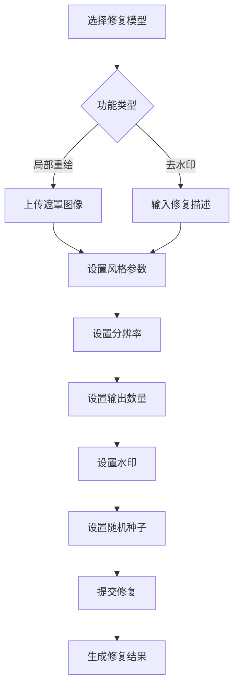
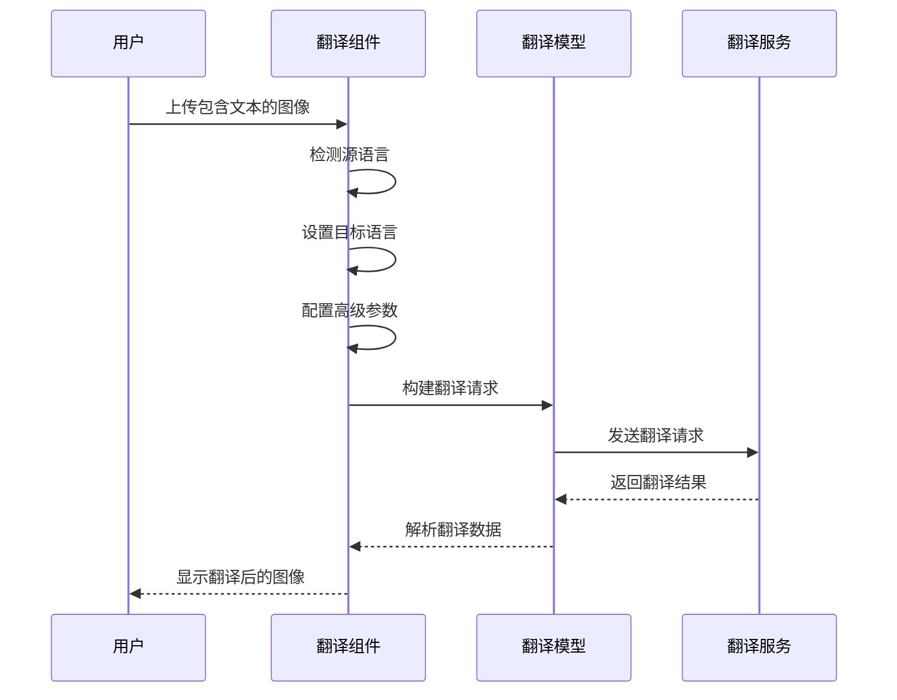
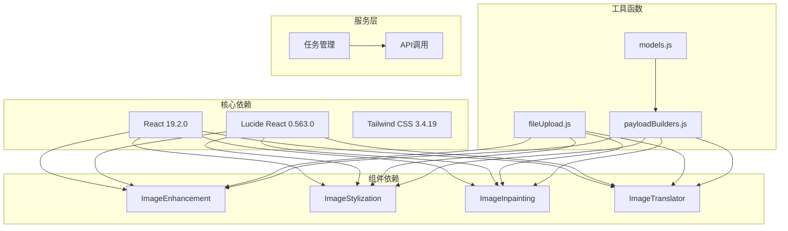
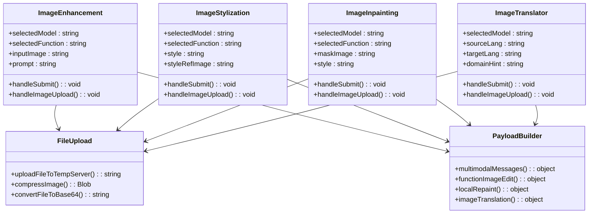
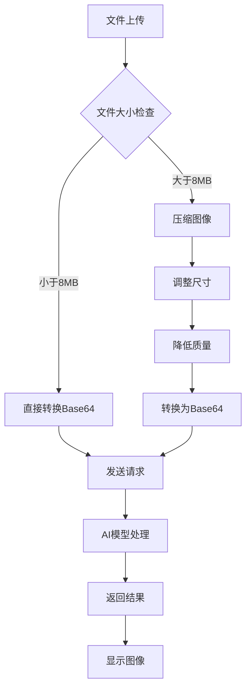

# 图像增强工具

<cite>
**本文档引用的文件**
- [ImageEnhancement.jsx](file://src/components/ImageEnhancement.jsx)
- [ImageStylization.jsx](file://src/components/ImageStylization.jsx)
- [ImageInpainting.jsx](file://src/components/ImageInpainting.jsx)
- [ImageTranslator.jsx](file://src/components/ImageTranslator.jsx)
- [models.js](file://src/config/models.js)
- [fileUpload.js](file://src/utils/fileUpload.js)
- [payloadBuilders.js](file://src/services/payloadBuilders.js)
- [App.jsx](file://src/App.jsx)
- [package.json](file://package.json)
</cite>

## 目录
1. [简介](#简介)
2. [项目结构](#项目结构)
3. [核心组件](#核心组件)
4. [架构概览](#架构概览)
5. [详细组件分析](#详细组件分析)
6. [依赖关系分析](#依赖关系分析)
7. [性能考虑](#性能考虑)
8. [故障排除指南](#故障排除指南)
9. [结论](#结论)
10. [附录](#附录)

## 简介

本项目是一个基于React的图像处理工具集合，专注于提供专业的图像增强、风格迁移、修复重绘和图像翻译功能。系统采用现代化的前端架构，集成了阿里通义实验室的多模态AI模型，为用户提供直观易用的图像处理体验。

项目的核心特色包括：
- **多模型集成**：支持万相2.x系列和通义千问系列AI模型
- **丰富的图像处理功能**：涵盖增强、风格化、修复、翻译等多个领域
- **用户友好的界面设计**：提供拖拽上传、实时预览、批量处理等功能
- **灵活的参数配置**：支持详细的增强强度控制、风格选择、修复区域定义等
- **高性能优化**：包含图像压缩、缓存策略等性能优化措施

## 项目结构

项目采用模块化的组件架构，主要目录结构如下：



**图表来源**
- [App.jsx](file://src/App.jsx#L1-L377)
- [models.js](file://src/config/models.js#L1-L1012)

**章节来源**
- [package.json](file://package.json#L1-L33)
- [App.jsx](file://src/App.jsx#L1-L377)

## 核心组件

系统包含四个主要的图像处理组件，每个组件都针对特定的图像处理需求进行了专门优化：

### 组件功能概览

| 组件 | 主要功能 | 支持模型 | 核心特性 |
|------|----------|----------|----------|
| ImageEnhancement | 图像增强 | 万相2.1-图像编辑、图像扩展 | 扩图、超分辨率、图像上色 |
| ImageStylization | 风格迁移 | 万相2.1-图像风格化、人像风格重绘 | 全局风格化、局部风格化、人像风格 |
| ImageInpainting | 修复重绘 | 万相2.1-图像修复、局部重绘模型 | 局部重绘、去水印、遮罩编辑 |
| ImageTranslator | 图像翻译 | 通义千问-图像翻译 | 多语言翻译、文本识别 |

**章节来源**
- [ImageEnhancement.jsx](file://src/components/ImageEnhancement.jsx#L1-L513)
- [ImageStylization.jsx](file://src/components/ImageStylization.jsx#L1-L473)
- [ImageInpainting.jsx](file://src/components/ImageInpainting.jsx#L1-L482)
- [ImageTranslator.jsx](file://src/components/ImageTranslator.jsx#L1-L301)

## 架构概览

系统采用分层架构设计，确保了良好的可维护性和扩展性：



**图表来源**
- [App.jsx](file://src/App.jsx#L42-L70)
- [payloadBuilders.js](file://src/services/payloadBuilders.js#L804-L828)

### 数据流架构



**图表来源**
- [fileUpload.js](file://src/utils/fileUpload.js#L6-L18)
- [payloadBuilders.js](file://src/services/payloadBuilders.js#L125-L150)

**章节来源**
- [App.jsx](file://src/App.jsx#L42-L70)
- [payloadBuilders.js](file://src/services/payloadBuilders.js#L804-L828)

## 详细组件分析

### 图像增强组件 (ImageEnhancement)

图像增强组件提供了三种核心功能：扩图、超分辨率和图像上色。

#### 功能特性



**图表来源**
- [ImageEnhancement.jsx](file://src/components/ImageEnhancement.jsx#L94-L150)

#### 参数配置详解

| 参数类别 | 参数名称 | 默认值 | 说明 |
|----------|----------|--------|------|
| 基础设置 | 模型选择 | wanx2.1-imageedit | 选择使用的AI模型 |
| 基础设置 | 功能选择 | expand | 选择具体功能类型 |
| 基础设置 | 输出数量 | 1 | 生成图像的数量 |
| 高级设置 | 水印 | false | 是否添加水印 |
| 高级设置 | 随机种子 | 空 | 控制生成的随机性 |
| 扩图参数 | 输出比例 | 空 | 设置输出图像的比例 |
| 扩图参数 | 旋转角度 | 0 | 图像旋转角度 |
| 扩图参数 | X轴缩放 | 1.0 | X轴缩放比例 |
| 扩图参数 | Y轴缩放 | 1.0 | Y轴缩放比例 |
| 扩图参数 | 上边偏移 | 0 | 上边扩展像素数 |
| 扩图参数 | 下边偏移 | 0 | 下边扩展像素数 |
| 扩图参数 | 左边偏移 | 0 | 左边扩展像素数 |
| 扩图参数 | 右边偏移 | 0 | 右边扩展像素数 |
| 扩图参数 | 最佳质量 | false | 是否启用高质量模式 |
| 扩图参数 | 限制图像大小 | true | 是否限制最大尺寸 |
| 扩图参数 | 添加水印 | true | 是否添加水印 |

**章节来源**
- [ImageEnhancement.jsx](file://src/components/ImageEnhancement.jsx#L31-L150)

### 图像风格迁移组件 (ImageStylization)

图像风格迁移组件支持全局风格化和局部风格化两种模式。

#### 风格化流程



**图表来源**
- [ImageStylization.jsx](file://src/components/ImageStylization.jsx#L113-L174)

#### 风格选项配置

| 风格类型 | 预设风格 | 描述 |
|----------|----------|------|
| 全局风格化 | 自动 | 智能匹配最佳风格 |
| 全局风格化 | 法国绘本风格 | 法国风格的插画效果 |
| 全局风格化 | 超现实主义 | 超现实主义艺术风格 |
| 局部风格化 | 木板风格 | 木质纹理效果 |
| 局部风格化 | 金属风格 | 金属质感效果 |
| 局部风格化 | 玻璃风格 | 玻璃透明质感 |
| 局部风格化 | 陶瓷风格 | 陶瓷材质效果 |
| 局部风格化 | 布料风格 | 布料纹理效果 |
| 人像风格重绘 | 风格0 | 自然人像风格 |
| 人像风格重绘 | 风格1 | 艺术风格1 |
| 人像风格重绘 | 风格2 | 艺术风格2 |
| 人像风格重绘 | 风格3 | 艺术风格3 |
| 人像风格重绘 | 风格4 | 艺术风格4 |
| 人像风格重绘 | 自定义风格 | 使用参考图片 |

**章节来源**
- [ImageStylization.jsx](file://src/components/ImageStylization.jsx#L49-L174)

### 图像修复重绘组件 (ImageInpainting)

图像修复重绘组件提供了局部重绘和去水印两大功能。

#### 修复流程设计



**图表来源**
- [ImageInpainting.jsx](file://src/components/ImageInpainting.jsx#L101-L172)

#### 遮罩颜色配置

| 颜色选项 | RGB值 | 用途 |
|----------|-------|------|
| 白色遮罩 | 255,255,255 | 需要编辑的区域 |
| 红色遮罩 | 255,0,0 | 红色通道标识 |
| 绿色遮罩 | 0,255,0 | 绿色通道标识 |
| 蓝色遮罩 | 0,0,255 | 蓝色通道标识 |

#### 风格参数配置

| 风格类型 | 描述 |
|----------|------|
| 自动 | 智能匹配最佳风格 |
| 3D卡通 | 3D动画风格效果 |
| 动漫 | 日式动漫风格 |
| 油画 | 经典油画风格 |
| 水彩 | 水彩画风格 |
| 素描 | 素描画风格 |

**章节来源**
- [ImageInpainting.jsx](file://src/components/ImageInpainting.jsx#L37-L172)

### 图像翻译组件 (ImageTranslator)

图像翻译组件专门处理图像中的文本识别和翻译功能。

#### 翻译工作流程



**图表来源**
- [ImageTranslator.jsx](file://src/components/ImageTranslator.jsx#L51-L96)

#### 语言支持列表

| 语言代码 | 语言名称 | 国旗标志 |
|----------|----------|----------|
| zh | 简体中文 | 🇨🇳 |
| en | 英文 | 🇺🇸 |
| ja | 日文 | 🇯🇵 |
| ko | 韩语 | 🇰🇷 |
| es | 西班牙语 | 🇪🇸 |
| fr | 法语 | 🇫🇷 |
| ru | 俄语 | 🇷🇺 |
| pt | 葡萄牙语 | 🇵🇹 |
| it | 意大利语 | 🇮🇹 |
| vi | 越南语 | 🇻🇳 |
| ms | 马来语 | 🇲🇾 |
| th | 泰语 | 🇹🇭 |
| id | 印尼语 | 🇮🇩 |
| ar | 阿拉伯语 | 🇸🇦 |

#### 高级翻译参数

| 参数名称 | 类型 | 描述 |
|----------|------|------|
| 领域提示 | 文本 | 描述使用场景或译文风格 |
| 敏感词过滤 | 逗号分隔列表 | 需要过滤的敏感词汇 |
| 术语干预 | 多行文本 | 格式：原文=译文 的术语对照表 |

**章节来源**
- [ImageTranslator.jsx](file://src/components/ImageTranslator.jsx#L23-L96)

## 依赖关系分析

系统采用模块化设计，各组件之间通过清晰的接口进行通信。



**图表来源**
- [package.json](file://package.json#L12-L16)
- [payloadBuilders.js](file://src/services/payloadBuilders.js#L804-L828)

### 组件间交互关系



**图表来源**
- [ImageEnhancement.jsx](file://src/components/ImageEnhancement.jsx#L31-L150)
- [ImageStylization.jsx](file://src/components/ImageStylization.jsx#L49-L174)
- [ImageInpainting.jsx](file://src/components/ImageInpainting.jsx#L37-L172)
- [ImageTranslator.jsx](file://src/components/ImageTranslator.jsx#L23-L96)

**章节来源**
- [package.json](file://package.json#L12-L31)
- [payloadBuilders.js](file://src/services/payloadBuilders.js#L804-L828)

## 性能考虑

系统在多个层面实现了性能优化策略，确保用户获得流畅的使用体验。

### 图像处理优化



**图表来源**
- [fileUpload.js](file://src/utils/fileUpload.js#L6-L18)

### 性能优化策略

1. **智能图像压缩**
   - 自动检测文件大小超过8MB的图像
   - 使用Canvas API进行无损压缩
   - 最大宽度和高度限制为2048px
   - 质量压缩参数默认0.8

2. **内存管理**
   - 使用URL.createObjectURL创建临时预览
   - 在组件卸载时清理事件监听器
   - 及时释放图像数据URL

3. **网络优化**
   - 统一的任务管理器处理并发请求
   - 错误重试机制避免单点故障
   - 进度状态管理提升用户体验

4. **渲染优化**
   - 条件渲染减少DOM节点
   - 懒加载高级设置面板
   - 防抖处理频繁的参数变更

**章节来源**
- [fileUpload.js](file://src/utils/fileUpload.js#L40-L87)
- [ImageEnhancement.jsx](file://src/components/ImageEnhancement.jsx#L56-L65)

## 故障排除指南

### 常见问题及解决方案

#### 图像上传问题

| 问题症状 | 可能原因 | 解决方案 |
|----------|----------|----------|
| 上传失败 | 文件过大 | 使用压缩功能或选择更小的图像 |
| 格式不支持 | 非图像文件 | 确保上传JPG、PNG、WEBP格式 |
| 预览不显示 | Base64转换错误 | 检查浏览器兼容性和文件完整性 |
| 处理超时 | 网络连接不稳定 | 检查网络状态并重试 |

#### 模型调用错误

| 错误类型 | 错误信息 | 解决方案 |
|----------|----------|----------|
| 缺少API密钥 | "请先设置API密钥" | 在设置中输入有效的API密钥 |
| 参数缺失 | "必须上传至少一张图片" | 确保选择了正确的功能并上传必要文件 |
| 模型不支持 | "功能不支持" | 检查所选模型是否支持该功能 |
| 超出配额 | "超出API配额" | 等待配额恢复或升级账户 |

#### 性能问题

| 问题表现 | 影响因素 | 优化建议 |
|----------|----------|----------|
| 页面卡顿 | 大量图像同时处理 | 减少并发任务数量 |
| 加载缓慢 | 网络延迟 | 使用CDN或本地代理 |
| 内存泄漏 | 事件监听器未清理 | 检查组件生命周期钩子 |
| 渲染异常 | 状态更新冲突 | 使用React DevTools调试 |

**章节来源**
- [ImageEnhancement.jsx](file://src/components/ImageEnhancement.jsx#L76-L92)
- [ImageStylization.jsx](file://src/components/ImageStylization.jsx#L86-L111)
- [ImageInpainting.jsx](file://src/components/ImageInpainting.jsx#L74-L99)

## 结论

本图像增强工具组件集合展现了现代前端技术与AI能力的完美结合。通过精心设计的架构和丰富的功能特性，系统为用户提供了专业级的图像处理体验。

### 技术优势

1. **模块化设计**：清晰的组件分离便于维护和扩展
2. **AI集成深度**：充分利用阿里通义实验室的多模态模型能力
3. **用户体验优化**：直观的界面设计和流畅的操作流程
4. **性能考虑周全**：从图像压缩到网络优化的全方位优化
5. **错误处理完善**：全面的异常处理和用户反馈机制

### 未来发展建议

1. **功能扩展**：可以考虑添加更多AI模型支持和图像处理功能
2. **性能提升**：实现客户端缓存和离线处理能力
3. **用户体验**：增加撤销/重做功能和批量处理选项
4. **国际化支持**：扩展多语言界面和帮助文档
5. **移动端适配**：优化触摸交互和响应式设计

该系统为图像处理领域的技术创新提供了良好的基础，具备进一步发展的巨大潜力。

## 附录

### API配置参考

系统使用阿里通义实验室提供的API服务，所有请求都遵循统一的协议规范。

#### 模型配置结构

```javascript
{
  id: '模型唯一标识符',
  name: '模型显示名称',
  provider: '提供商名称',
  description: '模型功能描述',
  protocol: '通信协议类型',
  endpoint: 'API端点路径',
  requestFormat: '请求格式类型',
  outputType: '输出类型',
  defaultRes: '默认分辨率',
  resolutions: '支持的分辨率数组',
  capabilities: '模型功能特性配置'
}
```

#### 请求格式映射

| 请求格式 | 对应组件 | 用途 |
|----------|----------|------|
| multimodalMessages | 图像编辑 | 多模态消息格式 |
| functionImageEdit | 图像增强 | 函数式图像编辑 |
| localRepaint | 图像修复 | 局部重绘处理 |
| imageTranslation | 图像翻译 | 文本翻译处理 |
| text2image | 文生图 | 文本到图像生成 |

**章节来源**
- [models.js](file://src/config/models.js#L265-L788)
- [payloadBuilders.js](file://src/services/payloadBuilders.js#L804-L828)