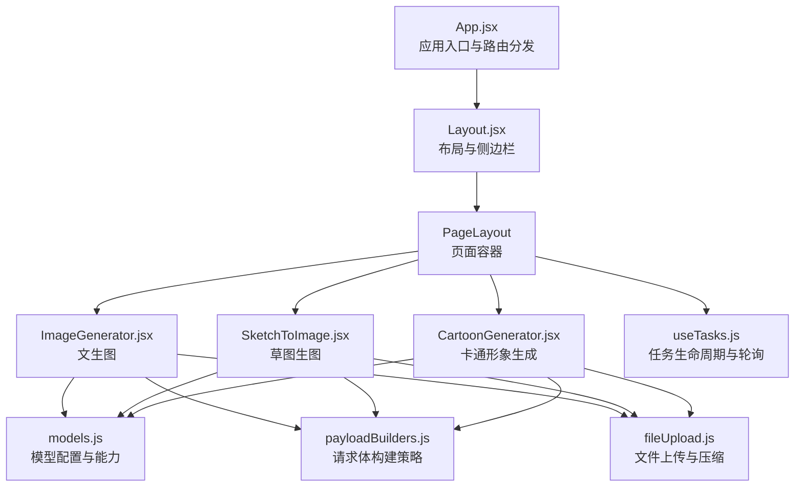
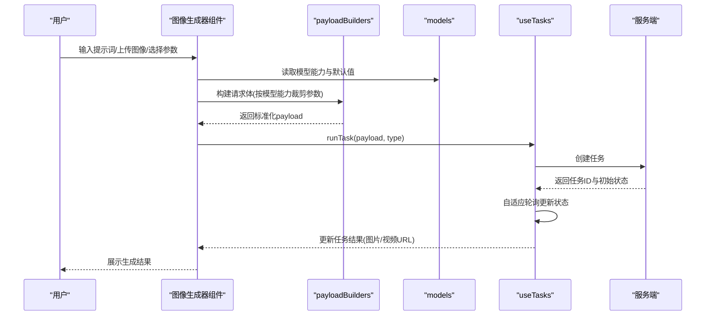
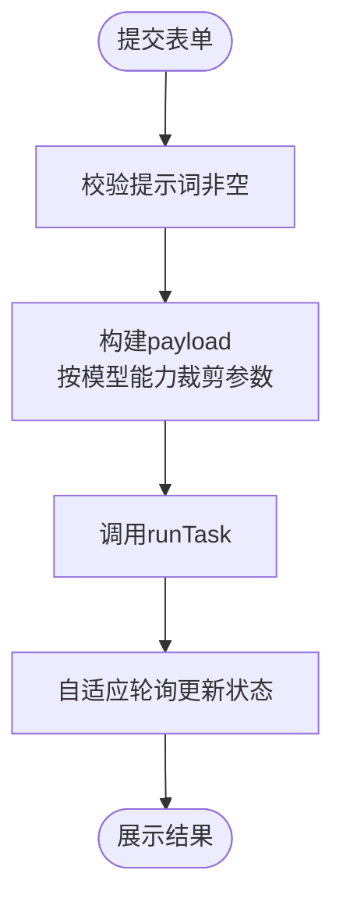
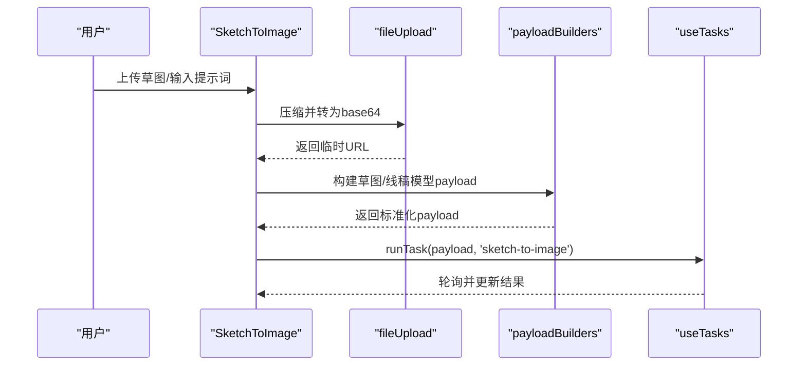
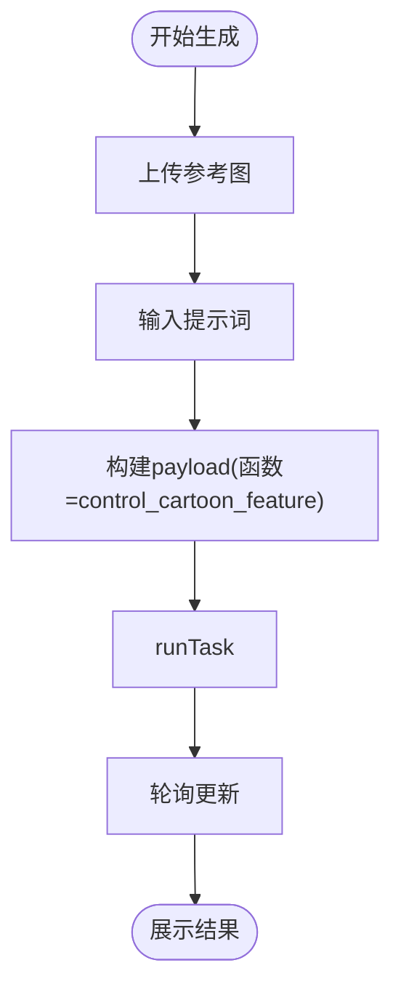
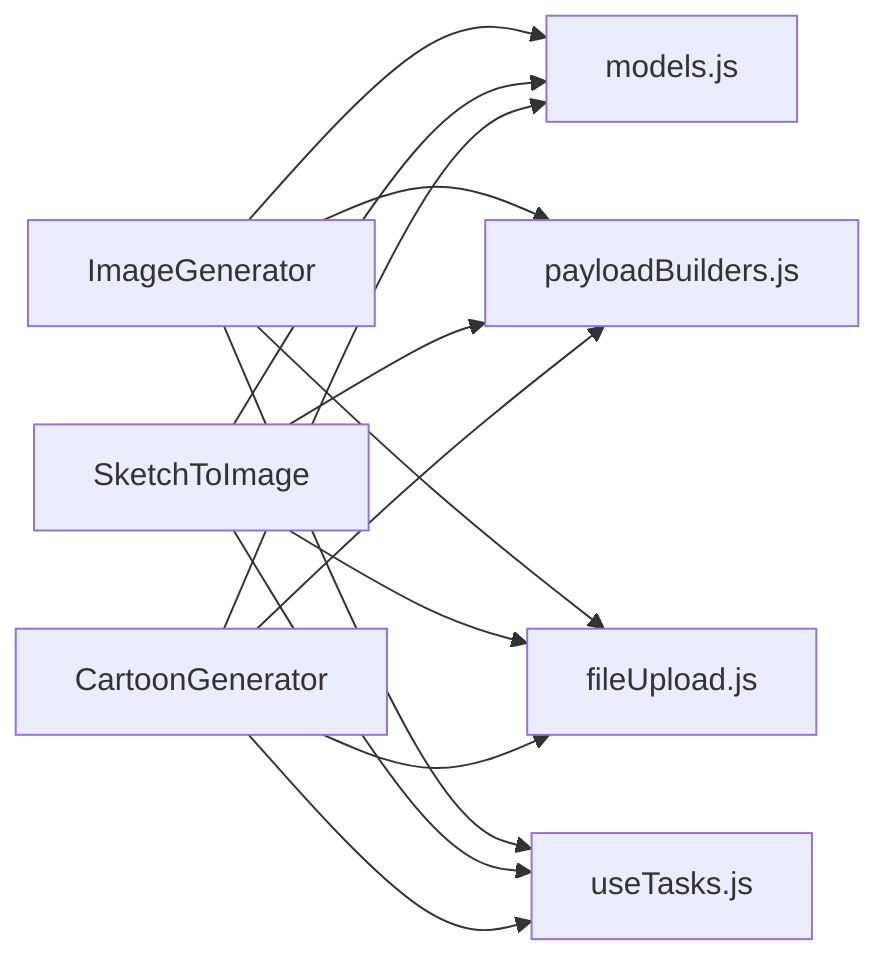

# 图像生成器

<cite>
**本文引用的文件列表**
- [App.jsx](file://src/App.jsx)
- [Layout.jsx](file://src/components/Layout.jsx)
- [ImageGenerator.jsx](file://src/components/ImageGenerator.jsx)
- [SketchToImage.jsx](file://src/components/SketchToImage.jsx)
- [CartoonGenerator.jsx](file://src/components/CartoonGenerator.jsx)
- [GeneratorForm.jsx](file://src/components/GeneratorForm.jsx)
- [models.js](file://src/config/models.js)
- [payloadBuilders.js](file://src/services/payloadBuilders.js)
- [fileUpload.js](file://src/utils/fileUpload.js)
- [useTasks.js](file://src/hooks/useTasks.js)
- [main.css](file://src/main.css)
</cite>

## 更新摘要
**变更内容**
- 完成UI规范化改进：三个图像生成器组件(ImageGenerator、SketchToImage、CartoonGenerator)实现统一的垂直布局设计
- 统一了提示词输入、模型参数选择、按钮样式和高级设置的交互模式
- 更新了组件间UI一致性的实现细节和样式规范

## 目录
1. [简介](#简介)
2. [项目结构](#项目结构)
3. [核心组件](#核心组件)
4. [架构总览](#架构总览)
5. [详细组件分析](#详细组件分析)
6. [UI标准化设计](#ui标准化设计)
7. [依赖关系分析](#依赖关系分析)
8. [性能考量](#性能考量)
9. [故障排查指南](#故障排查指南)
10. [结论](#结论)
11. [附录](#附录)

## 简介
本文件面向"图像生成器"子系统，系统性梳理文生图(ImageGenerator)、草图生图(SketchToImage)与卡通形象生成(CartoonGenerator)三大图像生成器的功能特性与技术实现，重点解析：
- 统一接口设计：提示词处理、参数配置、输出质量控制
- 差异化能力：文本驱动、草图到成品图像、卡通风格个性化生成
- 参数调节机制：采样步数、CFG比例、分辨率设置等关键配置
- 扩展开发指南与自定义参数配置方法
- **新增** UI标准化改进：统一的垂直布局、一致的交互模式和视觉设计

## 项目结构
图像生成器位于前端组件层，通过统一的页面布局与任务管理钩子协作，完成从用户输入到服务端请求、再到结果轮询展示的完整流程。

**图表来源**
- [App.jsx](file://src/App.jsx#L71-L355)
- [Layout.jsx](file://src/components/Layout.jsx#L1-L94)
- [ImageGenerator.jsx](file://src/components/ImageGenerator.jsx#L1-L285)
- [SketchToImage.jsx](file://src/components/SketchToImage.jsx#L1-L384)
- [CartoonGenerator.jsx](file://src/components/CartoonGenerator.jsx#L1-L246)
- [models.js](file://src/config/models.js#L1-L1012)
- [payloadBuilders.js](file://src/services/payloadBuilders.js#L1-L829)
- [fileUpload.js](file://src/utils/fileUpload.js#L1-L182)
- [useTasks.js](file://src/hooks/useTasks.js#L1-L333)

**章节来源**
- [App.jsx](file://src/App.jsx#L42-L355)
- [Layout.jsx](file://src/components/Layout.jsx#L1-L94)

## 核心组件
- **文生图(ImageGenerator)**
  - 支持多文本到图像模型，提供分辨率、数量、风格、反向提示词、随机种子等参数
  - 通过模型配置与能力开关，动态启用高级参数面板
  - **UI特点**：采用统一的垂直布局，使用圆角矩形边框和渐变背景
- **草图生图(SketchToImage)**
  - 支持两类模型：线稿生图与草图生图(Lite)，分别面向不同输入形态与参数集
  - 提供草图权重、自动提取线稿、风格选择、水印与种子等参数
  - **UI特点**：网格布局的参数选择区域，统一的按钮样式和预览功能
- **卡通形象生成(CartoonGenerator)**
  - 基于"参考卡通形象"进行创作生成，支持水印与种子
  - 采用统一的图像上传与预览交互
  - **UI特点**：卡片式布局，简洁的参数配置界面

**章节来源**
- [ImageGenerator.jsx](file://src/components/ImageGenerator.jsx#L8-L285)
- [SketchToImage.jsx](file://src/components/SketchToImage.jsx#L31-L384)
- [CartoonGenerator.jsx](file://src/components/CartoonGenerator.jsx#L5-L246)

## 架构总览
图像生成器遵循"组件-配置-构建器-任务"的分层架构：
- **组件层**：负责用户交互与参数收集
- **配置层**：集中定义模型能力、分辨率标签、风格枚举等
- **构建器层**：根据模型能力策略化构造请求体
- **任务层**：统一的任务创建、轮询与本地存储

**图表来源**
- [ImageGenerator.jsx](file://src/components/ImageGenerator.jsx#L32-L48)
- [SketchToImage.jsx](file://src/components/SketchToImage.jsx#L75-L132)
- [CartoonGenerator.jsx](file://src/components/CartoonGenerator.jsx#L44-L74)
- [payloadBuilders.js](file://src/services/payloadBuilders.js#L77-L119)
- [models.js](file://src/config/models.js#L264-L578)
- [useTasks.js](file://src/hooks/useTasks.js#L256-L312)

## 详细组件分析

### 文生图(ImageGenerator)
- **功能要点**
  - 模型筛选：仅显示"文本到图像"类别模型
  - 参数面板：分辨率、生成数量、风格、反向提示词、随机种子、AI扩展
  - 成本估算：基于模型单价与生成数量
- **参数与能力映射**
  - 解析当前模型配置，按能力开关决定是否传递对应参数
  - 支持风格、负提示词、种子、AI扩展等
- **UI交互**
  - 高级参数折叠/展开
  - 提示词长度实时统计
  - 模型切换时自动校正分辨率

**图表来源**
- [ImageGenerator.jsx](file://src/components/ImageGenerator.jsx#L32-L48)
- [payloadBuilders.js](file://src/services/payloadBuilders.js#L77-L119)
- [useTasks.js](file://src/hooks/useTasks.js#L256-L312)

**章节来源**
- [ImageGenerator.jsx](file://src/components/ImageGenerator.jsx#L8-L285)
- [models.js](file://src/config/models.js#L264-L578)

### 草图生图(SketchToImage)
- **模型差异**
  - 线稿生图(wanx2.1-imageedit)：输入函数=doodle，支持水印与种子
  - 草图生图Lite(wanx-sketch-to-image-lite)：输入为消息数组，支持风格、草图权重、自动提取线稿
- **参数与能力**
  - Lite模型支持草图权重、草图提取、风格等；线稿模型支持水印与种子
- **文件上传**
  - 通过工具函数将文件压缩为base64，避免过大体积导致传输问题

**图表来源**
- [SketchToImage.jsx](file://src/components/SketchToImage.jsx#L57-L132)
- [fileUpload.js](file://src/utils/fileUpload.js#L6-L18)
- [payloadBuilders.js](file://src/services/payloadBuilders.js#L226-L249)

**章节来源**
- [SketchToImage.jsx](file://src/components/SketchToImage.jsx#L31-L384)
- [fileUpload.js](file://src/utils/fileUpload.js#L1-L182)
- [models.js](file://src/config/models.js#L558-L578)

### 卡通形象生成(CartoonGenerator)
- **输入形态**
  - 上传参考卡通形象图，配合提示词生成该形象在不同场景中的图像
- **参数与能力**
  - 支持生成数量、水印与种子
- **交互体验**
  - 图像上传与预览弹窗，ESC键关闭预览

**图表来源**
- [CartoonGenerator.jsx](file://src/components/CartoonGenerator.jsx#L44-L74)
- [payloadBuilders.js](file://src/services/payloadBuilders.js#L196-L220)
- [useTasks.js](file://src/hooks/useTasks.js#L256-L312)

**章节来源**
- [CartoonGenerator.jsx](file://src/components/CartoonGenerator.jsx#L5-L246)
- [models.js](file://src/config/models.js#L328-L359)

### 统一接口设计与参数配置
- **提示词处理**
  - 文本到图像：直接使用prompt字段
  - 多模态模型：从messages内容中抽取文本与图片
  - 草图/Lite模型：从消息数组中提取草图图像与文本
- **参数配置**
  - 解析模型能力(capabilities)，仅传递可用参数
  - 默认值与范围校验：分辨率、数量、草图权重等
  - 条件参数：如负提示词、风格、种子等
- **输出质量控制**
  - 成本估算：基于模型单价与生成数量
  - 轮询策略：自适应间隔，新任务快速轮询，稳定任务降低频率

**章节来源**
- [payloadBuilders.js](file://src/services/payloadBuilders.js#L11-L119)
- [models.js](file://src/config/models.js#L264-L578)
- [ImageGenerator.jsx](file://src/components/ImageGenerator.jsx#L28-L30)

### 参数调节机制详解
- **分辨率设置**
  - 文生图：按模型支持的分辨率集合选择，切换模型时自动回退至默认
  - 草图/Lite：固定分辨率集合，便于模型适配
- **生成数量与风格**
  - 数量：1/2/4张可选
  - 风格：由模型能力决定是否启用，不同模型风格枚举略有差异
- **负面提示词与随机种子**
  - 仅在模型能力允许时传递
  - 种子用于复现相同结果
- **草图权重与线稿提取**
  - Lite模型独有：控制草图结构保留程度与自动提取线稿

**章节来源**
- [ImageGenerator.jsx](file://src/components/ImageGenerator.jsx#L146-L216)
- [SketchToImage.jsx](file://src/components/SketchToImage.jsx#L268-L347)
- [models.js](file://src/config/models.js#L264-L578)

## UI标准化设计

### 统一的垂直布局模式
三个图像生成器组件都采用了统一的垂直布局设计，确保用户在不同生成器间的操作体验一致性：

- **标准间距规范**
  - 使用 `space-y-5` 或 `space-y-3` 控制组件间的垂直间距
  - 表单容器统一使用 `p-6` 或 `p-5` 内边距
  - 参数行采用 `grid grid-cols-3 gap-3` 的三列布局

- **一致的视觉层次**
  - 标签文本统一使用 `text-xs font-semibold text-gray-600` 样式
  - 输入控件统一采用圆角矩形设计 `rounded-xl`
  - 边框统一使用 `border border-gray-200` 样式

### 统一的交互模式

#### 提示词输入区域
所有组件都采用相似的提示词输入设计：
- 标签使用图标装饰，如 `<Sparkles size={14} className="text-violet-500" />`
- 文本域具有统一的尺寸和样式：`min-h-[120px]` 或 `min-h-[100px]`
- 实时字符统计功能，如 `prompt.length / 2000`

#### 参数选择界面
- **模型选择**：统一使用带下拉箭头的选择器
- **分辨率/风格选择**：采用圆角矩形外观，带有渐变背景
- **数量选择**：使用按钮组形式，支持1/2/4张选择

#### 高级设置面板
- 统一的"高级设置"折叠/展开机制
- 使用 `animate-in slide-in-from-top-2 duration-200` 动画效果
- 面板背景采用 `from-white to-gray-50` 渐变

#### 操作按钮设计
- **高级设置按钮**：统一使用 `bg-gray-100 text-gray-600` 样式
- **生成按钮**：统一采用渐变背景 `from-violet-600 to-purple-600`
- **禁用状态**：统一使用 `disabled:opacity-40 disabled:cursor-not-allowed`

### 统一的样式规范

#### 颜色系统
- 主色调：`violet-600` 到 `purple-600` 渐变
- 辅助色：`blue-500`、`green-500`、`orange-500` 等
- 灰色系：`gray-100` 到 `gray-500` 用于背景和边框

#### 组件样式一致性
- **输入控件**：统一使用 `bg-white border border-gray-200 rounded-xl px-4 py-3`
- **按钮样式**：统一采用 `font-semibold py-2.5 px-6 rounded-lg`
- **卡片布局**：统一使用 `bg-gradient-to-br from-white to-gray-50 rounded-xl p-5`

#### 响应式设计
- 移动端适配：使用 `grid-cols-1` 或 `grid-cols-2` 布局
- 桌面端优化：使用 `grid-cols-3` 三列布局
- 统一的断点设计，确保在不同屏幕尺寸下的最佳体验

**章节来源**
- [ImageGenerator.jsx](file://src/components/ImageGenerator.jsx#L50-L281)
- [SketchToImage.jsx](file://src/components/SketchToImage.jsx#L134-L383)
- [CartoonGenerator.jsx](file://src/components/CartoonGenerator.jsx#L76-L245)

## 依赖关系分析
- **组件到配置**
  - 三类生成器均依赖模型配置与能力开关，确保UI与参数随模型能力动态变化
- **组件到构建器**
  - 通过payloadBuilders按模型能力策略化构造请求体，避免硬编码
- **组件到任务**
  - 通过useTasks统一创建任务、轮询状态、持久化与重试
- **工具到组件**
  - fileUpload负责大图压缩与base64转换，保障上传性能与兼容性

**图表来源**
- [ImageGenerator.jsx](file://src/components/ImageGenerator.jsx#L1-L285)
- [SketchToImage.jsx](file://src/components/SketchToImage.jsx#L1-L384)
- [CartoonGenerator.jsx](file://src/components/CartoonGenerator.jsx#L1-L246)
- [models.js](file://src/config/models.js#L1-L1012)
- [payloadBuilders.js](file://src/services/payloadBuilders.js#L1-L829)
- [fileUpload.js](file://src/utils/fileUpload.js#L1-L182)
- [useTasks.js](file://src/hooks/useTasks.js#L1-L333)

**章节来源**
- [models.js](file://src/config/models.js#L264-L578)
- [payloadBuilders.js](file://src/services/payloadBuilders.js#L77-L119)
- [useTasks.js](file://src/hooks/useTasks.js#L256-L312)

## 性能考量
- **上传优化**
  - 大图压缩与base64限制，避免过大的请求体影响网络与内存
- **轮询策略**
  - 新任务快速轮询，稳定任务降低频率，减少API压力
- **本地存储**
  - 任务持久化并清理base64，避免localStorage溢出
- **UI动画**
  - 轻量过渡动画，保证流畅体验的同时降低开销

**章节来源**
- [fileUpload.js](file://src/utils/fileUpload.js#L6-L18)
- [useTasks.js](file://src/hooks/useTasks.js#L86-L161)
- [main.css](file://src/main.css#L29-L44)

## 故障排查指南
- **无法生成**
  - 检查API Key是否配置
  - 查看任务状态轮询日志，确认服务端返回的媒体URL是否存在
- **参数无效**
  - 确认所选模型是否支持相应参数（如负提示词、风格、种子）
  - 检查分辨率与数量是否在模型支持范围内
- **上传失败**
  - 确认文件类型与大小限制
  - 大图会自动压缩，请确认压缩后仍满足模型输入要求
- **结果未更新**
  - 观察轮询间隔是否被调整为较长周期
  - 若状态长时间停留在RUNNING，检查服务端返回结构

**章节来源**
- [useTasks.js](file://src/hooks/useTasks.js#L164-L246)
- [payloadBuilders.js](file://src/services/payloadBuilders.js#L77-L119)
- [fileUpload.js](file://src/utils/fileUpload.js#L149-L182)

## 结论
图像生成器通过"组件-配置-构建器-任务"的分层设计，实现了：
- 统一的参数与提示词处理
- 面向不同生成模式的差异化能力
- 可扩展的模型能力开关与请求体构建策略
- 高效的上传与轮询机制
- **新增** 统一的UI设计规范，确保组件间的一致性和良好的用户体验

该体系为后续新增模型与参数提供了清晰的扩展路径，同时通过UI标准化提升了整体产品的专业度和易用性。

## 附录

### 扩展开发指南
- **新增模型**
  - 在模型配置中添加条目，定义能力开关与默认参数
  - 如需特殊请求体格式，新增payload构建器并注册到策略映射
- **新增参数**
  - 在组件中添加UI控件与状态管理
  - 在payload构建器中按能力开关裁剪参数
- **新增生成器**
  - 参照现有组件结构，实现参数收集、上传与提交
  - 通过useTasks统一接入任务生命周期
- **UI标准化**
  - 遵循统一的垂直布局模式
  - 使用一致的颜色系统和组件样式
  - 确保响应式设计的完整性

**章节来源**
- [models.js](file://src/config/models.js#L264-L788)
- [payloadBuilders.js](file://src/services/payloadBuilders.js#L1-L829)
- [useTasks.js](file://src/hooks/useTasks.js#L256-L312)