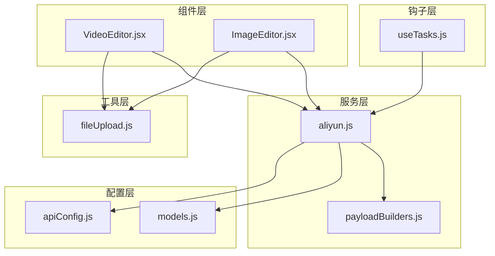
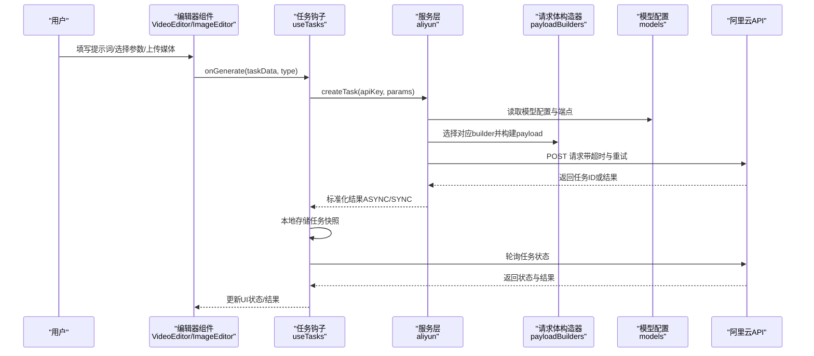
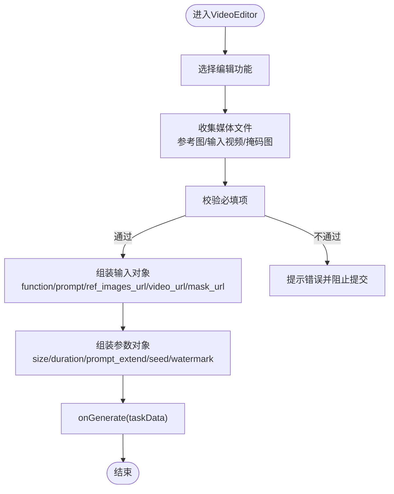
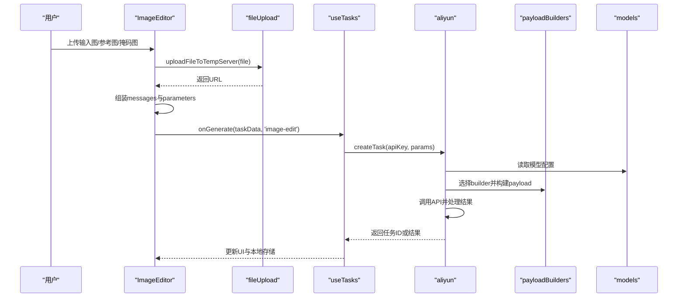
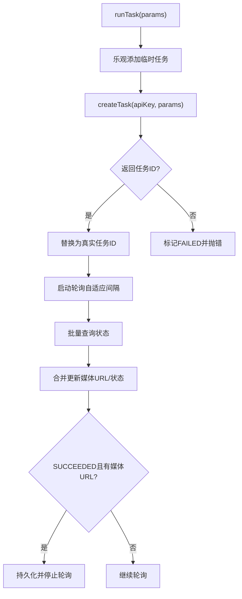
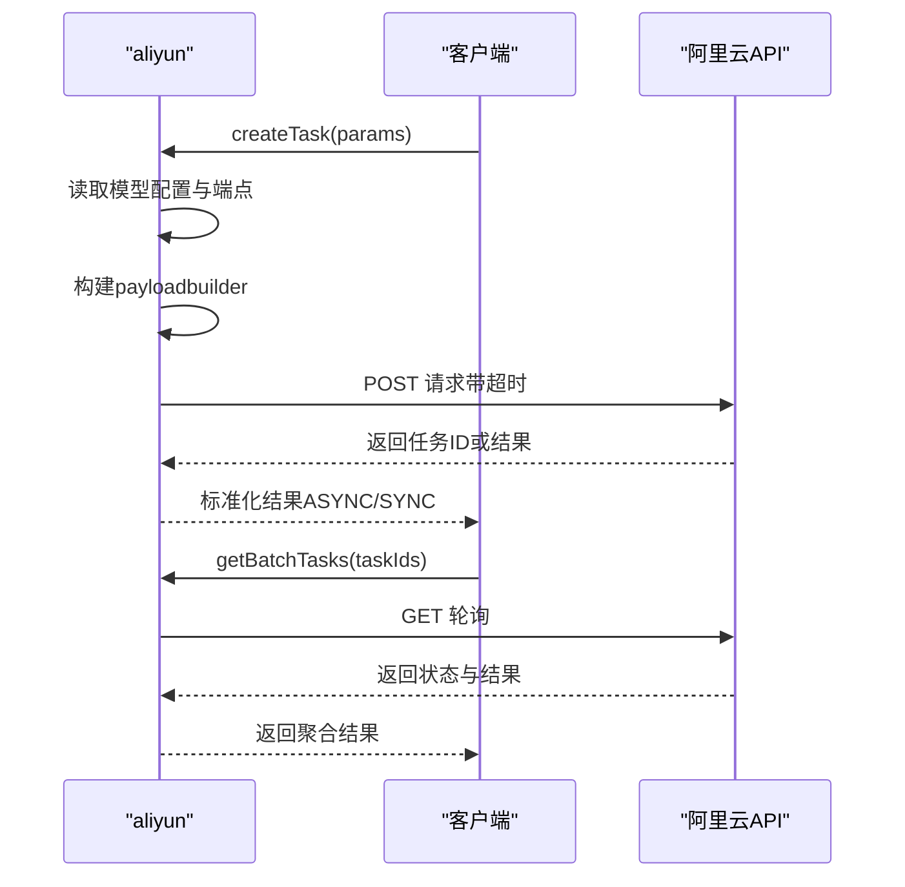
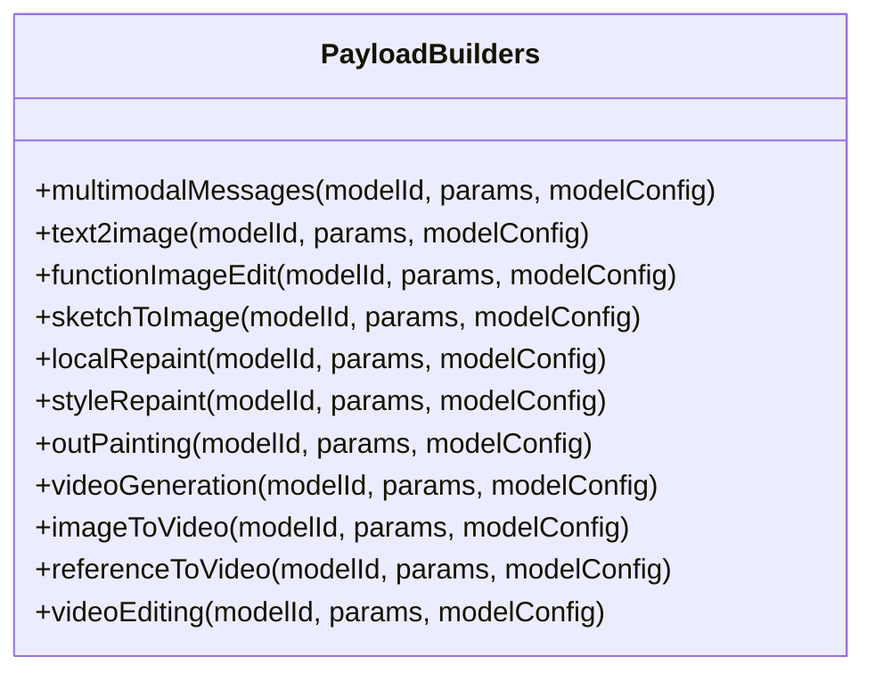
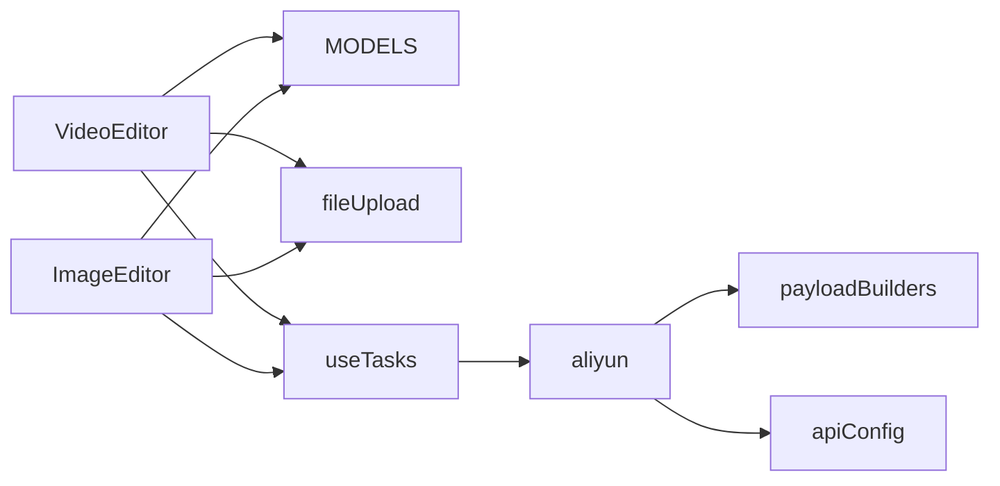

# 媒体编辑器

<cite>
**本文引用的文件列表**
- [VideoEditor.jsx](file://src/components/VideoEditor.jsx)
- [ImageEditor.jsx](file://src/components/ImageEditor.jsx)
- [aliyun.js](file://src/services/aliyun.js)
- [payloadBuilders.js](file://src/services/payloadBuilders.js)
- [models.js](file://src/config/models.js)
- [apiConfig.js](file://src/config/apiConfig.js)
- [fileUpload.js](file://src/utils/fileUpload.js)
- [useTasks.js](file://src/hooks/useTasks.js)
</cite>

## 目录
1. [简介](#简介)
2. [项目结构](#项目结构)
3. [核心组件](#核心组件)
4. [架构总览](#架构总览)
5. [详细组件分析](#详细组件分析)
6. [依赖关系分析](#依赖关系分析)
7. [性能考量](#性能考量)
8. [故障排查指南](#故障排查指南)
9. [结论](#结论)
10. [附录](#附录)

## 简介
本文件面向“媒体编辑器”组件，系统性梳理视频编辑器（VideoEditor）与图像编辑器（ImageEditor）的设计架构与实现细节，重点覆盖以下方面：
- 媒体文件上传、编辑参数配置、实时预览与结果导出的关键流程
- 与阿里云API服务的集成方式（文件处理、参数传递、结果获取）
- 状态管理模式（编辑状态跟踪、进度监控、错误处理）
- 性能优化策略与用户体验改进方案
- 扩展性设计与未来新增编辑功能的开发方法

## 项目结构
媒体编辑器位于前端组件层，围绕“编辑器组件 + 任务钩子 + 服务层 + 配置层”的分层组织：
- 组件层：VideoEditor.jsx、ImageEditor.jsx
- 服务层：aliyun.js（统一任务创建与轮询）、payloadBuilders.js（请求体构建策略）
- 配置层：models.js（模型能力与端点映射）、apiConfig.js（超时与轮询策略）
- 工具层：fileUpload.js（本地文件转Base64与压缩）
- 钩子层：useTasks.js（任务生命周期管理、本地存储、轮询）

图表来源
- [VideoEditor.jsx](file://src/components/VideoEditor.jsx#L1-L532)
- [ImageEditor.jsx](file://src/components/ImageEditor.jsx#L1-L973)
- [aliyun.js](file://src/services/aliyun.js#L1-L215)
- [payloadBuilders.js](file://src/services/payloadBuilders.js#L1-L829)
- [models.js](file://src/config/models.js#L1-L1012)
- [apiConfig.js](file://src/config/apiConfig.js#L1-L35)
- [fileUpload.js](file://src/utils/fileUpload.js#L1-L182)
- [useTasks.js](file://src/hooks/useTasks.js#L1-L333)

章节来源
- [VideoEditor.jsx](file://src/components/VideoEditor.jsx#L1-L532)
- [ImageEditor.jsx](file://src/components/ImageEditor.jsx#L1-L973)
- [aliyun.js](file://src/services/aliyun.js#L1-L215)
- [payloadBuilders.js](file://src/services/payloadBuilders.js#L1-L829)
- [models.js](file://src/config/models.js#L1-L1012)
- [apiConfig.js](file://src/config/apiConfig.js#L1-L35)
- [fileUpload.js](file://src/utils/fileUpload.js#L1-L182)
- [useTasks.js](file://src/hooks/useTasks.js#L1-L333)

## 核心组件
- VideoEditor：负责视频编辑任务的参数收集、文件上传（参考图、输入视频、掩码图）、参数组装与提交。
- ImageEditor：负责图像编辑任务的参数收集、文件上传（输入图、参考图、掩码图）、参数组装与提交。
- useTasks：统一的任务生命周期管理，封装创建任务、轮询状态、持久化、重试与清理逻辑。
- aliyun：统一的API调用封装，含超时控制、重试策略、异步/同步任务处理与结果标准化。
- payloadBuilders：策略模式的请求体构造器，按不同模型协议生成标准请求体。
- models：模型能力与端点配置，决定请求格式、异步/同步特性与参数能力。
- fileUpload：本地文件转Base64与压缩工具，适配大图上传与跨模型兼容。

章节来源
- [VideoEditor.jsx](file://src/components/VideoEditor.jsx#L1-L532)
- [ImageEditor.jsx](file://src/components/ImageEditor.jsx#L1-L973)
- [useTasks.js](file://src/hooks/useTasks.js#L1-L333)
- [aliyun.js](file://src/services/aliyun.js#L1-L215)
- [payloadBuilders.js](file://src/services/payloadBuilders.js#L1-L829)
- [models.js](file://src/config/models.js#L1-L1012)
- [fileUpload.js](file://src/utils/fileUpload.js#L1-L182)

## 架构总览
媒体编辑器采用“组件-服务-配置-工具-钩子”的分层架构，核心交互如下：
- 用户在编辑器组件中填写提示词、选择模型与参数，并上传媒体文件
- 编辑器组件将参数与媒体文件（必要时转Base64）交给任务钩子
- 任务钩子调用服务层创建任务，服务层根据模型配置选择合适的请求体构造器
- 服务层发起阿里云API请求，异步任务返回任务ID，同步任务直接返回结果
- 任务钩子启动轮询，根据状态与结果更新UI与本地存储

图表来源
- [VideoEditor.jsx](file://src/components/VideoEditor.jsx#L120-L187)
- [ImageEditor.jsx](file://src/components/ImageEditor.jsx#L163-L230)
- [useTasks.js](file://src/hooks/useTasks.js#L256-L312)
- [aliyun.js](file://src/services/aliyun.js#L50-L160)
- [payloadBuilders.js](file://src/services/payloadBuilders.js#L125-L150)
- [models.js](file://src/config/models.js#L242-L262)

## 详细组件分析

### 视频编辑器（VideoEditor）
- 功能要点
  - 支持多图参考、视频重绘、局部编辑、视频扩展、视频延展五种功能
  - 参数包括提示词、模型、分辨率、时长、随机种子、水印、Prompt智能改写等
  - 文件上传：参考图（最多3张，可标注主体/背景）、输入视频、掩码图（局部编辑）
  - 提交时根据所选功能动态组装输入对象与参数对象，调用父组件回调 onGenerate
- 数据流
  - 文件选择 -> Base64转换 -> 预览展示 -> 组装输入对象 -> onGenerate
  - 表单校验：必填项（提示词、部分功能的媒体文件）缺失时阻止提交
- 与阿里云集成
  - 通过 useTasks.runTask -> aliyun.createTask -> payloadBuilders.videoEditing
  - 模型配置来自 models.VACE_PLUS_MODELS，端点为视频编辑统一接口
- 错误处理
  - 文件类型校验（图片/视频），提示无效文件
  - 提交前必填项校验，防止空参数
  - API错误与超时捕获，统一抛错

图表来源
- [VideoEditor.jsx](file://src/components/VideoEditor.jsx#L120-L187)
- [models.js](file://src/config/models.js#L242-L262)

章节来源
- [VideoEditor.jsx](file://src/components/VideoEditor.jsx#L1-L532)
- [models.js](file://src/config/models.js#L242-L262)

### 图像编辑器（ImageEditor）
- 功能要点
  - 支持多类图像编辑模型（Qwen图像编辑、万相通用图像编辑、局部重绘、草图转图、风格重绘、扩图等）
  - 参数包括提示词、反向提示词、模型、分辨率、输出数量、水印、随机种子、风格、草图权重/提取/颜色、掩码颜色等
  - 文件上传：输入图、参考图（数量随模型而定）、掩码图（特定模型）
  - 特殊模型参数面板（如局部重绘、草图转图、风格重绘、扩图）
- 数据流
  - 文件上传 -> 本地预览 -> 上传至临时服务器获取URL -> 组装消息内容 -> 构建参数 -> onGenerate
  - 对于多图输入模型，限制参考图数量并去重
- 与阿里云集成
  - 通过 useTasks.runTask -> aliyun.createTask -> payloadBuilders.multimodalMessages / functionImageEdit / sketchToImage 等
  - 模型能力由 models.IMAGE_MODELS 决定，请求格式与端点各异
- 错误处理
  - 上传失败提示
  - 必需媒体缺失时阻止提交
  - API错误与超时捕获

图表来源
- [ImageEditor.jsx](file://src/components/ImageEditor.jsx#L90-L146)
- [fileUpload.js](file://src/utils/fileUpload.js#L6-L18)
- [useTasks.js](file://src/hooks/useTasks.js#L256-L312)
- [aliyun.js](file://src/services/aliyun.js#L50-L160)
- [payloadBuilders.js](file://src/services/payloadBuilders.js#L125-L220)
- [models.js](file://src/config/models.js#L265-L788)

章节来源
- [ImageEditor.jsx](file://src/components/ImageEditor.jsx#L1-L973)
- [fileUpload.js](file://src/utils/fileUpload.js#L1-L182)
- [models.js](file://src/config/models.js#L265-L788)

### 任务状态管理与轮询（useTasks）
- 状态管理
  - 乐观添加临时任务（带临时ID），随后以真实任务ID替换
  - 本地持久化：清理Base64以节省空间；容量不足时保留最近20条
  - 状态集合：RUNNING、SUCCEEDED、FAILED、CANCELED、UNKNOWN
- 轮询策略
  - 自适应间隔：新任务1秒、前10次2秒、之后最长5秒
  - 并发批量轮询：一次性查询多个任务状态
  - 状态变更时重置轮询计数，加速收敛
- 结果处理
  - 同步任务：直接从结果中提取首张图片URL
  - 异步任务：轮询返回媒体URL后更新状态为SUCCEEDED
- 重试与清理
  - 支持基于原始参数重试
  - 清理无用定时器，避免内存泄漏

图表来源
- [useTasks.js](file://src/hooks/useTasks.js#L256-L312)
- [useTasks.js](file://src/hooks/useTasks.js#L107-L161)
- [useTasks.js](file://src/hooks/useTasks.js#L164-L246)

章节来源
- [useTasks.js](file://src/hooks/useTasks.js#L1-L333)

### 阿里云API集成（aliyun）
- 统一入口
  - createTask：根据模型配置选择端点与请求格式，构造payload并发起请求
  - getTask / getBatchTasks：轮询任务状态
- 超时与重试
  - 请求超时：120秒（同步多模态可能较长）
  - 轮询超时：30秒
  - 重试：网络错误/超时自动重试，指数退避
- 结果标准化
  - 异步：返回任务ID与初始状态
  - 同步：直接返回首张图片URL
- 错误处理
  - 未知模型/请求格式：立即抛错
  - 网络错误：提示检查网络
  - API错误：解析错误信息并抛错

图表来源
- [aliyun.js](file://src/services/aliyun.js#L50-L160)
- [aliyun.js](file://src/services/aliyun.js#L170-L214)

章节来源
- [aliyun.js](file://src/services/aliyun.js#L1-L215)
- [apiConfig.js](file://src/config/apiConfig.js#L8-L27)

### 请求体构造器（payloadBuilders）
- 设计思想
  - 策略模式：每种模型协议对应一个builder，便于扩展新模型
  - 参数抽取：统一从params中抽取提示词、图片URL、消息内容
  - 能力开关：依据模型配置决定是否包含某些参数（如负向提示词、水印、风格等）
- 关键builder
  - multimodalMessages：Qwen图像编辑、万相2.6图像等
  - text2image：文生图模型
  - functionImageEdit：万相2.1通用图像编辑
  - sketchToImage/localRepaint/styleRepaint/outPainting等：针对特定模型的定制化参数
  - videoGeneration/imageToVideo/referenceToVideo/videoEditing：视频相关协议

图表来源
- [payloadBuilders.js](file://src/services/payloadBuilders.js#L125-L709)

章节来源
- [payloadBuilders.js](file://src/services/payloadBuilders.js#L1-L829)
- [models.js](file://src/config/models.js#L1-L1012)

## 依赖关系分析
- 组件依赖
  - VideoEditor 依赖 models.VACE_PLUS_MODELS、文件上传工具、父组件回调
  - ImageEditor 依赖 models.IMAGE_MODELS、文件上传工具、任务钩子
- 服务依赖
  - aliyun 依赖 models、payloadBuilders、apiConfig
- 钩子依赖
  - useTasks 依赖 aliyun、models、apiConfig、localStorage
- 工具依赖
  - fileUpload 为组件与服务层提供通用文件处理能力

图表来源
- [VideoEditor.jsx](file://src/components/VideoEditor.jsx#L1-L532)
- [ImageEditor.jsx](file://src/components/ImageEditor.jsx#L1-L973)
- [useTasks.js](file://src/hooks/useTasks.js#L1-L333)
- [aliyun.js](file://src/services/aliyun.js#L1-L215)
- [payloadBuilders.js](file://src/services/payloadBuilders.js#L1-L829)
- [models.js](file://src/config/models.js#L1-L1012)
- [fileUpload.js](file://src/utils/fileUpload.js#L1-L182)
- [apiConfig.js](file://src/config/apiConfig.js#L1-L35)

章节来源
- [VideoEditor.jsx](file://src/components/VideoEditor.jsx#L1-L532)
- [ImageEditor.jsx](file://src/components/ImageEditor.jsx#L1-L973)
- [useTasks.js](file://src/hooks/useTasks.js#L1-L333)
- [aliyun.js](file://src/services/aliyun.js#L1-L215)
- [payloadBuilders.js](file://src/services/payloadBuilders.js#L1-L829)
- [models.js](file://src/config/models.js#L1-L1012)
- [fileUpload.js](file://src/utils/fileUpload.js#L1-L182)
- [apiConfig.js](file://src/config/apiConfig.js#L1-L35)

## 性能考量
- 文件处理
  - 大图压缩：超过阈值时先压缩再转Base64，降低体积与传输成本
  - 本地预览：使用URL.createObjectURL，避免重复读取
- 轮询策略
  - 自适应间隔：新任务快速轮询，稳定后降低频率，减少API压力
  - 批量轮询：并发查询多个任务状态，缩短等待时间
- 存储优化
  - 本地持久化时移除Base64，仅保留必要参数，避免LocalStorage溢出
  - 溢出时保留最近20条，保证可用性
- UI体验
  - 生成按钮禁用与加载动画，避免重复提交
  - 预览弹窗与ESC关闭，提升操作效率

章节来源
- [fileUpload.js](file://src/utils/fileUpload.js#L6-L18)
- [useTasks.js](file://src/hooks/useTasks.js#L30-L84)
- [useTasks.js](file://src/hooks/useTasks.js#L86-L104)
- [useTasks.js](file://src/hooks/useTasks.js#L107-L161)

## 故障排查指南
- 常见问题
  - 上传失败：检查文件类型与大小限制，确认网络连接
  - 提交被阻止：必填项缺失（提示词、必需媒体），根据提示补充
  - 轮询无响应：查看浏览器控制台错误日志，确认API Key有效
  - 结果为空：SUCCEEDED状态需同时具备媒体URL，若尚未返回请稍候
- 定位方法
  - 开启调试日志：服务层在开发环境打印请求与响应详情
  - 查看本地存储：确认任务快照与原始参数
  - 重试任务：使用原始参数重新创建任务
- 建议
  - 保持网络稳定，避免频繁切换网络
  - 合理设置分辨率与时长，避免超时
  - 对大图先压缩，减少Base64体积

章节来源
- [aliyun.js](file://src/services/aliyun.js#L74-L81)
- [useTasks.js](file://src/hooks/useTasks.js#L30-L84)
- [useTasks.js](file://src/hooks/useTasks.js#L164-L246)

## 结论
媒体编辑器通过清晰的分层架构与策略化的请求体构造，实现了对多模型、多协议的统一接入。组件层专注于参数与文件处理，服务层负责与阿里云API交互，钩子层承担状态与持久化管理。整体设计具备良好的扩展性与可维护性，能够支撑未来新增编辑功能与模型的快速集成。

## 附录
- 扩展性建议
  - 新增模型：在 models 中注册模型配置，选择合适请求格式并在 payloadBuilders 中添加对应builder
  - 新增功能：在编辑器组件中新增参数面板与校验逻辑，确保与模型能力一致
  - 新增协议：在 payloadBuilders 中新增builder，并在 aliyun 中完善错误处理与超时控制
- 最佳实践
  - 严格遵循模型能力开关，避免传入不支持的参数
  - 对大文件进行压缩与预览，提升用户体验
  - 合理设置轮询间隔与批量查询，平衡响应速度与资源消耗