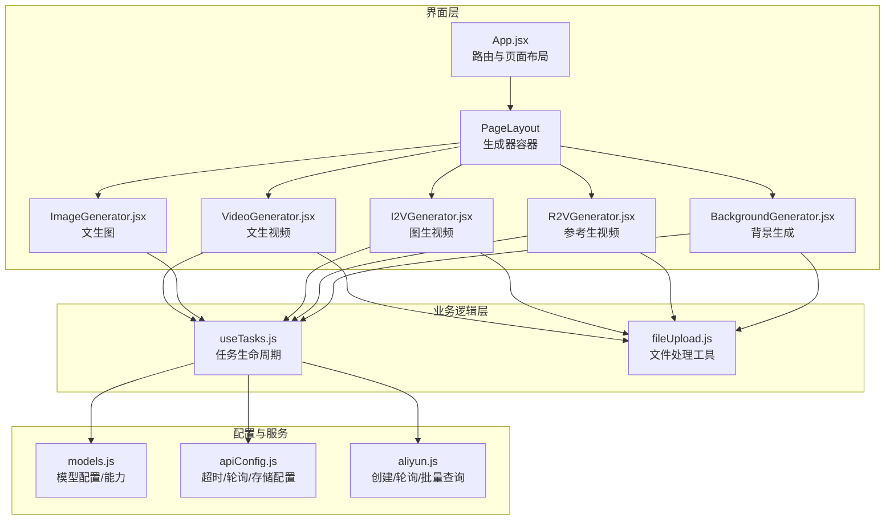
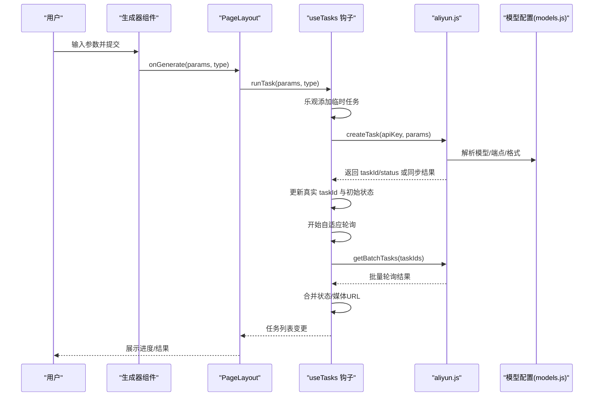
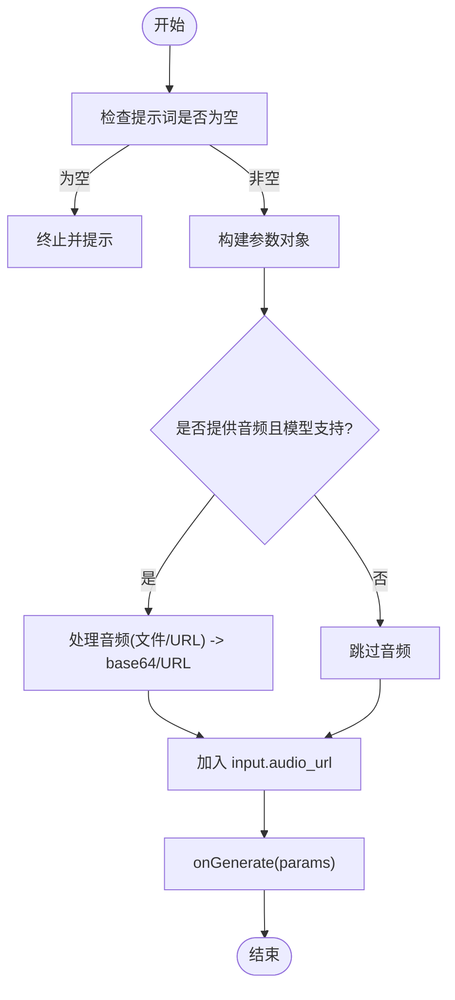
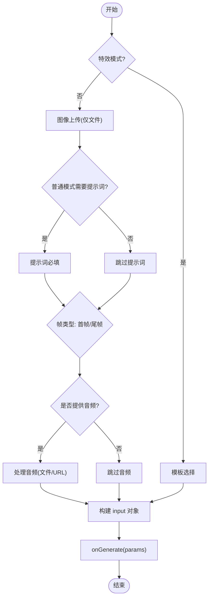
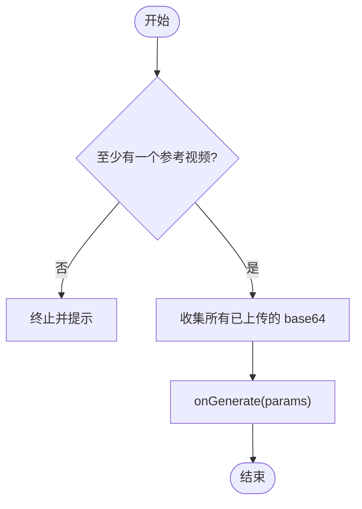
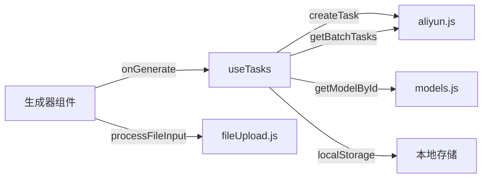

# 生成器组件

<cite>
**本文档引用的文件**
- [VideoGenerator.jsx](file://src/components/VideoGenerator.jsx)
- [ImageGenerator.jsx](file://src/components/ImageGenerator.jsx)
- [I2VGenerator.jsx](file://src/components/I2VGenerator.jsx)
- [R2VGenerator.jsx](file://src/components/R2VGenerator.jsx)
- [BackgroundGenerator.jsx](file://src/components/BackgroundGenerator.jsx)
- [models.js](file://src/config/models.js)
- [fileUpload.js](file://src/utils/fileUpload.js)
- [App.jsx](file://src/App.jsx)
- [useTasks.js](file://src/hooks/useTasks.js)
- [apiConfig.js](file://src/config/apiConfig.js)
- [aliyun.js](file://src/services/aliyun.js)
</cite>

## 目录
1. [简介](#简介)
2. [项目结构](#项目结构)
3. [核心组件](#核心组件)
4. [架构总览](#架构总览)
5. [详细组件分析](#详细组件分析)
6. [依赖关系分析](#依赖关系分析)
7. [性能考量](#性能考量)
8. [故障排查指南](#故障排查指南)
9. [结论](#结论)
10. [附录](#附录)

## 简介
本文件面向通义万相前端应用的生成器组件，系统性梳理视频生成器、图像生成器及其变体组件（图生视频、参考生视频、背景生成等）的设计模式与实现原理。重点覆盖：
- 统一接口设计：参数配置、进度监控、结果展示
- 功能差异与适用场景：文生视频、图生视频、参考生视频、视频编辑、背景生成等
- 状态管理策略、异步任务处理与错误恢复机制
- 扩展指南与自定义开发方法

## 项目结构
生成器组件位于 src/components 下，围绕“生成器 + 页面布局 + 任务钩子”的分层组织：
- 生成器组件：负责参数收集、校验与构建请求参数
- 页面布局：承载生成器、历史记录与结果展示
- 任务钩子：统一执行、轮询、重试与本地持久化
- 服务层：封装阿里云 API 的创建、轮询与批量查询
- 配置层：模型协议、能力与 UI 显示标签

图表来源
- [App.jsx](file://src/App.jsx#L71-L355)
- [useTasks.js](file://src/hooks/useTasks.js#L9-L332)
- [models.js](file://src/config/models.js#L1-L1012)
- [apiConfig.js](file://src/config/apiConfig.js#L1-L35)
- [aliyun.js](file://src/services/aliyun.js#L50-L214)
- [fileUpload.js](file://src/utils/fileUpload.js#L6-L182)

章节来源
- [App.jsx](file://src/App.jsx#L71-L355)
- [useTasks.js](file://src/hooks/useTasks.js#L9-L332)

## 核心组件
- 文生视频（VideoGenerator）：支持多模型、分辨率、时长、镜头类型、音频驱动、反向提示词、固定种子等参数；提供“智能改写”“水印”等开关。
- 文生图（ImageGenerator）：支持文生图模型族，提供分辨率、数量、风格、反向提示词、固定种子等参数；估算费用。
- 图生视频（I2VGenerator）：支持首帧/尾帧模式、特效模板、音频驱动、镜头类型、反向提示词、固定种子；提供“智能动画/视频特效”双模式切换。
- 参考生视频（R2VGenerator）：支持多参考视频（最多3个）、角色标识、镜头类型、反向提示词、固定种子、水印。
- 背景生成（BackgroundGenerator）：主体图像（PNG透明）+ 参考图像/提示词/边缘引导 + 参数调节，生成背景图。

章节来源
- [VideoGenerator.jsx](file://src/components/VideoGenerator.jsx#L6-L354)
- [ImageGenerator.jsx](file://src/components/ImageGenerator.jsx#L8-L249)
- [I2VGenerator.jsx](file://src/components/I2VGenerator.jsx#L5-L588)
- [R2VGenerator.jsx](file://src/components/R2VGenerator.jsx#L5-L380)
- [BackgroundGenerator.jsx](file://src/components/BackgroundGenerator.jsx#L5-L420)

## 架构总览
生成器组件通过统一的 onGenerate 回调将参数传递给 useTasks 钩子，后者负责：
- 乐观添加临时任务
- 调用 aliyn.js 创建任务（异步/同步）
- 自适应轮询（根据任务年龄与状态变化动态调整轮询间隔）
- 本地持久化与清理
- 提供重试、删除、状态更新

图表来源
- [App.jsx](file://src/App.jsx#L55-L70)
- [useTasks.js](file://src/hooks/useTasks.js#L256-L312)
- [aliyun.js](file://src/services/aliyun.js#L50-L160)
- [models.js](file://src/config/models.js#L1-L1012)

章节来源
- [App.jsx](file://src/App.jsx#L55-L70)
- [useTasks.js](file://src/hooks/useTasks.js#L256-L312)
- [aliyun.js](file://src/services/aliyun.js#L50-L160)

## 详细组件分析

### 文生视频（VideoGenerator）
- 参数体系
  - 模型选择：基于 VIDEO_MODELS，自动适配分辨率与时长可用范围
  - 分辨率/时长：根据模型能力动态限制
  - 高级参数：反向提示词、固定种子、镜头类型（部分模型）、音频输入（URL/文件）、水印、智能改写
- 行为特性
  - 当模型切换时，自动校正不支持的时长
  - 音频输入支持 URL 与文件，统一转换为 base64 或直传 URL
  - 构建参数对象时，按模型能力条件性加入字段
- UI 交互
  - “高级设置”面板按模型能力动态显示
  - 生成按钮禁用条件：正在生成或提示词为空

图表来源
- [VideoGenerator.jsx](file://src/components/VideoGenerator.jsx#L74-L115)

章节来源
- [VideoGenerator.jsx](file://src/components/VideoGenerator.jsx#L6-L354)

### 图生视频（I2VGenerator）
- 参数体系
  - 模型选择：I2V_MODELS，支持首帧/尾帧模式与关键帧（KF2V）
  - 特效模式：模板选择（按模型匹配模板类别），禁用部分高级参数
  - 普通模式：图像上传（仅文件）、提示词、镜头类型、反向提示词、固定种子、音频输入
  - 时长/分辨率：固定可用值集合
- 行为特性
  - 效果模式与首帧/尾帧互斥：切换时强制调整
  - 模板选择时，输入对象改为 img_url + template
  - 文件上传统一转为 base64，便于后续传输
- UI 交互
  - “智能动画/视频特效”双模式切换
  - 模板网格选择，支持预览与选择状态反馈

图表来源
- [I2VGenerator.jsx](file://src/components/I2VGenerator.jsx#L113-L172)

章节来源
- [I2VGenerator.jsx](file://src/components/I2VGenerator.jsx#L5-L588)

### 参考生视频（R2VGenerator）
- 参数体系
  - 最多 3 个参考视频槽位，每个槽位支持上传与预览
  - 提示词中使用 character1/character2 等占位符引用对应角色
  - 镜头类型、反向提示词、固定种子、水印（部分模型）
- 行为特性
  - 上传文件统一转为 base64，作为 reference_video_urls 数组提交
  - 无任何参考视频时禁止提交
- UI 交互
  - 支持添加/删除参考视频槽位
  - 预览视频并支持放大查看

图表来源
- [R2VGenerator.jsx](file://src/components/R2VGenerator.jsx#L83-L112)

章节来源
- [R2VGenerator.jsx](file://src/components/R2VGenerator.jsx#L5-L380)

### 文生图（ImageGenerator）
- 参数体系
  - 仅文生图模型族（按分类筛选），默认仅显示文本到图像模型
  - 分辨率/数量/风格/反向提示词/固定种子/智能改写
  - 估算费用：按模型单价与生成数量计算
- 行为特性
  - 仅在提示词非空时允许提交
  - 高级参数按模型能力动态显示
- UI 交互
  - 提示词计数、高级参数面板、生成按钮禁用条件

章节来源
- [ImageGenerator.jsx](file://src/components/ImageGenerator.jsx#L8-L249)

### 背景生成（BackgroundGenerator）
- 参数体系
  - 必填：主体图像（PNG 透明）
  - 可选：参考图像、参考提示词、负向提示词、前景/背景边缘引导
  - 基础参数：生成数量、模型版本、噪声等级
  - 高级参数：提示词权重滑块、边缘引导的描述文本
- 行为特性
  - 上传文件统一走临时服务器接口，返回可访问 URL
  - 边缘引导支持多图上传与逐项描述
- UI 交互
  - 折叠式高级设置
  - 预览与移除操作

章节来源
- [BackgroundGenerator.jsx](file://src/components/BackgroundGenerator.jsx#L5-L420)

## 依赖关系分析
- 组件到钩子
  - 所有生成器通过 onGenerate 回调将参数交给 useTasks.runTask
- 钩子到服务
  - useTasks.runTask 调用 aliyn.js.createTask，异步任务返回 taskId，同步任务直接返回结果
  - useTasks.checkStatuses 使用 aliyn.js.getBatchTasks 批量轮询
- 配置到组件
  - models.js 提供模型能力、端点、请求格式、默认分辨率与时长等，组件据此动态渲染与校验
- 工具到组件
  - fileUpload.js 提供文件转 base64、压缩、URL 校验、输入处理等，I2V/R2V/背景生成均使用

图表来源
- [useTasks.js](file://src/hooks/useTasks.js#L256-L312)
- [aliyun.js](file://src/services/aliyun.js#L50-L160)
- [models.js](file://src/config/models.js#L1-L1012)
- [fileUpload.js](file://src/utils/fileUpload.js#L6-L182)

章节来源
- [useTasks.js](file://src/hooks/useTasks.js#L256-L312)
- [aliyun.js](file://src/services/aliyun.js#L50-L160)
- [models.js](file://src/config/models.js#L1-L1012)
- [fileUpload.js](file://src/utils/fileUpload.js#L6-L182)

## 性能考量
- 自适应轮询
  - 新任务（创建后10秒内）采用 1 秒间隔，前 10 次轮询采用 2 秒间隔，之后稳定在 5 秒，降低无效轮询开销
- 本地存储优化
  - 保存任务时移除 base64 数据，避免占用过多空间；超出配额时仅保留最近 20 条
- 文件处理
  - 大于阈值的图片自动压缩后再转 base64，减少传输体积
- 并发轮询
  - 批量轮询使用 Promise.allSettled，避免单点失败影响整体

章节来源
- [useTasks.js](file://src/hooks/useTasks.js#L86-L104)
- [useTasks.js](file://src/hooks/useTasks.js#L30-L84)
- [fileUpload.js](file://src/utils/fileUpload.js#L40-L87)
- [aliyun.js](file://src/services/aliyun.js#L211-L214)

## 故障排查指南
- API Key 未配置
  - 现象：点击生成弹出设置窗口
  - 处理：在设置中保存有效 API Key
- 任务创建失败
  - 现象：状态停留在 RUNNING 或 FAILED
  - 处理：检查网络、确认模型 ID 正确、查看服务端错误信息
- 轮询超时
  - 现象：轮询接口超时
  - 处理：检查网络连通性，适当延长轮询超时配置
- 生成结果为空
  - 现象：状态变为 SUCCEEDED 但无媒体 URL
  - 处理：等待一段时间后重试；若仍无结果，检查输入参数与模型能力
- 文件上传失败
  - 现象：图片/音频/视频上传失败
  - 处理：确认文件类型与大小限制，尝试压缩或更换文件

章节来源
- [App.jsx](file://src/App.jsx#L55-L70)
- [useTasks.js](file://src/hooks/useTasks.js#L164-L246)
- [aliyun.js](file://src/services/aliyun.js#L146-L160)
- [aliyun.js](file://src/services/aliyun.js#L170-L202)
- [fileUpload.js](file://src/utils/fileUpload.js#L149-L182)

## 结论
本项目通过“配置驱动 + 统一钩子 + 服务封装”的架构，实现了多形态生成器组件的统一接入与一致体验。组件遵循最小可用原则，按模型能力动态渲染参数；钩子提供稳定的异步任务生命周期管理与本地持久化；服务层抽象了 API 调用与轮询细节。该设计既保证了易用性，也为后续扩展（新增模型、新功能）提供了清晰的边界与路径。

## 附录

### 统一接口设计要点
- onGenerate 回调
  - 参数结构：{ model, input, parameters }
  - input/input.audio_url/img_url/first_frame_url/reference_video_urls/template 等字段按模型能力与模式动态组装
- isGenerating 状态
  - 控制 UI 禁用与加载态，避免重复提交
- 任务类型
  - 由调用侧传入，用于页面过滤与历史展示

章节来源
- [VideoGenerator.jsx](file://src/components/VideoGenerator.jsx#L89-L115)
- [I2VGenerator.jsx](file://src/components/I2VGenerator.jsx#L161-L172)
- [R2VGenerator.jsx](file://src/components/R2VGenerator.jsx#L97-L112)
- [BackgroundGenerator.jsx](file://src/components/BackgroundGenerator.jsx#L146-L149)
- [App.jsx](file://src/App.jsx#L55-L70)

### 模型能力与参数映射
- 文生视频
  - 支持：分辨率、时长、镜头类型、音频、反向提示词、固定种子、智能改写、水印
- 图生视频
  - 支持：分辨率、时长、镜头类型、音频、反向提示词、固定种子、首帧/尾帧、模板
- 参考生视频
  - 支持：分辨率、时长、镜头类型、反向提示词、固定种子、水印、多角色
- 背景生成
  - 支持：主体图像、参考图像/提示词、边缘引导、噪声等级、提示词权重、模型版本、生成数量

章节来源
- [models.js](file://src/config/models.js#L39-L262)

### 扩展指南与自定义开发
- 新增生成器组件
  - 在 src/components 下新建组件，遵循统一回调签名 onGenerate(params, type)
  - 使用 models.js 中的模型配置决定参数渲染与校验
  - 如需上传文件，复用 fileUpload.js 的处理流程
- 新增模型
  - 在 models.js 中补充模型配置（id/name/description/protocol/endpoint/requestFormat/capabilities/resolutions/defaultRes 等）
  - 若为同步模型，确保 aliyn.js 的 createTask 分支正确处理
- 自定义参数校验
  - 在组件内部增加校验逻辑，必要时在 useTasks 钩子中补充状态更新策略
- 自定义轮询策略
  - 修改 apiConfig.js 的轮询间隔与超时配置，或在 useTasks 中扩展自适应逻辑

章节来源
- [models.js](file://src/config/models.js#L1-L1012)
- [aliyun.js](file://src/services/aliyun.js#L50-L160)
- [apiConfig.js](file://src/config/apiConfig.js#L21-L27)
- [useTasks.js](file://src/hooks/useTasks.js#L86-L104)