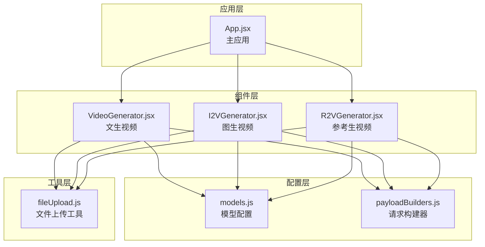
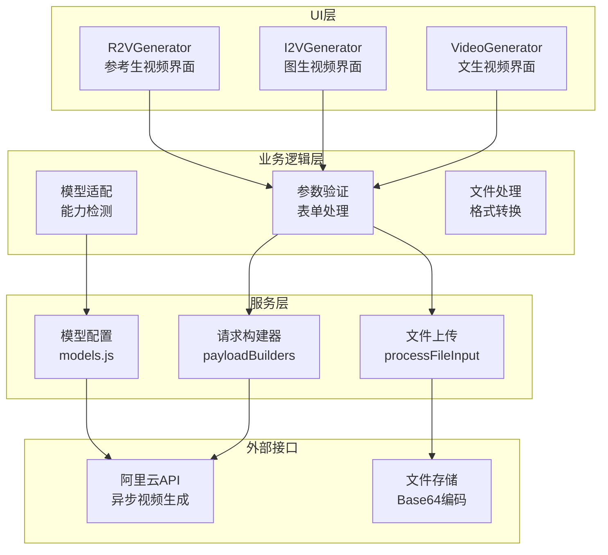
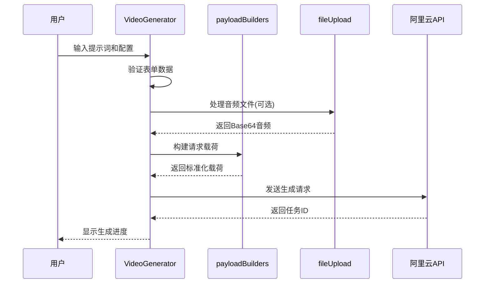
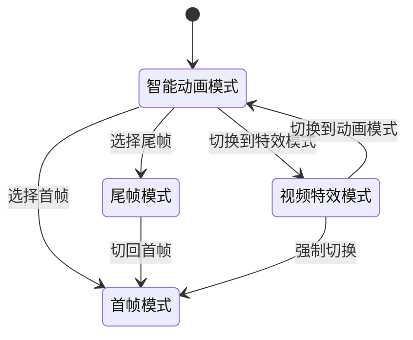
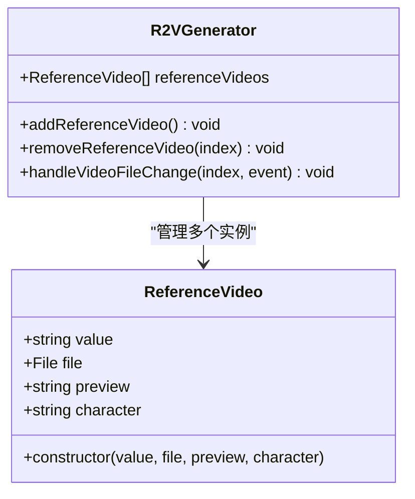
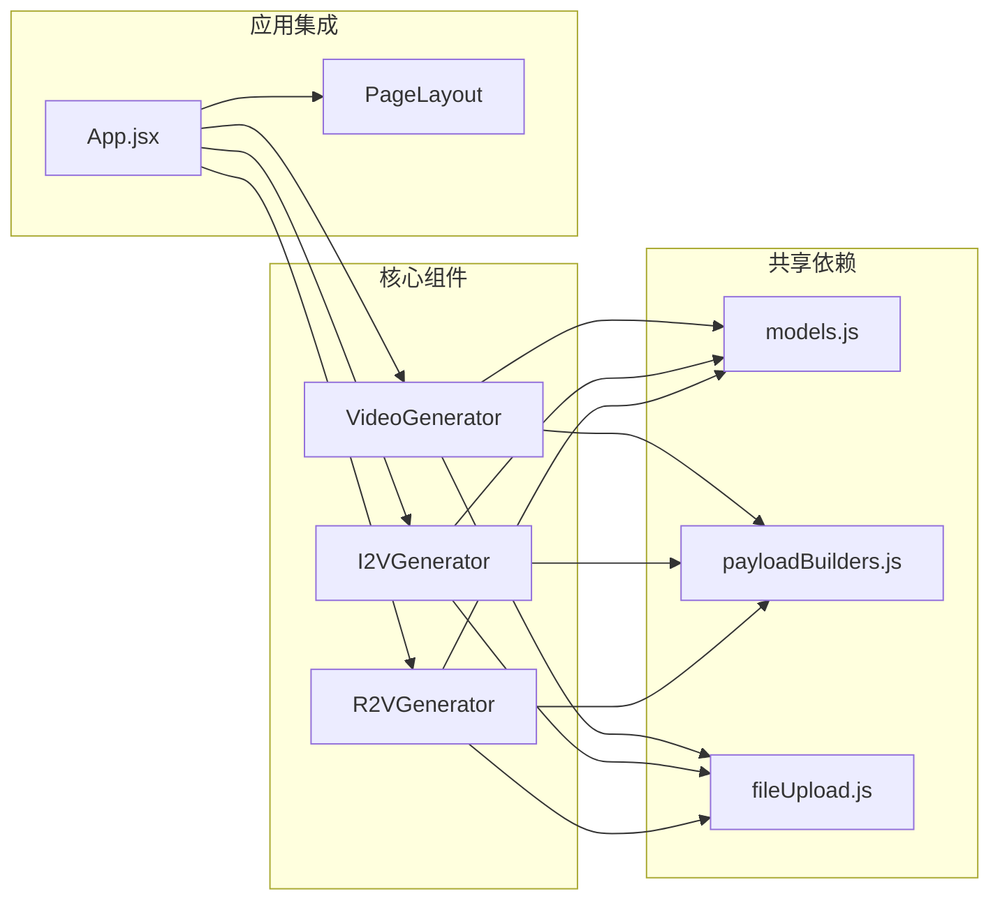
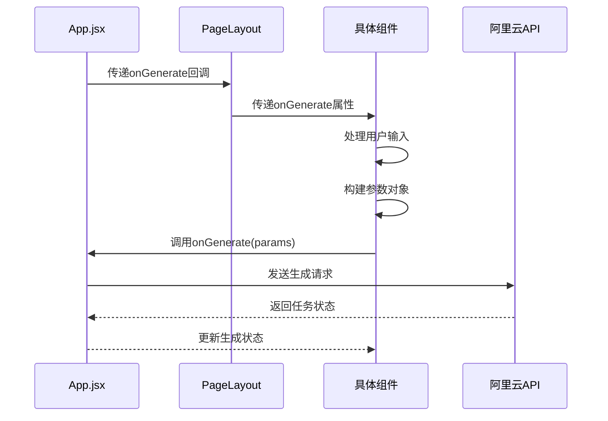

# 视频生成器

<cite>
**本文档引用的文件**
- [VideoGenerator.jsx](file://src/components/VideoGenerator.jsx)
- [I2VGenerator.jsx](file://src/components/I2VGenerator.jsx)
- [R2VGenerator.jsx](file://src/components/R2VGenerator.jsx)
- [models.js](file://src/config/models.js)
- [payloadBuilders.js](file://src/services/payloadBuilders.js)
- [fileUpload.js](file://src/utils/fileUpload.js)
- [App.jsx](file://src/App.jsx)
</cite>

## 目录
1. [简介](#简介)
2. [项目结构](#项目结构)
3. [核心组件](#核心组件)
4. [架构概览](#架构概览)
5. [详细组件分析](#详细组件分析)
6. [依赖关系分析](#依赖关系分析)
7. [性能考虑](#性能考虑)
8. [故障排除指南](#故障排除指南)
9. [结论](#结论)

## 简介

本项目提供了三种视频生成器组件，基于阿里通义实验室的万相AI模型，实现了从文本到视频、从图像到视频以及从参考视频到视频的完整生成流程。每个生成器都采用了现代化的React Hooks模式，提供了直观的用户界面和强大的配置选项。

## 项目结构

项目采用模块化的组件架构，主要包含以下核心目录和文件：



**图表来源**
- [VideoGenerator.jsx](file://src/components/VideoGenerator.jsx#L1-L354)
- [I2VGenerator.jsx](file://src/components/I2VGenerator.jsx#L1-L588)
- [R2VGenerator.jsx](file://src/components/R2VGenerator.jsx#L1-L359)
- [models.js](file://src/config/models.js#L1-L1012)
- [payloadBuilders.js](file://src/services/payloadBuilders.js#L1-L829)
- [fileUpload.js](file://src/utils/fileUpload.js#L1-L182)

**章节来源**
- [App.jsx](file://src/App.jsx#L1-L377)

## 核心组件

### 文生视频 (VideoGenerator)

文生视频组件实现了基于文本描述生成视频的功能，支持多种模型版本和高级配置选项。

**关键特性：**
- 多模型支持：wan2.6-t2v、wan2.5-t2v-preview、wan2.2-t2v-plus等
- 智能提示词扩展：自动优化和扩展用户输入的提示词
- 音频驱动：支持音频输入驱动视频生成
- 镜头类型：支持单镜头和多镜头叙事
- 水印添加：可选的版权水印功能

### 图生视频 (I2VGenerator)

图生视频组件提供了从静态图像生成动态视频的能力，包含智能动画和视频特效两种模式。

**关键特性：**
- 智能动画模式：基于图像描述生成动态效果
- 视频特效模式：使用预设模板生成特效视频
- 关键帧到视频：支持首帧和尾帧的视频生成
- 效果模板：内置丰富的视频特效模板库
- 分辨率适配：自动适配不同模型的分辨率支持

### 参考生视频 (R2VGenerator)

参考生视频组件允许用户上传参考视频，基于参考内容生成新的视频，特别适合角色保持和音色一致性的场景。

**关键特性：**
- 多参考视频支持：最多支持3个参考视频
- 角色标识系统：使用character1、character2等标识引用角色
- 多镜头叙事：支持复杂的镜头切换和场景变换
- 水印功能：可选的版权保护水印
- 时长控制：灵活的视频时长设置

**章节来源**
- [VideoGenerator.jsx](file://src/components/VideoGenerator.jsx#L1-L354)
- [I2VGenerator.jsx](file://src/components/I2VGenerator.jsx#L1-L588)
- [R2VGenerator.jsx](file://src/components/R2VGenerator.jsx#L1-L359)

## 架构概览

系统采用分层架构设计，确保了良好的可维护性和扩展性：



**图表来源**
- [VideoGenerator.jsx](file://src/components/VideoGenerator.jsx#L74-L115)
- [I2VGenerator.jsx](file://src/components/I2VGenerator.jsx#L113-L172)
- [R2VGenerator.jsx](file://src/components/R2VGenerator.jsx#L83-L112)
- [payloadBuilders.js](file://src/services/payloadBuilders.js#L515-L571)
- [fileUpload.js](file://src/utils/fileUpload.js#L114-L144)

## 详细组件分析

### 文生视频组件 (VideoGenerator)

#### 参数配置选项

| 参数类别 | 配置项 | 默认值 | 支持范围 | 描述 |
|---------|--------|--------|----------|------|
| 基础参数 | 提示词 | 空字符串 | 用户输入 | 视频内容描述 |
| 模型选择 | 模型ID | wan2.6-t2v | 多种版本 | 不同性能的AI模型 |
| 分辨率 | 尺寸 | 1080P | 480P/720P/1080P | 输出视频分辨率 |
| 时长控制 | 持续时间 | 5秒 | 2-30秒 | 视频播放时长 |
| 高级功能 | 智能改写 | 开启 | 开关 | 自动优化提示词 |
| 高级功能 | 添加水印 | 关闭 | 开关 | 版权保护水印 |

#### 核心处理流程



**图表来源**
- [VideoGenerator.jsx](file://src/components/VideoGenerator.jsx#L74-L115)
- [payloadBuilders.js](file://src/services/payloadBuilders.js#L515-L571)
- [fileUpload.js](file://src/utils/fileUpload.js#L114-L144)

#### 模型能力映射

| 模型版本 | 提示词扩展 | 镜头类型 | 音频驱动 | 负面提示 | 种子控制 | 水印支持 |
|----------|------------|----------|----------|----------|----------|----------|
| wan2.6-t2v | ✓ | ✓ | ✓ | ✓ | ✓ | - |
| wan2.5-t2v-preview | ✓ | - | ✓ | ✓ | ✓ | - |
| wan2.2-t2v-plus | ✓ | - | - | ✓ | ✓ | - |
| wanx2.1-t2v-turbo | ✓ | - | - | ✓ | ✓ | - |
| wanx2.1-t2v-plus | ✓ | - | - | ✓ | ✓ | - |

**章节来源**
- [VideoGenerator.jsx](file://src/components/VideoGenerator.jsx#L1-L354)
- [models.js](file://src/config/models.js#L40-L135)

### 图生视频组件 (I2VGenerator)

#### 模式切换机制

图生视频组件实现了两种工作模式，通过useEffect钩子实现智能模式切换：



**图表来源**
- [I2VGenerator.jsx](file://src/components/I2VGenerator.jsx#L23-L36)

#### 模板系统架构

组件内置了丰富的视频特效模板，根据不同模型版本提供相应的模板集合：

| 模板类型 | 支持模型 | 模板数量 | 示例 |
|----------|----------|----------|------|
| 通用特效 | 所有I2V模型 | 7个 | 解压捏捏、转圈圈、戳戳乐 |
| 单人特效 | 2.1/2.2/2.5/2.6 | 13个 | 时光木马、爱你哟、摇摆时刻 |
| 单人/动物 | 2.1/2.2/2.5/2.6 | 3个 | 魔法悬浮、赠人玫瑰、闪亮玫瑰 |
| 双人特效 | 2.1/2.2/2.5/2.6 | 3个 | 爱的抱抱、唇齿相依、双倍心动 |
| 关键帧特效 | kf2v模型 | 5个 | 唐韵翩然、机甲变身、闪耀封面 |

#### 核心处理流程

```mermaid
flowchart TD
Start([开始生成]) --> CheckMode{检查模式}
CheckMode --> |智能动画| CheckPrompt{验证提示词}
CheckMode --> |视频特效| CheckTemplate{验证模板}
CheckPrompt --> |有效| ProcessImage[处理图像文件]
CheckPrompt --> |无效| ShowError[显示错误]
CheckTemplate --> |有效| ProcessTemplate[处理模板]
CheckTemplate --> |无效| ShowError
ProcessImage --> ProcessAudio[处理音频(可选)]
ProcessTemplate --> ProcessAudio
ProcessAudio --> BuildPayload[构建请求载荷]
BuildPayload --> SendRequest[发送请求]
SendRequest --> End([完成])
ShowError --> End
```

**图表来源**
- [I2VGenerator.jsx](file://src/components/I2VGenerator.jsx#L113-L172)
- [payloadBuilders.js](file://src/services/payloadBuilders.js#L577-L643)

**章节来源**
- [I2VGenerator.jsx](file://src/components/I2VGenerator.jsx#L1-L588)
- [models.js](file://src/config/models.js#L138-L216)

### 参考生视频组件 (R2VGenerator)

#### 多参考视频管理

参考生视频组件支持最多3个参考视频的上传和管理，每个参考视频都有独立的状态管理：



**图表来源**
- [R2VGenerator.jsx](file://src/components/R2VGenerator.jsx#L8-L18)
- [R2VGenerator.jsx](file://src/components/R2VGenerator.jsx#L62-L78)

#### 角色标识系统

组件实现了灵活的角色标识系统，允许用户在提示词中引用不同的参考角色：

| 角色标识 | 含义 | 使用场景 |
|----------|------|----------|
| character1 | 第一个参考角色 | 主角或主要人物 |
| character2 | 第二个参考角色 | 配角或次要人物 |
| character3 | 第三个参考角色 | 背景角色或特殊角色 |

**章节来源**
- [R2VGenerator.jsx](file://src/components/R2VGenerator.jsx#L1-L359)
- [models.js](file://src/config/models.js#L219-L239)

## 依赖关系分析

### 组件间依赖关系



**图表来源**
- [VideoGenerator.jsx](file://src/components/VideoGenerator.jsx#L3-L4)
- [I2VGenerator.jsx](file://src/components/I2VGenerator.jsx#L3)
- [R2VGenerator.jsx](file://src/components/R2VGenerator.jsx#L3)
- [models.js](file://src/config/models.js#L1-L10)
- [payloadBuilders.js](file://src/services/payloadBuilders.js#L1-L6)
- [fileUpload.js](file://src/utils/fileUpload.js#L1-L5)

### 数据流分析

组件间的数据传递遵循单向数据流原则，确保了状态的一致性和可预测性：



**图表来源**
- [App.jsx](file://src/App.jsx#L55-L61)
- [VideoGenerator.jsx](file://src/components/VideoGenerator.jsx#L114)
- [I2VGenerator.jsx](file://src/components/I2VGenerator.jsx#L171)
- [R2VGenerator.jsx](file://src/components/R2VGenerator.jsx#L111)

**章节来源**
- [App.jsx](file://src/App.jsx#L1-L377)

## 性能考虑

### 文件处理优化

系统实现了智能的文件处理策略，针对不同场景优化性能：

1. **Base64大小限制**：设置了8MB的Base64大小限制，避免内存溢出
2. **图像压缩**：对于大尺寸图像自动压缩到2048x2048以内
3. **异步处理**：所有文件操作都是异步执行，不影响UI响应

### 模型选择策略

组件根据所选模型自动调整可用配置：

```javascript
// 自动调整时长支持
const getAvailableDurations = () => {
    switch(selectedModelId) {
        case 'wan2.6-t2v':
            return [5, 10, 15]; // 支持多种时长
        case 'wan2.5-t2v-preview':
            return [5, 10]; // 支持较短时长
        case 'wan2.2-t2v-plus':
        case 'wanx2.1-t2v-turbo':
        case 'wanx2.1-t2v-plus':
            return [5]; // 固定时长
        default:
            return [5];
    }
};
```

### 内存管理

组件实现了及时的资源清理：

- 图像预览URL的及时释放
- 音频文件对象的清理
- 参考视频数组的动态管理

## 故障排除指南

### 常见问题及解决方案

| 问题类型 | 症状 | 原因 | 解决方案 |
|----------|------|------|----------|
| 模型兼容性 | 生成失败 | 模型不支持某些参数 | 检查模型能力配置 |
| 文件格式错误 | 上传失败 | 文件类型不正确 | 确认文件类型和格式 |
| Base64过大 | 内存溢出 | 文件超过8MB | 自动压缩或手动减小文件 |
| API密钥缺失 | 请求被拒绝 | 未配置API密钥 | 在设置中添加有效密钥 |
| 网络超时 | 生成无响应 | 网络连接问题 | 检查网络连接和防火墙设置 |

### 错误处理机制

组件实现了多层次的错误处理：

1. **前端验证**：表单提交前的即时验证
2. **文件验证**：文件类型和大小的严格检查
3. **API错误**：捕获和显示API返回的错误信息
4. **用户反馈**：友好的错误提示和恢复建议

**章节来源**
- [fileUpload.js](file://src/utils/fileUpload.js#L149-L167)
- [VideoGenerator.jsx](file://src/components/VideoGenerator.jsx#L47-L62)
- [I2VGenerator.jsx](file://src/components/I2VGenerator.jsx#L78-L93)
- [R2VGenerator.jsx](file://src/components/R2VGenerator.jsx#L39-L60)

## 结论

本视频生成器组件系统展现了现代前端开发的最佳实践，通过合理的架构设计和丰富的功能实现，为用户提供了强大而易用的视频生成体验。

### 主要优势

1. **模块化设计**：清晰的组件分离和职责划分
2. **配置驱动**：通过配置文件轻松扩展新模型
3. **用户体验**：直观的界面和流畅的操作流程
4. **性能优化**：智能的文件处理和资源管理
5. **错误处理**：完善的错误捕获和用户反馈机制

### 技术亮点

- **策略模式**：使用payloadBuilders.js实现请求格式的策略化
- **Hook模式**：充分利用React Hooks实现状态管理和副作用处理
- **配置驱动**：通过models.js集中管理所有模型配置
- **异步处理**：完整的异步任务处理和状态管理

### 扩展建议

1. **缓存机制**：实现生成结果的本地缓存
2. **批量处理**：支持多个视频的批量生成
3. **进度监控**：实时显示生成进度和预计完成时间
4. **历史记录**：提供生成历史的查询和管理功能