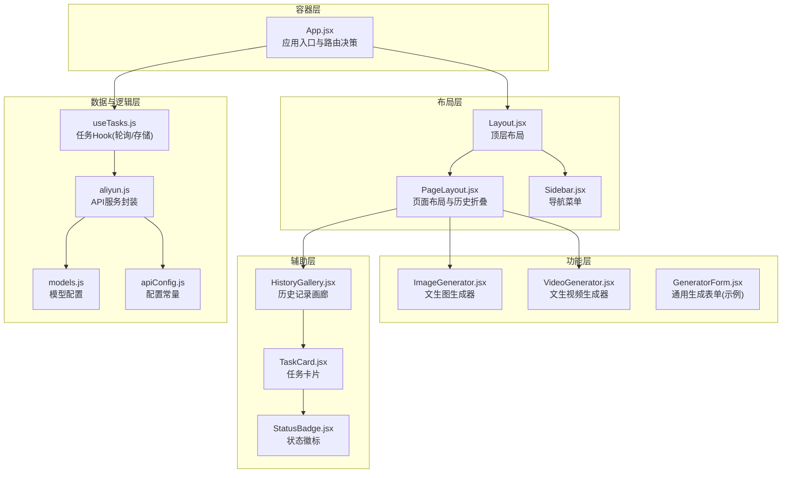
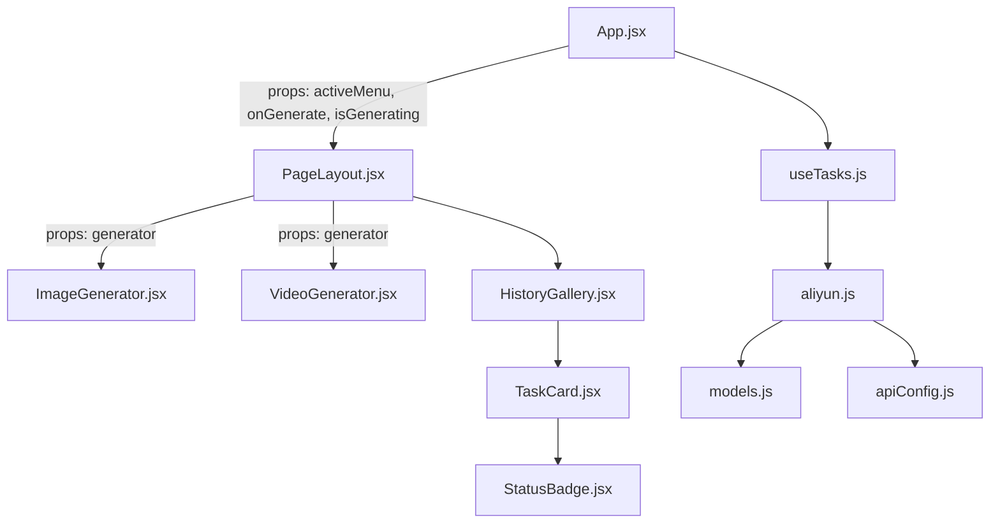
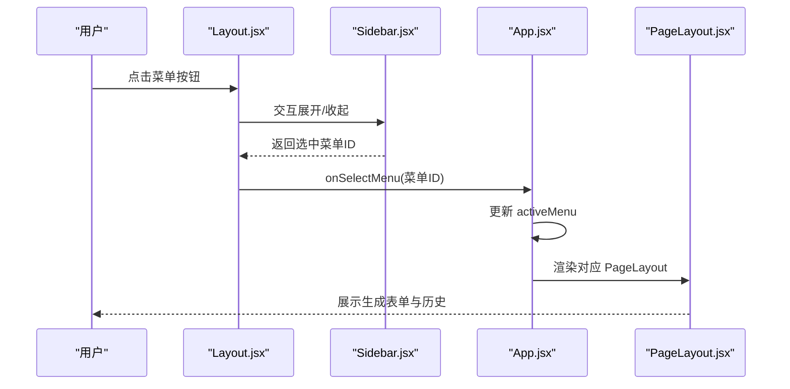
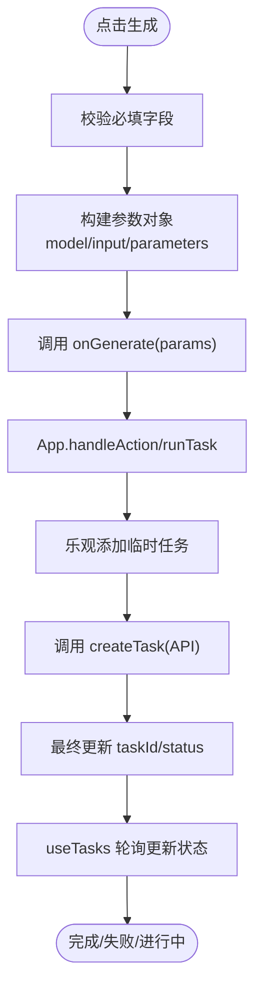
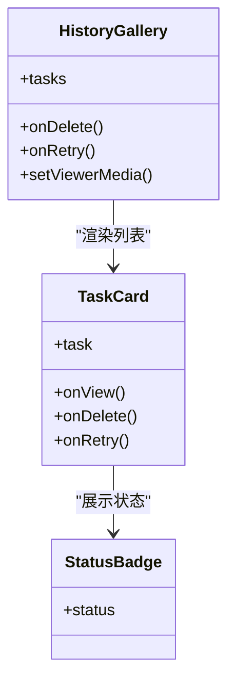
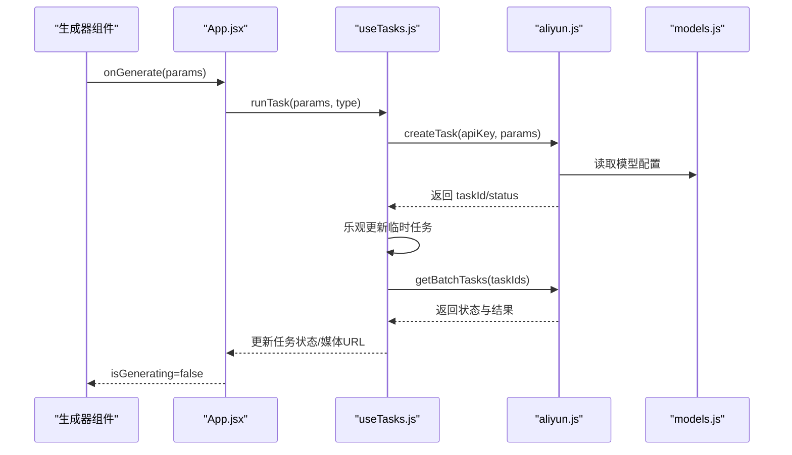
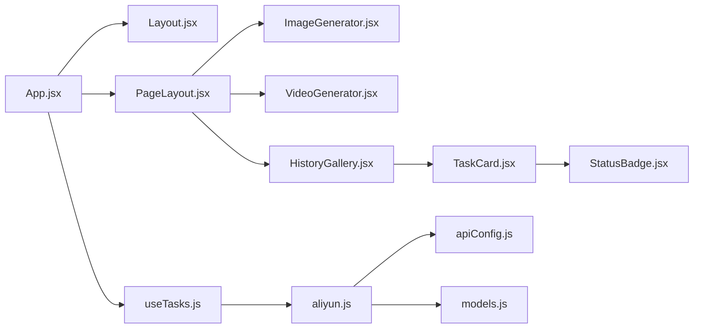

# 组件架构

<cite>
**本文引用的文件**
- [App.jsx](file://src/App.jsx)
- [Layout.jsx](file://src/components/Layout.jsx)
- [PageLayout.jsx](file://src/components/PageLayout.jsx)
- [Sidebar.jsx](file://src/components/Sidebar.jsx)
- [HistoryGallery.jsx](file://src/components/HistoryGallery.jsx)
- [TaskCard.jsx](file://src/components/TaskCard.jsx)
- [StatusBadge.jsx](file://src/components/StatusBadge.jsx)
- [ImageGenerator.jsx](file://src/components/ImageGenerator.jsx)
- [VideoGenerator.jsx](file://src/components/VideoGenerator.jsx)
- [GeneratorForm.jsx](file://src/components/GeneratorForm.jsx)
- [useTasks.js](file://src/hooks/useTasks.js)
- [aliyun.js](file://src/services/aliyun.js)
- [models.js](file://src/config/models.js)
- [apiConfig.js](file://src/config/apiConfig.js)
- [main.jsx](file://src/main.jsx)
</cite>

## 目录
1. [简介](#简介)
2. [项目结构](#项目结构)
3. [核心组件](#核心组件)
4. [架构总览](#架构总览)
5. [详细组件分析](#详细组件分析)
6. [依赖关系分析](#依赖关系分析)
7. [性能考量](#性能考量)
8. [故障排查指南](#故障排查指南)
9. [结论](#结论)
10. [附录](#附录)

## 简介
本文件面向通义万相前端应用，系统化梳理其组件架构与交互模式，覆盖布局组件、功能组件与辅助组件的职责划分；解释 props 传递、事件回调与状态共享机制；分析生命周期管理、条件渲染与动态加载策略；总结组件复用性设计与数据流路径，并提供可视化图表帮助理解。

## 项目结构
应用采用“容器-布局-功能-辅助”分层组织：
- 容器层：应用入口与路由决策，负责菜单切换、API Key 管理与任务调度
- 布局层：顶层 Layout 与 PageLayout，提供统一的导航、头部与内容区布局
- 功能层：各具体生成器组件（文生图、文生视频等），封装参数配置与提交流程
- 辅助层：历史记录、任务卡片、状态徽标、侧边栏等，支撑交互与信息展示
- 数据与逻辑层：自定义 Hook useTasks 抽象任务生命周期与轮询，服务层封装 API 调用

**图表来源**
- [App.jsx](file://src/App.jsx#L42-L377)
- [Layout.jsx](file://src/components/Layout.jsx#L1-L94)
- [PageLayout.jsx](file://src/components/PageLayout.jsx#L1-L76)
- [Sidebar.jsx](file://src/components/Sidebar.jsx#L1-L149)
- [ImageGenerator.jsx](file://src/components/ImageGenerator.jsx#L1-L249)
- [VideoGenerator.jsx](file://src/components/VideoGenerator.jsx#L1-L354)
- [HistoryGallery.jsx](file://src/components/HistoryGallery.jsx#L1-L68)
- [TaskCard.jsx](file://src/components/TaskCard.jsx#L1-L182)
- [StatusBadge.jsx](file://src/components/StatusBadge.jsx#L1-L58)
- [useTasks.js](file://src/hooks/useTasks.js#L1-L333)
- [aliyun.js](file://src/services/aliyun.js#L1-L215)
- [models.js](file://src/config/models.js#L1-L1012)
- [apiConfig.js](file://src/config/apiConfig.js#L1-L35)

**章节来源**
- [main.jsx](file://src/main.jsx#L1-L11)
- [App.jsx](file://src/App.jsx#L42-L377)
- [Layout.jsx](file://src/components/Layout.jsx#L1-L94)
- [PageLayout.jsx](file://src/components/PageLayout.jsx#L1-L76)
- [Sidebar.jsx](file://src/components/Sidebar.jsx#L1-L149)

## 核心组件
- 应用容器 App：集中管理 API Key、菜单状态、任务执行与重试；根据菜单 ID 动态渲染对应 PageLayout 与生成器组件
- 布局组件 Layout：提供桌面/移动端双态导航、顶部工具条与内容区滚动容器
- 页面布局 PageLayout：固定生成表单在顶部，历史记录可折叠，支持按类型过滤任务
- 生成器组件：ImageGenerator、VideoGenerator 等，封装参数面板、能力开关与提交流程
- 历史与卡片：HistoryGallery、TaskCard、StatusBadge，负责历史记录展示、缩略图网格与状态标识
- 自定义 Hook：useTasks，统一处理任务创建、乐观更新、批量轮询、本地持久化与重试
- 服务层：aliyun.js，封装创建任务、轮询与批量查询，含超时与重试策略
- 配置层：models.js、apiConfig.js，提供模型能力、端点与超时/重试/轮询常量

**章节来源**
- [App.jsx](file://src/App.jsx#L42-L377)
- [Layout.jsx](file://src/components/Layout.jsx#L1-L94)
- [PageLayout.jsx](file://src/components/PageLayout.jsx#L1-L76)
- [useTasks.js](file://src/hooks/useTasks.js#L1-L333)
- [aliyun.js](file://src/services/aliyun.js#L1-L215)
- [models.js](file://src/config/models.js#L1-L1012)
- [apiConfig.js](file://src/config/apiConfig.js#L1-L35)

## 架构总览
应用采用“容器-布局-功能-辅助”的分层设计，配合自定义 Hook 与服务层实现状态与数据的解耦。组件间通过 props 下传与回调上抛形成清晰的数据流，历史记录与任务卡片形成闭环的查看、下载、删除与重试链路。

**图表来源**
- [App.jsx](file://src/App.jsx#L71-L355)
- [PageLayout.jsx](file://src/components/PageLayout.jsx#L9-L76)
- [ImageGenerator.jsx](file://src/components/ImageGenerator.jsx#L8-L249)
- [VideoGenerator.jsx](file://src/components/VideoGenerator.jsx#L6-L354)
- [HistoryGallery.jsx](file://src/components/HistoryGallery.jsx#L6-L68)
- [TaskCard.jsx](file://src/components/TaskCard.jsx#L9-L182)
- [StatusBadge.jsx](file://src/components/StatusBadge.jsx#L8-L58)
- [useTasks.js](file://src/hooks/useTasks.js#L9-L333)
- [aliyun.js](file://src/services/aliyun.js#L50-L215)
- [models.js](file://src/config/models.js#L1-L1012)
- [apiConfig.js](file://src/config/apiConfig.js#L1-L35)

## 详细组件分析

### 容器与布局组件
- App.jsx
  - 负责：API Key 状态、菜单切换、任务执行与重试、路由渲染
  - 关键点：根据 activeMenu 分支渲染 PageLayout 与对应生成器；统一 onGenerate 与 isGenerating 透传
- Layout.jsx
  - 负责：桌面侧边栏、移动端抽屉式菜单、顶部工具条（API Key 状态、设置入口）、内容区滚动
  - 关键点：移动端 overlay 与关闭联动；顶部设置按钮绑定 onOpenSettings
- PageLayout.jsx
  - 负责：页面标题与描述、固定生成表单、历史记录折叠、按类型过滤任务
  - 关键点：useMemo 缓存过滤结果；顶部固定表单优先级；历史区可折叠

**图表来源**
- [Layout.jsx](file://src/components/Layout.jsx#L17-L30)
- [Sidebar.jsx](file://src/components/Sidebar.jsx#L112-L125)
- [App.jsx](file://src/App.jsx#L44-L61)
- [PageLayout.jsx](file://src/components/PageLayout.jsx#L28-L71)

**章节来源**
- [App.jsx](file://src/App.jsx#L42-L377)
- [Layout.jsx](file://src/components/Layout.jsx#L1-L94)
- [PageLayout.jsx](file://src/components/PageLayout.jsx#L1-L76)
- [Sidebar.jsx](file://src/components/Sidebar.jsx#L1-L149)

### 生成器组件
- ImageGenerator.jsx
  - 职责：文生图参数面板（提示词、反向提示词、风格、分辨率、数量、种子等），提交时构建参数对象并调用 onGenerate
  - 关键点：根据所选模型动态调整分辨率与能力；高级参数面板可折叠；估算费用
- VideoGenerator.jsx
  - 职责：文生视频参数面板（模型、分辨率、时长、镜头类型、音频输入、水印等），支持 URL/文件两种音频输入
  - 关键点：不同模型可用时长不同，自动校正；支持多类高级能力（负提示、种子、镜头类型、音频）

**图表来源**
- [ImageGenerator.jsx](file://src/components/ImageGenerator.jsx#L32-L48)
- [VideoGenerator.jsx](file://src/components/VideoGenerator.jsx#L74-L115)
- [App.jsx](file://src/App.jsx#L55-L61)
- [useTasks.js](file://src/hooks/useTasks.js#L256-L312)
- [aliyun.js](file://src/services/aliyun.js#L50-L160)

**章节来源**
- [ImageGenerator.jsx](file://src/components/ImageGenerator.jsx#L1-L249)
- [VideoGenerator.jsx](file://src/components/VideoGenerator.jsx#L1-L354)

### 历史与卡片组件
- HistoryGallery.jsx
  - 职责：渲染任务网格、全屏预览、前后切换；支持空态占位
  - 关键点：memo 包装减少重渲染；viewerMedia 状态驱动 MediaViewer
- TaskCard.jsx
  - 职责：单任务预览、状态徽标、操作按钮（重试、全屏、下载、删除）
  - 关键点：根据状态显示不同内容；删除二次确认；重试按钮条件启用
- StatusBadge.jsx
  - 职责：统一状态展示（排队中、生成中、完成、失败、未知）

**图表来源**
- [HistoryGallery.jsx](file://src/components/HistoryGallery.jsx#L6-L68)
- [TaskCard.jsx](file://src/components/TaskCard.jsx#L9-L182)
- [StatusBadge.jsx](file://src/components/StatusBadge.jsx#L8-L58)

**章节来源**
- [HistoryGallery.jsx](file://src/components/HistoryGallery.jsx#L1-L68)
- [TaskCard.jsx](file://src/components/TaskCard.jsx#L1-L182)
- [StatusBadge.jsx](file://src/components/StatusBadge.jsx#L1-L58)

### 状态管理与数据流
- useTasks.js
  - 职责：任务持久化、乐观添加、批量轮询、状态更新、重试与删除
  - 关键点：自适应轮询间隔、内存清理、localStorage 降噪（移除 base64）、批量查询
- aliyun.js
  - 职责：统一创建任务、轮询与批量查询；超时控制、指数退避重试、错误分类
- models.js / apiConfig.js
  - 职责：模型能力与端点配置、超时/重试/轮询常量

**图表来源**
- [App.jsx](file://src/App.jsx#L55-L61)
- [useTasks.js](file://src/hooks/useTasks.js#L256-L332)
- [aliyun.js](file://src/services/aliyun.js#L50-L215)
- [models.js](file://src/config/models.js#L1-L1012)
- [apiConfig.js](file://src/config/apiConfig.js#L1-L35)

**章节来源**
- [useTasks.js](file://src/hooks/useTasks.js#L1-L333)
- [aliyun.js](file://src/services/aliyun.js#L1-L215)
- [models.js](file://src/config/models.js#L1-L1012)
- [apiConfig.js](file://src/config/apiConfig.js#L1-L35)

## 依赖关系分析
- 组件依赖
  - App.jsx 依赖 Layout、PageLayout、各生成器组件与 useTasks
  - PageLayout 依赖 HistoryGallery 与生成器组件
  - HistoryGallery 依赖 TaskCard
  - TaskCard 依赖 StatusBadge
- 逻辑依赖
  - useTasks 依赖 aliyun 服务与配置常量
  - aliyun 依赖 models 与 apiConfig
- 耦合与内聚
  - 生成器组件与模型配置解耦，通过 models.js 的能力开关与端点映射
  - 历史记录与任务卡片低耦合，通过 props 传递任务数据与回调

**图表来源**
- [App.jsx](file://src/App.jsx#L1-L26)
- [Layout.jsx](file://src/components/Layout.jsx#L1-L94)
- [PageLayout.jsx](file://src/components/PageLayout.jsx#L1-L76)
- [ImageGenerator.jsx](file://src/components/ImageGenerator.jsx#L1-L249)
- [VideoGenerator.jsx](file://src/components/VideoGenerator.jsx#L1-L354)
- [HistoryGallery.jsx](file://src/components/HistoryGallery.jsx#L1-L68)
- [TaskCard.jsx](file://src/components/TaskCard.jsx#L1-L182)
- [StatusBadge.jsx](file://src/components/StatusBadge.jsx#L1-L58)
- [useTasks.js](file://src/hooks/useTasks.js#L1-L333)
- [aliyun.js](file://src/services/aliyun.js#L1-L215)
- [models.js](file://src/config/models.js#L1-L1012)
- [apiConfig.js](file://src/config/apiConfig.js#L1-L35)

**章节来源**
- [App.jsx](file://src/App.jsx#L1-L26)
- [useTasks.js](file://src/hooks/useTasks.js#L1-L333)
- [aliyun.js](file://src/services/aliyun.js#L1-L215)
- [models.js](file://src/config/models.js#L1-L1012)
- [apiConfig.js](file://src/config/apiConfig.js#L1-L35)

## 性能考量
- 渲染优化
  - PageLayout 使用 useMemo 过滤任务，避免每次渲染都重新计算
  - HistoryGallery 与 TaskCard 使用 memo，减少子组件重渲染
- 轮询策略
  - useTasks 采用自适应轮询：新任务高频轮询，稳定任务降低频率，减少 API 压力
  - 批量轮询 getBatchTasks，合并多个任务状态查询
- 存储与体积
  - localStorage 保存前清理 base64，防止容量溢出；超限自动保留最近 20 条
- 资源加载
  - 生成器组件按需渲染，避免一次性加载全部生成器
  - 历史记录默认折叠，首屏只渲染表单与必要信息

**章节来源**
- [PageLayout.jsx](file://src/components/PageLayout.jsx#L22-L26)
- [HistoryGallery.jsx](file://src/components/HistoryGallery.jsx#L67-L68)
- [TaskCard.jsx](file://src/components/TaskCard.jsx#L181-L182)
- [useTasks.js](file://src/hooks/useTasks.js#L30-L84)
- [useTasks.js](file://src/hooks/useTasks.js#L86-L104)
- [useTasks.js](file://src/hooks/useTasks.js#L106-L161)

## 故障排查指南
- API Key 未配置
  - 现象：点击生成弹出设置面板
  - 处理：在设置面板保存 Key 并刷新页面
- 任务状态长时间为 RUNNING
  - 现象：任务卡片显示“生成中”，无媒体 URL
  - 处理：检查网络与模型可用性；等待轮询更新；必要时重试
- 重试失败
  - 现象：提示“旧任务无原始参数”
  - 处理：删除后重新生成；或确保 originalParams 可用
- 轮询超时
  - 现象：轮询接口超时
  - 处理：检查网络与服务端状态；适当延长超时时间
- 本地存储溢出
  - 现象：localStorage 报配额超限
  - 处理：自动保留最近 20 条任务；清理历史或升级存储方案

**章节来源**
- [App.jsx](file://src/App.jsx#L55-L69)
- [useTasks.js](file://src/hooks/useTasks.js#L306-L322)
- [aliyun.js](file://src/services/aliyun.js#L170-L202)
- [apiConfig.js](file://src/config/apiConfig.js#L9-L12)

## 结论
该前端应用通过清晰的分层与职责划分，实现了从布局到功能再到辅助组件的完整闭环。自定义 Hook 与服务层将状态与网络逻辑抽象出来，生成器组件专注于参数与交互，历史与卡片组件承担展示与操作。整体具备良好的可维护性与扩展性，便于后续新增模型与功能模块。

## 附录
- 通用生成表单示例：GeneratorForm.jsx 提供了最小化生成表单的实现思路，可作为其他生成器的基础模板
- 模型能力开关：通过 models.js 的 capabilities 字段控制 UI 能力显隐，保证界面与能力一致
- 配置集中化：apiConfig.js 将超时、重试与轮询参数集中管理，便于统一调整

**章节来源**
- [GeneratorForm.jsx](file://src/components/GeneratorForm.jsx#L1-L208)
- [models.js](file://src/config/models.js#L1-L1012)
- [apiConfig.js](file://src/config/apiConfig.js#L1-L35)