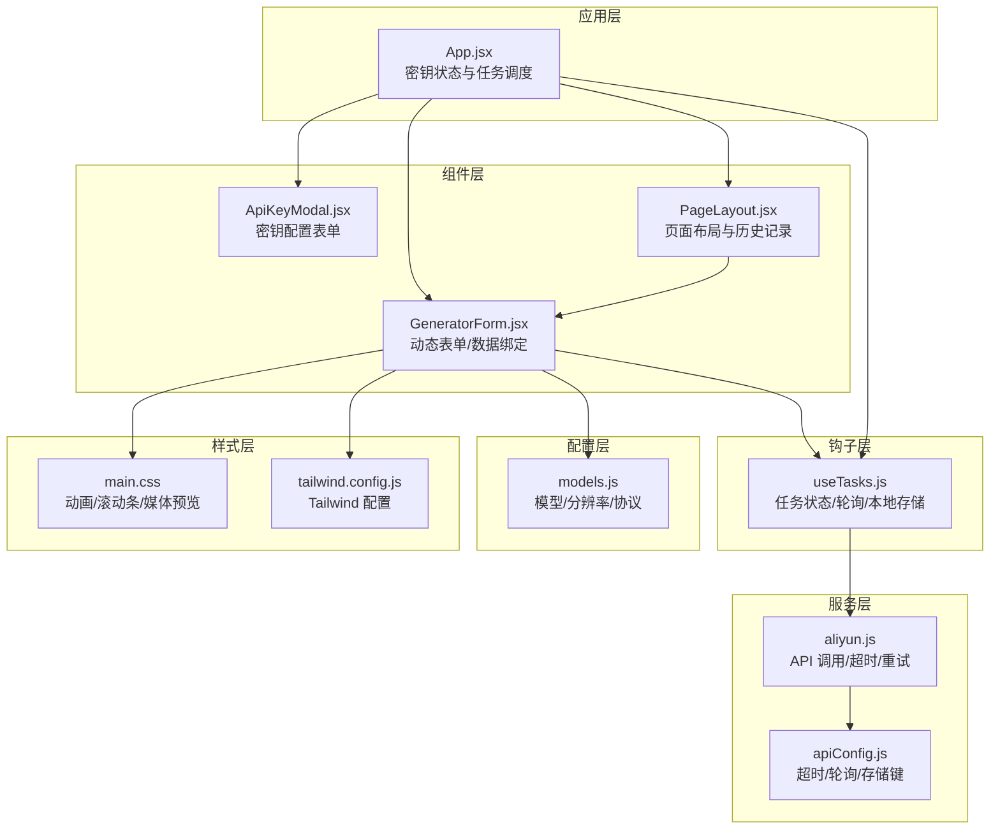
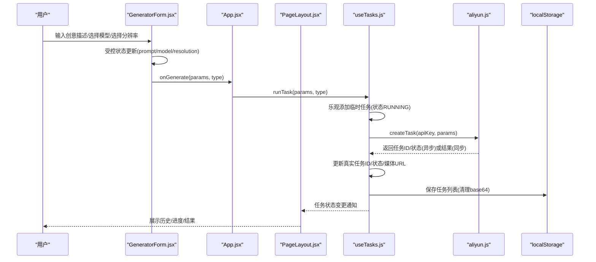
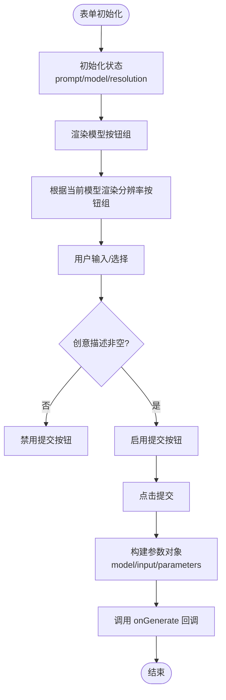
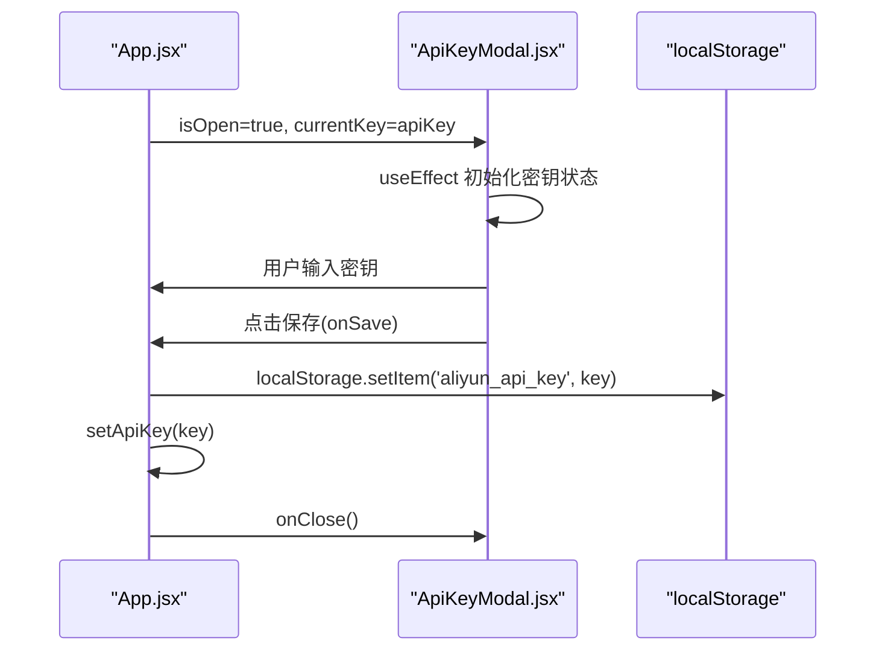
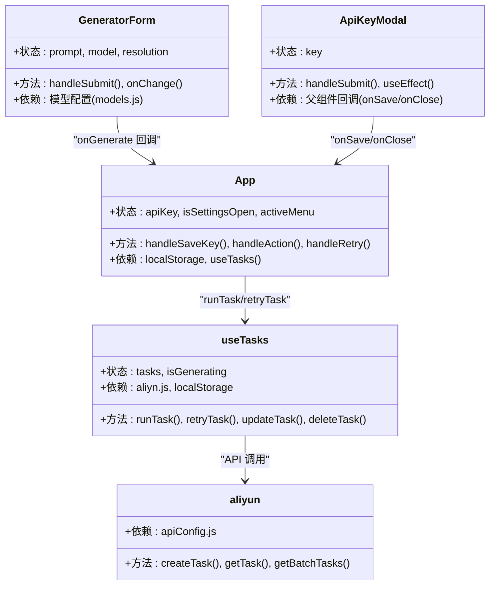
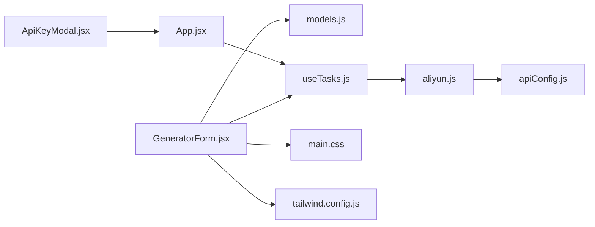

# 表单组件

<cite>
**本文引用的文件列表**
- [GeneratorForm.jsx](file://src/components/GeneratorForm.jsx)
- [ApiKeyModal.jsx](file://src/components/ApiKeyModal.jsx)
- [App.jsx](file://src/App.jsx)
- [PageLayout.jsx](file://src/components/PageLayout.jsx)
- [useTasks.js](file://src/hooks/useTasks.js)
- [aliyun.js](file://src/services/aliyun.js)
- [models.js](file://src/config/models.js)
- [apiConfig.js](file://src/config/apiConfig.js)
- [main.css](file://src/main.css)
- [tailwind.config.js](file://tailwind.config.js)
</cite>

## 目录
1. [简介](#简介)
2. [项目结构](#项目结构)
3. [核心组件](#核心组件)
4. [架构概览](#架构概览)
5. [组件详细分析](#组件详细分析)
6. [依赖关系分析](#依赖关系分析)
7. [性能考量](#性能考量)
8. [故障排查指南](#故障排查指南)
9. [结论](#结论)
10. [附录](#附录)

## 简介
本文件聚焦于通义万相前端应用中的表单组件，系统性解析以下内容：
- GeneratorForm.jsx 的动态表单生成、字段验证与数据绑定机制
- ApiKeyModal.jsx 的 API 密钥配置表单，包括密钥输入、验证与本地存储策略
- 表单组件的通用设计原则：用户体验优化、响应式布局与无障碍访问支持
- 表单数据处理流程与状态管理策略
- 定制化开发指南与最佳实践

## 项目结构
与表单相关的代码主要分布在以下位置：
- 组件层：表单组件位于 src/components
- 应用层：App.jsx 负责密钥状态与任务调度
- 钩子层：useTasks.js 管理任务状态与轮询
- 服务层：aliyun.js 封装 API 调用与错误处理
- 配置层：models.js 定义模型与分辨率配置；apiConfig.js 定义超时与轮询常量
- 样式层：main.css 与 tailwind.config.js 提供响应式与动画支持

图表来源
- [App.jsx](file://src/App.jsx#L42-L70)
- [GeneratorForm.jsx](file://src/components/GeneratorForm.jsx#L4-L205)
- [ApiKeyModal.jsx](file://src/components/ApiKeyModal.jsx#L4-L111)
- [PageLayout.jsx](file://src/components/PageLayout.jsx#L9-L76)
- [useTasks.js](file://src/hooks/useTasks.js#L9-L333)
- [aliyun.js](file://src/services/aliyun.js#L50-L160)
- [models.js](file://src/config/models.js#L1-L135)
- [apiConfig.js](file://src/config/apiConfig.js#L1-L35)
- [main.css](file://src/main.css#L1-L54)
- [tailwind.config.js](file://tailwind.config.js#L1-L12)

章节来源
- [App.jsx](file://src/App.jsx#L42-L70)
- [GeneratorForm.jsx](file://src/components/GeneratorForm.jsx#L4-L205)
- [ApiKeyModal.jsx](file://src/components/ApiKeyModal.jsx#L4-L111)
- [PageLayout.jsx](file://src/components/PageLayout.jsx#L9-L76)
- [useTasks.js](file://src/hooks/useTasks.js#L9-L333)
- [aliyun.js](file://src/services/aliyun.js#L50-L160)
- [models.js](file://src/config/models.js#L1-L135)
- [apiConfig.js](file://src/config/apiConfig.js#L1-L35)
- [main.css](file://src/main.css#L1-L54)
- [tailwind.config.js](file://tailwind.config.js#L1-L12)

## 核心组件
- 动态表单组件：GeneratorForm.jsx
  - 功能：接收用户输入（创意描述）、选择模型与分辨率，提交生成任务
  - 数据绑定：受控组件（React useState），表单值与状态双向绑定
  - 动态生成：根据模型配置动态渲染分辨率按钮组
  - 验证：提交前校验创意描述非空
- API 密钥配置组件：ApiKeyModal.jsx
  - 功能：弹窗式输入与保存 API Key，本地持久化
  - 数据绑定：受控组件，输入框与状态同步
  - 验证：保存按钮禁用条件为密钥非空
  - 存储：localStorage 本地存储，关闭弹窗时触发保存回调

章节来源
- [GeneratorForm.jsx](file://src/components/GeneratorForm.jsx#L4-L205)
- [ApiKeyModal.jsx](file://src/components/ApiKeyModal.jsx#L4-L111)

## 架构概览
表单数据流与状态管理的关键路径如下：

图表来源
- [GeneratorForm.jsx](file://src/components/GeneratorForm.jsx#L66-L80)
- [App.jsx](file://src/App.jsx#L55-L61)
- [useTasks.js](file://src/hooks/useTasks.js#L256-L312)
- [aliyun.js](file://src/services/aliyun.js#L50-L160)

## 组件详细分析

### GeneratorForm.jsx：动态表单生成、字段验证与数据绑定
- 设计模式
  - 受控组件：表单字段通过 useState 管理，onChange 直接更新状态，保证 UI 与状态一致
  - 动态表单：根据模型配置动态渲染分辨率按钮，支持不同模型的分辨率集合与默认分辨率
  - 状态联动：模型切换时自动校正分辨率，确保当前分辨率在模型支持范围内
- 字段与验证
  - 创意描述：必填校验（提交前 trim 后判空）
  - 模型与分辨率：通过模型配置表驱动，避免硬编码
- 数据绑定与提交
  - 提交时构造参数对象，包含 model、input.prompt、parameters.size 等
  - 通过父组件回调 onGenerate 触发任务创建
- 用户体验
  - 输入框支持字符计数与占位提示
  - 分辨率按钮带有图标与标签，视觉区分横竖屏与清晰度等级
  - 生成按钮禁用态与加载态反馈

图表来源
- [GeneratorForm.jsx](file://src/components/GeneratorForm.jsx#L4-L205)

章节来源
- [GeneratorForm.jsx](file://src/components/GeneratorForm.jsx#L4-L205)
- [models.js](file://src/config/models.js#L14-L43)

### ApiKeyModal.jsx：API 密钥配置表单
- 设计模式
  - 受控组件：密钥输入框与内部状态同步
  - 弹窗模式：通过 isOpen 控制显示/隐藏；onClose/onSave 回调解耦
- 字段与验证
  - 密钥输入：密码类型输入框，保存按钮禁用条件为非空
  - 提示信息：强调本地存储与安全
- 存储策略
  - 打开时从父组件传入的 currentKey 初始化
  - 保存时调用 onSave(key)，由父组件负责写入 localStorage 并更新应用状态
- 用户体验
  - 弹窗居中、遮罩层、关闭按钮
  - “前往阿里云控制台获取”外部链接，便于获取密钥

图表来源
- [ApiKeyModal.jsx](file://src/components/ApiKeyModal.jsx#L4-L111)
- [App.jsx](file://src/App.jsx#L43-L53)

章节来源
- [ApiKeyModal.jsx](file://src/components/ApiKeyModal.jsx#L4-L111)
- [App.jsx](file://src/App.jsx#L43-L53)

### 通用设计原则与最佳实践
- 用户体验优化
  - 明确的视觉层级与交互反馈：按钮禁用态、加载态、成功态
  - 输入提示与占位符：帮助用户理解字段用途
  - 即时反馈：字符计数、分辨率图标与标签
- 响应式布局
  - Flex/Grid 布局适配小屏与大屏：按钮组在小屏下换行，大屏横向排列
  - Tailwind 断点与容器宽度控制：最大宽度与水平居中
- 无障碍访问支持
  - 表单标签与输入框关联：建议为每个输入添加 htmlFor/id 对应
  - 键盘可达性：按钮与输入框支持键盘操作
  - 屏幕阅读器友好：为图标与状态提供可读文本（可通过 aria-label/aria-describedby 扩展）
- 定制化开发指南
  - 新增字段：在组件状态中新增 useState，表单中添加受控输入，提交时合并到参数对象
  - 新增模型：在 models.js 中扩展模型配置，GeneratorForm.jsx 自动渲染
  - 新增验证：在 handleSubmit 前增加校验逻辑，必要时在 UI 上展示错误提示
  - 新增存储：如需持久化其他表单数据，遵循 localStorage 限制与清理策略

章节来源
- [GeneratorForm.jsx](file://src/components/GeneratorForm.jsx#L82-L205)
- [ApiKeyModal.jsx](file://src/components/ApiKeyModal.jsx#L21-L111)
- [tailwind.config.js](file://tailwind.config.js#L1-L12)
- [main.css](file://src/main.css#L1-L54)

### 表单数据处理流程与状态管理策略
- 数据绑定与提交
  - GeneratorForm.jsx 通过受控组件收集输入，handleSubmit 构造参数并调用 onGenerate
  - App.jsx 在收到参数后，调用 useTasks.js 的 runTask，创建任务并进入轮询流程
- 任务状态管理
  - useTasks.js 乐观添加临时任务，随后根据 API 返回更新真实任务 ID 与状态
  - 采用自适应轮询策略：新任务高频轮询，稳定任务降低轮询频率
  - 本地存储：任务列表持久化，自动清理 base64 以节省空间
- API 调用与错误处理
  - aliyn.js 封装请求与超时控制，支持重试与错误分类
  - apiConfig.js 提供统一的超时与轮询常量，便于集中配置

图表来源
- [GeneratorForm.jsx](file://src/components/GeneratorForm.jsx#L4-L205)
- [ApiKeyModal.jsx](file://src/components/ApiKeyModal.jsx#L4-L111)
- [App.jsx](file://src/App.jsx#L42-L70)
- [useTasks.js](file://src/hooks/useTasks.js#L9-L333)
- [aliyun.js](file://src/services/aliyun.js#L50-L160)

章节来源
- [App.jsx](file://src/App.jsx#L42-L70)
- [useTasks.js](file://src/hooks/useTasks.js#L9-L333)
- [aliyun.js](file://src/services/aliyun.js#L50-L160)
- [apiConfig.js](file://src/config/apiConfig.js#L1-L35)

## 依赖关系分析
- 组件耦合
  - GeneratorForm.jsx 与 models.js 解耦：通过配置驱动渲染，便于扩展新模型
  - ApiKeyModal.jsx 与 App.jsx 通过回调解耦：保存与关闭逻辑由父组件控制
- 外部依赖
  - TailwindCSS 提供响应式与主题能力
  - localStorage 作为轻量持久化方案
- 潜在风险
  - localStorage 存储上限：useTasks.js 已做兜底，仅保留最近若干任务
  - 轮询频率与资源占用：自适应轮询策略已优化，仍需关注并发任务数量

图表来源
- [GeneratorForm.jsx](file://src/components/GeneratorForm.jsx#L4-L205)
- [ApiKeyModal.jsx](file://src/components/ApiKeyModal.jsx#L4-L111)
- [App.jsx](file://src/App.jsx#L42-L70)
- [useTasks.js](file://src/hooks/useTasks.js#L9-L333)
- [aliyun.js](file://src/services/aliyun.js#L50-L160)
- [models.js](file://src/config/models.js#L1-L135)
- [apiConfig.js](file://src/config/apiConfig.js#L1-L35)
- [main.css](file://src/main.css#L1-L54)
- [tailwind.config.js](file://tailwind.config.js#L1-L12)

章节来源
- [GeneratorForm.jsx](file://src/components/GeneratorForm.jsx#L4-L205)
- [ApiKeyModal.jsx](file://src/components/ApiKeyModal.jsx#L4-L111)
- [App.jsx](file://src/App.jsx#L42-L70)
- [useTasks.js](file://src/hooks/useTasks.js#L9-L333)
- [aliyun.js](file://src/services/aliyun.js#L50-L160)
- [models.js](file://src/config/models.js#L1-L135)
- [apiConfig.js](file://src/config/apiConfig.js#L1-L35)
- [main.css](file://src/main.css#L1-L54)
- [tailwind.config.js](file://tailwind.config.js#L1-L12)

## 性能考量
- 表单渲染
  - 使用受控组件减少不必要的重渲染，配合 useMemo 优化历史列表渲染（PageLayout.jsx）
- 轮询策略
  - 新任务高频轮询，稳定任务降低频率，避免过度占用网络与 CPU
- 存储优化
  - 任务持久化前清理 base64，防止 localStorage 溢出
- 资源加载
  - 图片/视频预览使用 object-fit 与最大尺寸限制，避免布局抖动

章节来源
- [PageLayout.jsx](file://src/components/PageLayout.jsx#L22-L26)
- [useTasks.js](file://src/hooks/useTasks.js#L30-L84)
- [aliyun.js](file://src/services/aliyun.js#L83-L160)

## 故障排查指南
- 提交按钮不可用
  - 检查创意描述是否为空（提交前会校验）
- 无法保存 API 密钥
  - 确认弹窗 isOpen 为 true，且密钥非空
  - 检查 localStorage 是否可用（浏览器隐私模式或存储配额不足）
- 任务状态长时间停留在 RUNNING
  - 检查网络连接与 API Key 有效性
  - 查看浏览器控制台的轮询日志与错误信息
- 生成结果未显示
  - 确认任务状态已变为 SUCCEEDED 且媒体 URL 已返回
  - 检查本地存储是否被清理或容量不足

章节来源
- [GeneratorForm.jsx](file://src/components/GeneratorForm.jsx#L66-L80)
- [ApiKeyModal.jsx](file://src/components/ApiKeyModal.jsx#L15-L19)
- [useTasks.js](file://src/hooks/useTasks.js#L164-L246)
- [aliyun.js](file://src/services/aliyun.js#L146-L160)

## 结论
本项目在表单组件层面采用了“配置驱动 + 受控组件”的设计，实现了：
- 动态表单生成与模型解耦
- 明确的数据绑定与提交流程
- 完整的 API 密钥配置与本地存储策略
- 响应式布局与良好的用户体验
- 健壮的任务状态管理与轮询策略

通过以上分析与最佳实践，开发者可以快速扩展新模型、新增字段与增强表单交互。

## 附录
- 快速定位关键实现
  - 表单提交与参数构造：[GeneratorForm.jsx](file://src/components/GeneratorForm.jsx#L66-L80)
  - 密钥保存与本地存储：[ApiKeyModal.jsx](file://src/components/ApiKeyModal.jsx#L15-L19)、[App.jsx](file://src/App.jsx#L50-L53)
  - 任务创建与轮询：[useTasks.js](file://src/hooks/useTasks.js#L256-L312)、[aliyun.js](file://src/services/aliyun.js#L50-L160)
  - 模型与分辨率配置：[models.js](file://src/config/models.js#L14-L43)
  - 超时与轮询常量：[apiConfig.js](file://src/config/apiConfig.js#L8-L27)