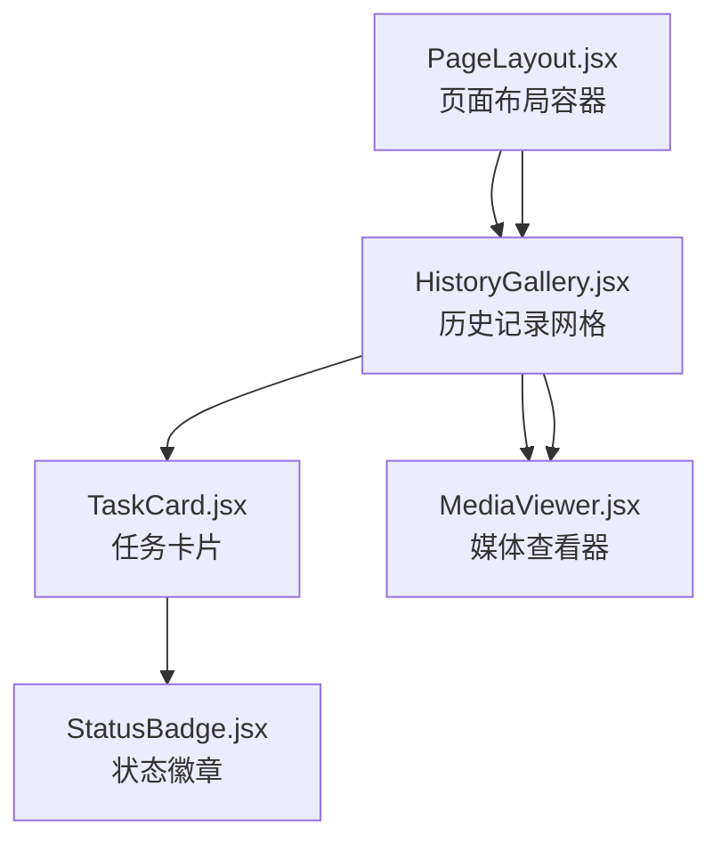
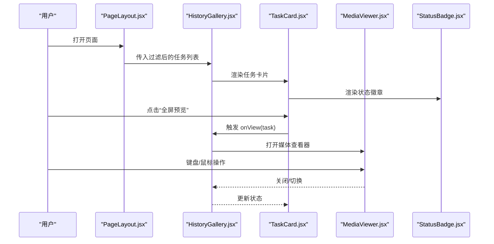
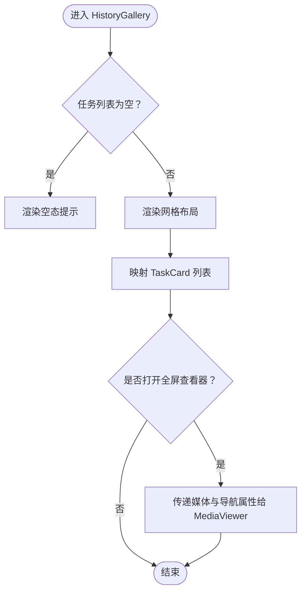
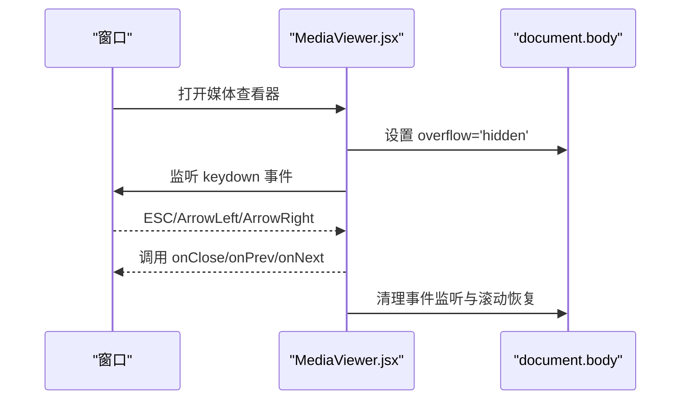
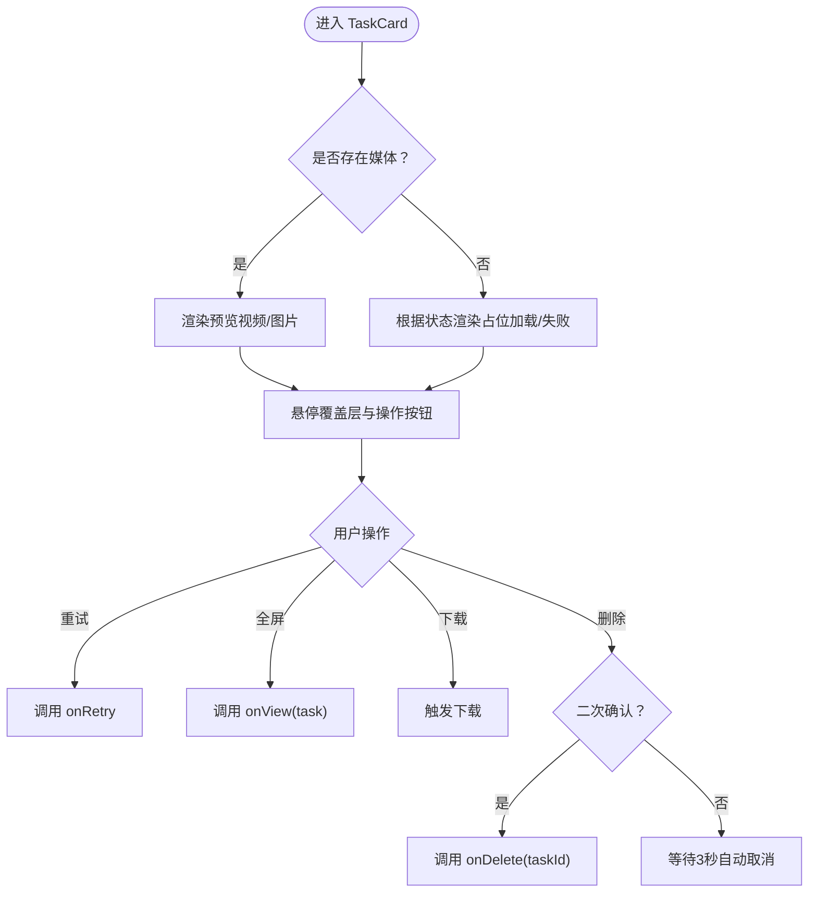
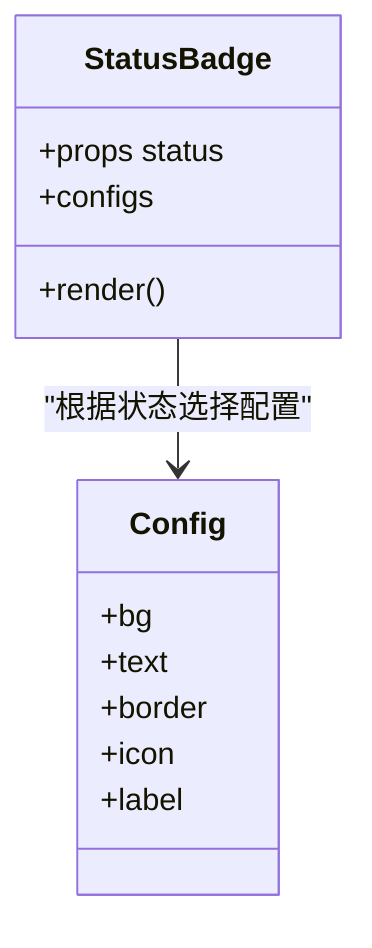
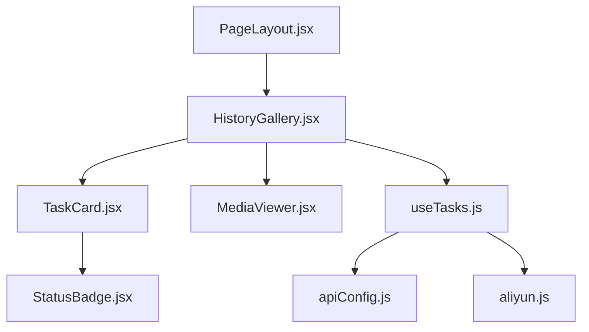

# 辅助组件

<cite>
**本文引用的文件**
- [HistoryGallery.jsx](file://src/components/HistoryGallery.jsx)
- [MediaViewer.jsx](file://src/components/MediaViewer.jsx)
- [TaskCard.jsx](file://src/components/TaskCard.jsx)
- [StatusBadge.jsx](file://src/components/StatusBadge.jsx)
- [useTasks.js](file://src/hooks/useTasks.js)
- [PageLayout.jsx](file://src/components/PageLayout.jsx)
- [apiConfig.js](file://src/config/apiConfig.js)
- [aliyun.js](file://src/services/aliyun.js)
</cite>

## 目录
1. [简介](#简介)
2. [项目结构](#项目结构)
3. [核心组件](#核心组件)
4. [架构总览](#架构总览)
5. [详细组件分析](#详细组件分析)
6. [依赖关系分析](#依赖关系分析)
7. [性能考量](#性能考量)
8. [故障排查指南](#故障排查指南)
9. [结论](#结论)
10. [附录](#附录)

## 简介
本文件聚焦于通义万相前端应用中的辅助组件，系统性解析以下组件：
- 历史记录展示组件：HistoryGallery.jsx
- 媒体内容查看器：MediaViewer.jsx
- 任务卡片组件：TaskCard.jsx
- 状态徽章：StatusBadge.jsx

文档从架构、数据流、交互与渲染优化等维度进行深入剖析，并提供可复用策略与扩展开发建议，帮助开发者在不改变现有契约的前提下高效迭代。

## 项目结构
这些组件围绕“任务历史”与“媒体预览”的核心场景协作，通过统一的布局容器 PageLayout.jsx 将生成表单与历史记录区域组织在一起；历史记录区域内部由 HistoryGallery.jsx 负责网格化展示与全屏媒体查看器的集成。

图表来源
- [PageLayout.jsx](file://src/components/PageLayout.jsx#L28-L72)
- [HistoryGallery.jsx](file://src/components/HistoryGallery.jsx#L38-L64)
- [TaskCard.jsx](file://src/components/TaskCard.jsx#L37-L179)
- [MediaViewer.jsx](file://src/components/MediaViewer.jsx#L36-L121)
- [StatusBadge.jsx](file://src/components/StatusBadge.jsx#L8-L55)

章节来源
- [PageLayout.jsx](file://src/components/PageLayout.jsx#L1-L76)
- [HistoryGallery.jsx](file://src/components/HistoryGallery.jsx#L1-L68)

## 核心组件
- HistoryGallery.jsx：负责历史任务的网格展示、空态提示以及全屏媒体查看器的集成与导航。
- MediaViewer.jsx：提供全屏媒体预览、键盘与点击事件处理、左右切换与下载/新标签打开能力。
- TaskCard.jsx：单条任务卡片，包含预览图/视频、状态徽章、操作按钮（重试、全屏、下载、删除），并处理删除确认与重试逻辑。
- StatusBadge.jsx：统一的状态徽章展示，基于状态映射不同样式与图标。

章节来源
- [HistoryGallery.jsx](file://src/components/HistoryGallery.jsx#L6-L67)
- [MediaViewer.jsx](file://src/components/MediaViewer.jsx#L5-L124)
- [TaskCard.jsx](file://src/components/TaskCard.jsx#L9-L181)
- [StatusBadge.jsx](file://src/components/StatusBadge.jsx#L8-L57)

## 架构总览
组件间的数据与控制流如下：
- PageLayout.jsx 作为容器，向 HistoryGallery.jsx 传递过滤后的任务列表与删除/重试回调。
- HistoryGallery.jsx 将任务数组映射为 TaskCard 列表，并在需要时打开 MediaViewer.jsx 进行全屏预览。
- TaskCard.jsx 内部使用 StatusBadge.jsx 展示状态，并在用户交互时调用父级传入的 onDelete/onRetry 回调。
- MediaViewer.jsx 通过 props 接收媒体对象与导航回调，支持键盘与点击事件。

图表来源
- [PageLayout.jsx](file://src/components/PageLayout.jsx#L65-L69)
- [HistoryGallery.jsx](file://src/components/HistoryGallery.jsx#L42-L62)
- [TaskCard.jsx](file://src/components/TaskCard.jsx#L46-L122)
- [MediaViewer.jsx](file://src/components/MediaViewer.jsx#L36-L121)
- [StatusBadge.jsx](file://src/components/StatusBadge.jsx#L49-L54)

## 详细组件分析

### HistoryGallery.jsx：历史记录网格与全屏查看器集成
- 数据加载与空态
  - 当任务列表为空时，渲染空态提示，鼓励用户开始创作。
- 分页与列表渲染
  - 使用 CSS Grid 实现响应式列数（移动端至超大屏逐步递增），并按最新优先顺序展示。
  - 通过 memo 包装减少不必要的重渲染。
- 全屏媒体查看器集成
  - 通过状态 viewerMedia 控制 MediaViewer 的打开与关闭。
  - 计算当前索引 currentIndex，据此启用/禁用上一张/下一张导航按钮。
  - 通过 props 传递媒体对象、关闭回调、导航回调与导航可用性标志。

图表来源
- [HistoryGallery.jsx](file://src/components/HistoryGallery.jsx#L23-L64)

章节来源
- [HistoryGallery.jsx](file://src/components/HistoryGallery.jsx#L6-L67)

### MediaViewer.jsx：全屏媒体查看器
- 事件处理
  - 键盘事件：ESC 关闭、左右箭头切换（受 hasPrev/hasNext 限制）。
  - 点击事件：点击遮罩层关闭，按钮点击阻止冒泡。
- 视口与滚动控制
  - 打开时禁用 body 滚动，关闭时恢复。
- 媒体类型适配
  - 自动识别视频/图片，分别渲染 video 或 img，并设置合适的类名与属性。
- 操作栏
  - 下载与新标签打开链接，自动指向当前媒体 URL。
  - 显示模型名称用于溯源。

图表来源
- [MediaViewer.jsx](file://src/components/MediaViewer.jsx#L7-L27)
- [MediaViewer.jsx](file://src/components/MediaViewer.jsx#L36-L121)

章节来源
- [MediaViewer.jsx](file://src/components/MediaViewer.jsx#L5-L124)

### TaskCard.jsx：任务卡片与交互行为
- 预览与占位
  - 若为视频：渲染 video 并叠加播放图标覆盖层；若为图片：渲染 img 并在悬停时放大；否则根据状态显示加载动画或失败提示。
- 状态徽章
  - 在左上角展示 StatusBadge.jsx，统一状态样式与图标。
- 操作按钮
  - 重试：仅在失败或成功且存在 originalParams 时显示。
  - 全屏预览：当存在媒体时显示。
  - 下载：直接使用 a 标签 href 指向媒体 URL。
  - 删除：二次确认，3 秒后自动取消确认状态。
- 动画与延迟
  - 卡片入场动画带延迟，形成逐个出现的视觉效果。

图表来源
- [TaskCard.jsx](file://src/components/TaskCard.jsx#L44-L153)

章节来源
- [TaskCard.jsx](file://src/components/TaskCard.jsx#L9-L181)

### StatusBadge.jsx：状态徽章的视觉设计与状态映射
- 状态映射
  - PENDING/RUNNING/SUCCEEDED/FAILED/UNKNOWN 分别映射到不同的背景色、文字色、边框与图标。
- 默认回退
  - 未知状态时回退到 UNKNOWN 配置，保证 UI 稳定性。
- 统一样式
  - 使用统一的圆角、阴影与图标尺寸，确保在不同卡片中风格一致。

图表来源
- [StatusBadge.jsx](file://src/components/StatusBadge.jsx#L9-L45)

章节来源
- [StatusBadge.jsx](file://src/components/StatusBadge.jsx#L8-L57)

## 依赖关系分析
- 组件依赖
  - HistoryGallery.jsx 依赖 TaskCard.jsx 与 MediaViewer.jsx。
  - TaskCard.jsx 依赖 StatusBadge.jsx。
  - PageLayout.jsx 依赖 HistoryGallery.jsx。
- 数据与状态
  - useTasks.js 提供任务状态管理、轮询与本地存储，HistoryGallery.jsx/TaskCard.jsx 通过回调与 props 与之交互。
- 配置与服务
  - apiConfig.js 定义轮询间隔与存储键；aliyun.js 提供任务创建、轮询与批量查询接口。

图表来源
- [PageLayout.jsx](file://src/components/PageLayout.jsx#L3-L3)
- [HistoryGallery.jsx](file://src/components/HistoryGallery.jsx#L3-L4)
- [TaskCard.jsx](file://src/components/TaskCard.jsx#L2-L3)
- [useTasks.js](file://src/hooks/useTasks.js#L1-L4)
- [apiConfig.js](file://src/config/apiConfig.js#L22-L27)
- [aliyun.js](file://src/services/aliyun.js#L1-L3)

章节来源
- [useTasks.js](file://src/hooks/useTasks.js#L1-L333)
- [apiConfig.js](file://src/config/apiConfig.js#L1-L35)
- [aliyun.js](file://src/services/aliyun.js#L1-L215)

## 性能考量
- 渲染优化
  - HistoryGallery.jsx 与 TaskCard.jsx 均使用 memo 包装，减少因外部状态变化导致的重复渲染。
  - TaskCard.jsx 使用 useMemo 过滤任务，避免每次渲染都重新计算。
- 事件与副作用
  - MediaViewer.jsx 在打开时禁用 body 滚动并在卸载时恢复，避免滚动穿透问题。
  - HistoryGallery.jsx 仅在需要时渲染 MediaViewer，避免不必要的节点挂载。
- 轮询与存储
  - useTasks.js 中采用自适应轮询间隔与批量轮询，降低网络压力与重渲染次数。
  - 本地存储清理 base64 数据并限制最大数量，避免内存与存储溢出。

章节来源
- [HistoryGallery.jsx](file://src/components/HistoryGallery.jsx#L67-L67)
- [TaskCard.jsx](file://src/components/TaskCard.jsx#L181-L181)
- [PageLayout.jsx](file://src/components/PageLayout.jsx#L22-L26)
- [MediaViewer.jsx](file://src/components/MediaViewer.jsx#L20-L27)
- [useTasks.js](file://src/hooks/useTasks.js#L30-L84)
- [useTasks.js](file://src/hooks/useTasks.js#L86-L104)
- [useTasks.js](file://src/hooks/useTasks.js#L106-L161)

## 故障排查指南
- 媒体无法预览
  - 检查媒体 URL 是否存在（videoUrl/imgUrl），确认 isVideo 判断逻辑与 URL 渲染分支。
  - 确认 MediaViewer.jsx 的 portal 渲染目标与遮罩层层级。
- 键盘快捷键无效
  - 确认 MediaViewer.jsx 的 keydown 监听是否在 media 存在时注册，hasNext/hasPrev 是否正确传递。
- 删除确认未生效
  - 检查 TaskCard.jsx 的删除确认逻辑与 setTimeout 清理。
- 状态徽章样式异常
  - 确认状态值是否在配置映射中，未知状态会回退到 UNKNOWN。
- 轮询不生效或频繁失败
  - 检查 apiConfig.js 的轮询间隔与超时设置，确认 aliyn.js 的 getBatchTasks 返回结构与 useTasks.js 的状态更新逻辑。

章节来源
- [MediaViewer.jsx](file://src/components/MediaViewer.jsx#L10-L17)
- [TaskCard.jsx](file://src/components/TaskCard.jsx#L16-L25)
- [StatusBadge.jsx](file://src/components/StatusBadge.jsx#L47-L47)
- [apiConfig.js](file://src/config/apiConfig.js#L22-L27)
- [aliyun.js](file://src/services/aliyun.js#L211-L214)
- [useTasks.js](file://src/hooks/useTasks.js#L164-L246)

## 结论
上述辅助组件围绕“历史记录展示—媒体预览—任务交互—状态可视化”形成了清晰的职责边界与稳定的交互链路。通过 memo 与 useMemo 的使用、自适应轮询与本地存储优化，整体具备良好的性能与可维护性。后续扩展可在不破坏现有契约的前提下，增强媒体类型支持、引入更多操作按钮或改进状态映射。

## 附录
- 复用策略
  - 将状态映射集中于 StatusBadge.jsx，便于全局一致性。
  - 将媒体预览抽象为独立组件（MediaViewer.jsx），便于在其他模块复用。
  - 将任务卡片的交互行为封装为回调（onDelete/onRetry/onView），便于在不同页面复用。
- 扩展开发指南
  - 新增媒体类型：在 MediaViewer.jsx 中扩展 isVideo 判断与渲染分支。
  - 新增操作按钮：在 TaskCard.jsx 中新增按钮并绑定相应回调，注意与 onDelete/onRetry 的统一。
  - 新增状态：在 StatusBadge.jsx 中补充状态映射，确保样式与图标一致。
  - 优化轮询：在 useTasks.js 中调整自适应策略或批量轮询粒度，平衡实时性与性能。