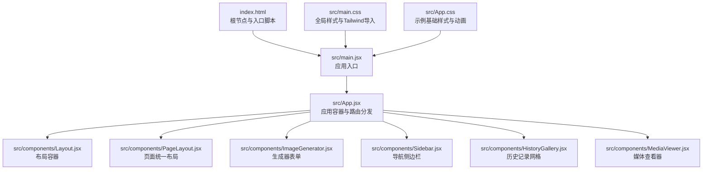
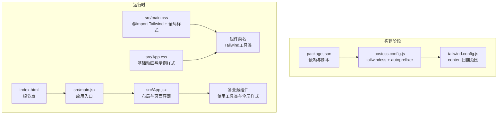
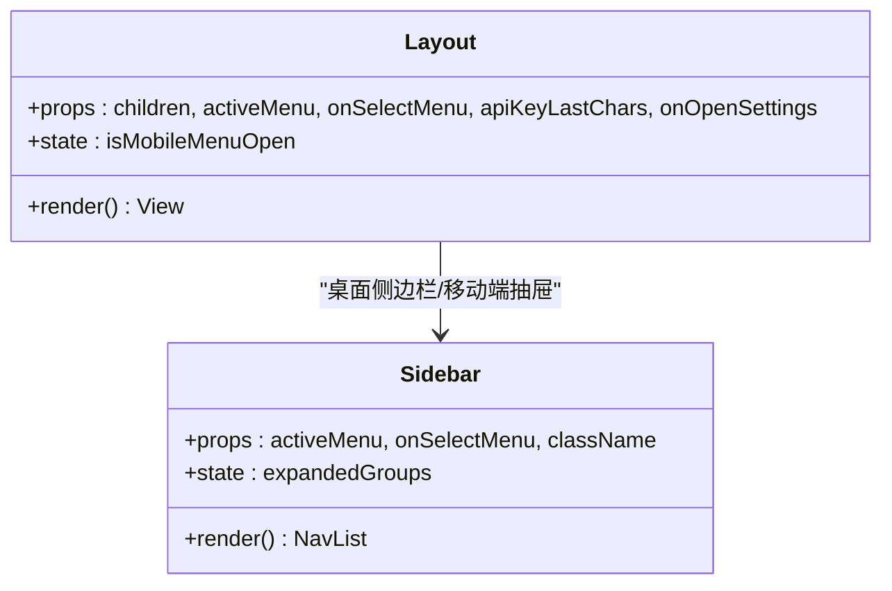
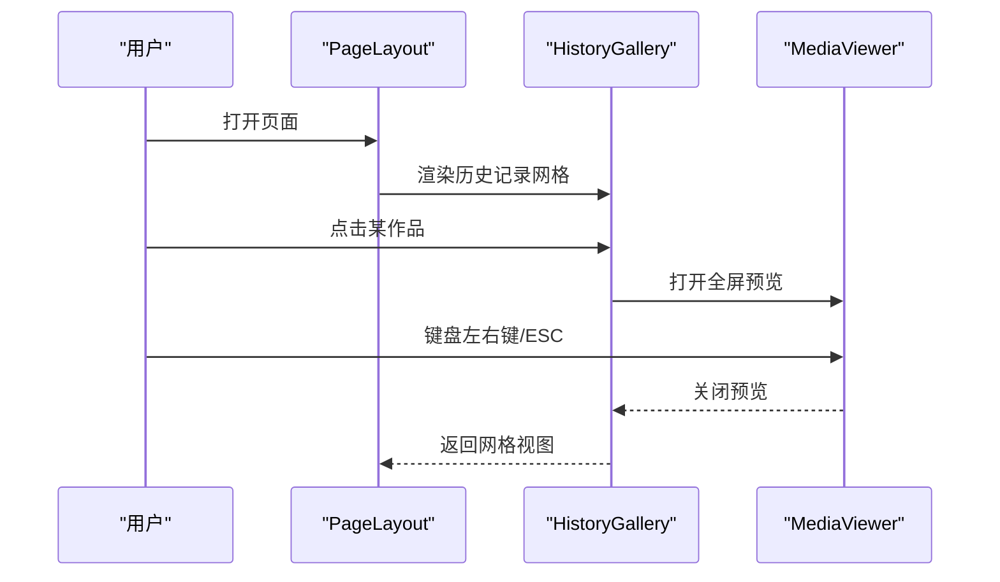
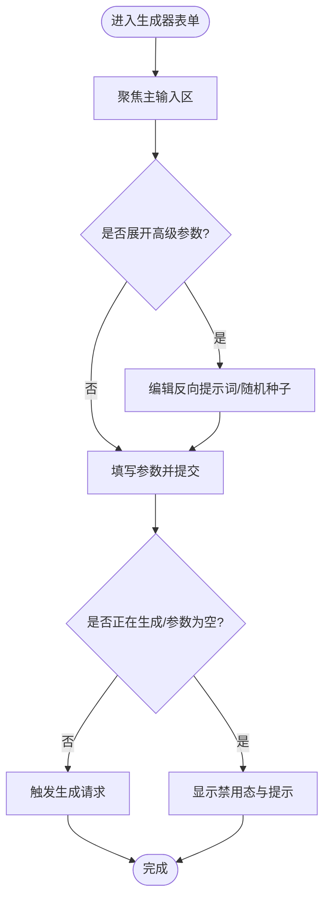
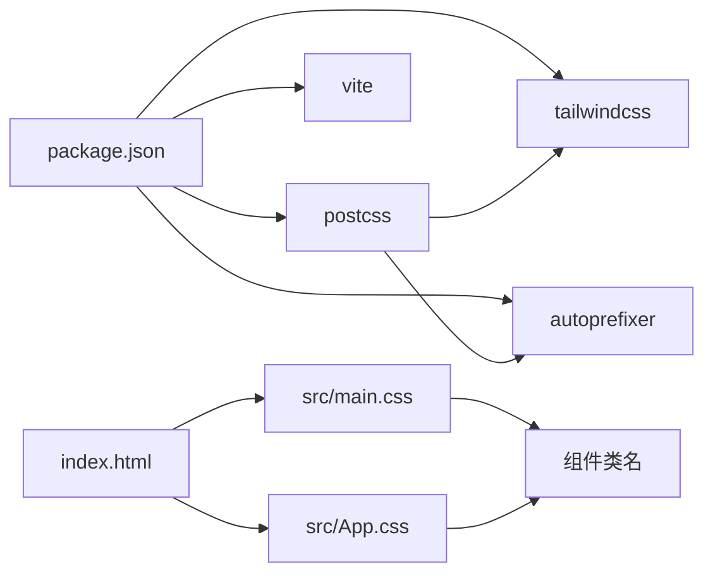

# 样式系统

<cite>
**本文引用的文件**
- [tailwind.config.js](file://tailwind.config.js)
- [postcss.config.js](file://postcss.config.js)
- [package.json](file://package.json)
- [vite.config.js](file://vite.config.js)
- [src/App.css](file://src/App.css)
- [src/main.css](file://src/main.css)
- [src/App.jsx](file://src/App.jsx)
- [src/components/Layout.jsx](file://src/components/Layout.jsx)
- [src/components/PageLayout.jsx](file://src/components/PageLayout.jsx)
- [src/components/ImageGenerator.jsx](file://src/components/ImageGenerator.jsx)
- [src/components/Sidebar.jsx](file://src/components/Sidebar.jsx)
- [src/components/HistoryGallery.jsx](file://src/components/HistoryGallery.jsx)
- [src/components/MediaViewer.jsx](file://src/components/MediaViewer.jsx)
- [index.html](file://index.html)
</cite>

## 目录
1. [简介](#简介)
2. [项目结构](#项目结构)
3. [核心组件](#核心组件)
4. [架构总览](#架构总览)
5. [详细组件分析](#详细组件分析)
6. [依赖关系分析](#依赖关系分析)
7. [性能考虑](#性能考虑)
8. [故障排查指南](#故障排查指南)
9. [结论](#结论)
10. [附录](#附录)

## 简介
本文件面向通义万相前端应用的样式系统，围绕基于 Tailwind CSS 的实用优先样式框架展开，系统性说明以下方面：
- 全局样式的组织结构与职责划分（App.css 与 main.css 的作用与区别）
- 响应式设计策略（断点、移动端适配、跨浏览器兼容）
- 组件样式最佳实践（类名规范、主题定制、样式复用）
- 性能优化（按需加载、CSS 压缩与缓存）
- 自定义样式指导方案

## 项目结构
样式系统由构建工具链与源码样式两部分组成：
- 构建工具链：Vite + PostCSS + Tailwind CSS
- 源码样式：main.css 引入 Tailwind 基础、组件与工具类；App.css 提供示例级基础样式与动画
- 页面入口：index.html 引入根节点与主入口脚本

图表来源
- [index.html](file://index.html#L1-L14)
- [src/App.jsx](file://src/App.jsx#L1-L377)
- [src/components/Layout.jsx](file://src/components/Layout.jsx#L1-L94)
- [src/components/PageLayout.jsx](file://src/components/PageLayout.jsx#L1-L76)
- [src/components/ImageGenerator.jsx](file://src/components/ImageGenerator.jsx#L1-L249)
- [src/components/Sidebar.jsx](file://src/components/Sidebar.jsx#L1-L149)
- [src/components/HistoryGallery.jsx](file://src/components/HistoryGallery.jsx#L1-L68)
- [src/components/MediaViewer.jsx](file://src/components/MediaViewer.jsx#L1-L125)
- [src/main.css](file://src/main.css#L1-L54)
- [src/App.css](file://src/App.css#L1-L43)

章节来源
- [index.html](file://index.html#L1-L14)
- [src/App.jsx](file://src/App.jsx#L1-L377)

## 核心组件
- Tailwind 配置：content 扫描范围覆盖 HTML 与 src 下所有 JS/TSX 文件，确保仅打包使用到的工具类，减少体积
- PostCSS 配置：启用 tailwindcss 与 autoprefixer 插件，负责从 @import 的 Tailwind 模块生成最终 CSS 并添加厂商前缀
- Vite 配置：开发服务器端口与代理配置，不影响样式流程但影响资源加载路径
- 全局样式：
  - main.css：引入 Tailwind 的 base/components/utilities，并设置基础字体、颜色方案、滚动条样式、自定义动画与媒体预览覆盖
  - App.css：示例级基础样式与旋转动画，演示如何在应用中补充基础样式

章节来源
- [tailwind.config.js](file://tailwind.config.js#L1-L12)
- [postcss.config.js](file://postcss.config.js#L1-L7)
- [vite.config.js](file://vite.config.js#L1-L23)
- [src/main.css](file://src/main.css#L1-L54)
- [src/App.css](file://src/App.css#L1-L43)

## 架构总览
样式系统采用“声明式工具类 + 全局基线”的组合策略：
- 声明式工具类：通过 Tailwind 类名快速搭建布局与视觉层级，保证一致性与可维护性
- 全局基线：通过 main.css 定义基础排版、颜色方案、滚动条与通用动画，确保跨组件一致体验
- 动画与交互：App.css 中的基础动画与 main.css 中的自定义动画共同支撑组件过渡与交互

图表来源
- [package.json](file://package.json#L1-L33)
- [postcss.config.js](file://postcss.config.js#L1-L7)
- [tailwind.config.js](file://tailwind.config.js#L1-L12)
- [src/main.css](file://src/main.css#L1-L54)
- [src/App.css](file://src/App.css#L1-L43)
- [index.html](file://index.html#L1-L14)

## 详细组件分析

### 布局与导航组件的样式实践
- Layout.jsx
  - 使用 Tailwind 类名组织整体布局：屏幕高度、背景色、边框、阴影、滚动区域与滚动条样式
  - 移动端适配：通过断点类在小屏隐藏桌面侧边栏，Overlay 层实现抽屉菜单
  - 交互状态：根据 API Key 状态动态切换按钮样式与动画
- Sidebar.jsx
  - 使用分组展开/收起逻辑，配合 Tailwind 类名实现选中态与悬停态
  - 滚动条样式继承自全局样式，保证一致的滚动体验

图表来源
- [src/components/Layout.jsx](file://src/components/Layout.jsx#L1-L94)
- [src/components/Sidebar.jsx](file://src/components/Sidebar.jsx#L1-L149)

章节来源
- [src/components/Layout.jsx](file://src/components/Layout.jsx#L1-L94)
- [src/components/Sidebar.jsx](file://src/components/Sidebar.jsx#L1-L149)

### 页面统一布局与历史记录
- PageLayout.jsx
  - 通过 Tailwind 类名实现卡片化、毛玻璃与边框阴影，统一页面视觉
  - 使用 backdrop-blur 与半透明背景营造现代感
  - 历史记录面板支持折叠，使用过渡动画与图标指示状态
- HistoryGallery.jsx
  - 使用栅格布局在不同断点下展示作品缩略图，响应式列数随屏幕宽度变化
  - 与 MediaViewer 协作，实现全屏预览与键盘事件控制

图表来源
- [src/components/PageLayout.jsx](file://src/components/PageLayout.jsx#L1-L76)
- [src/components/HistoryGallery.jsx](file://src/components/HistoryGallery.jsx#L1-L68)
- [src/components/MediaViewer.jsx](file://src/components/MediaViewer.jsx#L1-L125)

章节来源
- [src/components/PageLayout.jsx](file://src/components/PageLayout.jsx#L1-L76)
- [src/components/HistoryGallery.jsx](file://src/components/HistoryGallery.jsx#L1-L68)
- [src/components/MediaViewer.jsx](file://src/components/MediaViewer.jsx#L1-L125)

### 生成器表单的样式与交互
- ImageGenerator.jsx
  - 输入区使用圆角卡片与阴影，通过绝对定位的标题与工具栏提升信息密度
  - 高级参数面板使用淡入动画与毛玻璃背景，避免遮挡主表单
  - 控制区右侧栏使用统一圆角与边框，强调交互元素（模型选择、分辨率、开关与按钮）
  - 提交按钮使用渐变背景与悬停缩放，禁用态降低透明度，提供明确反馈

图表来源
- [src/components/ImageGenerator.jsx](file://src/components/ImageGenerator.jsx#L1-L249)

章节来源
- [src/components/ImageGenerator.jsx](file://src/components/ImageGenerator.jsx#L1-L249)

### 全局样式与动画
- main.css
  - 导入 Tailwind 的 base/components/utilities，确保工具类可用
  - 设置 :root 的 color-scheme，改善系统控件外观
  - 定义自定义滚动条样式，统一跨浏览器滚动条观感
  - 定义通用动画类（如淡入向上），并在组件中复用
  - 对特定组件（如媒体预览）提供覆盖规则，保证最大可视区域与对象填充
- App.css
  - 提供示例级基础样式与旋转动画，演示如何在应用中补充基础样式

章节来源
- [src/main.css](file://src/main.css#L1-L54)
- [src/App.css](file://src/App.css#L1-L43)

## 依赖关系分析
- 构建依赖
  - Tailwind CSS：提供原子化工具类与基础样式
  - Autoprefixer：自动添加浏览器厂商前缀，提升兼容性
  - PostCSS：作为编译管线，串联 Tailwind 与 Autoprefixer
  - Vite：开发服务器与构建打包，提供热更新与代理能力
- 运行时依赖
  - main.css 与 App.css 在应用入口被引入，形成全局样式基线
  - 组件通过 Tailwind 类名与全局样式协作，实现一致的视觉与交互体验

图表来源
- [package.json](file://package.json#L1-L33)
- [postcss.config.js](file://postcss.config.js#L1-L7)
- [index.html](file://index.html#L1-L14)
- [src/main.css](file://src/main.css#L1-L54)
- [src/App.css](file://src/App.css#L1-L43)

章节来源
- [package.json](file://package.json#L1-L33)
- [postcss.config.js](file://postcss.config.js#L1-L7)
- [index.html](file://index.html#L1-L14)

## 性能考虑
- 按需生成：Tailwind content 配置仅扫描 index.html 与 src 下的 JS/TSX 文件，确保未使用的工具类不会被打包
- CSS 压缩：生产构建由 Vite 负责，PostCSS 与 Tailwind 在构建阶段完成处理，产物会经过压缩
- 缓存策略：静态资源在生产环境通常由服务端或 CDN 提供强缓存策略，建议配合文件指纹与版本号管理
- 动画与滚动条：全局动画与滚动条样式一次性定义，避免重复计算与冗余样式
- 组件渲染：使用 useMemo 缓存过滤结果，减少不必要的重渲染与样式重排

章节来源
- [tailwind.config.js](file://tailwind.config.js#L1-L12)
- [vite.config.js](file://vite.config.js#L1-L23)
- [src/components/PageLayout.jsx](file://src/components/PageLayout.jsx#L22-L26)

## 故障排查指南
- 样式未生效
  - 检查 main.css 是否正确引入，确认 Tailwind 的 base/components/utilities 已被 @import
  - 确认组件类名拼写正确，避免大小写与空格错误
- 动画无效
  - 检查是否正确引入了包含动画定义的 CSS 文件
  - 确认动画类名与组件中使用的类名一致
- 滚动条样式异常
  - 确认全局滚动条样式已在 main.css 中定义
  - 检查浏览器兼容性与 ::-webkit- 前缀支持情况
- 响应式断点不生效
  - 确认 Tailwind 默认断点满足需求；如需自定义，可在 tailwind.config.js 中扩展 theme.extend.screens
- 生成器表单交互异常
  - 检查禁用态与按钮状态逻辑，确保在生成中或参数为空时正确禁用

章节来源
- [src/main.css](file://src/main.css#L1-L54)
- [src/App.css](file://src/App.css#L1-L43)
- [src/components/ImageGenerator.jsx](file://src/components/ImageGenerator.jsx#L220-L240)

## 结论
本样式系统以 Tailwind CSS 为核心，结合 PostCSS 与 Vite 构建管线，实现了声明式工具类与全局基线样式的协同。通过合理的断点策略、动画与滚动条统一、以及按需生成与压缩，既保证了开发效率与一致性，也兼顾了性能与可维护性。建议在后续迭代中持续关注断点扩展、主题变量与暗色模式支持，以进一步提升跨设备与无障碍体验。

## 附录
- 命名规范建议
  - 组件类名优先使用 Tailwind 工具类，语义化组合（如 bg/rounded/shadow/text 等）
  - 自定义动画与覆盖样式集中于全局样式文件，组件内部尽量只使用工具类
  - 交互状态类名遵循“hover/focus/active/disabled”等标准伪类命名
- 主题定制建议
  - 在 tailwind.config.js 中通过 theme.extend 扩展颜色、字体、间距与断点
  - 使用 CSS 变量在 :root 中定义品牌色与语义色，组件通过变量引用
- 复用策略
  - 将通用卡片、按钮、输入框等封装为可复用的子组件，统一类名与状态
  - 使用分组与条件类名（如三元表达式）在组件内部实现状态切换
- 跨浏览器兼容
  - 依赖 Autoprefixer 自动生成厂商前缀
  - 对特殊选择器（如 ::-webkit-scrollbar）提供降级方案或条件注释