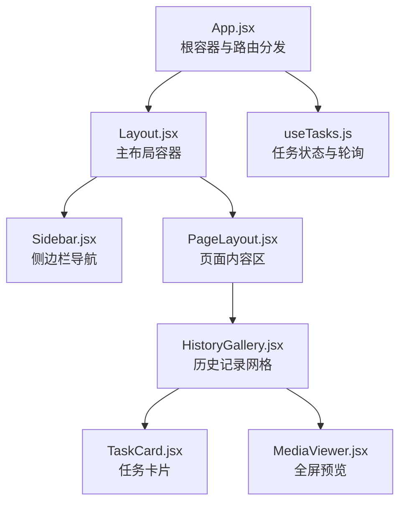
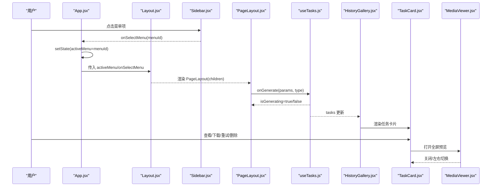
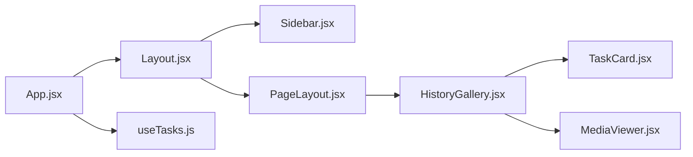
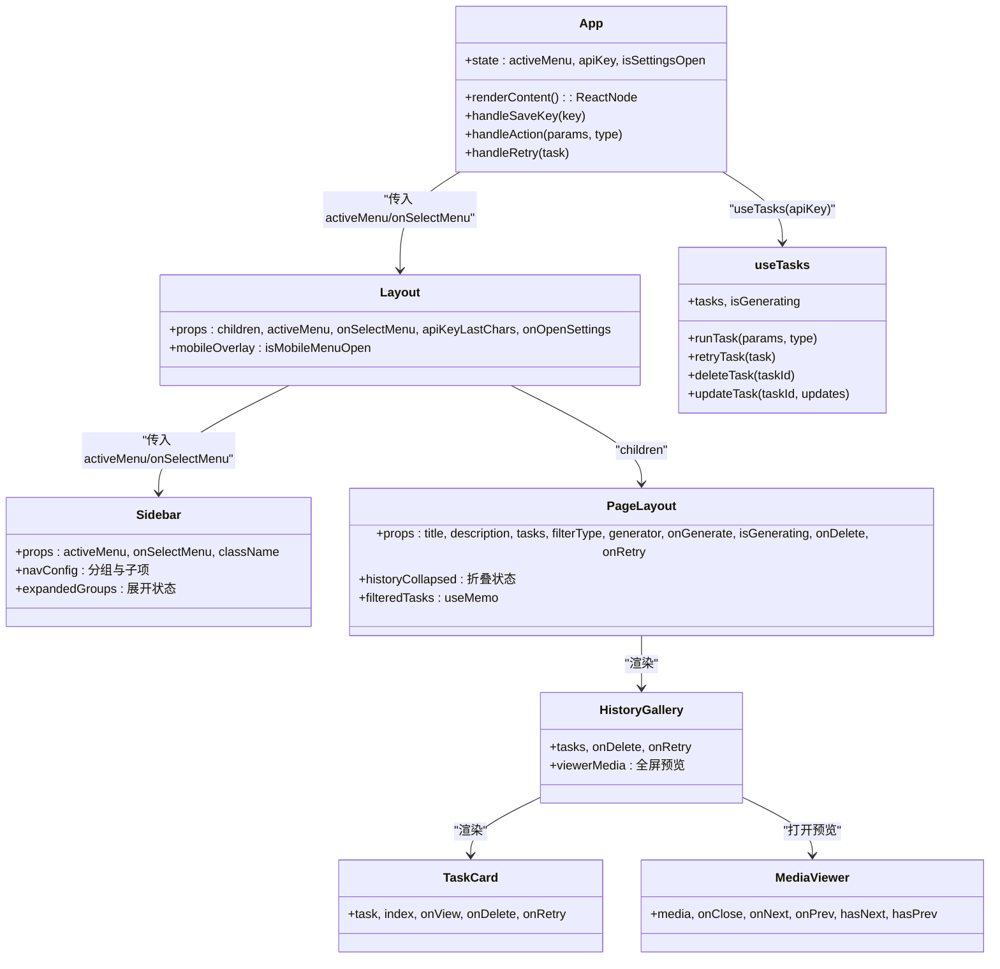

# 布局组件

<cite>
**本文引用的文件**
- [Layout.jsx](file://src/components/Layout.jsx)
- [PageLayout.jsx](file://src/components/PageLayout.jsx)
- [Sidebar.jsx](file://src/components/Sidebar.jsx)
- [App.jsx](file://src/App.jsx)
- [useTasks.js](file://src/hooks/useTasks.js)
- [HistoryGallery.jsx](file://src/components/HistoryGallery.jsx)
- [TaskCard.jsx](file://src/components/TaskCard.jsx)
- [MediaViewer.jsx](file://src/components/MediaViewer.jsx)
- [main.css](file://src/main.css)
- [tailwind.config.js](file://tailwind.config.js)
</cite>

## 目录
1. [简介](#简介)
2. [项目结构](#项目结构)
3. [核心组件](#核心组件)
4. [架构总览](#架构总览)
5. [详细组件分析](#详细组件分析)
6. [依赖关系分析](#依赖关系分析)
7. [性能考量](#性能考量)
8. [故障排查指南](#故障排查指南)
9. [结论](#结论)
10. [附录](#附录)

## 简介
本文件面向通义万相前端应用的布局组件，重点围绕以下目标展开：
- 解释 Layout.jsx 主布局组件的整体页面结构、响应式布局实现与主题/状态指示机制
- 说明 PageLayout.jsx 页面布局组件的路由集成、内容区域管理与“生成历史”折叠交互
- 阐述 Sidebar.jsx 侧边栏导航的菜单项配置、路由跳转逻辑与状态同步机制
- 提供组件间协作关系图与数据流向说明
- 给出布局组件的自定义扩展方法与样式覆盖指南
- 总结性能优化建议与最佳实践

## 项目结构
布局相关的核心文件位于 src/components 下，配合 App.jsx 作为根容器，通过 props 在组件间传递状态与回调，形成清晰的单向数据流。

图表来源
- [App.jsx](file://src/App.jsx#L42-L377)
- [Layout.jsx](file://src/components/Layout.jsx#L1-L94)
- [Sidebar.jsx](file://src/components/Sidebar.jsx#L1-L149)
- [PageLayout.jsx](file://src/components/PageLayout.jsx#L1-L76)
- [HistoryGallery.jsx](file://src/components/HistoryGallery.jsx#L1-L68)
- [TaskCard.jsx](file://src/components/TaskCard.jsx#L1-L182)
- [MediaViewer.jsx](file://src/components/MediaViewer.jsx#L1-L125)
- [useTasks.js](file://src/hooks/useTasks.js#L1-L333)

章节来源
- [App.jsx](file://src/App.jsx#L42-L377)
- [Layout.jsx](file://src/components/Layout.jsx#L1-L94)
- [Sidebar.jsx](file://src/components/Sidebar.jsx#L1-L149)
- [PageLayout.jsx](file://src/components/PageLayout.jsx#L1-L76)
- [HistoryGallery.jsx](file://src/components/HistoryGallery.jsx#L1-L68)
- [TaskCard.jsx](file://src/components/TaskCard.jsx#L1-L182)
- [MediaViewer.jsx](file://src/components/MediaViewer.jsx#L1-L125)
- [useTasks.js](file://src/hooks/useTasks.js#L1-L333)

## 核心组件
- Layout.jsx：负责桌面端与移动端的布局骨架、侧边栏弹层、顶部工具条（含 API Key 状态指示）、内容滚动区域与子组件插槽
- Sidebar.jsx：负责导航分组、展开/收起、当前激活项高亮、点击回调
- PageLayout.jsx：负责页面标题/描述、顶部固定生成表单、历史记录折叠与网格展示
- App.jsx：根容器，维护 activeMenu、API Key、任务状态钩子，按菜单 ID 分发具体页面内容
- useTasks.js：集中管理任务列表、生成状态、轮询策略、本地持久化与重试逻辑
- HistoryGallery.jsx / TaskCard.jsx / MediaViewer.jsx：历史记录展示、卡片交互与全屏预览

章节来源
- [Layout.jsx](file://src/components/Layout.jsx#L1-L94)
- [Sidebar.jsx](file://src/components/Sidebar.jsx#L1-L149)
- [PageLayout.jsx](file://src/components/PageLayout.jsx#L1-L76)
- [App.jsx](file://src/App.jsx#L42-L377)
- [useTasks.js](file://src/hooks/useTasks.js#L1-L333)
- [HistoryGallery.jsx](file://src/components/HistoryGallery.jsx#L1-L68)
- [TaskCard.jsx](file://src/components/TaskCard.jsx#L1-L182)
- [MediaViewer.jsx](file://src/components/MediaViewer.jsx#L1-L125)

## 架构总览
下图展示了从 App.jsx 到各布局组件的数据流与交互路径，以及 Sidebar 的菜单选择如何驱动内容区切换。

图表来源
- [App.jsx](file://src/App.jsx#L42-L377)
- [Layout.jsx](file://src/components/Layout.jsx#L1-L94)
- [Sidebar.jsx](file://src/components/Sidebar.jsx#L1-L149)
- [PageLayout.jsx](file://src/components/PageLayout.jsx#L1-L76)
- [useTasks.js](file://src/hooks/useTasks.js#L1-L333)
- [HistoryGallery.jsx](file://src/components/HistoryGallery.jsx#L1-L68)
- [TaskCard.jsx](file://src/components/TaskCard.jsx#L1-L182)
- [MediaViewer.jsx](file://src/components/MediaViewer.jsx#L1-L125)

## 详细组件分析

### Layout.jsx 主布局组件
- 整体结构
  - 外层容器采用全屏高度与溢出隐藏，确保内容区滚动独立
  - 桌面端固定宽度侧边栏，移动端通过 overlay 弹层呈现
  - 顶部工具条包含移动端菜单开关、API Key 状态徽标与设置入口
  - 内容区使用滚动容器与最大宽度约束，保证在大屏下的阅读体验
- 响应式实现
  - 通过 Tailwind 断点类控制桌面/移动布局切换
  - 移动端 overlay 使用 backdrop-blur 与点击遮罩关闭
- 主题与状态指示
  - 顶部 API Key 状态徽标根据是否配置显示不同颜色与动画
  - 字体与颜色体系由全局样式与 Tailwind 主题控制
- 子组件协作
  - 将 activeMenu 与 onSelectMenu 透传给 Sidebar
  - children 插槽承载 PageLayout 等页面内容

章节来源
- [Layout.jsx](file://src/components/Layout.jsx#L1-L94)
- [main.css](file://src/main.css#L1-L54)
- [tailwind.config.js](file://tailwind.config.js#L1-L12)

### Sidebar.jsx 侧边栏导航
- 导航配置
  - 采用分组配置数组，每组包含标题、图标、子项列表与唯一 id
  - 当前激活项所在分组默认展开，便于快速定位
- 交互逻辑
  - 点击分组标题切换展开/收起
  - 点击子项触发 onSelectMenu 回调，同时在移动端关闭 overlay
- 视觉反馈
  - 激活项高亮与分组标题选中态区分
  - 滚动条样式与分隔线提升可读性

章节来源
- [Sidebar.jsx](file://src/components/Sidebar.jsx#L1-L149)

### PageLayout.jsx 页面布局
- 内容组织
  - 页面头部：标题与描述
  - 顶部固定生成表单：使用传入的组件与回调
  - 历史记录区域：可折叠，内部使用 HistoryGallery 展示
- 优化点
  - 使用 useMemo 缓存过滤后的任务列表，减少重复计算
  - 历史记录折叠状态由组件内部管理，降低父级复杂度

章节来源
- [PageLayout.jsx](file://src/components/PageLayout.jsx#L1-L76)

### App.jsx 根容器与路由集成
- 状态管理
  - 维护 activeMenu、API Key、设置面板开关
  - 通过 useTasks 钩子集中管理任务状态与轮询
- 路由分发
  - 根据 activeMenu 的值映射到对应的 PageLayout 参数（标题、描述、生成器组件、过滤类型）
- 与布局协作
  - 将 activeMenu 与 onSelectMenu 传给 Layout
  - 将 API Key 最后四位传给 Layout 用于顶部徽标显示

章节来源
- [App.jsx](file://src/App.jsx#L42-L377)
- [useTasks.js](file://src/hooks/useTasks.js#L1-L333)

### 历史记录与预览链路
- HistoryGallery.jsx
  - 管理全屏预览状态与相邻任务索引
  - 渲染网格卡片，空状态友好提示
- TaskCard.jsx
  - 展示媒体预览、状态徽章、操作按钮（重试/预览/下载/删除）
  - 对失败与成功任务分别处理重试可用性
- MediaViewer.jsx
  - 使用 Portal 渲染至 body，支持 ESC/左右键导航
  - 控制 body 滚动禁用，提供下载与新标签打开

章节来源
- [HistoryGallery.jsx](file://src/components/HistoryGallery.jsx#L1-L68)
- [TaskCard.jsx](file://src/components/TaskCard.jsx#L1-L182)
- [MediaViewer.jsx](file://src/components/MediaViewer.jsx#L1-L125)

## 依赖关系分析

图表来源
- [App.jsx](file://src/App.jsx#L42-L377)
- [Layout.jsx](file://src/components/Layout.jsx#L1-L94)
- [Sidebar.jsx](file://src/components/Sidebar.jsx#L1-L149)
- [PageLayout.jsx](file://src/components/PageLayout.jsx#L1-L76)
- [HistoryGallery.jsx](file://src/components/HistoryGallery.jsx#L1-L68)
- [TaskCard.jsx](file://src/components/TaskCard.jsx#L1-L182)
- [MediaViewer.jsx](file://src/components/MediaViewer.jsx#L1-L125)
- [useTasks.js](file://src/hooks/useTasks.js#L1-L333)

章节来源
- [App.jsx](file://src/App.jsx#L42-L377)
- [Layout.jsx](file://src/components/Layout.jsx#L1-L94)
- [Sidebar.jsx](file://src/components/Sidebar.jsx#L1-L149)
- [PageLayout.jsx](file://src/components/PageLayout.jsx#L1-L76)
- [HistoryGallery.jsx](file://src/components/HistoryGallery.jsx#L1-L68)
- [TaskCard.jsx](file://src/components/TaskCard.jsx#L1-L182)
- [MediaViewer.jsx](file://src/components/MediaViewer.jsx#L1-L125)
- [useTasks.js](file://src/hooks/useTasks.js#L1-L333)

## 性能考量
- 渲染优化
  - PageLayout 使用 useMemo 过滤任务，避免每次渲染都执行 filter
  - HistoryGallery 与 TaskCard 使用 memo 包装，减少无关更新
- 事件与副作用
  - MediaViewer 在打开时禁用 body 滚动，避免滚动穿透
  - 键盘事件监听在组件挂载时注册，卸载时清理
- 状态与存储
  - useTasks 将任务持久化到本地存储，移除 base64 数据以节省空间
  - 轮询策略自适应：新任务快速轮询，长时间任务延长间隔
- 样式与滚动
  - 全局滚动条样式与内容区滚动容器分离，避免影响全局滚动

章节来源
- [PageLayout.jsx](file://src/components/PageLayout.jsx#L22-L26)
- [HistoryGallery.jsx](file://src/components/HistoryGallery.jsx#L67-L67)
- [TaskCard.jsx](file://src/components/TaskCard.jsx#L1-L182)
- [MediaViewer.jsx](file://src/components/MediaViewer.jsx#L7-L27)
- [useTasks.js](file://src/hooks/useTasks.js#L31-L84)
- [useTasks.js](file://src/hooks/useTasks.js#L86-L104)
- [useTasks.js](file://src/hooks/useTasks.js#L106-L161)
- [main.css](file://src/main.css#L16-L27)

## 故障排查指南
- API Key 未配置导致无法生成
  - 现象：点击生成按钮弹出设置面板
  - 排查：确认 App.jsx 中是否设置了 API Key；检查本地存储键值
- 任务状态不更新
  - 现象：生成完成后状态未变或媒体 URL 未出现
  - 排查：查看 useTasks 的轮询逻辑与状态判断；确认输出字段兼容标准与多模态格式
- 历史记录为空
  - 现象：历史区域显示“暂无记录”
  - 排查：确认 tasks 是否正确过滤；检查 filterType 与任务类型匹配
- 移动端菜单无法关闭
  - 现象：overlay 无法通过点击遮罩关闭
  - 排查：确认 overlay 的点击事件绑定与状态切换逻辑
- 预览无法全屏或键盘切换无效
  - 现象：ESC/左右键无响应
  - 排查：确认键盘事件监听是否在打开时注册，关闭时清理

章节来源
- [App.jsx](file://src/App.jsx#L50-L70)
- [useTasks.js](file://src/hooks/useTasks.js#L164-L246)
- [HistoryGallery.jsx](file://src/components/HistoryGallery.jsx#L23-L36)
- [Layout.jsx](file://src/components/Layout.jsx#L17-L30)
- [MediaViewer.jsx](file://src/components/MediaViewer.jsx#L7-L17)

## 结论
本布局体系通过清晰的职责划分与单向数据流，实现了从菜单导航到页面内容再到历史记录的完整闭环。Sidebar 提供直观的导航与状态同步，Layout 负责响应式布局与顶部状态指示，PageLayout 将生成表单与历史记录整合为统一页面模式。配合 useTasks 的任务状态管理与轮询策略，整体具备良好的可扩展性与用户体验。

## 附录

### 组件协作关系图（代码级）

图表来源
- [App.jsx](file://src/App.jsx#L42-L377)
- [Layout.jsx](file://src/components/Layout.jsx#L1-L94)
- [Sidebar.jsx](file://src/components/Sidebar.jsx#L1-L149)
- [PageLayout.jsx](file://src/components/PageLayout.jsx#L1-L76)
- [HistoryGallery.jsx](file://src/components/HistoryGallery.jsx#L1-L68)
- [TaskCard.jsx](file://src/components/TaskCard.jsx#L1-L182)
- [MediaViewer.jsx](file://src/components/MediaViewer.jsx#L1-L125)
- [useTasks.js](file://src/hooks/useTasks.js#L1-L333)

### 自定义扩展与样式覆盖指南
- 扩展菜单项
  - 在 Sidebar 的 navConfig 中新增分组与子项，确保 id 唯一且与 App.jsx 的路由分发一致
- 自定义页面内容
  - 在 App.jsx 的 renderContent 中为新菜单项添加 PageLayout 参数（标题、描述、生成器组件、filterType）
- 样式覆盖
  - 通过 Tailwind 类名覆盖组件内部样式，如滚动条、卡片阴影、徽章颜色等
  - 全局样式位于 main.css，可在此处扩展动画、字体与媒体预览样式
- 主题与颜色
  - 通过全局颜色变量与 Tailwind 主题扩展，统一品牌色与状态色（如成功/失败/进行中）

章节来源
- [Sidebar.jsx](file://src/components/Sidebar.jsx#L12-L60)
- [App.jsx](file://src/App.jsx#L71-L355)
- [main.css](file://src/main.css#L1-L54)
- [tailwind.config.js](file://tailwind.config.js#L1-L12)