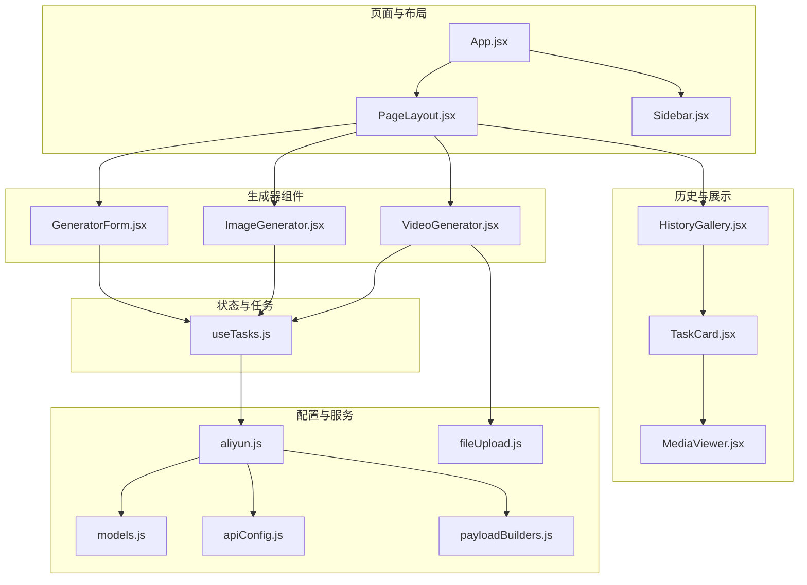
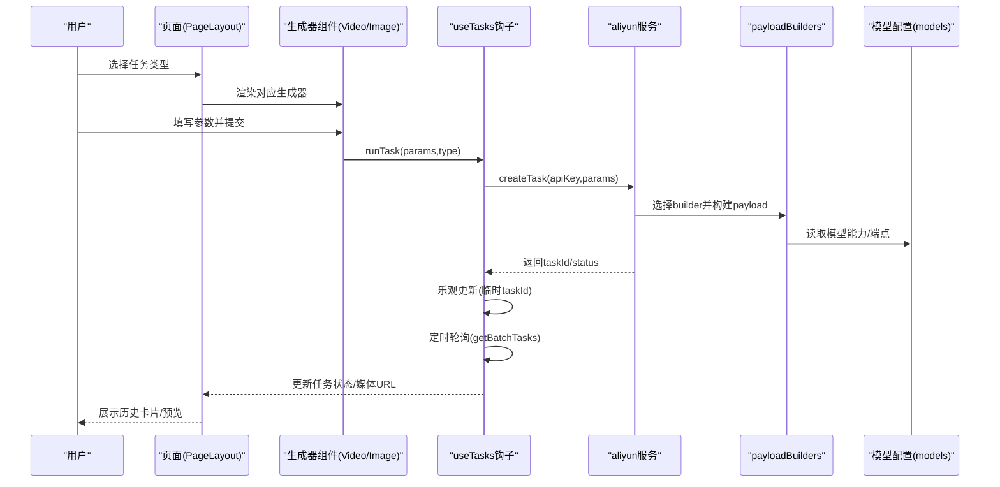
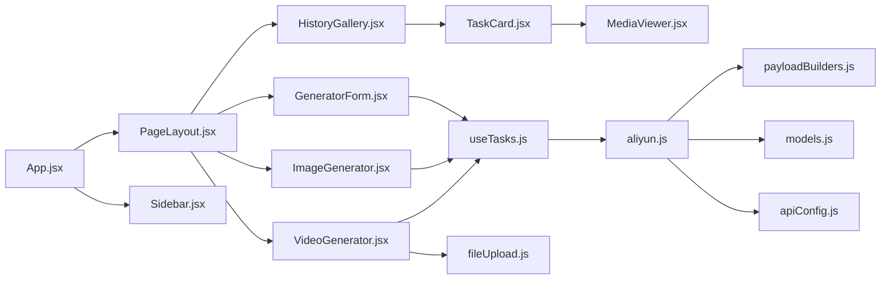

# 核心组件

<cite>
**本文引用的文件**
- [App.jsx](file://src/App.jsx)
- [GeneratorForm.jsx](file://src/components/GeneratorForm.jsx)
- [ImageGenerator.jsx](file://src/components/ImageGenerator.jsx)
- [VideoGenerator.jsx](file://src/components/VideoGenerator.jsx)
- [HistoryGallery.jsx](file://src/components/HistoryGallery.jsx)
- [TaskCard.jsx](file://src/components/TaskCard.jsx)
- [MediaViewer.jsx](file://src/components/MediaViewer.jsx)
- [useTasks.js](file://src/hooks/useTasks.js)
- [models.js](file://src/config/models.js)
- [apiConfig.js](file://src/config/apiConfig.js)
- [aliyun.js](file://src/services/aliyun.js)
- [payloadBuilders.js](file://src/services/payloadBuilders.js)
- [fileUpload.js](file://src/utils/fileUpload.js)
</cite>

## 目录
1. [引言](#引言)
2. [项目结构](#项目结构)
3. [核心组件](#核心组件)
4. [架构总览](#架构总览)
5. [详细组件分析](#详细组件分析)
6. [依赖分析](#依赖分析)
7. [性能考虑](#性能考虑)
8. [故障排查指南](#故障排查指南)
9. [结论](#结论)
10. [附录](#附录)

## 引言
本文件面向通义万相前端应用的核心组件，系统性梳理视频生成器、图像生成器、生成表单、历史记录展示等关键UI组件的设计与实现，解释 props 接口、事件处理机制与状态管理方式；提供使用示例与最佳实践，说明组件间协作关系与数据传递路径；并给出响应式设计与用户体验优化策略，以及扩展与定制指导。

## 项目结构
应用采用“页面-布局-组件-服务-配置”的分层组织：
- 页面与布局：App.jsx 负责路由与页面容器，配合 PageLayout 与 Sidebar 组织导航与内容区。
- 生成器组件：VideoGenerator、ImageGenerator、I2VGenerator、R2VGenerator、VideoEditor、ImageEditor 等，负责不同任务类型的表单与参数收集。
- 通用表单：GeneratorForm.jsx 提供统一的提示词、模型与分辨率选择入口。
- 历史与展示：HistoryGallery.jsx、TaskCard.jsx、MediaViewer.jsx 提供任务历史、卡片列表与全屏预览。
- 状态与任务：useTasks.js 封装任务生命周期、轮询与本地持久化。
- 配置与服务：models.js 定义模型能力与端点；aliyun.js 与 payloadBuilders.js 负责请求构建与调用；apiConfig.js 提供超时与轮询策略；fileUpload.js 提供文件处理工具。

图表来源
- [App.jsx](file://src/App.jsx#L42-L377)
- [VideoGenerator.jsx](file://src/components/VideoGenerator.jsx#L1-L354)
- [ImageGenerator.jsx](file://src/components/ImageGenerator.jsx#L1-L249)
- [GeneratorForm.jsx](file://src/components/GeneratorForm.jsx#L1-L208)
- [HistoryGallery.jsx](file://src/components/HistoryGallery.jsx#L1-L68)
- [TaskCard.jsx](file://src/components/TaskCard.jsx#L1-L182)
- [MediaViewer.jsx](file://src/components/MediaViewer.jsx#L1-L125)
- [useTasks.js](file://src/hooks/useTasks.js#L1-L333)
- [models.js](file://src/config/models.js#L1-L800)
- [apiConfig.js](file://src/config/apiConfig.js#L1-L35)
- [aliyun.js](file://src/services/aliyun.js#L1-L215)
- [payloadBuilders.js](file://src/services/payloadBuilders.js#L1-L829)
- [fileUpload.js](file://src/utils/fileUpload.js#L1-L182)

章节来源
- [App.jsx](file://src/App.jsx#L42-L377)

## 核心组件
- 视频生成器（VideoGenerator）：负责文生视频、图生视频、参考生视频等视频任务的参数收集与提交，支持模型选择、分辨率、时长、高级参数（负向提示词、水印、镜头类型、音频）、文件/URL 输入处理。
- 图像生成器（ImageGenerator）：负责文生图与图像编辑任务的参数收集，支持模型选择、分辨率、风格、数量、高级参数（负向提示词、随机种子）与费用估算。
- 生成表单（GeneratorForm）：提供统一的提示词输入、模型与分辨率选择，适合通用视频生成场景。
- 历史记录展示（HistoryGallery + TaskCard + MediaViewer）：展示任务历史、卡片操作（重试、删除、下载、全屏预览），支持键盘与手势导航。
- 任务钩子（useTasks）：封装任务创建、乐观更新、批量轮询、状态同步、本地存储与清理策略。
- 服务与配置（aliyun.js、payloadBuilders.js、models.js、apiConfig.js、fileUpload.js）：统一请求构建、模型能力映射、超时与轮询策略、文件处理与校验。

章节来源
- [VideoGenerator.jsx](file://src/components/VideoGenerator.jsx#L1-L354)
- [ImageGenerator.jsx](file://src/components/ImageGenerator.jsx#L1-L249)
- [GeneratorForm.jsx](file://src/components/GeneratorForm.jsx#L1-L208)
- [HistoryGallery.jsx](file://src/components/HistoryGallery.jsx#L1-L68)
- [TaskCard.jsx](file://src/components/TaskCard.jsx#L1-L182)
- [MediaViewer.jsx](file://src/components/MediaViewer.jsx#L1-L125)
- [useTasks.js](file://src/hooks/useTasks.js#L1-L333)
- [aliyun.js](file://src/services/aliyun.js#L1-L215)
- [payloadBuilders.js](file://src/services/payloadBuilders.js#L1-L829)
- [models.js](file://src/config/models.js#L1-L800)
- [apiConfig.js](file://src/config/apiConfig.js#L1-L35)
- [fileUpload.js](file://src/utils/fileUpload.js#L1-L182)

## 架构总览
组件与服务交互遵循“配置驱动 + 请求构建 + 任务轮询 + 本地持久化”的模式：
- 配置驱动：models.js 定义模型能力、端点与请求格式；apiConfig.js 定义超时与轮询策略。
- 请求构建：payloadBuilders.js 将参数标准化为各模型请求格式；aliyun.js 统一封装创建与轮询。
- 任务管理：useTasks.js 负责任务生命周期、乐观更新、批量轮询与本地存储。
- 文件处理：fileUpload.js 统一处理 URL/base64/File 输入与压缩。

图表来源
- [useTasks.js](file://src/hooks/useTasks.js#L256-L332)
- [aliyun.js](file://src/services/aliyun.js#L50-L160)
- [payloadBuilders.js](file://src/services/payloadBuilders.js#L1-L829)
- [models.js](file://src/config/models.js#L1-L800)

## 详细组件分析

### 视频生成器（VideoGenerator）
- 功能要点
  - 参数收集：提示词、模型、分辨率、时长、是否智能改写、水印、负向提示词、随机种子、镜头类型（多镜头）、音频输入（URL/base64/File）。
  - 模型适配：根据所选模型自动调整可用时长与能力开关；音频输入通过工具函数统一处理。
  - 表单交互：高级面板折叠/展开；提交按钮禁用逻辑；错误提示与防重复提交。
- Props 接口
  - onGenerate(params): 提交生成请求
  - isGenerating: 生成中状态，用于禁用按钮
- 事件与状态
  - 状态：prompt、negativePrompt、seed、selectedModelId、resolution、duration、promptExtend、watermark、shotType、audioInput、showAdvanced。
  - 计算：根据模型能力动态启用/禁用参数；时长随模型变化自动回退。
- 数据流
  - 用户输入 -> 参数校验 -> 构建 payload -> 调用 createTask -> 轮询更新 -> 任务卡片展示。
- 最佳实践
  - 为音频输入提供 URL 与文件两种方式；对大文件进行压缩与 base64 转换；合理设置时长与分辨率以平衡质量与时效。
- 扩展建议
  - 新增模型时仅需在 models.js 中扩展配置，payloadBuilders.js 中新增 builder 即可；无需改动 UI。

章节来源
- [VideoGenerator.jsx](file://src/components/VideoGenerator.jsx#L1-L354)
- [fileUpload.js](file://src/utils/fileUpload.js#L114-L144)
- [models.js](file://src/config/models.js#L39-L135)

### 图像生成器（ImageGenerator）
- 功能要点
  - 参数收集：提示词、负向提示词、随机种子、模型、分辨率、艺术风格、数量、智能改写开关。
  - 高级面板：按模型能力动态显示负向提示词与随机种子输入。
  - 成本估算：根据模型单价与输出数量估算费用。
- Props 接口
  - onGenerate(params)
  - isGenerating
- 事件与状态
  - 状态：prompt、negativePrompt、seed、selectedModelId、resolution、usePromptExtend、numImages、style、showAdvanced。
  - 计算：根据模型默认分辨率与能力启用参数。
- 数据流
  - 用户输入 -> 参数校验 -> 构建 payload -> createTask -> 轮询更新 -> 历史卡片展示。
- 最佳实践
  - 使用负向提示词减少不需要的元素；固定随机种子便于复现；合理选择输出数量与分辨率。
- 扩展建议
  - 新增模型时在 models.js 中扩展 IMAGE_MODELS 并在 payloadBuilders.js 中完善对应 builder。

章节来源
- [ImageGenerator.jsx](file://src/components/ImageGenerator.jsx#L1-L249)
- [models.js](file://src/config/models.js#L264-L788)

### 生成表单（GeneratorForm）
- 功能要点
  - 统一入口：提示词输入、模型选择、分辨率选择、一键生成。
  - 模型与分辨率联动：模型切换时自动回退至模型支持的默认分辨率。
- Props 接口
  - onGenerate(params)
  - isGenerating
- 事件与状态
  - 状态：prompt、model、resolution。
  - 计算：根据模型支持的分辨率集合动态渲染。
- 最佳实践
  - 作为通用视频生成入口，适合快速试用与演示场景；复杂参数建议转至专用生成器组件。

章节来源
- [GeneratorForm.jsx](file://src/components/GeneratorForm.jsx#L1-L208)

### 历史记录展示（HistoryGallery + TaskCard + MediaViewer）
- 功能要点
  - 历史网格：按最新优先排序，支持缩略图点击进入全屏预览。
  - 任务卡片：展示状态徽章、预览图、操作按钮（重试、下载、删除、全屏）。
  - 全屏查看器：支持 ESC 关闭、左右箭头切换、下载与新标签打开。
- Props 接口
  - HistoryGallery: tasks、onDelete(taskId)、onRetry(task)
  - TaskCard: task、index、onView(task)、onDelete(taskId)、onRetry(task)
  - MediaViewer: media、onClose()、onNext()、onPrev()、hasNext、hasPrev
- 事件与状态
  - 状态：viewerMedia（当前查看媒体）、showDeleteConfirm（删除二次确认）。
  - 交互：卡片悬停显示操作按钮；点击卡片预览；全屏查看器键盘与手势导航。
- 最佳实践
  - 为失败任务提供重试入口；对旧任务提示需要重新生成；优化删除确认避免误操作。
- 扩展建议
  - 可增加搜索与筛选、分页加载、导出历史等功能。

章节来源
- [HistoryGallery.jsx](file://src/components/HistoryGallery.jsx#L1-L68)
- [TaskCard.jsx](file://src/components/TaskCard.jsx#L1-L182)
- [MediaViewer.jsx](file://src/components/MediaViewer.jsx#L1-L125)

### 任务钩子（useTasks）
- 功能要点
  - 任务创建：乐观添加临时 taskId，随后由后端真实 taskId 替换；同步/异步结果处理。
  - 轮询策略：自适应间隔（新任务快轮询、长时间任务慢轮询）；批量查询；状态变更时重置轮询节奏。
  - 本地持久化：localStorage 存储任务列表，清理 base64 以节省空间；容量不足时保留最近 20 条。
  - 重试与删除：基于 originalParams 重试；删除任务。
- Props 接口
  - runTask(params, type)
  - retryTask(task)
  - deleteTask(taskId)
  - updateTask(taskId, updates)
  - tasks、isGenerating
- 最佳实践
  - 在 App.jsx 中集中处理 API Key 与路由；将任务状态注入到页面布局；为每个生成器组件提供统一的 onGenerate 回调。
- 扩展建议
  - 可增加任务分类过滤、批量删除、导出导入历史等。

章节来源
- [useTasks.js](file://src/hooks/useTasks.js#L1-L333)

### 服务与配置（aliyun.js、payloadBuilders.js、models.js、apiConfig.js、fileUpload.js）
- 功能要点
  - ali Yun.js：统一创建任务与轮询；超时控制；错误分类与重试策略；同步/异步响应标准化。
  - payloadBuilders.js：策略模式构建不同模型的请求体；参数抽取与规范化；错误校验。
  - models.js：模型能力、端点、请求格式、分辨率标签、价格与类别。
  - apiConfig.js：超时、重试、轮询间隔与存储键名。
  - fileUpload.js：文件压缩、base64 转换、URL 校验、输入归一化。
- 最佳实践
  - 新增模型时只需在 models.js 中扩展配置并在 payloadBuilders.js 中新增 builder；无需改动 UI 与服务层。
- 扩展建议
  - 可增加请求签名、速率限制、断路器与缓存策略。

章节来源
- [aliyun.js](file://src/services/aliyun.js#L1-L215)
- [payloadBuilders.js](file://src/services/payloadBuilders.js#L1-L829)
- [models.js](file://src/config/models.js#L1-L800)
- [apiConfig.js](file://src/config/apiConfig.js#L1-L35)
- [fileUpload.js](file://src/utils/fileUpload.js#L1-L182)

## 依赖分析
- 组件耦合
  - App.jsx 与 PageLayout/Sidebar 协同决定渲染内容；生成器组件与 useTasks 解耦，通过 onGenerate 回调交互。
  - 历史组件与任务卡片组件解耦，通过 props 传递回调；MediaViewer 使用 Portal 渲染，避免层级问题。
- 外部依赖
  - 模型配置与请求格式由 models.js 与 payloadBuilders.js 统一管理，降低对具体 API 的耦合。
  - 轮询与超时策略集中在 useTasks 与 aliyun.js，保证一致的用户体验。
- 循环依赖
  - 未发现循环依赖；组件间通过 props 与回调传递数据。

图表来源
- [App.jsx](file://src/App.jsx#L42-L377)
- [VideoGenerator.jsx](file://src/components/VideoGenerator.jsx#L1-L354)
- [ImageGenerator.jsx](file://src/components/ImageGenerator.jsx#L1-L249)
- [GeneratorForm.jsx](file://src/components/GeneratorForm.jsx#L1-L208)
- [HistoryGallery.jsx](file://src/components/HistoryGallery.jsx#L1-L68)
- [TaskCard.jsx](file://src/components/TaskCard.jsx#L1-L182)
- [MediaViewer.jsx](file://src/components/MediaViewer.jsx#L1-L125)
- [useTasks.js](file://src/hooks/useTasks.js#L1-L333)
- [aliyun.js](file://src/services/aliyun.js#L1-L215)
- [payloadBuilders.js](file://src/services/payloadBuilders.js#L1-L829)
- [models.js](file://src/config/models.js#L1-L800)
- [apiConfig.js](file://src/config/apiConfig.js#L1-L35)
- [fileUpload.js](file://src/utils/fileUpload.js#L1-L182)

## 性能考虑
- 轮询优化
  - 新任务使用 1 秒间隔快速反馈；活跃任务在前 10 次轮询使用 2 秒间隔；超过阈值使用 5 秒间隔，降低服务器压力。
  - 状态变化时重置轮询计数，加速收敛。
- 存储优化
  - 本地存储移除 base64 数据，避免内存与存储膨胀；容量不足时保留最近 20 条。
- 请求优化
  - 同步/异步响应统一处理；超时控制与指数退避重试；批量轮询减少并发开销。
- UI 优化
  - 任务卡片动画延迟渐进；全屏预览使用 Portal 减少 DOM 层级；键盘与手势导航提升可访问性。

章节来源
- [useTasks.js](file://src/hooks/useTasks.js#L86-L161)
- [apiConfig.js](file://src/config/apiConfig.js#L21-L27)
- [aliyun.js](file://src/services/aliyun.js#L20-L36)

## 故障排查指南
- 常见问题
  - API Key 未配置：App.jsx 中检测到未设置时弹出设置面板；请在设置中保存密钥并刷新页面。
  - 生成失败：检查提示词与参数是否符合模型能力；查看任务卡片状态徽章；必要时重试。
  - 轮询超时：检查网络连接与服务端状态；适当延长轮询间隔或减少同时生成任务数量。
  - 音频/图片输入无效：确认 URL 格式正确或文件类型符合要求；大文件会自动压缩后再转换为 base64。
- 定位方法
  - 查看浏览器控制台日志（请求体、轮询返回数据）；检查 localStorage 中任务列表是否正常更新。
- 处理建议
  - 对未知模型或请求格式错误，服务层会抛出明确错误；请核对 models.js 与 payloadBuilders.js 的配置。
  - 对网络错误与超时，服务层内置重试与超时控制；若仍失败，请检查网络与代理设置。

章节来源
- [App.jsx](file://src/App.jsx#L50-L70)
- [aliyun.js](file://src/services/aliyun.js#L146-L160)
- [fileUpload.js](file://src/utils/fileUpload.js#L114-L144)

## 结论
本应用通过“配置驱动 + 请求构建 + 任务轮询 + 本地持久化”的架构，实现了视频与图像生成的统一入口与高效管理。核心组件职责清晰、扩展性强，既满足快速开发需求，又兼顾性能与用户体验。建议在后续迭代中进一步完善历史管理、批量操作与导出能力，并持续优化轮询策略与错误处理。

## 附录
- 使用示例（以视频生成为例）
  - 在页面布局中传入 VideoGenerator 与 onGenerate 回调，即可完成从表单到任务创建与轮询的完整流程。
  - 若需要自定义参数（如音频、镜头类型），可在 VideoGenerator 中扩展高级面板并调用 onGenerate。
- 最佳实践清单
  - 明确区分通用表单与专用生成器；为复杂参数提供高级面板与能力开关。
  - 严格校验输入（URL、文件类型、大小）；对大文件进行压缩与 base64 转换。
  - 合理设置轮询间隔与超时；在 UI 上提供生成中状态与进度反馈。
  - 本地持久化时清理敏感数据（如 base64）；提供容量上限保护。
  - 新增模型时仅需扩展配置与 builder，避免改动 UI 与服务层。