# AI专业功能组件

<cite>
**本文档引用的文件**
- [CartoonGenerator.jsx](file://src/components/CartoonGenerator.jsx)
- [AITryOn.jsx](file://src/components/AITryOn.jsx)
- [DigitalHumanGenerator.jsx](file://src/components/DigitalHumanGenerator.jsx)
- [VideoSwap.jsx](file://src/components/VideoSwap.jsx)
- [ImageMotion.jsx](file://src/components/ImageMotion.jsx)
- [EmojiGenerator.jsx](file://src/components/EmojiGenerator.jsx)
- [ImageTranslator.jsx](file://src/components/ImageTranslator.jsx)
- [App.jsx](file://src/App.jsx)
- [useTasks.js](file://src/hooks/useTasks.js)
- [fileUpload.js](file://src/utils/fileUpload.js)
- [models.js](file://src/config/models.js)
- [apiConfig.js](file://src/config/apiConfig.js)
- [aliyun.js](file://src/services/aliyun.js)
</cite>

## 目录
1. [简介](#简介)
2. [项目结构](#项目结构)
3. [核心组件](#核心组件)
4. [架构概览](#架构概览)
5. [详细组件分析](#详细组件分析)
6. [依赖关系分析](#依赖关系分析)
7. [性能考虑](#性能考虑)
8. [故障排除指南](#故障排除指南)
9. [结论](#结论)
10. [附录](#附录)

## 简介

本项目是一个基于React的AI专业功能组件群，集成了多个前沿的人工智能生成能力。系统提供了从图像到视频的全方位AI生成解决方案，包括卡通形象生成、AI试衣、数字人生成、视频换人、图像动作生成、表情包视频生成和图像翻译等功能。

该项目采用现代化的前端架构，使用React 19.2.0和Vite构建工具，实现了高度模块化的组件设计和优雅的用户界面。所有AI功能都通过统一的任务管理系统进行调度，支持异步任务处理、状态轮询和结果管理。

## 项目结构

项目采用按功能模块组织的目录结构，每个AI功能都被封装为独立的React组件，便于维护和扩展：

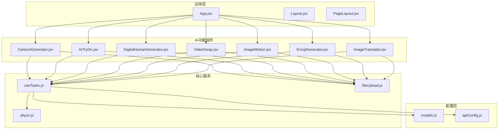

**图表来源**
- [App.jsx](file://src/App.jsx#L1-L377)
- [CartoonGenerator.jsx](file://src/components/CartoonGenerator.jsx#L1-L246)
- [AITryOn.jsx](file://src/components/AITryOn.jsx#L1-L251)

**章节来源**
- [App.jsx](file://src/App.jsx#L1-L377)
- [package.json](file://package.json#L1-L33)

## 核心组件

### 统一任务管理器

系统的核心是`useTasks`钩子，它提供了统一的任务生命周期管理：

- **异步任务调度**：支持多种AI模型的异步调用
- **状态轮询**：自动监控任务执行状态
- **本地存储**：持久化任务历史和结果
- **重试机制**：智能重试策略和错误处理

### 文件上传处理

`fileUpload.js`提供了统一的文件处理能力：

- **Base64转换**：将文件转换为Base64编码
- **图像压缩**：自动压缩大尺寸图片
- **格式验证**：严格的文件类型和大小检查
- **URL处理**：支持直接使用URL或文件上传

### 模型配置管理

`models.js`集中管理所有AI模型的配置信息：

- **模型能力映射**：详细的功能特性列表
- **协议定义**：同步和异步调用协议
- **输出类型**：图像和视频的统一处理
- **分辨率支持**：多分辨率配置选项

**章节来源**
- [useTasks.js](file://src/hooks/useTasks.js#L1-L333)
- [fileUpload.js](file://src/utils/fileUpload.js#L1-L182)
- [models.js](file://src/config/models.js#L1-L1012)

## 架构概览

系统采用分层架构设计，确保了良好的可维护性和扩展性：

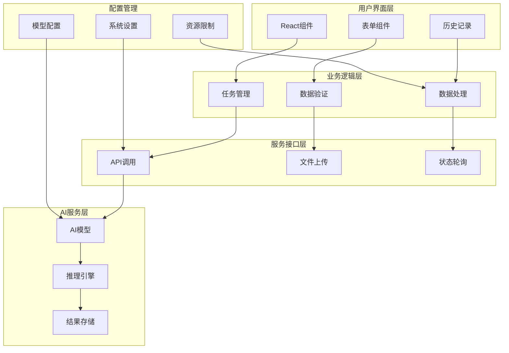

**图表来源**
- [App.jsx](file://src/App.jsx#L42-L355)
- [useTasks.js](file://src/hooks/useTasks.js#L256-L332)
- [aliyun.js](file://src/services/aliyun.js#L1-L97)

## 详细组件分析

### 卡通形象生成组件 (CartoonGenerator)

卡通形象生成组件提供了基于参考图像的创意生成能力：

#### 核心功能特性

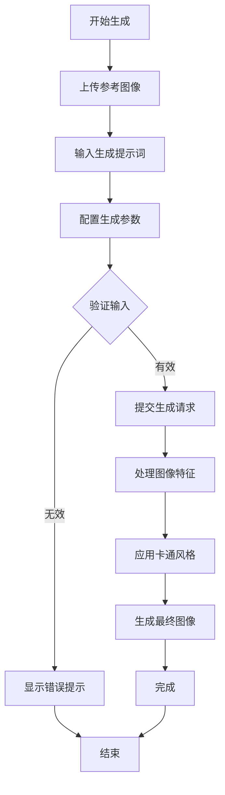

**图表来源**
- [CartoonGenerator.jsx](file://src/components/CartoonGenerator.jsx#L44-L74)

#### 技术实现要点

- **风格转换算法**：基于`control_cartoon_feature`函数实现
- **特征提取**：从参考图像中提取关键特征点
- **个性化定制**：支持数量、水印、随机种子等参数
- **实时预览**：提供图像上传预览功能

#### 参数配置指南

| 参数名称 | 类型 | 默认值 | 描述 |
|---------|------|--------|------|
| n | number | 1 | 生成图像数量 (1-4) |
| watermark | boolean | false | 是否添加水印 |
| seed | number | 随机 | 随机种子，用于可重现生成 |

**章节来源**
- [CartoonGenerator.jsx](file://src/components/CartoonGenerator.jsx#L1-L246)

### AI试衣组件 (AITryOn)

AI试衣组件实现了虚拟试穿效果，支持上装和下装的智能匹配：

#### 工作流程分析

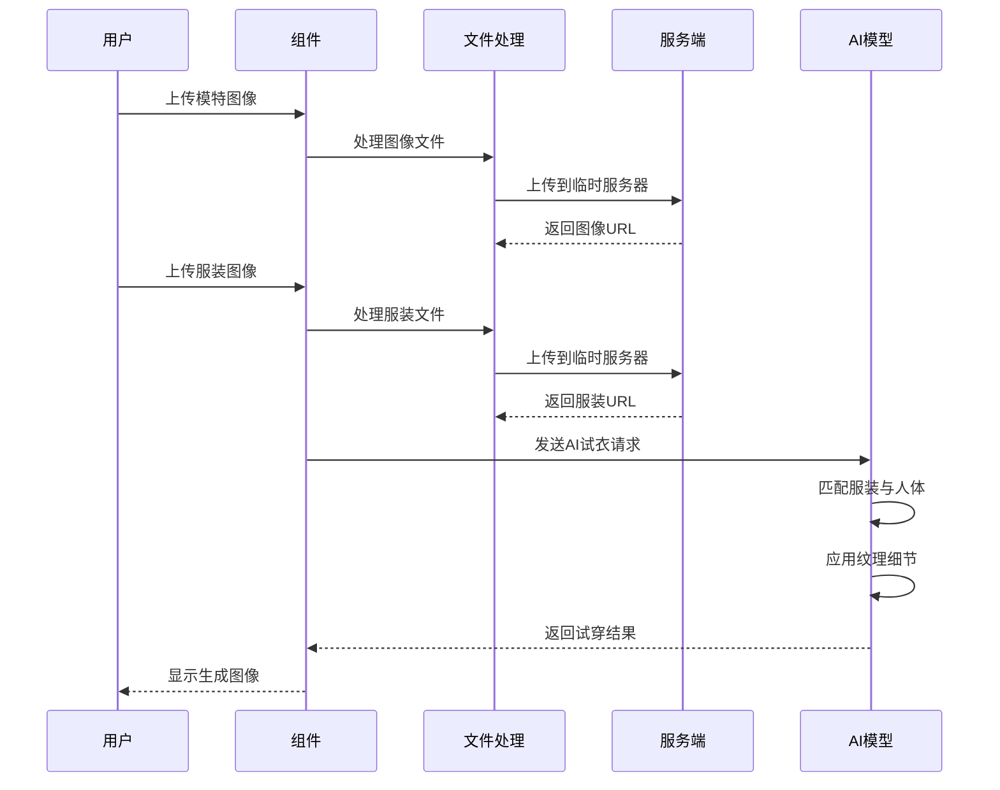

**图表来源**
- [AITryOn.jsx](file://src/components/AITryOn.jsx#L15-L50)

#### 算法实现特点

- **服装匹配算法**：智能识别服装类型和人体部位
- **人体姿态识别**：基于全身正面照进行姿态分析
- **虚拟试穿效果**：保持服装纹理和细节的真实感
- **质量增强**：Plus版提供更好的清晰度和纹理细节

#### 高级参数说明

| 参数 | 可选值 | 描述 |
|------|--------|------|
| modelType | aitryon, aitryon-plus | 模型版本选择 |
| resolution | -1, 1024, 1280 | 输出分辨率控制 |
| restoreFace | true, false | 人脸处理策略 |

**章节来源**
- [AITryOn.jsx](file://src/components/AITryOn.jsx#L1-L251)

### 数字人生成组件 (DigitalHumanGenerator)

数字人生成组件支持基于图片和音频的语音驱动视频生成：

#### 技术架构

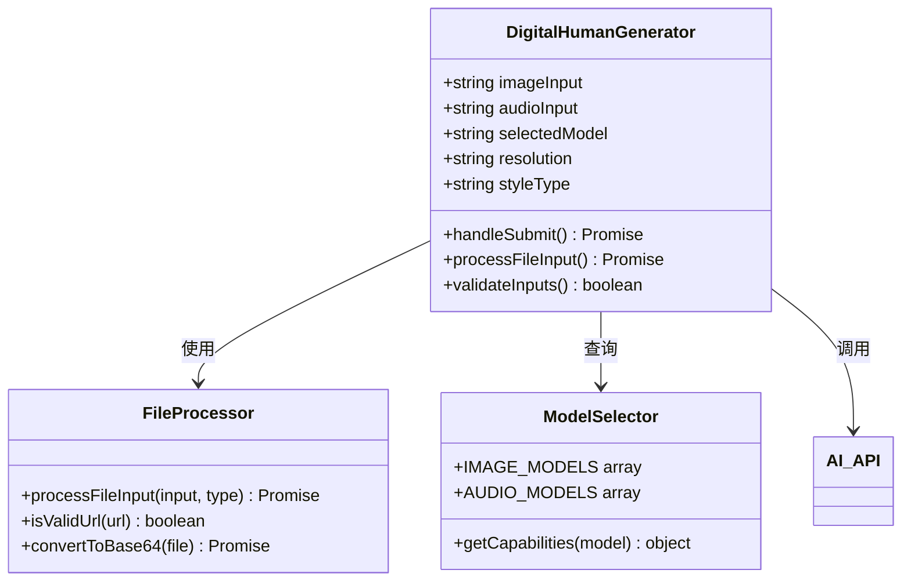

**图表来源**
- [DigitalHumanGenerator.jsx](file://src/components/DigitalHumanGenerator.jsx#L5-L130)

#### 核心功能实现

- **多模型支持**：支持语音驱动视频和图像检测两种模式
- **动作类型控制**：说话、唱歌、表演三种风格切换
- **分辨率配置**：480P和720P两种输出质量
- **输入处理**：同时支持文件上传和URL输入

#### 生成流程

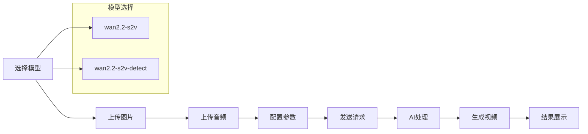

**图表来源**
- [DigitalHumanGenerator.jsx](file://src/components/DigitalHumanGenerator.jsx#L73-L130)

**章节来源**
- [DigitalHumanGenerator.jsx](file://src/components/DigitalHumanGenerator.jsx#L1-L313)

### 视频换人组件 (VideoSwap)

视频换人组件实现了基于图片和参考视频的角色替换功能：

#### 算法工作原理

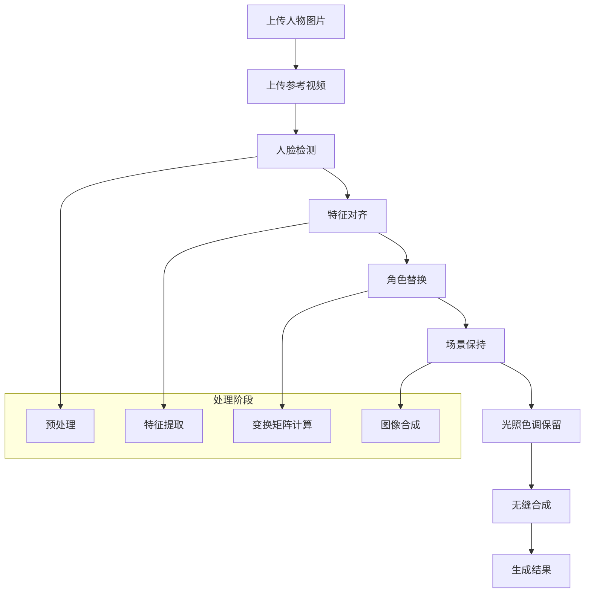

**图表来源**
- [VideoSwap.jsx](file://src/components/VideoSwap.jsx#L20-L47)

#### 技术实现细节

- **人脸检测**：自动检测和定位人脸特征
- **特征对齐**：计算人脸特征点的几何变换
- **无缝替换**：使用高级图像合成技术实现自然过渡
- **质量保持**：保留原视频的场景、光照和色调信息

#### 模式选择

| 模式 | 描述 | 适用场景 |
|------|------|----------|
| wan-std | 标准模式 | 性价比高，生成速度快 |
| wan-pro | 专业模式 | 动画流畅度更高，效果更佳 |

**章节来源**
- [VideoSwap.jsx](file://src/components/VideoSwap.jsx#L1-L212)

### 图像动作生成组件 (ImageMotion)

图生动作组件将视频中的动作迁移到静态图片上：

#### 动作迁移算法

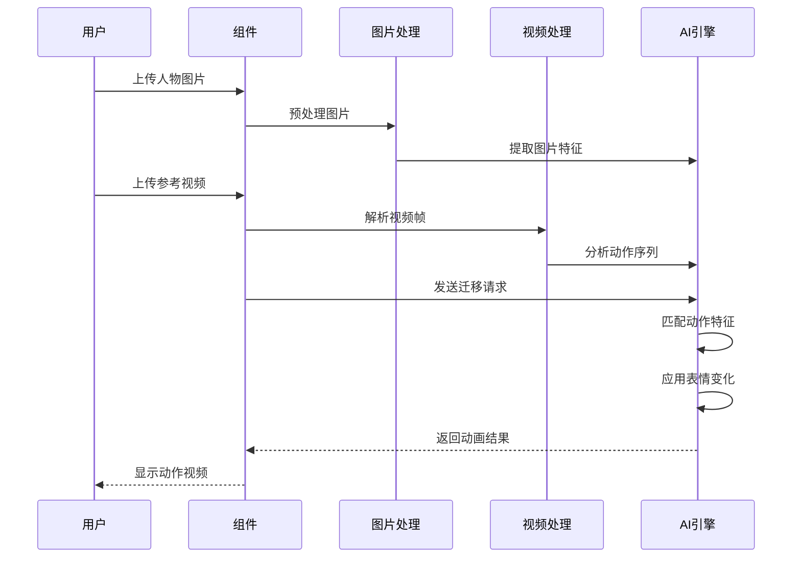

**图表来源**
- [ImageMotion.jsx](file://src/components/ImageMotion.jsx#L20-L47)

#### 核心功能特性

- **动作捕捉**：从参考视频中提取动作序列
- **表情控制**：支持表情和动作的精细控制
- **模式切换**：标准和专业两种处理模式
- **分辨率支持**：480P和720P两种输出质量

**章节来源**
- [ImageMotion.jsx](file://src/components/ImageMotion.jsx#L1-L212)

### 表情包视频生成组件 (EmojiGenerator)

表情包视频生成组件基于人脸检测和表情模板生成动态视频：

#### 表情识别与生成流程

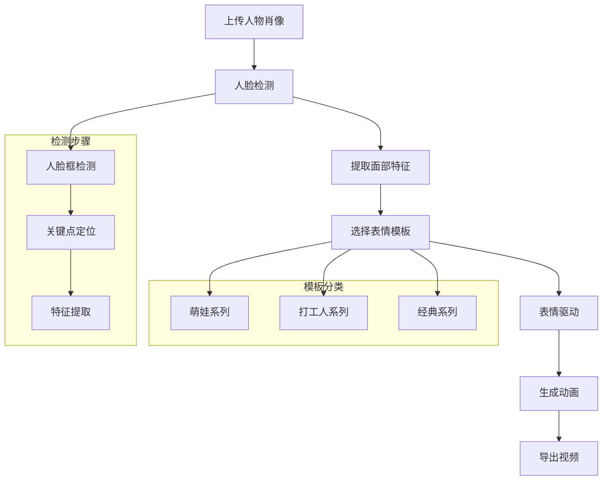

**图表来源**
- [EmojiGenerator.jsx](file://src/components/EmojiGenerator.jsx#L67-L98)

#### 表情模板库

系统内置了丰富的表情模板，涵盖不同主题和风格：

| 分类 | 模板数量 | 示例 |
|------|----------|------|
| 萌娃系列 | 8个 | 开心、等烟、感动、激动等 |
| 打工人系列 | 8个 | 抓狂、无奈、微笑、感激等 |
| 经典系列 | 4个 | 调皮、得意、期待、累等 |

#### 高级功能

- **人脸检测API**：集成阿里云人脸检测服务
- **模板选择**：直观的网格化模板浏览界面
- **参数控制**：支持分辨率和模板选择
- **实时预览**：检测过程中的状态反馈

**章节来源**
- [EmojiGenerator.jsx](file://src/components/EmojiGenerator.jsx#L1-L273)

### 图像翻译组件 (ImageTranslator)

图像翻译组件实现了图像中文本的精准翻译和排版保持：

#### 翻译工作流程

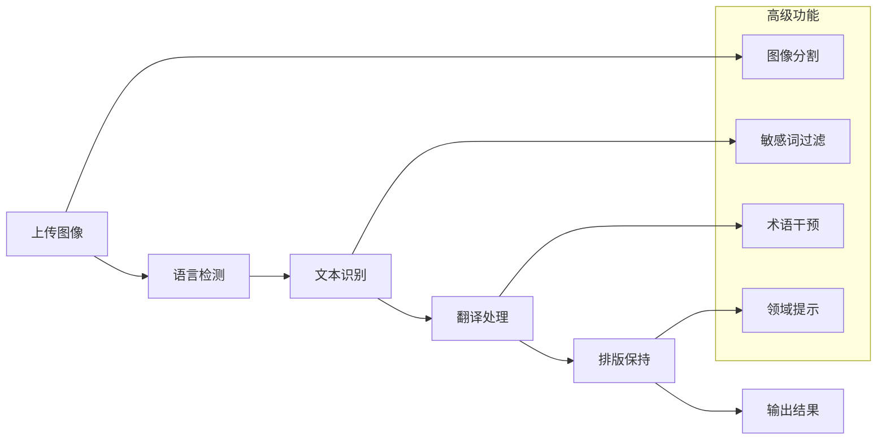

**图表来源**
- [ImageTranslator.jsx](file://src/components/ImageTranslator.jsx#L51-L96)

#### 语言支持

系统支持14种主要语言的相互翻译：

| 语言代码 | 语言名称 | 语言标识 |
|----------|----------|----------|
| zh | 中文 | 🇨🇳 |
| en | 英文 | 🇺🇸 |
| ja | 日语 | 🇯🇵 |
| ko | 韩语 | 🇰🇷 |
| es | 西班牙语 | 🇪🇸 |
| fr | 法语 | 🇫🇷 |
| ru | 俄语 | 🇷🇺 |
| pt | 葡萄牙语 | 🇵🇹 |
| it | 意大利语 | 🇮🇹 |
| vi | 越南语 | 🇻🇳 |
| ms | 马来语 | 🇲🇾 |
| th | 泰语 | 🇹🇭 |
| id | 印尼语 | 🇮🇩 |
| ar | 阿拉伯语 | 🇸🇦 |

#### 高级配置选项

| 功能 | 描述 | 使用场景 |
|------|------|----------|
| 图像分割 | 跳过主体文字识别 | 复杂背景图像 |
| 敏感词过滤 | 过滤不当内容 | 商业用途 |
| 术语干预 | 自定义专业词汇 | 技术文档 |
| 领域提示 | 指定翻译风格 | 电商产品描述 |

**章节来源**
- [ImageTranslator.jsx](file://src/components/ImageTranslator.jsx#L1-L301)

## 依赖关系分析

系统采用模块化设计，各组件间依赖关系清晰：

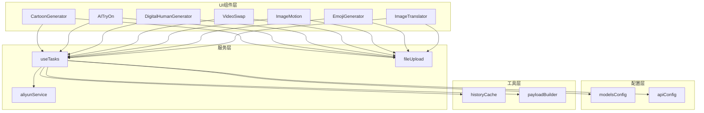

**图表来源**
- [App.jsx](file://src/App.jsx#L17-L23)
- [useTasks.js](file://src/hooks/useTasks.js#L1-L333)

### 组件耦合度分析

- **低耦合设计**：各AI组件相互独立，可单独部署和测试
- **统一接口**：通过`onGenerate`回调实现标准化交互
- **共享服务**：文件处理和任务管理服务被多个组件复用
- **配置驱动**：模型配置集中管理，便于维护和扩展

**章节来源**
- [App.jsx](file://src/App.jsx#L225-L344)
- [models.js](file://src/config/models.js#L930-L1012)

## 性能考虑

### 优化策略

#### 文件处理优化

1. **智能压缩**：超过8MB的图片自动压缩处理
2. **Base64缓存**：避免重复转换相同文件
3. **并发上传**：支持多文件并发处理

#### 任务调度优化

1. **自适应轮询**：根据任务状态动态调整轮询间隔
2. **批量查询**：支持多任务状态批量获取
3. **智能重试**：网络异常时的指数退避重试

#### 内存管理

1. **本地存储清理**：自动清理过期任务数据
2. **Base64数据净化**：保存时移除Base64数据节省空间
3. **组件卸载清理**：及时清理事件监听和定时器

### 性能监控指标

| 指标类型 | 目标值 | 监控方法 |
|----------|--------|----------|
| 任务响应时间 | < 2秒 | 轮询间隔监控 |
| 成功率 | > 95% | 错误率统计 |
| 内存使用 | < 100MB | 浏览器性能面板 |
| CPU使用率 | < 80% | 性能分析工具 |

**章节来源**
- [useTasks.js](file://src/hooks/useTasks.js#L86-L161)
- [fileUpload.js](file://src/utils/fileUpload.js#L40-L87)

## 故障排除指南

### 常见问题及解决方案

#### API密钥问题

**问题症状**：无法发起AI请求，弹出设置窗口

**解决步骤**：
1. 点击右上角API Key状态按钮
2. 输入有效的API Key
3. 点击保存并重新尝试操作

#### 文件上传失败

**问题症状**：文件上传超时或格式不支持

**解决步骤**：
1. 检查文件格式是否在支持列表内
2. 确认文件大小未超过限制
3. 尝试刷新页面后重新上传
4. 检查网络连接稳定性

#### 生成任务卡住

**问题症状**：任务长时间处于RUNNING状态

**解决步骤**：
1. 检查API Key有效性
2. 等待自动轮询完成
3. 点击重试按钮重新发起
4. 查看浏览器开发者工具中的错误信息

#### 图像质量不佳

**问题症状**：生成结果模糊或细节丢失

**解决步骤**：
1. 选择更高分辨率选项
2. 使用更高质量的输入素材
3. 调整生成参数设置
4. 尝试不同的AI模型版本

### 调试工具使用

#### 开发者工具

1. **网络面板**：监控API请求和响应
2. **控制台**：查看错误日志和调试信息
3. **应用面板**：检查本地存储状态
4. **性能面板**：分析内存和CPU使用情况

#### 日志分析

系统会在开发环境下输出详细的API调用日志，包括：
- 请求参数和响应数据
- 错误堆栈信息
- 性能指标数据

**章节来源**
- [App.jsx](file://src/App.jsx#L50-L70)
- [useTasks.js](file://src/hooks/useTasks.js#L164-L246)

## 结论

本AI专业功能组件群展现了现代前端技术与人工智能服务的完美结合。通过模块化的设计和统一的架构，系统实现了以下核心价值：

### 技术优势

1. **高度模块化**：每个AI功能都是独立的React组件，便于维护和扩展
2. **统一抽象层**：通过任务管理和文件处理服务，屏蔽底层复杂性
3. **用户体验优化**：提供直观的界面和流畅的操作体验
4. **性能高效**：智能轮询和资源管理确保系统稳定运行

### 应用价值

- **降低技术门槛**：非技术用户也能轻松使用复杂的AI功能
- **提高生产效率**：自动化的工作流程减少人工干预
- **保证质量标准**：统一的参数配置和质量控制
- **支持扩展开发**：清晰的架构为后续功能扩展奠定基础

### 发展前景

随着AI技术的不断进步，该组件群将继续演进，支持更多创新的AI功能，为用户提供更加丰富和强大的创作工具。

## 附录

### API配置说明

#### 超时设置

| 配置项 | 值(ms) | 说明 |
|--------|--------|------|
| REQUEST | 120000 | 请求超时时间 |
| POLLING | 30000 | 状态轮询超时 |
| INITIAL_INTERVAL | 1000 | 初始轮询间隔 |
| INTERVAL | 2000 | 正常轮询间隔 |
| MAX_INTERVAL | 5000 | 最大轮询间隔 |

#### 重试策略

- **最大重试次数**：2次
- **初始延迟**：1000ms
- **退避因子**：1.5
- **重试条件**：网络错误和超时

### 模型能力对照表

| 模型ID | 输出类型 | 主要功能 | 分辨率支持 |
|--------|----------|----------|------------|
| wanx2.1-imageedit | 图像 | 卡通形象生成 | 1024*1024 |
| aitryon | 图像 | AI试衣 | 1024*1024 |
| wan2.2-s2v | 视频 | 数字人生成 | 480P, 720P |
| wan2.2-animate-mix | 视频 | 视频换人 | 480P, 720P |
| wan2.2-animate-move | 视频 | 图像动作 | 480P, 720P |
| emoji-v1 | 视频 | 表情包生成 | 480P, 720P |
| qwen-mt-image | 图像 | 图像翻译 | 1024*1024 |

### 扩展开发指南

#### 新增AI组件步骤

1. **创建组件文件**：在`src/components/`目录下创建新组件
2. **实现UI界面**：设计用户交互界面和参数配置
3. **集成任务管理**：使用`onGenerate`回调与任务系统集成
4. **配置模型参数**：在`models.js`中注册新模型
5. **测试验证**：进行全面的功能和性能测试

#### 性能优化建议

1. **懒加载组件**：使用React.lazy实现按需加载
2. **虚拟滚动**：大量历史记录使用虚拟化技术
3. **缓存策略**：合理使用浏览器缓存和本地存储
4. **代码分割**：按功能模块进行代码分割

**章节来源**
- [apiConfig.js](file://src/config/apiConfig.js#L1-L34)
- [models.js](file://src/config/models.js#L930-L1012)