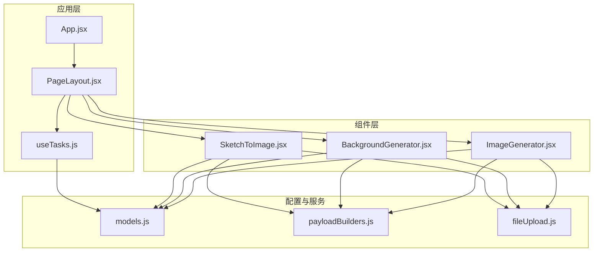
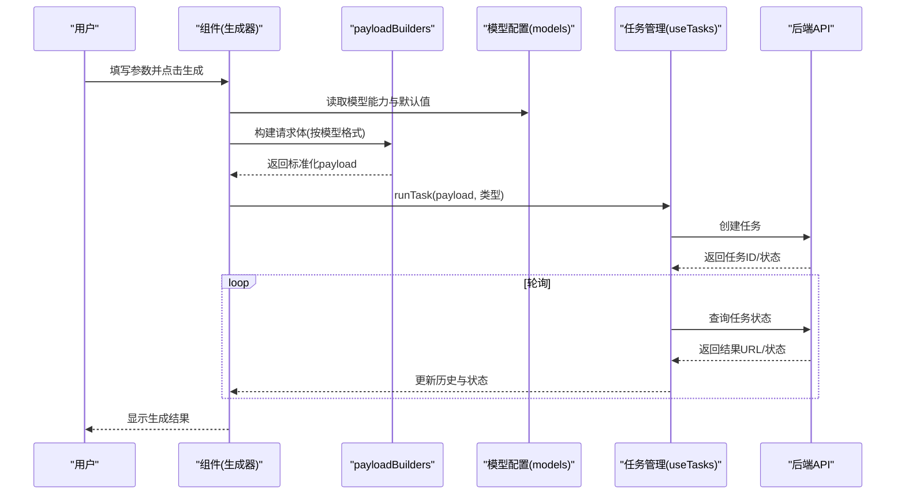
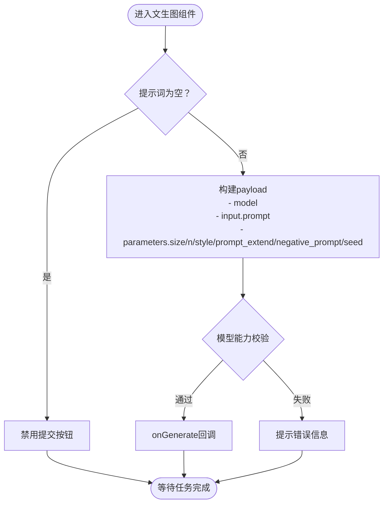
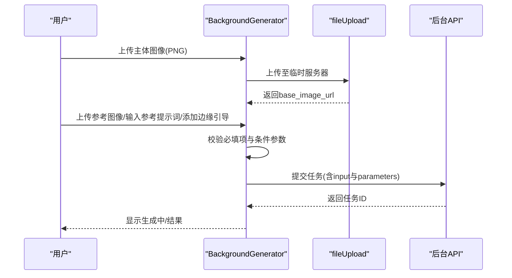
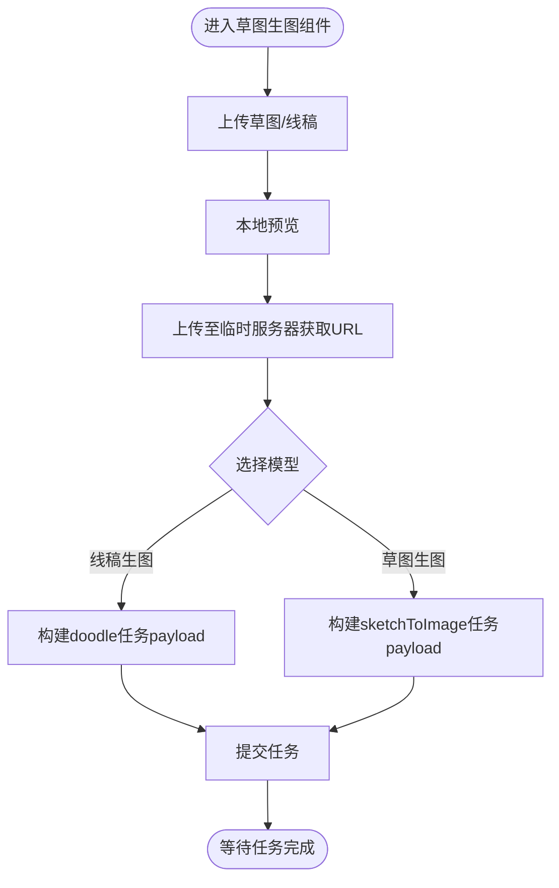
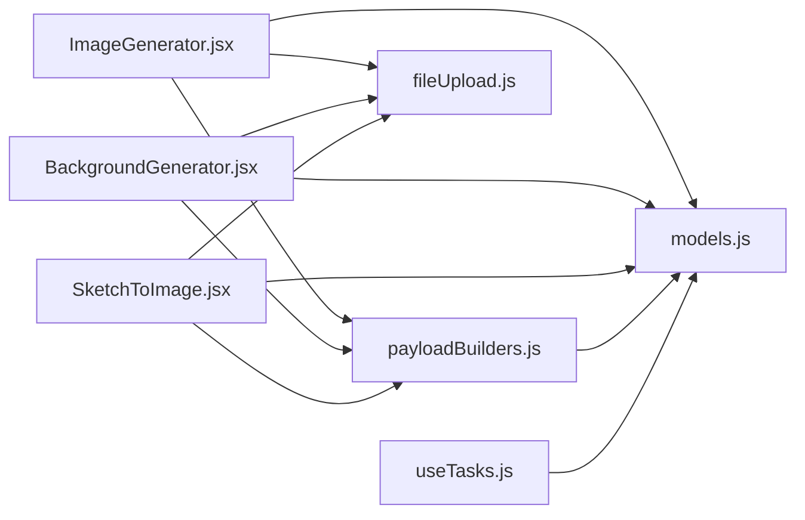

# 图像生成组件

<cite>
**本文引用的文件**
- [ImageGenerator.jsx](file://src/components/ImageGenerator.jsx)
- [BackgroundGenerator.jsx](file://src/components/BackgroundGenerator.jsx)
- [SketchToImage.jsx](file://src/components/SketchToImage.jsx)
- [models.js](file://src/config/models.js)
- [payloadBuilders.js](file://src/services/payloadBuilders.js)
- [fileUpload.js](file://src/utils/fileUpload.js)
- [App.jsx](file://src/App.jsx)
- [useTasks.js](file://src/hooks/useTasks.js)
- [PageLayout.jsx](file://src/components/PageLayout.jsx)
- [main.css](file://src/main.css)
</cite>

## 更新摘要
**变更内容**
- 更新了UI标准化改进内容：ImageGenerator和SketchToImage组件完成UI标准化重构
- 统一了垂直布局、提示词输入区域、模型参数选择、按钮样式和高级设置面板的交互模式
- 更新了组件间的UI一致性改进说明
- 增强了UI组件的视觉统一性和用户体验一致性

## 目录
1. [简介](#简介)
2. [项目结构](#项目结构)
3. [核心组件](#核心组件)
4. [架构总览](#架构总览)
5. [详细组件分析](#详细组件分析)
6. [UI标准化改进](#ui标准化改进)
7. [依赖关系分析](#依赖关系分析)
8. [性能考量](#性能考量)
9. [故障排查指南](#故障排查指南)
10. [结论](#结论)
11. [附录](#附录)

## 简介
本文件面向开发者，系统性梳理图像生成相关的三个核心组件：文生图(ImageGenerator)、背景生成(BackgroundGenerator)与草图生图(SketchToImage)。文档覆盖以下方面：
- 功能实现与参数体系：提示词处理、分辨率配置、采样参数、风格控制、质量与成本估算
- 模型选择策略与请求构建：基于模型能力(capabilities)的参数映射与校验
- 输出优化与质量评估：分辨率、风格、噪声、权重等关键参数调优建议
- 错误处理与性能监控：上传校验、轮询策略、本地存储与重试机制
- 扩展与集成：如何新增模型、接入自定义算法与UI
- **UI标准化改进**：组件间统一的视觉设计和交互体验

## 项目结构
三个组件均位于 src/components 下，配合配置与服务层协同工作：
- 组件层：ImageGenerator、BackgroundGenerator、SketchToImage
- 配置层：models.js（模型能力、分辨率标签、风格列表）
- 服务层：payloadBuilders.js（按模型能力构建请求体）、fileUpload.js（上传与压缩）
- 应用层：App.jsx（路由与页面布局）、PageLayout.jsx（统一页面容器）、useTasks.js（任务管理与轮询）

**图表来源**
- [App.jsx](file://src/App.jsx#L71-L355)
- [PageLayout.jsx](file://src/components/PageLayout.jsx#L9-L72)
- [ImageGenerator.jsx](file://src/components/ImageGenerator.jsx#L1-L285)
- [BackgroundGenerator.jsx](file://src/components/BackgroundGenerator.jsx#L1-L420)
- [SketchToImage.jsx](file://src/components/SketchToImage.jsx#L1-L384)
- [models.js](file://src/config/models.js#L264-L788)
- [payloadBuilders.js](file://src/services/payloadBuilders.js#L125-L249)
- [fileUpload.js](file://src/utils/fileUpload.js#L6-L18)

**章节来源**
- [App.jsx](file://src/App.jsx#L71-L355)
- [PageLayout.jsx](file://src/components/PageLayout.jsx#L9-L72)

## 核心组件
- 文生图(ImageGenerator)：聚焦提示词、分辨率、风格、负向提示词、随机种子、AI扩展等参数；支持多文生图模型的UI筛选与能力适配。
- 背景生成(BackgroundGenerator)：以主体透明图为基底，支持参考图像、参考提示词、负向提示词、噪声等级、模型版本、边缘引导等；强调风格匹配与合成算法的可控性。
- 草图生图(SketchToImage)：支持两类模型（线稿生图与草图生图），提供分辨率、数量、风格、草图权重、自动提取线稿、水印、随机种子等参数；具备草图预览与ESC关闭交互。

**章节来源**
- [ImageGenerator.jsx](file://src/components/ImageGenerator.jsx#L8-L285)
- [BackgroundGenerator.jsx](file://src/components/BackgroundGenerator.jsx#L5-L420)
- [SketchToImage.jsx](file://src/components/SketchToImage.jsx#L31-L384)

## 架构总览
组件通过统一的页面布局(PageLayout)挂载，由App.jsx路由分发。生成流程如下：
- 用户在组件中填写参数并点击"生成"
- 组件将参数与模型能力映射为标准化请求体(payload)
- 通过useTasks.js提交任务，异步轮询结果
- 将结果回填至页面历史区，支持重试与删除

**图表来源**
- [ImageGenerator.jsx](file://src/components/ImageGenerator.jsx#L32-L48)
- [BackgroundGenerator.jsx](file://src/components/BackgroundGenerator.jsx#L91-L149)
- [SketchToImage.jsx](file://src/components/SketchToImage.jsx#L75-L132)
- [payloadBuilders.js](file://src/services/payloadBuilders.js#L125-L249)
- [models.js](file://src/config/models.js#L264-L788)
- [useTasks.js](file://src/hooks/useTasks.js#L256-L312)

## 详细组件分析

### 文生图(ImageGenerator)分析
- 参数体系
  - 提示词(prompt)：必填，长度限制与AI扩展开关
  - 负向提示词(negative_prompt)：按模型能力启用
  - 随机种子(seed)：按模型能力启用
  - 模型选择：仅展示"文生图"类别模型
  - 分辨率：随模型能力与默认分辨率联动
  - 生成数量(n)：1/2/4
  - 艺术风格(style)：按模型能力启用
  - 成本估算：按模型单价与数量计算
- 处理逻辑
  - 表单提交时校验提示词非空
  - 将参数映射到parameters对象，按模型capabilities决定是否携带某些字段
  - 通过onGenerate回调传递标准化任务参数
- 数据流与UI
  - 输入区域支持高级参数面板切换
  - 高级面板按模型能力动态显示负向提示词与种子
  - 分辨率下拉框与模型能力一致，避免非法值

**图表来源**
- [ImageGenerator.jsx](file://src/components/ImageGenerator.jsx#L32-L48)
- [models.js](file://src/config/models.js#L264-L788)
- [payloadBuilders.js](file://src/services/payloadBuilders.js#L156-L168)

**章节来源**
- [ImageGenerator.jsx](file://src/components/ImageGenerator.jsx#L8-L285)
- [models.js](file://src/config/models.js#L264-L788)
- [payloadBuilders.js](file://src/services/payloadBuilders.js#L156-L168)

### 背景生成(BackgroundGenerator)分析
- 参数体系
  - 主体图像(base_image_url)：必填，需透明背景PNG
  - 参考图像(ref_image_url)：可选，配合噪声等级
  - 参考提示词(ref_prompt)：可选
  - 负向提示词(neg_ref_prompt)：可选
  - 生成数量(n)：1/2/3/4
  - 模型版本(model_version)：v2(快)/v3(好)
  - 噪声等级(noise_level)：仅在提供参考图像时可用
  - 提示词权重(ref_prompt_weight)：仅在同时提供参考图像与提示词时可用
  - 边缘引导(reference_edge)：前景/背景边缘图与对应提示词数组
- 处理逻辑
  - 上传主体图像与参考图像时，先本地预览，再上传至临时服务器获取URL
  - 提交前校验：必须提供主体图像；至少提供参考图像/参考提示词/边缘引导之一
  - 根据条件拼装input与parameters，支持多路输入
- 数据流与UI
  - 高级设置折叠面板，按条件显示负向提示词、提示词权重、边缘引导
  - 边缘引导支持多文件上传，逐项编辑提示词并可移除

**图表来源**
- [BackgroundGenerator.jsx](file://src/components/BackgroundGenerator.jsx#L22-L149)
- [fileUpload.js](file://src/utils/fileUpload.js#L6-L18)
- [models.js](file://src/config/models.js#L666-L687)
- [payloadBuilders.js](file://src/services/payloadBuilders.js#L369-L398)

**章节来源**
- [BackgroundGenerator.jsx](file://src/components/BackgroundGenerator.jsx#L5-L420)
- [fileUpload.js](file://src/utils/fileUpload.js#L6-L18)
- [models.js](file://src/config/models.js#L666-L687)
- [payloadBuilders.js](file://src/services/payloadBuilders.js#L369-L398)

### 草图生图(SketchToImage)分析
- 模型选择
  - 线稿生图(wanx2.1-imageedit)：支持"doodle"函数、水印、随机种子
  - 草图生图(wanx-sketch-to-image-lite)：支持风格、草图权重、自动提取线稿、草图颜色
- 参数体系
  - 输入图像：草图或线稿
  - 提示词：必填
  - 分辨率：768*768 / 1024*1024 / 1280*1280
  - 生成数量：1/2/3/4
  - 风格：多风格枚举
  - 草图权重：1-20
  - 自动提取线稿：布尔
  - 水印：布尔
  - 随机种子：可选
- 处理逻辑
  - 上传草图后本地预览，同时上传至临时服务器获取URL
  - 根据所选模型分支构造不同payload
  - 草图预览支持ESC键关闭
- 数据流与UI
  - 高级设置按模型差异显示不同参数
  - 提示词与草图图像的组合输入，支持预览与移除

**图表来源**
- [SketchToImage.jsx](file://src/components/SketchToImage.jsx#L57-L132)
- [models.js](file://src/config/models.js#L559-L578)
- [payloadBuilders.js](file://src/services/payloadBuilders.js#L226-L249)

**章节来源**
- [SketchToImage.jsx](file://src/components/SketchToImage.jsx#L31-L384)
- [models.js](file://src/config/models.js#L559-L578)
- [payloadBuilders.js](file://src/services/payloadBuilders.js#L226-L249)

## UI标准化改进

### 统一的垂直布局系统
所有三个核心组件都采用了统一的垂直布局设计，确保用户在不同功能间切换时具有相似的视觉体验：

- **统一内边距**：所有组件使用`p-6`作为基础内边距，提供一致的页面填充
- **统一间距系统**：使用`space-y-5`确保组件间的垂直间距一致
- **统一容器样式**：每个组件都包裹在`bg-white/80 backdrop-blur rounded-xl border border-gray-100 shadow-sm`的容器中

### 标准化的提示词输入区域
提示词输入区域在所有组件中都采用了统一的设计模式：

- **标签系统**：使用`flex items-center gap-2 text-xs font-semibold text-gray-600 mb-2`的标签样式
- **图标标识**：每个输入区域都有对应的图标标识（如Sparkles、Wand2、Upload等）
- **输入框样式**：统一使用`w-full min-h-[120px] bg-white border border-gray-200 rounded-xl px-4 py-3 text-sm text-gray-900 outline-none focus:border-violet-400 focus:ring-2 focus:ring-violet-100 transition-all resize-none`
- **字符计数**：支持实时字符计数显示，如`{prompt.length} / 2000`

### 统一的模型参数选择界面
模型参数选择区域在所有组件中都采用了相同的网格布局：

- **网格系统**：使用`grid grid-cols-3 gap-3`确保三个参数在同一行显示
- **统一的参数容器**：每个参数都使用`relative`容器包装，提供一致的视觉层次
- **标签样式**：使用`flex items-center gap-1.5 text-xs font-semibold text-gray-600 mb-2`的统一标签样式
- **下拉选择器**：统一使用`appearance-none bg-gradient-to-br from-white to-gray-50 border border-gray-200 pl-3 pr-10 py-3 rounded-xl text-sm text-gray-900 font-medium outline-none focus:border-violet-400 focus:ring-2 focus:ring-violet-100 transition-all cursor-pointer`的样式

### 标准化的按钮系统
操作按钮在所有组件中都采用了统一的设计规范：

- **主按钮样式**：使用`flex-1 bg-gradient-to-r from-violet-600 to-purple-600 hover:from-violet-700 hover:to-purple-700 text-white font-semibold py-2.5 px-6 rounded-lg flex items-center justify-center gap-2 transition-all disabled:opacity-40 disabled:cursor-not-allowed shadow-lg shadow-violet-500/30`
- **辅助按钮样式**：使用`px-4 py-2.5 rounded-lg text-sm font-medium transition-all ${showAdvanced ? 'bg-violet-100 text-violet-700 border border-violet-200' : 'bg-gray-100 text-gray-600 border border-gray-200 hover:bg-gray-150'}`
- **禁用状态**：统一处理`disabled`状态，提供视觉反馈

### 统一的高级设置面板
高级设置面板在所有组件中都采用了相同的交互模式：

- **面板样式**：使用`bg-gradient-to-br from-white to-gray-50 rounded-xl p-5 border border-gray-200 space-y-4 animate-in slide-in-from-top-2 duration-200`
- **动画效果**：统一使用`animate-in slide-in-from-top-2 duration-200`的滑入动画
- **折叠交互**：所有高级设置面板都支持展开/收起功能
- **参数组织**：高级参数按照功能相关性进行分组排列

### 统一的视觉主题
所有组件都遵循统一的视觉设计语言：

- **色彩系统**：主要使用紫罗兰色系（violet-600、purple-600）作为品牌色
- **字体系统**：使用Tailwind CSS的默认字体系统，确保跨平台一致性
- **阴影效果**：统一使用`shadow-lg shadow-violet-500/30`的阴影效果
- **过渡动画**：所有交互都包含平滑的过渡动画效果

**章节来源**
- [ImageGenerator.jsx](file://src/components/ImageGenerator.jsx#L50-L281)
- [SketchToImage.jsx](file://src/components/SketchToImage.jsx#L134-L382)
- [BackgroundGenerator.jsx](file://src/components/BackgroundGenerator.jsx#L151-L416)
- [PageLayout.jsx](file://src/components/PageLayout.jsx#L29-L71)
- [main.css](file://src/main.css#L1-L54)

## 依赖关系分析
- 组件与配置
  - 三组件均依赖models.js中的IMAGE_MODELS与能力标识(capabilities)，用于：
    - 过滤可用模型
    - 限定分辨率与默认分辨率
    - 控制UI显示的参数项（如style、negative_prompt、seed等）
- 请求构建
  - payloadBuilders.js采用策略模式，针对不同模型格式提供构建器：
    - text2image：标准文生图
    - multimodalMessages：Qwen图像编辑/万相2.6-image等多模态
    - sketchToImage：草图生图
    - backgroundGeneration：背景生成
  - 构建器会根据模型capabilities决定是否包含某参数，并做必要校验
- 文件上传与压缩
  - fileUpload.js负责：
    - 将File转为base64
    - 对大图进行压缩（限制base64大小）
    - 提供URL/base64校验与处理
- 任务管理与轮询
  - useTasks.js：
    - 乐观添加临时任务ID
    - 创建任务后更新真实任务ID与初始状态
    - 自适应轮询间隔，根据任务年龄与状态变化动态调整
    - 本地持久化任务，清理base64以节省空间
    - 支持重试与删除

**图表来源**
- [ImageGenerator.jsx](file://src/components/ImageGenerator.jsx#L3-L4)
- [BackgroundGenerator.jsx](file://src/components/BackgroundGenerator.jsx#L3)
- [SketchToImage.jsx](file://src/components/SketchToImage.jsx#L3)
- [models.js](file://src/config/models.js#L264-L788)
- [payloadBuilders.js](file://src/services/payloadBuilders.js#L125-L249)
- [fileUpload.js](file://src/utils/fileUpload.js#L6-L18)
- [useTasks.js](file://src/hooks/useTasks.js#L256-L312)

**章节来源**
- [models.js](file://src/config/models.js#L264-L788)
- [payloadBuilders.js](file://src/services/payloadBuilders.js#L125-L249)
- [fileUpload.js](file://src/utils/fileUpload.js#L6-L18)
- [useTasks.js](file://src/hooks/useTasks.js#L256-L312)

## 性能考量
- 上传与压缩
  - 大图自动压缩与base64限制，降低前端内存压力与网络传输开销
- 轮询策略
  - 新任务与早期轮询采用更短间隔，快速反馈状态
  - 长期运行任务逐步延长轮询间隔，减少API压力
- 本地存储
  - 仅保存必要字段，移除base64以控制localStorage体积
- UI渲染优化
  - PageLayout使用memoized过滤任务，避免重复渲染
  - 组件内部状态最小化，仅在必要时更新

**章节来源**
- [fileUpload.js](file://src/utils/fileUpload.js#L6-L18)
- [useTasks.js](file://src/hooks/useTasks.js#L86-L104)
- [useTasks.js](file://src/hooks/useTasks.js#L30-L84)
- [PageLayout.jsx](file://src/components/PageLayout.jsx#L22-L26)

## 故障排查指南
- 上传失败
  - 现象：上传后提示失败
  - 排查：确认文件类型与大小限制；检查临时服务器上传逻辑
  - 相关代码路径
    - [fileUpload.js](file://src/utils/fileUpload.js#L6-L18)
    - [BackgroundGenerator.jsx](file://src/components/BackgroundGenerator.jsx#L29-L34)
    - [SketchToImage.jsx](file://src/components/SketchToImage.jsx#L66-L71)
- 必填项缺失
  - 文生图：提示词为空时禁用提交
  - 背景生成：主体图像未上传或未满足参考条件
  - 草图生图：未上传草图或未填写提示词
  - 相关代码路径
    - [ImageGenerator.jsx](file://src/components/ImageGenerator.jsx#L34-L36)
    - [BackgroundGenerator.jsx](file://src/components/BackgroundGenerator.jsx#L94-L102)
    - [SketchToImage.jsx](file://src/components/SketchToImage.jsx#L78-L86)
- 参数不兼容
  - 某些模型不支持负向提示词/风格/种子等，构建payload时会被忽略
  - 排查：查看模型capabilities与payloadBuilder映射
  - 相关代码路径
    - [models.js](file://src/config/models.js#L264-L788)
    - [payloadBuilders.js](file://src/services/payloadBuilders.js#L77-L119)
- 轮询无结果
  - 现象：任务状态长时间为RUNNING
  - 排查：检查API Key有效性、任务ID正确性、后端状态返回
  - 相关代码路径
    - [useTasks.js](file://src/hooks/useTasks.js#L256-L312)
    - [useTasks.js](file://src/hooks/useTasks.js#L164-L246)

**章节来源**
- [fileUpload.js](file://src/utils/fileUpload.js#L6-L18)
- [ImageGenerator.jsx](file://src/components/ImageGenerator.jsx#L32-L48)
- [BackgroundGenerator.jsx](file://src/components/BackgroundGenerator.jsx#L91-L149)
- [SketchToImage.jsx](file://src/components/SketchToImage.jsx#L75-L132)
- [models.js](file://src/config/models.js#L264-L788)
- [payloadBuilders.js](file://src/services/payloadBuilders.js#L77-L119)
- [useTasks.js](file://src/hooks/useTasks.js#L256-L312)

## 结论
- 三个组件围绕统一的模型能力与请求构建策略，实现了参数的可配置化与UI的自适应显示
- 通过自适应轮询与本地存储，提升了用户体验与系统稳定性
- **UI标准化重构**确保了组件间的一致性体验，提高了用户的学习效率和操作效率
- 开发者可基于models.js与payloadBuilders.js快速扩展新模型，遵循能力标识与格式策略即可

## 附录

### 参数配置与质量评估要点
- 文生图
  - 提示词：尽量包含主体、场景、光影、镜头等细节；开启AI扩展可自动补全
  - 分辨率：优先选择与用途匹配的宽高比；注意模型支持范围
  - 负向提示词：屏蔽不希望出现的元素
  - 随机种子：固定种子可复现相同风格
  - 成本估算：按模型单价与生成数量计算
- 背景生成
  - 参考图像与提示词：二者同时提供时可调节提示词权重
  - 噪声等级：参考图像越清晰，噪声等级可适当降低
  - 模型版本：v3效果更好，v2速度更快
  - 边缘引导：对复杂结构（如前景/背景边界）可显著提升一致性
- 草图生图
  - 草图权重：值越大越贴近草图结构；过小可能丢失细节
  - 自动提取线稿：适合手绘粗糙草图
  - 分辨率：1024*1024为常用选项；1280*1280适合大幅面细节
  - 风格：根据目标风格选择合适风格标签

### 模型选择策略
- 优先选择与任务类型匹配的模型类别（文生图/图像编辑/合成/特效/创意）
- 根据分辨率与输出数量需求选择支持相应能力的模型
- 参考模型描述与能力标识(capabilities)决定UI参数显示与可用性

### 输出优化技术
- 通过分辨率与风格参数控制输出质量与风格一致性
- 在背景生成中合理设置噪声等级与提示词权重
- 在草图生图中利用自动提取线稿与草图权重平衡结构与细节

### 错误处理与用户体验优化
- 上传失败：提供明确错误提示与重试入口
- 参数校验：在提交前进行必填项与条件校验
- 轮询优化：自适应轮询间隔，减少等待焦虑
- 历史记录：支持重试与删除，便于问题定位与复现
- **UI一致性**：通过标准化设计确保用户在不同功能间切换时的熟悉感

### 扩展与自定义集成指南
- 新增模型
  - 在models.js中添加模型配置，声明category、capabilities、默认分辨率与支持的分辨率列表
  - 在payloadBuilders.js中为新模型格式添加构建器，遵循现有策略模式
- 自定义算法
  - 若需要在组件内集成自定义算法（如草图预处理），可在组件内部引入算法模块，并在上传后与提交前调用
  - 注意保持与models.js的能力标识一致，避免UI显示与实际能力不符
- UI扩展
  - 通过capabilities动态渲染参数面板，避免硬编码
  - 使用PageLayout的折叠历史区，保持界面整洁
  - **遵循UI标准化规范**：新组件应遵循现有的布局、样式和交互模式

### UI标准化最佳实践
- **布局一致性**：使用统一的`p-6`内边距和`space-y-5`间距
- **样式一致性**：遵循统一的颜色方案、字体和阴影效果
- **交互一致性**：按钮、输入框、下拉菜单等组件应具有一致的交互行为
- **动画一致性**：使用统一的过渡动画和加载效果
- **响应式设计**：确保在不同屏幕尺寸下的良好显示效果

**章节来源**
- [models.js](file://src/config/models.js#L264-L788)
- [payloadBuilders.js](file://src/services/payloadBuilders.js#L125-L249)
- [PageLayout.jsx](file://src/components/PageLayout.jsx#L44-L70)
- [ImageGenerator.jsx](file://src/components/ImageGenerator.jsx#L50-L281)
- [SketchToImage.jsx](file://src/components/SketchToImage.jsx#L134-L382)
- [BackgroundGenerator.jsx](file://src/components/BackgroundGenerator.jsx#L151-L416)
- [main.css](file://src/main.css#L1-L54)