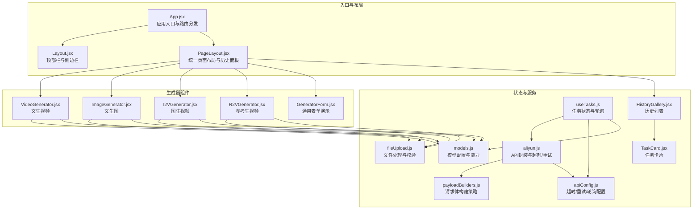
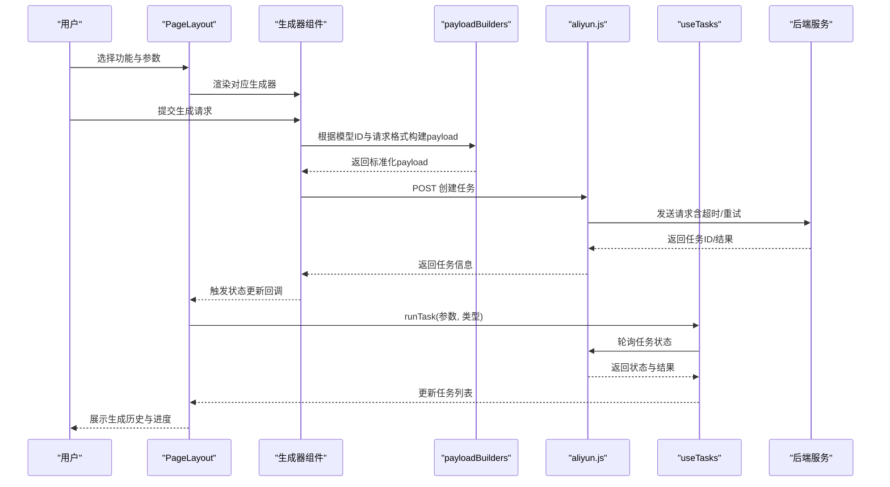
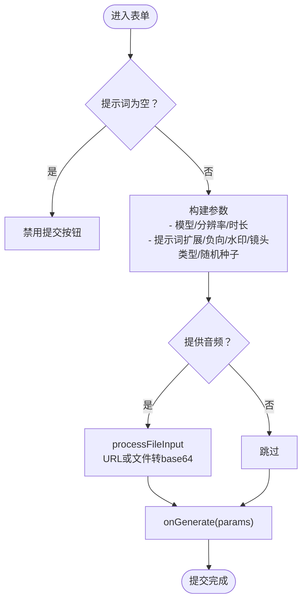
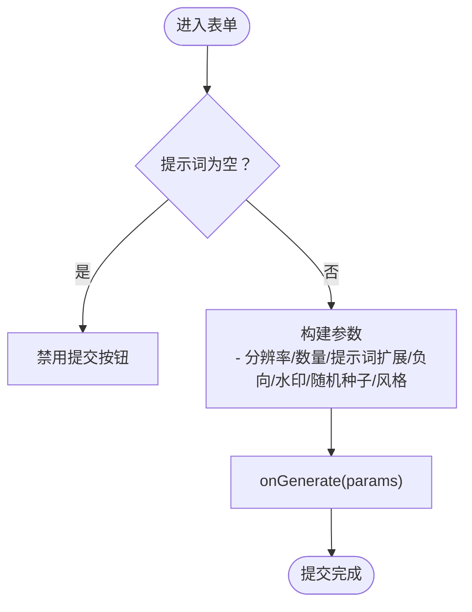
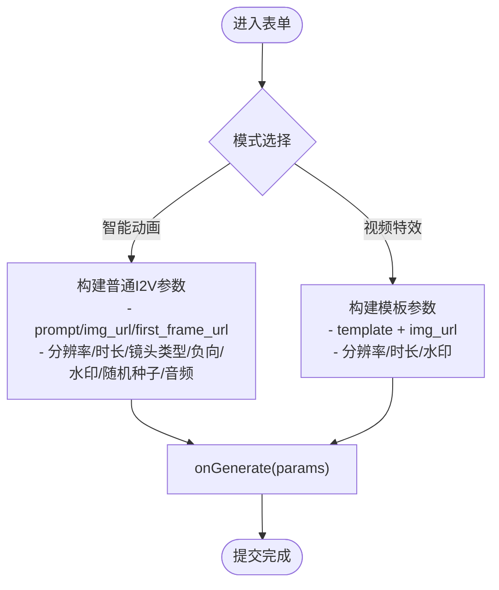
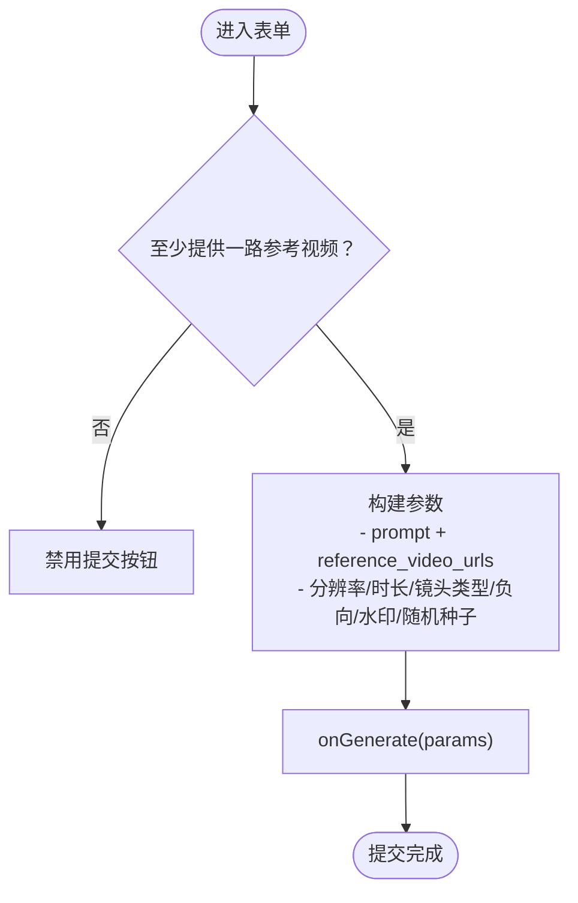
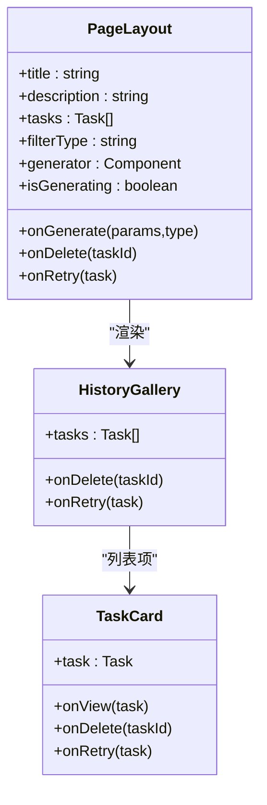
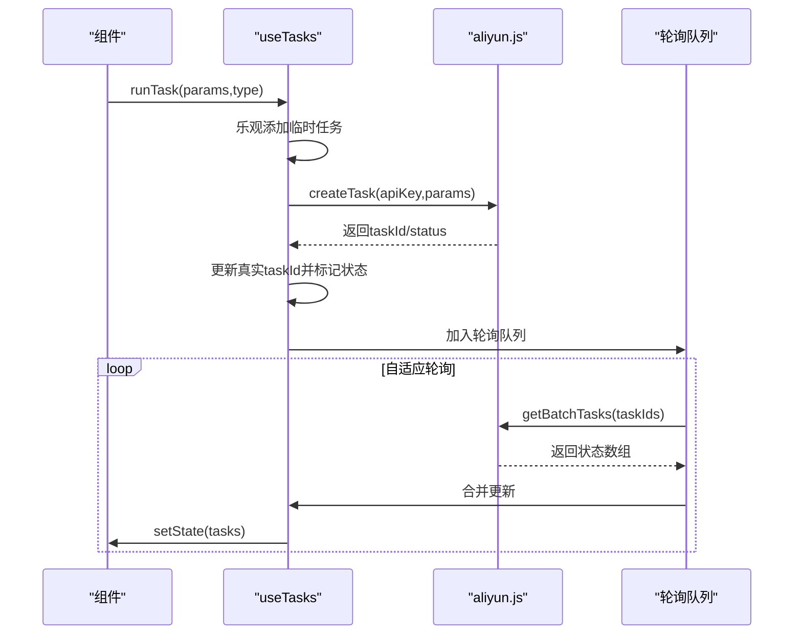
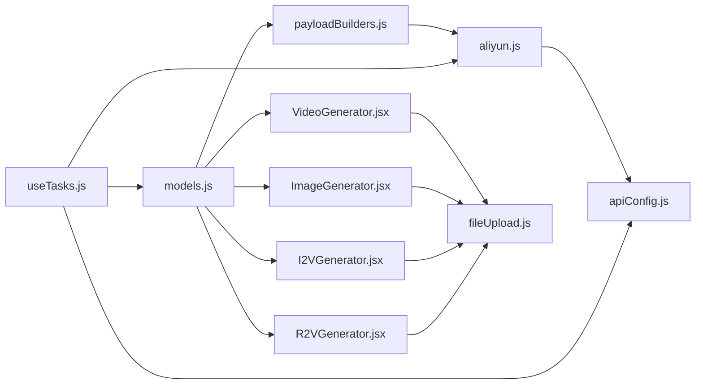

# 生成器组件

<cite>
**本文档引用的文件**
- [App.jsx](file://src/App.jsx)
- [Layout.jsx](file://src/components/Layout.jsx)
- [PageLayout.jsx](file://src/components/PageLayout.jsx)
- [VideoGenerator.jsx](file://src/components/VideoGenerator.jsx)
- [ImageGenerator.jsx](file://src/components/ImageGenerator.jsx)
- [I2VGenerator.jsx](file://src/components/I2VGenerator.jsx)
- [R2VGenerator.jsx](file://src/components/R2VGenerator.jsx)
- [GeneratorForm.jsx](file://src/components/GeneratorForm.jsx)
- [HistoryGallery.jsx](file://src/components/HistoryGallery.jsx)
- [TaskCard.jsx](file://src/components/TaskCard.jsx)
- [models.js](file://src/config/models.js)
- [apiConfig.js](file://src/config/apiConfig.js)
- [useTasks.js](file://src/hooks/useTasks.js)
- [aliyun.js](file://src/services/aliyun.js)
- [payloadBuilders.js](file://src/services/payloadBuilders.js)
- [fileUpload.js](file://src/utils/fileUpload.js)
</cite>

## 目录
1. [简介](#简介)
2. [项目结构](#项目结构)
3. [核心组件](#核心组件)
4. [架构总览](#架构总览)
5. [详细组件分析](#详细组件分析)
6. [依赖关系分析](#依赖关系分析)
7. [性能考虑](#性能考虑)
8. [故障排除指南](#故障排除指南)
9. [结论](#结论)
10. [附录](#附录)

## 简介
本技术文档面向通义万相前端应用的生成器组件群，系统性梳理视频生成器、图像生成器、图生视频生成器、参考生视频生成器等核心功能组件的设计原理、实现架构与交互流程。文档重点阐述以下方面：
- 参数配置与模型选择机制
- 状态管理与进度跟踪策略
- 表单验证、文件处理与进度反馈
- 组件间通用模式与差异化实现
- 扩展指南与自定义开发方法
- 错误处理机制、性能优化与用户体验优化
- 调试技巧与故障排除

## 项目结构
前端采用组件化架构，围绕“统一页面布局 + 生成器组件 + 任务状态管理”的模式组织代码。核心目录与职责如下：
- src/components：生成器组件与通用UI组件（布局、表单、历史等）
- src/config：模型配置与API常量
- src/hooks：业务逻辑钩子（任务状态管理）
- src/services：与后端API交互与请求体构建
- src/utils：工具函数（文件处理）

**图表来源**
- [App.jsx](file://src/App.jsx#L42-L377)
- [PageLayout.jsx](file://src/components/PageLayout.jsx#L9-L76)
- [VideoGenerator.jsx](file://src/components/VideoGenerator.jsx#L1-L354)
- [ImageGenerator.jsx](file://src/components/ImageGenerator.jsx#L1-L249)
- [I2VGenerator.jsx](file://src/components/I2VGenerator.jsx#L1-L588)
- [R2VGenerator.jsx](file://src/components/R2VGenerator.jsx#L1-L380)
- [useTasks.js](file://src/hooks/useTasks.js#L1-L333)
- [aliyun.js](file://src/services/aliyun.js#L1-L215)
- [payloadBuilders.js](file://src/services/payloadBuilders.js#L1-L829)
- [models.js](file://src/config/models.js#L1-L1012)
- [apiConfig.js](file://src/config/apiConfig.js#L1-L35)
- [fileUpload.js](file://src/utils/fileUpload.js#L1-L182)
- [HistoryGallery.jsx](file://src/components/HistoryGallery.jsx#L1-L68)
- [TaskCard.jsx](file://src/components/TaskCard.jsx#L1-L182)

**章节来源**
- [App.jsx](file://src/App.jsx#L42-L377)
- [PageLayout.jsx](file://src/components/PageLayout.jsx#L9-L76)

## 核心组件
本节聚焦四大生成器组件与其通用模式，涵盖参数配置、模型能力映射、文件处理与提交流程。

- 文生视频（VideoGenerator）
  - 支持模型切换、分辨率、时长、提示词扩展、负向提示词、水印、镜头类型、音频输入等
  - 时长随模型能力动态调整；音频支持URL与文件两种输入
  - 提交时根据模型能力构造请求体，必要时将文件转为base64

- 文生图（ImageGenerator）
  - 仅文本输入，支持负向提示词、随机种子、风格选择、输出数量、分辨率
  - 价格估算与高级参数开关

- 图生视频（I2VGenerator）
  - 支持普通图生视频与“视频特效模板”两种模式
  - 支持首帧/尾帧模式（KF2V），支持音频输入
  - 模板选择与模式切换联动，禁用不兼容选项

- 参考生视频（R2VGenerator）
  - 支持多路参考视频（最多3路），角色标识占位符
  - 支持镜头类型、负向提示词、随机种子、水印等

- 通用页面布局（PageLayout）
  - 固定生成表单在顶部，历史面板可折叠
  - 任务过滤与缓存优化

- 任务状态管理（useTasks）
  - 乐观提交、本地临时ID、批量轮询、自适应轮询间隔、状态收敛
  - 本地持久化与清理策略

**章节来源**
- [VideoGenerator.jsx](file://src/components/VideoGenerator.jsx#L1-L354)
- [ImageGenerator.jsx](file://src/components/ImageGenerator.jsx#L1-L249)
- [I2VGenerator.jsx](file://src/components/I2VGenerator.jsx#L1-L588)
- [R2VGenerator.jsx](file://src/components/R2VGenerator.jsx#L1-L380)
- [PageLayout.jsx](file://src/components/PageLayout.jsx#L9-L76)
- [useTasks.js](file://src/hooks/useTasks.js#L1-L333)

## 架构总览
整体架构遵循“配置驱动 + 策略构建”的设计原则：
- 模型配置集中于配置文件，统一声明协议、输出类型、能力集与默认参数
- 请求体构建通过策略模式（payloadBuilders）按请求格式组装
- API层统一封装超时、重试与错误处理
- 任务状态通过钩子集中管理，支持批量轮询与自适应策略

**图表来源**
- [payloadBuilders.js](file://src/services/payloadBuilders.js#L515-L571)
- [aliyun.js](file://src/services/aliyun.js#L50-L160)
- [useTasks.js](file://src/hooks/useTasks.js#L256-L312)
- [PageLayout.jsx](file://src/components/PageLayout.jsx#L36-L42)

## 详细组件分析

### 文生视频（VideoGenerator）组件
- 参数与能力
  - 模型：多版本（2.6/2.5/2.2/x2.1等），能力差异体现在时长、镜头类型、音频、负向提示词、水印、随机种子
  - 分辨率：按模型支持集合动态展示
  - 时长：随模型能力自动调整，部分模型固定时长
  - 高级设置：负向提示词、随机种子、镜头类型、音频输入（URL/文件）
- 文件处理
  - 音频文件通过工具函数转换为base64或校验URL
- 提交流程
  - 校验必填项，按模型能力拼装parameters与input
  - 调用父组件回调，传递类型与参数

**图表来源**
- [VideoGenerator.jsx](file://src/components/VideoGenerator.jsx#L74-L115)
- [fileUpload.js](file://src/utils/fileUpload.js#L114-L144)

**章节来源**
- [VideoGenerator.jsx](file://src/components/VideoGenerator.jsx#L1-L354)
- [fileUpload.js](file://src/utils/fileUpload.js#L1-L182)

### 文生图（ImageGenerator）组件
- 参数与能力
  - 仅文本输入，支持负向提示词、随机种子、风格、输出数量、分辨率
  - 价格估算与高级参数开关
- 提交流程
  - 校验提示词，按模型能力拼装parameters与input
  - 调用父组件回调

**图表来源**
- [ImageGenerator.jsx](file://src/components/ImageGenerator.jsx#L32-L48)

**章节来源**
- [ImageGenerator.jsx](file://src/components/ImageGenerator.jsx#L1-L249)

### 图生视频（I2VGenerator）组件
- 模式与能力
  - 普通模式：基于图像与提示词生成视频
  - 视频特效模板模式：基于模板生成特效视频，禁用部分高级参数
  - 首帧/尾帧模式：支持关键帧到视频（KF2V），禁用尾帧模式下的视频特效
  - 音频输入：支持URL/文件
- 文件处理
  - 图像与音频均转换为base64
- 提交流程
  - 根据模式选择input结构（template或prompt+img_url/first_frame_url）
  - 按模型能力拼装parameters

**图表来源**
- [I2VGenerator.jsx](file://src/components/I2VGenerator.jsx#L113-L172)

**章节来源**
- [I2VGenerator.jsx](file://src/components/I2VGenerator.jsx#L1-L588)

### 参考生视频（R2VGenerator）组件
- 参数与能力
  - 支持最多3路参考视频，角色占位符引用
  - 支持镜头类型、负向提示词、随机种子、水印
- 文件处理
  - 参考视频转换为base64
- 提交流程
  - 校验提示词与至少一路参考视频
  - 按模型能力拼装parameters

**图表来源**
- [R2VGenerator.jsx](file://src/components/R2VGenerator.jsx#L83-L112)

**章节来源**
- [R2VGenerator.jsx](file://src/components/R2VGenerator.jsx#L1-L380)

### 通用页面布局（PageLayout）与历史面板
- 页面布局
  - 固定生成表单在顶部，历史面板可折叠
  - 任务过滤与缓存优化（memoized过滤）
- 历史面板
  - 任务网格展示，支持全屏预览、下载、删除、重试
  - 成功与失败状态区分，失败任务可重试

**图表来源**
- [PageLayout.jsx](file://src/components/PageLayout.jsx#L9-L76)
- [HistoryGallery.jsx](file://src/components/HistoryGallery.jsx#L1-L68)
- [TaskCard.jsx](file://src/components/TaskCard.jsx#L1-L182)

**章节来源**
- [PageLayout.jsx](file://src/components/PageLayout.jsx#L9-L76)
- [HistoryGallery.jsx](file://src/components/HistoryGallery.jsx#L1-L68)
- [TaskCard.jsx](file://src/components/TaskCard.jsx#L1-L182)

### 任务状态管理（useTasks）与API交互
- 乐观提交
  - 生成临时ID，立即插入任务列表，提升响应感
- 批量轮询
  - 自适应轮询间隔：新任务快速轮询，长时间任务降低频率
  - 并行查询多个任务状态，合并更新
- 状态收敛
  - 仅在媒体URL到达或状态变化时更新，避免闪烁
- 本地持久化
  - 本地存储任务列表，清理base64以节省空间
- API封装
  - 超时控制、重试策略、错误分类与友好提示
  - 同步/异步任务统一输出结构

**图表来源**
- [useTasks.js](file://src/hooks/useTasks.js#L256-L332)
- [aliyun.js](file://src/services/aliyun.js#L50-L215)
- [apiConfig.js](file://src/config/apiConfig.js#L8-L27)

**章节来源**
- [useTasks.js](file://src/hooks/useTasks.js#L1-L333)
- [aliyun.js](file://src/services/aliyun.js#L1-L215)
- [apiConfig.js](file://src/config/apiConfig.js#L1-L35)

## 依赖关系分析
- 配置驱动
  - 模型配置集中于models.js，统一声明协议、输出类型、能力集与默认参数
- 策略构建
  - payloadBuilders按请求格式构建payload，新增模型只需扩展配置与对应builder
- 服务层
  - aliyun.js封装API调用、超时与重试，统一错误处理
- 工具函数
  - fileUpload.js提供文件/URL/base64互转与校验，支持图片压缩

**图表来源**
- [models.js](file://src/config/models.js#L1-L1012)
- [payloadBuilders.js](file://src/services/payloadBuilders.js#L1-L829)
- [aliyun.js](file://src/services/aliyun.js#L1-L215)
- [apiConfig.js](file://src/config/apiConfig.js#L1-L35)
- [fileUpload.js](file://src/utils/fileUpload.js#L1-L182)
- [useTasks.js](file://src/hooks/useTasks.js#L1-L333)

**章节来源**
- [models.js](file://src/config/models.js#L1-L1012)
- [payloadBuilders.js](file://src/services/payloadBuilders.js#L1-L829)
- [aliyun.js](file://src/services/aliyun.js#L1-L215)
- [apiConfig.js](file://src/config/apiConfig.js#L1-L35)
- [fileUpload.js](file://src/utils/fileUpload.js#L1-L182)
- [useTasks.js](file://src/hooks/useTasks.js#L1-L333)

## 性能考虑
- 轮询策略
  - 新任务快速轮询（1秒），稳定任务降频（最大5秒），减少无效请求
  - 状态变化时重置轮询计数，加速收敛
- 本地存储
  - 清理base64数据，避免localStorage膨胀；容量不足时截断保留最近任务
- 文件处理
  - 大图压缩与base64限制，避免超大载荷导致内存压力
- UI渲染
  - 任务过滤使用memo化，避免重复计算
  - 任务卡片hover显隐操作按钮，降低DOM开销

[本节为通用指导，无需特定文件引用]

## 故障排除指南
- 常见错误与定位
  - 未知模型/请求格式：检查模型ID与请求格式是否匹配
  - 请求超时：检查网络与超时配置，适当增大超时时间
  - 轮询超时：检查任务状态是否卡住，必要时重试
  - 文件格式/大小不合法：检查accept与maxSize限制
- 用户体验优化
  - API Key缺失：弹窗引导配置，状态高亮提示
  - 生成失败：提供重试按钮与原因提示
  - 历史记录：支持全屏预览、下载、删除与重试

**章节来源**
- [aliyun.js](file://src/services/aliyun.js#L146-L159)
- [useTasks.js](file://src/hooks/useTasks.js#L314-L322)
- [fileUpload.js](file://src/utils/fileUpload.js#L148-L181)
- [App.jsx](file://src/App.jsx#L50-L69)

## 结论
本组件群通过“配置驱动 + 策略构建 + 钩子管理”的架构，实现了高度可扩展的AI内容生成体系。各生成器组件遵循统一的参数与能力映射，配合完善的文件处理、状态管理与错误处理机制，既保证了开发效率，也提升了用户体验。后续扩展可通过新增模型配置与对应请求体构建器即可快速接入。

[本节为总结，无需特定文件引用]

## 附录

### 扩展指南与自定义开发
- 新增模型
  - 在模型配置中添加条目，声明协议、端点、请求格式、能力集与默认参数
  - 如需特殊请求体结构，新增对应的payloadBuilder
- 新增生成器组件
  - 复用PageLayout与HistoryGallery，按需实现参数收集与onGenerate回调
  - 使用models.js能力映射与fileUpload.js文件处理工具
- 新增请求格式
  - 在payloadBuilders中新增builder函数，遵循现有命名与参数结构
  - 在aliyun.js中完善超时/重试策略与错误处理
- 新增页面布局
  - 使用PageLayout作为容器，传入生成器组件与过滤类型

**章节来源**
- [models.js](file://src/config/models.js#L1-L1012)
- [payloadBuilders.js](file://src/services/payloadBuilders.js#L1-L829)
- [PageLayout.jsx](file://src/components/PageLayout.jsx#L9-L76)
- [fileUpload.js](file://src/utils/fileUpload.js#L1-L182)