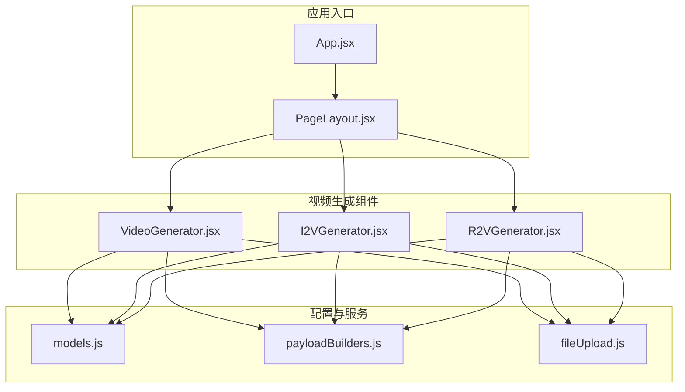
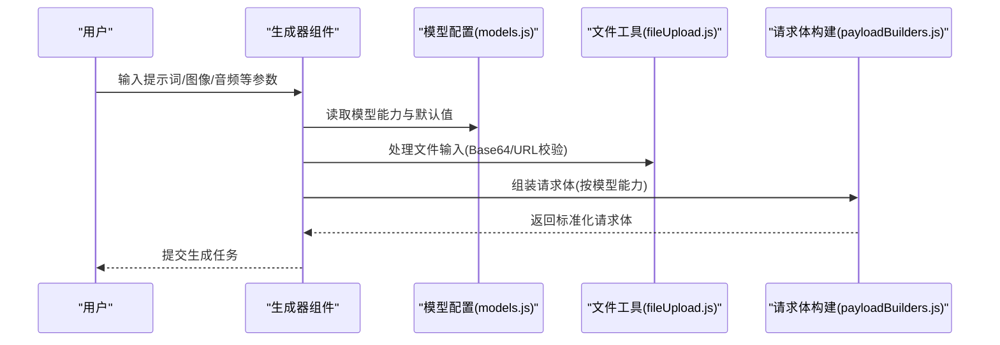
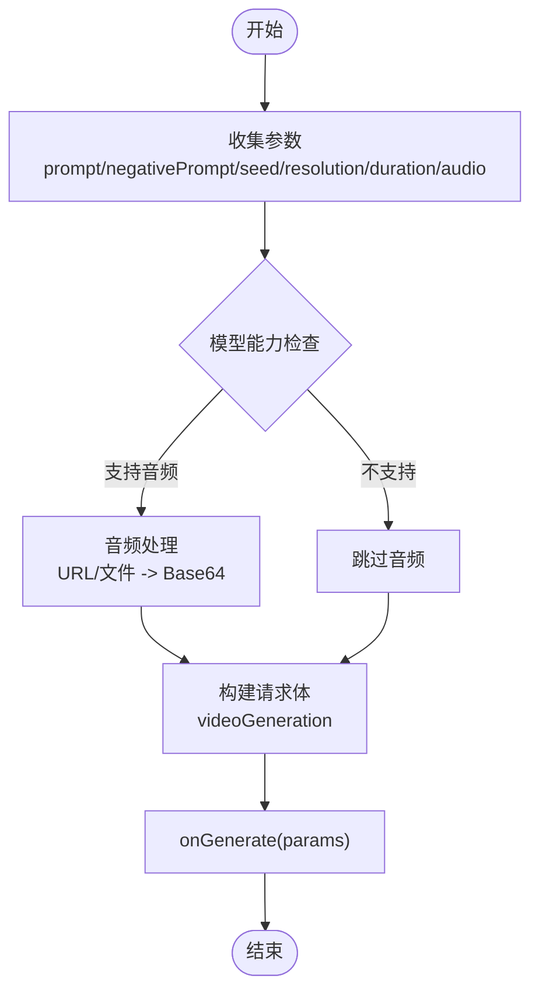
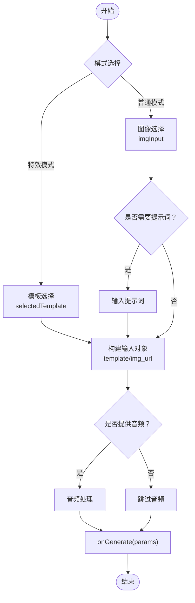
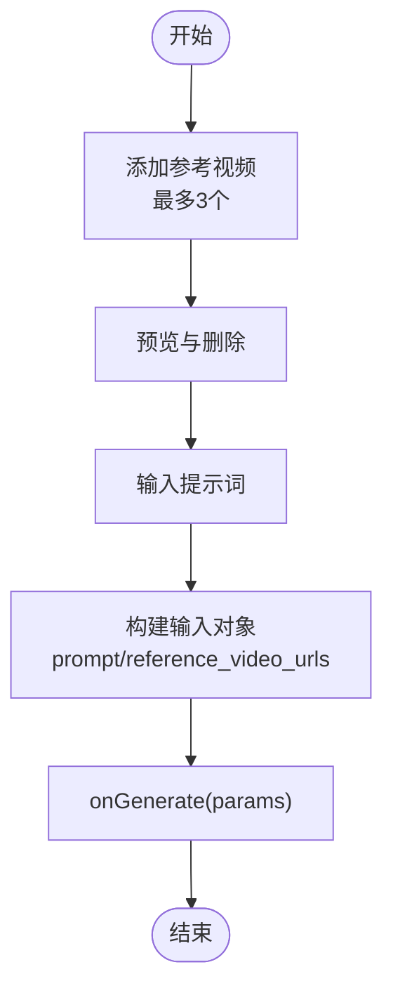
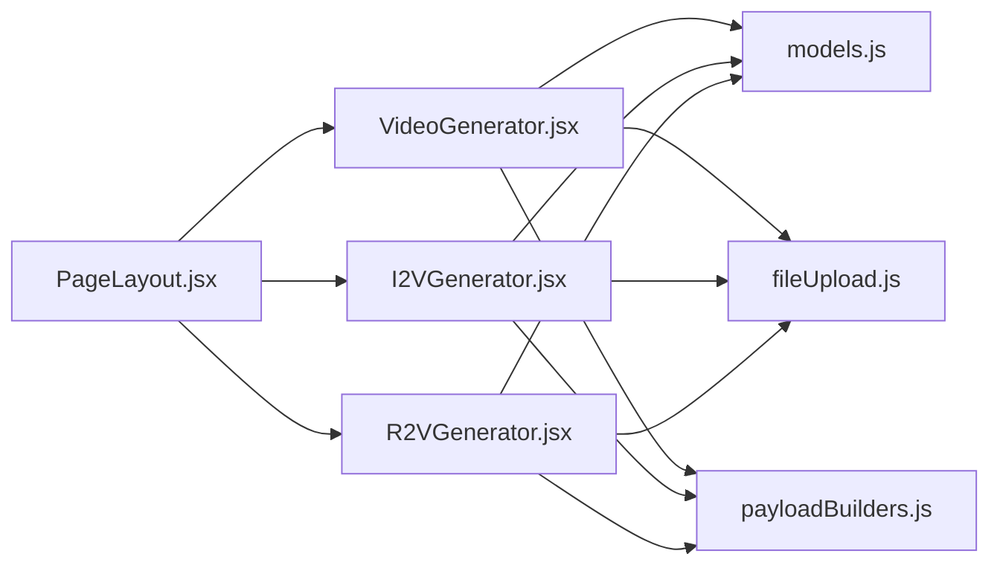

# 视频生成组件

<cite>
**本文引用的文件列表**
- [VideoGenerator.jsx](file://src/components/VideoGenerator.jsx)
- [I2VGenerator.jsx](file://src/components/I2VGenerator.jsx)
- [R2VGenerator.jsx](file://src/components/R2VGenerator.jsx)
- [models.js](file://src/config/models.js)
- [payloadBuilders.js](file://src/services/payloadBuilders.js)
- [fileUpload.js](file://src/utils/fileUpload.js)
- [PageLayout.jsx](file://src/components/PageLayout.jsx)
- [App.jsx](file://src/App.jsx)
</cite>

## 目录
1. [简介](#简介)
2. [项目结构](#项目结构)
3. [核心组件](#核心组件)
4. [架构总览](#架构总览)
5. [组件详解](#组件详解)
6. [依赖关系分析](#依赖关系分析)
7. [性能考量](#性能考量)
8. [故障排查指南](#故障排查指南)
9. [结论](#结论)
10. [附录](#附录)

## 简介
本技术文档聚焦于视频生成相关的三个核心组件：文生视频（VideoGenerator.jsx）、图生视频（I2VGenerator.jsx）与参考生视频（R2VGenerator.jsx）。文档将系统性解析各组件的功能实现、参数配置、数据流与状态管理，并给出参数调优、错误处理与最佳实践建议，帮助开发者理解与扩展视频生成能力。

## 项目结构
视频生成相关组件位于 src/components 下，配合配置与服务层共同完成请求构建与文件处理：
- 组件层：VideoGenerator.jsx、I2VGenerator.jsx、R2VGenerator.jsx
- 配置层：src/config/models.js（模型能力、协议、分辨率映射、特效模板）
- 服务层：src/services/payloadBuilders.js（请求体构造策略）
- 工具层：src/utils/fileUpload.js（文件转Base64、校验、URL校验）
- 页面布局：src/components/PageLayout.jsx（统一布局与历史记录）
- 应用入口：src/App.jsx（路由与页面渲染）

图表来源
- [App.jsx](file://src/App.jsx#L71-L133)
- [PageLayout.jsx](file://src/components/PageLayout.jsx#L9-L42)
- [VideoGenerator.jsx](file://src/components/VideoGenerator.jsx#L1-L354)
- [I2VGenerator.jsx](file://src/components/I2VGenerator.jsx#L1-L588)
- [R2VGenerator.jsx](file://src/components/R2VGenerator.jsx#L1-L380)
- [models.js](file://src/config/models.js#L39-L239)
- [payloadBuilders.js](file://src/services/payloadBuilders.js#L514-L665)
- [fileUpload.js](file://src/utils/fileUpload.js#L1-L182)

章节来源
- [App.jsx](file://src/App.jsx#L71-L133)
- [PageLayout.jsx](file://src/components/PageLayout.jsx#L9-L42)

## 核心组件
- 文生视频（VideoGenerator.jsx）：以文本为输入，支持模型选择、分辨率、时长、音频驱动、反向提示词、随机种子、镜头类型、水印等参数。
- 图生视频（I2VGenerator.jsx）：以图像为输入，支持模板特效模式与常规模式，含首帧/尾帧关键帧模式、音频输入、镜头类型、反向提示词、随机种子等。
- 参考生视频（R2VGenerator.jsx）：以参考视频为输入，支持多角色引用、镜头类型、反向提示词、随机种子、水印等。

章节来源
- [VideoGenerator.jsx](file://src/components/VideoGenerator.jsx#L6-L115)
- [I2VGenerator.jsx](file://src/components/I2VGenerator.jsx#L5-L172)
- [R2VGenerator.jsx](file://src/components/R2VGenerator.jsx#L5-L112)

## 架构总览
三类生成器均遵循统一的“表单收集参数 -> 构建请求体 -> 发送到服务层”的流程；请求体由 payloadBuilders.js 的策略模式按模型能力组装；文件输入通过 fileUpload.js 进行 Base64 转换与格式校验；页面布局通过 PageLayout.jsx 固定生成表单并提供历史记录面板。

图表来源
- [VideoGenerator.jsx](file://src/components/VideoGenerator.jsx#L74-L115)
- [I2VGenerator.jsx](file://src/components/I2VGenerator.jsx#L113-L172)
- [R2VGenerator.jsx](file://src/components/R2VGenerator.jsx#L83-L112)
- [models.js](file://src/config/models.js#L39-L239)
- [payloadBuilders.js](file://src/services/payloadBuilders.js#L514-L665)
- [fileUpload.js](file://src/utils/fileUpload.js#L114-L144)

## 组件详解

### 文生视频（VideoGenerator.jsx）
- 核心参数
  - 模型选择：根据 VIDEO_MODELS 选择不同能力集（如音频驱动、镜头类型、反向提示词、随机种子、水印等）。
  - 分辨率：RESOLUTION_LABELS 映射，支持 480P/720P/1080P 等标签或 16:9/9:16 等宽高格式。
  - 时长：不同模型支持的时长集合不同，切换模型会自动调整可用时长。
  - 音频输入：支持 URL 与文件两种输入，经 fileUpload.js 校验后转换为 Base64。
  - 高级参数：智能改写提示词、水印、反向提示词、随机种子、镜头类型（受模型能力控制）。
- 数据流与状态
  - 表单状态：prompt、negativePrompt、seed、selectedModelId、resolution、duration、promptExtend、watermark、shotType、audioInput、showAdvanced。
  - 提交流程：handleSubmit 中根据当前模型能力决定是否加入音频、反向提示词、随机种子、镜头类型等，并调用 onGenerate。
- 错误处理
  - 音频文件类型校验与异常提示。
  - URL 格式校验与错误提示。
- 关键实现路径
  - 参数构建与提交：[handleSubmit](file://src/components/VideoGenerator.jsx#L74-L115)
  - 可用时长联动：[getAvailableDurations](file://src/components/VideoGenerator.jsx#L31-L44)
  - 音频文件处理：[handleAudioFileChange](file://src/components/VideoGenerator.jsx#L47-L62)、[handleAudioUrlChange](file://src/components/VideoGenerator.jsx#L65-L72)
  - 请求体构建策略：[videoGeneration](file://src/services/payloadBuilders.js#L515-L571)

图表来源
- [VideoGenerator.jsx](file://src/components/VideoGenerator.jsx#L74-L115)
- [payloadBuilders.js](file://src/services/payloadBuilders.js#L515-L571)

章节来源
- [VideoGenerator.jsx](file://src/components/VideoGenerator.jsx#L6-L115)
- [payloadBuilders.js](file://src/services/payloadBuilders.js#L515-L571)
- [fileUpload.js](file://src/utils/fileUpload.js#L114-L144)

### 图生视频（I2VGenerator.jsx）
- 核心参数
  - 模型选择：I2V_MODELS，支持模板特效模式与常规模式，部分模型支持首帧/尾帧关键帧模式。
  - 分辨率与时长：分辨率映射与 I2V 模型支持的时长集合。
  - 图像输入：仅文件上传（Base64），支持预览与删除。
  - 音频输入：URL/文件两种输入，支持预览。
  - 高级参数：镜头类型、反向提示词、随机种子、特效模板选择、首帧/尾帧模式互斥逻辑。
- 模式与交互
  - 效果模式：使用模板替代提示词，模板来源于 VIDEO_EFFECT_TEMPLATES，按模型 ID 自动筛选可用模板。
  - 普通模式：使用提示词，支持 img_url 或 first_frame_url（关键帧模式）。
  - 首帧/尾帧：尾帧模式禁用特效模板与部分高级参数。
- 数据流与状态
  - 表单状态：prompt、imgInput、audioInput、negativePrompt、seed、selectedModelId、resolution、duration、shotType、showAdvanced、imgFrameType、useEffectMode、selectedTemplate。
  - 提交流程：handleSubmit 根据模式与参数组合 input 对象，调用 onGenerate。
- 错误处理
  - 图像/音频类型校验与提示。
  - 特效模板与首帧/尾帧的互斥限制。
- 关键实现路径
  - 模板筛选：[getAvailableTemplates](file://src/components/I2VGenerator.jsx#L39-L57)
  - 图像/音频处理：[handleImageFileChange](file://src/components/I2VGenerator.jsx#L78-L93)、[handleAudioFileChange](file://src/components/I2VGenerator.jsx#L96-L111)
  - 提交流程：[handleSubmit](file://src/components/I2VGenerator.jsx#L113-L172)
  - 请求体构建策略：[imageToVideo](file://src/services/payloadBuilders.js#L577-L643)

图表来源
- [I2VGenerator.jsx](file://src/components/I2VGenerator.jsx#L113-L172)
- [payloadBuilders.js](file://src/services/payloadBuilders.js#L577-L643)

章节来源
- [I2VGenerator.jsx](file://src/components/I2VGenerator.jsx#L5-L172)
- [payloadBuilders.js](file://src/services/payloadBuilders.js#L577-L643)
- [fileUpload.js](file://src/utils/fileUpload.js#L114-L144)

### 参考生视频（R2VGenerator.jsx）
- 核心参数
  - 模型选择：R2V_MODELS，支持多角色引用（最多3个参考视频）。
  - 分辨率与时长：分辨率映射与可用时长集合。
  - 参考视频：最多3个，支持预览与删除，支持添加更多角色参考。
  - 高级参数：镜头类型、反向提示词、随机种子、水印（受模型能力控制）。
- 数据流与状态
  - 表单状态：prompt、referenceVideos（数组，含 value/file/preview/character）、negativePrompt、seed、selectedModelId、resolution、duration、shotType、watermark、showAdvanced。
  - 提交流程：handleSubmit 收集所有已选择的参考视频 Base64，调用 onGenerate。
- 错误处理
  - 必填项校验（提示词与至少一个参考视频）。
- 关键实现路径
  - 参考视频管理：[handleVideoFileChange](file://src/components/R2VGenerator.jsx#L39-L60)、[addReferenceVideo](file://src/components/R2VGenerator.jsx#L62-L70)、[removeReferenceVideo](file://src/components/R2VGenerator.jsx#L72-L78)
  - 提交流程：[handleSubmit](file://src/components/R2VGenerator.jsx#L83-L112)
  - 请求体构建策略：[referenceToVideo](file://src/services/payloadBuilders.js#L649-L665)

图表来源
- [R2VGenerator.jsx](file://src/components/R2VGenerator.jsx#L83-L112)
- [payloadBuilders.js](file://src/services/payloadBuilders.js#L649-L665)

章节来源
- [R2VGenerator.jsx](file://src/components/R2VGenerator.jsx#L5-L112)
- [payloadBuilders.js](file://src/services/payloadBuilders.js#L649-L665)
- [fileUpload.js](file://src/utils/fileUpload.js#L114-L144)

## 依赖关系分析
- 组件到配置
  - 各生成器通过 VIDEO_MODELS/I2V_MODELS/R2V_MODELS 获取模型能力、默认分辨率、端点与请求格式。
- 组件到服务
  - 通过 payloadBuilders.js 的 videoGeneration/imageToVideo/referenceToVideo 等策略函数统一构建请求体。
- 组件到工具
  - fileUpload.js 提供 processFileInput、convertFileToBase64、isValidUrl 等工具，确保输入合法与格式统一。
- 页面布局
  - PageLayout.jsx 将生成器组件包裹，固定生成表单在顶部，历史记录可折叠展示，便于用户操作与回溯。

图表来源
- [VideoGenerator.jsx](file://src/components/VideoGenerator.jsx#L3-L4)
- [I2VGenerator.jsx](file://src/components/I2VGenerator.jsx#L3)
- [R2VGenerator.jsx](file://src/components/R2VGenerator.jsx#L3)
- [models.js](file://src/config/models.js#L39-L239)
- [payloadBuilders.js](file://src/services/payloadBuilders.js#L514-L665)
- [fileUpload.js](file://src/utils/fileUpload.js#L1-L182)
- [PageLayout.jsx](file://src/components/PageLayout.jsx#L9-L42)

章节来源
- [models.js](file://src/config/models.js#L39-L239)
- [payloadBuilders.js](file://src/services/payloadBuilders.js#L514-L665)
- [fileUpload.js](file://src/utils/fileUpload.js#L1-L182)
- [PageLayout.jsx](file://src/components/PageLayout.jsx#L9-L42)

## 性能考量
- 文件大小与 Base64
  - fileUpload.js 对大文件进行压缩与 Base64 转换，避免超过接口限制；建议在前端对大图进行压缩后再上传。
- 请求体构建
  - payloadBuilders.js 采用策略模式，按模型能力选择性拼装参数，减少冗余字段，提高兼容性与传输效率。
- UI 交互
  - PageLayout.jsx 使用 useMemo 缓存过滤后的任务列表，降低渲染开销；生成器组件内部状态粒度细，避免不必要的重渲染。

[本节为通用指导，无需特定文件引用]

## 故障排查指南
- 音频/图像/视频文件类型错误
  - 症状：上传后提示无效类型或无法生成。
  - 处理：确认文件类型与扩展名，参考 fileUpload.js 的类型校验逻辑。
- URL 格式非法
  - 症状：输入 URL 后提示格式错误。
  - 处理：使用 isValidUrl 校验，确保 http/https 协议。
- 模型能力不支持某参数
  - 症状：某些参数未生效（如镜头类型、反向提示词、随机种子）。
  - 处理：检查 models.js 中对应模型的 capabilities 字段，确认是否启用。
- 时长/分辨率不匹配
  - 症状：切换模型后时长/分辨率不可选。
  - 处理：组件内部会自动调整可用选项，确保与模型能力一致。
- 参考视频缺失
  - 症状：提交时报错或无响应。
  - 处理：确保至少选择一个参考视频，且文件有效。

章节来源
- [fileUpload.js](file://src/utils/fileUpload.js#L92-L144)
- [models.js](file://src/config/models.js#L39-L239)
- [VideoGenerator.jsx](file://src/components/VideoGenerator.jsx#L23-L28)
- [I2VGenerator.jsx](file://src/components/I2VGenerator.jsx#L23-L36)
- [R2VGenerator.jsx](file://src/components/R2VGenerator.jsx#L85-L95)

## 结论
VideoGenerator.jsx、I2VGenerator.jsx 与 R2VGenerator.jsx 通过统一的配置与服务层，实现了灵活的参数配置、严谨的输入校验与可扩展的请求体构建。借助 models.js 的能力声明与 payloadBuilders.js 的策略模式，开发者可以便捷地为新模型添加支持；同时，fileUpload.js 保障了文件输入的稳定性与安全性。建议在实际部署中关注文件大小与网络状况，合理设置分辨率与时长，以获得更佳的生成体验。

[本节为总结，无需特定文件引用]

## 附录

### 参数与能力对照表
- 文生视频（T2V）
  - 支持能力：音频驱动、镜头类型、反向提示词、随机种子、水印、智能改写提示词。
  - 时长：因模型而异（如 5/10/15 秒）。
- 图生视频（I2V）
  - 支持能力：模板特效、音频驱动、镜头类型、反向提示词、随机种子、首帧/尾帧关键帧。
  - 时长：2/5/10/15 秒。
- 参考生视频（R2V）
  - 支持能力：多角色引用、镜头类型、反向提示词、随机种子、水印。
  - 时长：5/10 秒。

章节来源
- [models.js](file://src/config/models.js#L39-L239)

### 最佳实践指南
- 提示词优化
  - 明确主体、动作、场景与风格，必要时使用“角色占位符”（如 character1）。
- 参数调优
  - 分辨率与时长：优先选择与目标平台一致的分辨率与时长，避免二次缩放。
  - 随机种子：固定种子可复现实验结果，便于迭代优化。
  - 镜头类型：复杂场景建议使用多镜头叙事。
- 性能优化
  - 前端压缩大图，避免 Base64 过大导致内存压力。
  - 合理选择模型：高分辨率/长时长模型生成时间较长，需平衡质量与效率。
- 错误处理
  - 在 UI 上提供清晰的错误提示与重试机制，提升用户体验。

[本节为通用指导，无需特定文件引用]

### 扩展开发指南
- 新增模型
  - 在 models.js 中新增模型条目，定义 capabilities、默认分辨率与端点。
  - 在 payloadBuilders.js 中为新模型添加对应的请求体构建函数或复用现有策略。
- 新增参数
  - 在对应生成器组件中添加状态与 UI 控件，确保与模型 capabilities 对齐。
  - 在 payloadBuilders.js 中按需拼装参数，避免冗余字段。
- 自定义视频生成器
  - 参照现有组件的结构与流程，复用 fileUpload.js 与 models.js，确保输入校验与请求体构建的一致性。

章节来源
- [models.js](file://src/config/models.js#L39-L239)
- [payloadBuilders.js](file://src/services/payloadBuilders.js#L514-L665)
- [fileUpload.js](file://src/utils/fileUpload.js#L1-L182)