# 编辑器组件

<cite>
**本文档引用的文件**
- [VideoEditor.jsx](file://src/components/VideoEditor.jsx)
- [ImageEditor.jsx](file://src/components/ImageEditor.jsx)
- [models.js](file://src/config/models.js)
- [useTasks.js](file://src/hooks/useTasks.js)
- [fileUpload.js](file://src/utils/fileUpload.js)
- [App.jsx](file://src/App.jsx)
- [Layout.jsx](file://src/components/Layout.jsx)
</cite>

## 目录
1. [简介](#简介)
2. [项目结构](#项目结构)
3. [核心组件](#核心组件)
4. [架构概览](#架构概览)
5. [详细组件分析](#详细组件分析)
6. [依赖关系分析](#依赖关系分析)
7. [性能考虑](#性能考虑)
8. [故障排除指南](#故障排除指南)
9. [结论](#结论)
10. [附录](#附录)

## 简介

通义万相前端应用提供了两个核心编辑器组件：VideoEditor.jsx（视频编辑器）和ImageEditor.jsx（图像编辑器）。这些组件实现了AI驱动的多媒体内容编辑功能，支持从简单的图像处理到复杂的视频编辑操作。

视频编辑器专注于视频内容的AI生成和编辑，包括多图参考视频重绘、视频重绘、局部编辑、视频延展和画面扩展等功能。图像编辑器则提供基于文本指令的图像编辑能力，支持多种编辑模式和高级参数配置。

## 项目结构

编辑器组件位于src/components目录下，采用模块化设计，每个组件都有独立的功能职责：

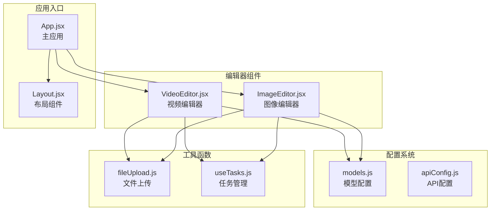

**图表来源**
- [VideoEditor.jsx](file://src/components/VideoEditor.jsx#L1-L585)
- [ImageEditor.jsx](file://src/components/ImageEditor.jsx#L1-L973)
- [models.js](file://src/config/models.js#L1-L1012)

**章节来源**
- [VideoEditor.jsx](file://src/components/VideoEditor.jsx#L1-L50)
- [ImageEditor.jsx](file://src/components/ImageEditor.jsx#L1-L50)
- [App.jsx](file://src/App.jsx#L1-L50)

## 核心组件

### VideoEditor 组件

VideoEditor.jsx是一个功能丰富的视频编辑器，支持以下核心功能：

#### 主要功能特性
- **多图参考视频重绘**：支持最多3张参考图，可融合生成连贯视频内容
- **视频重绘**：根据提示词重新生成视频内容
- **局部编辑**：在指定区域根据提示词修改视频内容
- **视频画面扩展**：扩展视频画面边界
- **视频延展**：延长视频时长

#### 状态管理
组件使用React的useState钩子管理复杂的状态：
- `selectedFunction`：当前选择的编辑功能
- `prompt`：用户输入的提示词
- `refImages`：参考图像数组
- `inputVideo`：输入视频对象
- `maskImage`：掩码图像
- `selectedModelId`：选择的模型ID
- `resolution`：输出分辨率
- `duration`：视频时长
- `seed`：随机种子
- `watermark`：水印开关

#### 用户界面设计
采用卡片式布局和渐变色彩设计：
- 功能选择按钮使用图标+标签的设计
- 参考图像上传支持拖拽和预览
- 掩码图像支持URL和文件两种输入方式
- 高级设置面板可折叠展开

**章节来源**
- [VideoEditor.jsx](file://src/components/VideoEditor.jsx#L5-L187)
- [VideoEditor.jsx](file://src/components/VideoEditor.jsx#L200-L581)

### ImageEditor 组件

ImageEditor.jsx提供了强大的图像编辑功能，支持多种编辑模式：

#### 支持的编辑模式
- **Qwen图像编辑系列**：支持多图输入和多图输出
- **万相图像编辑系列**：支持全局风格化、局部风格化、指令编辑等
- **草图转图像**：基于手绘图案生成精美图像
- **图像局部重绘**：精确控制重绘区域
- **人像风格重绘**：支持多种预设风格
- **图像扩图**：智能画面扩展功能

#### 高级参数配置
- **模型特定参数**：根据所选模型动态显示相关参数
- **风格选择**：支持多种艺术风格
- **草图权重**：控制草图相似度
- **掩码颜色**：精确指定重绘区域
- **输出质量**：最佳质量模式和文件大小限制

#### 用户交互设计
- **预览弹窗**：ESC键关闭，全屏预览
- **参考图像管理**：支持多图上传和删除
- **参数面板**：可折叠的高级设置
- **实时反馈**：上传进度和错误提示

**章节来源**
- [ImageEditor.jsx](file://src/components/ImageEditor.jsx#L15-L54)
- [ImageEditor.jsx](file://src/components/ImageEditor.jsx#L163-L230)
- [ImageEditor.jsx](file://src/components/ImageEditor.jsx#L234-L973)

## 架构概览

编辑器组件采用分层架构设计，确保代码的可维护性和扩展性：

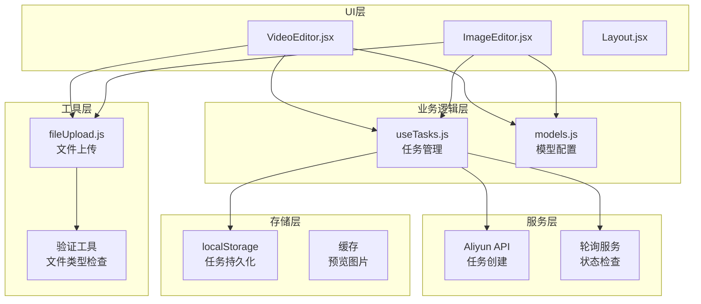

**图表来源**
- [useTasks.js](file://src/hooks/useTasks.js#L9-L332)
- [fileUpload.js](file://src/utils/fileUpload.js#L6-L182)
- [models.js](file://src/config/models.js#L1-L1012)

**章节来源**
- [App.jsx](file://src/App.jsx#L42-L377)
- [Layout.jsx](file://src/components/Layout.jsx#L5-L94)

## 详细组件分析

### VideoEditor 组件深度分析

#### 数据流架构

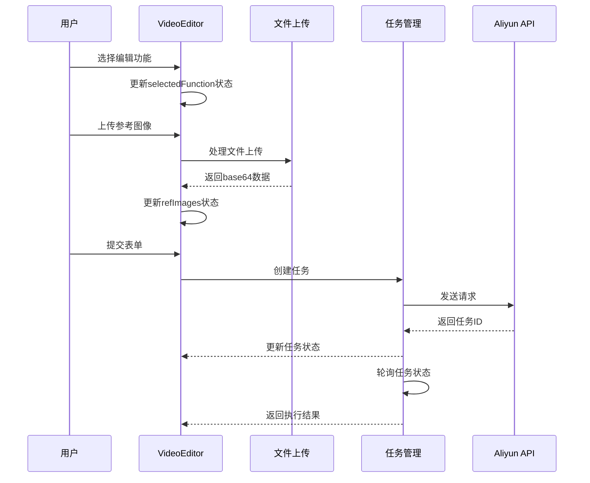

**图表来源**
- [VideoEditor.jsx](file://src/components/VideoEditor.jsx#L120-L187)
- [useTasks.js](file://src/hooks/useTasks.js#L256-L312)

#### 状态管理模式

VideoEditor采用集中式状态管理，所有编辑状态都通过React状态钩子管理：

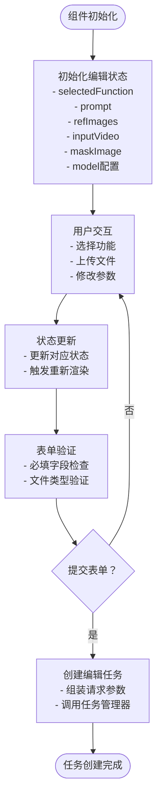

**图表来源**
- [VideoEditor.jsx](file://src/components/VideoEditor.jsx#L5-L187)

#### 文件处理流程

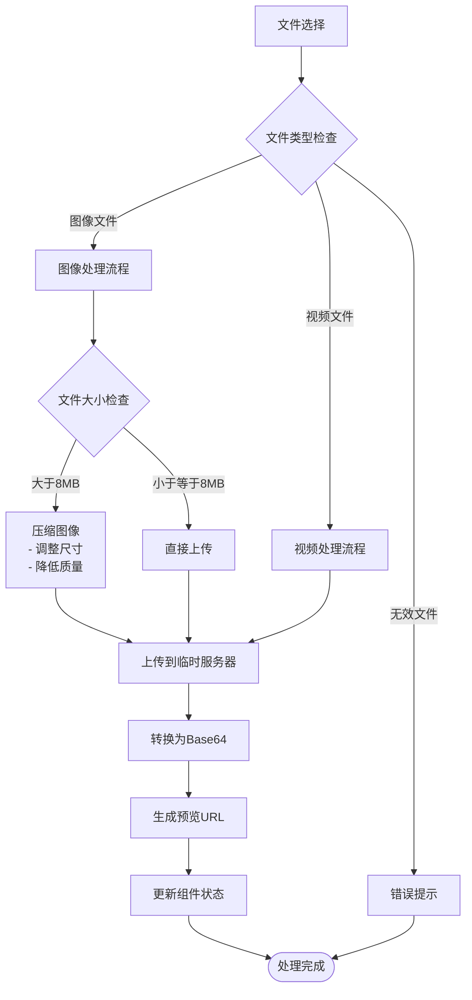

**图表来源**
- [VideoEditor.jsx](file://src/components/VideoEditor.jsx#L22-L96)
- [fileUpload.js](file://src/utils/fileUpload.js#L6-L30)

**章节来源**
- [VideoEditor.jsx](file://src/components/VideoEditor.jsx#L1-L585)

### ImageEditor 组件深度分析

#### 模型适配机制

ImageEditor通过模型配置系统实现动态功能适配：

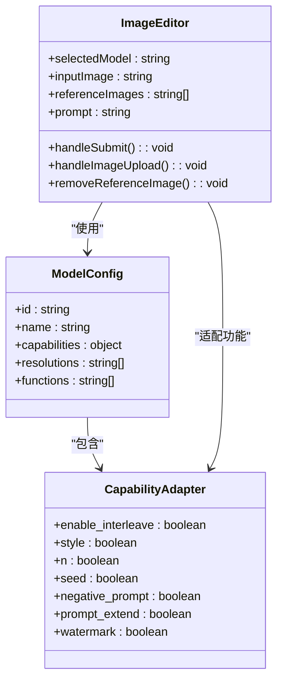

**图表来源**
- [ImageEditor.jsx](file://src/components/ImageEditor.jsx#L15-L54)
- [models.js](file://src/config/models.js#L264-L788)

#### 参数动态生成

组件根据所选模型的能力动态生成相应的参数输入：

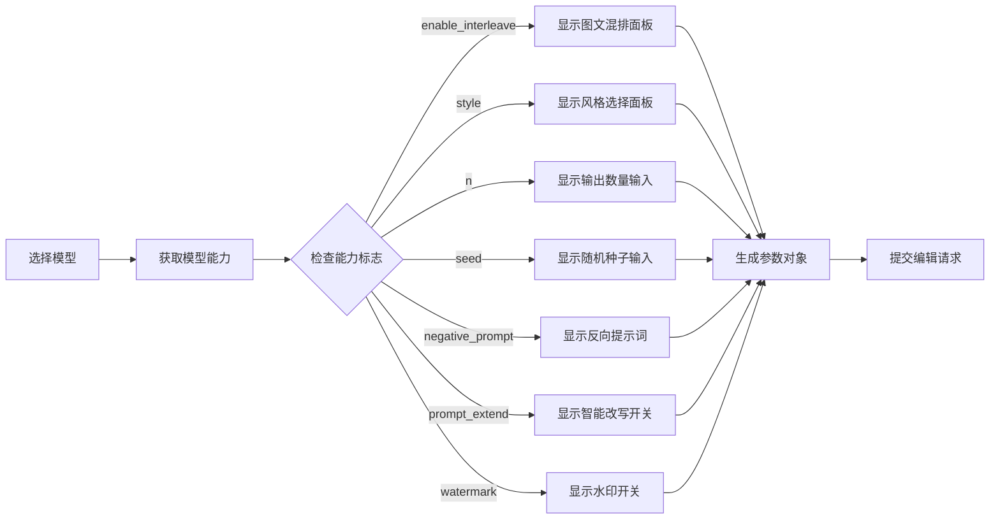

**图表来源**
- [ImageEditor.jsx](file://src/components/ImageEditor.jsx#L171-L230)
- [models.js](file://src/config/models.js#L264-L788)

#### 预览系统设计

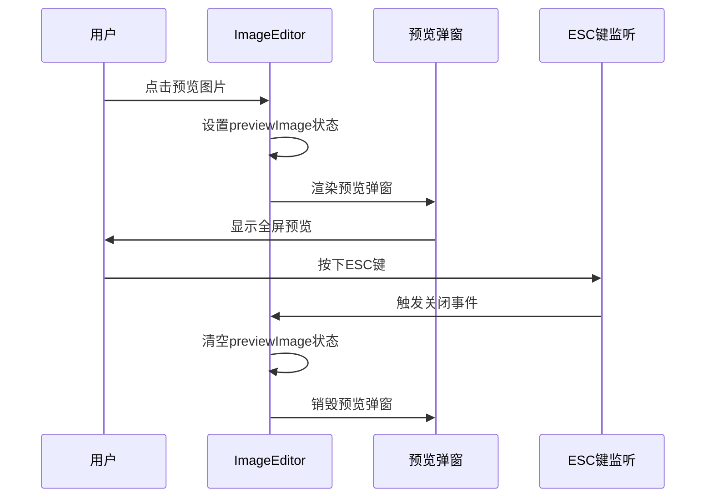

**图表来源**
- [ImageEditor.jsx](file://src/components/ImageEditor.jsx#L71-L80)
- [ImageEditor.jsx](file://src/components/ImageEditor.jsx#L945-L967)

**章节来源**
- [ImageEditor.jsx](file://src/components/ImageEditor.jsx#L1-L973)

## 依赖关系分析

### 组件间依赖关系

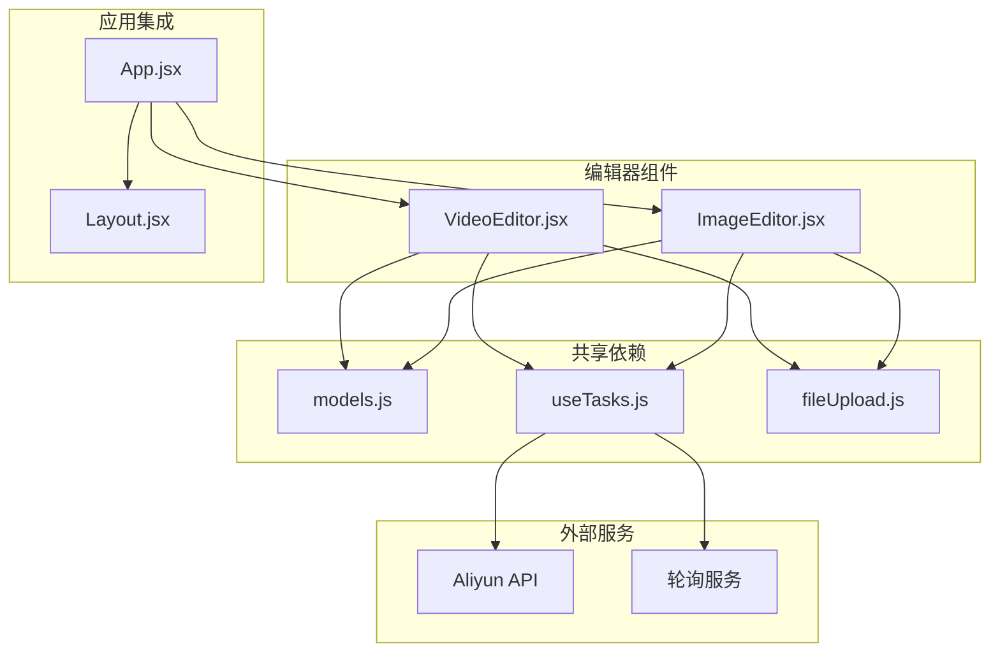

**图表来源**
- [App.jsx](file://src/App.jsx#L9-L10)
- [VideoEditor.jsx](file://src/components/VideoEditor.jsx#L3-L4)
- [ImageEditor.jsx](file://src/components/ImageEditor.jsx#L3-L4)

### 状态管理策略

编辑器组件采用分层状态管理策略：

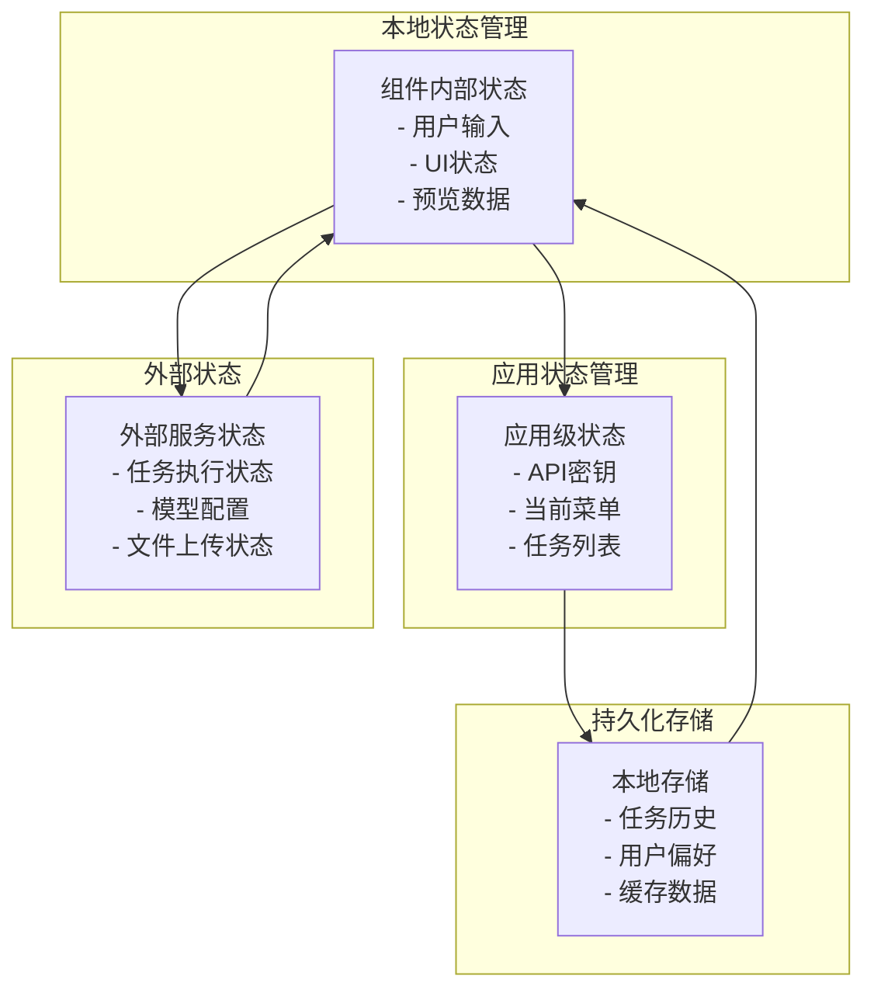

**图表来源**
- [useTasks.js](file://src/hooks/useTasks.js#L9-L84)
- [App.jsx](file://src/App.jsx#L42-L70)

**章节来源**
- [VideoEditor.jsx](file://src/components/VideoEditor.jsx#L1-L50)
- [ImageEditor.jsx](file://src/components/ImageEditor.jsx#L1-L50)
- [useTasks.js](file://src/hooks/useTasks.js#L1-L333)

## 性能考虑

### 文件处理优化

编辑器组件实现了多项性能优化措施：

#### 图像压缩策略
- **自动压缩检测**：文件大小超过8MB时自动压缩
- **智能尺寸调整**：最大宽度和高度限制为2048像素
- **质量平衡**：默认压缩质量0.8，在质量和文件大小间取得平衡

#### 内存管理
- **Base64数据清理**：任务完成后自动清理Base64数据
- **预览URL管理**：使用URL.createObjectURL创建临时URL
- **状态清理**：组件卸载时清理所有临时数据

#### 轮询优化
- **自适应轮询间隔**：根据任务状态动态调整轮询频率
- **批量状态检查**：一次轮询检查多个任务状态
- **智能停止条件**：无活跃任务时自动停止轮询

**章节来源**
- [fileUpload.js](file://src/utils/fileUpload.js#L6-L87)
- [useTasks.js](file://src/hooks/useTasks.js#L86-L161)

### 大文件处理策略

针对大文件上传，编辑器组件采用了多层次的处理策略：

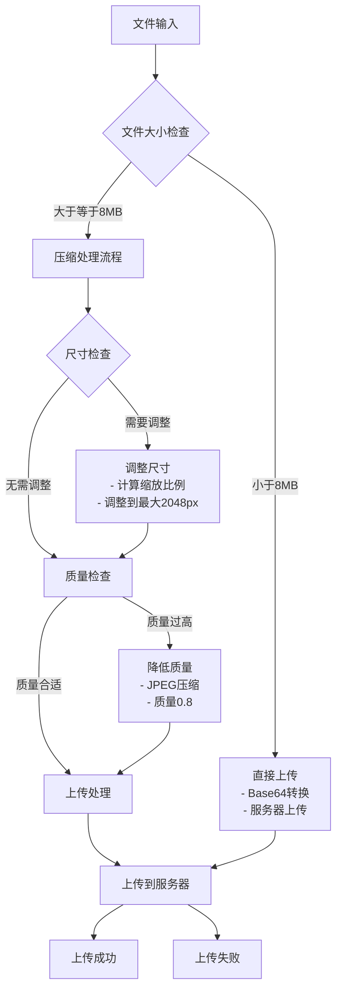

**图表来源**
- [fileUpload.js](file://src/utils/fileUpload.js#L6-L18)
- [fileUpload.js](file://src/utils/fileUpload.js#L40-L87)

**章节来源**
- [fileUpload.js](file://src/utils/fileUpload.js#L1-L182)

## 故障排除指南

### 常见问题及解决方案

#### API密钥相关问题
- **问题**：无法创建编辑任务
- **原因**：API密钥未配置或无效
- **解决方案**：通过设置面板配置有效的API密钥

#### 文件上传问题
- **问题**：图像上传失败
- **原因**：文件格式不支持或文件过大
- **解决方案**：检查文件格式（支持JPG、PNG、GIF等），文件大小不超过8MB

#### 任务执行问题
- **问题**：任务长时间处于RUNNING状态
- **原因**：网络延迟或服务器负载
- **解决方案**：等待轮询完成，或手动刷新页面查看最新状态

#### 内存问题
- **问题**：页面卡顿或内存占用过高
- **原因**：大量Base64数据导致内存压力
- **解决方案**：及时清理不需要的预览数据，避免同时打开多个预览窗口

**章节来源**
- [useTasks.js](file://src/hooks/useTasks.js#L256-L312)
- [fileUpload.js](file://src/utils/fileUpload.js#L149-L167)

### 调试技巧

#### 开发者工具使用
- **React DevTools**：监控组件状态变化
- **Network面板**：查看文件上传和API请求
- **Application面板**：检查localStorage存储情况
- **Console面板**：查看错误日志和调试信息

#### 日志记录
组件在关键操作点添加了详细的日志记录：
- 任务创建和状态更新
- 文件上传过程
- 错误处理和异常情况
- 性能指标监控

**章节来源**
- [useTasks.js](file://src/hooks/useTasks.js#L179-L246)

## 结论

通义万相编辑器组件展现了现代前端应用的最佳实践：

### 技术优势
- **模块化设计**：清晰的组件分离和职责划分
- **状态管理**：合理的状态层次和生命周期管理
- **性能优化**：多层优化策略确保流畅体验
- **用户体验**：直观的界面设计和完善的反馈机制

### 扩展性特点
- **配置驱动**：通过模型配置实现功能动态适配
- **插件化架构**：易于添加新的编辑功能和模型支持
- **工具函数复用**：通用的文件处理和验证工具

### 改进建议
- **撤销重做功能**：可以考虑添加编辑历史管理
- **批量处理**：支持多文件批量编辑
- **云端同步**：实现跨设备的编辑状态同步

编辑器组件为通义万相应用提供了强大的AI编辑能力，通过精心设计的架构和优化策略，为用户提供了高效、稳定的编辑体验。

## 附录

### API接口定义

#### 编辑器组件接口

| 接口 | 参数 | 返回值 | 描述 |
|------|------|--------|------|
| onGenerate | taskData: object, type: string | Promise<void> | 发送编辑任务到后端 |
| isGenerating | boolean | boolean | 编辑状态指示器 |

#### 任务管理接口

| 接口 | 参数 | 返回值 | 描述 |
|------|------|--------|------|
| runTask | params: object, type: string | Promise<void> | 创建新任务 |
| retryTask | task: object | Promise<void> | 重试失败任务 |
| deleteTask | taskId: string | void | 删除任务 |
| updateTask | taskId: string, updates: object | void | 更新任务状态 |

### 配置选项

#### 模型配置选项

| 配置项 | 类型 | 默认值 | 描述 |
|--------|------|--------|------|
| model | string | 'wanx2.1-vace-plus' | 选择使用的AI模型 |
| input | object | {} | 编辑输入参数 |
| parameters | object | {} | 编辑参数配置 |
| size | string | '1280*720' | 输出分辨率 |
| duration | number | 5 | 视频时长（秒） |
| prompt_extend | boolean | true | 启用智能改写 |
| watermark | boolean | false | 添加水印 |

### 最佳实践

#### 开发建议
- **状态管理**：合理划分组件状态，避免过度耦合
- **错误处理**：完善错误边界和用户友好的错误提示
- **性能监控**：定期检查内存使用和渲染性能
- **测试覆盖**：为关键功能编写单元测试和集成测试

#### 用户体验优化
- **加载状态**：为长时间操作提供明确的进度指示
- **撤销机制**：考虑添加撤销/重做功能
- **批量操作**：支持多文件批量处理
- **离线支持**：考虑添加离线编辑能力