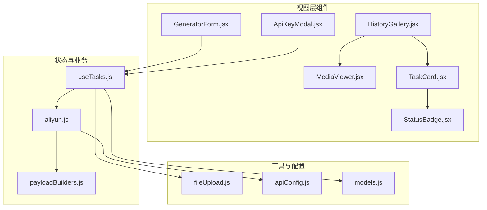
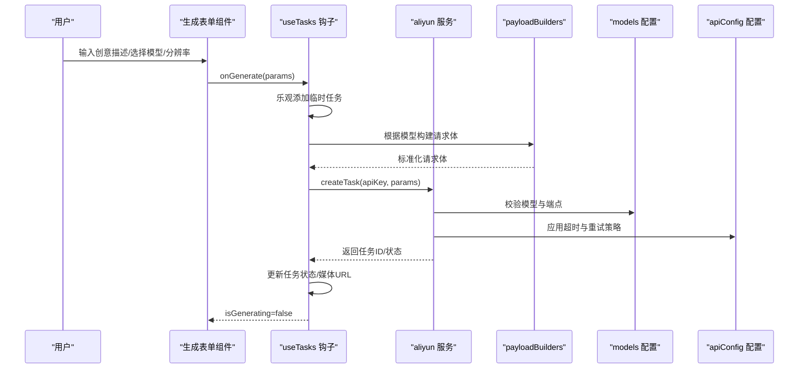
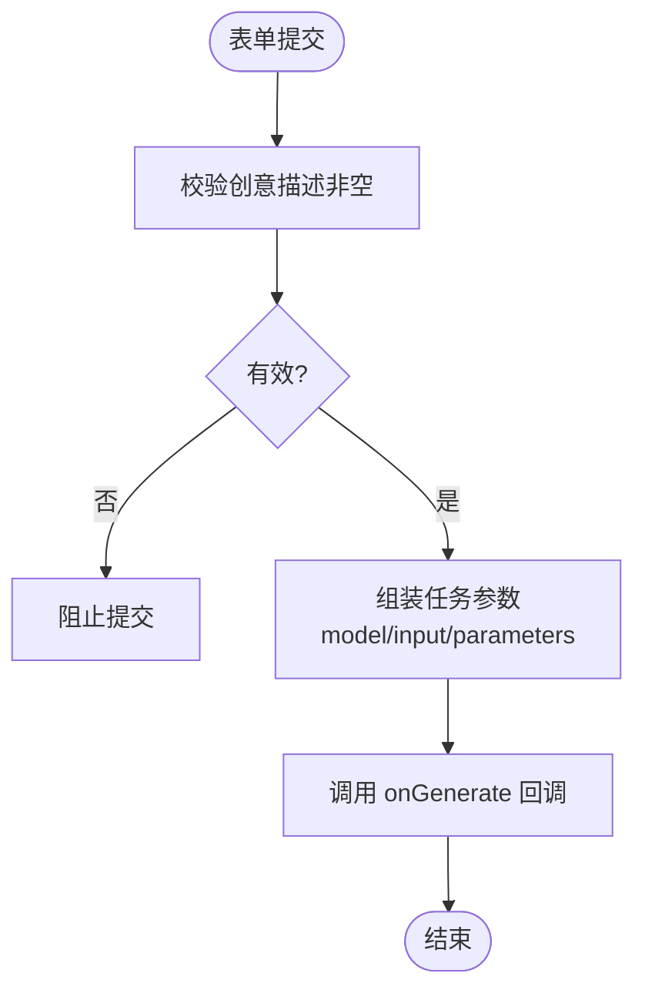
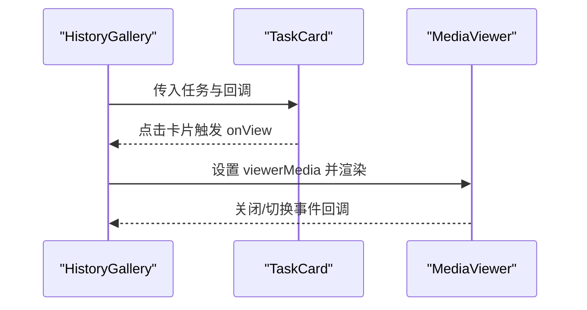
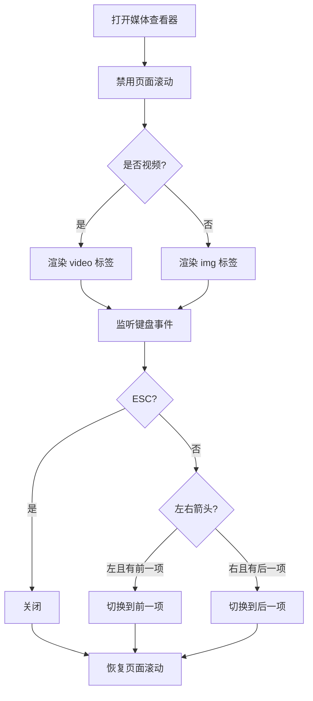
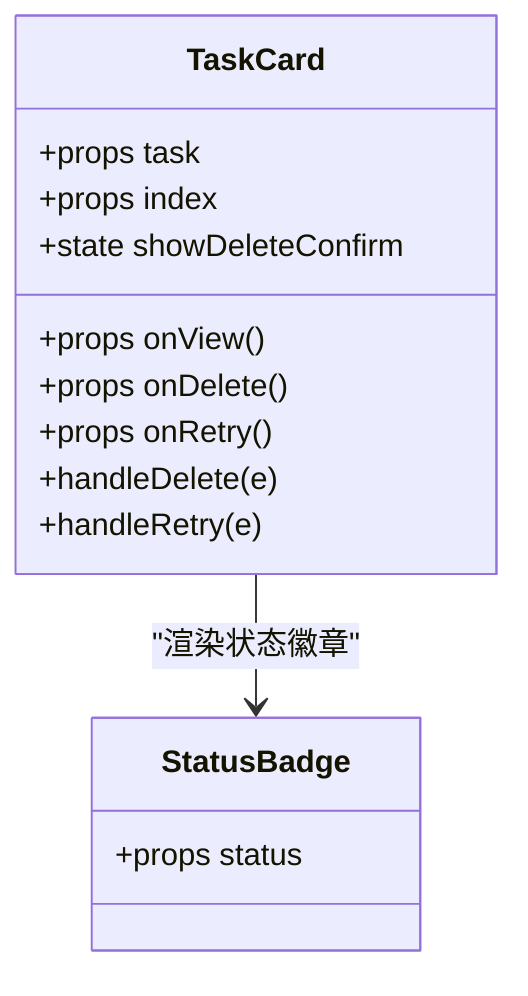
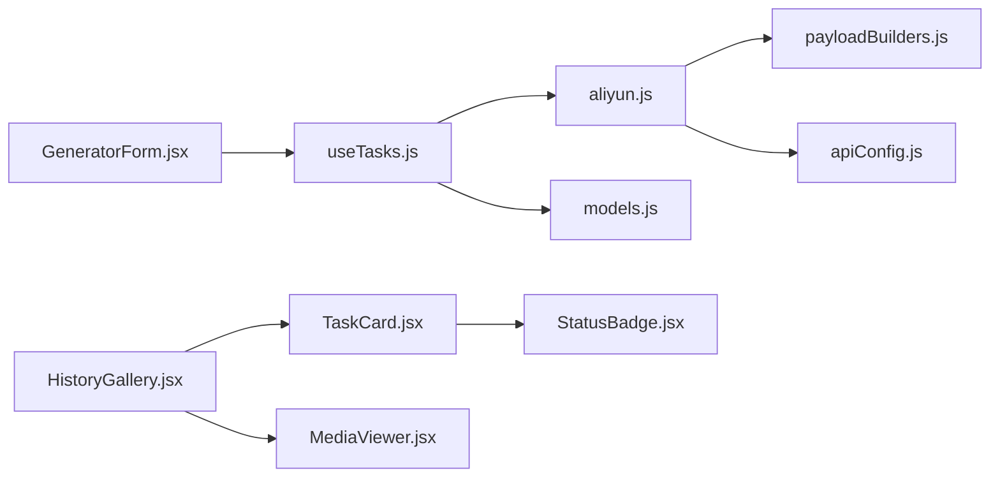

# 辅助组件

<cite>
**本文引用的文件**
- [src/components/GeneratorForm.jsx](file://src/components/GeneratorForm.jsx)
- [src/components/HistoryGallery.jsx](file://src/components/HistoryGallery.jsx)
- [src/components/MediaViewer.jsx](file://src/components/MediaViewer.jsx)
- [src/components/TaskCard.jsx](file://src/components/TaskCard.jsx)
- [src/components/StatusBadge.jsx](file://src/components/StatusBadge.jsx)
- [src/components/ApiKeyModal.jsx](file://src/components/ApiKeyModal.jsx)
- [src/hooks/useTasks.js](file://src/hooks/useTasks.js)
- [src/services/aliyun.js](file://src/services/aliyun.js)
- [src/services/payloadBuilders.js](file://src/services/payloadBuilders.js)
- [src/utils/fileUpload.js](file://src/utils/fileUpload.js)
- [src/config/apiConfig.js](file://src/config/apiConfig.js)
- [src/config/models.js](file://src/config/models.js)
</cite>

## 目录
1. [简介](#简介)
2. [项目结构](#项目结构)
3. [核心组件](#核心组件)
4. [架构总览](#架构总览)
5. [详细组件分析](#详细组件分析)
6. [依赖关系分析](#依赖关系分析)
7. [性能考量](#性能考量)
8. [故障排查指南](#故障排查指南)
9. [结论](#结论)
10. [附录](#附录)

## 简介
本文件面向通义万相前端应用中的辅助组件，围绕以下组件提供系统化技术文档：
- 生成表单组件：负责接收用户输入、模型与分辨率选择，并将参数传递给任务执行流程。
- 历史记录展示组件：负责渲染任务历史、分页浏览与全屏预览。
- 媒体查看器组件：负责图片/视频的预览、缩放控制与全屏显示。
- 任务卡片组件：负责单条任务的展示、状态更新与交互反馈。
- 状态徽章组件：负责任务状态的颜色编码与图标展示。
- API 密钥设置模态框：负责密钥输入、表单验证与本地安全存储。

同时，文档将给出这些组件的复用方法与定制化开发建议，帮助开发者高效集成与扩展。

## 项目结构
辅助组件位于 src/components 目录下，配合 hooks、services、utils、config 等模块共同工作，形成“视图层组件 + 数据与状态钩子 + 业务服务 + 工具与配置”的分层架构。

图表来源
- [src/components/GeneratorForm.jsx](file://src/components/GeneratorForm.jsx#L1-L208)
- [src/components/HistoryGallery.jsx](file://src/components/HistoryGallery.jsx#L1-L68)
- [src/components/MediaViewer.jsx](file://src/components/MediaViewer.jsx#L1-L125)
- [src/components/TaskCard.jsx](file://src/components/TaskCard.jsx#L1-L182)
- [src/components/StatusBadge.jsx](file://src/components/StatusBadge.jsx#L1-L58)
- [src/components/ApiKeyModal.jsx](file://src/components/ApiKeyModal.jsx#L1-L111)
- [src/hooks/useTasks.js](file://src/hooks/useTasks.js#L1-L333)
- [src/services/aliyun.js](file://src/services/aliyun.js#L1-L215)
- [src/services/payloadBuilders.js](file://src/services/payloadBuilders.js#L1-L829)
- [src/utils/fileUpload.js](file://src/utils/fileUpload.js#L1-L182)
- [src/config/apiConfig.js](file://src/config/apiConfig.js#L1-L35)
- [src/config/models.js](file://src/config/models.js#L1-L1012)

章节来源
- [src/components/GeneratorForm.jsx](file://src/components/GeneratorForm.jsx#L1-L208)
- [src/components/HistoryGallery.jsx](file://src/components/HistoryGallery.jsx#L1-L68)
- [src/components/MediaViewer.jsx](file://src/components/MediaViewer.jsx#L1-L125)
- [src/components/TaskCard.jsx](file://src/components/TaskCard.jsx#L1-L182)
- [src/components/StatusBadge.jsx](file://src/components/StatusBadge.jsx#L1-L58)
- [src/components/ApiKeyModal.jsx](file://src/components/ApiKeyModal.jsx#L1-L111)
- [src/hooks/useTasks.js](file://src/hooks/useTasks.js#L1-L333)
- [src/services/aliyun.js](file://src/services/aliyun.js#L1-L215)
- [src/services/payloadBuilders.js](file://src/services/payloadBuilders.js#L1-L829)
- [src/utils/fileUpload.js](file://src/utils/fileUpload.js#L1-L182)
- [src/config/apiConfig.js](file://src/config/apiConfig.js#L1-L35)
- [src/config/models.js](file://src/config/models.js#L1-L1012)

## 核心组件
- 生成表单组件：提供创意描述输入、模型选择、分辨率选择与生成按钮，负责表单校验与参数打包。
- 历史记录展示组件：网格渲染任务列表，支持点击卡片进入全屏媒体查看器。
- 媒体查看器组件：全屏弹层，支持键盘与按钮切换、下载与新标签打开、禁用页面滚动。
- 任务卡片组件：展示预览、状态徽章、操作按钮（重试、全屏、下载、删除），支持删除二次确认。
- 状态徽章组件：统一状态样式与图标，支持多种状态的颜色与文案映射。
- API 密钥设置模态框：密码输入、表单验证、本地存储与外部引导链接。

章节来源
- [src/components/GeneratorForm.jsx](file://src/components/GeneratorForm.jsx#L1-L208)
- [src/components/HistoryGallery.jsx](file://src/components/HistoryGallery.jsx#L1-L68)
- [src/components/MediaViewer.jsx](file://src/components/MediaViewer.jsx#L1-L125)
- [src/components/TaskCard.jsx](file://src/components/TaskCard.jsx#L1-L182)
- [src/components/StatusBadge.jsx](file://src/components/StatusBadge.jsx#L1-L58)
- [src/components/ApiKeyModal.jsx](file://src/components/ApiKeyModal.jsx#L1-L111)

## 架构总览
辅助组件与任务执行链路如下：
- 视图层组件通过 props 接收回调（如 onGenerate、onDelete、onRetry），并将用户输入与选择封装为任务参数。
- useTasks 钩子负责本地任务状态管理、乐观创建、批量轮询与持久化。
- aliyn 服务封装了创建任务、轮询状态、批量查询与超时/重试策略。
- payloadBuilders 将不同模型的输入参数标准化为 API 请求体。
- models 与 apiConfig 提供模型能力、端点、超时与轮询配置。

图表来源
- [src/components/GeneratorForm.jsx](file://src/components/GeneratorForm.jsx#L66-L80)
- [src/hooks/useTasks.js](file://src/hooks/useTasks.js#L256-L312)
- [src/services/aliyun.js](file://src/services/aliyun.js#L50-L160)
- [src/services/payloadBuilders.js](file://src/services/payloadBuilders.js#L1-L829)
- [src/config/models.js](file://src/config/models.js#L1-L1012)
- [src/config/apiConfig.js](file://src/config/apiConfig.js#L1-L35)

## 详细组件分析

### 生成表单组件（GeneratorForm.jsx）
- 表单设计
  - 文本域用于创意描述，支持字符计数与聚焦态样式。
  - 模型选择：根据模型定义数组渲染按钮，选中态带边框与阴影。
  - 分辨率选择：根据当前模型支持的分辨率动态渲染，支持横屏/竖屏图标与默认值。
  - 生成按钮：禁用条件包括“正在生成”与“描述为空”，提交时进行非空校验。
- 字段验证与数据绑定
  - prompt 非空校验：阻止空描述提交。
  - 模型变更时自动校正分辨率：若当前分辨率不在新模型支持范围内，则回退到该模型默认分辨率。
  - 参数打包：将 model、input.prompt、parameters.size/n 等组装为标准任务参数。
- 交互反馈
  - 生成按钮在生成中显示加载动画与禁用态。
  - 输入框聚焦态带渐变背景与高亮边框，提升可用性。

图表来源
- [src/components/GeneratorForm.jsx](file://src/components/GeneratorForm.jsx#L66-L80)
- [src/components/GeneratorForm.jsx](file://src/components/GeneratorForm.jsx#L55-L61)

章节来源
- [src/components/GeneratorForm.jsx](file://src/components/GeneratorForm.jsx#L1-L208)

### 历史记录展示组件（HistoryGallery.jsx）
- 数据获取与渲染
  - 接收任务数组，按最新优先顺序渲染网格卡片。
  - 当任务为空时，展示占位提示与引导图标。
- 列表渲染与分页加载策略
  - 使用 CSS Grid 实现响应式列数（2-5列）。
  - 通过 TaskCard 的 onView/onDelete/onRetry 回调与父组件共享交互。
- 全屏媒体查看器
  - 通过 MediaViewer 在 portal 中渲染，支持键盘与按钮切换前后媒体项。
  - 通过 hasPrev/hasNext 控制切换按钮显隐。

图表来源
- [src/components/HistoryGallery.jsx](file://src/components/HistoryGallery.jsx#L6-L67)
- [src/components/TaskCard.jsx](file://src/components/TaskCard.jsx#L9-L182)
- [src/components/MediaViewer.jsx](file://src/components/MediaViewer.jsx#L5-L125)

章节来源
- [src/components/HistoryGallery.jsx](file://src/components/HistoryGallery.jsx#L1-L68)

### 媒体查看器组件（MediaViewer.jsx）
- 功能特性
  - 全屏弹层：使用 createPortal 直接挂载到 document.body，避免层级与定位问题。
  - 键盘控制：ESC 关闭；左右箭头在可切换条件下切换媒体。
  - 页面滚动控制：打开时禁用 body 滚动，关闭时恢复。
  - 媒体类型适配：根据是否存在 videoUrl 决定渲染 video 或 img。
  - 操作栏：支持下载、新标签打开与显示模型名。
- 交互与状态
  - 通过 props 接收媒体对象、关闭回调、前后切换回调与可用状态。
  - 点击遮罩层关闭，按钮点击通过事件冒泡阻止传播。

图表来源
- [src/components/MediaViewer.jsx](file://src/components/MediaViewer.jsx#L6-L27)
- [src/components/MediaViewer.jsx](file://src/components/MediaViewer.jsx#L32-L85)
- [src/components/MediaViewer.jsx](file://src/components/MediaViewer.jsx#L87-L121)

章节来源
- [src/components/MediaViewer.jsx](file://src/components/MediaViewer.jsx#L1-L125)

### 任务卡片组件（TaskCard.jsx）
- 信息展示
  - 预览区域：视频封面或图片缩略图，悬停显示播放覆盖层或渐变遮罩。
  - 状态徽章：绝对定位显示状态标识。
  - 卡片底部：展示描述与模型、创建时间。
- 状态更新与交互反馈
  - 删除：二次确认（3秒自动取消），确认后触发 onDelete。
  - 重试：根据状态与 originalParams 决定是否可重试，触发 onRetry。
  - 下载与全屏：支持直接下载与进入 MediaViewer。
- 动画与视觉
  - 悬停放大与边框高亮，加载态使用旋转动画与进度条。

图表来源
- [src/components/TaskCard.jsx](file://src/components/TaskCard.jsx#L9-L182)
- [src/components/StatusBadge.jsx](file://src/components/StatusBadge.jsx#L8-L58)

章节来源
- [src/components/TaskCard.jsx](file://src/components/TaskCard.jsx#L1-L182)

### 状态徽章组件（StatusBadge.jsx）
- 设计要点
  - 统一状态映射：PENDING/RUNNING/SUCCEEDED/FAILED/UNKNOWN 对应不同颜色、边框与图标。
  - 文案与图标：根据状态返回对应标签与动画图标。
- 复用建议
  - 作为任务状态展示的唯一入口，避免在其他组件重复定义样式。

章节来源
- [src/components/StatusBadge.jsx](file://src/components/StatusBadge.jsx#L1-L58)

### API 密钥设置模态框（ApiKeyModal.jsx）
- 表单验证
  - 打开时从 props 初始化密钥；提交时禁止空值。
- 安全存储与用户引导
  - 密钥仅本地存储，不上传至服务器；提供外部控制台链接引导获取密钥。
- 交互反馈
  - 关闭按钮、提交按钮与占位提示均具备视觉反馈与禁用态处理。

章节来源
- [src/components/ApiKeyModal.jsx](file://src/components/ApiKeyModal.jsx#L1-L111)

## 依赖关系分析
- 组件间依赖
  - HistoryGallery 依赖 TaskCard 与 MediaViewer。
  - TaskCard 依赖 StatusBadge。
  - GeneratorForm 通过回调与 useTasks 钩子协作。
- 钩子与服务
  - useTasks 负责任务生命周期管理、轮询与本地持久化。
  - aliyn 封装创建任务、轮询与错误处理。
  - payloadBuilders 将模型参数标准化为 API 请求体。
  - models 与 apiConfig 提供模型能力与配置。

图表来源
- [src/components/GeneratorForm.jsx](file://src/components/GeneratorForm.jsx#L4-L80)
- [src/components/HistoryGallery.jsx](file://src/components/HistoryGallery.jsx#L3-L62)
- [src/components/TaskCard.jsx](file://src/components/TaskCard.jsx#L2-L102)
- [src/components/StatusBadge.jsx](file://src/components/StatusBadge.jsx#L8-L58)
- [src/hooks/useTasks.js](file://src/hooks/useTasks.js#L1-L333)
- [src/services/aliyun.js](file://src/services/aliyun.js#L1-L215)
- [src/services/payloadBuilders.js](file://src/services/payloadBuilders.js#L804-L829)
- [src/config/models.js](file://src/config/models.js#L1-L1012)
- [src/config/apiConfig.js](file://src/config/apiConfig.js#L1-L35)

章节来源
- [src/hooks/useTasks.js](file://src/hooks/useTasks.js#L1-L333)
- [src/services/aliyun.js](file://src/services/aliyun.js#L1-L215)
- [src/services/payloadBuilders.js](file://src/services/payloadBuilders.js#L1-L829)
- [src/config/models.js](file://src/config/models.js#L1-L1012)
- [src/config/apiConfig.js](file://src/config/apiConfig.js#L1-L35)

## 性能考量
- 本地存储与体积控制
  - useTasks 在保存任务时清理 base64 数据，避免占用过多空间；当超出配额时保留最近 20 条。
- 轮询策略
  - 自适应轮询：新任务使用更短间隔，稳定后逐步延长，减少无效请求。
  - 批量轮询：一次性查询多个任务状态，降低并发压力。
- 媒体资源
  - MediaViewer 使用 portal 渲染，避免 DOM 层级嵌套导致的重排。
  - 图片/视频懒加载：TaskCard 预览采用缩略图与悬停放大，减少初始渲染负担。
- 文件上传
  - fileUpload 对大图进行压缩与 base64 转换，避免超大文件影响传输与内存。

章节来源
- [src/hooks/useTasks.js](file://src/hooks/useTasks.js#L30-L84)
- [src/hooks/useTasks.js](file://src/hooks/useTasks.js#L86-L104)
- [src/hooks/useTasks.js](file://src/hooks/useTasks.js#L106-L161)
- [src/components/MediaViewer.jsx](file://src/components/MediaViewer.jsx#L36-L121)
- [src/utils/fileUpload.js](file://src/utils/fileUpload.js#L6-L18)

## 故障排查指南
- 生成按钮不可用
  - 检查 isGenerating 与 prompt 是否为空；确认 onGenerate 回调正确传递。
- 媒体无法预览
  - 确认 media 对象包含 videoUrl 或 imgUrl；检查 MediaViewer 的 hasPrev/hasNext 与 currentIndex。
- 状态不更新
  - 检查 useTasks 的轮询是否启动；确认 aliyn 返回的 task_status 与媒体 URL 是否一致。
- 密钥相关问题
  - 确认密钥已保存且未为空；检查 aliyn 的错误响应与超时设置。
- 本地存储异常
  - 当出现配额不足时，useTasks 会自动保留最近 20 条任务；检查 STORAGE_KEY 与 LEGACY_KEY 的兼容逻辑。

章节来源
- [src/components/GeneratorForm.jsx](file://src/components/GeneratorForm.jsx#L172-L196)
- [src/components/MediaViewer.jsx](file://src/components/MediaViewer.jsx#L32-L85)
- [src/hooks/useTasks.js](file://src/hooks/useTasks.js#L164-L246)
- [src/services/aliyun.js](file://src/services/aliyun.js#L146-L160)
- [src/config/apiConfig.js](file://src/config/apiConfig.js#L29-L35)

## 结论
上述辅助组件通过清晰的职责划分与稳定的依赖关系，实现了从表单输入到任务执行、状态轮询与结果展示的完整闭环。组件具备良好的可复用性与可扩展性，适合在多模型、多任务场景下进行定制化开发。

## 附录
- 复用方法
  - 将表单参数标准化为任务参数，复用 useTasks 的 runTask/retryTask/deleteTask。
  - 使用 StatusBadge 统一状态展示，避免重复样式代码。
  - 使用 MediaViewer 作为全屏预览容器，统一键盘与按钮交互。
- 定制化开发建议
  - 新增模型时，只需在 models.js 中新增配置并在 payloadBuilders.js 中补充对应构建器。
  - 若需扩展表单字段，可在 GeneratorForm.jsx 中添加输入项并更新参数打包逻辑。
  - 若需引入更多媒体类型，可在 MediaViewer.jsx 中扩展渲染分支。
  - 若需调整轮询策略，可在 useTasks.js 中优化 getAdaptiveInterval 与 POLLING 配置。