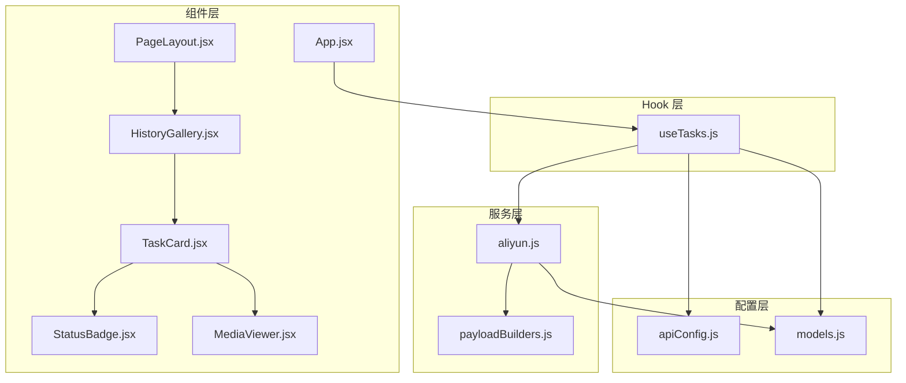
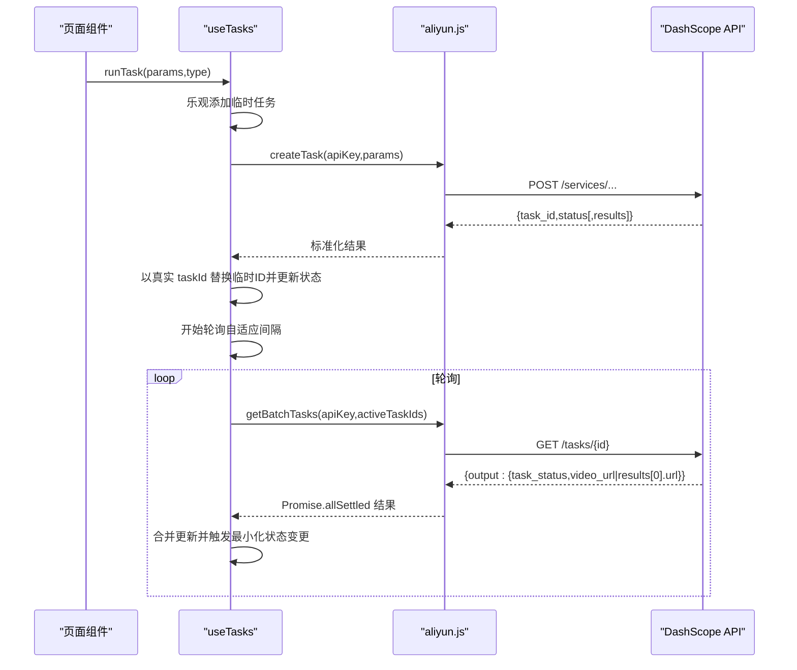
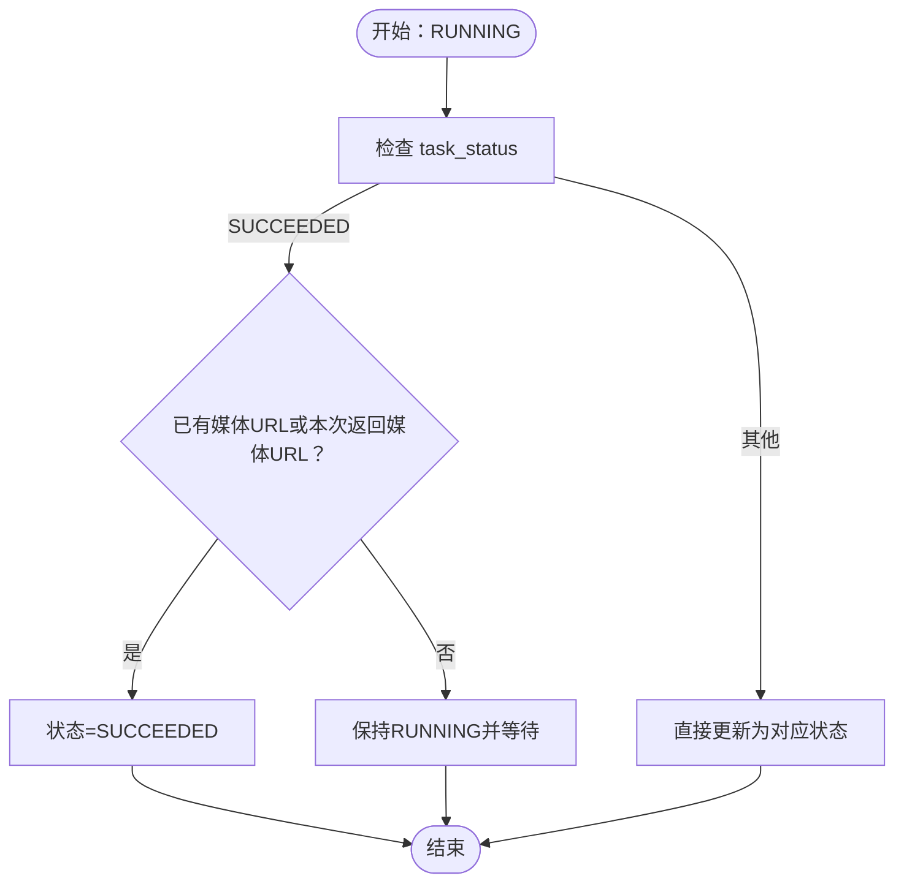
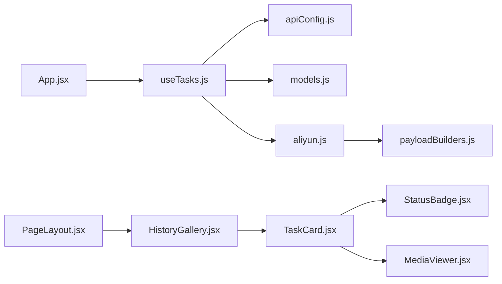

# 状态管理

<cite>
**本文引用的文件列表**
- [useTasks.js](file://src/hooks/useTasks.js)
- [aliyun.js](file://src/services/aliyun.js)
- [apiConfig.js](file://src/config/apiConfig.js)
- [models.js](file://src/config/models.js)
- [payloadBuilders.js](file://src/services/payloadBuilders.js)
- [App.jsx](file://src/App.jsx)
- [PageLayout.jsx](file://src/components/PageLayout.jsx)
- [HistoryGallery.jsx](file://src/components/HistoryGallery.jsx)
- [TaskCard.jsx](file://src/components/TaskCard.jsx)
- [StatusBadge.jsx](file://src/components/StatusBadge.jsx)
- [MediaViewer.jsx](file://src/components/MediaViewer.jsx)
- [fileUpload.js](file://src/utils/fileUpload.js)
</cite>

## 目录
1. [简介](#简介)
2. [项目结构](#项目结构)
3. [核心组件](#核心组件)
4. [架构总览](#架构总览)
5. [详细组件分析](#详细组件分析)
6. [依赖关系分析](#依赖关系分析)
7. [性能考量](#性能考量)
8. [故障排查指南](#故障排查指南)
9. [结论](#结论)
10. [附录](#附录)

## 简介
本文件面向通义万相前端应用的状态管理系统，重点围绕自定义 Hook useTasks 的实现进行系统性解析。内容涵盖：
- 任务生命周期管理：从创建、轮询、状态变更到完成/失败的完整流程
- 异步状态更新与轮询机制：自适应轮询策略、批量状态查询与最小化更新
- 任务状态数据结构、状态转换规则与错误处理策略
- 本地存储实现：任务历史的持久化与迁移兼容
- 最佳实践：性能优化、内存管理、调试技巧与扩展建议

## 项目结构
本项目采用“配置驱动 + 服务层 + Hook 状态 + 组件展示”的分层架构：
- 配置层：API 常量、轮询策略、模型注册与请求体构造策略
- 服务层：统一的创建任务、轮询与批量查询接口
- Hook 层：useTasks 将状态、轮询、持久化与错误处理封装为可复用能力
- 组件层：页面布局、历史画廊、任务卡片、状态徽章、媒体查看器等

图表来源
- [useTasks.js](file://src/hooks/useTasks.js#L1-L333)
- [aliyun.js](file://src/services/aliyun.js#L1-L215)
- [apiConfig.js](file://src/config/apiConfig.js#L1-L35)
- [models.js](file://src/config/models.js#L1-L1012)
- [payloadBuilders.js](file://src/services/payloadBuilders.js#L1-L829)
- [App.jsx](file://src/App.jsx#L1-L377)
- [PageLayout.jsx](file://src/components/PageLayout.jsx#L1-L76)
- [HistoryGallery.jsx](file://src/components/HistoryGallery.jsx#L1-L68)
- [TaskCard.jsx](file://src/components/TaskCard.jsx#L1-L182)
- [StatusBadge.jsx](file://src/components/StatusBadge.jsx#L1-L58)
- [MediaViewer.jsx](file://src/components/MediaViewer.jsx#L1-L125)

章节来源
- [useTasks.js](file://src/hooks/useTasks.js#L1-L333)
- [App.jsx](file://src/App.jsx#L1-L377)

## 核心组件
- useTasks Hook：负责任务状态的集中管理、本地持久化、自适应轮询、乐观更新、重试与删除等
- 任务状态数据结构：包含任务 ID、类型、提示词、模型、状态、创建时间、媒体 URL、原始参数等
- 服务层：统一的创建任务、轮询与批量查询接口，内置超时与重试策略
- 组件层：历史画廊、任务卡片、状态徽章、媒体查看器等，负责 UI 呈现与交互

章节来源
- [useTasks.js](file://src/hooks/useTasks.js#L9-L332)
- [aliyun.js](file://src/services/aliyun.js#L50-L214)
- [StatusBadge.jsx](file://src/components/StatusBadge.jsx#L8-L45)

## 架构总览
useTasks 将任务状态与生命周期管理集中在 Hook 中，通过以下关键路径工作：
- 创建任务：乐观添加临时任务，随后以真实任务 ID 更新；同步模型可直接返回结果
- 轮询机制：根据任务年龄与状态变化动态调整轮询间隔，批量查询活跃任务
- 状态更新：仅在有实际变化时触发更新，避免不必要的渲染
- 本地持久化：任务列表持久化至 localStorage，清理 base64 数据以节省空间，容量不足时保留最近 20 条
- 错误处理：API 调用超时、网络错误、未知模型等错误分类处理，失败任务可重试

图表来源
- [useTasks.js](file://src/hooks/useTasks.js#L256-L312)
- [aliyun.js](file://src/services/aliyun.js#L50-L214)

章节来源
- [useTasks.js](file://src/hooks/useTasks.js#L106-L161)
- [aliyun.js](file://src/services/aliyun.js#L162-L214)

## 详细组件分析

### useTasks Hook：任务生命周期与状态管理
- 任务状态数据结构
  - 字段：taskId、type、prompt、model、status、createdAt、imgUrl、videoUrl、posterUrl、originalParams
  - 类型：'image' | 'video' | 'i2v' | 'r2v' | 'video-edit'
  - 状态：'PENDING' | 'RUNNING' | 'SUCCEEDED' | 'FAILED' | 'CANCELED' | 'UNKNOWN'

- 生命周期管理
  - 创建阶段：乐观添加临时任务，随后以真实任务 ID 更新；同步模型直接填充结果
  - 轮询阶段：活跃任务集合由 Hook 计算，使用自适应轮询策略
  - 完成/失败：SUCCEEDED 需要媒体 URL 存在才更新；否则保持 RUNNING 并等待
  - 删除与重试：支持按 taskId 删除；失败或成功且有 originalParams 的任务可重试

- 自适应轮询策略
  - 新任务（创建后 10 秒内）：1 秒间隔
  - 前 10 次轮询：2 秒间隔
  - 长时间运行：最大 5 秒间隔
  - 状态变化时：减少轮询计数，加速收敛

- 本地持久化
  - 存储键：TASKS（v2），兼容 LEGACY_TASKS（旧键）
  - 清理策略：移除 originalParams 中的 base64 数据，避免占用空间
  - 容量限制：localStorage 溢出时保留最近 20 条

- 错误处理
  - API 超时：请求与轮询分别设置超时
  - 网络错误：统一提示“网络错误”
  - 未知模型/请求格式：抛出明确错误
  - 失败任务：状态置为 FAILED，支持重试

- 性能优化
  - useCallback 包装轮询函数，避免重复创建
  - 批量轮询：Promise.allSettled 并行查询
  - 最小化更新：仅在有实际变化时 setTasks
  - 依赖精简：轮询依赖 tasks.length，减少无效重渲染

章节来源
- [useTasks.js](file://src/hooks/useTasks.js#L9-L332)
- [apiConfig.js](file://src/config/apiConfig.js#L21-L34)

#### 状态转换规则与条件

图表来源
- [useTasks.js](file://src/hooks/useTasks.js#L210-L225)

### 服务层：创建任务与轮询
- createTask
  - 根据模型配置选择端点与请求格式
  - 使用 payloadBuilders 构造请求体
  - 支持异步/同步两种模式，标准化返回
  - 超时控制与错误分类处理

- getTask/getBatchTasks
  - 单任务轮询与批量轮询
  - 超时控制与网络错误处理
  - Promise.allSettled 返回聚合结果

章节来源
- [aliyun.js](file://src/services/aliyun.js#L50-L214)
- [payloadBuilders.js](file://src/services/payloadBuilders.js#L125-L150)

### 组件层：历史展示与交互
- PageLayout：固定生成表单在顶部，历史记录可折叠
- HistoryGallery：网格展示任务卡片，支持全屏媒体查看
- TaskCard：展示预览、状态徽章、操作按钮（重试、预览、下载、删除）
- StatusBadge：统一状态图标与文案
- MediaViewer：全屏媒体查看，支持键盘与鼠标交互

章节来源
- [PageLayout.jsx](file://src/components/PageLayout.jsx#L9-L75)
- [HistoryGallery.jsx](file://src/components/HistoryGallery.jsx#L6-L67)
- [TaskCard.jsx](file://src/components/TaskCard.jsx#L9-L181)
- [StatusBadge.jsx](file://src/components/StatusBadge.jsx#L8-L45)
- [MediaViewer.jsx](file://src/components/MediaViewer.jsx#L5-L124)

## 依赖关系分析
- useTasks 依赖
  - 配置：apiConfig（轮询间隔、超时、存储键）、models（模型能力）
  - 服务：aliyun（创建任务、轮询、批量查询）
  - 工具：payloadBuilders（请求体构造）
- 组件依赖
  - App.jsx 注入 apiKey，调用 useTasks 并传递给 PageLayout
  - PageLayout -> HistoryGallery -> TaskCard -> StatusBadge/MediaViewer

图表来源
- [useTasks.js](file://src/hooks/useTasks.js#L1-L4)
- [aliyun.js](file://src/services/aliyun.js#L1-L3)
- [models.js](file://src/config/models.js#L1-L1012)
- [payloadBuilders.js](file://src/services/payloadBuilders.js#L1-L829)
- [App.jsx](file://src/App.jsx#L24-L48)
- [PageLayout.jsx](file://src/components/PageLayout.jsx#L3-L3)
- [HistoryGallery.jsx](file://src/components/HistoryGallery.jsx#L1-L4)
- [TaskCard.jsx](file://src/components/TaskCard.jsx#L1-L3)
- [StatusBadge.jsx](file://src/components/StatusBadge.jsx#L1-L2)
- [MediaViewer.jsx](file://src/components/MediaViewer.jsx#L1-L3)

章节来源
- [useTasks.js](file://src/hooks/useTasks.js#L1-L4)
- [aliyun.js](file://src/services/aliyun.js#L1-L3)
- [App.jsx](file://src/App.jsx#L24-L48)

## 性能考量
- 轮询优化
  - 自适应间隔：新任务高频轮询，稳定任务降低频率
  - 批量查询：Promise.allSettled 并行轮询，减少总耗时
  - 状态变化加速：检测到更新时减少轮询计数，提高收敛速度
- 渲染优化
  - useCallback 缓存轮询函数，避免重复创建
  - useMemo 缓存过滤后的任务列表，减少子组件重渲染
  - 最小化更新：仅在有实际变化时 setTasks
- 存储优化
  - 清理 base64 数据，避免 localStorage 爆炸
  - 溢出保护：容量不足时保留最近 20 条
- 网络与超时
  - 请求与轮询分别设置超时，避免长时间阻塞
  - 重试策略：指数退避，避免雪崩效应

[本节为通用性能建议，无需特定文件引用]

## 故障排查指南
- 常见问题
  - 任务状态一直为 RUNNING：检查媒体 URL 是否返回；SUCCEEDED 需要媒体 URL 存在
  - 轮询不生效：确认任务非临时 ID 且状态未进入完成集；检查定时器是否被清理
  - 本地历史丢失：确认 STORAGE.KEY 正确；若使用旧键，系统会自动迁移
  - 重试失败：确认任务包含 originalParams；旧任务可能缺少原始参数
  - API 超时/网络错误：检查网络连通性与超时配置；必要时调整 TIMEOUT

- 调试技巧
  - 查看轮询返回数据：Hook 中包含轮询返回的完整 output 日志
  - 观察状态变化：轮询检测到更新时会减少轮询计数，有助于定位快速状态转换
  - 检查 localStorage：确认 TASKS 键值与条目数量；注意 base64 已被清理

章节来源
- [useTasks.js](file://src/hooks/useTasks.js#L179-L185)
- [useTasks.js](file://src/hooks/useTasks.js#L242-L244)
- [apiConfig.js](file://src/config/apiConfig.js#L8-L19)

## 结论
useTasks Hook 将任务生命周期、轮询机制、本地持久化与错误处理整合为统一的状态管理方案。其自适应轮询策略、批量查询与最小化更新有效平衡了实时性与性能；本地存储清理与容量保护保障了长期可用性。配合组件层的统一展示与交互，形成了一套可扩展、可维护的状态管理框架。

[本节为总结性内容，无需特定文件引用]

## 附录

### 任务状态与数据结构
- 状态枚举：PENDING、RUNNING、SUCCEEDED、FAILED、CANCELED、UNKNOWN
- 关键字段：taskId、type、prompt、model、status、createdAt、imgUrl、videoUrl、posterUrl、originalParams
- 状态转换：SUCCEEDED 需媒体 URL 存在；否则保持 RUNNING

章节来源
- [useTasks.js](file://src/hooks/useTasks.js#L6-L7)
- [useTasks.js](file://src/hooks/useTasks.js#L210-L225)

### 本地存储与迁移
- 存储键：TASKS（v2），LEGACY_TASKS（旧键）
- 迁移逻辑：若 LEGACY_TASKS 存在，按字段智能推断类型（image/video）
- 清理策略：保存前移除 originalParams 中的 base64 数据
- 溢出保护：容量不足时保留最近 20 条

章节来源
- [useTasks.js](file://src/hooks/useTasks.js#L10-L25)
- [useTasks.js](file://src/hooks/useTasks.js#L30-L84)
- [apiConfig.js](file://src/config/apiConfig.js#L29-L34)

### 扩展与最佳实践
- 新增模型：在 models.js 中注册模型配置，payloadBuilders 中新增对应构建器
- 新增任务类型：在 useTasks 中扩展 type 与状态处理逻辑
- 性能优化：进一步拆分轮询粒度、引入缓存、延迟加载媒体资源
- 错误处理：细化错误分类与用户提示，增加重试上限与退避策略
- 调试工具：在开发环境开启更详细的日志输出，便于定位问题

[本节为通用指导，无需特定文件引用]