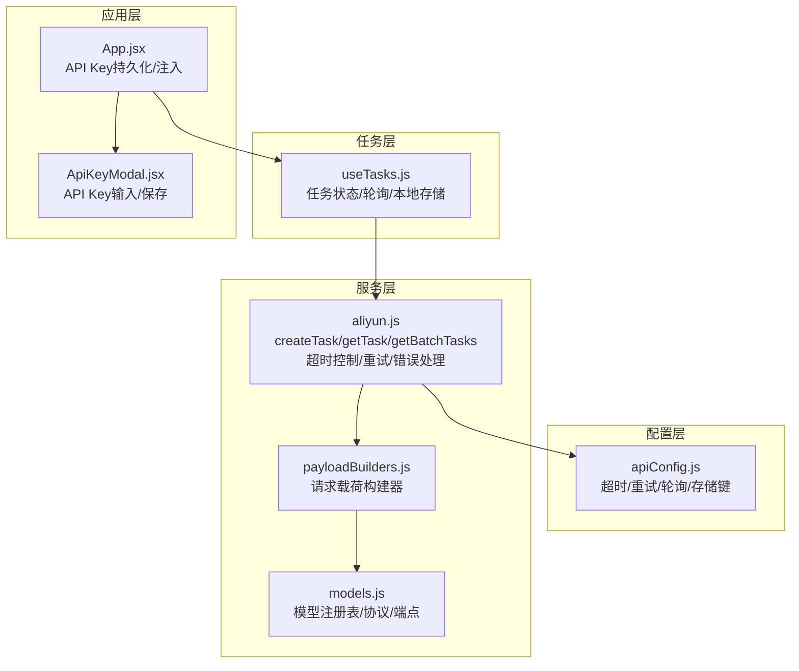
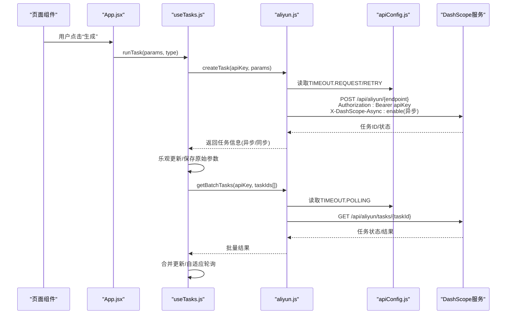
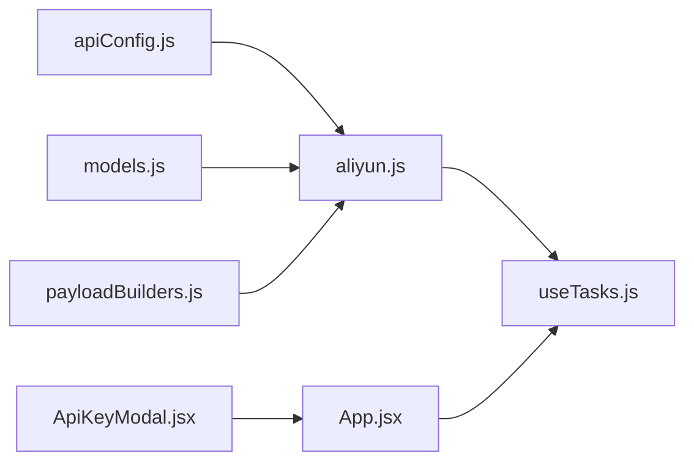

# API配置

<cite>
**本文引用的文件**
- [apiConfig.js](file://src/config/apiConfig.js)
- [aliyun.js](file://src/services/aliyun.js)
- [useTasks.js](file://src/hooks/useTasks.js)
- [models.js](file://src/config/models.js)
- [payloadBuilders.js](file://src/services/payloadBuilders.js)
- [App.jsx](file://src/App.jsx)
- [ApiKeyModal.jsx](file://src/components/ApiKeyModal.jsx)
</cite>

## 目录
1. [简介](#简介)
2. [项目结构](#项目结构)
3. [核心组件](#核心组件)
4. [架构总览](#架构总览)
5. [详细组件分析](#详细组件分析)
6. [依赖关系分析](#依赖关系分析)
7. [性能考量](#性能考量)
8. [故障排除指南](#故障排除指南)
9. [结论](#结论)
10. [附录](#附录)

## 简介
本文件面向通义万相前端应用的API配置系统，围绕配置常量与策略、与阿里云DashScope服务的集成、任务管理系统的性能与可靠性保障、以及调优与故障排除方法展开。重点覆盖以下方面：
- API配置参数与策略：超时、重试、轮询、存储键位
- 与DashScope服务的集成：认证、请求头、响应处理
- 任务管理系统：轮询策略、最大重试次数、超时阈值、缓存策略
- 调优指南：网络环境与业务需求下的参数调整建议
- 验证、监控与故障排除

## 项目结构
API配置系统主要由以下模块构成：
- 配置层：集中定义API基础地址、超时、重试、轮询、存储键位
- 服务层：封装与DashScope交互的统一方法，含超时控制、重试与错误处理
- 任务层：基于React Hook的本地任务状态管理与轮询调度
- 模型与载荷：模型注册表与请求载荷构建器，驱动不同协议与格式
- 应用层：入口组件负责读取与持久化API Key，并将API Key注入任务流程

图表来源
- [apiConfig.js](file://src/config/apiConfig.js#L1-L35)
- [aliyun.js](file://src/services/aliyun.js#L1-L215)
- [useTasks.js](file://src/hooks/useTasks.js#L1-L333)
- [models.js](file://src/config/models.js#L1-L1012)
- [payloadBuilders.js](file://src/services/payloadBuilders.js#L1-L829)
- [App.jsx](file://src/App.jsx#L1-L377)
- [ApiKeyModal.jsx](file://src/components/ApiKeyModal.jsx#L1-L111)

章节来源
- [apiConfig.js](file://src/config/apiConfig.js#L1-L35)
- [aliyun.js](file://src/services/aliyun.js#L1-L215)
- [useTasks.js](file://src/hooks/useTasks.js#L1-L333)
- [models.js](file://src/config/models.js#L1-L1012)
- [payloadBuilders.js](file://src/services/payloadBuilders.js#L1-L829)
- [App.jsx](file://src/App.jsx#L1-L377)
- [ApiKeyModal.jsx](file://src/components/ApiKeyModal.jsx#L1-L111)

## 核心组件
- API配置常量：统一管理基础URL、请求与轮询超时、重试次数与退避、轮询间隔与终止状态、本地存储键位
- DashScope服务封装：统一创建任务、轮询任务、批量轮询；内置超时竞速、重试与错误分类
- 任务Hook：乐观创建、本地存储、自适应轮询、状态变更合并更新
- 模型与载荷：模型注册表与请求格式构建器，按协议/端点/请求格式生成标准化请求
- 应用入口：API Key持久化与注入，触发任务执行

章节来源
- [apiConfig.js](file://src/config/apiConfig.js#L5-L34)
- [aliyun.js](file://src/services/aliyun.js#L50-L214)
- [useTasks.js](file://src/hooks/useTasks.js#L9-L332)
- [models.js](file://src/config/models.js#L1-L1012)
- [payloadBuilders.js](file://src/services/payloadBuilders.js#L804-L829)
- [App.jsx](file://src/App.jsx#L42-L70)

## 架构总览
下图展示从应用入口到DashScope服务的关键调用链路，以及配置参数如何影响行为。

图表来源
- [App.jsx](file://src/App.jsx#L55-L61)
- [useTasks.js](file://src/hooks/useTasks.js#L256-L312)
- [aliyun.js](file://src/services/aliyun.js#L50-L214)
- [apiConfig.js](file://src/config/apiConfig.js#L9-L19)

## 详细组件分析

### API配置参数与策略
- 基础地址：统一前缀用于代理转发至DashScope
- 超时设置：
  - 请求超时：较长时长以适配同步多模态任务
  - 轮询超时：适中时长，避免长时间阻塞
- 重试策略：
  - 最大尝试次数、初始延迟、指数退避系数
  - 对网络错误/超时进行重试，对校验错误不重试
- 轮询策略：
  - 固定间隔、初始间隔、最大间隔
  - 终止状态集合（成功/失败/取消/未知）
- 存储键位：
  - 任务列表、API Key、历史兼容键

章节来源
- [apiConfig.js](file://src/config/apiConfig.js#L6-L34)

### DashScope集成与请求处理
- 认证机制：请求头包含Bearer Token
- 异步启用：异步任务开启特定头部
- 超时控制：使用竞速Promise在指定时间内返回响应或超时
- 错误处理：
  - 网络错误/超时：包装为用户可感知的错误消息
  - 服务端错误：解析错误信息并区分模型/格式未知等场景
  - 同步/异步响应标准化：统一输出类型、任务ID、状态与结果
- 重试机制：对网络/超时错误按指数退避重试，对校验错误直接抛出

章节来源
- [aliyun.js](file://src/services/aliyun.js#L7-L11)
- [aliyun.js](file://src/services/aliyun.js#L20-L36)
- [aliyun.js](file://src/services/aliyun.js#L83-L160)
- [aliyun.js](file://src/services/aliyun.js#L170-L202)

### 任务管理系统的轮询与缓存
- 乐观创建：先插入临时任务ID，再以真实任务ID替换
- 本地存储：任务持久化，移除大字段以节省空间；容量不足时保留最近条目
- 自适应轮询：
  - 新建任务（10秒内）使用初始间隔
  - 前若干次轮询使用固定间隔
  - 长时间运行任务逐步增大轮询间隔
  - 状态变化时重置轮询计数，加速收敛
- 批量轮询：并发查询多个任务，聚合结果后一次性更新
- 结果处理：兼容标准与多模态格式，自动提取首张图片URL

章节来源
- [useTasks.js](file://src/hooks/useTasks.js#L10-L84)
- [useTasks.js](file://src/hooks/useTasks.js#L86-L104)
- [useTasks.js](file://src/hooks/useTasks.js#L106-L161)
- [useTasks.js](file://src/hooks/useTasks.js#L163-L246)
- [useTasks.js](file://src/hooks/useTasks.js#L256-L312)

### 模型与请求载荷
- 模型注册：按协议/端点/请求格式组织，决定异步/同步与输出类型
- 载荷构建器：根据模型能力与输入参数生成标准化请求体
- 协议驱动：通过模型配置与构建器解耦新增模型的成本

章节来源
- [models.js](file://src/config/models.js#L1-L1012)
- [payloadBuilders.js](file://src/services/payloadBuilders.js#L125-L150)
- [payloadBuilders.js](file://src/services/payloadBuilders.js#L514-L571)
- [payloadBuilders.js](file://src/services/payloadBuilders.js#L804-L829)

### API Key管理与注入
- 应用启动时从本地存储读取API Key
- 设置弹窗安全输入并持久化
- 任务执行前校验API Key存在性

章节来源
- [App.jsx](file://src/App.jsx#L42-L53)
- [ApiKeyModal.jsx](file://src/components/ApiKeyModal.jsx#L1-L111)
- [App.jsx](file://src/App.jsx#L55-L69)

## 依赖关系分析
- 配置依赖：服务层依赖配置常量进行超时与重试控制
- 服务依赖：服务层依赖模型注册表与载荷构建器
- 任务依赖：任务Hook依赖服务层与配置常量
- 应用依赖：应用层依赖任务Hook与API Key管理

图表来源
- [apiConfig.js](file://src/config/apiConfig.js#L1-L35)
- [aliyun.js](file://src/services/aliyun.js#L1-L215)
- [models.js](file://src/config/models.js#L1-L1012)
- [payloadBuilders.js](file://src/services/payloadBuilders.js#L1-L829)
- [useTasks.js](file://src/hooks/useTasks.js#L1-L333)
- [App.jsx](file://src/App.jsx#L1-L377)
- [ApiKeyModal.jsx](file://src/components/ApiKeyModal.jsx#L1-L111)

章节来源
- [aliyun.js](file://src/services/aliyun.js#L1-L3)
- [useTasks.js](file://src/hooks/useTasks.js#L1-L4)
- [App.jsx](file://src/App.jsx#L24-L48)

## 性能考量
- 轮询策略
  - 新任务快速轮询：初始间隔降低感知延迟
  - 长任务退让轮询：最大间隔减少对服务的压力
  - 状态变化重置：加速收敛，避免无效轮询
- 超时控制
  - 请求超时：为同步多模态预留充足时间
  - 轮询超时：避免长时间阻塞导致UI卡顿
- 重试策略
  - 指数退避：平滑缓解瞬时网络波动
  - 限制重试：避免雪崩效应
- 本地存储
  - 移除大字段：降低存储压力
  - 容量保护：超出配额时截断保留近期任务

章节来源
- [useTasks.js](file://src/hooks/useTasks.js#L86-L104)
- [useTasks.js](file://src/hooks/useTasks.js#L106-L161)
- [useTasks.js](file://src/hooks/useTasks.js#L30-L84)
- [aliyun.js](file://src/services/aliyun.js#L83-L160)
- [aliyun.js](file://src/services/aliyun.js#L170-L202)
- [apiConfig.js](file://src/config/apiConfig.js#L9-L27)

## 故障排除指南
- 常见错误与定位
  - 网络错误：检查网络连通性与代理配置
  - 超时错误：检查请求/轮询超时阈值是否合理
  - 未知模型/格式：确认模型ID与请求格式匹配
  - 同步响应异常：检查多模态输出结构与enable_interleave配置
- 重试与退避
  - 对网络/超时错误自动重试；对校验错误直接失败
  - 调整最大重试次数与初始延迟以平衡可靠性与等待时间
- 轮询与状态
  - 若状态长期不变，检查轮询间隔与最大间隔设置
  - 确认终止状态集合是否覆盖目标模型的全部状态
- 存储问题
  - 本地存储配额不足时会自动截断，必要时清理历史任务

章节来源
- [aliyun.js](file://src/services/aliyun.js#L20-L36)
- [aliyun.js](file://src/services/aliyun.js#L146-L159)
- [useTasks.js](file://src/hooks/useTasks.js#L30-L84)
- [useTasks.js](file://src/hooks/useTasks.js#L230-L233)

## 结论
本API配置系统通过集中化的配置常量与策略，结合服务层的超时控制、重试与错误处理，以及任务层的自适应轮询与本地存储，实现了对DashScope服务的可靠集成。合理的参数设置与调优能够显著提升任务管理系统的性能与用户体验。

## 附录

### API配置参数调优指南
- 网络环境
  - 高延迟/不稳定：提高请求/轮询超时阈值；适度增加初始重试延迟与最大重试次数
  - 低延迟/稳定：缩短轮询间隔与最大间隔；降低重试延迟
- 业务需求
  - 高吞吐：批量轮询与自适应轮询配合，避免过度轮询
  - 低延迟：新任务使用初始间隔，尽快反馈状态变化
  - 长任务：逐步增大轮询间隔，减少服务压力
- 参数建议
  - 超时：请求超时根据模型复杂度设定；轮询超时避免过长阻塞
  - 重试：最大重试次数与退避因子需结合SLA权衡
  - 轮询：初始/固定/最大间隔应覆盖典型任务生命周期

章节来源
- [apiConfig.js](file://src/config/apiConfig.js#L9-L27)
- [aliyun.js](file://src/services/aliyun.js#L83-L160)
- [aliyun.js](file://src/services/aliyun.js#L170-L202)
- [useTasks.js](file://src/hooks/useTasks.js#L86-L104)