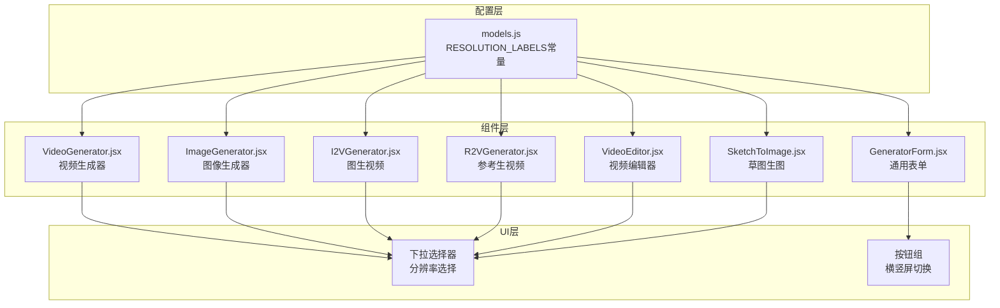
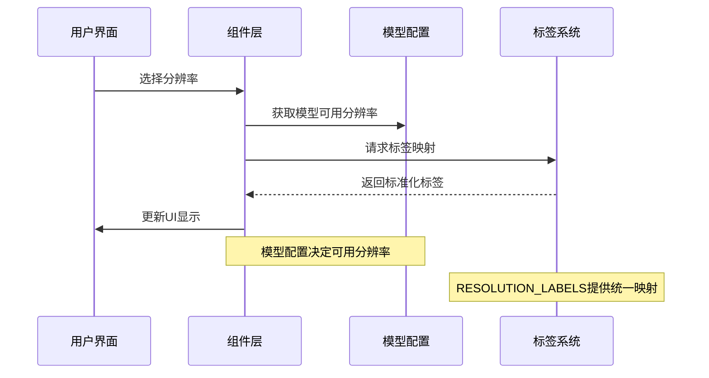
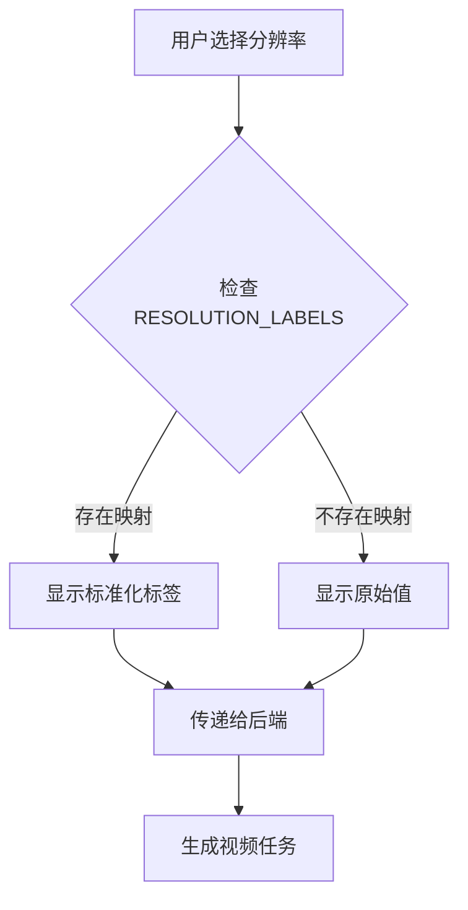
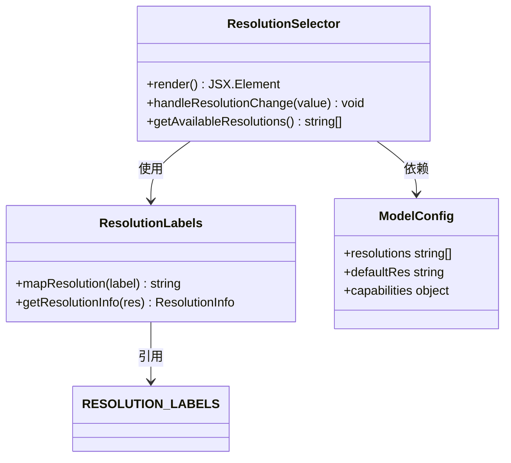
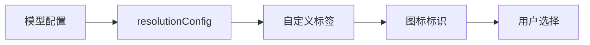
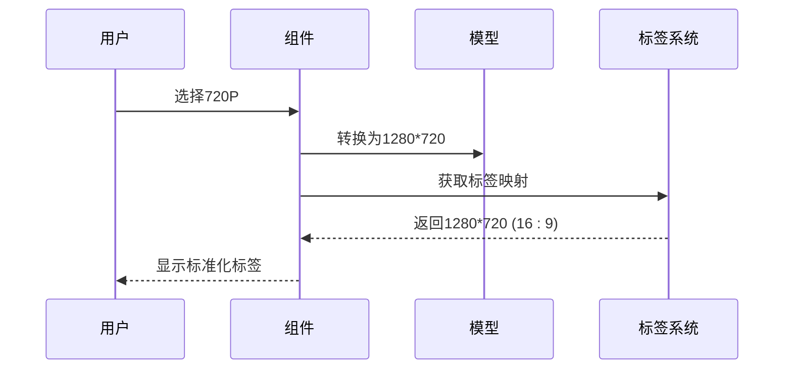
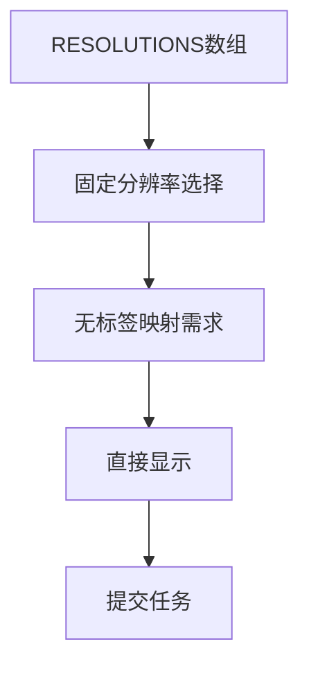
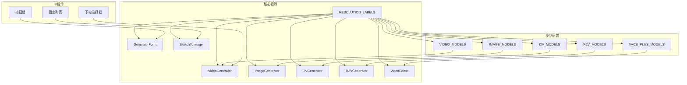

# 分辨率标签系统

<cite>
**本文档引用的文件**
- [models.js](file://src/config/models.js)
- [GeneratorForm.jsx](file://src/components/GeneratorForm.jsx)
- [VideoGenerator.jsx](file://src/components/VideoGenerator.jsx)
- [ImageGenerator.jsx](file://src/components/ImageGenerator.jsx)
- [I2VGenerator.jsx](file://src/components/I2VGenerator.jsx)
- [R2VGenerator.jsx](file://src/components/R2VGenerator.jsx)
- [VideoEditor.jsx](file://src/components/VideoEditor.jsx)
- [SketchToImage.jsx](file://src/components/SketchToImage.jsx)
</cite>

## 目录
1. [简介](#简介)
2. [项目结构](#项目结构)
3. [核心组件](#核心组件)
4. [架构概览](#架构概览)
5. [详细组件分析](#详细组件分析)
6. [依赖关系分析](#依赖关系分析)
7. [性能考量](#性能考量)
8. [故障排除指南](#故障排除指南)
9. [结论](#结论)
10. [附录](#附录)

## 简介

通义万相前端应用的分辨率标签系统是一个统一的UI配置层，负责管理所有AI模型的分辨率选项展示。该系统通过RESOLUTION_LABELS常量对象定义了标准的分辨率标签体系，涵盖了从标清到超高清的各种显示比例，包括480P（SD）、720P（HD）、1080P（FHD）以及各种常见的宽高比（16:9、9:16、1:1、3:4、4:3）。

该系统的核心设计理念是为用户提供直观、易懂的分辨率选择体验，同时确保与后端AI模型的兼容性和性能优化。通过统一的标签映射机制，用户可以轻松理解不同分辨率选项的含义和适用场景。

## 项目结构

分辨率标签系统在项目中的组织结构如下：

**图表来源**
- [models.js](file://src/config/models.js#L27-L37)
- [VideoGenerator.jsx](file://src/components/VideoGenerator.jsx#L154-L169)
- [ImageGenerator.jsx](file://src/components/ImageGenerator.jsx#L164-L181)

**章节来源**
- [models.js](file://src/config/models.js#L1-L1012)
- [VideoGenerator.jsx](file://src/components/VideoGenerator.jsx#L1-L354)
- [ImageGenerator.jsx](file://src/components/ImageGenerator.jsx#L1-L249)

## 核心组件

### RESOLUTION_LABELS常量对象

RESOLUTION_LABELS是整个分辨率标签系统的核心，它定义了标准化的分辨率标签映射：

| 键值 | 显示标签 | 实际分辨率 | 宽高比 |
|------|----------|------------|--------|
| '480P' | '480P (SD)' | 854×480 | 16:9 |
| '720P' | '720P (HD)' | 1280×720 | 16:9 |
| '1080P' | '1080P (FHD)' | 1920×1080 | 16:9 |
| '1280*720' | '1280*720 (16:9)' | 1280×720 | 16:9 |
| '720*1280' | '720*1280 (9:16)' | 720×1280 | 9:16 |
| '960*960' | '960*960 (1:1)' | 960×960 | 1:1 |
| '832*1088' | '832*1088 (3:4)' | 832×1088 | 3:4 |
| '1088*832' | '1088*832 (4:3)' | 1088×832 | 4:3 |

### 分辨率标签的设计理念

1. **标准化命名**: 使用统一的命名规则，便于理解和记忆
2. **显示格式**: 采用"数值+单位+(缩写)"的格式，提供额外的视觉识别信息
3. **宽高比标注**: 对于非标准分辨率，明确标注宽高比
4. **向后兼容**: 支持传统的P制式和现代的像素制式

**章节来源**
- [models.js](file://src/config/models.js#L27-L37)

## 架构概览

分辨率标签系统采用分层架构设计，确保了良好的可维护性和扩展性：

**图表来源**
- [models.js](file://src/config/models.js#L27-L37)
- [VideoGenerator.jsx](file://src/components/VideoGenerator.jsx#L154-L169)

## 详细组件分析

### 视频生成器组件

视频生成器组件展示了最完整的分辨率标签使用方式：

**图表来源**
- [VideoGenerator.jsx](file://src/components/VideoGenerator.jsx#L154-L169)
- [models.js](file://src/config/models.js#L27-L37)

在视频生成器中，分辨率选择器通过以下方式集成标签系统：
- 使用RESOLUTION_LABELS进行标签映射
- 支持动态更新当前模型的可用分辨率
- 自动处理分辨率兼容性问题

**章节来源**
- [VideoGenerator.jsx](file://src/components/VideoGenerator.jsx#L154-L169)

### 图像生成器组件

图像生成器组件采用了更加丰富的UI设计：

**图表来源**
- [ImageGenerator.jsx](file://src/components/ImageGenerator.jsx#L164-L181)
- [models.js](file://src/config/models.js#L27-L37)

图像生成器的特点：
- 提供下拉选择器和按钮组两种交互方式
- 支持横屏和竖屏的直观区分
- 集成图标和颜色标识增强用户体验

**章节来源**
- [ImageGenerator.jsx](file://src/components/ImageGenerator.jsx#L164-L181)

### 通用表单组件

通用表单组件展示了自定义分辨率配置的能力：

**图表来源**
- [GeneratorForm.jsx](file://src/components/GeneratorForm.jsx#L45-L53)

通用表单的特色：
- 支持每个模型独立的分辨率配置
- 提供自定义标签和图标
- 实现分辨率与模型的动态绑定

**章节来源**
- [GeneratorForm.jsx](file://src/components/GeneratorForm.jsx#L45-L65)

### 参考生视频组件

参考生视频组件展示了特殊的分辨率处理逻辑：

**图表来源**
- [R2VGenerator.jsx](file://src/components/R2VGenerator.jsx#L152-L167)

参考生视频的特殊处理：
- 将720P映射为1280×720
- 将1080P映射为1920×1080
- 保持标签系统的统一性

**章节来源**
- [R2VGenerator.jsx](file://src/components/R2VGenerator.jsx#L152-L167)

### 草图生图组件

草图生图组件展示了固定分辨率列表的使用：

**图表来源**
- [SketchToImage.jsx](file://src/components/SketchToImage.jsx#L29-L29)

草图生图的特点：
- 使用固定的分辨率列表
- 不需要复杂的标签映射
- 简化的用户界面

**章节来源**
- [SketchToImage.jsx](file://src/components/SketchToImage.jsx#L29-L29)

## 依赖关系分析

分辨率标签系统与其他组件的依赖关系如下：

**图表来源**
- [models.js](file://src/config/models.js#L27-L37)
- [VideoGenerator.jsx](file://src/components/VideoGenerator.jsx#L1-L354)
- [ImageGenerator.jsx](file://src/components/ImageGenerator.jsx#L1-L249)

**章节来源**
- [models.js](file://src/config/models.js#L1-L1012)

## 性能考量

### 渲染性能优化

1. **标签缓存**: RESOLUTION_LABELS作为常量对象，避免重复计算
2. **条件渲染**: 仅在需要时进行标签映射
3. **事件优化**: 合理的事件处理机制减少不必要的重渲染

### 内存使用优化

1. **单一数据源**: 所有组件共享RESOLUTION_LABELS常量
2. **避免重复存储**: 不同组件间共享分辨率配置信息
3. **及时清理**: 组件卸载时清理相关状态

### 用户体验优化

1. **即时反馈**: 选择分辨率时立即显示对应标签
2. **错误处理**: 当分辨率不兼容时提供清晰的错误提示
3. **默认值设置**: 智能设置合理的默认分辨率

## 故障排除指南

### 常见问题及解决方案

#### 问题1: 分辨率标签显示异常
**症状**: 分辨率选项显示为原始值而非标准化标签
**原因**: RESOLUTION_LABELS中缺少对应的映射
**解决**: 检查并补充缺失的标签映射

#### 问题2: 分辨率不可用
**症状**: 选择的分辨率在某些模型中不可用
**原因**: 模型配置不支持该分辨率
**解决**: 自动切换到模型支持的默认分辨率

#### 问题3: 宽高比显示错误
**症状**: 16:9和9:16显示颠倒
**原因**: 分辨率值与宽高比标注不匹配
**解决**: 检查分辨率值的宽高顺序

**章节来源**
- [VideoGenerator.jsx](file://src/components/VideoGenerator.jsx#L55-L61)
- [ImageGenerator.jsx](file://src/components/ImageGenerator.jsx#L22-L26)

## 结论

通义万相的分辨率标签系统通过统一的RESOLUTION_LABELS常量对象，实现了跨组件的一致性分辨率管理。该系统不仅提供了直观的用户界面，还确保了与后端AI模型的良好兼容性。

系统的主要优势包括：
- **统一性**: 所有组件共享相同的标签映射规则
- **可扩展性**: 易于添加新的分辨率选项
- **用户体验**: 提供清晰的分辨率选择指导
- **性能优化**: 通过常量对象和条件渲染优化性能

未来可以考虑的改进方向：
- 添加更多分辨率选项的支持
- 增强分辨率选择的可视化指导
- 实现分辨率历史记录功能
- 提供分辨率性能影响的实时反馈

## 附录

### 分辨率兼容性矩阵

| 模型类别 | 支持分辨率 | 默认分辨率 | 适用场景 |
|----------|------------|------------|----------|
| 文生视频 | 480P, 720P, 1080P | 1080P | 一般视频生成 |
| 图生视频 | 480P, 720P, 1080P | 1080P | 图像转视频 |
| 参考生视频 | 720P, 1080P | 1080P | 角色参考生成 |
| 视频编辑 | 1280*720, 720*1280, 960*960, 832*1088, 1088*832 | 1280*720 | 视频编辑处理 |
| 图像生成 | 多种自定义分辨率 | 1280*1280 | 高质量图像生成 |

### 最佳实践建议

1. **统一命名规范**: 始终使用RESOLUTION_LABELS进行标签映射
2. **向后兼容**: 新增分辨率时保持向后兼容性
3. **用户体验**: 提供清晰的分辨率说明和示例
4. **性能监控**: 定期检查分辨率选择的性能表现
5. **测试覆盖**: 确保所有分辨率选项都有相应的测试用例