# 协议常量定义

<cite>
**本文档引用的文件**
- [models.js](file://src/config/models.js)
- [payloadBuilders.js](file://src/services/payloadBuilders.js)
- [aliyun.js](file://src/services/aliyun.js)
- [useTasks.js](file://src/hooks/useTasks.js)
- [apiConfig.js](file://src/config/apiConfig.js)
- [VideoGenerator.jsx](file://src/components/VideoGenerator.jsx)
- [ImageGenerator.jsx](file://src/components/ImageGenerator.jsx)
</cite>

## 目录
1. [简介](#简介)
2. [项目结构概览](#项目结构概览)
3. [核心协议常量系统](#核心协议常量系统)
4. [协议架构设计](#协议架构设计)
5. [详细协议分析](#详细协议分析)
6. [同步与异步协议对比](#同步与异步协议对比)
7. [协议配置最佳实践](#协议配置最佳实践)
8. [扩展指南](#扩展指南)
9. [性能考虑](#性能考虑)
10. [故障排除指南](#故障排除指南)
11. [总结](#总结)

## 简介

通义万相前端应用的协议常量系统是整个AI模型通信架构的核心基础设施。该系统通过标准化的协议定义，实现了对多种AI模型类型的统一管理和灵活调度，包括同步多模态、异步文生图、异步视频生成、异步图生视频、异步参考视频、异步视频编辑统一模型和异步语音生视频等多种协议类型。

该协议系统采用配置驱动的设计理念，通过PROTOCOLS常量对象统一管理所有协议标识符，配合模型配置、负载构建器和服务层实现完整的AI模型通信流程。

## 项目结构概览

协议常量系统在项目中的组织结构如下：

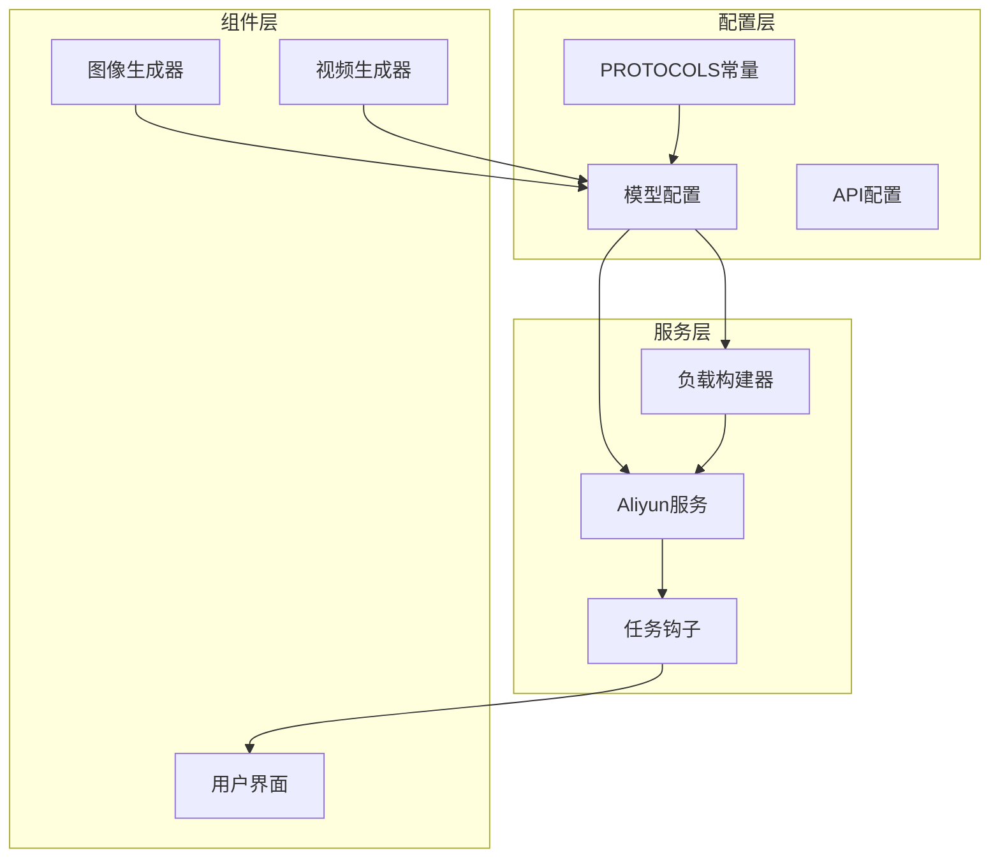

**图表来源**
- [models.js](file://src/config/models.js#L1-L10)
- [aliyun.js](file://src/services/aliyun.js#L1-L50)
- [payloadBuilders.js](file://src/services/payloadBuilders.js#L1-L50)

**章节来源**
- [models.js](file://src/config/models.js#L1-L10)
- [apiConfig.js](file://src/config/apiConfig.js#L1-L35)

## 核心协议常量系统

### PROTOCOLS常量定义

PROTOCOLS常量对象定义了系统支持的所有AI模型通信协议：

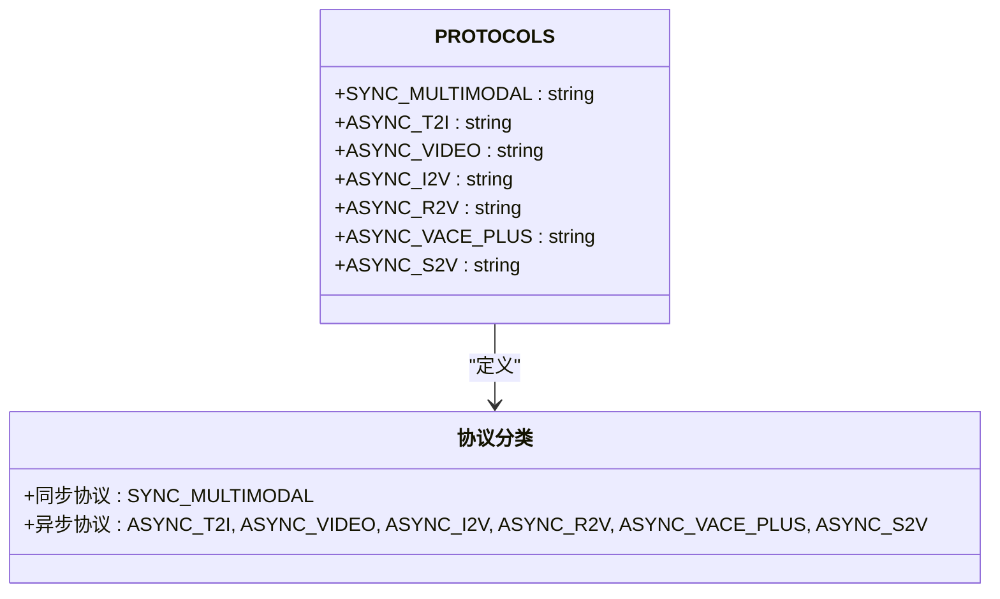

**图表来源**
- [models.js](file://src/config/models.js#L2-L10)

### 协议分类体系

协议系统按照功能特性分为两大类别：

| 协议类型 | 协议标识 | 功能特性 | 使用场景 |
|---------|----------|----------|----------|
| 同步协议 | SYNC_MULTIMODAL | 实时响应，无需轮询 | 多模态交互、即时反馈 |
| 异步协议 | ASYNC_T2I | 文生图任务 | 图像生成、批量处理 |
| 异步协议 | ASYNC_VIDEO | 文生视频 | 视频创作、内容生成 |
| 异步协议 | ASYNC_I2V | 图生视频 | 视频编辑、特效制作 |
| 异步协议 | ASYNC_R2V | 参考视频 | 角色驱动、多镜头叙事 |
| 异步协议 | ASYNC_VACE_PLUS | 视频编辑统一模型 | 综合视频编辑 |
| 异步协议 | ASYNC_S2V | 语音驱动视频 | 数字人、虚拟主播 |

**章节来源**
- [models.js](file://src/config/models.js#L2-L10)

## 协议架构设计

### 配置驱动架构

协议系统采用配置驱动的设计模式，通过模型配置文件统一管理协议映射：

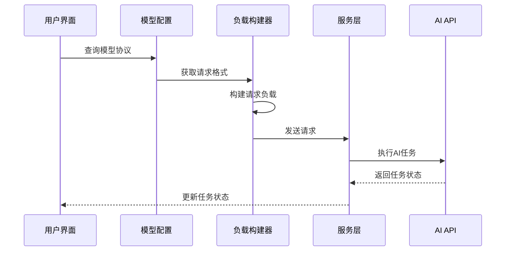

**图表来源**
- [models.js](file://src/config/models.js#L112-L134)
- [payloadBuilders.js](file://src/services/payloadBuilders.js#L515-L571)
- [aliyun.js](file://src/services/aliyun.js#L50-L160)

### 协议选择机制

系统通过以下机制实现协议的智能选择：

1. **模型能力检测**：根据模型配置的能力标志确定支持的协议
2. **请求格式映射**：将协议映射到相应的负载构建器
3. **异步状态管理**：区分同步和异步任务的处理流程
4. **错误处理机制**：统一处理各种协议相关的错误

**章节来源**
- [models.js](file://src/config/models.js#L112-L134)
- [aliyun.js](file://src/services/aliyun.js#L50-L160)

## 详细协议分析

### 同步多模态协议 (SYNC_MULTIMODAL)

#### 设计理念
SYNC_MULTIMODAL协议专为需要实时响应的多模态交互场景设计，适用于需要即时反馈的AI模型。

#### 适用模型类型
- 通义千问图像编辑系列 (qwen-image-edit-max, qwen-image-edit-plus, qwen-image-edit)
- 万相2.5图像合成 (wan2.5-i2i-preview)
- 万相2.6图像生成 (wan2.6-image)

#### 特点分析
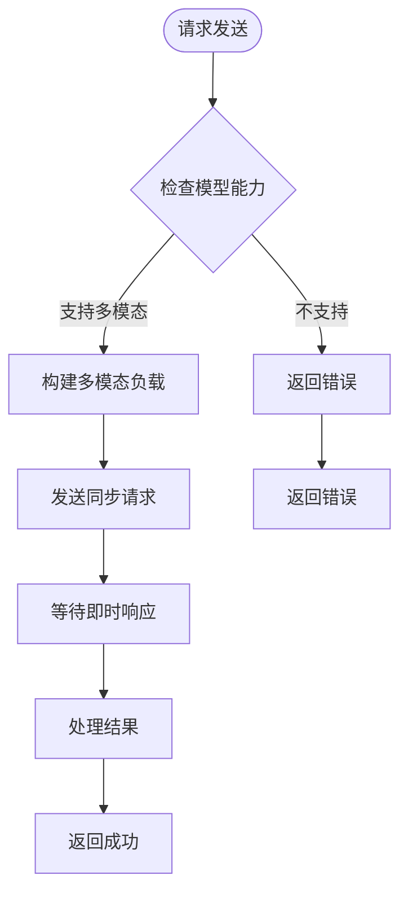

**图表来源**
- [models.js](file://src/config/models.js#L267-L327)
- [payloadBuilders.js](file://src/services/payloadBuilders.js#L125-L150)

#### 关键特性
- **实时响应**：无需轮询，即时返回结果
- **多模态支持**：支持文本、图像等多种输入格式
- **简化流程**：减少异步任务管理复杂度
- **资源友好**：避免长时间的任务状态跟踪

**章节来源**
- [models.js](file://src/config/models.js#L267-L327)
- [payloadBuilders.js](file://src/services/payloadBuilders.js#L125-L150)

### 异步文生图协议 (ASYNC_T2I)

#### 设计理念
ASYNC_T2I协议针对文生图任务的异步特性而设计，适用于需要长时间处理的图像生成任务。

#### 适用模型类型
- 万相2.1通用图像编辑 (wanx2.1-imageedit)
- 通义千问图像翻译 (qwen-mt-image)
- 万相2.6图像生成 (wan2.6-image)

#### 特点分析
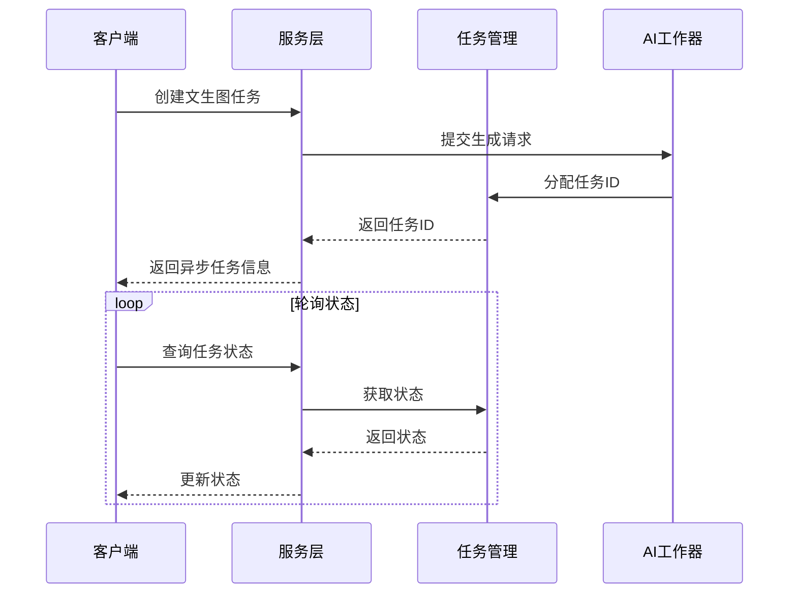

**图表来源**
- [models.js](file://src/config/models.js#L330-L359)
- [aliyun.js](file://src/services/aliyun.js#L121-L145)

#### 关键特性
- **异步处理**：支持长时间的图像生成任务
- **任务跟踪**：完整的任务生命周期管理
- **批量生成**：支持多张图像的批量生成
- **状态监控**：实时的任务状态跟踪

**章节来源**
- [models.js](file://src/config/models.js#L330-L359)
- [aliyun.js](file://src/services/aliyun.js#L121-L145)

### 异步视频生成协议 (ASYNC_VIDEO)

#### 设计理念
ASYNC_VIDEO协议专门用于文生视频任务，支持从文本描述生成视频内容的复杂AI模型。

#### 适用模型类型
- 万相2.1专业版 (wanx2.1-t2v-plus)
- 万相2.2极速版 (wan2.2-t2v-plus)
- 万相2.5预览版 (wan2.5-t2v-preview)

#### 特点分析
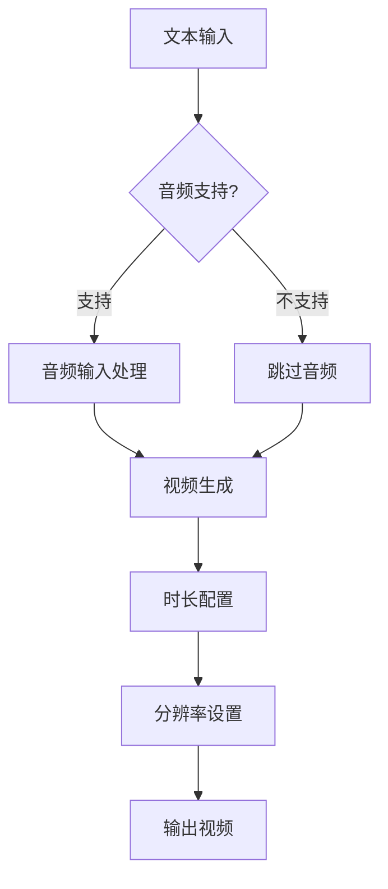

**图表来源**
- [models.js](file://src/config/models.js#L118-L134)
- [payloadBuilders.js](file://src/services/payloadBuilders.js#L515-L571)

#### 关键特性
- **音频集成**：支持音频驱动的视频生成
- **时长控制**：灵活的视频时长配置
- **分辨率适配**：多种分辨率格式支持
- **镜头类型**：支持单镜头和多镜头模式

**章节来源**
- [models.js](file://src/config/models.js#L118-L134)
- [payloadBuilders.js](file://src/services/payloadBuilders.js#L515-L571)

### 异步图生视频协议 (ASYNC_I2V)

#### 设计理念
ASYNC_I2V协议专注于图像到视频的转换任务，支持基于静态图像生成动态视频内容。

#### 适用模型类型
- 万相2.5图生视频 (wan2.5-i2v-preview)
- 万相2.2图生视频 (wan2.2-i2v-flash)
- 万相2.6图生视频 (wan2.6-i2v, wan2.6-i2v-flash)

#### 特点分析
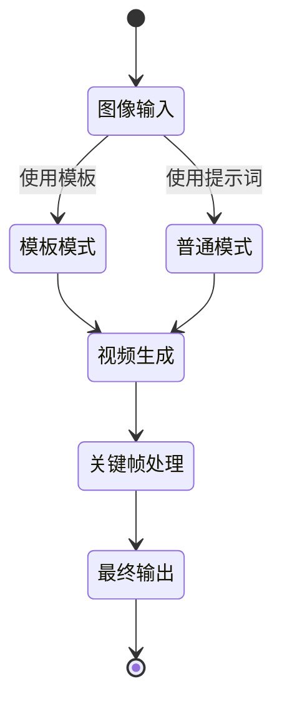

**图表来源**
- [models.js](file://src/config/models.js#L180-L215)
- [payloadBuilders.js](file://src/services/payloadBuilders.js#L577-L643)

#### 关键特性
- **模板支持**：支持预设视频效果模板
- **关键帧技术**：支持首尾帧驱动的视频生成
- **多模式切换**：模板模式和普通模式自由切换
- **特效集成**：内置丰富的视频特效库

**章节来源**
- [models.js](file://src/config/models.js#L180-L215)
- [payloadBuilders.js](file://src/services/payloadBuilders.js#L577-L643)

### 异步参考视频协议 (ASYNC_R2V)

#### 设计理念
ASYNC_R2V协议专为参考视频驱动的视频生成任务设计，支持基于现有视频内容生成新的视频。

#### 适用模型类型
- 万相2.6参考视频 (wan2.6-r2v)

#### 特点分析
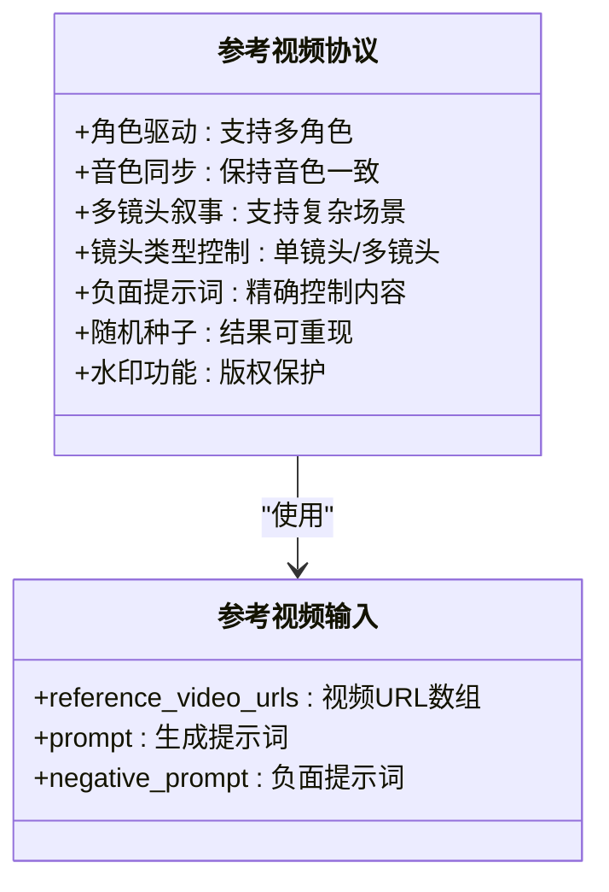

**图表来源**
- [models.js](file://src/config/models.js#L220-L239)
- [payloadBuilders.js](file://src/services/payloadBuilders.js#L649-L665)

#### 关键特性
- **角色驱动**：支持基于参考视频的角色生成
- **音色同步**：保持说话音色的一致性
- **多镜头叙事**：支持复杂的多镜头场景
- **精细控制**：全面的生成参数控制

**章节来源**
- [models.js](file://src/config/models.js#L220-L239)
- [payloadBuilders.js](file://src/services/payloadBuilders.js#L649-L665)

### 异步视频编辑统一模型 (ASYNC_VACE_PLUS)

#### 设计理念
ASYNC_VACE_PLUS协议代表了通义万相视频编辑的统一解决方案，集成了多种视频编辑功能。

#### 适用模型类型
- 万相2.1视频编辑 (wanx2.1-vace-plus)

#### 特点分析
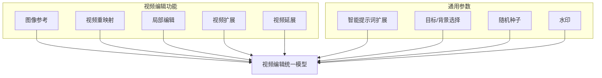

**图表来源**
- [models.js](file://src/config/models.js#L242-L262)
- [payloadBuilders.js](file://src/services/payloadBuilders.js#L671-L709)

#### 关键特性
- **功能集成**：多种视频编辑功能一体化
- **智能扩展**：自动扩展提示词以提高质量
- **目标选择**：精确选择编辑对象或背景
- **参数统一**：统一的参数控制接口

**章节来源**
- [models.js](file://src/config/models.js#L242-L262)
- [payloadBuilders.js](file://src/services/payloadBuilders.js#L671-L709)

### 异步语音生视频协议 (ASYNC_S2V)

#### 设计理念
ASYNC_S2V协议专门用于语音驱动的视频生成，支持基于音频内容生成对应的视频。

#### 适用模型类型
- 数字人语音驱动 (wan2.2-s2v)

#### 特点分析
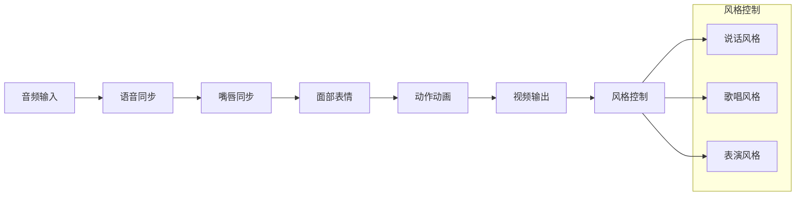

**图表来源**
- [models.js](file://src/config/models.js#L810-L830)
- [payloadBuilders.js](file://src/services/payloadBuilders.js#L729-L742)

#### 关键特性
- **语音同步**：精确的语音驱动
- **嘴唇同步**：自然的口型同步
- **面部表情**：丰富的表情控制
- **动作动画**：流畅的动作生成
- **风格多样**：支持多种表演风格

**章节来源**
- [models.js](file://src/config/models.js#L810-L830)
- [payloadBuilders.js](file://src/services/payloadBuilders.js#L729-L742)

## 同步与异步协议对比

### 协议选择决策树

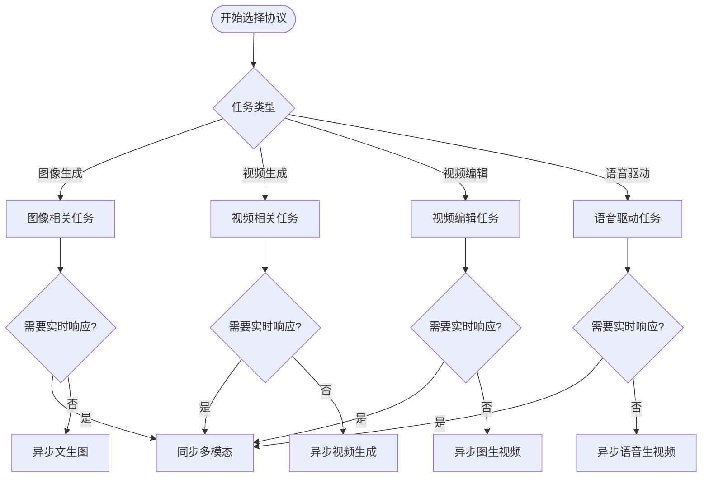

### 性能对比分析

| 协议类型 | 响应时间 | 资源消耗 | 复杂度 | 适用场景 |
|---------|----------|----------|--------|----------|
| 同步多模态 | 即时 | 低 | 简单 | 实时交互、多模态 |
| 异步文生图 | 长时间 | 中等 | 中等 | 图像生成、批量处理 |
| 异步视频生成 | 长时间 | 高 | 复杂 | 视频创作、内容生成 |
| 异步图生视频 | 长时间 | 高 | 复杂 | 视频编辑、特效制作 |
| 异步参考视频 | 长时间 | 高 | 复杂 | 角色驱动、多镜头 |
| 异步视频编辑 | 长时间 | 高 | 复杂 | 综合视频编辑 |
| 异步语音生视频 | 长时间 | 高 | 复杂 | 数字人、虚拟主播 |

**章节来源**
- [models.js](file://src/config/models.js#L1-L10)
- [aliyun.js](file://src/services/aliyun.js#L121-L145)

## 协议配置最佳实践

### 模型配置规范

每个模型的协议配置应遵循以下规范：

1. **协议标识**：使用PROTOCOLS常量确保一致性
2. **请求格式**：对应正确的负载构建器名称
3. **输出类型**：明确指定图像或视频输出
4. **能力声明**：准确声明支持的功能特性
5. **端点配置**：使用标准化的API端点路径

### 负载构建器设计原则

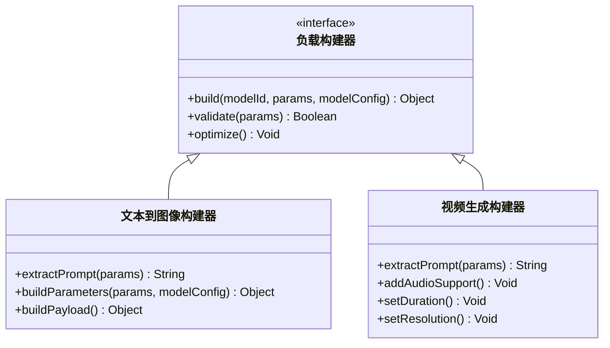

**图表来源**
- [payloadBuilders.js](file://src/services/payloadBuilders.js#L125-L150)
- [payloadBuilders.js](file://src/services/payloadBuilders.js#L515-L571)

### 错误处理策略

协议系统的错误处理应包括：

1. **验证错误**：参数验证失败的处理
2. **网络错误**：连接和超时的处理
3. **业务错误**：API返回的业务逻辑错误
4. **重试机制**：指数退避的重试策略

**章节来源**
- [payloadBuilders.js](file://src/services/payloadBuilders.js#L125-L150)
- [aliyun.js](file://src/services/aliyun.js#L20-L36)

## 扩展指南

### 添加新协议类型

要添加新的协议类型，需要遵循以下步骤：

1. **定义协议常量**：在PROTOCOLS对象中添加新协议标识
2. **配置模型支持**：在相应模型配置中设置协议类型
3. **实现负载构建器**：创建对应的请求格式构建器
4. **更新服务层**：在服务层中处理新协议的特殊需求
5. **测试验证**：确保新协议的正确性和稳定性

### 协议扩展架构

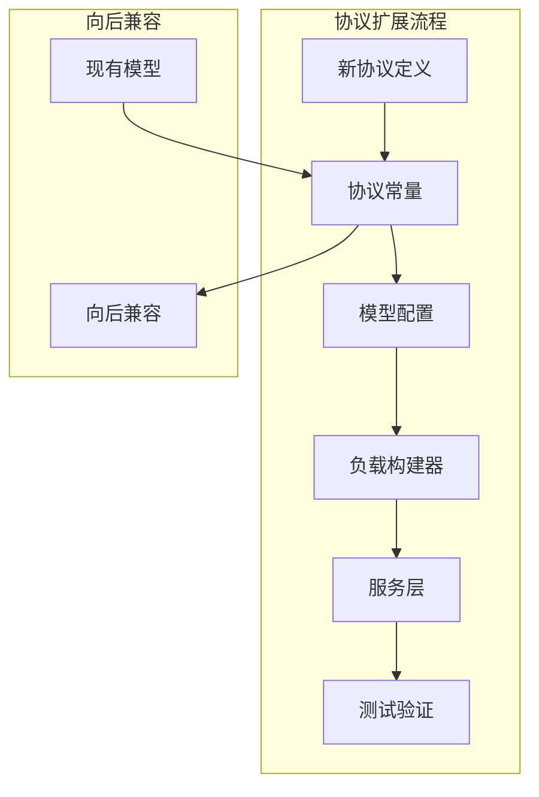

### 最佳实践建议

1. **命名规范**：使用清晰的协议命名约定
2. **文档同步**：及时更新相关技术文档
3. **测试覆盖**：确保新协议的充分测试
4. **性能监控**：建立新协议的性能监控机制
5. **错误日志**：完善新协议的错误处理和日志记录

**章节来源**
- [models.js](file://src/config/models.js#L1-L10)
- [payloadBuilders.js](file://src/services/payloadBuilders.js#L1-L50)

## 性能考虑

### 轮询策略优化

系统采用了智能的轮询策略来优化异步任务的性能：

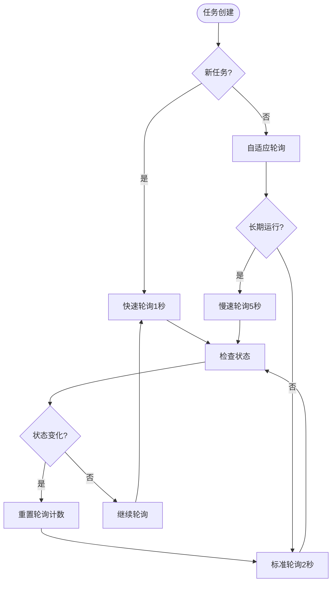

### 内存管理策略

1. **本地存储优化**：限制任务历史的数量和大小
2. **Base64数据清理**：自动移除大体积的Base64数据
3. **状态缓存控制**：合理控制活跃任务的数量
4. **资源释放**：及时清理不再使用的定时器和引用

**章节来源**
- [useTasks.js](file://src/hooks/useTasks.js#L87-L104)
- [useTasks.js](file://src/hooks/useTasks.js#L31-L84)

## 故障排除指南

### 常见问题诊断

| 问题类型 | 症状 | 可能原因 | 解决方案 |
|---------|------|----------|----------|
| 协议不支持 | 报告未知协议 | 模型配置错误 | 检查模型协议设置 |
| 负载构建失败 | 参数验证错误 | 输入参数不正确 | 验证输入格式和类型 |
| 异步任务超时 | 任务长时间无响应 | 网络连接问题 | 检查网络状态和API可用性 |
| 同步响应异常 | 即时响应失败 | API返回格式错误 | 检查API响应结构 |
| 轮询状态异常 | 状态查询失败 | 任务ID无效 | 验证任务ID和权限 |

### 调试工具和技巧

1. **开发环境日志**：启用详细的调试日志输出
2. **网络请求监控**：使用浏览器开发者工具监控API请求
3. **状态跟踪**：实现完整的任务状态跟踪机制
4. **错误边界**：建立完善的错误处理和恢复机制

**章节来源**
- [aliyun.js](file://src/services/aliyun.js#L74-L81)
- [aliyun.js](file://src/services/aliyun.js#L102-L116)

## 总结

通义万相前端应用的协议常量系统通过精心设计的架构，成功实现了对多种AI模型类型的统一管理和灵活调度。该系统的主要优势包括：

1. **统一抽象**：通过PROTOCOLS常量对象实现了协议的标准化
2. **配置驱动**：采用配置驱动的设计模式，便于扩展和维护
3. **智能选择**：根据模型能力和使用场景自动选择合适的协议
4. **性能优化**：实现了智能轮询和资源管理策略
5. **错误处理**：建立了完善的错误处理和恢复机制

该协议系统为通义万相应用提供了强大的AI模型通信能力，支持从简单的图像生成到复杂的视频编辑等各种应用场景。通过遵循本文档的最佳实践和扩展指南，开发者可以轻松地为系统添加新的协议类型和AI模型，进一步提升应用的功能性和用户体验。